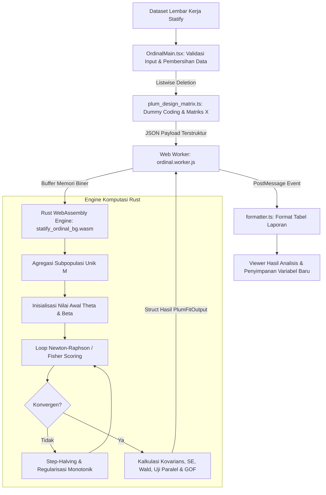

# Dokumentasi Modul Regresi Ordinal (PLUM) — Statify Engine

Dokumentasi ini menyajikan panduan komprehensif mengenai **Modul Regresi Ordinal (Polytomous Logit Universal Models / PLUM)** pada **Statify**. Struktur dokumen ini dirancang berjenjang:
1. **Bagian Konseptual & Panduan Pengguna**: Ditujukan bagi pengguna awam, praktisi data, mahasiswa, dan peneliti agar memahami konsep, asumsi, alur kerja antarmuka (UI), hingga interpretasi tabel hasil output.
2. **Bagian Arsitektur & Rekayasa Perangkat Lunak**: Ditujukan bagi pengembang sistem (*software engineer / data engineer*) berikutnya yang ingin memahami struktur kode, pipeline data TypeScript ke Rust WebAssembly, stabilitas numerik, hingga pemeliharaan sistem.

---

## DAFTAR ISI
1. [Ringkasan Eksekutif & Konsep Dasar (Untuk Orang Awam & Peneliti)](#1-ringkasan-eksekutif--konsep-dasar)
2. [Panduan Pengguna Antarmuka (UI / Dialog Flow)](#2-panduan-pengguna-antarmuka-ui--dialog-flow)
3. [Arsitektur Sistem & Alur Komputasi Klien (Client-Side WASM)](#3-arsitektur-sistem--alur-komputasi-klien)
4. [Struktur File & Modul Kode](#4-struktur-file--modul-kode)
5. [Formulasi Matematika & Algoritma Numerik (PLUM Engine)](#5-formulasi-matematika--algoritma-numerik)
6. [Interpretasi Tabel Output & Uji Hipotesis](#6-interpretasi-tabel-output--uji-hipotesis)
7. [Daftar Pesan Validasi & Penanganan Error](#7-daftar-pesan-validasi--penanganan-error)
8. [Panduan Pemeliharaan & Pengembangan Selanjutnya (Developer Guide)](#8-panduan-pemeliharaan--pengembangan-selanjutnya)
9. [Glosarium Istilah](#9-glosarium-istilah)

---

## 1. Ringkasan Eksekutif & Konsep Dasar

### 1.1 Apa Itu Regresi Ordinal?
Dalam penelitian nyata, variabel respon sering kali berupa data kategorik yang memiliki **peringkat / tingkatan alami** (*natural ordering*), namun jarak antarkategori tidak dapat diukur secara pasti atau tidak berjarak sama.

**Contoh nyata:**
- **Derajat Keparahan Penyakit**: Ringan ($1$), Sedang ($2$), Berat ($3$), Kritis ($4$).
- **Survei Kepuasan (Skala Likert)**: Sangat Tidak Puas ($1$), Tidak Puas ($2$), Netral ($3$), Puas ($4$), Sangat Puas ($5$).
- **Status Ekonomi Rumah Tangga**: Rendah ($1$), Menengah ($2$), Tinggi ($3$).

### 1.2 Mengapa Bukan Regresi Linear (OLS) atau Regresi Multinomial Biasa?
- **Regresi Linear Biasa (OLS)**: Mengasumsikan jarak antara skor 1 ke 2 sama persis dengan jarak 4 ke 5. Asumsi ini sering salah pada data ordinal, memicu prediksi peluang di luar rentang sah $[0, 1]$, dan melanggar asumsi varians konstan (heteroskedastisitas).
- **Regresi Multinomial (Nominal)**: Menganggap semua kategori independen tanpa urutan (seperti warna: merah, kuning, hijau). Akibatnya, informasi pemeringkatan hilang, parameter yang diestimasi terlalu banyak ($J-1$ set slope), dan uji statistik kehilangan kekuatan (*power*).
- **Regresi Ordinal PLUM (Solusi Terbaik)**: Menggunakan pendekatan **Cumulative Link Models**. Memodelkan peluang kumulatif bahwa respon berada pada atau di bawah suatu tingkatan, menghasilkan satu set parameter pengaruh yang ringkas, kuat, dan mudah ditafsirkan.

### 1.3 Asumsi Garis Paralel (*Parallel Lines / Proportional Odds*)
Model regresi ordinal standar mengasumsikan bahwa pengaruh variabel prediktor bersifat **sama (paralel)** di setiap belahan kategori kumulatif. Hanya nilai ambang batas (*threshold/cutpoint*) yang bergeser ke kanan/kiri. Asumsi ini diuji secara otomatis melalui **Test of Parallel Lines**.

---

## 2. Panduan Pengguna Antarmuka (UI / Dialog Flow)

Modal dialog Regresi Ordinal di Statify diakses melalui menu:  
`Analyze > Regression > Ordinal...`

Antarmuka terdiri dari 4 tab fungsional aktif:

```
┌────────────────────────────────────────────────────────────────────────┐
│  Ordinal Regression                                                [X] │
├────────────────────────────────────────────────────────────────────────┤
│  [ Variables ]   [ Location ]   [ Options ]   [ Output ]               │
│                                                                        │
│  • Dependent (Response)  : Pilih variabel ordinal (min. 3 kategori)    │
│  • Factor(s)             : Variabel independen kategorik (nominal)     │
│  • Covariate(s)          : Variabel independen kontinu (skala/rasio)   │
│                                                                        │
│  Link Function: [ Logit                                            ▼ ] │
├────────────────────────────────────────────────────────────────────────┤
│  (?) Panduan Fitur               [ Batal ]   [ Reset ]   [    OK    ]  │
└────────────────────────────────────────────────────────────────────────┘
```

### 2.1 Tab "Variables"
1. **Dependent Variable**: Pilih variabel respon ordinal bertipe numerik atau string terurut. Minimal harus memiliki **3 kategori unik**.
2. **Factor(s)**: Variabel independen kategorik (misal: Jenis Kelamin, Kelompok Perlakuan). Sistem secara otomatis mengonversinya menjadi variabel boneka (*dummy variables*) dengan level tertinggi sebagai kategori referensi.
3. **Covariate(s)**: Variabel independen numerik kontinu (misal: Usia, Tekanan Darah, Pendapatan).
4. **Link Function Dropdown**: Pilihan fungsi tautan langsung dari tab utama (default: *Logit*).

> **PENTING:** Satu variabel tidak boleh dimasukkan sekaligus ke dalam kelompok *Factors* dan *Covariates*.

### 2.2 Tab "Location"
Mengatur komponen model lokasi (apakah model hanya memuat efek utama (*main effects*) atau menyertakan interaksi antarvariabel).
- Pengguna dapat membuat suku interaksi (*Interaction Terms*), misalnya `Perlakuan * Dosis`.
- Interaksi wajib melibatkan minimal 2 variabel yang sah dan bukan variabel respon.

### 2.3 Tab "Options"
Pengaturan parameter estimasi numerik:
- **Link Function**:
  - `Logit`: Digunakan untuk kategori yang tersebar merata (default).
  - `Probit`: Digunakan jika variabel laten berdistribusi normal baku.
  - `Complementary Log-Log (CLogLog)`: Digunakan jika kategori tingkatan tinggi mendominasi (skewness kanan).
  - `Negative Log-Log`: Digunakan jika kategori tingkatan rendah mendominasi (skewness kiri).
  - `Cauchit`: Digunakan jika data memiliki ekor tebal (*heavy tails*) atau pencilan ekstrem.
- **Toleransi Konvergensi**: Batas perubahan log-likelihood ($10^{-8}$) dan perubahan parameter ($10^{-6}$).
- **Maksimum Iterasi**: Batas loop algoritma (default: 100 iterasi).
- **Maksimum Step-Halving**: Batas pemotongan langkah jika terjadi divergensi (default: 5).
- **Selang Kepercayaan (CI)**: Default 95%.

### 2.4 Tab "Output"
Pengaturan statistik dan tabel luaran:
- **Tampilan Tabel**: *Goodness-of-Fit*, *Model Fitting Information*, *Parameter Estimates*, *Test of Parallel Lines*, *Summary Statistics*, *Cell Information*, *Asymptotic Correlation/Covariance*, serta *Iteration History*.
- **Save Variables (Simpan ke Lembar Data)**:
  - `Predicted Response Category`: Menyimpan kategori hasil prediksi ke kolom baru `PRE_1`.
  - `Estimated Response Probabilities`: Menyimpan kolom peluang tiap kategori (`EST1_1`, `EST2_1`, dst.).
  - `Predicted Category Probability`: Peluang dari kategori yang diprediksi (`PPR_1`).
  - `Actual Category Probability`: Peluang dari kategori aktual subjek (`ACP_1`).

---

## 3. Arsitektur Sistem & Alur Komputasi Klien

Statify mengadopsi prinsip **Privacy-by-Design** dan **Client-Side High Performance Computing**. Tidak ada data pengguna yang dikirim ke server cloud untuk dianalisis. Seluruh perhitungan matriks dilakukan langsung di perangkat lokal pengguna.



### Keuntungan Arsitektur Ini:
1. **Keamanan 100%**: Aman untuk data medis, keuangan, dan data pribadi sensitif (memenuhi prinsip GDPR/UU PDP).
2. **Bekerja Tanpa Internet (Offline)**: Begitu modul web terbuka, komputasi berjalan lancar tanpa kuota internet.
3. **UI Bebas Lag (60 FPS)**: Web Worker memisahkan kalkulasi berat dari thread antarmuka React.

---

## 4. Struktur File & Modul Kode

Berikut adalah pemetaan berkas pada direktori modul:  
`frontend/components/Modals/Analyze/Regression/Ordinal/`

```
├── Regresi_Ordinal_Statify.md        # Berkas Dokumentasi Resmi Modul (File Ini)
├── dialogs/                          # Komponen Antarmuka Pengguna (React + Tailwind)
│   ├── OrdinalMain.tsx               # Komponen Utama: State, Validasi, Handler Worker & Error Bahasa Indonesia
│   ├── VariablesTab.tsx              # Tab Variabel: Dependen, Faktor, Kovariat
│   ├── LocationTab.tsx               # Tab Model Lokasi & Pembangun Interaksi
│   ├── ScaleTab.tsx                  # Tab Model Skala (Heteroskedastisitas)
│   ├── OptionsTab.tsx                # Tab Kriteria Konvergensi & Pilihan Fungsi Link
│   └── OutputTab.tsx                 # Tab Pengaturan Cetak Tabel & Simpan Variabel
├── hooks/
│   └── tourConfig.ts                 # Konfigurasi Panduan Interaktif Pengguna (Tour Guide)
├── services/                         # Logika Pembantu TypeScript
│   ├── plum_design_matrix.ts         # Pembentukan Matriks Desain X, Pengkodean Dummy & rowIndexMap
│   ├── syntaxGenerator.ts            # Pembangkit Skrip Sintaks Statify (SPSS Compatible)
│   ├── formatter.ts                  # Agregator Utama Formatter Tabel Laporan
│   ├── formatter_context.ts          # Metadata Analisis & Catatan Kaki Tabel
│   ├── formatter_iteration_history.ts# Format Tabel Riwayat Iterasi
│   ├── formatter_model_summary.ts    # Format Tabel Model Fitting, Pseudo R2 & GOF
│   ├── formatter_parallel_lines.ts   # Format Tabel Uji Asumsi Garis Paralel
│   ├── formatter_parameter.ts        # Format Tabel Estimasi Parameter & Redundansi (0.000)
│   ├── formatter_payload.ts          # Validasi & Penataan Payload Worker
│   ├── formatter_saved_variables.ts  # Penataan Metadata Variabel Baru ke Data Store
│   └── formatter_utils.ts            # Utilitas Format Angka, Desimal & Notasi Ilmiah
├── types/
│   └── ordinal.ts                    # Kontrak Antarmuka TypeScript (Interface & Types)
└── rust/                             # Engine Matematika Berkecepatan Tinggi (Rust WASM)
    ├── Cargo.toml                    # Konfigurasi Paket Rust & Level Optimasi Biner
    └── src/
        ├── lib.rs                    # Entry Point WASM: plum_version, plum_validate, plum_fit
        ├── data/mod.rs               # Agregasi Observasi ke Pola Kovariat Subpopulasi M
        ├── model/                    # Formulasi Peluang Kumulatif, Link & Turunan
        │   ├── links.rs              # Implementasi 5 Fungsi Link beserta Turunan ke-1 & ke-2
        │   ├── derivatives.rs        # Vektor Gradien Skor & Matriks Informasi Fisher
        │   └── likelihood.rs         # Evaluasi Kernel Log-Likelihood Multinomial
        ├── optimizer/                # Algoritma Optimisasi
        │   ├── mod.rs                # Solver Newton-Raphson/Fisher Scoring & Step-Halving
        │   └── parallel.rs           # Solver Model Non-Paralel untuk Uji Garis Paralel
        ├── stats/statistics.rs       # Kalkulasi Inversi Hessian, Wald, Uji Chi-Square, Pseudo R2, VIF
        ├── io/                       # Serialisasi & Validasi Payload Rust
        │   ├── validation.rs         # Validasi Struktur Input & Integritas Matriks
        │   └── output.rs             # Pembentukan Output JSON Terstruktur Termasuk Saved Variables
        ├── types/mod.rs              # Definisi Struct & Enum Matematika Rust
        └── utils/mod.rs              # Aljabar Linear Ringan, Safe Exponential & Pencegah Underflow
```

---

## 5. Formulasi Matematika & Algoritma Numerik

### 5.1 Penanganan Data Hilang (*Listwise Deletion*)
Sebelum data dikirim ke WebAssembly, dilakukan eliminasi baris jika:
- Nilai respon $Y_i \in \{\text{null}, \text{undefined}, \text{""}, \text{NaN}\}$.
- Salah satu prediktor terpilih $X_{ik}$ bernilai hilang (*missing*).
- Bobot kasus $W_i \le 0$ atau bernilai tidak valid.

Untuk menjaga integritas penyimpanan variabel baru (*Save Variables*), dibuat pemetaan indeks asli:
$$\mathbf{M} = [m_0, m_1, \dots, m_{N_{\text{valid}}-1}]$$
Baris yang tereliminasi diisi `null` pada kolom baru di lembar kerja, menjaga keselarasan baris data asli.

### 5.2 Pengkodean Dummy Faktor Kategorik
Faktor dengan $L$ level diurutkan $\mathcal{L} = \{\ell_1, \ell_2, \dots, \ell_L\}$. Level terakhir $\ell_L$ dijadikan **Kategori Referensi** (koefisien ditetapkan $0.000$ / *redundant*). Dibuat $L-1$ variabel dummy:
$$D_{ik} = \begin{cases} 1, & \text{jika } F_i = \ell_k \\ 0, & \text{jika } F_i \ne \ell_k \end{cases} \quad (k = 1, \dots, L-1)$$

### 5.3 Persamaan Model Cumulative Link (McCullagh, 1980)
Misalkan respon memiliki $J$ kategori terurut ($j = 1, 2, \dots, J$). Peluang kumulatif:
$$\gamma_{ij} = P(Y_i \le j \mid \mathbf{x}_i) = \sum_{k=1}^j \pi_{ik}$$

Hubungan fungsi link linier:
$$F^{-1}(\gamma_{ij}) = \eta_{ij} = \theta_j - \mathbf{x}_i^T \boldsymbol{\beta}$$

Di mana:
- $\theta_j$: Parameter **Ambang Batas (*Threshold*)** ke-$j$, dengan syarat monotonik $\theta_1 < \theta_2 < \dots < \theta_{J-1}$.
- $\boldsymbol{\beta}$: Vektor koefisien regresi lokasi (**Location Parameters**).
- Tanda negatif ($-\mathbf{x}_i^T \boldsymbol{\beta}$) mengikuti standar SPSS PLUM: koefisien bernilai positif ($\beta > 0$) berarti peningkatan prediktor meningkatkan kecenderungan memilih kategori respon yang lebih tinggi.

### 5.4 Formulasi 5 Fungsi Link

| Nama Link | Persamaan Link $\eta = F^{-1}(p)$ | Persamaan Invers $p = F(\eta)$ | Kapan Tepat Digunakan? |
| :--- | :--- | :--- | :--- |
| **Logit** (Default) | $\ln\left(\frac{p}{1-p}\right)$ | $\frac{1}{1 + e^{-\eta}}$ | Peluang terdistribusi merata antar kategori. |
| **Probit** | $\Phi^{-1}(p)$ | $\int_{-\infty}^\eta \frac{1}{\sqrt{2\pi}} e^{-t^2/2} dt$ | Variabel laten terdistribusi normal baku. |
| **CLogLog** | $\ln(-\ln(1-p))$ | $1 - \exp(-\exp(\eta))$ | Respon condong ke kategori tinggi. |
| **NegLogLog** | $-\ln(-\ln(p))$ | $\exp(-\exp(-\eta))$ | Respon condong ke kategori rendah. |
| **Cauchit** | $\tan(\pi(p - 0.5))$ | $0.5 + \frac{1}{\pi}\arctan(\eta)$ | Terdapat outlier / ekor kurva tebal. |

### 5.5 Peluang Tiap Kategori Sel
$$\pi_{i1} = \gamma_{i1}$$
$$\pi_{ij} = \gamma_{ij} - \gamma_{i, j-1}, \quad j = 2, \dots, J-1$$
$$\pi_{iJ} = 1 - \gamma_{i, J-1}$$

Secara numerik, nilai $\pi_{ij}$ distabilkan dengan batas minimum $\varepsilon = 10^{-15}$ guna mencegah $\ln(0)$.

### 5.6 Agregasi Subpopulasi Kovariat Unik ($M$)
Data $N$ observasi diagregasikan menjadi $M$ subpopulasi unik $(\mathbf{x}_s)$ dengan frekuensi teramati $n_{sj}$ dan total $m_s = \sum_{j} n_{sj}$. Hal ini memangkas dimensi kalkulasi aljabar dan mempercepat estimasi hingga puluhan kali lipat.

### 5.7 Optimisasi Numerik (Newton-Raphson / Fisher Scoring)
Parameter diperbarui secara iteratif:
$$\boldsymbol{\psi}^{(t+1)} = \boldsymbol{\psi}^{(t)} + \alpha \cdot \boldsymbol{\delta}^{(t)}$$
Arah pergerakan $\boldsymbol{\delta}^{(t)}$ diperoleh dengan menyelesaikan sistem persamaan linier:
$$\mathbf{A}^{(t)} \boldsymbol{\delta}^{(t)} = \mathbf{g}^{(t)}$$
- $\mathbf{g}$: Vektor gradien turunan pertama log-likelihood.
- $\mathbf{A}$: Matriks informasi Fisher (Fisher Scoring) atau negatif Hessian (Newton-Raphson).
- $\alpha \in \{1.0, 0.5, 0.25, \dots\}$: Faktor *Step-Halving* adaptif jika nilai log-likelihood kandidat memburuk atau terjadi pelanggaran keterurutan threshold ($\theta_j \le \theta_{j-1}$).

---

## 6. Interpretasi Tabel Output & Uji Hipotesis

Statify menyajikan laporan dalam format tabel profesional siap kutip:

### 6.1 Model Fitting Information
Membandingkan model final dengan model tanpa prediktor (*Intercept Only*):
- **$-2 \text{ Log-Likelihood}$**: Nilai deviance model. Semakin kecil nilainya, semakin baik kecocokan model.
- **Chi-Square ($\chi^2$)**: $2 \times (\ell_{\text{final}} - \ell_{\text{null}})$.
- **Sig. ($p$-value)**: Jika $p < 0.05$, model dengan prediktor secara signifikan lebih baik daripada model acak/tanpa prediktor.

### 6.2 Goodness-of-Fit (Pearson & Deviance)
Menguji apakah model cocok secara memadai dengan data:
- **Hipotesis**: $H_0 = \text{Model cocok dengan data empiris}$.
- **Sig. ($p$-value)**: Diharapkan **$p > 0.05$ (tidak signifikan)**. Jika $p > 0.05$, model dinyatakan memiliki kecocokan yang baik (*good fit*).

### 6.3 Pseudo R-Square
Ukuran kekuatan asosiasi model (analog koefisien determinasi OLS):
- **Cox and Snell**: Skala proporsi keragaman (maksimum $< 1.0$).
- **Nagelkerke**: Penyesuaian skala Cox-Snell agar mencapai rentang penuh $[0, 1]$.
- **McFadden**: Berbasis deviasi log-likelihood kernel ($0.2 - 0.4$ sudah merepresentasikan model yang sangat baik).

### 6.4 Parameter Estimates (Tabel Utama)
Menampilkan estimasi untuk ambang batas (*Threshold*) dan pengaruh prediktor (*Location*):
- **Estimate ($\hat{\beta}$)**: Arah dan besaran pengaruh.
  - $\hat{\beta} > 0$: Kenaikan nilai prediktor meningkatkan peluang memilih kategori respon yang lebih tinggi.
  - $\hat{\beta} < 0$: Kenaikan nilai prediktor menurunkan peluang memilih kategori tinggi (cenderung ke kategori rendah).
- **Std. Error**: Presisi estimasi koefisien.
- **Wald**: Statistik uji kuadrat rasio koefisien terhadap SE: $W = (\hat{\beta} / SE)^2$.
- **Sig. ($p$-value)**: Jika $p < 0.05$, prediktor berpengaruh signifikan secara parsial.
- **95% Confidence Interval**: Rentang taksiran parameter pada tingkat kepercayaan 95%.
- **Parameter Bernilai $0.000$ (Redundant)**: Diberi catatan kaki *"This parameter is set to zero because it is redundant"*, menandakan kategori referensi dummy.

### 6.5 Test of Parallel Lines (Uji Asumsi Garis Paralel)
Menguji validitas asumsi proportional odds:
- **Hipotesis**: $H_0 = \text{Slope prediktor identik di seluruh tingkatan kategori}$.
- **Sig. ($p$-value)**:
  - **$p \ge 0.05$ (Gagal Tolak $H_0$)**: Asumsi terpenuhi, model regresi ordinal sah digunakan.
  - **$p < 0.05$ (Tolak $H_0$)**: Asumsi dilanggar. Dianjurkan mempertimbangkan model alternatif seperti *Generalized Ordinal Logistic* atau *Multinomial Logistic Regression*.

---

## 7. Daftar Pesan Validasi & Penanganan Error

Seluruh pesan kesalahan pada antarmuka [`OrdinalMain.tsx`](file:///g:/Teteh/00/statify64/frontend/components/Modals/Analyze/Regression/Ordinal/dialogs/OrdinalMain.tsx) telah menggunakan **Bahasa Indonesia yang baku, jelas, dan solutif**:

| No | Pesan Error | Penyebab | Solusi Pengguna |
| :---: | :--- | :--- | :--- |
| 1 | *"Mohon pilih variabel dependen."* | Belum ada variabel respon yang dimasukkan. | Masukkan variabel ordinal ke kotak *Dependent*. |
| 2 | *"Dataset kosong atau tidak tersedia."* | Lembar kerja aktif tidak memuat baris data. | Buka atau masukkan dataset pada lembar kerja Statify. |
| 3 | *"Variabel yang sama tidak boleh muncul di factors dan covariates."* | Variabel ganda di Faktor dan Kovariat. | Hapus variabel dari salah satu kotak input. |
| 4 | *"Minimal 1 variabel independen."* | Tidak ada prediktor yang dipilih. | Masukkan minimal 1 variabel ke *Factors* atau *Covariates*. |
| 5 | *"Suku interaksi harus memiliki minimal 2 variabel."* | Interaksi diatur hanya dengan 1 variabel. | Pilih minimal 2 variabel untuk membentuk suku interaksi. |
| 6 | *"Prediktor tidak boleh sama dengan variabel dependen (respon)."* | Variabel dependen dimasukkan sebagai prediktor. | Hapus variabel respon dari daftar prediktor/interaksi. |
| 7 | *"Prediktor/Suku interaksi tidak boleh duplikat."* | Efek prediktor dimasukkan lebih dari sekali. | Hapus suku interaksi atau prediktor ganda di tab *Location*. |
| 8 | *"Semua baris terhapus setelah penghapusan data hilang (listwise deletion)."* | Seluruh baris memiliki nilai kosong/missing. | Periksa data; pastikan ada baris observasi yang lengkap. |
| 9 | *"Variabel dependen (respon) harus memiliki minimal 3 kategori untuk regresi ordinal."* | Kategori respon hanya 1 atau 2. | Gunakan *Binary Logistic Regression* jika hanya ada 2 kategori. |
| 10 | *"Jumlah parameter aktif melebihi jumlah observasi efektif."* | Overfitting berat; jumlah sampel terlalu kecil untuk model rumit. | Kurangi prediktor atau sederhanakan kategori faktor. |
| 11 | *"Terjadi kesalahan pada worker."* | Kegagalan thread komputasi latar belakang browser. | Refresh halaman atau periksa konsol pengembang browser. |
| 12 | *"Gagal menyimpan hasil."* | Kegagalan saat menulis ke store hasil/analitik. | Pastikan sesi aplikasi aktif dan memori browser mencukupi. |

---

## 8. Panduan Pemeliharaan & Pengembangan Selanjutnya (Developer Guide)

Bagian ini ditujukan bagi Software Engineer / Web Developer yang akan memelihara atau memperluas fungsionalitas modul.

### 8.1 Cara Menambahkan Fungsi Link Baru
1. **Rust Enum (`rust/src/types/mod.rs`)**:
   Tambahkan varian baru pada `enum LinkFunction`.
2. **Kalkulasi Matematis (`rust/src/model/links.rs`)**:
   Implementasikan:
   - `link(p)`: Fungsi link $\eta = F^{-1}(p)$.
   - `inverse_link(eta)`: Invers link $p = F(\eta)$.
   - `d_inverse_link(eta)`: Turunan pertama $f(\eta) = F'(\eta)$.
   - `d2_inverse_link(eta)`: Turunan kedua $f'(\eta) = F''(\eta)$.
3. **TypeScript Types (`types/ordinal.ts`)**:
   Daftarkan string varian baru pada `PlumLinkFunction` dan `OrdinalOptionsParams`.
4. **Dropdown Antarmuka (`VariablesTab.tsx` & `OptionsTab.tsx`)**:
   Tambahkan opsi pada pilihan select antarmuka pengguna.

### 8.2 Stabilitas Numerik & Keamanan Memori
- **Safe Exponential**: Selalu gunakan fungsi `safe_exp(x)` pada `rust/src/utils/mod.rs` untuk mencegah `f64::INFINITY` ketika $x > 700.0$ atau underflow $0.0$ ketika $x < -700.0$.
- **Clamping Probabilitas**: Selalu jaga $\pi_{ij} \in [\varepsilon, 1 - \varepsilon]$ dengan $\varepsilon = 10^{-15}$ untuk menghindari $\ln(0)$ atau pembagian nol pada vektor gradien.
- **Singularitas Matriks**: Gunakan regularisasi Ridge ($\mathbf{A} + \lambda \mathbf{I}$) pada `solve_linear_system()` di `rust/src/optimizer/mod.rs` jika dekomposisi LU gagal akibat multikolinearitas.

### 8.3 Cara Kompilasi Ulang WASM (`wasm-pack`)
Jika Anda mengedit kode di dalam folder `rust/src/`:

1. **Prasyarat**: Pastikan Rust dan `wasm-pack` terpasang:
   ```bash
   rustup target add wasm32-unknown-unknown
   cargo install wasm-pack
   ```

2. **Kompilasi ke WebAssembly**:
   Buka terminal di folder rust:
   ```bash
   cd frontend/components/Modals/Analyze/Regression/Ordinal/rust
   wasm-pack build --target web --out-dir pkg --release
   ```

3. **Sinkronisasi Biner ke Public Folder**:
   Salin hasil kompilasi ke folder worker publik:
   ```bash
   cp pkg/statify_ordinal_bg.wasm ../../../../../../public/workers/Regression/Ordinal/pkg/
   cp pkg/statify_ordinal.js ../../../../../../public/workers/Regression/Ordinal/pkg/
   ```

4. **Menjalankan Unit Test Rust**:
   ```bash
   cargo test --release
   ```

---

## 9. Glosarium Istilah

| Istilah | Penjelasan Singkat |
| :--- | :--- |
| **Cumulative Logit** | Logaritma odds dari peluang kumulatif bahwa respon berada pada atau di bawah kategori tertentu ($Y \le j$). |
| **Threshold ($\theta$)** | Titik potong (ambang batas) laten yang memisahkan kategori respon berdekatan pada kontinum tersembunyi. |
| **Location Model** | Bagian model regresi yang memprediksi pergeseran rata-rata respon (efek utama faktor & kovariat). |
| **Scale Model** | Bagian model regresi yang memodelkan dispersi varians / heteroskedastisitas (jika diaktifkan). |
| **Listwise Deletion** | Prosedur eliminasi baris data jika memiliki minimal satu nilai kosong (*missing value*) pada variabel terpilih. |
| **Proportional Odds** | Asumsi bahwa rasio odds prediktor adalah seragam di seluruh level ambang batas respon. |
| **Parallel Lines Test** | Uji hipotesis untuk memvalidasi apakah asumsi kemiringan yang sama (*equal slopes*) terpenuhi ($p \ge 0.05$). |
| **Fisher Scoring** | Algoritma optimisasi turunan kedua yang menggunakan nilai ekspektasi matriks informasi Fisher. |
| **Newton-Raphson** | Algoritma optimisasi numerik yang menggunakan matriks Hessian observasian empiris. |
| **Step-Halving** | Teknik pemotongan langkah secara adaptif untuk mencegah divergensi dan menjamin monotonisitas parameter. |
| **Web Worker** | Thread komputasi latar belakang di browser agar antarmuka pengguna tidak membeku (*hang*) saat komputasi berlangsung. |
| **WebAssembly (WASM)** | Format instruksi biner tingkat rendah yang memungkinkan kode Rust berjalan di browser dengan kecepatan mendekati aplikasi desktop (*near-native speed*). |

---

*Dokumentasi ini diperbarui secara berkala sebagai standar baku teknis dan referensi ilmiah modul analisis data Statify Engine.*
