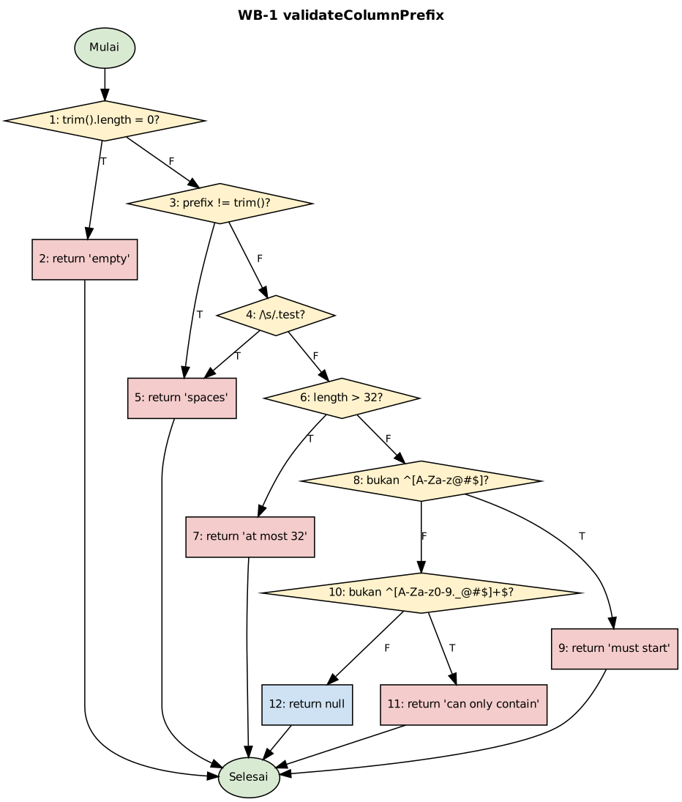
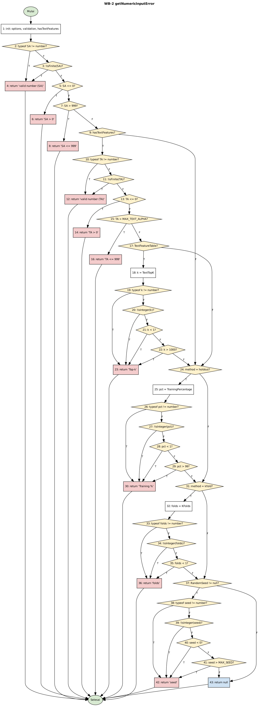
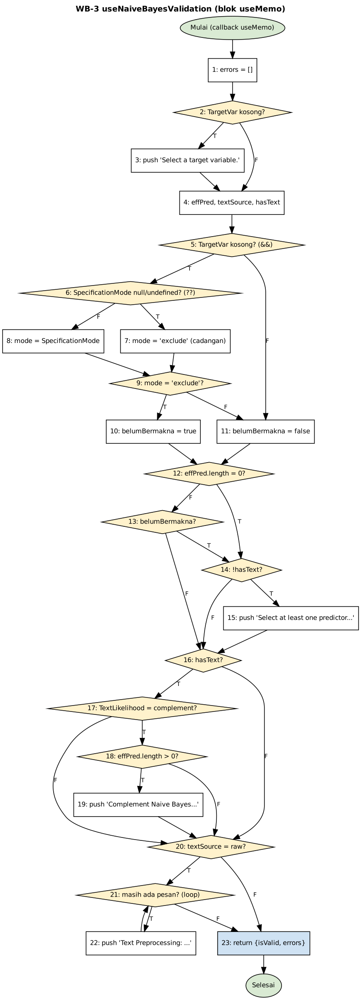

# HANDOFF — Paket evaluasi modul Text Analytics Statify untuk penulisan skripsi (Bab V)

| Butir | Isi |
|---|---|
| Penerima | Agen penulis skripsi (model Opus, penalaran tinggi) yang bekerja untuk Yedija Lewi Suryadi |
| Pemilik skripsi | Yedija Lewi Suryadi (yedijalewisuryadi@gmail.com) |
| Objek evaluasi | Modul Text Analytics aplikasi Statify: String to Word Vector (STWV), Naive Bayes (NB), Apply Model (AM), dan pustaka inti Rust `statify-text-core` |
| Repo | `E:\KULIAH\Skripsi\statify64`; paket evaluasi di `testing/text_analytics_eval/` |
| Cabang kerja | `text-analytics-eval` (semula `thesis-eval`). Seluruh paket evaluasi **hanya ada di cabang ini**; cabang `dija-v2` tidak memuatnya (perbandingan keduanya: 702 berkas, semuanya Added, tanpa perubahan kode produksi). Untuk membaca atau menjalankan ulang paket: `git switch text-analytics-eval`. `33b1b7e02cf6f47209020be61fdcd460f6817de1` adalah commit yang tercatat saat lingkungan Windows dicatat (8 Oktober 2026); commit akhir adalah HEAD cabang tersebut (lihat `git log`), karena mencantumkan hash commit akhir di dalam berkas yang di-commit tidak mungkin |
| Dibangun | 8 Oktober 2026, oleh `tools/build_handoff.py` dari berkas-berkas paket evaluasi (tidak ada angka diketik ulang di lampiran) |
| Status paket | Semua track A–F sudah dieksekusi penuh di perangkat uji skripsi (Windows 11). Yang belum: pengujian manual di antarmuka nyata (M-01..M-36, MF-01..MF-05) dan beberapa butir pada Bagian 9 |

## 0. Cara memakai dokumen ini

Dokumen ini punya dua lapis. **Bagian 1 sampai 11** adalah arahan ringkas yang ditulis tangan: aturan, hasil, peta penempatan ke Bab V, daftar klaim yang boleh dan tidak boleh ditulis, temuan, keterbatasan, serta tugas yang tersisa. **Lampiran A sampai F** menyalin utuh dokumen sumber (laporan gabungan, temuan, lingkungan, dan dokumen track) sehingga semua angka dapat diperiksa tanpa membuka berkas lain. Cari lampiran dengan mencari judul `# LAMPIRAN A`, `# LAMPIRAN B`, dan seterusnya. Gambar flow graph (`whitebox/*.png`) tidak ikut tertanam; tabel simpul dan daftar sisi sudah ada dalam teks.

Urutan kepercayaan bila ada angka yang tampak bertentangan: (1) log mentah di `logs/` berlabel Windows, (2) `REPORT.md` (Lampiran A), (3) dokumen track (Lampiran D sampai F), (4) arahan di Bagian 1 sampai 11. Bila Anda menemukan konflik yang tidak terjelaskan, **jangan memilih sendiri**: catat dan tanyakan kepada Yedija.

## 1. Aturan integritas data (wajib dipatuhi)

1. **Jangan mengarang atau membulatkan sendiri angka.** Setiap angka di buku harus dapat ditelusuri ke tabel di Lampiran A atau log yang disebut di sana. Bila suatu angka tidak ada, tulis "belum diukur" dan tanyakan.
2. **Yang tidak dieksekusi ditulis NOT RUN beserta alasannya**, tidak dilunakkan menjadi "diperkirakan lulus". Daftar lengkapnya ada di Bagian 9 dan Lampiran A bagian 11.
3. **Label perangkat.** Hanya hasil berlabel **[Win]** (Lenovo IdeaPad Gaming 3, Ryzen 5 4600H, Windows 11, konfigurasi Jest produksi) yang boleh menjadi angka resmi di buku. Label **[VM]** (VM Linux, ts-jest, 2 vCPU) dan sandbox cloud hanya pembanding atau uji asap; angka waktu dari keduanya tidak boleh masuk tabel buku.
4. **Kode produksi tidak diubah** oleh paket ini. Perbandingan cabang evaluasi dengan `dija-v2` (diserahkan Yedija) menunjukkan 702 berkas, seluruhnya berstatus Added, tanpa berkas produksi yang dimodifikasi. Temuan hanya dilaporkan, perbaikannya tidak diterapkan.
5. **Seed acak 42** di semua tempat; toleransi numerik 1e-6 kecuali ditentukan lain.
6. **Format tabel.** Kolom tabel buku harus persis seperti spesifikasi asli (Bagian 4). Angka memakai **koma desimal** dan titik pemisah ribuan pada tabel buku (contoh `4.138,3`). Angka di log mentah tetap memakai titik desimal; jangan mencampur.
7. **Perilaku saat ini bukan berarti perilaku yang benar.** Beberapa tes Rust (misalnya `k1_*` untuk A-1) mengunci perilaku kode apa adanya (tes karakterisasi). Tes itu lulus berarti perilaku tersebut terjadi, bukan berarti perilaku itu diinginkan. Jangan menulis "terbukti benar" untuk hal seperti ini.
8. **Kesetaraan dengan pembanding bukan bukti kebenaran mutlak.** "Sama dengan scikit-learn" berarti keluaran Statify cocok dengan implementasi acuan itu pada data dan konfigurasi yang diuji.
9. **Jangan menjalankan atau menyarankan perintah git** kepada Yedija atas nama agen lain; commit dan push dilakukan Yedija sendiri.

## 2. Konteks singkat

**Statify** adalah aplikasi statistik berbasis web (Next.js 15 dan TypeScript) dengan komputasi Rust yang dikompilasi ke WebAssembly dan dijalankan di Web Worker. Modul Text Analytics terdiri dari tiga menu dan satu pustaka:

- **String to Word Vector (STWV)**: mengubah kolom teks menjadi kolom vektor kata `VEC_<kata>` (pembersihan, n-gram, stopword, stemming Sastrawi untuk Indonesia atau Porter untuk Inggris, TF/IDF/normalisasi, Words to Keep, Min term frequency). Sasaran perbandingan: preset "Default Weka" dan preset "scikit-learn".
- **Naive Bayes (NB)**: Multinomial, Bernoulli, Complement, dan Gaussian; dapat memakai Raw Text (pipeline STWV tertanam) atau kolom Word-Vector; evaluasi holdout atau k-fold; ekspor model JSON.
- **Apply Model (AM)**: memuat model JSON, memetakan variabel, memprediksi data baru, membulatkan probabilitas keluaran ke 4 desimal (`round4`).
- **`statify-text-core`**: crate Rust yang dipakai bersama oleh NB dan AM (pipeline teks, formula, model). Versi `sastrawi-rs` berbeda antar-crate (0.5.1 pada STWV; 0.5.3 pada core, NB, AM), lihat temuan D-01.

**Tujuan evaluasi (Bab V skripsi).** Menunjukkan, dengan bukti yang dapat diulang, bahwa modul ini (A) teruji pada tingkat unit, (B) teruji pada tingkat jalur logika, (C) berperilaku sesuai spesifikasi dari sisi pengguna, (D) menghasilkan angka yang sama dengan scikit-learn dan dapat dibandingkan dengan WEKA, (E) berjalan dalam waktu wajar pada ukuran data realistis, dan (F) konsisten ketika ketiga menu dipakai berantai; sekaligus mencatat temuan dan keterbatasannya apa adanya.

**Perangkat uji skripsi.** Lenovo IdeaPad Gaming 3 15ARH05 (kode model 82EY), AMD Ryzen 5 4600H (6 inti, 12 thread), RAM 15,4 GB, Windows 11 Home 10.0.26300, rustc/cargo 1.93.0, Node 24.13.1, Jest 30.0.4, scikit-learn 1.9.1 (Python 3.13.12), WEKA 3.9.6, Chrome 154.0.8037.98, paket daya Balanced, adaptor tersambung. Rincian di Lampiran C.

**Dataset.** `pilkada_train.csv` (630 dokumen) dan `pilkada_test.csv` (270 dokumen), korpus acuan; SMS Spam (5.574 dokumen; 3.901 latih dan 1.673 uji pada Track D); SmSA (11.000 latih dan 500 uji pada Track D; tiga kelas); gabungan ketiganya 17.974 dokumen; dan dataset 36.305 dokumen (gabungan 17.974 ditambah 20 Newsgroups 18.331 dokumen, label campuran 25 kelas) yang **hanya dipakai untuk beban waktu pada Track E**, bukan untuk akurasi. Asal dan lisensi SMS Spam, SmSA, dan 20 Newsgroups belum diverifikasi (Bagian 8).

## 3. Hasil dalam satu halaman

| Track | Apa yang dikerjakan | Hasil utama (semua [Win] kecuali disebut) | Sumber (Lampiran A) |
|---|---|---|---|
| Baseline | Menjalankan tes yang sudah ada sebelum paket ini | Rust 450 lulus (inti 91, NB 203, AM 156, STWV 0 tes); Jest 830 lulus (STWV 111, NB 253, AM 466); 0 gagal. Cakupan baris Jest: STWV 52,24%, NB 86,64%, AM 97,21%. Cakupan Rust tidak terukur (`cargo-llvm-cov` tidak terpasang) | Bagian 3 |
| A. Unit | Tes unit tambahan | 105 tes Jest dan 66 fungsi tes Rust, semua lulus. Mengunci formula (TF, IDF, normalisasi), batas kosakata, pipeline teks, partisi holdout/k-fold MT19937 seed 42, pemuat model | Bagian 4 |
| B. White-box | Basis path pada 4 fungsi | V(G): WB-1 = 7, WB-2 = 29, WB-3 = 13, WB-4 = 6 (jumlah 55). 54 jalur layak, 54 tes Jest lulus. WB-3 hanya 12 jalur layak independen (rank 12) karena dua predikat membaca variabel yang sama | Bagian 5 |
| C. Black-box | BB-01..BB-36 | 36 skenario punya pemeriksaan otomatis yang lulus (Jest 35 + 63 + 95 = 193 tes; Rust 31 + 24 + 12 = 67 tes). Komponen manual (M-01..M-36) **belum dijalankan** | Bagian 6 |
| D. Akurasi | Statify vs scikit-learn vs WEKA | Kelas prediksi Statify = scikit-learn pada **17.221 dari 17.221** prediksi (24 konfigurasi, 3 dataset); metrik identik sampai 6 desimal. WEKA: 264–267 dari 270 pada W=1.000, **270 dari 270** bila kosakata disamakan. Selisih probabilitas ≤ 5,0e-5 dijelaskan seluruhnya oleh pembulatan `round4` | Bagian 7 |
| E. Waktu | Peramban (Worker asli) dan headless (Node) | STWV default di peramban: 61,1 ms (900 dok) sampai 4.138,3 ms (36.305 dok). NB 10-fold 36.305 dok: 26.624,7 ms (peramban), 17.960,9 ms (headless). Sastrawi gagal pada 3 dataset (E-01) | Bagian 8 |
| F. Integrasi | IT-01..IT-05 | IT-01, 02, 04, 05 terpenuhi; IT-03 **Lulus dengan catatan** (kriteria 1e-9 tidak terpenuhi secara harfiah pada probabilitas keluaran karena `round4`; terpenuhi pada parameter dan skor acuan) | Bagian 9 |
| Temuan | `BUGS.md` | 25 butir: 1 tinggi (E-01), 5 sedang (A-1, C2-01, C2-02, C2-03, D-01), sisanya rendah atau informasi | Bagian 10 |

Eksekusi penuh Jest di Windows: 1.283 tes (baseline 830 + evaluasi 453), 75 suite, semua lulus. Seluruh 136 fungsi tes Rust baru (`eval_*.rs`) dikompilasi pada percobaan pertama dan lulus. Eksekusi ulang menyeluruh `run_all.ps1` di Windows pada 8 Oktober 2026 selesai dengan kode keluar 0 pada setiap langkah.

Angka tes per track (Jest [Win] / fungsi tes Rust [Win]): A 105 / 66; B 54 / –; C1 35 / 31; C2 63 / 24; C3 95 / 12; D 3 / 1; F 98 / 2. Jumlah: 453 / 136.


## 4. Peta penempatan ke Bab V

Usulan struktur. Sesuaikan dengan template buku Yedija; yang tidak boleh diubah adalah **kolom tabel** dan **angkanya**. "Lampiran A §n" berarti bagian bernomor n di `REPORT.md` yang disalin di Lampiran A.

| Usulan subbab | Isi | Format kolom tabel (persis) | Sumber |
|---|---|---|---|
| V.1 Lingkungan dan baseline | Perangkat, versi alat, hasil tes yang sudah ada | `\| Lapisan \| Lokasi pengujian \| Jumlah kasus \| Lulus \| Gagal \| Cakupan baris \|` | Lampiran A §2–3, Lampiran C |
| V.2 Pengujian unit (Track A) | Cakupan unit baru, tes karakterisasi, estimasi celah | tabel baseline sesudah Track A; daftar tes per area | Lampiran A §4 |
| V.3 Pengujian white-box (Track B) | Flow graph, V(G), basis set jalur | `\| Simpul \| Pernyataan \|`; `\| Jalur \| Simpul \| Masukan \| Keluaran yang diharapkan \| Hasil \|`; rekap `\| Fungsi \| Menu \| V(G) \| Jalur independen \| Kasus lulus \|` | Lampiran A §5 |
| V.4 Pengujian black-box (Track C) | 36 skenario | `\| ID \| Fitur \| Skenario \| Hasil yang diharapkan \| Hasil aktual \| Status \| Cara uji (otomatis/manual) \| Bukti \|` | Lampiran A §6 |
| V.5 Akurasi numerik (Track D) | Perbandingan dengan scikit-learn dan WEKA | `\| Konfigurasi \| Perangkat \| Akurasi \| Kappa \| Macro F1 \|` (6 desimal); `\| Konfigurasi \| Pembanding \| Kelas prediksi sama (x/270) \| Galat absolut maksimum probabilitas \| LRE minimum \|` | Lampiran A §7, Lampiran D |
| V.6 Waktu eksekusi (Track E) | Skalabilitas menurut ukuran data | `\| Menu dan konfigurasi \| Dataset \| Jumlah term \| Rata-rata (ms) \| Simpangan baku (ms) \|` | Lampiran A §8, Lampiran E |
| V.7 Integrasi antarmenu (Track F) | IT-01..IT-05 | `\| ID \| Skenario \| Hasil yang diharapkan \| Hasil aktual \| Status \| Bukti \|` | Lampiran A §9, Lampiran F |
| V.8 Temuan dan pembahasan | Daftar temuan, dampak, usulan | tabel indeks temuan (ID, tingkat, judul) | Lampiran A §10, Lampiran B |
| V.9 Keterbatasan | Ancaman validitas, NOT RUN | daftar bernomor | Lampiran A §11–12, Bagian 8–9 di sini |

Catatan tata letak. Tabel BB (8 kolom) lebar; pecah per menu (BB-01..13, BB-14..28, BB-29..36) atau pindahkan ke lampiran buku dan beri ringkasan di badan bab. Tabel simpul WB-2 punya puluhan baris; letakkan di lampiran buku dan kutip flow graph serta rekap di badan bab. Tabel Track E ada dua jalur (peramban dan headless): buku boleh memuat keduanya, dengan syarat label jalurnya tetap ditulis.

## 5. Buku klaim: apa yang boleh ditulis

### 5.1 Boleh ditulis tegas (didukung bukti [Win])

1. Seluruh tes lama (Rust 450, Jest 830) lulus sebelum paket evaluasi, sehingga evaluasi dimulai dari baseline hijau. Pustaka STWV Rust tidak memiliki tes sendiri.
2. 453 tes Jest dan 136 fungsi tes Rust baru lulus; jumlah per track seperti pada Bagian 3.
3. Kompleksitas siklomatik keempat fungsi white-box: 7, 29, 13, 6, diverifikasi dengan skrip (jumlah sisi, simpul, predikat, dan rank matriks jalur). 54 dari 55 jalur struktural layak dan semuanya lulus; satu jalur WB-3 tidak layak karena `TargetVar` tidak berubah antara dua pemeriksaan.
4. Kelas prediksi Statify sama dengan scikit-learn 1.9.1 pada 17.221 dari 17.221 prediksi (24 konfigurasi; pilkada, SMS Spam, SmSA); akurasi, Kappa, dan Macro F1 identik sampai 6 desimal; parameter model cocok sampai galat absolut maksimum 2,665e-15 (Windows; 1,776e-15 di VM).
5. Selisih probabilitas keluaran Apply Model terhadap scikit-learn paling besar sekitar 5,0e-5 dan seluruhnya dijelaskan oleh pembulatan 4 desimal (`round4`) pada wasm Apply Model, bukan oleh galat rumus.
6. Pada pilkada, kelas prediksi sama dengan WEKA 3.9.6 pada 264–267 dari 270 dokumen dengan Words to Keep bawaan (1.000); selisihnya berasal dari perbedaan definisi (WEKA mempertahankan semua kata seri di batas, 1.042 kata, sedangkan Statify memotong tepat 1.000), dan bila kosakata disamakan hasilnya 270 dari 270.
7. IT-01, IT-02, IT-04, IT-05 terpenuhi: jumlah term model sama dengan jumlah kolom `VEC_`; Model Summary sama dengan model asal (6.017 angka model sama bit demi bit); kelas prediksi sama dengan scikit-learn pada 270/270 dokumen; prediksi identik byte demi byte setelah tulis-baca berkas.
8. Waktu eksekusi seperti pada tabel Track E Windows (Lampiran A §8). Contoh kalimat yang aman: "STWV default di peramban memerlukan 61,1 ms untuk 900 dokumen dan 4.138,3 ms untuk 36.305 dokumen (rata-rata lima pengukuran setelah satu pemanasan, Chrome 154 headless, Windows 11)".
9. Temuan E-01: STWV dengan stemming Sastrawi membatalkan seluruh proses (panic wasm `unreachable`) pada SMS Spam, gabungan 17.974, dan dataset 36.305 dokumen; varian ASCII berjalan. Reproduksi ada di `BUGS.md` E-01.

### 5.2 Boleh ditulis dengan catatan wajib

| Klaim | Catatan wajib |
|---|---|
| "Perilaku `KFolds = 1` terdokumentasi" (A-1) | Tes `k1_*` adalah tes karakterisasi: data latih kosong, semua prediksi jatuh ke kelas alfabetis pertama, akurasi 3/9, Kappa 0. Itu perilaku saat ini yang dinilai sebagai cacat validasi, bukan perilaku yang dikehendaki. |
| "IT-03 lulus" | Tulis **"Lulus dengan catatan"**. Kriteria asli (selisih ≤ 1e-9) tidak terpenuhi secara harfiah pada kolom probabilitas keluaran karena `round4` pada desain; terpenuhi pada kelas (630/630), parameter model (selisih 0, 6.017–8.017 angka), dan skor acuan. Kriteria tidak dilonggarkan diam-diam; kontrol negatif membuktikan keluaran tidak dapat membedakan 1e-9 dari 5e-5. |
| "Statify sama dengan WEKA" | Hanya untuk pilkada, hanya K1, K2, K3, K5 yang punya pembanding WEKA, dan harus menyebut perbedaan definisi (aturan seri Words to Keep, prior ber-Laplace, keluaran Complement WEKA berupa distribusi 0/1). OpenJDK 11 dipakai pada sebagian run WEKA di VM, bukan JRE Zulu 17 bawaan WEKA. Tidak ada pembanding WEKA untuk K4 dan K6, dan stemming Sastrawi (K6) tidak punya pembanding eksternal. |
| "Akurasi konfigurasi X lebih baik dari Y" | Data uji pilkada hanya 270 dokumen (galat baku akurasi sekitar 2,6 poin persentase), satu pembagian data, tanpa uji signifikansi. Tulis sebagai pengamatan, jangan sebagai peringkat. Contoh: K6 (0,722222) lebih rendah dari K1 (0,762963) pada data ini. |
| "Peramban lebih lambat daripada headless" | Rasio peramban/headless: STWV default 1,2–1,4×, NB holdout 1,6–4,1×, NB 10-fold 1,2–2,2×, AM 1,8–3,9×. Overhead tetap Worker hanya 54,6–74,5 ms (STWV 2,6 ms). Selisih 4,8–8,7 detik pada 36.305 dokumen **tidak** dijelaskan oleh overhead tetap; penyebabnya tidak diisolasi. Jangan menyebut sebab tanpa data. |
| "Waktu tumbuh linear" | Hanya STWV default hampir linear terhadap dokumen (sekitar 0,07 ms/dokumen sampai 17.974 dokumen; 0,114 ms/dokumen pada 36.305 karena dokumennya lebih panjang: rata-rata 114,0 token vs 14,8–29,1). NB 10-fold headless hampir proporsional dengan jumlah **token** (4,34–4,72 ms per 1.000 token). Hubungkan dengan token, bukan hanya dokumen. |
| "UI responsif" | Hanya STWV menghasilkan Long Task di main thread (101 ms pada 11.000 dokumen, 195 ms pada 17.974, 441 ms pada 36.305; ambang 200 ms terlewati pada ukuran terbesar). NB dan AM tidak menghasilkan Long Task. Pengukuran hanya mencakup Worker dan wasm, bukan klik sampai Output Viewer. |
| "Tidak ada regresi" | Berlaku untuk tes otomatis (Jest dan Rust) yang ada. Antarmuka nyata belum diuji manual. |
| "Cakupan kode" | Cakupan Jest sesudah Track A diukur hanya di VM (STWV 51,37 → 53,39%; NB 87,01 → 87,01%; AM 97,50 → 97,77%); cakupan baseline Windows STWV 52,24%, NB 86,64%, AM 97,21%. Cakupan Rust **tidak terukur**; yang ada hanya estimasi statis celah (A_unit §4.2, yaitu bagian 4 di Lampiran A). Jangan menulis persentase cakupan Rust. |
| "Dataset 36.305 dokumen" | Hanya untuk beban waktu. Label campuran (25 kelas), bukan untuk akurasi. Lisensi 20 Newsgroups belum diverifikasi. |
| "Kesetaraan biner wasm dengan sumber" | Biner `pkg/*.wasm` yang sudah ada di repo dipakai apa adanya; kesesuaiannya dengan sumber Rust terkini diperiksa oleh tes `eval_compare.rs` (lulus di Windows), bukan oleh build ulang. |

### 5.3 Jangan ditulis (tidak didukung data)

1. Persentase cakupan Rust, atau klaim "semua baris Rust teruji".
2. Hasil pengujian manual dan end-to-end di peramban nyata (M-01..M-36, MF-01..MF-05, Playwright aplikasi penuh): belum dijalankan.
3. Kesimpulan bahwa Statify "lebih akurat" atau "lebih cepat" dari scikit-learn atau WEKA. Yang diukur: kesetaraan numerik terhadap scikit-learn; kesamaan terbatas terhadap WEKA; waktu Statify saja (scikit-learn dan WEKA tidak diukur waktunya).
4. Waktu eksekusi Rust native (tidak diukur) dan waktu pada perangkat selain perangkat skripsi.
5. Penyebab pasti selisih peramban vs headless, dan penyebab pasti E-01 di dalam pustaka `sastrawi-rs` (yang tercatat: gejala, reproduksi, dan pemicu token berkarakter kedua multibita).
6. Bahwa 36.305 dokumen mewakili korpus Indonesia: sebagian besar tambahan berbahasa Inggris (20 Newsgroups).
7. Hasil WEKA untuk SMS Spam dan SmSA di Windows: hanya dijalankan di VM (OpenJDK 11); di Windows hanya pilkada yang diulang.
8. Klaim tentang pengalaman pengguna (kemudahan, kepuasan): tidak ada pengujian pengguna.


## 6. Metode per track (ringkas, untuk Bab IV atau pembuka tiap subbab Bab V)

**Prinsip umum.** Tes memanggil kode asli aplikasi; yang ditiru hanya batas luar (store, modal, kelas `Worker`). Komputasi inti diuji lewat wasm yang sama dengan aplikasi atau lewat crate Rust yang sama. Tidak ada kode produksi yang diubah; semua berkas baru berada di folder `__tests__/eval/` (Jest), `tests/eval_*.rs` (Rust), dan `testing/text_analytics_eval/`.

**Baseline.** `cargo test` untuk empat crate (inti, NB, AM, STWV) dan `npx jest` untuk tiga menu dengan `--testPathIgnorePatterns=__tests__/eval` serta pengecualian dua berkas whitebox lama (`hooks/__tests__/whitebox`), sehingga yang dihitung hanyalah tes yang sudah ada. Cakupan baris Jest diukur dengan `--collectCoverageFrom` terbatas pada folder tiga menu. Angka diekstrak dari log oleh `tools/build_baseline.py`, bukan diketik.

**Track A (unit).** Empat berkas Jest (`model-loader`, `kfold`, `stopwords`, `formula-output`; 105 tes) dan empat berkas Rust (`eval_formulas` 15, `eval_vocab_limit` 13, `eval_text_pipeline` 20, `eval_partition` 18). Nilai harapan dihitung mandiri (tangan atau replika Python independen), termasuk keluaran awal MT19937 seed 42 yang sama dengan `numpy.random.RandomState(42)`, dan indeks partisi holdout/k-fold seed 42. Estimasi statis celah cakupan Rust ada di `unit/static_gap_rust.py` (bukan pengukuran).

**Track B (white-box basis path).** Untuk WB-1 `validateColumnPrefix`, WB-2 `getNumericInputError`, WB-3 blok `useMemo` validasi pada `useNaiveBayesValidation`, WB-4 `loadModelFromFile` (dengan `finalizeLoad` diperluas): graf alir ditulis tangan dari kode sumber, kondisi majemuk (`||`, `&&`, `??`) dipecah menjadi simpul predikat per operan; V(G) = E − N + 2 dan P + 1 dihitung dan dicocokkan oleh skrip (`tools/wb_core.py`, `wb_graphs.py`, `wb_synth.py`), jalur independen dipilih dan **rank matriks vektor-sisi** diperiksa; satu tes Jest per jalur (nama tes memuat ID jalur). Flow graph dibangkitkan dengan Graphviz. Jalur infeasible ditandai eksplisit.

**Track C (black-box).** BB-01..BB-36 dari spesifikasi. Tiap skenario diotomatiskan semaksimal mungkin: React Testing Library (antarmuka dan dialog), hook, service dengan wasm sungguhan di Jest, dan tes Rust untuk komputasi inti. Setiap baris memisahkan komponen otomatis (hasil [Win]) dari komponen yang butuh antarmuka nyata (MANUAL, rujukan M-01..M-36 di `C_manual_checklist.md`). Kolom "Hasil yang diharapkan" adalah versi yang diverifikasi terhadap kode sumber; selisih terhadap spesifikasi dicatat pada "Catatan penyesuaian" per bagian C1, C2, C3. Temuan perilaku dikunci sebagai tes karakterisasi dan diberi ID temuan.

**Track D (akurasi numerik).** Jalur headless `headless/statify_wasm.mjs` memakai wasm yang sama dengan aplikasi: Naive Bayes dengan Raw Text dan resep STWV dari data latih saja, Export Model, lalu Apply Model pada data uji; keluaran `pred_statify_<K>.csv`. Pembanding scikit-learn 1.9.1 (`accuracy/sk_compare.py`) memakai kosakata eksplisit dengan aturan Statify, tokenisasi disamakan, dan fungsi `assert_no_leak`. WEKA 3.9.6 dikerjakan terpisah (`weka/`). Konfigurasi: K1 Weka bawaan Multinomial; K2 Bernoulli; K3 Complement; K4 standar scikit-learn (hitungan, IDF smooth, L2); K5 TF log(1+f) × IDF ln(N/df) × normalisasi panjang dokumen; K6 K1 + stopword Indonesia + stemming Sastrawi (tanpa pembanding). Varian `w` (seluruh kosakata) dan `m` (W = 1.042) menyamakan kosakata dengan WEKA. Empat tingkat perbandingan: kelas prediksi, probabilitas Apply Model, parameter model presisi penuh, dan vektor. Metrik: akurasi, Kappa Cohen, Macro F1 (6 desimal) dan LRE = −log10(|x−c|/|c|).

**Track E (waktu).** Dua jalur. (a) **Peramban**: harness statis menyajikan Worker asli aplikasi (NB, AM) dan Worker pengganti yang memuat wasm yang sama untuk STWV (aplikasi membundel prosesornya lewat webpack); waktu diukur dengan `performance.now()` dari sebelum `postMessage` sampai `onmessage`; NB dan AM membuat Worker baru tiap run seperti di aplikasi, STWV memakai ulang satu Worker. (b) **Headless**: wasm dipanggil sinkron di Node, satu proses per sel, GC sebelum tiap run. Protokol 1 pemanasan + 5 pengukuran, rata-rata dan simpangan baku sampel (n−1). Lima skenario (STWV default, STWV stopword + Sastrawi, NB holdout 70%, NB 10-fold, Apply Model) pada empat dataset utama buku (900; 5.574; 11.000; 36.305 dokumen), ditambah "baris tambahan" yang bukan baris utama buku: dataset gabungan 17.974 dokumen dan varian ASCII untuk STWV + Sastrawi. Responsivitas UI: Long Task dan jeda frame. Skenario NB memakai Raw Text, seed 42; Apply Model memakai model NB Multinomial dan data yang sama.

**Track F (integrasi).** IT-01..IT-05 diotomatiskan di tingkat service dan Rust: lima skrip Node (`integration/it0N_*.mjs`), lima berkas Jest (98 tes) dengan wasm sungguhan, dan dua tes Rust `eval_integration.rs` (`float_roundtrip` pada f64 acak seed 42 dan model K1, K4, K5). Pemeriksaan di peramban nyata (MF-01..MF-05) manual dan belum dijalankan. IT-03 diperlakukan khusus karena `round4` (Bagian 5.2).

## 7. Temuan

Indeks lengkap 25 butir ada di Lampiran A §10 dan rincian (lokasi `file:baris`, reproduksi, dampak, usulan, tingkat keyakinan) di Lampiran B. Usulan perbaikan **tidak diterapkan** karena paket ini dilarang mengubah kode produksi. Untuk buku, kelompokkan sebagai berikut.

| ID | Tingkat | Inti temuan | Saran penempatan |
|---|---|---|---|
| E-01 | Tinggi | `sastrawi-rs 0.5.1` pada wasm STWV panik (`unreachable`) bila ada token yang karakter keduanya multibita (contoh `I‘m` dengan petik tipografis, `résumé`). Satu dokumen membatalkan seluruh korpus. Terukur: 34 dokumen memicu panik pada SMS Spam 5.574 dan pada gabungan 17.974; 0 pada pilkada dan SmSA. NB/AM (0.5.3) tidak panik pada masukan yang sama. Pesan ke pengguna hanya `unreachable` | Pembahasan Track E (sel GALAT) dan Bab saran |
| D-01 | Sedang | Versi `sastrawi-rs` berbeda antar-crate (0.5.1 STWV vs 0.5.3 lainnya); pada K6 kosakata STWV mandiri berbeda 8 kata dari resep NB/AM (1.000 vs 1.000 kata). Penyebab mekanisme belum diverifikasi di kode; pengaruh pada akurasi tidak diukur | Pembahasan Track D |
| A-1 | Sedang | `KFolds = 1` diterima di TS dan Rust; data latih kosong, semua prediksi ke kelas alfabetis pertama, akurasi 3/9 pada fixture, Kappa 0, tanpa galat. Terverifikasi dengan tes yang dijalankan di Windows | Pembahasan Track A/B |
| C2-01 | Sedang | Galat/peringatan jumlah fold tidak berkode dan tidak sampai ke pengguna (BB-24) | Pembahasan Track C |
| C2-02 | Sedang | Pesan validasi NB tidak pernah ditampilkan; OK hanya nonaktif (BB-14) | Pembahasan Track C |
| C2-03 | Sedang | Validasi numerik tidak menonaktifkan OK; Alpha tidak sah dibuang diam-diam (BB-18, BB-21). Klaim "analisis berjalan dengan alpha sah terakhir saat OK diklik" berasal dari pembacaan kode, bukan dari tes | Pembahasan Track C |
| lainnya | Rendah atau informasi | A-2..A-4, B-1, B-2, C1-01, C1-02, C2-04, C2-05, C3-01..C3-03, D-02..D-04, E-02, E-03, F-01, F-02. Antara lain: `round4` pada Apply Model (D-02/F-02), matriks padat melalui `postMessage` yang memblokir main thread (E-02), Worker NB/AM dibuat baru tiap analisis dengan overhead tetap 54,6–74,5 ms (E-03), kolom STWV bernama `VEC` lolos filter `VEC_` (F-01) | Lampiran temuan |

Tingkat keyakinan tiap temuan dicatat di `BUGS.md`: ada yang **terverifikasi dengan tes yang dijalankan** (A-1 sisi TS dan Rust, E-01 lewat skrip reproduksi) dan ada yang **analisis kode** (misalnya jalur teks mentah A-1 `NB_E_TEXT_EMPTY_VOCAB_FOLD` dan sebagian C2-03). Pertahankan pembedaan itu saat menulis.

## 8. Keterbatasan dan ancaman validitas (tulis di Bab V.9)

1. **Tes Rust baru ditulis tanpa kompiler dan baru dikompilasi di Windows**; semuanya lulus pada percobaan pertama. Sebagian nilai harapan bersifat karakterisasi perilaku saat ini (`k1_*`), sehingga lulus berarti perilaku itu terjadi, bukan benar.
2. **Hasil [VM] memakai ts-jest dan resolver pengganti**, bukan konfigurasi produksi (next/jest dengan SWC); hanya hasil [Win] yang berlaku. Cakupan Jest sesudah Track A hanya terukur di VM.
3. **Satu perangkat, lima pengukuran per sel.** Median simpangan baku 3,0% terhadap rata-rata (30 dari 50 sel di bawah 5%; 46 dari 50 di bawah 10%; maksimum 16,5% pada sel kecil). Selisih beberapa ms pada sel kecil tidak bermakna. Chrome headless; harness mengukur Worker dan wasm saja; program latar belakang tidak diperiksa; paket daya Balanced.
4. **Data uji pilkada 270 dokumen**: tidak cukup untuk memeringkat konfigurasi (galat baku akurasi ± 2,6 poin persentase); satu pembagian data; tanpa uji signifikansi.
5. **Perbandingan WEKA terbatas**: perbedaan definisi (aturan seri Words to Keep, prior ber-Laplace, keluaran Complement), versi Java (OpenJDK 11 di VM, bukan Zulu 17 bawaan WEKA), presisi cetak WEKA (16 desimal; ARFF K5 menulis 6 desimal). K6 tidak punya pembanding eksternal.
6. **Dataset**: SMS Spam dan SmSA berasal dari salinan di `weka/data`; asal dan lisensi belum diverifikasi (URL unduhan tidak dapat diperiksa dari sandbox tanpa jaringan). Dataset 36.305 dokumen bercampur bahasa dan label (25 kelas) dan hanya sah untuk beban waktu; lisensi 20 Newsgroups belum diverifikasi.
7. **Biner wasm** yang diuji adalah yang sudah ada di repo; kesesuaiannya dengan sumber Rust terkini hanya diperiksa lewat `eval_compare.rs`. Versi `sastrawi-rs` berbeda antar-crate (D-01).
8. **Probabilitas Apply Model hanya 4 desimal** sehingga kriteria 1e-9 pada probabilitas keluaran tidak dapat diukur langsung; parameter dan skor acuan diperiksa pada presisi penuh.
9. **Pengujian antarmuka memakai jsdom** dengan batas luar ditiru; perilaku peramban nyata (WASM, Data Editor, Output Viewer) hanya tercakup oleh daftar periksa manual yang belum dijalankan.
10. **Cakupan Rust tidak terukur** (`cargo-llvm-cov` tidak terpasang); STWV Rust tidak punya tes sendiri sehingga diuji lewat jalur NB/AM dan headless.
11. **Waktu**: tidak ada pembanding waktu dengan scikit-learn atau WEKA; Rust native tidak diukur; Playwright aplikasi penuh tidak dijalankan.
12. **Penyebab selisih peramban vs headless pada dataset besar tidak diisolasi** (E-03 dikoreksi: tidak hanya overhead tetap).

## 9. Yang belum dijalankan dan tugas Yedija (NOT RUN)

| Butir | Status | Catatan untuk penulisan |
|---|---|---|
| Pengujian manual M-01..M-36 (`C_manual_checklist.md`) dan MF-01..MF-05 (`F_manual_checklist.md`) | MANUAL, belum dijalankan | Tulis sebagai "komponen manual belum dilaksanakan" pada kolom Status BB dan IT. Bila Yedija menjalankannya, minta tangkapan layar dan hasilnya, lalu perbarui kolom Hasil aktual dan Status. |
| Playwright end-to-end aplikasi penuh (`perf/e2e_full_app.spec.ts`) | NOT RUN | Ditulis tetapi tidak pernah dijalankan; tidak dipanggil `run_E.ps1`. |
| Cakupan Rust (`cargo llvm-cov`) | NOT RUN | Alat tidak terpasang. Opsi: Yedija memasangnya (`cargo install cargo-llvm-cov`) lalu `run_all.ps1 -Only A`. Sampai itu terjadi, jangan menulis persentase. |
| WEKA SMS Spam dan SmSA di Windows | NOT RUN | Hanya dijalankan di VM (OpenJDK 11); pilkada diulang di Windows dengan hasil sama (`weka/logs/09_bandingkan_windows_vs_linux_pilkada.log`). |
| STWV + Sastrawi pada SMS Spam, gabungan, 36.305 dokumen | GAGAL (bukan NOT RUN) | Panic wasm (E-01); varian ASCII (non-ASCII dilipat atau dibuang) terukur hanya untuk waktu: 411,1 / 1.406,3 / 6.166,2 ms di peramban (sekitar 1,49× STWV default pada 36.305 dokumen). |
| Verifikasi asal dan lisensi dataset | Belum | Yedija perlu mencatat sumber dan lisensi SMS Spam (UCI id 228), SmSA (IndoNLU), 20 Newsgroups sebelum dicantumkan di buku. |
| Eksekusi ulang VM dengan nama berkas baru | Opsional | Log VM lama masih bernama `thesis`; `tools/apply_results.py` memetakannya (`_legacy`). Tidak memengaruhi angka. |
| Commit dan push | Tugas Yedija | Agen mana pun dilarang menjalankan perintah git di repo ini. |
| Penggabungan `text-analytics-eval` ke `dija-v2` | Keputusan Yedija | Belum dilakukan. Sampai digabung, tes `eval` dan folder `testing/text_analytics_eval/` tidak ada di `dija-v2`. Dua tes whitebox lama di `naive-bayes/hooks/__tests__/` masih belum dilacak git di kedua cabang. |

Tugas lain untuk Yedija yang memengaruhi buku: memutuskan apakah temuan E-01, D-01, A-1, C2-01..C2-03 hanya dilaporkan atau juga diperbaiki di versi aplikasi berikutnya; menyediakan tangkapan layar untuk daftar periksa manual; menyetujui penempatan tabel panjang di lampiran buku.

## 10. Peta berkas dan cara mengulang

Semua jalur relatif terhadap `testing/text_analytics_eval/` di repo.

| Berkas atau folder | Isi |
|---|---|
| `REPORT.md` | Laporan gabungan (Lampiran A di dokumen ini). Dibangkitkan; jangan disunting langsung |
| `BUGS.md`, `BUGS_A..F.md` | Temuan (Lampiran B) |
| `ENV.md` | Lingkungan dan penyimpangan (Lampiran C) |
| `01_baseline.md`, `A_unit.md`, `B_whitebox.md`, `C_blackbox.md`, `D_accuracy.md`, `E_performance.md`, `F_integration.md` | Dokumen per track; D, E, F disalin sebagian di Lampiran D–F |
| `C_manual_checklist.md`, `F_manual_checklist.md` | Daftar periksa manual (belum dijalankan) |
| `AUDIT_DOCS.md` | Audit konsistensi dokumen |
| `PROMPT_Evaluasi_Modul_Text_Analytics.md` | Spesifikasi asli (sengaja tidak diubah; masih memakai nama lama `thesis-eval`) |
| `logs/` | Log mentah. Nama berakhiran `_win` atau berkas `rust_*.txt`, `baseline_*`, `integration_*_win.txt` adalah Windows; `_vm` adalah VM |
| `perf/raw/*.csv` | Pengukuran waktu mentah per run (Track E) |
| `accuracy/out/`, `weka/out/` | Prediksi dan model per konfigurasi (Track D) |
| `whitebox/` | DOT, PNG, CSV sisi untuk Track B |
| `tools/` | `apply_results.py`, `merge_docs.py`, `build_report.py`, `build_handoff.py`, dan generator track |
| Tes di repo | `frontend/components/Modals/{Transform/StringToWordVector, Analyze/Classify/naive-bayes, Analyze/Classify/apply-model}/**/__tests__/eval/`; `rust/tests/eval_*.rs` pada NB dan AM; `frontend/public/workers/TextAnalytics/statify-text-core/tests/eval_*.rs` dan `tests/eval_data/` |

**Satu perintah (Windows, dari akar repo):**

```
powershell -ExecutionPolicy Bypass -File testing\text_analytics_eval\run_all.ps1
```

Opsi: `-SkipE`, `-SkipRust`, `-SkipBaseline`, `-SkipTracks`, `-Only A,B,C1,C2,C3,D,E,F`. Track E dijalankan terakhir dan tidak boleh ada kegiatan berat di komputer selama pengukuran. Setelah selesai, bangun ulang dokumen:

```
python testing\text_analytics_eval\tools\apply_results.py
python testing\text_analytics_eval\tools\merge_docs.py
python testing\text_analytics_eval\tools\build_report.py
python testing\text_analytics_eval\tools\build_handoff.py
```

Penanda berbentuk `⟦jest:<berkas>::<nama tes>⟧` dan `⟦rust:<target>::<fungsi>⟧` di dokumen diganti menjadi Lulus, Gagal, atau BELUM DIJALANKAN oleh `apply_results.py` dari `logs/jest_*.json` dan `logs/rust_*.txt` (Windows menimpa VM). Karena itu status tidak pernah diketik manual.

## 11. Panduan penulisan

1. Bahasa Indonesia baku-akademik, kalimat pasif atau netral seperti lazimnya skripsi. Hindari bahasa promosi ("sangat baik", "unggul") dan hindari klaim mutlak ("terbukti benar", "bebas bug").
2. Selalu sebut perangkat dan label: "pada perangkat uji skripsi (Windows 11, Ryzen 5 4600H)". Angka [VM] hanya dengan label eksplisit sebagai pembanding.
3. Tulis angka dengan koma desimal dan titik ribuan; satuan waktu ms; metrik akurasi 6 desimal pada tabel, 4 desimal di kalimat.
4. Pisahkan **fakta terukur**, **interpretasi**, dan **dugaan**. Setiap dugaan (misalnya mekanisme D-01, penyebab selisih peramban vs headless) diberi kata "diduga" dan dicatat belum diverifikasi.
5. Setiap tabel diberi sumber (nama dokumen atau log) dan tanggal eksekusi (8 Oktober 2026 untuk eksekusi penuh Windows; baseline Windows awal 7 Oktober 2026).
6. Selisih terhadap spesifikasi asli (misalnya `BB` yang hasil harapannya diverifikasi ulang terhadap kode, dan IT-03) ditulis terbuka, tidak disembunyikan.
7. Jangan menambahkan butir baru ke tabel dari ingatan. Bila perlu data tambahan, minta Yedija menjalankan skrip yang relevan.

### Pertanyaan yang mungkin diajukan penguji, dan jawaban berbasis data

| Pertanyaan | Jawaban yang didukung data |
|---|---|
| Mengapa hasil Statify sama persis dengan scikit-learn? | Rumus Multinomial, Bernoulli, dan Complement sama; kosakata dan tokenisasi disamakan; 17.221 dari 17.221 kelas prediksi sama; parameter cocok sampai ~1e-15 (selisih urutan operasi floating-point). Kesamaan ini bukti kesesuaian terhadap implementasi acuan, bukan bukti kebenaran mutlak. |
| Mengapa berbeda dengan WEKA? | Bukan galat: WEKA mempertahankan semua kata seri pada batas Words to Keep (1.042 kata), prior ber-Laplace berbeda, dan Complement WEKA mengeluarkan distribusi 0/1. Dengan kosakata disamakan, 270 dari 270 sama (pilkada). |
| Mengapa probabilitas tidak memenuhi 1e-9? | Apply Model membulatkan probabilitas ke 4 desimal secara desain (`round4`); selisih maksimum 5,0e-5. Parameter dan skor acuan memenuhi ketelitian jauh lebih baik; kontrol negatif membuktikan keluaran tidak dapat membedakan 1e-9 dari 5e-5. |
| Mengapa peramban lebih lambat dari headless? | Sebagian karena overhead tetap Worker (54,6–74,5 ms untuk NB/AM), tetapi selisih 4,8–8,7 detik pada 36.305 dokumen tidak dijelaskan oleh itu; penyebabnya tidak diisolasi. |
| Mengapa Sastrawi gagal pada sebagian dataset? | Panic di `sastrawi-rs 0.5.1` pada token yang karakter keduanya multibita (E-01). Versi 0.5.3 yang dipakai NB/AM tidak panik pada masukan yang sama. |
| Apakah semua fitur sudah diuji? | Semua skenario BB punya komponen otomatis yang lulus; komponen yang membutuhkan antarmuka nyata (navigasi menu, tampilan Output Viewer) belum diuji manual. |
| Mengapa jalur WB-3 hanya 12 padahal V(G) 13? | Dua predikat (`!TargetVar` pada dua tempat) membaca variabel yang sama, sehingga jalur independen ke-13 infeasible; rank vektor-sisi himpunan layak adalah 12. |


---

# DAFTAR LAMPIRAN

- **Lampiran A**: REPORT.md — laporan gabungan Track baseline dan A–F (sumber utama semua tabel buku) (212 KB)
- **Lampiran B**: BUGS.md — temuan lengkap (lokasi, reproduksi, dampak, usulan) (50 KB)
- **Lampiran C**: ENV.md — lingkungan pengujian dan penyimpangan (6 KB)
- **Lampiran D**: D_accuracy.md — Track D lengkap (metode, tabel parameter dan vektor, penjelasan selisih, keterbatasan) (34 KB)
- **Lampiran E**: E_performance.md — Track E (status, skenario, metode, pembacaan hasil, keterbatasan, instruksi); tabel ada di Lampiran A (23 KB)
- **Lampiran F**: F_integration.md — Track F (ringkasan, lingkungan, IT-03, IT-05, penyesuaian prompt, keterbatasan); tabel ada di Lampiran A (12 KB)


---

# LAMPIRAN A — REPORT.md — laporan gabungan Track baseline dan A–F (sumber utama semua tabel buku)

Salinan utuh dari berkas sumber di `testing/text_analytics_eval/`; heading diturunkan dua tingkat. Jangan menyunting di sini.

### REPORT — Evaluasi modul Text Analytics Statify (String to Word Vector, Naive Bayes, Apply Model)

Dokumen ini digenerate oleh `tools/build_report.py` dari `report/REPORT.template.md`. Tabel disalin dari dokumen track yang sudah diisi `tools/apply_results.py`; angka jumlah tes dihitung dari `logs/`. Jangan menyunting `REPORT.md` langsung: ubah templat atau dokumen sumber, lalu jalankan ulang perintah di Bagian 1. Angka memakai koma desimal; angka di dalam log mentah tetap titik desimal.

#### Ringkasan eksekutif

Paket evaluasi menambahkan tes unit (Track A), white-box basis path (B), black-box BB-01..BB-36 (C), perbandingan numerik dengan scikit-learn dan WEKA (D), pengukuran waktu (E), dan tes integrasi IT-01..IT-05 (F) tanpa mengubah satu baris pun kode produksi. Seluruh pengerjaan dilakukan di lingkungan tanpa akses jaringan (tidak ada crates.io, npm, PyPI), sehingga pembagian hasil sebagai berikut harus dibaca apa adanya.

Saat REPORT.md ini dibangun, log eksekusi Windows tersedia untuk 9 dari 9 target Rust evaluasi dan 7 dari 7 berkas hasil Jest Windows (`jest_<track>_win.json`). Status yang tidak berasal dari log Windows diberi label [VM] (VM Linux) atau BELUM DIJALANKAN.

- **Yang sudah dijalankan dan lulus di perangkat skripsi (Windows 11).** Seluruh 453 tes Jest baru lulus dengan konfigurasi Jest produksi, dan seluruh 136 fungsi tes Rust baru (`eval_*.rs`) dikompilasi pada percobaan pertama dan lulus (rustc 1.93.0). Lima skrip integrasi Node IT-01..IT-05 dan alur perbandingan numerik Track D (scikit-learn 1.9.1 dan WEKA 3.9.6) dijalankan ulang di Windows dengan hasil yang sama dengan VM. Pengukuran waktu Track E dijalankan di perangkat skripsi. Eksekusi penuh ulang di VM (tes lama dan baru) tidak menunjukkan regresi (tabel "Eksekusi penuh Jest").
- **Yang belum dijalankan.** Daftar periksa manual (M-01..M-36 dan MF-01..MF-05) dan butir lain pada Bagian 11, serta pengukuran Track E di luar perangkat skripsi (Rust native tidak diukur; spesifikasi Playwright aplikasi penuh tidak divalidasi).
- **Baseline Windows (tes yang sudah ada sebelum paket ini).** Rust 450 tes lulus (inti 91, Naive Bayes 203, Apply Model 156; STWV tidak punya tes) dan Jest 830 tes lulus (STWV 111, Naive Bayes 253, Apply Model 466), tanpa kegagalan (Bagian 3); eksekusi ulang di Windows pada 8 Oktober 2026 memberi angka yang sama.
- **Temuan.** 25 butir di `BUGS.md` (Bagian 10): satu berkategori tinggi (E-01, panic wasm pada stemming Sastrawi dengan token berkarakter kedua multibita), lima berkategori sedang (A-1 `KFolds = 1`; C2-01..C2-03 pada antarmuka Naive Bayes; D-01 beda versi `sastrawi-rs` antar-crate), sisanya rendah atau informasi.
- **Kesetaraan numerik.** Pada 24 konfigurasi dan tiga dataset, kelas prediksi Statify sama dengan scikit-learn pada 17.221 dari 17.221 prediksi; selisih probabilitas keluaran Apply Model sepenuhnya akibat pembulatan 4 desimal (Track D, Bagian 7).

##### Jumlah tes per track

| Track | Tes Jest | Lulus | Gagal | Sumber Jest | Fungsi tes Rust ditulis | Hasil Rust |
|---|---|---|---|---|---|---|
| Unit (A) | 105 | 105 | 0 | Windows | 66 | eval_formulas: 15 lulus, 0 gagal [Win]; eval_vocab_limit: 13 lulus, 0 gagal [Win]; eval_text_pipeline: 20 lulus, 0 gagal [Win]; eval_partition: 18 lulus, 0 gagal [Win] |
| White-box (B) | 54 | 54 | 0 | Windows | - | - |
| Black-box STWV (C1) | 35 | 35 | 0 | Windows | 31 | eval_blackbox_stwv: 31 lulus, 0 gagal [Win] |
| Black-box Naive Bayes (C2) | 63 | 63 | 0 | Windows | 24 | eval_blackbox_nb: 24 lulus, 0 gagal [Win] |
| Black-box Apply Model (C3) | 95 | 95 | 0 | Windows | 12 | eval_blackbox_am: 12 lulus, 0 gagal [Win] |
| Akurasi (D) | 3 | 3 | 0 | Windows | 1 | eval_compare: 1 lulus, 0 gagal [Win] |
| Integrasi (F) | 98 | 98 | 0 | Windows | 2 | eval_integration: 2 lulus, 0 gagal [Win] |
| **Jumlah** | **453** | **453** | **0** | | **136** | |

Kolom "Sumber Jest" menunjukkan asal angka: Windows bila `jest_<track>_win.json` ada, jika tidak VM Linux. Tes Rust: kolom "Fungsi tes Rust ditulis" menghitung `#[test]` pada berkas `eval_*.rs`; hasilnya hanya tercatat bila ada `logs/rust_<target>.txt` dari Windows.

##### Eksekusi penuh Jest (regresi)

| Platform | Jumlah potongan eksekusi | Suite | Tes | Lulus | Gagal |
|---|---|---|---|---|---|
| Windows (baseline 830 + evaluasi 453) | 10 | 75 | 1.283 | 1.283 | 0 |
| VM Linux | 13 | 77 | 1.322 | 1.322 | 0 |

Eksekusi penuh = semua berkas tes di tiga menu (tes lama dan tes baru) dalam potongan `tools/vm_chunk.sh`. Konfigurasi VM: ts-jest dan penyesuaian resolver (lihat `ENV.md`); bukan konfigurasi produksi. Di Windows tes lama (baseline: 830 lulus) dan tes baru (453 lulus) dijalankan terpisah dengan konfigurasi produksi oleh `run_all.ps1`, sehingga baris Windows di atas dijumlahkan dari dua kelompok itu (`baseline_jest_*_win.json` dan `jest_<track>_win.json`). Selisih 39 tes terhadap baris VM (1.322) berasal dari dua berkas whitebox lama milik pengguna (`hooks/__tests__/whitebox.getNumericInputError.test.ts` 29 tes dan `whitebox.useNaiveBayesValidation.test.ts` 10 tes) yang ikut dihitung di VM tetapi dikecualikan dari baseline Windows (`--testPathIgnorePatterns=hooks/__tests__/whitebox`); angka itu dicocokkan per berkas dari log. Yang berlaku untuk buku adalah baris Windows.

#### 1. Cara menjalankan ulang (satu perintah)

Di Windows, dari akar repo `statify64`:

```
powershell -ExecutionPolicy Bypass -File testing\text_analytics_eval\run_all.ps1
```

Skrip mencatat lingkungan, menjalankan baseline (Rust, Jest, cakupan), Track A, B, C1, C2, C3, D, F, lalu E (terakhir; jangan memakai komputer selama pengukuran), dan mengisi status dengan `python testing\text_analytics_eval\tools\apply_results.py`. Opsi: `-SkipE`, `-SkipRust`, `-SkipBaseline`, `-SkipTracks`, `-Only A,B,C1,C2,C3,D,E,F`. Setelah selesai, bangun ulang dokumen akhir:

```
python testing\text_analytics_eval\tools\apply_results.py
python testing\text_analytics_eval\tools\merge_docs.py
python testing\text_analytics_eval\tools\build_report.py
```

Skrip tidak menghapus berkas, tidak mengubah kode produksi, dan tidak melakukan commit atau push. Seed acak 42 dan toleransi numerik 1e-6 kecuali ditentukan lain. Perintah per track ada di `run_A.ps1` .. `run_F.ps1`.

**Catatan penamaan.** Paket ini semula bernama `thesis-eval`. Penamaan sekarang mengikuti cakupannya (khusus modul Text Analytics, karena modul lain memiliki evaluasi sendiri): folder `testing/text_analytics_eval/`, folder tes `__tests__/eval/`, berkas Rust `tests/eval_*.rs` beserta data `tests/eval_data/`, konfigurasi `jest.eval.config.js`, dan variabel lingkungan berawalan `TA_EVAL_`. Log yang dibuat sebelum penggantian nama masih memuat nama lama; `tools/apply_results.py` memetakannya ke nama baru saat dibaca (fungsi `_legacy`, berkas log tidak diubah). Eksekusi ulang penuh akan menghasilkan log bernama baru, setelah itu pemetaan tersebut boleh dihapus.

#### 2. Lingkungan

Perangkat uji skripsi: Lenovo IdeaPad Gaming 3, Ryzen 5 4600H, RAM 16 GB, Windows 11, rustc 1.93.0, WEKA 3.9.6. Pengerjaan, scikit-learn, dan graphviz dijalankan di sandbox cloud; Jest dan skrip headless di VM Linux (Ryzen 5 4600H terlihat dari VM, 2 vCPU, 3,9 GB). Hanya perangkat Windows yang boleh dipakai untuk angka waktu di buku. Daftar versi lengkap, termasuk penyimpangan dari prompt (tanpa jaringan; ts-jest menggantikan SWC pada VM; biner wasm yang sudah dibangun dipakai apa adanya), ada di `ENV.md`.

#### 3. Baseline (tes yang sudah ada)

##### 01 — Baseline pengujian yang sudah ada

**Tanggal eksekusi:** 7 Oktober 2026, sekitar pukul 12:43–12:46 UTC (19:43–19:46 WIB), pada komputer Windows pengguna, dengan HEAD repo `f82ddf0c85aaf69d5618baaee274b01b3ab8e4a9` (branch `dija-v2`; HEAD itu tidak berubah sejak log direkam sampai sesi ini; branch kerja evaluasi `text_analytics_eval` dibuat dari commit yang sama).

**Asal log.** Log baseline di bawah berasal dari eksekusi nyata `cargo test` dan `npx jest` di Windows yang sudah ada di `logs/` ketika sesi evaluasi ini dimulai (`unit_*.txt`, `jest_stwv|nb|am.txt`; waktu berkas tercatat pada tabel sumber). Log itu berkode UTF-16 dan memuat noise PowerShell (CLIXML), sehingga angka diekstrak dengan `tools/build_baseline.py` (regex pada keluaran `cargo test`/Jest), bukan diketik tangan. Sesi ini tidak dapat menjalankan `cargo` (tidak ada akses jaringan ke crates.io), jadi baseline Rust tidak dapat diulang di sandbox. `run_all.ps1` menjalankan ulang baseline dengan keluaran UTF-8 bersih (`logs/baseline_*.txt`); `build_baseline.py` akan otomatis memakai log baru itu bila ada.

**Definisi baseline.** Hanya tes yang sudah ada sebelum paket evaluasi: target `eval_*` dan folder `__tests__/eval/` tidak dihitung. Cakupan Jest diukur terbatas pada folder tiga menu (`--collectCoverageFrom`), kolom `% Lines` pada baris `All files`. Cakupan Rust: NOT RUN karena `cargo-llvm-cov` tidak terpasang/tidak dapat dijalankan di sesi ini; `run_all.ps1` mengukurnya bila alat itu ada di Windows.

Tabel dibangun oleh `tools/build_baseline.py` langsung dari log eksekusi (tidak ada angka diketik tangan). Baris Rust diisi dari keluaran `cargo test`; baris Jest dari ringkasan Jest (`Tests:` dan kolom `% Lines` pada baris `All files`).

| Lapisan | Lokasi pengujian | Jumlah kasus | Lulus | Gagal | Cakupan baris |
|---|---|---|---|---|---|
| Rust pustaka inti | `public/workers/TextAnalytics/statify-text-core/tests/` (5 berkas integrasi) + `src/` | 91 | 91 | 0 | NOT RUN (cargo-llvm-cov belum dijalankan) |
| Rust Naive Bayes | `naive-bayes/rust/src/` (tes unit dalam lib) | 203 | 203 | 0 | NOT RUN (cargo-llvm-cov belum dijalankan) |
| Rust Apply Model | `apply-model/rust/src/` + `rust/tests/text_scoring.rs` | 156 | 156 | 0 | NOT RUN (cargo-llvm-cov belum dijalankan) |
| Rust STWV | `StringToWordVector/rust/` (tidak ada tes) | 0 | 0 | 0 | NOT RUN (cargo-llvm-cov belum dijalankan) |
| Jest STWV | `Transform/StringToWordVector/__tests__/` (9 suite) | 111 | 111 | 0 | 52,24% |
| Jest Naive Bayes | `Classify/naive-bayes/**/__tests__/` (13 suite) | 253 | 253 | 0 | 86,64% |
| Jest Apply Model | `Classify/apply-model/**/__tests__/` (26 suite) | 466 | 466 | 0 | 97,21% |

###### Sumber dan tanggal eksekusi

| Lapisan | Berkas log | Waktu berkas log (UTC) | Rincian |
|---|---|---|---|
| Rust pustaka inti | `logs/unit_core.txt` | 2026-10-07 12:43 UTC | lib: 0 lulus; characterization: 15 lulus; nb_text: 13 lulus; s2_pipeline: 16 lulus; s3_formulas: 25 lulus; s4_fit_transform: 22 lulus; doc-tests: 0 lulus |
| Rust Naive Bayes | `logs/unit_nb.txt` | 2026-10-07 12:43 UTC | lib: 203 lulus; doc-tests: 0 lulus |
| Rust Apply Model | `logs/unit_am.txt` | 2026-10-07 12:43 UTC | lib: 117 lulus; text_scoring: 39 lulus; doc-tests: 0 lulus |
| Rust STWV | `logs/unit_stwv.txt` | 2026-10-07 12:44 UTC | lib: 0 lulus; doc-tests: 0 lulus |
| Jest STWV | `logs/jest_stwv.txt` | 2026-10-07 12:44 UTC | 9 suite |
| Jest Naive Bayes | `logs/jest_nb.txt` | 2026-10-07 12:45 UTC | 13 suite |
| Jest Apply Model | `logs/jest_am.txt` | 2026-10-07 12:45 UTC | 26 suite |

###### Pembanding silang di VM Linux (bukan perangkat skripsi)

Jest dijalankan ulang di VM lokal (Linux, Node 22.23.2) dengan `ts-jest` sebagai pengganti transformer SWC bawaan `next/jest` (biner SWC yang terpasang hanya versi Windows). Hasilnya konsisten dengan log Windows pada jumlah kasus: STWV 111 tes (9 suite, identik), Apply Model 466 tes (identik). Naive Bayes: 292 tes di VM karena menyertakan 39 tes white-box lama milik pengguna (`hooks/__tests__/whitebox.*.test.ts`, belum dilacak git) yang belum ada saat log Windows direkam (253 + 39 = 292). Cakupan baris di VM berbeda tipis karena instrumentasi berbeda: STWV 51,37% (Windows 52,24%), Naive Bayes 87,01% (86,64%), Apply Model 97,50% (97,21%). Sumber: `logs/coverage_jest_summary_vm.txt`. Angka resmi untuk buku tetap angka Windows di tabel atas.

###### Berkas dengan cakupan di bawah 70% (terukur, Jest)

Dari pengukuran VM: STWV — `OptionsTab.tsx`, `StringToWordVectorModal.tsx`, `VariablesTab.tsx`, `stringToWord.processor.ts`, `hooks/useStringToWordVector.ts` (semuanya 0% baris, komponen UI dan hook yang memuat Worker); Naive Bayes — `components/export-model-output.tsx` (0%), `dialogs/validation.tsx` (17,94%); Apply Model — tidak ada. Pembahasan celah dan tes tambahan ada di `A_unit.md`.

**Pembaruan 8 Oktober 2026.** Eksekusi ulang di Windows oleh `run_all.ps1` (log `baseline_rust_*.txt`, `baseline_jest_*.txt`, `baseline_jest_*_win.json`, `baseline_coverage_*_win.json`) memberi jumlah tes yang sama (Rust 91/203/156/0; Jest 111/253/466) dan cakupan baris Jest STWV 52,24%, Naive Bayes 86,64%, Apply Model 97,21% (dua angka terakhir berbeda tipis dari eksekusi 7 Oktober karena himpunan berkas cakupan ditentukan oleh `--collectCoverageFrom`; angka di tabel di atas sudah memakai nilai eksekusi 8 Oktober).

Interpretasi. Seluruh tes lama lulus pada eksekusi Windows (Rust 450, Jest 830, tidak ada kegagalan), sehingga paket evaluasi dimulai dari baseline hijau. Pustaka STWV Rust tidak punya satu pun tes, dan cakupan Rust tidak terukur karena `cargo-llvm-cov` belum terpasang. Cakupan baris Jest paling rendah ada pada menu STWV (52,24%) karena komponen UI (`OptionsTab.tsx`, `VariablesTab.tsx`, `StringToWordVectorModal.tsx`, `useStringToWordVector.ts`) tidak punya tes; Naive Bayes 86,64% dan Apply Model 97,21%. Pengukuran VM (cakupan 51,37 / 87,01 / 97,50%) berbeda tipis karena instrumen dan himpunan berkas berbeda, dan hanya dipakai sebagai pembanding.

#### 4. Track A — Pengujian unit tambahan

Kolom tabel: `| Berkas | Nama tes | Perilaku yang diuji | Status |`. Status [Win] adalah hasil eksekusi di Windows (perangkat skripsi); [VM] hasil di VM Linux; BELUM DIJALANKAN berarti belum ada log eksekusi.

##### Track A — Jest (105 kasus; DIJALANKAN di Windows dan di VM)

| Berkas | Nama tes | Perilaku yang diuji | Status |
|---|---|---|---|
| `model-loader.eval.test.ts` | konstanta batas = 10 x 1024 x 1024 byte dan pesan pengguna menyebut 10 MB | eval A(f): batas ukuran berkas 10 MB | Lulus [Win] |
| `model-loader.eval.test.ts` | 10 MB + 1 byte ditolak AM_E_FILE_TOO_LARGE (detail = nama berkas) dan isi TIDAK dibaca | eval A(f): batas ukuran berkas 10 MB | Lulus [Win] |
| `model-loader.eval.test.ts` | 10 MB - 1 byte dan tepat 10 MB diterima untuk model valid (isi dibaca) | eval A(f): batas ukuran berkas 10 MB | Lulus [Win] |
| `model-loader.eval.test.ts` | urutan pemeriksaan: ekstensi lebih dulu (.txt besar -> AM_E_PARSE), lalu ukuran, baru isi (besar + rusak -> TOO_LARGE) | eval A(f): batas ukuran berkas 10 MB | Lulus [Win] |
| `model-loader.eval.test.ts` | ekstensi: .JSON diterima; tanpa ekstensi atau .json.txt ditolak AM_E_PARSE | eval A(f): batas ukuran berkas 10 MB | Lulus [Win] |
| `model-loader.eval.test.ts` | berkas kosong -> AM_E_PARSE dengan detail nama berkas | eval A(f): JSON rusak | Lulus [Win] |
| `model-loader.eval.test.ts` | hanya spasi -> AM_E_PARSE dengan detail nama berkas | eval A(f): JSON rusak | Lulus [Win] |
| `model-loader.eval.test.ts` | kurung buka saja -> AM_E_PARSE dengan detail nama berkas | eval A(f): JSON rusak | Lulus [Win] |
| `model-loader.eval.test.ts` | objek terpotong setelah koma -> AM_E_PARSE dengan detail nama berkas | eval A(f): JSON rusak | Lulus [Win] |
| `model-loader.eval.test.ts` | array terpotong -> AM_E_PARSE dengan detail nama berkas | eval A(f): JSON rusak | Lulus [Win] |
| `model-loader.eval.test.ts` | tanda kutip tunggal -> AM_E_PARSE dengan detail nama berkas | eval A(f): JSON rusak | Lulus [Win] |
| `model-loader.eval.test.ts` | literal undefined -> AM_E_PARSE dengan detail nama berkas | eval A(f): JSON rusak | Lulus [Win] |
| `model-loader.eval.test.ts` | literal NaN -> AM_E_PARSE dengan detail nama berkas | eval A(f): JSON rusak | Lulus [Win] |
| `model-loader.eval.test.ts` | koma di akhir objek -> AM_E_PARSE dengan detail nama berkas | eval A(f): JSON rusak | Lulus [Win] |
| `model-loader.eval.test.ts` | teks acak -> AM_E_PARSE dengan detail nama berkas | eval A(f): JSON rusak | Lulus [Win] |
| `model-loader.eval.test.ts` | model valid yang dipotong separuh -> AM_E_PARSE | eval A(f): JSON rusak | Lulus [Win] |
| `model-loader.eval.test.ts` | model valid dengan sampah di akhir -> AM_E_PARSE | eval A(f): JSON rusak | Lulus [Win] |
| `model-loader.eval.test.ts` | pesan pengguna AM_E_PARSE menyebut JSON dan berakhiran kode | eval A(f): JSON rusak | Lulus [Win] |
| `model-loader.eval.test.ts` | null -> AM_E_NOT_OBJECT | eval A(f): JSON valid tetapi bukan model | Lulus [Win] |
| `model-loader.eval.test.ts` | [] -> AM_E_NOT_OBJECT | eval A(f): JSON valid tetapi bukan model | Lulus [Win] |
| `model-loader.eval.test.ts` | [1,2,3] -> AM_E_NOT_OBJECT | eval A(f): JSON valid tetapi bukan model | Lulus [Win] |
| `model-loader.eval.test.ts` | 42 -> AM_E_NOT_OBJECT | eval A(f): JSON valid tetapi bukan model | Lulus [Win] |
| `model-loader.eval.test.ts` | "teks" -> AM_E_NOT_OBJECT | eval A(f): JSON valid tetapi bukan model | Lulus [Win] |
| `model-loader.eval.test.ts` | true -> AM_E_NOT_OBJECT | eval A(f): JSON valid tetapi bukan model | Lulus [Win] |
| `model-loader.eval.test.ts` | objek kosong -> AM_E_MODEL_TYPE_MISSING | eval A(f): JSON valid tetapi bukan model | Lulus [Win] |
| `model-loader.eval.test.ts` | model_type angka -> AM_E_MODEL_TYPE_MISSING | eval A(f): JSON valid tetapi bukan model | Lulus [Win] |
| `model-loader.eval.test.ts` | model_type null -> AM_E_MODEL_TYPE_MISSING | eval A(f): JSON valid tetapi bukan model | Lulus [Win] |
| `model-loader.eval.test.ts` | model_type "decision_tree" -> AM_E_MODEL_TYPE_UNSUPPORTED (detail = tipe) | eval A(f): JSON valid tetapi bukan model | Lulus [Win] |
| `model-loader.eval.test.ts` | model_type "Naive_Bayes" -> AM_E_MODEL_TYPE_UNSUPPORTED (detail = tipe) | eval A(f): JSON valid tetapi bukan model | Lulus [Win] |
| `model-loader.eval.test.ts` | model_type "constructor" -> AM_E_MODEL_TYPE_UNSUPPORTED (detail = tipe) | eval A(f): JSON valid tetapi bukan model | Lulus [Win] |
| `model-loader.eval.test.ts` | model_type "__proto__" -> AM_E_MODEL_TYPE_UNSUPPORTED (detail = tipe) | eval A(f): JSON valid tetapi bukan model | Lulus [Win] |
| `model-loader.eval.test.ts` | model_type "toString" -> AM_E_MODEL_TYPE_UNSUPPORTED (detail = tipe) | eval A(f): JSON valid tetapi bukan model | Lulus [Win] |
| `model-loader.eval.test.ts` | schema_version "9.9" -> satu galat AM_E_SCHEMA_VERSION_UNSUPPORTED (validasi berhenti, detail = versi) | eval A(f): schema_version tidak dikenal (lewat loader) | Lulus [Win] |
| `model-loader.eval.test.ts` | schema_version "1.2" -> satu galat AM_E_SCHEMA_VERSION_UNSUPPORTED (validasi berhenti, detail = versi) | eval A(f): schema_version tidak dikenal (lewat loader) | Lulus [Win] |
| `model-loader.eval.test.ts` | schema_version "3.0" -> satu galat AM_E_SCHEMA_VERSION_UNSUPPORTED (validasi berhenti, detail = versi) | eval A(f): schema_version tidak dikenal (lewat loader) | Lulus [Win] |
| `model-loader.eval.test.ts` | schema_version "0.9" -> satu galat AM_E_SCHEMA_VERSION_UNSUPPORTED (validasi berhenti, detail = versi) | eval A(f): schema_version tidak dikenal (lewat loader) | Lulus [Win] |
| `model-loader.eval.test.ts` | schema_version "" -> satu galat AM_E_SCHEMA_VERSION_UNSUPPORTED (validasi berhenti, detail = versi) | eval A(f): schema_version tidak dikenal (lewat loader) | Lulus [Win] |
| `model-loader.eval.test.ts` | schema_version "v1.1" -> satu galat AM_E_SCHEMA_VERSION_UNSUPPORTED (validasi berhenti, detail = versi) | eval A(f): schema_version tidak dikenal (lewat loader) | Lulus [Win] |
| `model-loader.eval.test.ts` | schema_version hilang atau bukan string -> galat yang sama (detail kosong atau nilai teks) | eval A(f): schema_version tidak dikenal (lewat loader) | Lulus [Win] |
| `model-loader.eval.test.ts` | versi yang didukung (1.0, 1.1, 2.0) berhasil; pesan pengguna menyebut ketiganya | eval A(f): schema_version tidak dikenal (lewat loader) | Lulus [Win] |
| `model-loader.eval.test.ts` | target.classes = [] -> gagal dengan AM_E_CLASSES_EMPTY | eval A(f): kelas kosong dan kosakata kosong (lewat loader) | Lulus [Win] |
| `model-loader.eval.test.ts` | kelas kosong dengan prior dan jumlah kasus juga kosong -> tetap gagal (bukan lolos tanpa kelas) | eval A(f): kelas kosong dan kosakata kosong (lewat loader) | Lulus [Win] |
| `model-loader.eval.test.ts` | classes bukan array -> AM_E_FIELD_TYPE (bukan AM_E_CLASSES_EMPTY) | eval A(f): kelas kosong dan kosakata kosong (lewat loader) | Lulus [Win] |
| `model-loader.eval.test.ts` | nb-model-v2_0-vector.json dengan text.terms = [] -> AM_E_NB2_TEXT_SHAPE (detail 'text.terms: empty') | eval A(f): kelas kosong dan kosakata kosong (lewat loader) | Lulus [Win] |
| `model-loader.eval.test.ts` | nb-model-v2_0-raw.json dengan text.terms = [] -> AM_E_NB2_TEXT_SHAPE (detail 'text.terms: empty') | eval A(f): kelas kosong dan kosakata kosong (lewat loader) | Lulus [Win] |
| `model-loader.eval.test.ts` | text.terms bukan array -> AM_E_FIELD_TYPE (detail text.terms) | eval A(f): kelas kosong dan kosakata kosong (lewat loader) | Lulus [Win] |
| `model-loader.eval.test.ts` | model raw dengan recipe.vocabulary kosong -> gagal (kosakata resep tidak sama dengan terms) | eval A(f): kelas kosong dan kosakata kosong (lewat loader) | Lulus [Win] |
| `model-loader.eval.test.ts` | ada fixture ekspor nyata untuk diuji | eval A(f): fixture ekspor model nyata dan konsistensi kode galat | Lulus [Win] |
| `model-loader.eval.test.ts` | fixture Naive_Bayes_Model_Export (4).json berhasil dimuat lewat loader (ukuran di bawah 10 MB) | eval A(f): fixture ekspor model nyata dan konsistensi kode galat | Lulus [Win] |
| `model-loader.eval.test.ts` | fixture Naive_Bayes_Model_Export (5) minstd.json berhasil dimuat lewat loader (ukuran di bawah 10 MB) | eval A(f): fixture ekspor model nyata dan konsistensi kode galat | Lulus [Win] |
| `model-loader.eval.test.ts` | fixture Naive_Bayes_Model_Export (5).json berhasil dimuat lewat loader (ukuran di bawah 10 MB) | eval A(f): fixture ekspor model nyata dan konsistensi kode galat | Lulus [Win] |
| `model-loader.eval.test.ts` | fixture Naive_Bayes_Model_Export (5)17rbVEC.json berhasil dimuat lewat loader (ukuran di bawah 10 MB) | eval A(f): fixture ekspor model nyata dan konsistensi kode galat | Lulus [Win] |
| `model-loader.eval.test.ts` | fixture Naive_Bayes_Model_Export (6)complement.json berhasil dimuat lewat loader (ukuran di bawah 10 MB) | eval A(f): fixture ekspor model nyata dan konsistensi kode galat | Lulus [Win] |
| `model-loader.eval.test.ts` | setiap kode galat yang dihasilkan jalur file terdaftar di ALL_APPLY_MODEL_CODES dan punya pesan berakhiran kode | eval A(f): fixture ekspor model nyata dan konsistensi kode galat | Lulus [Win] |
| `kfold.eval.test.ts` | nilai bawaan formulir: 10 fold, tanpa galat | eval A(e): batas jumlah fold pada getNumericInputError | Lulus [Win] |
| `kfold.eval.test.ts` | KFolds = -5 ditolak dengan pesan batas minimum | eval A(e): batas jumlah fold pada getNumericInputError | Lulus [Win] |
| `kfold.eval.test.ts` | KFolds = -1 ditolak dengan pesan batas minimum | eval A(e): batas jumlah fold pada getNumericInputError | Lulus [Win] |
| `kfold.eval.test.ts` | KFolds = 0 ditolak dengan pesan batas minimum | eval A(e): batas jumlah fold pada getNumericInputError | Lulus [Win] |
| `kfold.eval.test.ts` | KARAKTERISASI TEMUAN: KFolds = 1 DITERIMA (hanya nilai < 1 yang ditolak) | eval A(e): batas jumlah fold pada getNumericInputError | Lulus [Win] |
| `kfold.eval.test.ts` | KFolds = 2 diterima (tidak ada batas atas di sisi TypeScript; batas atas ditegakkan Rust) | eval A(e): batas jumlah fold pada getNumericInputError | Lulus [Win] |
| `kfold.eval.test.ts` | KFolds = 3 diterima (tidak ada batas atas di sisi TypeScript; batas atas ditegakkan Rust) | eval A(e): batas jumlah fold pada getNumericInputError | Lulus [Win] |
| `kfold.eval.test.ts` | KFolds = 10 diterima (tidak ada batas atas di sisi TypeScript; batas atas ditegakkan Rust) | eval A(e): batas jumlah fold pada getNumericInputError | Lulus [Win] |
| `kfold.eval.test.ts` | KFolds = 100 diterima (tidak ada batas atas di sisi TypeScript; batas atas ditegakkan Rust) | eval A(e): batas jumlah fold pada getNumericInputError | Lulus [Win] |
| `kfold.eval.test.ts` | KFolds = 1000 diterima (tidak ada batas atas di sisi TypeScript; batas atas ditegakkan Rust) | eval A(e): batas jumlah fold pada getNumericInputError | Lulus [Win] |
| `kfold.eval.test.ts` | KFolds = 1000000000 diterima (tidak ada batas atas di sisi TypeScript; batas atas ditegakkan Rust) | eval A(e): batas jumlah fold pada getNumericInputError | Lulus [Win] |
| `kfold.eval.test.ts` | KFolds = 1.5 (bukan bilangan bulat berhingga) ditolak | eval A(e): batas jumlah fold pada getNumericInputError | Lulus [Win] |
| `kfold.eval.test.ts` | KFolds = 2.5 (bukan bilangan bulat berhingga) ditolak | eval A(e): batas jumlah fold pada getNumericInputError | Lulus [Win] |
| `kfold.eval.test.ts` | KFolds = 0.5 (bukan bilangan bulat berhingga) ditolak | eval A(e): batas jumlah fold pada getNumericInputError | Lulus [Win] |
| `kfold.eval.test.ts` | KFolds = NaN (bukan bilangan bulat berhingga) ditolak | eval A(e): batas jumlah fold pada getNumericInputError | Lulus [Win] |
| `kfold.eval.test.ts` | KFolds = Infinity (bukan bilangan bulat berhingga) ditolak | eval A(e): batas jumlah fold pada getNumericInputError | Lulus [Win] |
| `kfold.eval.test.ts` | KFolds = -Infinity (bukan bilangan bulat berhingga) ditolak | eval A(e): batas jumlah fold pada getNumericInputError | Lulus [Win] |
| `kfold.eval.test.ts` | KFolds bukan number ("5") ditolak | eval A(e): batas jumlah fold pada getNumericInputError | Lulus [Win] |
| `kfold.eval.test.ts` | KFolds bukan number ("") ditolak | eval A(e): batas jumlah fold pada getNumericInputError | Lulus [Win] |
| `kfold.eval.test.ts` | KFolds bukan number (null) ditolak | eval A(e): batas jumlah fold pada getNumericInputError | Lulus [Win] |
| `kfold.eval.test.ts` | KFolds bukan number (undefined) ditolak | eval A(e): batas jumlah fold pada getNumericInputError | Lulus [Win] |
| `kfold.eval.test.ts` | KFolds bukan number (true) ditolak | eval A(e): batas jumlah fold pada getNumericInputError | Lulus [Win] |
| `kfold.eval.test.ts` | pada mode holdout nilai KFolds yang tidak sah diabaikan; sebaliknya TrainingPercentage tidak diperiksa pada kfold | eval A(e): batas jumlah fold pada getNumericInputError | Lulus [Win] |
| `kfold.eval.test.ts` | buildNaiveBayesWorkerConfig tidak menambah penjaga: ValidationMethod kfold dan KFolds 1 sampai ke Rust | eval A(e): KFolds = 1 diteruskan apa adanya ke worker | Lulus [Win] |
| `kfold.eval.test.ts` | nilai KFolds lain juga tidak diubah (2, 10) | eval A(e): KFolds = 1 diteruskan apa adanya ke worker | Lulus [Win] |
| `kfold.eval.test.ts` | galat Rust "Number of folds must be at least 1 (got 0)." dipetakan ke saran pengaturan cross-validation | eval A(e): pemetaan pesan galat Rust terkait jumlah fold | Lulus [Win] |
| `kfold.eval.test.ts` | galat Rust "Number of folds (15) cannot be greater than the number of valid instances (10). Choose a smaller number of folds." dipetakan ke saran pengaturan cross-validation | eval A(e): pemetaan pesan galat Rust terkait jumlah fold | Lulus [Win] |
| `kfold.eval.test.ts` | galat Rust "Cannot create cross-validation folds: there are no valid instances after missing-value handling." dipetakan ke saran pengaturan cross-validation | eval A(e): pemetaan pesan galat Rust terkait jumlah fold | Lulus [Win] |
| `kfold.eval.test.ts` | teks peringatan Rust yang memuat kata fold juga dipetakan ke saran yang sama (pemeta berbasis pencocokan kata) | eval A(e): pemetaan pesan galat Rust terkait jumlah fold | Lulus [Win] |
| `formula-output.eval.test.ts` | Weka: 3 TF x 2 IDF x 2 normalisasi; sklearn: 3 x 3 x 3; custom: semua 5 x 4 x 4 | eval A: opsi rumus UI sama dengan tabel kombinasi sah validator Rust | Lulus [Win] |
| `formula-output.eval.test.ts` | untuk ke-80 kombinasi pada grid acuan: sah-Weka/sah-sklearn menurut UI = menurut validator Rust (weka_ok/sklearn_ok) | eval A: opsi rumus UI sama dengan tabel kombinasi sah validator Rust | Lulus [Win] |
| `formula-output.eval.test.ts` | rumus yang ditampilkan di tooltip sesuai definisi yang diimplementasikan Rust | eval A: opsi rumus UI sama dengan tabel kombinasi sah validator Rust | Lulus [Win] |
| `formula-output.eval.test.ts` | kolom 'Documents (Non-zero)' = document frequency acuan [2, 2, 2, 2, 1] dan tidak ada vektor nol | eval A: buildStwvOutput pada korpus D (acuan df dari reference_values.py) | Lulus [Win] |
| `formula-output.eval.test.ts` | label pengaturan: tiga standar rumus dan opsinya | eval A: buildStwvOutput pada korpus D (acuan df dari reference_values.py) | Lulus [Win] |
| `formula-output.eval.test.ts` | label stopword, stemming, tokenizer, huruf kecil, dan min term frequency | eval A: buildStwvOutput pada korpus D (acuan df dari reference_values.py) | Lulus [Win] |
| `formula-output.eval.test.ts` | kosakata kosong: tabel kosakata tidak dibuat dan kolom pertama-terakhir '-' | eval A: buildStwvOutput pada korpus D (acuan df dari reference_values.py) | Lulus [Win] |
| `formula-output.eval.test.ts` | satu kolom: kalimat tunggal; tepat MAX_VOCABULARY_ROWS istilah tidak memunculkan catatan pemotongan | eval A: buildStwvOutput pada korpus D (acuan df dari reference_values.py) | Lulus [Win] |
| `formula-output.eval.test.ts` | dokumen kosong dihitung sebagai vektor nol dan durasi dibulatkan | eval A: buildStwvOutput pada korpus D (acuan df dari reference_values.py) | Lulus [Win] |
| `stopwords.eval.test.ts` | Indonesia: 758 entri, string tak kosong, tanpa spasi tepi, huruf kecil, tanpa duplikat | eval A(c): daftar stopword bawaan | Lulus [Win] |
| `stopwords.eval.test.ts` | Inggris: 1298 entri, string tak kosong, tanpa spasi tepi, huruf kecil, tanpa duplikat | eval A(c): daftar stopword bawaan | Lulus [Win] |
| `stopwords.eval.test.ts` | memuat kata fungsi umum dan (sesuai keputusan pemilik) kata negasi Indonesia | eval A(c): daftar stopword bawaan | Lulus [Win] |
| `stopwords.eval.test.ts` | salinan data tes Rust identik dengan konstanta TypeScript (penjaga sinkronisasi) | eval A(c): daftar stopword bawaan | Lulus [Win] |
| `stopwords.eval.test.ts` | indonesian -> custom_stopwords = JSON array daftar bawaan Indonesia | eval A(c): payload stopword ke Rust (toRustConfig) | Lulus [Win] |
| `stopwords.eval.test.ts` | english -> custom_stopwords = JSON array daftar bawaan Inggris | eval A(c): payload stopword ke Rust (toRustConfig) | Lulus [Win] |
| `stopwords.eval.test.ts` | none -> custom_stopwords null walau customList terisi | eval A(c): payload stopword ke Rust (toRustConfig) | Lulus [Win] |
| `stopwords.eval.test.ts` | custom -> satu kata per baris, di-trim, baris kosong/spasi dibuang, huruf asli dipertahankan | eval A(c): payload stopword ke Rust (toRustConfig) | Lulus [Win] |
| `stopwords.eval.test.ts` | custom dengan daftar kosong -> array kosong '[]' (bukan null) | eval A(c): payload stopword ke Rust (toRustConfig) | Lulus [Win] |
| `stopwords.eval.test.ts` | keluaran custom_stopwords selalu JSON valid berupa array string (kontrak yang diparse Rust) | eval A(c): payload stopword ke Rust (toRustConfig) | Lulus [Win] |
| `stopwords.eval.test.ts` | 15 pasangan (min <= max) sah dan diteruskan ke payload sebagai ngram_min/ngram_max | eval A(c): rentang n-gram 1-5 pada konfigurasi | Lulus [Win] |
| `stopwords.eval.test.ts` | pasangan min > max, nol, enam, dan non-bulat ditolak dengan pesan n-gram | eval A(c): rentang n-gram 1-5 pada konfigurasi | Lulus [Win] |
| `stopwords.eval.test.ts` | mode word selalu mengirim 1..1 walau minSize/maxSize bernilai lain | eval A(c): rentang n-gram 1-5 pada konfigurasi | Lulus [Win] |

##### Track A — Rust (66 fungsi tes; DIJALANKAN di Windows)

Seluruh tes Rust di bawah ditulis tanpa dapat dikompilasi; kompilasi pertamanya terjadi di Windows (`run_A.ps1`, rustc 1.93.0) dan seluruhnya lulus tanpa perubahan berkas. Sebelum itu hanya dilakukan: `rustfmt --check` (hanya parse sintaks, tanpa galat pada semua berkas `eval_*.rs`; `logs/audit_rustfmt_syntax_cloud.txt`; ini BUKAN kompilasi), pembacaan ulang setiap berkas baris demi baris terhadap signature sumber (nama impor, tipe argumen, nama field `VectorizerOutput`, `TextVectorizerModel`, `HoldoutSplit`, `StratifiedKFold`, `PredictionScores`, `EvaluationMetrics`), dan penyalinan pola `cfg`/`run` dari `s3_formulas.rs` yang sudah terbukti kompil. Kekhawatiran kesalahan kompilasi tidak terbukti pada kompilasi Windows.

| Berkas | Nama tes | Perilaku yang diuji | Status |
|---|---|---|---|
| `eval_formulas.rs` (statify-text-core) | `tf_binary_pada_korpus_d` | tf binary pada korpus d | Lulus [Win] |
| `eval_formulas.rs` (statify-text-core) | `tf_raw_pada_korpus_d` | tf raw pada korpus d | Lulus [Win] |
| `eval_formulas.rs` (statify-text-core) | `tf_log1p_pada_korpus_d` | tf log1p pada korpus d | Lulus [Win] |
| `eval_formulas.rs` (statify-text-core) | `tf_sublinear_pada_korpus_d` | tf sublinear pada korpus d | Lulus [Win] |
| `eval_formulas.rs` (statify-text-core) | `tf_normalized_pada_korpus_d` | tf normalized pada korpus d | Lulus [Win] |
| `eval_formulas.rs` (statify-text-core) | `idf_standard_pada_korpus_d` | idf standard pada korpus d | Lulus [Win] |
| `eval_formulas.rs` (statify-text-core) | `idf_smooth_pada_korpus_d` | idf smooth pada korpus d | Lulus [Win] |
| `eval_formulas.rs` (statify-text-core) | `idf_plus1_pada_korpus_d` | idf plus1 pada korpus d | Lulus [Win] |
| `eval_formulas.rs` (statify-text-core) | `normalisasi_l1_nilai_acuan_dan_jumlah_satu` | normalisasi l1 nilai acuan dan jumlah satu | Lulus [Win] |
| `eval_formulas.rs` (statify-text-core) | `normalisasi_l2_nilai_acuan_dan_norma_satu` | normalisasi l2 nilai acuan dan norma satu | Lulus [Win] |
| `eval_formulas.rs` (statify-text-core) | `normalisasi_doc_length_semua_baris_bernorma_rata_rata` | normalisasi doc length semua baris bernorma rata rata | Lulus [Win] |
| `eval_formulas.rs` (statify-text-core) | `grid_80_kombinasi_pada_standar_custom` | grid 80 kombinasi pada standar custom | Lulus [Win] |
| `eval_formulas.rs` (statify-text-core) | `grid_preset_weka_hanya_kombinasi_sah_dan_hasil_sama` | grid preset weka hanya kombinasi sah dan hasil sama | Lulus [Win] |
| `eval_formulas.rs` (statify-text-core) | `grid_preset_sklearn_hanya_kombinasi_sah_dan_hasil_sama` | grid preset sklearn hanya kombinasi sah dan hasil sama | Lulus [Win] |
| `eval_formulas.rs` (statify-text-core) | `tf_normalized_memakai_total_token_termasuk_ngram_sebelum_pemangkasan` | tf normalized memakai total token termasuk ngram sebelum pemangkasan | Lulus [Win] |
| `eval_vocab_limit.rs` (statify-text-core) | `skenario_acuan_words_to_keep_dan_min_term_freq` | skenario acuan words to keep dan min term freq | Lulus [Win] |
| `eval_vocab_limit.rs` (statify-text-core) | `words_to_keep_seri_tiga_arah_di_batas_dipilih_alfabetis_bukan_urutan_kemunculan` | words to keep seri tiga arah di batas dipilih alfabetis bukan urutan kemunculan | Lulus [Win] |
| `eval_vocab_limit.rs` (statify-text-core) | `words_to_keep_memotong_ketat_walau_banyak_term_seri` | words to keep memotong ketat walau banyak term seri | Lulus [Win] |
| `eval_vocab_limit.rs` (statify-text-core) | `words_to_keep_seri_diurutkan_bytewise_huruf_besar_sebelum_huruf_kecil` | words to keep seri diurutkan bytewise huruf besar sebelum huruf kecil | Lulus [Win] |
| `eval_vocab_limit.rs` (statify-text-core) | `words_to_keep_hasil_stabil_pada_pengulangan_walau_urutan_hashmap_acak` | words to keep hasil stabil pada pengulangan walau urutan hashmap acak | Lulus [Win] |
| `eval_vocab_limit.rs` (statify-text-core) | `words_to_keep_sama_dengan_atau_melebihi_jumlah_kandidat_tidak_memotong` | words to keep sama dengan atau melebihi jumlah kandidat tidak memotong | Lulus [Win] |
| `eval_vocab_limit.rs` (statify-text-core) | `words_to_keep_3_pada_korpus_d_memilih_makan_nasi_saya` | words to keep 3 pada korpus d memilih makan nasi saya | Lulus [Win] |
| `eval_vocab_limit.rs` (statify-text-core) | `custom_ranking_memakai_skor_bukan_total_count_dan_seri_alfabetis` | custom ranking memakai skor bukan total count dan seri alfabetis | Lulus [Win] |
| `eval_vocab_limit.rs` (statify-text-core) | `min_term_freq_batas_inklusif_count_sama_dipertahankan` | min term freq batas inklusif count sama dipertahankan | Lulus [Win] |
| `eval_vocab_limit.rs` (statify-text-core) | `min_term_freq_menghitung_total_kemunculan_bukan_jumlah_dokumen` | min term freq menghitung total kemunculan bukan jumlah dokumen | Lulus [Win] |
| `eval_vocab_limit.rs` (statify-text-core) | `min_term_freq_lalu_words_to_keep_dengan_seri` | min term freq lalu words to keep dengan seri | Lulus [Win] |
| `eval_vocab_limit.rs` (statify-text-core) | `min_term_freq_dihitung_pada_token_ngram_juga` | min term freq dihitung pada token ngram juga | Lulus [Win] |
| `eval_vocab_limit.rs` (statify-text-core) | `pemangkasan_kosakata_tidak_mengubah_n_dokumen_dan_df_term_yang_tersisa` | pemangkasan kosakata tidak mengubah n dokumen dan df term yang tersisa | Lulus [Win] |
| `eval_text_pipeline.rs` (statify-text-core) | `daftar_stopword_bawaan_dimuat_utuh_oleh_build_set` | daftar stopword bawaan dimuat utuh oleh build set | Lulus [Win] |
| `eval_text_pipeline.rs` (statify-text-core) | `stopword_bawaan_indonesia_dan_inggris_sesuai_acuan_python` | stopword bawaan indonesia dan inggris sesuai acuan python | Lulus [Win] |
| `eval_text_pipeline.rs` (statify-text-core) | `stopword_indonesia_membuang_kata_negasi_tidak` | stopword indonesia membuang kata negasi tidak | Lulus [Win] |
| `eval_text_pipeline.rs` (statify-text-core) | `stopword_inggris_tidak_peka_huruf_besar_kecil_walau_lowercase_mati` | stopword inggris tidak peka huruf besar kecil walau lowercase mati | Lulus [Win] |
| `eval_text_pipeline.rs` (statify-text-core) | `stopword_kustom_dinormalkan_lowercase_unik_dan_terurut_pada_resep` | stopword kustom dinormalkan lowercase unik dan terurut pada resep | Lulus [Win] |
| `eval_text_pipeline.rs` (statify-text-core) | `stopword_metode_none_mengabaikan_daftar_yang_dikirim` | stopword metode none mengabaikan daftar yang dikirim | Lulus [Win] |
| `eval_text_pipeline.rs` (statify-text-core) | `stopword_tanpa_daftar_atau_daftar_kosong_tidak_menyaring_apa_pun` | stopword tanpa daftar atau daftar kosong tidak menyaring apa pun | Lulus [Win] |
| `eval_text_pipeline.rs` (statify-text-core) | `stopword_json_bukan_array_string_ditolak_invalid_stopwords` | stopword json bukan array string ditolak invalid stopwords | Lulus [Win] |
| `eval_text_pipeline.rs` (statify-text-core) | `stopword_disaring_sebelum_stemming` | stopword disaring sebelum stemming | Lulus [Win] |
| `eval_text_pipeline.rs` (statify-text-core) | `ngram_generate_semua_rentang_1_sampai_5_sesuai_acuan_python` | ngram generate semua rentang 1 sampai 5 sesuai acuan python | Lulus [Win] |
| `eval_text_pipeline.rs` (statify-text-core) | `ngram_melalui_pipeline_penuh_semua_rentang_sah` | ngram melalui pipeline penuh semua rentang sah | Lulus [Win] |
| `eval_text_pipeline.rs` (statify-text-core) | `ngram_jumlah_term_sama_dengan_rumus_untuk_tujuh_kata_berbeda` | ngram jumlah term sama dengan rumus untuk tujuh kata berbeda | Lulus [Win] |
| `eval_text_pipeline.rs` (statify-text-core) | `ngram_hanya_bigram_tanpa_unigram_dan_token_kurang_dari_minimum_menghasilkan_kosong` | ngram hanya bigram tanpa unigram dan token kurang dari minimum menghasilkan kosong | Lulus [Win] |
| `eval_text_pipeline.rs` (statify-text-core) | `ngram_dibentuk_setelah_stopword_dan_stemming_dan_tidak_melintasi_kata_terbuang` | ngram dibentuk setelah stopword dan stemming dan tidak melintasi kata terbuang | Lulus [Win] |
| `eval_text_pipeline.rs` (statify-text-core) | `ngram_di_luar_rentang_1_sampai_5_ditolak_invalid_config` | ngram di luar rentang 1 sampai 5 ditolak invalid config | Lulus [Win] |
| `eval_text_pipeline.rs` (statify-text-core) | `stemmer_indonesia_pasangan_yang_terbukti_di_tes_lama` | stemmer indonesia pasangan yang terbukti di tes lama | Lulus [Win] |
| `eval_text_pipeline.rs` (statify-text-core) | `stemmer_indonesia_sifat_umum_pada_kata_berimbuhan` | stemmer indonesia sifat umum pada kata berimbuhan | Lulus [Win] |
| `eval_text_pipeline.rs` (statify-text-core) | `stemmer_inggris_contoh_porter2_klasik` | stemmer inggris contoh porter2 klasik | Lulus [Win] |
| `eval_text_pipeline.rs` (statify-text-core) | `stemmer_memaksa_lowercase_dan_metode_lain_mengembalikan_token_apa_adanya` | stemmer memaksa lowercase dan metode lain mengembalikan token apa adanya | Lulus [Win] |
| `eval_text_pipeline.rs` (statify-text-core) | `stemmer_inggris_melalui_pipeline_dan_batch_sejajar` | stemmer inggris melalui pipeline dan batch sejajar | Lulus [Win] |
| `eval_partition.rs` (naive-bayes (crate wasm)) | `holdout_70_30_jumlah_training_tiap_kelas_sama_dengan_pembulatan_70_persen` | holdout 70 30 jumlah training tiap kelas sama dengan pembulatan 70 persen | Lulus [Win] |
| `eval_partition.rs` (naive-bayes (crate wasm)) | `holdout_70_30_proporsi_tiap_kelas_menyimpang_paling_banyak_setengah_data_dari_70_persen` | holdout 70 30 proporsi tiap kelas menyimpang paling banyak setengah data dari 70 persen | Lulus [Win] |
| `eval_partition.rs` (naive-bayes (crate wasm)) | `holdout_indeks_training_dan_holdout_saling_lepas_dan_lengkap` | holdout indeks training dan holdout saling lepas dan lengkap | Lulus [Win] |
| `eval_partition.rs` (naive-bayes (crate wasm)) | `holdout_persentase_lain_80_20_dan_60_40` | holdout persentase lain 80 20 dan 60 40 | Lulus [Win] |
| `eval_partition.rs` (naive-bayes (crate wasm)) | `holdout_kelas_beranggota_satu_masuk_training_dan_holdout_tidak_memuatnya` | holdout kelas beranggota satu masuk training dan holdout tidak memuatnya | Lulus [Win] |
| `eval_partition.rs` (naive-bayes (crate wasm)) | `mt19937_seed_42_dua_keluaran_awal_sama_dengan_numpy` | mt19937 seed 42 dua keluaran awal sama dengan numpy | Lulus [Win] |
| `eval_partition.rs` (naive-bayes (crate wasm)) | `holdout_70_seed_42_indeks_eksak_sama_dengan_replika_python` | holdout 70 seed 42 indeks eksak sama dengan replika python | Lulus [Win] |
| `eval_partition.rs` (naive-bayes (crate wasm)) | `kfold_seed_42_indeks_eksak_sama_dengan_replika_python` | kfold seed 42 indeks eksak sama dengan replika python | Lulus [Win] |
| `eval_partition.rs` (naive-bayes (crate wasm)) | `kfold_selisih_jumlah_per_kelas_antar_fold_paling_banyak_satu` | kfold selisih jumlah per kelas antar fold paling banyak satu | Lulus [Win] |
| `eval_partition.rs` (naive-bayes (crate wasm)) | `kfold_setiap_indeks_tepat_satu_fold` | kfold setiap indeks tepat satu fold | Lulus [Win] |
| `eval_partition.rs` (naive-bayes (crate wasm)) | `kfold_ukuran_total_fold_berselisih_paling_banyak_jumlah_kelas` | kfold ukuran total fold berselisih paling banyak jumlah kelas | Lulus [Win] |
| `eval_partition.rs` (naive-bayes (crate wasm)) | `kfold_karakterisasi_ukuran_fold_tidak_seimbang_pada_tiga_kelas_sama_besar` | kfold karakterisasi ukuran fold tidak seimbang pada tiga kelas sama besar | Lulus [Win] |
| `eval_partition.rs` (naive-bayes (crate wasm)) | `kfold_k_sama_dengan_jumlah_instance_menghasilkan_fold_kosong_dan_peringatan` | kfold k sama dengan jumlah instance menghasilkan fold kosong dan peringatan | Lulus [Win] |
| `eval_partition.rs` (naive-bayes (crate wasm)) | `k1_lolos_validate_fold_count_tanpa_peringatan` | k1 lolos validate fold count tanpa peringatan | Lulus [Win] |
| `eval_partition.rs` (naive-bayes (crate wasm)) | `k1_menghasilkan_satu_fold_berisi_semua_indeks` | k1 menghasilkan satu fold berisi semua indeks | Lulus [Win] |
| `eval_partition.rs` (naive-bayes (crate wasm)) | `k1_fold_latih_kosong_dan_fold_uji_adalah_seluruh_data` | k1 fold latih kosong dan fold uji adalah seluruh data | Lulus [Win] |
| `eval_partition.rs` (naive-bayes (crate wasm)) | `k2_sebagai_pembanding_fold_latih_tidak_kosong` | k2 sebagai pembanding fold latih tidak kosong | Lulus [Win] |
| `eval_partition.rs` (naive-bayes (crate wasm)) | `k1_evaluasi_end_to_end_tanpa_panic_tanpa_nan_tetapi_semua_prediksi_kelas_alfabetis_pertama` | k1 evaluasi end to end tanpa panic tanpa nan tetapi semua prediksi kelas alfabetis pertama | Lulus [Win] |

Pernyataan harapan yang tidak berasal dari nilai acuan Python independen (jujur dicatat):
- Stemmer Indonesia (Sastrawi): hanya `memakan` menjadi `makan` dan `makan` menjadi `makan` yang diperiksa persis (pasangan pertama sudah terbukti oleh tes lama `characterization.rs`). Untuk kata lain hanya properti (tidak kosong, tidak lebih panjang, huruf kecil, deterministik) dan bahwa `dimakan`, `berlari`, `membanggakan` berubah.
- Stemmer Inggris (Porter2/Snowball): sembilan pasangan klasik (`running`, `cats`, `dogs`, `jumped`, `caresses`, `ponies`, `ties`, `cries`, `caress`) berasal dari dokumentasi algoritma Snowball English langkah 1a/1b, bukan dari eksekusi di sesi ini. Bila `cargo test` menunjukkan keluaran lain, periksa dulu versi crate `rust-stemmers` sebelum menyimpulkan ada bug.
- Tes `k1_*` pada `eval_partition.rs` menegaskan PERILAKU SAAT INI kode sumber (bukan perilaku yang seharusnya; lihat `BUGS_A.md` A-1): data latih kosong, semua prediksi jatuh ke kelas alfabetis pertama, akurasi 3/9, kappa 0. Perilaku ini dikunci sebagai tes karakterisasi dan sudah dieksekusi: `cargo test` di Windows lulus (`logs/rust_eval_partition.txt`; status per tes ada pada kolom Status di bagian Rust). Percobaan `rustc` di sandbox yang pernah dicatat penulis tidak punya skrip/log tersimpan dan tidak dihitung.
- Ukuran fold [9, 6, 6, 6, 6] dan [2, 2, 2, 0, 0, 0] pada `eval_partition.rs` diturunkan dari algoritma round-robin di kode dan dikunci oleh tes Rust yang dieksekusi di Windows (`logs/rust_eval_partition.txt`, lulus). Tiga tes tambahan mengunci keluaran awal MT19937 seed 42 (sama dengan `numpy.random.RandomState(42)`) dan indeks eksak partisi holdout/k-fold seed 42 terhadap replika Python independen.

##### Track A — Jest (TERUKUR di VM, cakupan baris istanbul/babel; `logs/coverage_jest_summary_vm.txt`, `logs/coverage_jest_<menu>_vm.json`, `logs/coverage_jest_<menu>_A_vm.json`)

Pengukuran memakai tes lama masing-masing menu (baseline) dan tes lama ditambah berkas `*.eval.test` milik Track A (sesudah). Tes evaluasi milik track lain sengaja dikecualikan dari kedua pengukuran agar angka Track A tidak tercampur.

| Menu | Kasus (baseline -> sesudah) | Baris baseline | Baris sesudah | Fungsi | Cabang |
|---|---|---|---|---|---|
| Text Analytics: String to Word Vector | 111 -> 133 | 280/545 = 51,37% | 291/545 = 53,39% | 48,00% -> 48,66% | 56,70% -> 63,40% |
| Naive Bayes | 292 -> 321 | 1146/1317 = 87,01% | 1146/1317 = 87,01% | 82,11% (tetap) | 79,16% (tetap) |
| Apply Model | 466 -> 520 | 1444/1481 = 97,50% | 1448/1481 = 97,77% | 97,04% (tetap) | 88,80% -> 88,95% |

Berkas dengan cakupan baris < 70% (hanya dari data terukur; tidak berubah oleh Track A karena Track A menguji fungsi murni, bukan komponen React):

| Menu | Berkas | Baris | Catatan |
|---|---|---|---|
| STWV | `StringToWordVector/OptionsTab.tsx` | 0/58 = 0% | komponen UI; tidak ada tes render |
| STWV | `StringToWordVector/StringToWordVectorModal.tsx` | 0/37 = 0% | komponen UI |
| STWV | `StringToWordVector/VariablesTab.tsx` | 0/15 = 0% | komponen UI |
| STWV | `StringToWordVector/stringToWord.processor.ts` | 0/14 = 0% | pembungkus pemanggilan worker |
| STWV | `StringToWordVector/hooks/useStringToWordVector.ts` | 0/128 = 0% | hook orkestrasi (banyak efek samping) |
| Naive Bayes | `naive-bayes/components/export-model-output.tsx` | 0/22 = 0% | komponen UI |
| Naive Bayes | `naive-bayes/dialogs/validation.tsx` | 7/39 = 17,94% | dialog validasi |
| Apply Model | (tidak ada) | | semua berkas >= 70%; terendah `model-tab.tsx` 87,32% dan `apply-model-output.ts` 85,36% |

Berkas Naive Bayes yang di atas 70% tetapi relatif lemah: `naive-bayes-main.tsx` 76,16%, `naive-bayes-analysis.ts` 70,00%, `dataset-variable-list.tsx` 82,69%. Catatan: cakupan dihitung atas berkas sumber yang tercantum pada `coverage_jest_<menu>_vm.json` (berkas yang tidak pernah dimuat tes pun tercantum dengan 0%); angka ini per menu, bukan seluruh aplikasi.

Interpretasi. Tes Jest baru Track A seluruhnya lulus pada VM dan menutup celah yang terukur: cakupan baris STWV naik dari 51,37% ke 53,39%, Apply Model dari 97,50% ke 97,77%, Naive Bayes tidak berubah (87,01%) karena tes baru menyasar fungsi murni, bukan komponen React. Nilai harapan numerik dihitung independen dengan Python (80 kombinasi TF × IDF × normalisasi, 16 skenario batas kosakata, 5 skenario stopword, 18 skenario n-gram); 27 kombinasi yang sah menurut scikit-learn dibandingkan langsung dengan `TfidfVectorizer` tanpa selisih. Tes Rust Track A (66 fungsi) lulus di Windows. Temuan utama: `KFolds = 1` diterima oleh antarmuka dan validator Rust (BUGS.md A-1); kedua sisi terbukti oleh tes yang dijalankan (tes karakterisasi `k1_*` lulus, artinya perilaku itu benar-benar terjadi).

#### 5. Track B — White-box basis path

Kolom tabel rekap: `| Fungsi | Menu | V(G) | Jalur independen | Kasus lulus |`. Tabel simpul, daftar sisi, dan basis set jalur per fungsi diambil dari `B_whitebox.md`; graf alir (DOT dan PNG) ada di `whitebox/`.

##### Track B — Rekap

| Fungsi | Menu | V(G) | Jalur independen | Kasus lulus |
|---|---|---|---|---|
| WB-1 `validateColumnPrefix` | String to Word Vector | 7 | 7 (rank 7) | 7 dari 7 [Win] |
| WB-2 `getNumericInputError` | Naive Bayes | 29 | 29 (rank 29) | 29 dari 29 [Win] |
| WB-3 `useNaiveBayesValidation` | Naive Bayes | 13 | 12 (rank 12) | 12 dari 12 [Win] |
| WB-4 `loadModelFromFile` | Apply Model | 6 | 6 (rank 6) | 6 dari 6 [Win] |
| Total | | 55 | 54 | 54 dari 54 [Win] |

Catatan rekap: "Jalur independen" adalah jumlah jalur layak yang dites (sama dengan rank). Pada WB-3 jumlah ini 12 < V(G) = 13 karena satu jalur basis infeasible. Angka "Kasus lulus" dibaca dari `logs/jest_B_win.json` (eksekusi di Windows dengan konfigurasi Jest produksi, 54 tes); `logs/jest_B_vm.json` (VM Linux, ts-jest) hanya pembanding dan dipakai bila log Windows tidak ada.

##### Track B — WB-1 — `validateColumnPrefix` (String to Word Vector)

Sumber: `frontend/components/Modals/Transform/StringToWordVector/utils/columnPrefix.ts`. Berkas tes: `frontend/components/Modals/Transform/StringToWordVector/__tests__/eval/whitebox.validateColumnPrefix.test.ts`.

Fungsi memeriksa awalan nama kolom vektor dengan lima pemeriksaan berurutan (kosong, spasi, panjang, awal, karakter).

###### Tabel simpul

Keputusan pemecahan: kondisi `prefix !== prefix.trim() || /\s/.test(prefix)` pada baris 16 dipecah menjadi dua simpul predikat (3 dan 4) karena `||` hubung-singkat; keempat pemeriksaan lain masing-masing satu predikat (regex dihitung satu predikat).

| Simpul | Pernyataan |
|---|---|
| S | Simpul awal (entry, sintetis): Mulai |
| 1 | `prefix.trim().length === 0` (predikat, baris 13) |
| 2 | `return "Vector column name cannot be empty."` (return, baris 14) |
| 3 | `prefix !== prefix.trim()  (operan kiri \|\|)` (predikat, baris 16) |
| 4 | `/\s/.test(prefix)  (operan kanan \|\|)` (predikat, baris 16) |
| 5 | `return "Vector column name cannot contain spaces."` (return, baris 17) |
| 6 | `prefix.length > MAX_COLUMN_PREFIX_LENGTH` (predikat, baris 19) |
| 7 | `return `Vector column name must be at most ${MAX_COLUMN_PREFIX_LENGTH} characters long.`` (return, baris 20) |
| 8 | `!/^[A-Za-z@#$]/.test(prefix)` (predikat, baris 22) |
| 9 | `return "Vector column name must start with a letter, @, # or $."` (return, baris 23) |
| 10 | `!/^[A-Za-z0-9._@#$]+$/.test(prefix)` (predikat, baris 25) |
| 11 | `return "Vector column name can only contain letters, digits, periods, underscores, @, # and $."` (return, baris 26) |
| 12 | `return null` (return, baris 28) |
| X | Simpul akhir (exit, sintetis): semua `return` bermuara ke sini |

###### Daftar sisi (edge list)

S→1; 1→2 (T); 1→3 (F); 3→5 (T); 3→4 (F); 4→5 (T); 4→6 (F); 6→7 (T); 6→8 (F); 8→9 (T); 8→10 (F); 10→11 (T); 10→12 (F); 2→X; 5→X; 7→X; 9→X; 11→X; 12→X

Berkas CSV: [edges_WB-1_validateColumnPrefix.csv](whitebox/edges_WB-1_validateColumnPrefix.csv).

###### Flow graph

DOT: [WB-1_validateColumnPrefix.dot](whitebox/WB-1_validateColumnPrefix.dot); PNG: [WB-1_validateColumnPrefix.png](whitebox/WB-1_validateColumnPrefix.png).



###### Kompleksitas siklomatik

| N | E | P | V(G) = E − N + 2 | P + 1 | Verifikasi |
|---|---|---|---|---|---|
| 14 | 19 | 6 | 7 | 7 | sama |

V(G) = 7 sesuai klaim awal. Alasannya: ada 6 simpul predikat (1, 3, 4, 6, 8, 10) setelah `||` pada baris 16 dipecah menjadi dua; bila kondisi majemuk itu dihitung sebagai satu predikat, hasilnya 5 predikat dan V(G) = 6, jadi angka 7 bergantung pada keputusan pemecahan tersebut. Dengan pemecahan, E − N + 2 = P + 1 = 7.

###### Basis set jalur independen

Semua 7 jalur layak. Jalur 3 dan 4 sama-sama berakhir di simpul 5 tetapi berbeda sisi (3→5 vs 4→5): jalur 3 diwakili awalan dengan spasi di tepi (`prefix !== prefix.trim()` benar), jalur 4 spasi di tengah saja (`/\s/` benar). Jalur 2 memakai string kosong; string hanya-spasi juga melewati jalur yang sama.

| Jalur | Simpul | Masukan | Keluaran yang diharapkan | Hasil |
|---|---|---|---|---|
| 1 | S-1-3-4-6-8-10-12-X | prefix = "VEC_" (awalan bawaan yang sah) | null | Lulus [Win] |
| 2 | S-1-2-X | prefix = "" (prefix kosong) | "Vector column name cannot be empty." | Lulus [Win] |
| 3 | S-1-3-5-X | prefix = " VEC_" (spasi di awal (prefix != trim)) | "Vector column name cannot contain spaces." | Lulus [Win] |
| 4 | S-1-3-4-5-X | prefix = "a b" (spasi di tengah (tanpa spasi di tepi)) | "Vector column name cannot contain spaces." | Lulus [Win] |
| 5 | S-1-3-4-6-7-X | prefix = "A" x 33 (33 karakter (> 32)) | "Vector column name must be at most 32 characters long." | Lulus [Win] |
| 6 | S-1-3-4-6-8-9-X | prefix = "1VEC_" (diawali angka) | "Vector column name must start with a letter, @, # or $." | Lulus [Win] |
| 7 | S-1-3-4-6-8-10-11-X | prefix = "VEC-" (memuat tanda hubung) | "Vector column name can only contain letters, digits, periods, underscores, @, # and $." | Lulus [Win] |

Hubungan dengan tes lama: `StringToWordVector/__tests__/columnPrefix.test.ts` menguji perilaku (nilai sah, tidak sah, batas 32) memakai `it.each`, tanpa pemetaan ke jalur; tes evaluasi ini mandiri dan memetakan satu tes ke satu jalur.

Hasil eksekusi di Windows (`logs/jest_B_win.json`, konfigurasi Jest produksi, perangkat uji skripsi): 7 dari 7 tes jalur lulus.

##### Track B — WB-2 — `getNumericInputError` (Naive Bayes)

Sumber: `frontend/components/Modals/Analyze/Classify/naive-bayes/hooks/useNaiveBayesValidation.ts`. Berkas tes: `frontend/components/Modals/Analyze/Classify/naive-bayes/hooks/__tests__/eval/whitebox.getNumericInputError.test.ts`.

Fungsi memvalidasi angka lintas tab Options dan Validation dan mengembalikan pesan galat pertama atau `null`. Percabangan berurutan: Smoothing Alpha, Text Features (Text Alpha, Top-k), Training Percentage (holdout), jumlah fold (kfold), seed.

###### Tabel simpul

Keputusan pemecahan: setiap `||` pada guard `typeof ... || !Number.isFinite(...)` / `typeof ... || !Number.isInteger(...) || x < a || x > b` dipecah per operan (2 predikat untuk Smoothing Alpha dan Text Alpha, 4 untuk Top-k, Training Percentage, dan seed, 3 untuk fold), sehingga setiap operan punya sisi sendiri. Pemanggilan `getEffectiveTextSource` pada baris 188 tidak diperluas.

| Simpul | Pernyataan |
|---|---|
| S | Simpul awal (entry, sintetis): Mulai |
| 1 | `const { options, validation } = formData; const hasTextFeatures = getEffectiveTextSource(formData.main) !== "none"  (pemanggilan fungsi tidak diperluas)` (pernyataan, baris 187-188) |
| 2 | `typeof options.SmoothingAlpha !== "number"  (operan kiri \|\|)` (predikat, baris 193) |
| 3 | `!Number.isFinite(options.SmoothingAlpha)  (operan kanan \|\|)` (predikat, baris 194) |
| 4 | `return "Enter a valid number for Smoothing Alpha."` (return, baris 196) |
| 5 | `options.SmoothingAlpha <= 0` (predikat, baris 198) |
| 6 | `return "Smoothing Alpha must be greater than 0."` (return, baris 199) |
| 7 | `options.SmoothingAlpha > 999` (predikat, baris 201) |
| 8 | `return "Smoothing Alpha must not exceed 999."` (return, baris 202) |
| 9 | `hasTextFeatures` (predikat, baris 208) |
| 10 | `typeof options.TextAlpha !== "number"  (operan kiri \|\|)` (predikat, baris 210) |
| 11 | `!Number.isFinite(options.TextAlpha)  (operan kanan \|\|)` (predikat, baris 211) |
| 12 | `return "Enter a valid number for Text smoothing alpha."` (return, baris 213) |
| 13 | `options.TextAlpha <= 0` (predikat, baris 215) |
| 14 | `return "Text smoothing alpha must be greater than 0."` (return, baris 216) |
| 15 | `options.TextAlpha > MAX_TEXT_ALPHA` (predikat, baris 218) |
| 16 | `return `Text smoothing alpha must not exceed ${MAX_TEXT_ALPHA}.`` (return, baris 219) |
| 17 | `formData.output.TextFeatureTable` (predikat, baris 221) |
| 18 | `const k = formData.output.TextTopK` (pernyataan, baris 222) |
| 19 | `typeof k !== "number"  (operan 1 \|\|)` (predikat, baris 224) |
| 20 | `!Number.isInteger(k)  (operan 2 \|\|)` (predikat, baris 225) |
| 21 | `k < MIN_TEXT_TOP_K  (operan 3 \|\|)` (predikat, baris 226) |
| 22 | `k > MAX_TEXT_TOP_K  (operan 4 \|\|)` (predikat, baris 227) |
| 23 | `return `Top-k terms per class must be a whole number between ${MIN_TEXT_TOP_K} and ${MAX_TEXT_TOP_K}.`` (return, baris 229) |
| 24 | `validation.ValidationMethod === "holdout"` (predikat, baris 240) |
| 25 | `const pct = validation.TrainingPercentage` (pernyataan, baris 241) |
| 26 | `typeof pct !== "number"  (operan 1 \|\|)` (predikat, baris 243) |
| 27 | `!Number.isInteger(pct)  (operan 2 \|\|)` (predikat, baris 244) |
| 28 | `pct < 1  (operan 3 \|\|)` (predikat, baris 245) |
| 29 | `pct > 99  (operan 4 \|\|)` (predikat, baris 246) |
| 30 | `return "Training percentage must be a whole number between 1 and 99."` (return, baris 248) |
| 31 | `validation.ValidationMethod === "kfold"` (predikat, baris 253) |
| 32 | `const folds = validation.KFolds` (pernyataan, baris 254) |
| 33 | `typeof folds !== "number"  (operan 1 \|\|)` (predikat, baris 255) |
| 34 | `!Number.isInteger(folds)  (operan 2 \|\|)` (predikat, baris 255) |
| 35 | `folds < 1  (operan 3 \|\|)` (predikat, baris 255) |
| 36 | `return "The number of folds must be at least 1."` (return, baris 256) |
| 37 | `validation.RandomSeed !== null` (predikat, baris 263) |
| 38 | `typeof validation.RandomSeed !== "number"  (operan 1 \|\|)` (predikat, baris 265) |
| 39 | `!Number.isInteger(validation.RandomSeed)  (operan 2 \|\|)` (predikat, baris 266) |
| 40 | `validation.RandomSeed < 0  (operan 3 \|\|)` (predikat, baris 267) |
| 41 | `validation.RandomSeed > MAX_SEED  (operan 4 \|\|)` (predikat, baris 268) |
| 42 | `return `The seed must be a whole number between 0 and ${MAX_SEED}.`` (return, baris 270) |
| 43 | `return null` (return, baris 274) |
| X | Simpul akhir (exit, sintetis): semua `return` bermuara ke sini |

###### Daftar sisi (edge list)

S→1; 1→2; 2→4 (T); 2→3 (F); 3→4 (T); 3→5 (F); 5→6 (T); 5→7 (F); 7→8 (T); 7→9 (F); 9→10 (T); 9→24 (F); 10→12 (T); 10→11 (F); 11→12 (T); 11→13 (F); 13→14 (T); 13→15 (F); 15→16 (T); 15→17 (F); 17→18 (T); 17→24 (F); 18→19; 19→23 (T); 19→20 (F); 20→23 (T); 20→21 (F); 21→23 (T); 21→22 (F); 22→23 (T); 22→24 (F); 24→25 (T); 24→31 (F); 25→26; 26→30 (T); 26→27 (F); 27→30 (T); 27→28 (F); 28→30 (T); 28→29 (F); 29→30 (T); 29→31 (F); 31→32 (T); 31→37 (F); 32→33; 33→36 (T); 33→34 (F); 34→36 (T); 34→35 (F); 35→36 (T); 35→37 (F); 37→38 (T); 37→43 (F); 38→42 (T); 38→39 (F); 39→42 (T); 39→40 (F); 40→42 (T); 40→41 (F); 41→42 (T); 41→43 (F); 4→X; 6→X; 8→X; 12→X; 14→X; 16→X; 23→X; 30→X; 36→X; 42→X; 43→X

Berkas CSV: [edges_WB-2_getNumericInputError.csv](whitebox/edges_WB-2_getNumericInputError.csv).

###### Flow graph

DOT: [WB-2_getNumericInputError.dot](whitebox/WB-2_getNumericInputError.dot); PNG: [WB-2_getNumericInputError.png](whitebox/WB-2_getNumericInputError.png).



###### Kompleksitas siklomatik

| N | E | P | V(G) = E − N + 2 | P + 1 | Verifikasi |
|---|---|---|---|---|---|
| 45 | 72 | 28 | 29 | 29 | sama |

V(G) = 29 = P + 1 dengan P = 28 predikat. Dari 114 jalur struktural (enumerasi graf), 27 tidak layak karena menuntut `ValidationMethod` sekaligus `"holdout"` dan `"kfold"` (simpul 25 dan 32 pada satu jalur); sisanya 87 layak dan membentang rank 29.

###### Basis set jalur independen

Jalur dasar (1) adalah nilai bawaan formulir. Jalur 2–29 dibangun dengan membalik predikat. Membalik simpul 31 (`method = kfold`) dari jalur dasar **infeasible** (menuntut holdout dan kfold bersamaan); sisi `kfold` dicapai lewat jalur 20–22 dan 28 (kfold sah/tidak sah), dan sisi "bukan holdout dan bukan kfold" lewat jalur 27 (lihat catatan). Jalur 27 adalah satu-satunya jalur yang hanya layak lewat pelanggaran tipe: `ValidationMethod` di luar union `"holdout" | "kfold"` (diberi `"none"` lewat type assertion) sehingga kedua cabang `if` dilewati dan fungsi mengembalikan `null`. Tanpa jalur 27 rank hanya 28 (tes lama memuat 28 jalur bernomor dan tidak punya jalur seperti ini).

| Jalur | Simpul | Masukan | Keluaran yang diharapkan | Hasil |
|---|---|---|---|---|
| 1 | S-1-2-3-5-7-9-24-25-26-27-28-29-31-37-43-X | nilai bawaan formulir (tanpa fitur teks, holdout 70%, seed tidak diatur) | null | Lulus [Win] |
| 2 | S-1-2-4-X | SmoothingAlpha = "1" (string) | "Enter a valid number for Smoothing Alpha." | Lulus [Win] |
| 3 | S-1-2-3-4-X | SmoothingAlpha = NaN | "Enter a valid number for Smoothing Alpha." | Lulus [Win] |
| 4 | S-1-2-3-5-6-X | SmoothingAlpha = 0 | "Smoothing Alpha must be greater than 0." | Lulus [Win] |
| 5 | S-1-2-3-5-7-8-X | SmoothingAlpha = 1000 | "Smoothing Alpha must not exceed 999." | Lulus [Win] |
| 6 | S-1-2-3-5-7-9-10-12-X | RawTextVar = "Text Tweet" (fitur teks aktif); TextAlpha = "1" (string) | "Enter a valid number for Text smoothing alpha." | Lulus [Win] |
| 7 | S-1-2-3-5-7-9-10-11-12-X | RawTextVar = "Text Tweet" (fitur teks aktif); TextAlpha = Infinity | "Enter a valid number for Text smoothing alpha." | Lulus [Win] |
| 8 | S-1-2-3-5-7-9-10-11-13-14-X | RawTextVar = "Text Tweet" (fitur teks aktif); TextAlpha = 0 | "Text smoothing alpha must be greater than 0." | Lulus [Win] |
| 9 | S-1-2-3-5-7-9-10-11-13-15-16-X | RawTextVar = "Text Tweet" (fitur teks aktif); TextAlpha = 1000 | "Text smoothing alpha must not exceed 999." | Lulus [Win] |
| 10 | S-1-2-3-5-7-9-10-11-13-15-17-18-19-23-X | RawTextVar = "Text Tweet" (fitur teks aktif); TextTopK = "100" (string) | "Top-k terms per class must be a whole number between 1 and 1000." | Lulus [Win] |
| 11 | S-1-2-3-5-7-9-10-11-13-15-17-18-19-20-23-X | RawTextVar = "Text Tweet" (fitur teks aktif); TextTopK = 10.5 | "Top-k terms per class must be a whole number between 1 and 1000." | Lulus [Win] |
| 12 | S-1-2-3-5-7-9-10-11-13-15-17-18-19-20-21-23-X | RawTextVar = "Text Tweet" (fitur teks aktif); TextTopK = 0 | "Top-k terms per class must be a whole number between 1 and 1000." | Lulus [Win] |
| 13 | S-1-2-3-5-7-9-10-11-13-15-17-18-19-20-21-22-23-X | RawTextVar = "Text Tweet" (fitur teks aktif); TextTopK = 1001 | "Top-k terms per class must be a whole number between 1 and 1000." | Lulus [Win] |
| 14 | S-1-2-3-5-7-9-24-25-26-30-X | TrainingPercentage = "70" (string) | "Training percentage must be a whole number between 1 and 99." | Lulus [Win] |
| 15 | S-1-2-3-5-7-9-24-25-26-27-30-X | TrainingPercentage = 70.5 | "Training percentage must be a whole number between 1 and 99." | Lulus [Win] |
| 16 | S-1-2-3-5-7-9-24-25-26-27-28-30-X | TrainingPercentage = 0 | "Training percentage must be a whole number between 1 and 99." | Lulus [Win] |
| 17 | S-1-2-3-5-7-9-24-25-26-27-28-29-30-X | TrainingPercentage = 100 | "Training percentage must be a whole number between 1 and 99." | Lulus [Win] |
| 18 | S-1-2-3-5-7-9-10-11-13-15-17-24-25-26-30-X | RawTextVar = "Text Tweet" (fitur teks aktif); TextFeatureTable = false; TrainingPercentage = "70" (string) | "Training percentage must be a whole number between 1 and 99." | Lulus [Win] |
| 19 | S-1-2-3-5-7-9-10-11-13-15-17-18-19-20-21-22-24-25-26-30-X | RawTextVar = "Text Tweet" (fitur teks aktif); TrainingPercentage = "70" (string) | "Training percentage must be a whole number between 1 and 99." | Lulus [Win] |
| 20 | S-1-2-3-5-7-9-24-31-32-33-36-X | ValidationMethod = "kfold"; KFolds = "10" (string) | "The number of folds must be at least 1." | Lulus [Win] |
| 21 | S-1-2-3-5-7-9-24-31-32-33-34-36-X | ValidationMethod = "kfold"; KFolds = 2.5 | "The number of folds must be at least 1." | Lulus [Win] |
| 22 | S-1-2-3-5-7-9-24-31-32-33-34-35-36-X | ValidationMethod = "kfold"; KFolds = 0 | "The number of folds must be at least 1." | Lulus [Win] |
| 23 | S-1-2-3-5-7-9-24-25-26-27-28-29-31-37-38-42-X | RandomSeed = "42" (string) | "The seed must be a whole number between 0 and 4294967295." | Lulus [Win] |
| 24 | S-1-2-3-5-7-9-24-25-26-27-28-29-31-37-38-39-42-X | RandomSeed = 4.2 | "The seed must be a whole number between 0 and 4294967295." | Lulus [Win] |
| 25 | S-1-2-3-5-7-9-24-25-26-27-28-29-31-37-38-39-40-42-X | RandomSeed = -1 | "The seed must be a whole number between 0 and 4294967295." | Lulus [Win] |
| 26 | S-1-2-3-5-7-9-24-25-26-27-28-29-31-37-38-39-40-41-42-X | RandomSeed = 4294967296 | "The seed must be a whole number between 0 and 4294967295." | Lulus [Win] |
| 27 | S-1-2-3-5-7-9-24-31-37-43-X | ValidationMethod = "none" (di luar union tipe; hanya lewat type assertion) | null | Lulus [Win] |
| 28 | S-1-2-3-5-7-9-24-31-32-33-34-35-37-43-X | ValidationMethod = "kfold" | null | Lulus [Win] |
| 29 | S-1-2-3-5-7-9-24-25-26-27-28-29-31-37-38-39-40-41-43-X | RandomSeed = 42 | null | Lulus [Win] |

Hubungan dengan tes lama: `naive-bayes/hooks/__tests__/whitebox.getNumericInputError.test.ts` (28 jalur bernomor + 1 catatan temuan `KFolds = 1`) memuat masukan serupa untuk jalur galat; perbedaan yang dapat diverifikasi dari berkasnya: tidak ada jalur dengan `ValidationMethod` di luar union (jalur 27 di sini), dan jalur galat Training Percentage setelah blok Text Features dilewati dengan dua cara berbeda (jalur 18 dan 19 di sini) tidak ada di tes lama.

Hasil eksekusi di Windows (`logs/jest_B_win.json`, konfigurasi Jest produksi, perangkat uji skripsi): 29 dari 29 tes jalur lulus.

##### Track B — WB-3 — `useNaiveBayesValidation` (Naive Bayes)

Sumber: `frontend/components/Modals/Analyze/Classify/naive-bayes/hooks/useNaiveBayesValidation.ts`. Berkas tes: `frontend/components/Modals/Analyze/Classify/naive-bayes/hooks/__tests__/eval/whitebox.useNaiveBayesValidation.test.ts`.

Blok `useMemo` pada `useNaiveBayesValidation` (baris 120–170) membangun daftar `errors` untuk tombol OK: target kosong, predictor kosong (dengan aturan N5-8), Complement bercampur predictor, dan konfigurasi Text Preprocessing.

###### Tabel simpul

Keputusan pemecahan: (a) `!TargetVar && (SpecificationMode ?? "exclude") === "exclude"` (baris 139–140) dipecah menjadi simpul 5 (`!TargetVar`), simpul 6 (cabang `??`, dengan dua pernyataan penetapan 7 dan 8), simpul 9 (`=== "exclude"`), dan penetapan `predictorBelumBermakna` (10 dan 11); (b) `(len === 0 || belumBermakna) && !hasText` (baris 142–143) menjadi simpul 12, 13, 14; (c) `hasText && complement && len > 0` (baris 152–156) menjadi simpul 16, 17, 18; (d) `for...of` atas hasil `validateStwvConfig` menjadi simpul predikat loop 21 (jalur dibatasi paling banyak satu iterasi). Pemanggilan `getEffectivePredictors`, `getEffectiveTextSource`, dan `validateStwvConfig` tidak diperluas. `errors.length === 0` pada `return` hanya ekspresi nilai, bukan percabangan.

| Simpul | Pernyataan |
|---|---|
| S | Simpul awal (entry, sintetis): Mulai (callback useMemo) |
| 1 | `const errors: string[] = []` (pernyataan, baris 121) |
| 2 | `!formData.main.TargetVar` (predikat, baris 123) |
| 3 | `errors.push("Select a target variable.")` (pernyataan, baris 124) |
| 4 | `effectivePredictors = getEffectivePredictors(...); textSource = getEffectiveTextSource(...); hasText = textSource !== "none"  (pemanggilan fungsi tidak diperluas)` (pernyataan, baris 127-132) |
| 5 | `!formData.main.TargetVar  (operan kiri && pada predictorBelumBermakna)` (predikat, baris 139) |
| 6 | `formData.main.SpecificationMode ?? "exclude"  (cabang ??: operan kiri nullish?)` (predikat, baris 140) |
| 7 | `mode <- "exclude"  (cabang kanan ??)` (pernyataan, baris 140) |
| 8 | `mode <- formData.main.SpecificationMode  (cabang kiri ??)` (pernyataan, baris 140) |
| 9 | `(...) === "exclude"  (operan kanan &&)` (predikat, baris 140) |
| 10 | `predictorBelumBermakna <- true` (pernyataan, baris 138) |
| 11 | `predictorBelumBermakna <- false` (pernyataan, baris 138) |
| 12 | `effectivePredictors.length === 0  (operan 1 \|\|)` (predikat, baris 142) |
| 13 | `predictorBelumBermakna  (operan 2 \|\|)` (predikat, baris 142) |
| 14 | `!hasText  (operan && luar)` (predikat, baris 143) |
| 15 | `errors.push("Select at least one predictor variable ... or add Text Features.")` (pernyataan, baris 145) |
| 16 | `hasText  (operan 1 &&)` (predikat, baris 153) |
| 17 | `formData.options.TextLikelihood === "complement"  (operan 2 &&)` (predikat, baris 154) |
| 18 | `effectivePredictors.length > 0  (operan 3 &&)` (predikat, baris 155) |
| 19 | `errors.push("Complement Naive Bayes can only be used when ...")` (pernyataan, baris 157) |
| 20 | `textSource === "raw"` (predikat, baris 163) |
| 21 | `for (const message of validateStwvConfig(formData.text))  (kondisi iterasi)` (predikat, baris 164) |
| 22 | `errors.push(`Text Preprocessing: ${message}`)` (pernyataan, baris 165) |
| 23 | `return { isValid: errors.length === 0, errors }` (return, baris 169) |
| X | Simpul akhir (exit, sintetis): semua `return` bermuara ke sini |

###### Daftar sisi (edge list)

S→1; 1→2; 2→3 (T); 2→4 (F); 3→4; 4→5; 5→6 (T); 5→11 (F); 6→7 (T); 6→8 (F); 7→9; 8→9; 9→10 (T); 9→11 (F); 10→12; 11→12; 12→14 (T); 12→13 (F); 13→14 (T); 13→16 (F); 14→15 (T); 14→16 (F); 15→16; 16→17 (T); 16→20 (F); 17→18 (T); 17→20 (F); 18→19 (T); 18→20 (F); 19→20; 20→21 (T); 20→23 (F); 21→22 (T); 21→23 (F); 22→21; 23→X

Berkas CSV: [edges_WB-3_useNaiveBayesValidation.csv](whitebox/edges_WB-3_useNaiveBayesValidation.csv).

###### Flow graph

DOT: [WB-3_useNaiveBayesValidation.dot](whitebox/WB-3_useNaiveBayesValidation.dot); PNG: [WB-3_useNaiveBayesValidation.png](whitebox/WB-3_useNaiveBayesValidation.png).



###### Kompleksitas siklomatik

| N | E | P | V(G) = E − N + 2 | P + 1 | Verifikasi |
|---|---|---|---|---|---|
| 25 | 36 | 12 | 13 | 13 | sama |

V(G) = 13 = P + 1 dengan P = 12. Dari 600 jalur struktural (loop ≤ 1 iterasi) hanya 56 yang layak (simulasi 2·2·2·2·3·2·2 = 192 keadaan abstrak masukan), dan rank vektor-sisi himpunan jalur layak itu adalah **12**, bukan 13. Penyebabnya: simpul 2 dan simpul 5 membaca nilai yang sama (`formData.main.TargetVar`) sehingga selalu bernilai sama. Uji tandingan dengan skrip: bila simpul 5 dianggap independen dari simpul 2, rank himpunan jalur layak menjadi 13; jadi korelasi inilah yang menghilangkan satu derajat kebebasan.

###### Basis set jalur independen

Jalur dasar (1): target terisi, ada predictor, tanpa fitur teks. Jalur 2–12 dipilih secara greedy dari himpunan jalur layak (urut dari masukan paling sederhana) dan diperiksa rank-nya (12 jalur layak independen). **Jalur 13 infeasible**: jalur independen ke-13 secara struktural adalah membalik simpul 5 saja dari jalur dasar, yaitu `S-1-2-4-5-6-7-9-10-12-13-16-20-23-X` (simpul 2 salah, simpul 5 benar). Ini mustahil karena `TargetVar` tidak berubah di antara baris 123 dan 139: `!TargetVar` tidak mungkin salah di simpul 2 lalu benar di simpul 5. Dari jalur dasar ada 3 pembalikan tunggal yang infeasible (simpul 5, 13, 20: masing-masing memaksa nilai bertentangan dengan keadaan sebelumnya, mis. `belumBermakna` benar padahal target terisi, atau `textSource = raw` padahal `hasText` salah). Selama pembangkitan basis tercatat 33 pembalikan predikat infeasible dari seluruh jalur yang ditelusuri; semuanya berasal dari ketergantungan antarpredikat (target kosong pada simpul 2/5/9, `belumBermakna` pada simpul 13, `hasText` pada simpul 14/16/20, jumlah predictor pada simpul 12/18) dan hanya ketergantungan simpul 2 dan 5 yang menurunkan rank.

| Jalur | Simpul | Masukan | Keluaran yang diharapkan | Hasil |
|---|---|---|---|---|
| 1 | S-1-2-4-5-11-12-13-16-20-23-X | TargetVar = Sentiment, SpecificationMode = exclude (bawaan), ada prediktor efektif (Pasangan Calon), tanpa fitur teks | isValid = true; errors = [] | Lulus [Win] |
| 2 | S-1-2-4-5-11-12-13-16-17-20-23-X | TargetVar = Sentiment, SpecificationMode = exclude (bawaan), ada prediktor efektif (Pasangan Calon), Word-Vector = VEC_baik, VEC_buruk | isValid = true; errors = [] | Lulus [Win] |
| 3 | S-1-2-4-5-11-12-14-15-16-20-23-X | TargetVar = Sentiment, SpecificationMode = exclude (bawaan), tanpa prediktor efektif, tanpa fitur teks | isValid = false; errors = ["Select at least one predictor variable (using Variables to Exclude or Candidate Factors / Covariates) or add Text Features."] | Lulus [Win] |
| 4 | S-1-2-4-5-11-12-14-16-17-20-23-X | TargetVar = Sentiment, SpecificationMode = exclude (bawaan), tanpa prediktor efektif, Word-Vector = VEC_baik, VEC_buruk | isValid = true; errors = [] | Lulus [Win] |
| 5 | S-1-2-4-5-11-12-13-16-17-20-21-23-X | TargetVar = Sentiment, SpecificationMode = exclude (bawaan), ada prediktor efektif (Pasangan Calon), Raw Text = Text Tweet | isValid = true; errors = [] | Lulus [Win] |
| 6 | S-1-2-4-5-11-12-14-16-17-18-20-23-X | TargetVar = Sentiment, SpecificationMode = exclude (bawaan), tanpa prediktor efektif, Word-Vector = VEC_baik, VEC_buruk, TextLikelihood = complement | isValid = true; errors = [] | Lulus [Win] |
| 7 | S-1-2-4-5-11-12-13-16-17-18-19-20-23-X | TargetVar = Sentiment, SpecificationMode = exclude (bawaan), ada prediktor efektif (Pasangan Calon), Word-Vector = VEC_baik, VEC_buruk, TextLikelihood = complement | isValid = false; errors = ["Complement Naive Bayes can only be used when the model contains Text Features only. Choose Multinomial or Bernoulli, or remove the numeric/categorical predictors."] | Lulus [Win] |
| 8 | S-1-2-3-4-5-6-8-9-11-12-13-16-20-23-X | TargetVar kosong (null), SpecificationMode = candidates, ada prediktor efektif (Pasangan Calon), tanpa fitur teks | isValid = false; errors = ["Select a target variable."] | Lulus [Win] |
| 9 | S-1-2-4-5-11-12-13-16-17-20-21-22-21-23-X | TargetVar = Sentiment, SpecificationMode = exclude (bawaan), ada prediktor efektif (Pasangan Calon), Raw Text = Text Tweet, wordsToKeep = -1 | isValid = false; errors = ["Text Preprocessing: Words to Keep must be a whole number of 0 or more (0 keeps all words)."] | Lulus [Win] |
| 10 | S-1-2-3-4-5-6-8-9-10-12-14-15-16-20-23-X | TargetVar kosong (null), SpecificationMode = exclude (bawaan), tanpa prediktor efektif, tanpa fitur teks | isValid = false; errors = ["Select a target variable."; "Select at least one predictor variable (using Variables to Exclude or Candidate Factors / Covariates) or add Text Features."] | Lulus [Win] |
| 11 | S-1-2-3-4-5-6-7-9-10-12-13-14-15-16-20-23-X | TargetVar kosong (null), SpecificationMode tidak ada (undefined), ada prediktor efektif (Pasangan Calon), tanpa fitur teks | isValid = false; errors = ["Select a target variable."; "Select at least one predictor variable (using Variables to Exclude or Candidate Factors / Covariates) or add Text Features."] | Lulus [Win] |
| 12 | S-1-2-3-4-5-6-8-9-10-12-13-14-15-16-20-23-X | TargetVar kosong (null), SpecificationMode = exclude (bawaan), ada prediktor efektif (Pasangan Calon), tanpa fitur teks | isValid = false; errors = ["Select a target variable."; "Select at least one predictor variable (using Variables to Exclude or Candidate Factors / Covariates) or add Text Features."] | Lulus [Win] |

Hubungan dengan tes lama: `naive-bayes/hooks/__tests__/whitebox.useNaiveBayesValidation.test.ts` memuat 10 jalur (WB-3 lama) tanpa pemecahan `??` dan `&&` per operan; tes evaluasi ini memakai pemecahan yang lebih halus (V(G) = 13) dan membuktikan bahwa 12 jalur layak.

Hasil eksekusi di Windows (`logs/jest_B_win.json`, konfigurasi Jest produksi, perangkat uji skripsi): 12 dari 12 tes jalur lulus.

##### Track B — WB-4 — `loadModelFromFile` (Apply Model)

Sumber: `frontend/components/Modals/Analyze/Classify/apply-model/services/model-loader.ts`. Berkas tes: `frontend/components/Modals/Analyze/Classify/apply-model/services/__tests__/eval/whitebox.loadModelFromFile.test.ts`.

`loadModelFromFile` memvalidasi ekstensi dan ukuran file, membaca dan mem-parse JSON, lalu memanggil `finalizeLoad` (validasi umum `validateAnyModel` dan penyusunan hasil).

###### Tabel simpul

Keputusan pemecahan: blok `try/catch` dimodelkan dengan dua predikat eksepsi implisit (simpul 6: `file.text()` menolak; simpul 7: `JSON.parse` melempar) karena keduanya adalah sumber percabangan ke `catch` dengan sebab berbeda. `finalizeLoad` diperluas (inline) sehingga predikat `!validation.ok` menjadi simpul 10. `validateAnyModel` dan adapter tidak diperluas.

| Simpul | Pernyataan |
|---|---|
| S | Simpul awal (entry, sintetis): Mulai |
| 1 | `!file.name.toLowerCase().endsWith(".json")` (predikat, baris 166) |
| 2 | `return fail("AM_E_PARSE", file.name)` (return, baris 167) |
| 3 | `file.size > MAX_MODEL_FILE_BYTES` (predikat, baris 169) |
| 4 | `return fail("AM_E_FILE_TOO_LARGE", file.name)` (return, baris 170) |
| 5 | `let raw: unknown;  try {` (pernyataan, baris 173-174) |
| 6 | `const text = await file.text()  (cabang eksepsi implisit ke catch)` (predikat, baris 175) |
| 7 | `raw = JSON.parse(text)  (cabang eksepsi implisit ke catch)` (predikat, baris 176) |
| 8 | `} catch { return fail("AM_E_PARSE", file.name) }` (return, baris 178) |
| 9 | `return finalizeLoad(raw, file.name, `File: ${file.name}`) -> const validation = validateAnyModel(raw)  (pemanggilan fungsi tidak diperluas)` (pernyataan, baris 181 / 68) |
| 10 | `!validation.ok  (di finalizeLoad)` (predikat, baris 69) |
| 11 | `return { ok: false, errors: validation.errors }` (return, baris 70) |
| 12 | `return { ok: true, model, descriptor, sourceRef, sourceLabel }` (return, baris 72-77) |
| X | Simpul akhir (exit, sintetis): semua `return` bermuara ke sini |

###### Daftar sisi (edge list)

S→1; 1→2 (T); 1→3 (F); 3→4 (T); 3→5 (F); 5→6; 6→8 (T); 6→7 (F); 7→8 (T); 7→9 (F); 9→10; 10→11 (T); 10→12 (F); 2→X; 4→X; 8→X; 11→X; 12→X

Berkas CSV: [edges_WB-4_loadModelFromFile.csv](whitebox/edges_WB-4_loadModelFromFile.csv).

###### Flow graph

DOT: [WB-4_loadModelFromFile.dot](whitebox/WB-4_loadModelFromFile.dot); PNG: [WB-4_loadModelFromFile.png](whitebox/WB-4_loadModelFromFile.png).


###### Kompleksitas siklomatik

| N | E | P | V(G) = E − N + 2 | P + 1 | Verifikasi |
|---|---|---|---|---|---|
| 14 | 18 | 5 | 6 | 6 | sama |

V(G) = 6 = P + 1 dengan P = 5. Untuk perbandingan: `loadModelFromFile` saja (tanpa memperluas `finalizeLoad`) V(G) = 5 dan `finalizeLoad` sendiri V(G) = 2; hasil gabungan 5 + 2 − 1 = 6.

###### Basis set jalur independen

Semua 6 jalur layak. Jalur 5 memakai `"[]"` (JSON sah tetapi bukan objek): `validateAnyModel` mengembalikan `AM_E_NOT_OBJECT` (tanpa `detail`). Jalur 6 memakai fixture NB asli `nb-model-v1_1.json`; `validateAnyModel` dan adapter dipakai asli (tidak dimock).

| Jalur | Simpul | Masukan | Keluaran yang diharapkan | Hasil |
|---|---|---|---|---|
| 1 | S-1-3-5-6-7-9-10-12-X | file "model.json" berisi fixture model NB sah (nb-model-v1_1.json), ukuran wajar | ok = true; sourceRef = "model.json"; sourceLabel = "File: model.json"; descriptor.modelType = "naive_bayes" | Lulus [Win] |
| 2 | S-1-2-X | file.name = "model.txt" (bukan .json) | ok = false; errors = [{code: "AM_E_PARSE", severity: "error", detail: "model.txt"}] | Lulus [Win] |
| 3 | S-1-3-4-X | file.name = "big.json", file.size = MAX_MODEL_FILE_BYTES + 1 | ok = false; errors = [{code: "AM_E_FILE_TOO_LARGE", severity: "error", detail: "big.json"}] | Lulus [Win] |
| 4 | S-1-3-5-6-8-X | file.text() ditolak (reject) pada "unreadable.json" | ok = false; errors = [{code: "AM_E_PARSE", severity: "error", detail: "unreadable.json"}] | Lulus [Win] |
| 5 | S-1-3-5-6-7-8-X | isi file "{bad" (JSON.parse melempar SyntaxError) | ok = false; errors = [{code: "AM_E_PARSE", severity: "error", detail: "bad.json"}] | Lulus [Win] |
| 6 | S-1-3-5-6-7-9-10-11-X | isi file "[]" (JSON sah, bukan objek; validateAnyModel gagal) | ok = false; errors = [{code: "AM_E_NOT_OBJECT", severity: "error"}] (tanpa detail) | Lulus [Win] |

Hubungan dengan tes lama: `apply-model/services/__tests__/model-loader.test.ts` memuat kasus fungsional (D1/D2, ekstensi, ukuran, parse, tipe model, dsb.) dan memberi pola mock `File`; tes evaluasi ini mengulang pola itu tetapi per jalur basis set.

Hasil eksekusi di Windows (`logs/jest_B_win.json`, konfigurasi Jest produksi, perangkat uji skripsi): 6 dari 6 tes jalur lulus.

Interpretasi. Empat fungsi dianalisis: `validateColumnPrefix` (V(G) = 7), `getNumericInputError` (29), `useNaiveBayesValidation` (13), dan `loadModelFromFile` (6), dengan V(G) diverifikasi lewat jumlah sisi, simpul, dan rank matriks jalur. Dari 55 jalur basis, 54 layak dan seluruhnya lulus sebagai tes Jest [Win] (konfigurasi produksi); satu jalur pada WB-3 tidak layak (infeasible) dan ditandai eksplisit. Setiap kondisi majemuk dipecah per operan agar jalur mencerminkan pencabangan nyata. Tidak ada kegagalan tes; dua pengamatan berprioritas rendah dicatat pada BUGS.md B-1 dan B-2.

#### 6. Track C — Pengujian black-box (BB-01 sampai BB-36)

Kolom tabel: `| ID | Fitur | Skenario | Hasil yang diharapkan | Hasil aktual | Status | Cara uji (otomatis/manual) | Bukti |`. Kolom "Hasil yang diharapkan" adalah versi yang sudah dicocokkan dengan kode sumber (kode galat dan pesan dibaca dari kode, bukan dari tabel prompt); selisihnya dijelaskan pada "Catatan penyesuaian" di `C_blackbox.md`. Skenario yang butuh antarmuka nyata berstatus MANUAL dan ada di `C_manual_checklist.md`.

##### 6.1 String to Word Vector (BB-01..BB-13)

###### Tabel hasil

| ID | Fitur | Skenario | Hasil yang diharapkan | Hasil aktual | Status | Cara uji (otomatis/manual) | Bukti |
|---|---|---|---|---|---|---|---|
| BB-01 | F14 | Membuka Transform → String to Word Vector | Panel String to Word Vector tampil (sidebar, atau dialog bila dibuka dalam mode dialog) dengan dua tab, Variables dan Options, serta tombol OK, Reset, dan Cancel. Daftar variabel hanya memuat variabel bertipe STRING atau berskala pengukuran Nominal (`v.type === "STRING" \|\| v.measure === "nominal"`): numerik skala dan numerik ordinal tidak tampil, STRING ber-measure ordinal tetap tampil. OK nonaktif sampai satu variabel dipilih. | Jest (VM): kedua tab dan tiga tombol tampil, tab Variables aktif awalnya. Dari lima variabel uji hanya `teks` (STRING, label "Teks Ulasan"), `kelas` (numerik nominal), dan `catatan` (STRING ordinal) yang tampil; `umur` (skala) dan `tingkat` (ordinal) tidak tampil. OK nonaktif sebelum variabel dipilih dan aktif sesudahnya; variabel terpilih pindah ke Target Variable. Reset mengembalikan tab Variables, mengosongkan pilihan variabel, dan mengembalikan awalan ke VEC_; Cancel memanggil penutupan panel. Tab Options memuat enam judul bagian (Vector Column Name, Text Preprocessing, Stopwords Removal, Stemming, Tokenizer, Vectorization Method) beserta Words to Keep dan Min term frequency. Navigasi menu Transform → String to Word Vector pada aplikasi sungguhan: MANUAL — belum dijalankan (M-01). | Antarmuka: Lulus (5/5) [Win]<br>Menu: MANUAL — belum dijalankan (M-01) | Otomatis (Jest/RTL) untuk isi panel; manual untuk navigasi menu | `frontend/components/Modals/Transform/StringToWordVector/__tests__/eval/blackbox.stwv.modal.test.tsx` › "BB-01 membuka panel String to Word Vector panel menampilkan tab Variables dan Options"<br>`frontend/components/Modals/Transform/StringToWordVector/__tests__/eval/blackbox.stwv.modal.test.tsx` › "BB-01 membuka panel String to Word Vector daftar variabel hanya memuat variabel STRING atau bersifat nominal"<br>`frontend/components/Modals/Transform/StringToWordVector/__tests__/eval/blackbox.stwv.modal.test.tsx` › "BB-01 membuka panel String to Word Vector tab Options memuat bagian Vector Column Name, Stopwords, Stemming, Tokenizer, dan Vectorization Method"<br>`frontend/components/Modals/Transform/StringToWordVector/__tests__/eval/blackbox.stwv.modal.test.tsx` › "BB-01 membuka panel String to Word Vector tanpa variabel terpilih tombol OK nonaktif; setelah memilih variabel OK aktif"<br>`frontend/components/Modals/Transform/StringToWordVector/__tests__/eval/blackbox.stwv.modal.test.tsx` › "Reset dan Cancel pada panel Cancel memanggil onClose dan Reset mengembalikan pilihan variabel serta awalan kolom"<br>log: `logs/jest_C1_vm.json` (Jest, VM) |
| BB-02 | F15, F18 | Default Weka pada korpus acuan (D1 "Saya suka makan nasi", D2 "Saya tidak suka nasi!", D3 "Makan, makan, makan") | Dengan opsi bawaan (lowercase aktif; delimiter `[\s.,;:'"()?!]+`; TF = Word count; IDF = None; Normalization = None; Words to Keep = 1000; Min term frequency = 1) terbentuk tepat lima kolom, berurutan alfabetis (bukan urutan kemunculan): VEC_makan, VEC_nasi, VEC_saya, VEC_suka, VEC_tidak. Nilai per baris D1..D3: [1,1,1,1,0], [0,1,1,1,1], [3,0,0,0,0]. Kolom bertipe Numeric/Scale dengan 0 desimal. | Acuan independen (Python murni, diverifikasi silang dengan scikit-learn CountVectorizer; `logs/reference_bb02.txt`): lima term `makan, nasi, saya, suka, tidak` dan matriks di atas. Jest (VM): tombol OK mengirim payload bawaan ke worker (`ngram 1..1, formula_standard weka, raw, none, none, words_to_keep 1000, min_term_freq 1`), menambahkan lima kolom `VEC_makan … VEC_tidak` dengan nilai per kolom [1,0,3], [1,1,0], [1,1,0], [1,1,0], [0,1,0], metadata `decimals 0`, label `Vector of "makan"`, lalu menutup panel; payload bawaan identik dengan berkas JSON yang dibaca tes Rust. Worker pada tes Jest adalah tiruan, jadi angka komputasi sungguhan hanya dibuktikan oleh tes Rust (hasil pada kolom Status). Uji ujung-ke-ujung dengan WASM: MANUAL — belum dijalankan (M-02). | Antarmuka: Lulus (2/2) [Win]<br>Inti Rust: Lulus (2/2) [Win]<br>E2E: MANUAL — belum dijalankan (M-02) | Otomatis (Rust untuk komputasi, Jest untuk antarmuka) + manual (WASM, Data Editor) | `frontend/components/Modals/Transform/StringToWordVector/__tests__/eval/blackbox.stwv.modal.test.tsx` › "BB-02 dan BB-13 alur OK pada korpus acuan (antarmuka dan Output Viewer) OK mengirim default Weka ke worker, menambahkan lima kolom VEC_ ke dataset, lalu menutup panel"<br>`frontend/components/Modals/Transform/StringToWordVector/__tests__/eval/blackbox.stwv.options.test.tsx` › "Kontrak payload default (dipakai juga oleh tes Rust BB-02) toRustConfig(default) identik dengan berkas c1_payload_default.json yang dibaca tes Rust"<br>`frontend/public/workers/TextAnalytics/statify-text-core/tests/eval_blackbox_stwv.rs` › `bb02_default_weka_korpus_acuan_menghasilkan_lima_kolom_vec`<br>`frontend/public/workers/TextAnalytics/statify-text-core/tests/eval_blackbox_stwv.rs` › `bb02_payload_default_dari_aplikasi_diterima_inti_sebagai_weka_raw`<br>log: `logs/jest_C1_vm.json` (Jest, VM)<br>log: `logs/rust_eval_blackbox_stwv.txt` (belum ada; dihasilkan `run_C1.ps1`) |
| BB-03 | F17 | Vector Column Name diawali angka / lebih dari 32 karakter | Awalan diawali angka: pesan "Vector column name must start with a letter, @, # or $." (merah di bawah kolom isian), `aria-invalid` aktif, tombol OK nonaktif. Awalan lebih dari 32 karakter: kolom isian memakai `maxLength=32` sehingga lebih dari 32 karakter tidak dapat diketik/ditempel (teks terpotong, tanpa pesan); bila batas itu terlewati (nilai diubah terprogram) pesan "Vector column name must be at most 32 characters long." tampil dan OK nonaktif. Aturan lain: tidak boleh kosong, tanpa spasi, hanya huruf/angka/titik/garis bawah/@/#/$. | Jest (VM): "1VEC_" menampilkan pesan awalan harus huruf/@/#/$, `aria-invalid="true"`, OK nonaktif. 33 karakter "A" lewat perubahan terprogram menampilkan pesan maksimum 32 dan OK nonaktif. Mengetik 40 karakter "B" lewat keyboard hanya menyimpan 32 karakter, tanpa galat, OK tetap aktif. "VEC kata" dan "VEC-" ditolak dengan pesan masing-masing; "TKS_" sah dan OK aktif kembali. Temuan C1-02 (BUGS_C1.md): bila hanya awalan yang salah, kotak merah di bawah panel menampilkan judul "Some options are invalid:" tanpa rincian, pesan hanya terlihat di tab Options. Uji tampilan nyata: MANUAL — belum dijalankan (M-03). | Antarmuka: Lulus (5/5) [Win]<br>Tampilan: MANUAL — belum dijalankan (M-03) | Otomatis (Jest/RTL) + manual (tampilan) | `frontend/components/Modals/Transform/StringToWordVector/__tests__/eval/blackbox.stwv.modal.test.tsx` › "BB-03 Vector Column Name tidak sah (awalan kolom) awalan dimulai angka menampilkan pesan dan menonaktifkan OK"<br>`frontend/components/Modals/Transform/StringToWordVector/__tests__/eval/blackbox.stwv.modal.test.tsx` › "BB-03 Vector Column Name tidak sah (awalan kolom) awalan 33 karakter (melewati batas isian) menampilkan pesan panjang maksimum 32 dan OK nonaktif"<br>`frontend/components/Modals/Transform/StringToWordVector/__tests__/eval/blackbox.stwv.modal.test.tsx` › "BB-03 Vector Column Name tidak sah (awalan kolom) kolom isian dibatasi maxLength 32 sehingga mengetik 40 karakter hanya menyimpan 32 dan tidak ada galat"<br>`frontend/components/Modals/Transform/StringToWordVector/__tests__/eval/blackbox.stwv.modal.test.tsx` › "BB-03 Vector Column Name tidak sah (awalan kolom) awalan mengandung spasi atau simbol terlarang ditolak, awalan sah mengaktifkan kembali OK"<br>`frontend/components/Modals/Transform/StringToWordVector/__tests__/eval/blackbox.stwv.modal.test.tsx` › "BB-03 Vector Column Name tidak sah (awalan kolom) temuan C1-02: bila hanya awalan yang tidak sah, kotak galat di bawah memuat judul tanpa rincian (pesan hanya ada di tab Options)"<br>log: `logs/jest_C1_vm.json` (Jest, VM) |
| BB-04 | F07 | n-gram min=1 max=2 (korpus acuan D) | Kosakata memuat unigram dan bigram, urut alfabetis byte-wise: 12 term = 5 unigram (makan, nasi, saya, suka, tidak) + 7 bigram (makan makan, makan nasi, saya suka, saya tidak, suka makan, suka nasi, tidak suka). Bigram dibentuk per dokumen, tidak melintasi dokumen. Nilai D1..D3: [1,0,1,1,1,1,0,1,1,0,0,0], [0,0,0,1,1,0,1,1,0,1,1,1], [3,2,0,0,0,0,0,0,0,0,0,0]. Nama kolom dataset mengganti spasi dengan garis bawah (mis. `VEC_makan_makan`). | Acuan independen Python (`logs/reference_bb_c1_extra.txt`, BB-04): 12 term dan matriks di atas. Jest (VM): memilih N-gram, max size 2, min size 1 menghasilkan payload `ngram_min 1, ngram_max 2` tanpa pesan galat dan OK aktif (mode Word memaksa 1..1). Komputasi inti Rust: diperiksa oleh tes Rust (hasil pada kolom Status). Nama kolom dengan garis bawah dan tampilan nyata: MANUAL — belum dijalankan (M-04). | Antarmuka: Lulus [Win]<br>Inti Rust: Lulus (2/2) [Win]<br>E2E: MANUAL — belum dijalankan (M-04) | Otomatis (Rust + Jest) + manual | `frontend/components/Modals/Transform/StringToWordVector/__tests__/eval/blackbox.stwv.options.test.tsx` › "BB-04 n-gram min=1 max=2 (antarmuka ke payload) memilih N-gram lalu max=2 dan min=1 menghasilkan ngram_min=1, ngram_max=2 tanpa galat"<br>`frontend/public/workers/TextAnalytics/statify-text-core/tests/eval_blackbox_stwv.rs` › `bb04_ngram_1_2_kosakata_memuat_unigram_dan_bigram`<br>`frontend/public/workers/TextAnalytics/statify-text-core/tests/eval_blackbox_stwv.rs` › `bb04_ngram_2_2_hanya_bigram_tanpa_unigram`<br>log: `logs/jest_C1_vm.json` (Jest, VM)<br>log: `logs/rust_eval_blackbox_stwv.txt` (belum ada; dihasilkan `run_C1.ps1`) |
| BB-05 | F07 | n-gram min > max atau max > 5 | min > max: pesan "N-gram min size cannot be greater than max size." dan OK nonaktif. max > 5: kolom isian memotong (clamp) nilai ke 5 sehingga tidak ada pesan dan OK tetap aktif; bila nilai 6 lolos ke validasi, `validateStwvConfig` menolak dengan "N-gram min and max sizes must be whole numbers between 1 and 5." dan inti Rust menolak dengan galat `INVALID_CONFIG` ("The maximum n-gram size (6) exceeds the limit of 5."). Inti juga menolak min > max ("Invalid n-gram range: the minimum size (3) is greater than the maximum size (2).") dan min = 0. | Jest (VM): min 3 dan max 2 menampilkan pesan min lebih besar dari max dan OK nonaktif. Mengisi max 6 mengubah kolom menjadi 5 (clamp), tanpa pesan, OK aktif. `validateStwvConfig` pada konfigurasi maxSize 6 mengembalikan tepat satu pesan batas 1..5. Penyimpangan dari tabel prompt: max > 5 tidak menghasilkan pesan di antarmuka, melainkan dipotong ke 5. Inti Rust (INVALID_CONFIG, pesan persis): diperiksa oleh tes Rust (hasil pada kolom Status). Manual: M-05. | Antarmuka: Lulus (3/3) [Win]<br>Inti Rust: Lulus (3/3) [Win]<br>Tampilan: MANUAL — belum dijalankan (M-05) | Otomatis (Jest/RTL + Rust) + manual | `frontend/components/Modals/Transform/StringToWordVector/__tests__/eval/blackbox.stwv.options.test.tsx` › "BB-05 n-gram tidak sah (antarmuka) min lebih besar dari max menampilkan pesan dan menonaktifkan OK"<br>`frontend/components/Modals/Transform/StringToWordVector/__tests__/eval/blackbox.stwv.options.test.tsx` › "BB-05 n-gram tidak sah (antarmuka) max di atas 5 dipotong (clamp) menjadi 5 oleh kolom isian sehingga tidak ada pesan"<br>`frontend/components/Modals/Transform/StringToWordVector/__tests__/eval/blackbox.stwv.options.test.tsx` › "BB-05 n-gram tidak sah (antarmuka) validateStwvConfig menolak ukuran n-gram 6 (jaring pengaman bila clamp terlewati)"<br>`frontend/public/workers/TextAnalytics/statify-text-core/tests/eval_blackbox_stwv.rs` › `bb05_inti_menolak_ngram_min_lebih_besar_dari_max`<br>`frontend/public/workers/TextAnalytics/statify-text-core/tests/eval_blackbox_stwv.rs` › `bb05_inti_menolak_ngram_max_di_atas_5_dan_menerima_5`<br>`frontend/public/workers/TextAnalytics/statify-text-core/tests/eval_blackbox_stwv.rs` › `bb05_inti_menolak_ngram_min_nol`<br>log: `logs/jest_C1_vm.json` (Jest, VM)<br>log: `logs/rust_eval_blackbox_stwv.txt` (belum ada; dihasilkan `run_C1.ps1`) |
| BB-06 | F02 | Delimiters regex tidak valid (mis. `[(`) | Antarmuka tidak memvalidasi isi regex sebelum OK (hanya menolak delimiter kosong: "Delimiters cannot be empty."). Setelah OK, inti menolak dengan kode `INVALID_REGEX` dan pesan "The delimiter regex pattern is invalid: <detail crate regex>"; antarmuka menampilkan satu kalimat berakhiran kode: "… (INVALID_REGEX)". Tidak ada kolom yang ditambahkan dan panel tetap terbuka. Kode `INVALID_REGEX` pada tabel prompt benar. | Jest (VM, worker tiruan membalas galat dengan teks yang disalin dari `tokenizer.rs`): delimiter `[(` tidak memunculkan pesan sebelum OK, OK aktif; setelah OK teks "The delimiter regex pattern is invalid: …" tampil berakhiran "(INVALID_REGEX)", worker menerima `delimiters = "[("`, tidak ada kolom ditambahkan, panel tidak ditutup. Delimiter kosong menampilkan "Delimiters cannot be empty." dan OK nonaktif. Inti Rust (pola `[(`, `(`, `*` menghasilkan INVALID_REGEX; temuan C1-01: delimiter hanya spasi jatuh ke pola bawaan): diperiksa oleh tes Rust (hasil pada kolom Status). Manual: M-06. | Antarmuka: Lulus (2/2) [Win]<br>Inti Rust: Lulus (3/3) [Win]<br>E2E: MANUAL — belum dijalankan (M-06) | Otomatis (Jest/RTL + Rust) + manual | `frontend/components/Modals/Transform/StringToWordVector/__tests__/eval/blackbox.stwv.modal.test.tsx` › "BB-06 Delimiters regex tidak valid (galat INVALID_REGEX dari inti) antarmuka tidak memvalidasi regex di muka; setelah OK galat INVALID_REGEX tampil lengkap dengan kodenya dan modal tetap terbuka"<br>`frontend/components/Modals/Transform/StringToWordVector/__tests__/eval/blackbox.stwv.modal.test.tsx` › "BB-06 Delimiters regex tidak valid (galat INVALID_REGEX dari inti) delimiter dikosongkan ditolak di sisi klien dengan pesan dan OK nonaktif"<br>`frontend/public/workers/TextAnalytics/statify-text-core/tests/eval_blackbox_stwv.rs` › `bb06_regex_tidak_valid_menghasilkan_invalid_regex`<br>`frontend/public/workers/TextAnalytics/statify-text-core/tests/eval_blackbox_stwv.rs` › `bb06_regex_sah_dengan_delimiter_kustom_tetap_berjalan`<br>`frontend/public/workers/TextAnalytics/statify-text-core/tests/eval_blackbox_stwv.rs` › `bb06_temuan_c1_01_delimiter_hanya_spasi_jatuh_ke_pola_bawaan_inti`<br>log: `logs/jest_C1_vm.json` (Jest, VM)<br>log: `logs/rust_eval_blackbox_stwv.txt` (belum ada; dihasilkan `run_C1.ps1`) |
| BB-07 | F03, F04 | Stopword Indonesian, lalu Custom (korpus acuan D) | Indonesian: antarmuka mengirim `stopwords_method = indonesian` dan seluruh daftar bawaan (758 kata) sebagai JSON; kata pada daftar (dicocokkan tanpa membedakan huruf besar/kecil setelah tokenisasi) tidak ada di kosakata. Pada korpus D, `saya` dan `tidak` berada di daftar sehingga kosakata = makan, nasi, suka; nilai [1,1,1], [0,1,1], [3,0,0]. Custom: hanya kata pada kotak teks (satu per baris, dipangkas, baris kosong dibuang) yang dibuang; dengan Custom = `suka` kosakata = makan, nasi, saya, tidak; nilai [1,1,1,0], [0,1,1,1], [3,0,0,0]. Mengetik di kotak teks saat Indonesian terpilih otomatis berpindah ke Custom. | Acuan independen Python (`logs/reference_bb_c1_extra.txt`, BB-07) memberi kosakata dan matriks di atas. Jest (VM): Indonesian menghasilkan payload dengan JSON daftar bawaan (memuat saya dan tidak, tanpa suka) dan daftar di kotak teks sama; berkas acuan Rust identik dengan daftar aplikasi; Custom "suka / nasi" menghasilkan `["suka","nasi"]`; mengetik saat Indonesian memindahkan pilihan ke Custom. Penghapusan kata pada kosakata (komputasi inti): diperiksa oleh tes Rust (hasil pada kolom Status). Manual: M-07. | Antarmuka: Lulus (4/4) [Win]<br>Inti Rust: Lulus (2/2) [Win]<br>E2E: MANUAL — belum dijalankan (M-07) | Otomatis (Jest/RTL + Rust) + manual | `frontend/components/Modals/Transform/StringToWordVector/__tests__/eval/blackbox.stwv.options.test.tsx` › "BB-07 stopwords Indonesian lalu Custom (antarmuka ke payload) Indonesian mengirim stopwords_method=indonesian dan seluruh daftar bawaan sebagai JSON"<br>`frontend/components/Modals/Transform/StringToWordVector/__tests__/eval/blackbox.stwv.options.test.tsx` › "BB-07 stopwords Indonesian lalu Custom (antarmuka ke payload) berkas acuan Rust c1_stopwords_indonesian.json identik dengan daftar bawaan aplikasi"<br>`frontend/components/Modals/Transform/StringToWordVector/__tests__/eval/blackbox.stwv.options.test.tsx` › "BB-07 stopwords Indonesian lalu Custom (antarmuka ke payload) Custom dengan daftar yang diketik mengirim array JSON (dipangkas, tanpa baris kosong)"<br>`frontend/components/Modals/Transform/StringToWordVector/__tests__/eval/blackbox.stwv.options.test.tsx` › "BB-07 stopwords Indonesian lalu Custom (antarmuka ke payload) mengetik di kotak teks saat Indonesian terpilih otomatis berpindah ke Custom"<br>`frontend/public/workers/TextAnalytics/statify-text-core/tests/eval_blackbox_stwv.rs` › `bb07_stopword_indonesian_membuang_kata_pada_daftar_dari_kosakata`<br>`frontend/public/workers/TextAnalytics/statify-text-core/tests/eval_blackbox_stwv.rs` › `bb07_stopword_custom_menggantikan_daftar_dan_kata_lain_kembali_muncul`<br>log: `logs/jest_C1_vm.json` (Jest, VM)<br>log: `logs/rust_eval_blackbox_stwv.txt` (belum ada; dihasilkan `run_C1.ps1`) |
| BB-08 | F05, F06 | Stemming Sastrawi (Indonesia) dan Porter (Inggris) | Sastrawi: kata berimbuhan menjadi kata dasar, mis. "memakan" dan "dimakan" menjadi "makan" (kosakata tidak lagi memuat bentuk berimbuhan). Porter: "running" menjadi "run", "parks" menjadi "park", "played" menjadi "play"; "ran" tidak berubah. Stemmer selalu memaksa huruf kecil sehingga opsi Lowercase tidak berpengaruh saat stemming aktif (antarmuka menampilkan catatannya). N-gram dibentuk setelah stemming. | Jest (VM): memilih "Indonesian (Sastrawi)" menghasilkan `stemming_method = indonesian`; "English (Porter)" menghasilkan `stemming_method = english` dan catatan lowercase tampil. Perubahan kata dasar sesungguhnya (komputasi inti; nilai acuan memakai aturan Snowball/Sastrawi yang juga sudah dikunci tes `characterization.rs` untuk memakan dan running): diperiksa oleh tes Rust (hasil pada kolom Status). Manual dengan dataset_indonesia_testing.csv dan dataset_inggris_testing.csv: M-08. | Antarmuka: Lulus (2/2) [Win]<br>Inti Rust: Lulus (4/4) [Win]<br>E2E: MANUAL — belum dijalankan (M-08) | Otomatis (Jest/RTL + Rust) + manual | `frontend/components/Modals/Transform/StringToWordVector/__tests__/eval/blackbox.stwv.options.test.tsx` › "BB-08 stemming Sastrawi dan Porter (antarmuka ke payload) Indonesian (Sastrawi) mengirim stemming_method=indonesian"<br>`frontend/components/Modals/Transform/StringToWordVector/__tests__/eval/blackbox.stwv.options.test.tsx` › "BB-08 stemming Sastrawi dan Porter (antarmuka ke payload) English (Porter) mengirim stemming_method=english dan catatan lowercase tampil"<br>`frontend/public/workers/TextAnalytics/statify-text-core/tests/eval_blackbox_stwv.rs` › `bb08_stemming_sastrawi_memakan_menjadi_makan`<br>`frontend/public/workers/TextAnalytics/statify-text-core/tests/eval_blackbox_stwv.rs` › `bb08_stemming_sastrawi_dimakan_menjadi_makan`<br>`frontend/public/workers/TextAnalytics/statify-text-core/tests/eval_blackbox_stwv.rs` › `bb08_stemming_porter_running_menjadi_run_dan_parks_menjadi_park`<br>`frontend/public/workers/TextAnalytics/statify-text-core/tests/eval_blackbox_stwv.rs` › `bb08_stemming_porter_played_menjadi_play`<br>log: `logs/jest_C1_vm.json` (Jest, VM)<br>log: `logs/rust_eval_blackbox_stwv.txt` (belum ada; dihasilkan `run_C1.ps1`) |
| BB-09 | F11, F08–F10 | Formula standard scikit-learn (korpus acuan D) | Memilih radio "scikit-learn" mengubah otomatis TF menjadi Count (`raw`), IDF menjadi Smooth (`ln((1+N)/(1+df))+1`), Normalization menjadi L2; opsi yang ditawarkan mengikuti standar (tanpa log(1+f), dengan Sublinear dan L1/L2). Hasil sama dengan scikit-learn `TfidfVectorizer(smooth_idf=True, norm="l2")`: idf = [1.2876820724517808 ×4, 1.6931471805599454]; D1 = [0.5, 0.5, 0.5, 0.5, 0]; D2 = [0, 0.45985352875883484 ×3, 0.604652128305311]; D3 = [1, 0, 0, 0, 0] (norma tiap baris = 1). Kolom bertipe Numeric dengan 4 desimal. | Acuan independen: scikit-learn 1.9.1 dan rumus manual Python, selisih maksimum 1.1e-16 (`logs/reference_bb_c1_extra.txt`, BB-09). Jest (VM): bawaan Weka (Word count, None, None); setelah memilih scikit-learn tiga radio (`tf-raw`, `idf-smooth`, `norm-l2`) terpilih, payload `formula_standard sklearn, raw, smooth, l2`, tanpa galat; opsi log(1+f) hilang dan Sublinear/L2 muncul. Perhitungan angka oleh inti: diperiksa oleh tes Rust (hasil pada kolom Status). Manual: M-09. | Antarmuka: Lulus (3/3) [Win]<br>Inti Rust: Lulus (3/3) [Win]<br>E2E: MANUAL — belum dijalankan (M-09) | Otomatis (Jest/RTL + Rust) + manual | `frontend/components/Modals/Transform/StringToWordVector/__tests__/eval/blackbox.stwv.options.test.tsx` › "BB-09 standar rumus scikit-learn (antarmuka ke payload) default adalah Weka: Word count, IDF None, Normalization None"<br>`frontend/components/Modals/Transform/StringToWordVector/__tests__/eval/blackbox.stwv.options.test.tsx` › "BB-09 standar rumus scikit-learn (antarmuka ke payload) memilih scikit-learn otomatis menjadi hitungan (raw), smooth, dan L2"<br>`frontend/components/Modals/Transform/StringToWordVector/__tests__/eval/blackbox.stwv.options.test.tsx` › "BB-09 standar rumus scikit-learn (antarmuka ke payload) opsi yang tampil mengikuti standar: sklearn tidak menawarkan log(1+f), Weka tidak menawarkan L2"<br>`frontend/public/workers/TextAnalytics/statify-text-core/tests/eval_blackbox_stwv.rs` › `bb09_sklearn_standard_cocok_dengan_tfidfvectorizer_pada_korpus_acuan`<br>`frontend/public/workers/TextAnalytics/statify-text-core/tests/eval_blackbox_stwv.rs` › `bb09_sklearn_standard_idf_smooth_dan_df_sesuai_rumus`<br>`frontend/public/workers/TextAnalytics/statify-text-core/tests/eval_blackbox_stwv.rs` › `bb09_sklearn_kombinasi_di_luar_standar_ditolak_inti`<br>log: `logs/jest_C1_vm.json` (Jest, VM)<br>log: `logs/rust_eval_blackbox_stwv.txt` (belum ada; dihasilkan `run_C1.ps1`) |
| BB-10 | F12 | Words to Keep = 10, Min term frequency = 2 (dataset_inggris_testing.csv, 10 baris) | Maksimum 10 term; setiap term yang dipertahankan memiliki frekuensi total (jumlah kemunculan di seluruh dokumen, bukan jumlah dokumen) ≥ 2. Urutan: buang term bertotal < 2 (16 kandidat), lalu bila kandidat > Words to Keep, peringkat menurut total hitungan menurun dengan seri secara alfabetis (standar Weka/scikit-learn), potong ke 10, lalu kolom diurut alfabetis. Kosakata = a, are, be, beautiful, chess, games, is, running, the, to. | Acuan independen Python (`logs/reference_bb_c1_extra.txt`, BB-10): 41 term unik, 16 kandidat, 10 terpilih seperti di kolom harapan, total frekuensi tiap term [2,2,2,5,2,3,3,3,4,3]. Jest (VM): mengisi Words to Keep 10 dan Min term frequency 2 menghasilkan `words_to_keep 10, min_term_freq 2` dengan OK aktif; Min term frequency 0 menampilkan "Min term frequency must be a whole number of 1 or more." dan OK nonaktif. Komputasi inti (juga kasus batas 10 kandidat tepat pada dataset_indonesia_testing.csv dan Words to Keep 0 = semua 34 term): diperiksa oleh tes Rust (hasil pada kolom Status). Manual: M-10. | Antarmuka: Lulus (2/2) [Win]<br>Inti Rust: Lulus (4/4) [Win]<br>E2E: MANUAL — belum dijalankan (M-10) | Otomatis (Jest/RTL + Rust) + manual | `frontend/components/Modals/Transform/StringToWordVector/__tests__/eval/blackbox.stwv.options.test.tsx` › "BB-10 Words to Keep dan Min term frequency (antarmuka ke payload) Words to Keep=10 dan Min term frequency=2 dikirim sebagai words_to_keep=10, min_term_freq=2"<br>`frontend/components/Modals/Transform/StringToWordVector/__tests__/eval/blackbox.stwv.options.test.tsx` › "BB-10 Words to Keep dan Min term frequency (antarmuka ke payload) Min term frequency 0 menampilkan pesan dan menonaktifkan OK"<br>`frontend/public/workers/TextAnalytics/statify-text-core/tests/eval_blackbox_stwv.rs` › `bb10_words_to_keep_10_min_freq_2_dataset_inggris`<br>`frontend/public/workers/TextAnalytics/statify-text-core/tests/eval_blackbox_stwv.rs` › `bb10_min_freq_2_tanpa_batas_words_to_keep_menyisakan_16_term`<br>`frontend/public/workers/TextAnalytics/statify-text-core/tests/eval_blackbox_stwv.rs` › `bb10_batas_tepat_sepuluh_kandidat_dataset_indonesia`<br>`frontend/public/workers/TextAnalytics/statify-text-core/tests/eval_blackbox_stwv.rs` › `bb10_words_to_keep_nol_menyimpan_semua_term`<br>log: `logs/jest_C1_vm.json` (Jest, VM)<br>log: `logs/rust_eval_blackbox_stwv.txt` (belum ada; dihasilkan `run_C1.ps1`) |
| BB-11 | F12 | Stopword + min freq membuang semua kata | Galat berkode `EMPTY_VOCABULARY` (kode pada tabel prompt benar), dengan dua kalimat berbeda: bila semua token terbuang pada tahap preprocessing (stopword/stemming): "The vocabulary is empty after text preprocessing. Try using fewer stopwords or changing the stemming setting."; bila semua term bertotal di bawah Min term frequency: "The vocabulary is empty after applying the minimum term frequency. Try lowering the minimum term frequency." Antarmuka menampilkan satu kalimat berakhiran " (EMPTY_VOCABULARY)"; tidak ada kolom ditambahkan, panel tetap terbuka. | Jest (VM, worker tiruan membalas dengan teks yang disalin dari `vectorizer.rs`): memilih stopword Indonesian dan Min term frequency 5, lalu OK, menampilkan "The vocabulary is empty after text preprocessing. Try using fewer stopwords or changing the stemming setting. (EMPTY_VOCABULARY)"; worker menerima `stopwords_method indonesian` dan `min_term_freq 5`; tidak ada kolom/statistic ditulis, panel tidak ditutup. Kalimat varian Min term frequency juga tampil benar. Pembangkitan galat oleh inti (semua kata stopword, hanya stopword Indonesian, stopword + min freq 3, min freq 5, serta batas min freq 4 yang masih lolos): diperiksa oleh tes Rust (hasil pada kolom Status). Manual: M-11. | Antarmuka: Lulus (2/2) [Win]<br>Inti Rust: Lulus (4/4) [Win]<br>E2E: MANUAL — belum dijalankan (M-11) | Otomatis (Jest/RTL + Rust) + manual | `frontend/components/Modals/Transform/StringToWordVector/__tests__/eval/blackbox.stwv.modal.test.tsx` › "BB-11 kosakata kosong (galat EMPTY_VOCABULARY dari inti) galat EMPTY_VOCABULARY tampil dengan kalimat utama dan kode; tidak ada kolom ditambahkan"<br>`frontend/components/Modals/Transform/StringToWordVector/__tests__/eval/blackbox.stwv.modal.test.tsx` › "BB-11 kosakata kosong (galat EMPTY_VOCABULARY dari inti) galat EMPTY_VOCABULARY akibat Min term frequency memakai kalimat utama yang berbeda"<br>`frontend/public/workers/TextAnalytics/statify-text-core/tests/eval_blackbox_stwv.rs` › `bb11_semua_kata_stopword_menghasilkan_empty_vocabulary`<br>`frontend/public/workers/TextAnalytics/statify-text-core/tests/eval_blackbox_stwv.rs` › `bb11_dokumen_hanya_berisi_stopword_indonesian_menghasilkan_empty_vocabulary`<br>`frontend/public/workers/TextAnalytics/statify-text-core/tests/eval_blackbox_stwv.rs` › `bb11_stopword_dan_min_freq_bersama_membuang_semua_kata`<br>`frontend/public/workers/TextAnalytics/statify-text-core/tests/eval_blackbox_stwv.rs` › `bb11_min_freq_lebih_besar_dari_semua_total_menghasilkan_empty_vocabulary_dan_batasnya_4_masih_lolos`<br>log: `logs/jest_C1_vm.json` (Jest, VM)<br>log: `logs/rust_eval_blackbox_stwv.txt` (belum ada; dihasilkan `run_C1.ps1`) |
| BB-12 | F18 | Sel kosong pada kolom teks | Setiap sel kosong (null/""/hanya spasi) menjadi vektor nol dan jumlah baris tetap sama dengan jumlah baris dataset (baris sejajar). Pada korpus D yang disisipi sel "" (baris 2) dan "   " (baris 4) matriks 5 baris: [1,1,1,1,0], [0,0,0,0,0], [0,1,1,1,1], [0,0,0,0,0], [3,0,0,0,0]; `empty_documents` = 2. Nilai tetap hingga (tanpa NaN) pada normalisasi L2. Bila seluruh sel kosong, antarmuka menolak lebih dahulu: "The selected variable has no text data. Select a variable that contains text and try again. (EMPTY_DATA)" tanpa memanggil worker; inti sendiri menolak dengan `EMPTY_INPUT`. | Acuan independen Python (`logs/reference_bb_c1_extra.txt`, BB-12) memberi matriks di atas. Jest (VM): sel null dikirim sebagai "" pada indeks yang sama (sel hanya spasi dikirim apa adanya), lima kolom masing-masing berisi 5 nilai dengan nilai 0 pada baris 2 dan 4, ringkasan menunjukkan Documents (Rows) 5 dan Documents with Zero Vector 2; kolom seluruhnya kosong menampilkan galat EMPTY_DATA dan worker tidak dipanggil. Perilaku inti (vektor nol, baris tetap, L2 tanpa NaN, EMPTY_INPUT): diperiksa oleh tes Rust (hasil pada kolom Status). Manual: M-12. | Antarmuka: Lulus (2/2) [Win]<br>Inti Rust: Lulus (4/4) [Win]<br>E2E: MANUAL — belum dijalankan (M-12) | Otomatis (Jest/RTL + Rust) + manual | `frontend/components/Modals/Transform/StringToWordVector/__tests__/eval/blackbox.stwv.modal.test.tsx` › "BB-12 sel kosong menjadi vektor nol dan jumlah baris tetap sel kosong (null) dikirim sebagai string kosong pada indeks yang sama dan semua kolom tetap berisi 5 baris"<br>`frontend/components/Modals/Transform/StringToWordVector/__tests__/eval/blackbox.stwv.modal.test.tsx` › "BB-12 sel kosong menjadi vektor nol dan jumlah baris tetap bila seluruh sel kosong, worker tidak dipanggil dan galat EMPTY_DATA tampil"<br>`frontend/public/workers/TextAnalytics/statify-text-core/tests/eval_blackbox_stwv.rs` › `bb12_sel_kosong_menjadi_vektor_nol_dan_jumlah_baris_tetap`<br>`frontend/public/workers/TextAnalytics/statify-text-core/tests/eval_blackbox_stwv.rs` › `bb12_sel_kosong_di_awal_dan_akhir_tetap_sejajar`<br>`frontend/public/workers/TextAnalytics/statify-text-core/tests/eval_blackbox_stwv.rs` › `bb12_baris_nol_tetap_nol_dan_terbatas_pada_normalisasi_l2_sklearn`<br>`frontend/public/workers/TextAnalytics/statify-text-core/tests/eval_blackbox_stwv.rs` › `bb12_seluruh_sel_kosong_ditolak_inti_dengan_empty_input`<br>log: `logs/jest_C1_vm.json` (Jest, VM)<br>log: `logs/rust_eval_blackbox_stwv.txt` (belum ada; dihasilkan `run_C1.ps1`) |
| BB-13 | F19 | Output Viewer setelah transformasi (korpus acuan D, opsi bawaan) | Satu log "STRING TO WORD VECTOR teks /PREFIX=VEC_", satu analytic "String to Word Vector", ringkasan teks (komponen Executed: "5 vector columns were created from variable `teks` and added as the last variables in the dataset (3 documents, 0 with a zero vector)."), dan tiga tabel: Processing Summary (Source Variable, Documents (Rows) 3, Documents with Zero Vector 0, Vocabulary Size 5, Columns Added to Dataset 5, Column Name Prefix, First – Last Column "VEC_makan – VEC_tidak", Processing Time (ms)), Settings (Formula Standard Weka, TF Word count, IDF None, Normalization None, Convert to Lowercase Yes, dst.), dan Vocabulary (No, Term, Dataset Column, Documents (Non-zero)): makan 2, nasi 2, saya 2, suka 2, tidak 1; ditampilkan paling banyak 200 baris. Tiap item disertai interpretasi otomatis berawalan "What this shows." | Jest (VM): setelah OK, `addLog`, `addAnalytic`, dan empat `addStatistic` dipanggil dengan judul String to Word Vector, Processing Summary, Settings, Vocabulary; isi ketiga tabel sesuai kolom harapan (termasuk nama kolom dan jumlah dokumen non-nol per term) ringkasan Executed berbunyi "5 vector columns were created from variable `teks` and added as the last variables in the dataset (3 documents, 0 with a zero vector)." dan setiap deskripsi berawalan "What this shows."; awalan kustom TKS_ tercermin pada nama kolom dan baris Column Name Prefix. Yang diuji hanya data yang ditulis ke penyimpanan hasil; penampilan visual item di Output Viewer: MANUAL — belum dijalankan (M-13). | Antarmuka: Lulus (2/2) [Win]<br>Tampilan: MANUAL — belum dijalankan (M-13) | Otomatis (Jest/RTL, isi yang ditulis) + manual (tampilan Output Viewer) | `frontend/components/Modals/Transform/StringToWordVector/__tests__/eval/blackbox.stwv.modal.test.tsx` › "BB-02 dan BB-13 alur OK pada korpus acuan (antarmuka dan Output Viewer) BB-13 Output Viewer menerima Processing Summary, Settings, dan Vocabulary dengan isi yang benar"<br>`frontend/components/Modals/Transform/StringToWordVector/__tests__/eval/blackbox.stwv.modal.test.tsx` › "BB-02 dan BB-13 alur OK pada korpus acuan (antarmuka dan Output Viewer) awalan kolom kustom TKS_ dipakai pada nama kolom dan ringkasan"<br>log: `logs/jest_C1_vm.json` (Jest, VM) |

##### 6.2 Naive Bayes (BB-14..BB-28)

###### Tabel hasil

| ID | Fitur | Skenario | Hasil yang diharapkan | Hasil aktual | Status | Cara uji (otomatis/manual) | Bukti |
|---|---|---|---|---|---|---|---|
| BB-14 | F20 | Naive Bayes dibuka tanpa Target Variable | OK nonaktif, pesan validasi | Tombol OK nonaktif selama Target kosong dan aktif setelah Target dan prediktor terisi; klik pada OK yang nonaktif tidak memanggil analisis. Hook validasi menghasilkan pesan `Select a target variable.`, tetapi teks itu tidak dirender di layar (hanya OK yang nonaktif). Selisih dengan harapan "pesan validasi"; lihat C2-02. | UI: Lulus (3/3) [Win]; Hook: Lulus (2/2) [Win]. Manual: MANUAL — belum dijalankan | Otomatis (RTL dan hook, Jest) + manual (checklist BB-14) | `logs/jest_C2_vm.json`; `__tests__/eval/blackbox.nb.container.test.tsx`, `blackbox.nb.validation.test.ts`; `hooks/useNaiveBayesValidation.ts:124`; `dialogs/naive-bayes-main.tsx:521`; `BUGS_C2.md` C2-02 |
| BB-15 | F21 | Mengisi Candidate Factors / Candidate Covariates setelah sebelumnya mengisi Variables to Exclude | Exclude dikosongkan, hanya kandidat yang menjadi prediktor | Variabel di Variables to Exclude dikembalikan ke daftar tersedia begitu Candidate diisi; prediktor efektif (`getEffectivePredictors`) hanya isi Candidate Factors dan Candidate Covariates. Variabel scale ke Candidate Factors dan nominal ke Candidate Covariates ditolak senyap (drop dibatalkan tanpa peringatan, sesuai revisi AGENTS.md §3.3). | UI: Lulus (2/2) [Win]. Manual: MANUAL — belum dijalankan | Otomatis (RTL, Jest) + manual | `logs/jest_C2_vm.json`; `blackbox.nb.container.test.tsx`; `components/variables-tab.tsx`; `hooks/useNaiveBayesValidation.ts` (`getEffectivePredictors`) |
| BB-16 | F22, F23 | Raw Text Variable diisi | Tab Text Preprocessing aktif | Tab Text Preprocessing nonaktif selama Raw Text Variable kosong (tooltip: `Available when a Raw Text Variable is set on the Variables tab.`), aktif dan dapat dibuka setelah diisi; bila dikosongkan lagi, tab nonaktif dan tampilan kembali ke Variables. | UI: Lulus (2/2) [Win]. Manual: MANUAL — belum dijalankan | Otomatis (RTL, Jest) + manual | `logs/jest_C2_vm.json`; `blackbox.nb.container.test.tsx`; `dialogs/naive-bayes-main.tsx:489-496` |
| BB-17 | F24 | Likelihood Complement dengan prediktor numerik/kategorik | Pesan NB_E_COMPLEMENT_MIXED | Dua lapis. (a) Antarmuka: opsi Complement dinonaktifkan (tooltip `Complement is only available when the model contains Text Features only (no numeric or categorical variables).`) bila ada prediktor lain; bila prediktor ditambahkan setelah Complement dipilih, OK nonaktif dan tab Options menampilkan peringatan tanpa kode: `Complement is selected, but the model also contains numeric or categorical variables. Choose Multinomial or Bernoulli.` (kalimat hook validasi `Complement Naive Bayes can only be used when the model contains Text Features only. …` tidak pernah terlihat karena OK nonaktif). Memilih Multinomial menyelesaikan konflik dan mengaktifkan OK. (b) Rust (bila antarmuka dilewati): galat `NB_E_COMPLEMENT_MIXED: … this model also has 2 numeric/categorical predictor(s).`; pesan ramah TS menambahkan kode di akhir `(NB_E_COMPLEMENT_MIXED)`. Selisih dengan prompt: pada alur antarmuka pesan tidak memuat kode. | UI: Lulus [Win]; Hook: Lulus (2/2) [Win]; Pesan ramah: Lulus [Win]. Rust: Lulus (2/2) [Win]. Manual: MANUAL — belum dijalankan | Otomatis (RTL, hook, Rust) + manual | `logs/jest_C2_vm.json`; `logs/rust_eval_blackbox_nb.txt` (setelah dijalankan di Windows); `rust/src/stats/text_features.rs:165-168`; `hooks/useNaiveBayesValidation.ts:157-159`; `dialogs/options.tsx:174,350`; `services/naive-bayes-error-messages.ts` |
| BB-18 | F24 | Text alpha 0 atau di atas maksimum (999) | Pesan validasi angka | Tab Options menampilkan galat inline `Text Alpha must be greater than 0` (0) dan `Text Alpha must not exceed 999` (1000); alpha kategorik: `Smoothing Alpha must be greater than 0` / `Smoothing Alpha must not exceed 999`. Nilai tidak sah tidak diteruskan ke form (kembali ke nilai sah terakhir setelah pindah tab) sehingga OK tetap aktif; lihat C2-03. `getNumericInputError` memberi `Text smoothing alpha must be greater than 0.` / `… must not exceed 999.` / `Enter a valid number for Text smoothing alpha.`. Rust menolak 0, negatif, dan 1000: `Text smoothing alpha must be greater than 0 and at most 999 (received: …).`; 999 diterima. | UI: Lulus (2/2) [Win]; Hook: Lulus (4/4) [Win]. Rust: Lulus (2/2) [Win]. Manual: MANUAL — belum dijalankan | Otomatis (RTL, hook, Rust) + manual | `logs/jest_C2_vm.json`; `logs/rust_eval_blackbox_nb.txt`; `dialogs/options.tsx:99-125`; `hooks/useNaiveBayesValidation.ts:196-219`; `rust/src/stats/text_features.rs:150`; `BUGS_C2.md` C2-03 |
| BB-19 | F22 | Kolom Word-Vector bernilai negatif | Pesan NB_E_TEXT_NEGATIVE menyebut kolom | Antarmuka tidak memblokir sebelum analisis (hook tetap valid); galat muncul dari Rust saat analisis: `NB_E_TEXT_NEGATIVE: Text vector column 'VEC_b' contains negative values (1 column(s) affected). …`. Pesan ramah: `Text vector column 'VEC_b' contains negative values. Text likelihoods require values >= 0; remove it from Word-Vector Variables. (NB_E_TEXT_NEGATIVE)`; bila beberapa kolom, ditambah `and N more column(s)`. Rust menyebut kolom negatif pertama dan jumlah kolom bermasalah. | Pesan ramah: Lulus (3/3) [Win]. Rust: Lulus (3/3) [Win]. Manual: MANUAL — belum dijalankan | Otomatis (hook, Rust) + manual | `logs/jest_C2_vm.json`; `logs/rust_eval_blackbox_nb.txt`; `rust/src/models/data.rs:197-201,299`; `services/naive-bayes-error-messages.ts` |
| BB-20 | F25 | Likelihood Numeric = Gaussian (Weka min. std) | Analisis berjalan, Attribute Distribution tampil | Antarmuka: radio `Gaussian (Weka min. std)` dipilih lalu OK mengirim `NumericLikelihood=gaussian_minstd`. Tabel Attribute Distribution menambah keterangan dari `likelihood_note`; Gaussian biasa tidak berubah. Rust (data satu kovariat, kelas A konstan 5, kelas B 10–13): std kelas A naik dari hampir 0 menjadi 1/3 (`min_variance` = 1/9), std kelas B tetap √1,25, atribut ditandai `gaussian_minstd`, ekspor menjadi schema 2.0 dengan `min_variance`. | UI: Lulus [Win]; TS: Lulus (2/2) [Win]. Rust: Lulus (2/2) [Win]. Manual: MANUAL — belum dijalankan | Otomatis (RTL, Rust) + manual | `logs/jest_C2_vm.json`; `logs/rust_eval_blackbox_nb.txt`; `rust/src/stats/numerical_distribution.rs:149-193`; `rust/src/stats/attribute_distribution.rs:266` |
| BB-21 | F26 | Training Percentage 0 atau 100 | Pesan validasi | Nilai 0 dan 100 ditolak dengan `Training percentage must be a whole number between 1 and 99.` Pesan tampil sebagai toast, bukan teks inline: saat meninggalkan tab Validation (tab tidak berpindah) dan saat OK diklik (analisis tidak berjalan). Tombol OK sendiri tetap aktif; lihat C2-03. 1 dan 99 diterima; −5, 70,5, dan 150 juga ditolak; pada metode k-fold persentase tidak diperiksa. | UI: Lulus (4/4) [Win]; Hook: Lulus (9/9) [Win]. Manual: MANUAL — belum dijalankan | Otomatis (RTL, hook) + manual | `logs/jest_C2_vm.json`; `hooks/useNaiveBayesValidation.ts:238-250`; `dialogs/naive-bayes-main.tsx:107-130,348-351,407-415`; `BUGS_C2.md` C2-03 |
| BB-22 | F26, F27 | Holdout 70% dengan seed 42, dijalankan dua kali | Keluaran identik | Antarmuka: dua kali OK mengirim konfigurasi identik (`holdout`, 70, seed 42); seed 42 dan `null` sah, seed di luar 0..4294967295 atau pecahan ditolak. Rust: partisi stratified seed 42 identik antar-panggilan dan setiap indeks tepat sekali di salah satu partisi; `run_analysis` dua kali menghasilkan `confusion_matrix`, `case_processing_summary`, dan seluruh JSON (kecuali `trained_at`) identik dalam toleransi 1e-12 (≤ 1e-6); jumlah baris uji sama dengan ukuran holdout. Varian dataset pilkada (630 baris) memerlukan `pilkada_train.csv`. | UI: Lulus [Win]; Seed: Lulus (2/2) [Win]. Rust: Lulus (3/3) [Win]. Manual: MANUAL — belum dijalankan | Otomatis (RTL, hook, Rust) + manual | `logs/jest_C2_vm.json`; `logs/rust_eval_blackbox_nb.txt`; `rust/src/stats/partition.rs:106-150` |
| BB-23 | F26, F27 | Validasi 10-fold cross-validation | Metrik dari gabungan prediksi semua fold | Antarmuka: memilih Cross-Validation Folds dengan 10 fold mengirim `ValidationMethod=kfold` dan `KFolds=10`. Rust (30 baris, 15 per kelas): 10 fold saling lepas menutup seluruh 30 indeks (ukuran fold 2 dan 4, round-robin per kelas), tanpa peringatan; `confusion_matrix.grand_total` = 30 (bukan ukuran satu fold), `row_totals` = [15, 15], overall accuracy = trace/30, skenario `kfold`, 10 fold, seed 42. Varian pilkada: grand total = 630. | UI: Lulus [Win]. Rust: Lulus (3/3) [Win]. Manual: MANUAL — belum dijalankan | Otomatis (RTL, Rust) + manual | `logs/jest_C2_vm.json`; `logs/rust_eval_blackbox_nb.txt`; `rust/src/wasm/function.rs:533-571` |
| BB-24 | F26 | Jumlah fold lebih besar dari anggota kelas terkecil | Pesan kesalahan berkode | **Tidak ada kode `NB_E_*` untuk galat fold** (selisih dengan prompt). Dua kasus. (a) Fold > anggota kelas terkecil (mis. 5 fold, kelas terkecil 3): bukan galat, hanya peringatan `Number of folds (5) exceeds the smallest class size (3). … The analysis will still run.` pada `ErrorCollector` konteks `validation.kfold`; analisis tetap berjalan dan peringatan tidak ditampilkan di antarmuka (service membuang `errors` dari worker). (b) Fold > jumlah instance valid (mis. 40 dari 30): galat keras tanpa kode `Number of folds (40) cannot be greater than the number of valid instances (30). Choose a smaller number of folds.`; pada run tanpa fitur Text pesan ini tidak sampai ke pengguna (yang tampil: `The Naive Bayes analysis could not be completed. Check the selected variables and settings, then try again.`), pada run ber-Text sampai lewat ringkasan konstruktor lalu dipetakan menjadi `Check the cross-validation settings. …`. Sisi TS hanya memeriksa fold bilangan bulat ≥ 1. Lihat C2-01. | TS: Lulus (3/3) [Win]. Rust: Lulus (3/3) [Win]. Manual: MANUAL — belum dijalankan | Otomatis (hook, Rust) + manual | `logs/jest_C2_vm.json`; `logs/rust_eval_blackbox_nb.txt`; `rust/src/stats/partition.rs:174-217`; `rust/src/wasm/function.rs:535-575,762`; `rust/src/wasm/constructor.rs:211-218`; `public/workers/Classify/NaiveBayes/naive-bayes.worker.js:40-47`; `services/naive-bayes-analysis.ts:271-277`; `BUGS_C2.md` C2-01 |
| BB-25 | F28 | Output setelah pelatihan | CPS, metrik, confusion matrix tampil | Output Viewer memasang berurutan: Case Processing Summary, Attribute Distribution, Model Evaluation Metrics, Cohen's Kappa (satu angka), Confusion Matrix, Export Model. CPS memuat total/valid/dibuang, target, atribut, dan skenario validasi; metrik memuat per kelas, macro/weighted/micro, overall accuracy; Confusion Matrix baris = actual, kolom = predicted, dengan Total dan persentase. Tabel yang tidak dicentang tidak dipasang; Export Model selalu dipasang. Rust: nilai acuan buatan tangan (10 baris, matriks [[3,1],[1,5]]) cocok dengan scikit-learn 1.9.1 pada toleransi 1e-6 (macro 0,7916667; weighted 0,8; micro 0,8; kappa 0,5833333); `run_analysis` konsisten (total, persentase = 100, recall/precision dari matriks). | TS: Lulus (6/6) [Win]. Rust: Lulus (2/2) [Win]. Manual: MANUAL — belum dijalankan | Otomatis (RTL, Rust) + manual | `logs/jest_C2_vm.json`; `logs/rust_eval_blackbox_nb.txt`; `blackbox.nb.output.test.tsx`; `rust/src/stats/classification_table.rs:366` |
| BB-26 | F29 | Download CSV dan Copy Text Feature Table | CSV terunduh, tabel tersalin | Download CSV menghasilkan `Naive_Bayes_Text_Features.csv` (UTF-8 dengan BOM, pemisah baris CRLF, enam kolom terkunci). Copy (TSV) menulis tabel lengkap berpemisah tab ke clipboard dan menampilkan toast sukses; bila gagal, toast `The table could not be copied. Use Download CSV instead.` Tabel di layar tampil per kelas (peringkat, term, score). Rust: `text_feature_table.full` memuat kelas × term entri dengan kunci `term`, `class`, `count`, `log_weight`, `probability`, `score`. Unduhan dan clipboard nyata di peramban hanya dapat dipastikan manual. | UI: Lulus (4/4) [Win]. Rust: Lulus [Win]. Manual: MANUAL — belum dijalankan | Otomatis (RTL, Rust) + manual | `logs/jest_C2_vm.json`; `logs/rust_eval_blackbox_nb.txt`; `components/text-feature-table-output.tsx:35,197-210` |
| BB-27 | F30 | Jalur Word-Vector | Peringatan kebocoran tampil | Pada tab Variables, peringatan non-blokir `The vocabulary and IDF of these vector columns were computed outside Naive Bayes on all rows, so evaluation results may be slightly optimistic.` tampil saat Word-Vector Variables terisi dan hilang saat dikosongkan; tidak tampil pada jalur Raw Text. Case Processing Summary jalur vector menambah baris `Note` yang sama. Rust: `leakage_note` sama persis dengan `TEXT_LEAKAGE_NOTE` pada jalur vector dan `null` pada jalur raw. | UI: Lulus (3/3) [Win]; TS: Lulus [Win]. Rust: Lulus [Win]. Manual: MANUAL — belum dijalankan | Otomatis (RTL, Rust) + manual | `logs/jest_C2_vm.json`; `logs/rust_eval_blackbox_nb.txt`; `hooks/useNaiveBayesTextRules.ts:36,157-159`; `rust/src/stats/case_summary.rs:141`; `components/variables-tab.tsx:575-581` |
| BB-28 | F31 | Export Model | JSON schema 2.0 berisi resep | Tombol Export Model mengunduh `Naive_Bayes_Model_Export.json` (nama dapat diubah, `.json` ditambahkan bila belum ada). Jalur Raw Text: `schema_version` = `2.0` dan `text.recipe` ada (`recipe_version` 1.0, `vocabulary` sama dengan `terms`, `idf` dan `doc_freq` sepanjang kosakata, `n_docs` = 20); hasil serialisasi dapat dibaca ulang tanpa selisih. **Selisih dengan prompt**: jalur Word-Vector juga schema 2.0 tetapi tanpa resep (hanya `columns`); model numerik/kategorik biasa tetap schema 1.1 tanpa blok `text`. Model rusak atau kosong: tombol nonaktif, data bukan JSON memberi pesan galat. | TS: Lulus (4/4) [Win]. Rust: Lulus (2/2) [Win]. Manual: MANUAL — belum dijalankan | Otomatis (RTL, Rust) + manual | `logs/jest_C2_vm.json`; `logs/rust_eval_blackbox_nb.txt`; `rust/src/stats/save.rs:516-605,671`; `components/export-model-action.tsx:12` |

##### 6.3 Apply Model dan persistensi Naive Bayes (BB-29..BB-36)

###### Tabel hasil

| ID | Fitur | Skenario | Hasil yang diharapkan | Hasil aktual | Status | Cara uji (otomatis/manual) | Bukti |
|---|---|---|---|---|---|---|---|
| BB-29 | F32, F34 | Apply Model: berkas yang dimuat bukan model atau lebih dari 10 MB | Berkas ditolak dengan pesan berkode dan model tidak dipakai (kartu Model Summary tidak tampil; tab Variables, Save, Output tetap nonaktif; OK nonaktif; model sah yang sudah dimuat tidak tergantikan). Pesan tampil dalam bahasa Inggris dengan kode di akhir kalimat: ekstensi bukan .json atau isi bukan JSON, "The model content could not be read as valid JSON. (AM_E_PARSE)"; JSON bukan objek, "The model content must be a JSON object, not an array or a single value. (AM_E_NOT_OBJECT)"; objek tanpa `model_type` (atau bukan teks), "The field "model_type" is missing from the model or is not text. (AM_E_MODEL_TYPE_MISSING)"; `model_type` asing, `The model type "<nama>" is not supported by Apply Model. (AM_E_MODEL_TYPE_UNSUPPORTED)`; `naive_bayes` dengan `schema_version` tak dikenal, `AM_E_SCHEMA_VERSION_UNSUPPORTED`; field wajib hilang, `AM_E_FIELD_MISSING`. Berkas lebih dari 10 MiB (10 × 1024 × 1024 byte; tepat sebesar batas masih diterima), "The model file is larger than the 10 MB limit. (AM_E_FILE_TOO_LARGE)". Ekstensi diperiksa lebih dulu daripada ukuran. Kontrol berkas hanya menawarkan `.json`. | Jest (VM): 19 tes lulus. Loader: `foo.txt` ditolak `AM_E_PARSE` sebelum isi dibaca; `.JSON` huruf besar diterima; isi bukan JSON memberi `AM_E_PARSE`; `[..]` memberi `AM_E_NOT_OBJECT`; objek tanpa `model_type` memberi `AM_E_MODEL_TYPE_MISSING`; `model_type` asing memberi `AM_E_MODEL_TYPE_UNSUPPORTED` dengan nama jenis; schema tak dikenal dan field wajib hilang ditolak; konstanta batas 10 × 1024 × 1024, ukuran = batas diterima, batas + 1 byte memberi `AM_E_FILE_TOO_LARGE` tanpa membaca isi; berkas non-.json yang besar tetap `AM_E_PARSE`. Dialog (ModelTab dan kontainer): pesan tampil persis seperti konstanta, tidak ada kartu Model Summary, berkas ditolak tidak menggantikan model sah, dan tab Variables/Save/Output serta OK tetap nonaktif. Uji pemilih berkas dan unduhan nyata: MANUAL — belum dijalankan (M-29). | Jest (blackbox.am.model-tab.test.tsx): Lulus (6/6) [Win]<br>Jest (blackbox.am.loader.test.ts): Lulus (13/13) [Win]<br>E2E peramban: MANUAL — belum dijalankan (M-29) | Otomatis (Jest) + manual | `frontend/components/Modals/Analyze/Classify/apply-model/dialogs/__tests__/eval/blackbox.am.model-tab.test.tsx` (6 tes)<br>`frontend/components/Modals/Analyze/Classify/apply-model/services/__tests__/eval/blackbox.am.loader.test.ts` (13 tes)<br>log: `logs/jest_C3_vm.json`, `logs/jest_C3_vm.txt` (Jest, VM)<br>manual: `C_manual_checklist_C3.md` (M-29) |
| BB-30 | F33 | Apply Model: memuat model dari Output Viewer, lalu Model Summary tampil | Sumber "From Output Viewer": bila belum ada hasil Naive Bayes yang diekspor, tampil peringatan "No Naive Bayes models are saved in the Output Viewer yet." (`AM_W_NO_RESULT_STORE_MODELS`, peringatan tanpa akhiran kode) dan tidak ada daftar pilihan. Bila ada, daftar hanya memuat statistic "Export Model", terbaru dulu (id terbesar), berlabel "log › analytic — waktu latih". Memilih satu butir memuat model (objek JSON maupun string JSON bersarang) dan menampilkan kartu Model Summary (algoritma, skema, target, kelas, fitur, sumber), mengaktifkan tab Variables/Save/Output, memetakan variabel otomatis, dan mengaktifkan OK bila pemetaan lengkap. Id tidak ada atau statistic bukan model memberi `AM_E_NO_MODEL`; payload rusak memberi `AM_E_PARSE`; model yang melanggar skema ditolak validasi umum. | Jest (VM): 9 tes lulus. Tanpa model: pesan peringatan tampil tanpa Select. Daftar hanya memuat statistic "Export Model", terurut terbaru dulu, store kosong memanggil `loadResults` tepat sekali. Memilih model menampilkan kartu Model Summary lengkap; model objek-JSON dan string JSON bersarang (model teks Raw) menghasilkan deskriptor (target, kelas, fitur, teks) sesuai model asal; id tak ada, statistic bukan model, dan payload rusak ditolak dengan kode di atas; model yang melanggar skema tidak dipakai. Pada kontainer, model dari Output Viewer mengaktifkan tab lain, memetakan variabel otomatis, dan OK aktif. Alur ekspor dari Naive Bayes ke Apply Model dengan Output Viewer sungguhan: MANUAL — belum dijalankan (M-30). | Jest (blackbox.am.model-tab.test.tsx): Lulus (3/3) [Win]<br>Jest (blackbox.am.loader.test.ts): Lulus (6/6) [Win]<br>E2E peramban: MANUAL — belum dijalankan (M-30) | Otomatis (Jest) + manual | `frontend/components/Modals/Analyze/Classify/apply-model/dialogs/__tests__/eval/blackbox.am.model-tab.test.tsx` (3 tes)<br>`frontend/components/Modals/Analyze/Classify/apply-model/services/__tests__/eval/blackbox.am.loader.test.ts` (6 tes)<br>log: `logs/jest_C3_vm.json`, `logs/jest_C3_vm.txt` (Jest, VM)<br>manual: `C_manual_checklist_C3.md` (M-30) |
| BB-31 | F35 | Apply Model: Auto-map by name | Fitur model dipetakan ke variabel dataset menurut nama: kecocokan persis diutamakan; bila tidak ada, kecocokan tanpa membedakan huruf besar/kecil diterima hanya bila tepat satu kandidat (ambigu = tidak dipetakan, "Not mapped"); satu variabel tidak dipakai dua fitur; fitur tanpa pasangan bernilai null. Auto-map tidak memeriksa measure (ketidakcocokan baru muncul saat validasi sebagai `AM_E_MAP_ROLE_MISMATCH`). Actual target terisi otomatis bila variabel bernama sama dengan target model ada, tidak bermeasure scale, dan belum dipakai sebagai prediktor. Model Word-Vector: kolom `VEC_` yang ditemukan dipetakan, sisanya dianggap 0 dengan ringkasan "m of V vector columns found; V-m treated as 0." Pemetaan juga berjalan otomatis saat model dimuat; tombol "Auto-map by name" menimpa pilihan manual. | Jest (VM): 16 tes lulus (fungsi `autoMapFeatures` dan dialog). Nama persis terpetakan dan target aktual terisi; huruf berbeda tetapi unik terpetakan ke nama variabel dataset; kecocokan persis menang atas varian huruf; varian ambigu menjadi null; satu variabel tidak dipakai dua fitur; target aktual tidak terisi bila measure-nya scale atau sudah dipakai sebagai prediktor. Model Raw Text nyata (Pilkada) memetakan `Text Tweet` dan `Sentiment`; model Word-Vector 17.454 kolom terpetakan dengan tepat; ringkasan "3 of 5 vector columns found; 2 treated as 0." tampil. Pada dialog: tombol Auto-map menimpa pilihan manual yang salah (Outlook → Play kembali ke Outlook), nama dataset `outlook`/`TEMP` tetap terpetakan, fitur numerik dengan measure nominal ditandai `AM_E_MAP_ROLE_MISMATCH`, dan memuat model langsung mengisi pemetaan tanpa klik tombol. Uji di peramban: MANUAL — belum dijalankan (M-31). | Jest (blackbox.am.mapping.test.ts): Lulus (10/10) [Win]<br>Jest (blackbox.am.variables.test.tsx): Lulus (6/6) [Win]<br>E2E peramban: MANUAL — belum dijalankan (M-31) | Otomatis (Jest) + manual | `frontend/components/Modals/Analyze/Classify/apply-model/hooks/__tests__/eval/blackbox.am.mapping.test.ts` (10 tes)<br>`frontend/components/Modals/Analyze/Classify/apply-model/dialogs/__tests__/eval/blackbox.am.variables.test.tsx` (6 tes)<br>log: `logs/jest_C3_vm.json`, `logs/jest_C3_vm.txt` (Jest, VM)<br>manual: `C_manual_checklist_C3.md` (M-31) |
| BB-32 | F35 | Apply Model: variabel teks (atau fitur) milik model tidak ada di dataset | Validasi gagal, `isValid = false`, dan tombol OK nonaktif. Model Raw Text tanpa variabel teks di dataset: `The raw text variable "<nama>" is not mapped to a dataset variable. (AM_E_MAP_RAW_TEXT_UNMAPPED)`; variabel teks dipetakan ke variabel bukan STRING: `The raw text variable "<nama>" must be mapped to a string variable. (AM_E_MAP_RAW_TEXT_TYPE)`; model fitur biasa tanpa variabel fitur: `Feature "<nama>" is not mapped to a dataset variable. (AM_E_MAP_UNMAPPED)`; variabel hasil pemetaan sudah tidak ada di dataset: `AM_E_MAP_VAR_NOT_FOUND`; tanpa model: "No model is loaded yet; load a model first. (AM_E_NO_MODEL)". Memilih variabel teks yang ada membuat form valid kembali. Penyimpangan dari tabel prompt: model Word-Vector yang kolom `VEC_` tidak ditemukan TIDAK memblokir OK; hanya muncul peringatan `AM_W_TEXT_ALL_ZERO_FILLED` dan info `AM_I_TEXT_ZERO_FILLED`. | Jest (VM): 11 tes lulus. Model Raw Text pada dataset tanpa `Teks`: `AM_E_MAP_RAW_TEXT_UNMAPPED`, `isValid = false`, pesan berkode; memilih variabel teks yang ada membuat form valid; variabel teks dipetakan ke variabel numerik memberi `AM_E_MAP_RAW_TEXT_TYPE`; model D1 pada dataset tanpa `Temp` memberi `AM_E_MAP_UNMAPPED` dengan detail nama fitur; variabel tersimpan yang sudah hilang memberi `AM_E_MAP_VAR_NOT_FOUND`; tanpa model `AM_E_NO_MODEL`. Pada kontainer, OK nonaktif sampai pemetaan lengkap, lalu aktif. Model Word-Vector yang semua kolomnya tidak ditemukan tetap valid (`AM_W_TEXT_ALL_ZERO_FILLED` dan `AM_I_TEXT_ZERO_FILLED`). Uji di peramban: MANUAL — belum dijalankan (M-32). | Jest (blackbox.am.mapping.test.ts): Lulus (7/7) [Win]<br>Jest (blackbox.am.variables.test.tsx): Lulus (4/4) [Win]<br>E2E peramban: MANUAL — belum dijalankan (M-32) | Otomatis (Jest) + manual | `frontend/components/Modals/Analyze/Classify/apply-model/hooks/__tests__/eval/blackbox.am.mapping.test.ts` (7 tes)<br>`frontend/components/Modals/Analyze/Classify/apply-model/dialogs/__tests__/eval/blackbox.am.variables.test.tsx` (4 tes)<br>log: `logs/jest_C3_vm.json`, `logs/jest_C3_vm.txt` (Jest, VM)<br>manual: `C_manual_checklist_C3.md` (M-32) |
| BB-33 | F36, F38 | Apply Model dengan Actual target: kolom prediksi tertulis ke dataset dan metrik evaluasi | Kolom hasil ditambahkan di akhir dataset sebelum tabel hasil dibuat: `NB_PredictedValue` (String, Nominal), `NB_PredictedProbability` (Numeric, Scale, 4 desimal), dan bila dicentang `NB_Probability_<kelas>` untuk tiap kelas. Model D1 (Outlook kategorikal, Temp numerik) pada dataset D3 dengan Actual `Play` = No, Yes, Yes, No, Yes, Maybe, nilai acuan dari oracle independen: prediksi No, Yes, Yes, Yes, (tidak diskor), No; max probability 1, 0,9967, 0,9921, 0,6, kosong, 1; P(No) 1, 0,0033, 0,0079, 0,4, kosong, 1. Evaluasi atas 4 baris (baris tidak diskor dan baris Actual "Maybe" dikecualikan): matriks konfusi [[1,1],[0,2]], akurasi 0,75; No: presisi 1, recall 0,5, F1 0,667; Yes: presisi 0,667, recall 1, F1 0,8; makro presisi 0,833, recall 0,75, F1 0,733; mikro 0,75; Cohen's Kappa 0,5. Peringatan berurutan `AM_W_ROWS_NOT_SCORED` (1), `AM_W_UNSEEN_CATEGORY` (2), `AM_W_ACTUAL_UNKNOWN_CLASS` (1). Model teks Raw pada 4 dokumen dengan Actual pos, pos, pos, neg: prediksi pos, neg, (tidak diskor), pos; matriks [[0,1],[1,1]]; makro presisi/recall/F1 0,25; akurasi 0,333; Kappa −0,5. Tanpa Actual target: kolom prediksi tetap ada, payload `actual` kosong, tabel metrik, Kappa, dan Confusion Matrix tidak dibuat. Tolok ukur toleransi: 1e-6 (skor log), probabilitas dibandingkan pada nilai bulat 4 desimal. | Jest (VM, komputasi sungguhan): 7 tes lulus. Tes memuat biner WASM Apply Model yang sudah dibangun (`public/workers/Classify/ApplyModel/pkg/wasm_bg.wasm`, SHA-256 `036c9fd9dbd9f14baf84dcb031c1fe5e452f3b990511a39cfb5c66ab6592e3fc`, tercatat di `logs/jest_C3_vm.txt`) lewat pengganti Worker, sehingga angka berasal dari kode Rust yang telah dikompilasi, bukan tiruan. Payload ke worker memuat slice Actual `Play` beserta definisinya; kolom tertulis dengan nama, urutan, tipe, dan nilai persis seperti kolom harapan (`columnIndex` 3 sampai 6); metrik evaluasi, Kappa, dan Confusion Matrix sama dengan oracle (dibulatkan 3 desimal oleh formatter); model teks Raw + Actual sama dengan oracle; tanpa Actual dan dengan Evaluation metrics/Confusion matrix dimatikan, tabel terkait tidak dibuat. Inti Rust (`eval_blackbox_am.rs`, termasuk penghitungan ulang skor log dengan rumus independen): diperiksa oleh tes Rust (hasil pada kolom Status). Tampilan Data Editor dan Output Viewer: MANUAL — belum dijalankan (M-33). Catatan: biner `pkg` dilacak git dan bisa lebih tua daripada sumber Rust; kecocokan dengan sumber dibuktikan oleh `cargo test` (run_C3.ps1). | Jest (blackbox.am.pipeline.test.ts): Lulus (7/7) [Win]<br>Inti Rust: Lulus (7/7) [Win]<br>E2E peramban: MANUAL — belum dijalankan (M-33) | Otomatis (Jest dengan WASM sungguhan + Rust) + manual | `frontend/components/Modals/Analyze/Classify/apply-model/services/__tests__/eval/blackbox.am.pipeline.test.ts` (7 tes)<br>`frontend/components/Modals/Analyze/Classify/apply-model/rust/tests/eval_blackbox_am.rs` (7 fungsi tes)<br>log: `logs/jest_C3_vm.json`, `logs/jest_C3_vm.txt` (Jest, VM)<br>log: `logs/rust_eval_blackbox_am.txt` (belum ada; dihasilkan `run_C3.ps1`)<br>manual: `C_manual_checklist_C3.md` (M-33)<br>acuan independen: `tools/c3_am_oracle.py` |
| BB-34 | F37 | Apply Model: nama kolom hasil bentrok dengan variabel yang sudah ada | Bentrok dengan variabel dataset BUKAN galat: kolom baru diberi akhiran `_1` (lalu `_2`, dan seterusnya; pemeriksaan tidak membedakan huruf besar/kecil dan memakai `processVariableName` produksi), ikon peringatan muncul di baris yang disesuaikan, banner "Some column names were adjusted automatically because they conflict with existing names or are invalid." (`AM_W_NAME_ADJUSTED`) tampil, tombol OK tetap aktif, nama akhir dilaporkan di toast, tabel Saved Variables, dan definisi kolom. Contoh: dataset sudah berisi `NB_PredictedValue` menghasilkan `NB_PredictedValue_1`; `nb_probability_yes` menghasilkan `NB_Probability_Yes_1`. Variabel lama tidak diubah (tidak ada pembaruan sel pada kolom lama). Mengganti Name prefix menghilangkan bentrok. Nama kustom yang sama dengan variabel yang ada juga diberi akhiran; dua nama kustom yang kembar antar kolom hasil adalah galat: `The column name "<nama>" is used more than once among the result columns. (AM_E_NAME_DUPLICATE)` dan OK nonaktif. Aturan nama kustom lain: kosong (`AM_E_NAME_EMPTY`), tidak valid, lebih dari 64 karakter, kata cadangan. | Jest (VM): 19 tes lulus. Fungsi penamaan: tanpa bentrok nama tidak berubah; bentrok memberi `_1`; `_1` sudah ada memberi `_2`; pemeriksaan tak peka huruf; menjalankan Apply Model dua kali memberi semua kolom bersufiks `_1`; prefix khusus mengubah semua nama; nama kelas dengan spasi dirapikan dan dicatat sebagai disesuaikan; bentrok bukan galat validasi (OK aktif); `AM_E_NAME_DUPLICATE` untuk nama kustom kembar; nama kustom yang sama dengan variabel dataset di-sufiks; aturan nama kosong/tidak valid/>64/cadangan lulus. Dialog SaveTab: ikon dan banner muncul hanya saat ada penyesuaian, prefix `HASIL` menghilangkannya, galat kembar tampil. Jalur penuh dengan WASM sungguhan: nama akhir `NB_PredictedValue_1`, `NB_PredictedProbability`, `NB_Probability_No`, `NB_Probability_Yes_1` dilaporkan di hasil, tabel Saved Variables, dan definisi kolom (`columnIndex` 5 sampai 8), serta tidak ada pembaruan sel pada kolom lama. Tampilan Data Editor: MANUAL — belum dijalankan (M-34). | Jest (blackbox.am.pipeline.test.ts): Lulus (2/2) [Win]<br>Jest (blackbox.am.mapping.test.ts): Lulus (11/11) [Win]<br>Jest (blackbox.am.save.test.tsx): Lulus (6/6) [Win]<br>E2E peramban: MANUAL — belum dijalankan (M-34) | Otomatis (Jest) + manual | `frontend/components/Modals/Analyze/Classify/apply-model/services/__tests__/eval/blackbox.am.pipeline.test.ts` (2 tes)<br>`frontend/components/Modals/Analyze/Classify/apply-model/hooks/__tests__/eval/blackbox.am.mapping.test.ts` (11 tes)<br>`frontend/components/Modals/Analyze/Classify/apply-model/dialogs/__tests__/eval/blackbox.am.save.test.tsx` (6 tes)<br>log: `logs/jest_C3_vm.json`, `logs/jest_C3_vm.txt` (Jest, VM)<br>manual: `C_manual_checklist_C3.md` (M-34) |
| BB-35 | F39 | Output Viewer setelah prediksi: Model Summary, Case Processing Summary, Prediction Distribution | Log "Apply Model", analytic "Apply Model Result", lalu tabel berurutan: Model Summary, Case Processing Summary, Prediction Distribution, Saved Variables (selalu ada), dan bila Actual target dipetakan dan kotaknya dicentang, Evaluation Metrics, Cohen's Kappa, Confusion Matrix. Komponen memakai kunci unik berawalan "Apply Model" (tidak memakai ulang "Case Processing Summary" atau "Export Model"); tiap statistic memuat interpretasi otomatis. Model Summary (D1): Source "File: nb-model-v1_1.json", Algorithm Naive Bayes, Schema Version 1.1, Trained At 2026-10-01T00:00:00.000Z, Target Play, Classes "No, Yes", Feature "Outlook → Outlook (categorical)" dan "Temp → Temp (numerical)", Smoothing alpha 1, Variance floor 0.000000001, Validation (training) "Holdout 70% / 30%, seed 42". Case Processing Summary (D3): Total Rows 6, Scored 5, Not Scored 1, Scored with ≥1 Missing Predictor 2, Scored with ≥1 Unseen Category 2, Evaluated 4, Excluded (Actual Missing) 0, Excluded (Actual Class Not in Model) 1. Prediction Distribution: No 2 (40), Yes 3 (60), Not scored 1, Total 6. Model teks Raw: baris Text Variable "Teks → Teks (raw text)", Text source raw, Text likelihood multinomial, Rows with empty text 1; Total Rows 4, Scored 3, Not Scored 1; neg 1 (33,333), pos 2 (66,667). Kotak centang tab Output mengatur tabel yang dipasang. | Jest (VM, WASM sungguhan): 6 tes lulus; Rust: lihat bawah. Urutan dan kunci komponen statistic sesuai harapan, log dan analytic tercatat, deskripsi tidak kosong; isi Model Summary, Case Processing Summary, dan Prediction Distribution sama dengan nilai harapan (hasil hitung biner WASM, bukan tiruan); model teks Raw menampilkan baris variabel teks, sumber/likelihood, dan dokumen kosong sesuai oracle; mematikan seluruh kotak centang menyisakan hanya Saved Variables, dan kombinasi sebagian menghasilkan daftar tabel yang sesuai. Struktur hasil Rust (`bb35_*`: ringkasan model, CPS, distribusi prediksi, ringkasan teks Raw, kunci hasil serial): diperiksa oleh tes Rust (hasil pada kolom Status). Tampilan Output Viewer: MANUAL — belum dijalankan (M-35). | Jest (blackbox.am.pipeline.test.ts): Lulus (6/6) [Win]<br>Inti Rust: Lulus (5/5) [Win]<br>E2E peramban: MANUAL — belum dijalankan (M-35) | Otomatis (Jest dengan WASM sungguhan + Rust) + manual | `frontend/components/Modals/Analyze/Classify/apply-model/services/__tests__/eval/blackbox.am.pipeline.test.ts` (6 tes)<br>`frontend/components/Modals/Analyze/Classify/apply-model/rust/tests/eval_blackbox_am.rs` (5 fungsi tes)<br>log: `logs/jest_C3_vm.json`, `logs/jest_C3_vm.txt` (Jest, VM)<br>log: `logs/rust_eval_blackbox_am.txt` (belum ada; dihasilkan `run_C3.ps1`)<br>manual: `C_manual_checklist_C3.md` (M-35)<br>acuan independen: `tools/c3_am_oracle.py` |
| BB-36 | F41 | Menutup dan membuka kembali menu Naive Bayes: pengaturan terakhir pulih | Pengaturan disimpan ke IndexedDB (key "NaiveBayes") hanya saat OK ditekan dan validasi lolos, berikut fingerprint daftar variabel (`name\|type\|measure`). Saat panel dibuka kembali dengan daftar variabel yang sama, target, opsi, metode validasi (mis. Cross-Validation, 5 lipatan, seed 42), dan pilihan output (mis. Confusion Matrix mati) pulih di semua tab. Cancel atau penutupan tanpa OK tidak menyimpan apa pun. Bila fingerprint berbeda (dataset lain), seluruh form direset ke default dan penyimpanan dihapus. Reset menghapus penyimpanan. Data tersimpan versi lama (tanpa field v2) digabung dengan default tanpa galat. OK ditolak (mis. target kosong) tidak menyimpan. Penyimpangan dari dokumentasi: DOKUMENTASI.md menyebut "Pengaturan terakhir disimpan otomatis", padahal penyimpanan hanya terjadi saat OK (BUGS_C3.md, C3-01). | Jest (VM): 8 tes lulus, memakai IndexedDB sungguhan (fake-indexeddb) dan dialog `NaiveBayesContainer` asli. Pembukaan pertama menampilkan default. Setelah OK, IndexedDB berisi target `Play`, validasi kfold 5 lipatan seed 42, Smoothing Alpha 0,5, Confusion Matrix mati, dan fingerprint dataset; tutup (unmount) lalu buka lagi memulihkan semuanya di tab Variables, Options, Validation, Output. Cancel tanpa OK tidak menyimpan dan pembukaan berikutnya default. Dataset berbeda mereset form dan menghapus penyimpanan. Reset menghapus penyimpanan dan menampilkan toast "The Naive Bayes settings have been reset.". Data versi lama dimuat dan digabung default. OK ditolak tidak menyimpan dan tidak memanggil analisis. Muat ulang halaman sungguhan dan tampilan: MANUAL — belum dijalankan (M-36). | Jest (blackbox.nb.persistence.test.tsx): Lulus (8/8) [Win]<br>E2E peramban: MANUAL — belum dijalankan (M-36) | Otomatis (Jest) + manual | `frontend/components/Modals/Analyze/Classify/naive-bayes/dialogs/__tests__/eval/blackbox.nb.persistence.test.tsx` (8 tes)<br>log: `logs/jest_C3_vm.json`, `logs/jest_C3_vm.txt` (Jest, VM)<br>manual: `C_manual_checklist_C3.md` (M-36) |

Interpretasi. Skenario diuji pada tiga lapis: komponen React asli dirender di jsdom, fungsi inti dipanggil lewat Jest atau Rust native, dan langkah manual di aplikasi. Seluruh tes Jest Track C lulus di Windows (35 untuk C1, 63 untuk C2, 95 untuk C3) dan tes Rust C1/C2/C3 lulus (31, 24, 12); semua langkah manual belum dijalankan. Kode galat yang diperiksa terhadap sumber (mis. `INVALID_REGEX`, `EMPTY_VOCABULARY`) sesuai tabel prompt; selisih lain dicatat pada bagian "Catatan penyesuaian" di `C_blackbox.md`. Temuan antarmuka yang terkonfirmasi lewat tes Jest: pesan validasi Naive Bayes tidak pernah dirender (C2-02), validasi numerik tidak menonaktifkan tombol OK (C2-03), dan galat fold tidak berkode (C2-01).

#### 7. Track D — Akurasi numerik terhadap scikit-learn dan WEKA

Kolom tabel metrik: `| Konfigurasi | Perangkat | Akurasi | Kappa | Macro F1 |`. Statify dijalankan lewat biner wasm yang sama dengan aplikasi (pustaka headless `headless/statify_wasm.mjs`), tanpa menulis ulang rumus. scikit-learn 1.9.1 dijalankan di sandbox cloud; WEKA 3.9.6 pada OpenJDK 11 di VM.

##### Track D — K1 sampai K6 (Words to Keep = 1.000)

Tabel 1. Metrik per konfigurasi dan perangkat.

| Konfigurasi | Perangkat | Akurasi | Kappa | Macro F1 |
|---|---|---|---|---|
| K1 | Statify | 0,762963 | 0,525926 | 0,762963 |
| K1 | scikit-learn | 0,762963 | 0,525926 | 0,762963 |
| K1 | WEKA | 0,762963 | 0,525926 | 0,762846 |
| K2 | Statify | 0,729630 | 0,459259 | 0,729537 |
| K2 | scikit-learn | 0,729630 | 0,459259 | 0,729537 |
| K2 | WEKA | 0,740741 | 0,481481 | 0,740513 |
| K3 | Statify | 0,762963 | 0,525926 | 0,762963 |
| K3 | scikit-learn | 0,762963 | 0,525926 | 0,762963 |
| K3 | WEKA | 0,762963 | 0,525926 | 0,762846 |
| K4 | Statify | 0,766667 | 0,533333 | 0,766510 |
| K4 | scikit-learn | 0,766667 | 0,533333 | 0,766510 |
| K5 | Statify | 0,755556 | 0,511111 | 0,755556 |
| K5 | scikit-learn | 0,755556 | 0,511111 | 0,755556 |
| K5 | WEKA | 0,748148 | 0,496296 | 0,748148 |
| K6 | Statify | 0,722222 | 0,444444 | 0,721577 |

Tabel 2. Kesamaan Statify terhadap pembanding.

| Konfigurasi | Pembanding | Kelas prediksi sama (x/270) | Galat absolut maksimum probabilitas | LRE minimum |
|---|---|---|---|---|
| K1 | scikit-learn | 270/270 | 4,996e-05 | ≥ 15 (identik)† |
| K1 | WEKA | 264/270 | tidak dapat dibandingkan (kosakata berbeda: Statify memotong tepat W=1000, WEKA menyimpan semua kata seri di batas (>1000 kata); lihat varian w) | tidak dapat dibandingkan |
| K2 | scikit-learn | 270/270 | 4,979e-05 | ≥ 15 (identik)† |
| K2 | WEKA | 267/270 | tidak dapat dibandingkan (kosakata berbeda: Statify memotong tepat W=1000, WEKA menyimpan semua kata seri di batas (>1000 kata); lihat varian w) | tidak dapat dibandingkan |
| K3 | scikit-learn | 270/270 | 4,996e-05 | ≥ 15 (identik)† |
| K3 | WEKA | 264/270 | tidak dapat dibandingkan (ComplementNaiveBayes WEKA mengeluarkan distribusi 0/1 (bukan softmax skor), tidak setara dengan posterior Statify) | tidak dapat dibandingkan |
| K4 | scikit-learn | 270/270 | 4,940e-05 | ≥ 15 (identik)† |
| K5 | scikit-learn | 270/270 | 4,960e-05 | ≥ 15 (identik)† |
| K5 | WEKA | 264/270 | tidak dapat dibandingkan (kosakata berbeda: Statify memotong tepat W=1000, WEKA menyimpan semua kata seri di batas (>1000 kata); lihat varian w) | tidak dapat dibandingkan |

† Probabilitas Statify dari Apply Model dibulatkan 4 desimal oleh wasm (round4), sehingga LRE dihitung terhadap round4(c); galat absolut dihitung terhadap c yang tidak dibulatkan (batas teoretis 5,0e-5). Untuk WEKA elemen dengan |c| < 1e-10 tidak diikutkan dalam LRE (WEKA mencetak 16 desimal).

K6 tidak memiliki pembanding scikit-learn maupun WEKA. Statify K6 menghasilkan akurasi 0,722222 (195/270), lebih rendah daripada K1 (0,762963) pada data ini.

##### Track D — SMS Spam (3.901 latih, 1.673 uji; ham 1.449, spam 224 pada data uji)

Konfigurasi K1 sampai K4 (K5 dan K6 tidak dijalankan pada dataset ini sesuai rancangan) ditambah varian `w`. WEKA hanya tersedia untuk K1, K2, K3 dan varian `w`-nya.

Tabel 8. Metrik.

| Konfigurasi | Perangkat | Akurasi | Kappa | Macro F1 |
|---|---|---|---|---|
| K1 | Statify | 0,982666 | 0,925682 | 0,962841 |
| K1 | scikit-learn | 0,982666 | 0,925682 | 0,962841 |
| K1 | WEKA | 0,983264 | 0,928379 | 0,964189 |
| K2 | Statify | 0,987448 | 0,944085 | 0,972036 |
| K2 | scikit-learn | 0,987448 | 0,944085 | 0,972036 |
| K2 | WEKA | 0,988643 | 0,949410 | 0,974699 |
| K3 | Statify | 0,967723 | 0,869222 | 0,934556 |
| K3 | scikit-learn | 0,967723 | 0,869222 | 0,934556 |
| K3 | WEKA | 0,967723 | 0,869222 | 0,934556 |
| K4 | Statify | 0,973102 | 0,874300 | 0,937062 |
| K4 | scikit-learn | 0,973102 | 0,874300 | 0,937062 |
| K1w | Statify | 0,984459 | 0,930906 | 0,965446 |
| K1w | scikit-learn | 0,984459 | 0,930906 | 0,965446 |
| K1w | WEKA | 0,984459 | 0,930906 | 0,965446 |
| K3w | Statify | 0,980873 | 0,917529 | 0,958765 |
| K3w | scikit-learn | 0,980873 | 0,917529 | 0,958765 |
| K3w | WEKA | 0,980873 | 0,917529 | 0,958765 |
| K4w | Statify | 0,958757 | 0,795552 | 0,897343 |
| K4w | scikit-learn | 0,958757 | 0,795552 | 0,897343 |

Tabel 9. Kesamaan.

| Konfigurasi | Pembanding | Kelas prediksi sama (x/1673) | Galat absolut maksimum probabilitas | LRE minimum |
|---|---|---|---|---|
| K1 | scikit-learn | 1673/1673 | 5,000e-05 | ≥ 15 (identik)† |
| K1 | WEKA | 1672/1673 | tidak dapat dibandingkan (kosakata berbeda: Statify memotong tepat W=1000, WEKA menyimpan semua kata seri di batas (>1000 kata); lihat varian w) | tidak dapat dibandingkan |
| K2 | scikit-learn | 1673/1673 | 4,987e-05 | ≥ 15 (identik)† |
| K2 | WEKA | 1671/1673 | tidak dapat dibandingkan (kosakata berbeda: Statify memotong tepat W=1000, WEKA menyimpan semua kata seri di batas (>1000 kata); lihat varian w) | tidak dapat dibandingkan |
| K3 | scikit-learn | 1673/1673 | 4,999e-05 | ≥ 15 (identik)† |
| K3 | WEKA | 1669/1673 | tidak dapat dibandingkan (ComplementNaiveBayes WEKA mengeluarkan distribusi 0/1 (bukan softmax skor), tidak setara dengan posterior Statify) | tidak dapat dibandingkan |
| K4 | scikit-learn | 1673/1673 | 4,988e-05 | ≥ 15 (identik)† |
| K1w | scikit-learn | 1673/1673 | 4,956e-05 | ≥ 15 (identik)† |
| K1w | WEKA | 1673/1673 | tidak dapat dibandingkan (prior kelas Statify = count/N (tanpa Laplace) vs WEKA (n_c+1)/(N+K); hanya setara pada kelas seimbang) | tidak dapat dibandingkan |
| K3w | scikit-learn | 1673/1673 | 4,987e-05 | ≥ 15 (identik)† |
| K3w | WEKA | 1673/1673 | tidak dapat dibandingkan (ComplementNaiveBayes WEKA mengeluarkan distribusi 0/1 (bukan softmax skor), tidak setara dengan posterior Statify) | tidak dapat dibandingkan |
| K4w | scikit-learn | 1673/1673 | 4,999e-05 | ≥ 15 (identik)† |

Matriks konfusi (urutan kelas: ham, spam).

| Konfigurasi | Perangkat | Matriks |
|---|---|---|
| K1 | Statify | [1433, 16] ; [13, 211] |
| K1 | scikit-learn | [1433, 16] ; [13, 211] |
| K1 | WEKA | [1433, 16] ; [12, 212] |
| K2 | Statify | [1447, 2] ; [19, 205] |
| K2 | scikit-learn | [1447, 2] ; [19, 205] |
| K2 | WEKA | [1448, 1] ; [18, 206] |
| K3 | Statify | [1405, 44] ; [10, 214] |
| K3 | scikit-learn | [1405, 44] ; [10, 214] |
| K3 | WEKA | [1405, 44] ; [10, 214] |
| K4 | Statify | [1447, 2] ; [43, 181] |
| K4 | scikit-learn | [1447, 2] ; [43, 181] |
| K1w | Statify | [1444, 5] ; [21, 203] |
| K1w | scikit-learn | [1444, 5] ; [21, 203] |
| K1w | WEKA | [1444, 5] ; [21, 203] |
| K3w | Statify | [1433, 16] ; [16, 208] |
| K3w | scikit-learn | [1433, 16] ; [16, 208] |
| K3w | WEKA | [1433, 16] ; [16, 208] |
| K4w | Statify | [1449, 0] ; [69, 155] |
| K4w | scikit-learn | [1449, 0] ; [69, 155] |

##### Track D — SmSA (11.000 latih, 500 uji; tiga kelas)

Konfigurasi K1 dan K4 ditambah varian `w`. WEKA tersedia untuk K1 dan K1w.

Tabel 10. Metrik.

| Konfigurasi | Perangkat | Akurasi | Kappa | Macro F1 |
|---|---|---|---|---|
| K1 | Statify | 0,598000 | 0,350288 | 0,531114 |
| K1 | scikit-learn | 0,598000 | 0,350288 | 0,531114 |
| K1 | WEKA | 0,600000 | 0,353504 | 0,533227 |
| K4 | Statify | 0,624000 | 0,377714 | 0,546609 |
| K4 | scikit-learn | 0,624000 | 0,377714 | 0,546609 |
| K1w | Statify | 0,646000 | 0,414140 | 0,565987 |
| K1w | scikit-learn | 0,646000 | 0,414140 | 0,565987 |
| K1w | WEKA | 0,646000 | 0,414140 | 0,565987 |
| K4w | Statify | 0,650000 | 0,405199 | 0,488640 |
| K4w | scikit-learn | 0,650000 | 0,405199 | 0,488640 |

Tabel 11. Kesamaan.

| Konfigurasi | Pembanding | Kelas prediksi sama (x/500) | Galat absolut maksimum probabilitas | LRE minimum |
|---|---|---|---|---|
| K1 | scikit-learn | 500/500 | 4,999e-05 | ≥ 15 (identik)† |
| K1 | WEKA | 499/500 | tidak dapat dibandingkan (kosakata berbeda: Statify memotong tepat W=1000, WEKA menyimpan semua kata seri di batas (>1000 kata); lihat varian w) | tidak dapat dibandingkan |
| K4 | scikit-learn | 500/500 | 5,000e-05 | ≥ 15 (identik)† |
| K1w | scikit-learn | 500/500 | 4,993e-05 | ≥ 15 (identik)† |
| K1w | WEKA | 500/500 | tidak dapat dibandingkan (prior kelas Statify = count/N (tanpa Laplace) vs WEKA (n_c+1)/(N+K); hanya setara pada kelas seimbang) | tidak dapat dibandingkan |
| K4w | scikit-learn | 500/500 | 4,998e-05 | ≥ 15 (identik)† |

Matriks konfusi (urutan kelas: negative, neutral, positive).

| Konfigurasi | Perangkat | Matriks |
|---|---|---|
| K1 | Statify | [198, 3, 3] ; [34, 30, 24] ; [109, 28, 71] |
| K1 | scikit-learn | [198, 3, 3] ; [34, 30, 24] ; [109, 28, 71] |
| K1 | WEKA | [198, 3, 3] ; [34, 30, 24] ; [108, 28, 72] |
| K4 | Statify | [183, 1, 20] ; [33, 20, 35] ; [88, 11, 109] |
| K4 | scikit-learn | [183, 1, 20] ; [33, 20, 35] ; [88, 11, 109] |
| K1w | Statify | [197, 1, 6] ; [44, 21, 23] ; [94, 9, 105] |
| K1w | scikit-learn | [197, 1, 6] ; [44, 21, 23] ; [94, 9, 105] |
| K1w | WEKA | [197, 1, 6] ; [44, 21, 23] ; [94, 9, 105] |
| K4w | Statify | [152, 0, 52] ; [28, 2, 58] ; [37, 0, 171] |
| K4w | scikit-learn | [152, 0, 52] ; [28, 2, 58] ; [37, 0, 171] |

Interpretasi. Pada seluruh 24 konfigurasi dan tiga dataset, kelas yang diprediksi Statify sama dengan scikit-learn (17.221 dari 17.221 prediksi); akurasi, Kappa, dan Macro F1 identik sampai 6 desimal, dan parameter model cocok sampai galat absolut maksimum 1,776e-15 pada VM dan 2,665e-15 pada Windows (selisih urutan operasi floating-point di numpy). Eksekusi ulang di Windows memberi kelas prediksi dan metrik yang identik. Probabilitas keluaran Apply Model dibulatkan 4 desimal oleh wasm (`round4`), sehingga selisih probabilitas terhadap scikit-learn paling besar 5,0e-5 dan sepenuhnya dijelaskan oleh pembulatan. Terhadap WEKA 3.9.6 pada Words to Keep bawaan (1.000), kelas prediksi sama pada 264 sampai 267 dari 270 dokumen pilkada karena WEKA mempertahankan semua kata yang seri pada batas (1.042 kata) sedangkan Statify memotong tepat 1.000; bila kosakata disamakan, 270 dari 270 sama. Data uji 270 dokumen terlalu kecil untuk memeringkat konfigurasi (galat baku akurasi sekitar 2,6 poin persentase).

#### 8. Track E — Waktu eksekusi

Kolom tabel: `| Menu dan konfigurasi | Dataset | Jumlah term | Rata-rata (ms) | Simpangan baku (ms) |`. Protokol: 1 pemanasan dan 5 pengukuran. Hanya tabel perangkat skripsi (Windows 11, Ryzen 5 4600H) yang masuk buku; tabel uji asap di bawahnya berasal dari VM Linux dan tidak mewakili perangkat skripsi.

##### Track E — Tabel perangkat skripsi (hasil yang masuk buku)

Label perangkat: PERANGKAT-SKRIPSI (Lenovo IdeaPad Gaming 3 15ARH05, Ryzen 5 4600H, 16 GB, Windows 11)

Lingkungan tercatat: AMD Ryzen 5 4600H with Radeon Graphics x12; RAM 15.4 GiB; Windows_NT 10.0.26300; Node v24.13.1

Peramban: chrome 154.0.8037.98 headless

**Jalur (a): di peramban (Worker asli aplikasi + harness statis)**

| Menu dan konfigurasi | Dataset | Jumlah term | Rata-rata (ms) | Simpangan baku (ms) |
|---|---|---|---|---|
| String to Word Vector, default Weka (W=1000, TF hitungan, tanpa IDF/normalisasi) | Pilkada (900) | 1.000 | 61,1 | 4,3 |
| String to Word Vector, default Weka (W=1000, TF hitungan, tanpa IDF/normalisasi) | SMS Spam (5.574) | 1.000 | 376,2 | 28,3 |
| String to Word Vector, default Weka (W=1000, TF hitungan, tanpa IDF/normalisasi) | SmSA (11.000) | 1.000 | 769,1 | 15,5 |
| String to Word Vector, default Weka (W=1000, TF hitungan, tanpa IDF/normalisasi) | Dataset ≥ 20.000 dokumen (36.305) | 1.000 | 4.138,3 | 109,1 |
| String to Word Vector, stopword Indonesia + stemming Sastrawi | Pilkada (900) | 1.000 | 62,5 | 2,6 |
| String to Word Vector, stopword Indonesia + stemming Sastrawi | SMS Spam (5.574) | - | GALAT: {"code":"WORKER_ERROR","message":"unreachable"} | - |
| String to Word Vector, stopword Indonesia + stemming Sastrawi | SmSA (11.000) | 1.000 | 825,5 | 2,5 |
| String to Word Vector, stopword Indonesia + stemming Sastrawi | Dataset ≥ 20.000 dokumen (36.305) | - | GALAT: {"code":"WORKER_ERROR","message":"unreachable"} | - |
| Naive Bayes, Raw Text, holdout 70% (seed 42) | Pilkada (900) | 1.000 | 113,6 | 12,9 |
| Naive Bayes, Raw Text, holdout 70% (seed 42) | SMS Spam (5.574) | 1.000 | 239,7 | 20,0 |
| Naive Bayes, Raw Text, holdout 70% (seed 42) | SmSA (11.000) | 1.000 | 533,2 | 41,5 |
| Naive Bayes, Raw Text, holdout 70% (seed 42) | Dataset ≥ 20.000 dokumen (36.305) | 1.000 | 10.297,3 | 312,8 |
| Naive Bayes, Raw Text, 10-fold CV (seed 42) | Pilkada (900) | 1.000 | 178,1 | 10,7 |
| Naive Bayes, Raw Text, 10-fold CV (seed 42) | SMS Spam (5.574) | 1.000 | 591,5 | 17,6 |
| Naive Bayes, Raw Text, 10-fold CV (seed 42) | SmSA (11.000) | 1.000 | 1.752,6 | 39,8 |
| Naive Bayes, Raw Text, 10-fold CV (seed 42) | Dataset ≥ 20.000 dokumen (36.305) | 1.000 | 26.624,7 | 1.143,3 |
| Apply Model, Raw Text (model NB Multinomial, data yang sama) | Pilkada (900) | 1.000 | 81,9 | 7,7 |
| Apply Model, Raw Text (model NB Multinomial, data yang sama) | SMS Spam (5.574) | 1.000 | 173,5 | 14,4 |
| Apply Model, Raw Text (model NB Multinomial, data yang sama) | SmSA (11.000) | 1.000 | 388,7 | 38,7 |
| Apply Model, Raw Text (model NB Multinomial, data yang sama) | Dataset ≥ 20.000 dokumen (36.305) | 1.000 | 6.500,9 | 161,7 |

Baris tambahan (bukan baris utama buku):

| Menu dan konfigurasi | Dataset | Jumlah term | Rata-rata (ms) | Simpangan baku (ms) |
|---|---|---|---|---|
| String to Word Vector, default Weka (W=1000, TF hitungan, tanpa IDF/normalisasi) | Gabungan Pilkada+SMS+SmSA (17.974) | 1.000 | 1.229,6 | 22,6 |
| String to Word Vector, stopword Indonesia + stemming Sastrawi | Gabungan Pilkada+SMS+SmSA (17.974) | - | GALAT: {"code":"WORKER_ERROR","message":"unreachable"} | - |
| String to Word Vector, stopword Indonesia + stemming Sastrawi | SMS Spam, varian ASCII (5.574) | 1.000 | 411,1 | 7,0 |
| String to Word Vector, stopword Indonesia + stemming Sastrawi | Gabungan, varian ASCII (17.974) | 1.000 | 1.406,3 | 90,0 |
| String to Word Vector, stopword Indonesia + stemming Sastrawi | ≥ 20.000 dokumen, varian ASCII (36.305) | 1.000 | 6.166,2 | 54,4 |
| Naive Bayes, Raw Text, holdout 70% (seed 42) | Gabungan Pilkada+SMS+SmSA (17.974) | 1.000 | 809,8 | 42,7 |
| Naive Bayes, Raw Text, 10-fold CV (seed 42) | Gabungan Pilkada+SMS+SmSA (17.974) | 1.000 | 2.493,9 | 52,9 |
| Apply Model, Raw Text (model NB Multinomial, data yang sama) | Gabungan Pilkada+SMS+SmSA (17.974) | 1.000 | 600,8 | 40,0 |

**Jalur (b): headless (Node + wasm yang sama, tanpa Worker)**

| Menu dan konfigurasi | Dataset | Jumlah term | Rata-rata (ms) | Simpangan baku (ms) |
|---|---|---|---|---|
| String to Word Vector, default Weka (W=1000, TF hitungan, tanpa IDF/normalisasi) | Pilkada (900) | 1.000 | 45,5 | 4,0 |
| String to Word Vector, default Weka (W=1000, TF hitungan, tanpa IDF/normalisasi) | SMS Spam (5.574) | 1.000 | 265,7 | 6,4 |
| String to Word Vector, default Weka (W=1000, TF hitungan, tanpa IDF/normalisasi) | SmSA (11.000) | 1.000 | 595,9 | 17,6 |
| String to Word Vector, default Weka (W=1000, TF hitungan, tanpa IDF/normalisasi) | Dataset ≥ 20.000 dokumen (36.305) | 1.000 | 3.288,6 | 51,0 |
| String to Word Vector, stopword Indonesia + stemming Sastrawi | Pilkada (900) | 1.000 | 63,7 | 7,0 |
| String to Word Vector, stopword Indonesia + stemming Sastrawi | SMS Spam (5.574) | - | GALAT: unreachable | - |
| String to Word Vector, stopword Indonesia + stemming Sastrawi | SmSA (11.000) | 1.000 | 676,8 | 9,5 |
| String to Word Vector, stopword Indonesia + stemming Sastrawi | Dataset ≥ 20.000 dokumen (36.305) | - | GALAT: unreachable | - |
| Naive Bayes, Raw Text, holdout 70% (seed 42) | Pilkada (900) | 1.000 | 27,8 | 4,6 |
| Naive Bayes, Raw Text, holdout 70% (seed 42) | SMS Spam (5.574) | 1.000 | 118,4 | 3,9 |
| Naive Bayes, Raw Text, holdout 70% (seed 42) | SmSA (11.000) | 1.000 | 325,9 | 5,1 |
| Naive Bayes, Raw Text, holdout 70% (seed 42) | Dataset ≥ 20.000 dokumen (36.305) | 1.000 | 3.710,3 | 245,2 |
| Naive Bayes, Raw Text, 10-fold CV (seed 42) | Pilkada (900) | 1.000 | 82,4 | 4,9 |
| Naive Bayes, Raw Text, 10-fold CV (seed 42) | SMS Spam (5.574) | 1.000 | 418,2 | 4,0 |
| Naive Bayes, Raw Text, 10-fold CV (seed 42) | SmSA (11.000) | 1.000 | 1.500,1 | 139,1 |
| Naive Bayes, Raw Text, 10-fold CV (seed 42) | Dataset ≥ 20.000 dokumen (36.305) | 1.000 | 17.960,9 | 317,3 |
| Apply Model, Raw Text (model NB Multinomial, data yang sama) | Pilkada (900) | 1.000 | 20,9 | 1,8 |
| Apply Model, Raw Text (model NB Multinomial, data yang sama) | SMS Spam (5.574) | 1.000 | 94,6 | 11,1 |
| Apply Model, Raw Text (model NB Multinomial, data yang sama) | SmSA (11.000) | 1.000 | 221,1 | 3,4 |
| Apply Model, Raw Text (model NB Multinomial, data yang sama) | Dataset ≥ 20.000 dokumen (36.305) | 1.000 | 1.661,5 | 6,5 |

Baris tambahan (bukan baris utama buku):

| Menu dan konfigurasi | Dataset | Jumlah term | Rata-rata (ms) | Simpangan baku (ms) |
|---|---|---|---|---|
| String to Word Vector, default Weka (W=1000, TF hitungan, tanpa IDF/normalisasi) | Gabungan Pilkada+SMS+SmSA (17.974) | 1.000 | 999,1 | 11,8 |
| String to Word Vector, stopword Indonesia + stemming Sastrawi | Gabungan Pilkada+SMS+SmSA (17.974) | - | GALAT: unreachable | - |
| String to Word Vector, stopword Indonesia + stemming Sastrawi | SMS Spam, varian ASCII (5.574) | 1.000 | 303,5 | 3,6 |
| String to Word Vector, stopword Indonesia + stemming Sastrawi | Gabungan, varian ASCII (17.974) | 1.000 | 1.083,2 | 16,2 |
| String to Word Vector, stopword Indonesia + stemming Sastrawi | ≥ 20.000 dokumen, varian ASCII (36.305) | 1.000 | 4.907,5 | 69,1 |
| Naive Bayes, Raw Text, holdout 70% (seed 42) | Gabungan Pilkada+SMS+SmSA (17.974) | 1.000 | 484,5 | 15,8 |
| Naive Bayes, Raw Text, 10-fold CV (seed 42) | Gabungan Pilkada+SMS+SmSA (17.974) | 1.000 | 2.050,5 | 38,7 |
| Apply Model, Raw Text (model NB Multinomial, data yang sama) | Gabungan Pilkada+SMS+SmSA (17.974) | 1.000 | 322,2 | 6,1 |

**Responsivitas UI (jalur peramban)**

| Menu dan konfigurasi | Dataset | Long task (rata-rata jumlah per proses) | Long task terpanjang (ms) | Jeda frame p95 (ms) | Jeda frame terpanjang (ms) | Jeda frame p95 saat diam (ms) | UI responsif (long task < 200 ms)? |
|---|---|---|---|---|---|---|---|
| String to Word Vector, default Weka (W=1000, TF hitungan, tanpa IDF/normalisasi) | Pilkada (900) | 0,0 | 0 | 10,1 | 10 | 10,1 | Ya |
| String to Word Vector, default Weka (W=1000, TF hitungan, tanpa IDF/normalisasi) | SMS Spam (5.574) | 0,4 | 64 | 10,2 | 50 | 10,2 | Ya |
| String to Word Vector, default Weka (W=1000, TF hitungan, tanpa IDF/normalisasi) | SmSA (11.000) | 1,0 | 101 | 10,2 | 90 | 10,2 | Ya |
| String to Word Vector, default Weka (W=1000, TF hitungan, tanpa IDF/normalisasi) | Dataset ≥ 20.000 dokumen (36.305) | 1,0 | 441 | 10,1 | 430 | 10,2 | Tidak (maks 441 ms) |
| String to Word Vector, default Weka (W=1000, TF hitungan, tanpa IDF/normalisasi) | Gabungan Pilkada+SMS+SmSA (17.974) | 1,0 | 195 | 10,3 | 190 | 10,3 | Ya |
| String to Word Vector, stopword Indonesia + stemming Sastrawi | Pilkada (900) | 0,0 | 0 | 10,2 | 10 | 10,2 | Ya |
| String to Word Vector, stopword Indonesia + stemming Sastrawi | SmSA (11.000) | 1,0 | 97 | 10,2 | 90 | 10,2 | Ya |
| String to Word Vector, stopword Indonesia + stemming Sastrawi | SMS Spam, varian ASCII (5.574) | 0,2 | 53 | 10,2 | 40 | 10,2 | Ya |
| String to Word Vector, stopword Indonesia + stemming Sastrawi | Gabungan, varian ASCII (17.974) | 1,0 | 214 | 10,2 | 220 | 10,2 | Tidak (maks 214 ms) |
| String to Word Vector, stopword Indonesia + stemming Sastrawi | ≥ 20.000 dokumen, varian ASCII (36.305) | 1,0 | 449 | 10,2 | 450 | 10,3 | Tidak (maks 449 ms) |
| Naive Bayes, Raw Text, holdout 70% (seed 42) | Pilkada (900) | 0,0 | 0 | 10,1 | 10 | 10,2 | Ya |
| Naive Bayes, Raw Text, holdout 70% (seed 42) | SMS Spam (5.574) | 0,0 | 0 | 10,2 | 10 | 10,2 | Ya |
| Naive Bayes, Raw Text, holdout 70% (seed 42) | SmSA (11.000) | 0,0 | 0 | 10,2 | 10 | 10,2 | Ya |
| Naive Bayes, Raw Text, holdout 70% (seed 42) | Dataset ≥ 20.000 dokumen (36.305) | 0,0 | 0 | 10,4 | 20 | 10,3 | Ya |
| Naive Bayes, Raw Text, holdout 70% (seed 42) | Gabungan Pilkada+SMS+SmSA (17.974) | 0,0 | 0 | 10,2 | 10 | 10,3 | Ya |
| Naive Bayes, Raw Text, 10-fold CV (seed 42) | Pilkada (900) | 0,0 | 0 | 10,1 | 10 | 10,2 | Ya |
| Naive Bayes, Raw Text, 10-fold CV (seed 42) | SMS Spam (5.574) | 0,0 | 0 | 10,2 | 10 | 10,2 | Ya |
| Naive Bayes, Raw Text, 10-fold CV (seed 42) | SmSA (11.000) | 0,0 | 0 | 10,2 | 12 | 10,3 | Ya |
| Naive Bayes, Raw Text, 10-fold CV (seed 42) | Dataset ≥ 20.000 dokumen (36.305) | 0,0 | 0 | 10,2 | 20 | 10,2 | Ya |
| Naive Bayes, Raw Text, 10-fold CV (seed 42) | Gabungan Pilkada+SMS+SmSA (17.974) | 0,0 | 0 | 10,1 | 10 | 10,2 | Ya |
| Apply Model, Raw Text (model NB Multinomial, data yang sama) | Pilkada (900) | 0,0 | 0 | 10,1 | 10 | 10,3 | Ya |
| Apply Model, Raw Text (model NB Multinomial, data yang sama) | SMS Spam (5.574) | 0,0 | 0 | 10,1 | 10 | 10,3 | Ya |
| Apply Model, Raw Text (model NB Multinomial, data yang sama) | SmSA (11.000) | 0,0 | 0 | 10,2 | 10 | 10,2 | Ya |
| Apply Model, Raw Text (model NB Multinomial, data yang sama) | Dataset ≥ 20.000 dokumen (36.305) | 0,0 | 0 | 10,4 | 20 | 10,1 | Ya |
| Apply Model, Raw Text (model NB Multinomial, data yang sama) | Gabungan Pilkada+SMS+SmSA (17.974) | 0,0 | 0 | 10,2 | 10 | 10,2 | Ya |

**Overhead tetap Worker (jalur peramban, 40 dokumen)**

| Menu dan konfigurasi | Dokumen | Jumlah term | Rata-rata (ms) | Simpangan baku (ms) |
|---|---|---|---|---|
| String to Word Vector, default Weka (W=1000, TF hitungan, tanpa IDF/normalisasi) | 40 (subsampel merata pilkada_900) | 393 | 2,6 | 0,2 |
| String to Word Vector, stopword Indonesia + stemming Sastrawi | 40 (subsampel merata pilkada_900) | 287 | 3,9 | 0,9 |
| Naive Bayes, Raw Text, holdout 70% (seed 42) | 40 (subsampel merata pilkada_900) | 393 | 64,3 | 3,6 |
| Naive Bayes, Raw Text, 10-fold CV (seed 42) | 40 (subsampel merata pilkada_900) | 393 | 74,5 | 7,5 |
| Apply Model, Raw Text (model NB Multinomial, data yang sama) | 40 (subsampel merata pilkada_900) | 1.000 | 54,6 | 2,4 |

**Run pemanasan (run 0) dibanding rata-rata run 1–5** (pemanasan bukan bagian tabel buku; pada headless run 0 = panggilan pertama pada proses baru)

| Menu dan konfigurasi | Dataset | Headless: pemanasan (ms) | Headless: rata-rata (ms) | Peramban: pemanasan (ms) | Peramban: rata-rata (ms) |
|---|---|---|---|---|---|
| String to Word Vector, default Weka (W=1000, TF hitungan, tanpa IDF/normalisasi) | Pilkada (900) | 103,7 | 45,5 | 149,9 | 61,1 |
| String to Word Vector, default Weka (W=1000, TF hitungan, tanpa IDF/normalisasi) | SMS Spam (5.574) | 443,8 | 265,7 | 480,7 | 376,2 |
| String to Word Vector, default Weka (W=1000, TF hitungan, tanpa IDF/normalisasi) | SmSA (11.000) | 1.442,7 | 595,9 | 1.147,9 | 769,1 |
| String to Word Vector, default Weka (W=1000, TF hitungan, tanpa IDF/normalisasi) | Gabungan Pilkada+SMS+SmSA (17.974) | 3.913,8 | 999,1 | 2.965,3 | 1.229,6 |
| String to Word Vector, stopword Indonesia + stemming Sastrawi | Pilkada (900) | 139,9 | 63,7 | 131,1 | 62,5 |
| String to Word Vector, stopword Indonesia + stemming Sastrawi | SmSA (11.000) | 1.617,7 | 676,8 | 1.272,2 | 825,5 |
| Naive Bayes, Raw Text, holdout 70% (seed 42) | Pilkada (900) | 106,4 | 27,8 | 116,8 | 113,6 |
| Naive Bayes, Raw Text, holdout 70% (seed 42) | SMS Spam (5.574) | 235,9 | 118,4 | 222,8 | 239,7 |
| Naive Bayes, Raw Text, holdout 70% (seed 42) | SmSA (11.000) | 506,1 | 325,9 | 465,1 | 533,2 |
| Naive Bayes, Raw Text, holdout 70% (seed 42) | Gabungan Pilkada+SMS+SmSA (17.974) | 682,1 | 484,5 | 637,3 | 809,8 |
| Naive Bayes, Raw Text, 10-fold CV (seed 42) | Pilkada (900) | 172,5 | 82,4 | 173,1 | 178,1 |
| Naive Bayes, Raw Text, 10-fold CV (seed 42) | SMS Spam (5.574) | 566,5 | 418,2 | 556,5 | 591,5 |
| Naive Bayes, Raw Text, 10-fold CV (seed 42) | SmSA (11.000) | 1.562,9 | 1.500,1 | 1.581,5 | 1.752,6 |
| Naive Bayes, Raw Text, 10-fold CV (seed 42) | Gabungan Pilkada+SMS+SmSA (17.974) | 2.158,8 | 2.050,5 | 2.280,8 | 2.493,9 |
| Apply Model, Raw Text (model NB Multinomial, data yang sama) | Pilkada (900) | 71,9 | 20,9 | 82,9 | 81,9 |
| Apply Model, Raw Text (model NB Multinomial, data yang sama) | SMS Spam (5.574) | 179,2 | 94,6 | 162,9 | 173,5 |
| Apply Model, Raw Text (model NB Multinomial, data yang sama) | SmSA (11.000) | 373,6 | 221,1 | 326,1 | 388,7 |
| Apply Model, Raw Text (model NB Multinomial, data yang sama) | Gabungan Pilkada+SMS+SmSA (17.974) | 544,0 | 322,2 | 502,7 | 600,8 |

##### Track E — UJI ASAP — BUKAN HASIL PERANGKAT SKRIPSI: VM-LOKAL (UJI ASAP, BUKAN PERANGKAT SKRIPSI)

Lingkungan tercatat: AMD Ryzen 5 4600H with Radeon Graphics x2; RAM 3.8 GiB; Linux 6.8.0-138-generic; Node v22.23.2

**Jalur (b): headless (Node + wasm yang sama, tanpa Worker)**

| Menu dan konfigurasi | Dataset | Jumlah term | Rata-rata (ms) | Simpangan baku (ms) |
|---|---|---|---|---|
| String to Word Vector, default Weka (W=1000, TF hitungan, tanpa IDF/normalisasi) | Pilkada (900) | 1.000 | 83,6 | 17,3 |
| String to Word Vector, default Weka (W=1000, TF hitungan, tanpa IDF/normalisasi) | SMS Spam (5.574) | 1.000 | 425,2 | 15,4 |
| String to Word Vector, default Weka (W=1000, TF hitungan, tanpa IDF/normalisasi) | SmSA (11.000) | 1.000 | 908,4 | 11,7 |
| String to Word Vector, default Weka (W=1000, TF hitungan, tanpa IDF/normalisasi) | Dataset ≥ 20.000 dokumen | NOT RUN | NOT RUN (dataset tidak tersedia) | - |
| String to Word Vector, stopword Indonesia + stemming Sastrawi | Pilkada (900) | 1.000 | 84,9 | 11,3 |
| String to Word Vector, stopword Indonesia + stemming Sastrawi | SMS Spam (5.574) | - | GALAT: unreachable | - |
| String to Word Vector, stopword Indonesia + stemming Sastrawi | SmSA (11.000) | 1.000 | 969,8 | 31,2 |
| String to Word Vector, stopword Indonesia + stemming Sastrawi | Dataset ≥ 20.000 dokumen | NOT RUN | NOT RUN (dataset tidak tersedia) | - |
| Naive Bayes, Raw Text, holdout 70% (seed 42) | Pilkada (900) | 1.000 | 43,8 | 15,0 |
| Naive Bayes, Raw Text, holdout 70% (seed 42) | SMS Spam (5.574) | 1.000 | 137,0 | 16,4 |
| Naive Bayes, Raw Text, holdout 70% (seed 42) | SmSA (11.000) | 1.000 | 360,1 | 23,5 |
| Naive Bayes, Raw Text, holdout 70% (seed 42) | Dataset ≥ 20.000 dokumen | NOT RUN | NOT RUN (dataset tidak tersedia) | - |
| Naive Bayes, Raw Text, 10-fold CV (seed 42) | Pilkada (900) | 1.000 | 109,2 | 34,8 |
| Naive Bayes, Raw Text, 10-fold CV (seed 42) | SMS Spam (5.574) | 1.000 | 462,3 | 6,2 |
| Naive Bayes, Raw Text, 10-fold CV (seed 42) | SmSA (11.000) | 1.000 | 1.499,3 | 16,0 |
| Naive Bayes, Raw Text, 10-fold CV (seed 42) | Dataset ≥ 20.000 dokumen | NOT RUN | NOT RUN (dataset tidak tersedia) | - |
| Apply Model, Raw Text (model NB Multinomial, data yang sama) | Pilkada (900) | 1.000 | 42,9 | 16,5 |
| Apply Model, Raw Text (model NB Multinomial, data yang sama) | SMS Spam (5.574) | 1.000 | 117,9 | 43,8 |
| Apply Model, Raw Text (model NB Multinomial, data yang sama) | SmSA (11.000) | 1.000 | 242,0 | 32,0 |
| Apply Model, Raw Text (model NB Multinomial, data yang sama) | Dataset ≥ 20.000 dokumen | NOT RUN | NOT RUN (dataset tidak tersedia) | - |

Baris tambahan (bukan baris utama buku):

| Menu dan konfigurasi | Dataset | Jumlah term | Rata-rata (ms) | Simpangan baku (ms) |
|---|---|---|---|---|
| String to Word Vector, default Weka (W=1000, TF hitungan, tanpa IDF/normalisasi) | Gabungan Pilkada+SMS+SmSA (17.974) | 1.000 | 1.476,9 | 32,4 |
| String to Word Vector, stopword Indonesia + stemming Sastrawi | Gabungan Pilkada+SMS+SmSA (17.974) | - | GALAT: unreachable | - |
| String to Word Vector, stopword Indonesia + stemming Sastrawi | SMS Spam, varian ASCII (5.574) | 1.000 | 461,6 | 6,3 |
| String to Word Vector, stopword Indonesia + stemming Sastrawi | Gabungan, varian ASCII (17.974) | 1.000 | 1.541,0 | 56,9 |
| Naive Bayes, Raw Text, holdout 70% (seed 42) | Gabungan Pilkada+SMS+SmSA (17.974) | 1.000 | 543,0 | 27,1 |
| Naive Bayes, Raw Text, 10-fold CV (seed 42) | Gabungan Pilkada+SMS+SmSA (17.974) | 1.000 | 2.290,1 | 110,3 |
| Apply Model, Raw Text (model NB Multinomial, data yang sama) | Gabungan Pilkada+SMS+SmSA (17.974) | 1.000 | 344,0 | 17,6 |

**Run pemanasan (run 0) dibanding rata-rata run 1–5** (pemanasan bukan bagian tabel buku; pada headless run 0 = panggilan pertama pada proses baru)

| Menu dan konfigurasi | Dataset | Headless: pemanasan (ms) | Headless: rata-rata (ms) | Peramban: pemanasan (ms) | Peramban: rata-rata (ms) |
|---|---|---|---|---|---|
| String to Word Vector, default Weka (W=1000, TF hitungan, tanpa IDF/normalisasi) | Pilkada (900) | 231,2 | 83,6 | - | - |
| String to Word Vector, default Weka (W=1000, TF hitungan, tanpa IDF/normalisasi) | SMS Spam (5.574) | 721,2 | 425,2 | - | - |
| String to Word Vector, default Weka (W=1000, TF hitungan, tanpa IDF/normalisasi) | SmSA (11.000) | 1.379,1 | 908,4 | - | - |
| String to Word Vector, default Weka (W=1000, TF hitungan, tanpa IDF/normalisasi) | Gabungan Pilkada+SMS+SmSA (17.974) | 2.185,5 | 1.476,9 | - | - |
| String to Word Vector, stopword Indonesia + stemming Sastrawi | Pilkada (900) | 227,8 | 84,9 | - | - |
| String to Word Vector, stopword Indonesia + stemming Sastrawi | SmSA (11.000) | 1.347,1 | 969,8 | - | - |
| Naive Bayes, Raw Text, holdout 70% (seed 42) | Pilkada (900) | 154,0 | 43,8 | - | - |
| Naive Bayes, Raw Text, holdout 70% (seed 42) | SMS Spam (5.574) | 352,9 | 137,0 | - | - |
| Naive Bayes, Raw Text, holdout 70% (seed 42) | SmSA (11.000) | 601,7 | 360,1 | - | - |
| Naive Bayes, Raw Text, holdout 70% (seed 42) | Gabungan Pilkada+SMS+SmSA (17.974) | 815,8 | 543,0 | - | - |
| Naive Bayes, Raw Text, 10-fold CV (seed 42) | Pilkada (900) | 304,3 | 109,2 | - | - |
| Naive Bayes, Raw Text, 10-fold CV (seed 42) | SMS Spam (5.574) | 764,7 | 462,3 | - | - |
| Naive Bayes, Raw Text, 10-fold CV (seed 42) | SmSA (11.000) | 1.785,2 | 1.499,3 | - | - |
| Naive Bayes, Raw Text, 10-fold CV (seed 42) | Gabungan Pilkada+SMS+SmSA (17.974) | 2.779,5 | 2.290,1 | - | - |
| Apply Model, Raw Text (model NB Multinomial, data yang sama) | Pilkada (900) | 129,0 | 42,9 | - | - |
| Apply Model, Raw Text (model NB Multinomial, data yang sama) | SMS Spam (5.574) | 240,1 | 117,9 | - | - |
| Apply Model, Raw Text (model NB Multinomial, data yang sama) | SmSA (11.000) | 476,5 | 242,0 | - | - |
| Apply Model, Raw Text (model NB Multinomial, data yang sama) | Gabungan Pilkada+SMS+SmSA (17.974) | 749,5 | 344,0 | - | - |

<!-- END:perf_tables -->

Interpretasi. Pengukuran di perangkat skripsi (Ryzen 5 4600H, Windows 11, Chrome 154 headless dan Node 24.13.1; 1 pemanasan dan 5 pengukuran per sel; adaptor daya tersambung, paket daya Balanced) mencakup dataset hingga 36.305 dokumen (gabungan 17.974 dokumen ditambah 20 Newsgroups 18.331 dokumen; label campuran, hanya untuk beban waktu). Waktu STWV default di peramban 61,1; 376,2; 769,1; 4.138,3 ms untuk 900; 5.574; 11.000; 36.305 dokumen: sekitar 0,07 ms per dokumen sampai 17.974 dokumen (1.229,6 ms), lalu 0,114 ms per dokumen pada 36.305 dokumen, yang dokumennya jauh lebih panjang (rata-rata 114,0 token dibanding 14,8 sampai 29,1). Naive Bayes dan Apply Model tumbuh lebih cepat daripada jumlah dokumen pada ukuran terbesar (10,7 sampai 12,7 kali lipat untuk 2,02 kali dokumen dibanding 17.974 dokumen, di peramban), tetapi NB 10-fold di headless hampir proporsional dengan jumlah token (4,34 sampai 4,72 ms per 1.000 token dari SMS Spam sampai 36.305 dokumen). Pada 36.305 dokumen, NB 10-fold memakan 26.624,7 ms di peramban (17.960,9 ms headless), NB holdout 10.297,3 ms, dan Apply Model 6.500,9 ms. Peramban lebih lambat daripada headless 1,2 sampai 1,4 kali untuk STWV default, 1,6 sampai 4,1 kali untuk NB holdout, 1,2 sampai 2,2 kali untuk NB 10-fold, dan 1,8 sampai 3,9 kali untuk Apply Model; selisih pada dataset terbesar masih 4,8 sampai 8,7 detik sehingga tidak hanya overhead tetap Worker (54,6 sampai 74,5 ms; BUGS.md E-03), dan penyebabnya tidak diisolasi di sini. Hanya STWV yang menghasilkan Long Task di main thread (satu per proses karena hasilnya matriks padat, BUGS.md E-02): terpanjang 101 ms pada 11.000 dokumen, 195 ms pada 17.974 dokumen, dan 441 ms pada 36.305 dokumen, sehingga ambang 200 ms terlewati pada ukuran terbesar; NB dan Apply Model tidak menghasilkan Long Task. STWV dengan stemming Sastrawi gagal (panic wasm) pada SMS Spam, dataset gabungan, dan dataset 36.305 dokumen sehingga selnya berisi GALAT, bukan waktu (BUGS.md E-01); pada varian ASCII terukur 411,1; 1.406,3; 6.166,2 ms di peramban (sekitar 1,49 kali STWV default pada 36.305 dokumen). Keterbatasan: satu perangkat, lima pengukuran per sel (median simpangan baku 3,0 persen, terbesar 16,5 persen pada sel kecil), Chrome headless, harness hanya mengukur Worker dan wasm (bukan klik sampai Output Viewer), dan program latar belakang tidak diperiksa.

#### 9. Track F — Integrasi antarmenu

Kolom tabel: `| ID | Skenario | Hasil yang diharapkan | Hasil aktual | Status | Bukti |`. Tes memanggil kode asli aplikasi (penamaan kolom STWV, `analyzeNaiveBayes`, `loadModelFromFile`, `applyModel`) dengan wasm sungguhan; hanya store dan kelas `Worker` yang diganti.

##### Track F — Hasil per skenario

Angka berasal dari log yang disebut di kolom Bukti. Status "Lulus (VM Linux)" berarti lulus pada eksekusi nyata di VM; penanda ⟦…⟧ memungkinkan status diisi ulang dari `logs/jest_F_win.json` setelah Anda menjalankan `run_F.ps1`.

Cara pengujian: tes memanggil KODE ASLI aplikasi (`buildColumnData` dan `processVariableName` untuk penamaan kolom STWV, `analyzeNaiveBayes`, `loadModelFromFile`/`loadModelFromResultStore` dengan adapter `validateAnyModel`, `applyModel`) dengan wasm sungguhan. Yang diganti hanya (a) store hasil dan variabel, (b) kelas `Worker`, diganti kelas yang memanggil wasm langsung (pola yang sama dengan Track C3).

| ID | Skenario | Hasil yang diharapkan | Hasil aktual | Status | Bukti |
|---|---|---|---|---|---|
| IT-01a | String to Word Vector (W=1000) lalu kolom VEC_ dijadikan Word-Vector Variables pada Naive Bayes (pilkada_train, 630 baris, Multinomial, alpha 1, seed 42) | Jumlah term model = jumlah kolom VEC_ yang dipakai sebagai Word-Vector Variables; peringatan kebocoran (W-LEAK) tampil. | STWV (Words to Keep 1000) menghasilkan 1000 kolom; payload NB: `text.source`="vector", 1000 kolom teks x 630 baris, tanpa prediktor non-teks. Model: `text.terms`=1000, `text.columns`=1000 (nama dan urutan sama dengan kolom VEC_), `log_weights` per kelas berukuran 1000, ringkasan Rust `n_terms`=1000 ("Word vectors: 1000 columns"); tanpa `recipe`. Peringatan: `leakage_note` terisi dan tampil sebagai baris "Note" pada Case Processing Summary: "The vocabulary and IDF of these vector columns were computed outside Naive Bayes on all rows, so evaluation results may be slightly optimistic." Model Word-Vector sama dengan model Raw Text pada kosakata yang sama (kosakata, prior, `log_weights`: selisih maksimum 0). 999 dari 1000 kolom terjaring filter "VEC_" (F-01). | Lulus (VM Linux, tingkat service dan wasm) | Jest: Lulus (7/7) [Win]; Node: `logs/integration_it01_vm.txt` (24/24 pemeriksaan, baris W=1000); `BUGS_F.md` F-01 |
| IT-01b | String to Word Vector (W=200) lalu kolom VEC_ dijadikan Word-Vector Variables pada Naive Bayes (pilkada_train, 630 baris, Multinomial, alpha 1, seed 42) | Jumlah term model = jumlah kolom VEC_ yang dipakai sebagai Word-Vector Variables; peringatan kebocoran (W-LEAK) tampil. | STWV (Words to Keep 200) menghasilkan 200 kolom; payload NB: `text.source`="vector", 200 kolom teks x 630 baris, tanpa prediktor non-teks. Model: `text.terms`=200, `text.columns`=200 (nama dan urutan sama dengan kolom VEC_), `log_weights` per kelas berukuran 200, ringkasan Rust `n_terms`=200 ("Word vectors: 200 columns"); tanpa `recipe`. Peringatan: `leakage_note` terisi dan tampil sebagai baris "Note" pada Case Processing Summary: "The vocabulary and IDF of these vector columns were computed outside Naive Bayes on all rows, so evaluation results may be slightly optimistic." Model Word-Vector sama dengan model Raw Text pada kosakata yang sama (kosakata, prior, `log_weights`: selisih maksimum 0). 199 dari 200 kolom terjaring filter "VEC_" (F-01). | Lulus (VM Linux, tingkat service dan wasm) | Jest: Lulus (6/6) [Win]; Node: `logs/integration_it01_vm.txt` (24/24 pemeriksaan, baris W=200); `BUGS_F.md` F-01 |
| IT-01c | Antarmuka tab Variables Naive Bayes: filter "VEC_", Select All (filtered), panah ke Word-Vector Variables (kolom hasil STWV sungguhan, 1000 kolom) | Jumlah term model = jumlah kolom VEC_ yang dipakai sebagai Word-Vector Variables; peringatan kebocoran (W-LEAK) tampil. | Dari 1000 kolom STWV, 999 mengandung "VEC_" dan semuanya terpindah: zona Word-Vector Variables berisi 999 butir, `TextSource`="vector", `TextVectorVars` = 999 nama. Peringatan W-LEAK tampil di panel `nb-text-warnings` dengan teks yang sama dengan `WARNING_LEAKAGE`; sebelum pemindahan tidak tampil. Satu kolom bernama `VEC` (dari token "&") tidak terjaring filter dan tertinggal di Available (F-01). | Lulus dengan catatan (VM Linux, jsdom): kriteria terpenuhi untuk kolom yang dipindahkan; catatan F-01 | Lulus (2/2) [Win] ; `BUGS_F.md` F-01 |
| IT-02 K1 | Naive Bayes Raw Text K1 (Weka bawaan, Multinomial) pada pilkada_train, Export Model, muat di Apply Model | Model hasil ekspor Naive Bayes yang dimuat di Apply Model: Model Summary sama dengan model asal (target, kelas, resep). | Berkas Export Model (`JSON.stringify(trained_model, null, 2)`) dimuat lewat `loadModelFromFile`: 6017 angka model sama bit demi bit, 0 selisih. Model Summary: model_type naive_bayes, skema 2.0, target "Sentiment", kelas [negative, positive], fitur non-teks 0, sumber teks raw, variabel teks "Text Tweet", likelihood sesuai K1, alpha 1. Resep: `recipe.config` 12 opsi sama dengan yang dikirim NB; kosakata 1000 = `text.terms` 1000 = panjang `idf` dan `doc_freq`; `n_docs` 630; `recipe_version` 1.0. Sumber Output Viewer (`loadModelFromResultStore`) menghasilkan descriptor dan model yang sama. Apply Model tanpa galat dan peringatan. | Lulus (VM Linux, tingkat service dan wasm) | Jest: Lulus (5/5) [Win]; Node: `logs/integration_it02_vm.txt` (36/36; K1, K2, K5) |
| IT-02 K2 | Naive Bayes Raw Text K2 (Bernoulli) pada pilkada_train, Export Model, muat di Apply Model | Model hasil ekspor Naive Bayes yang dimuat di Apply Model: Model Summary sama dengan model asal (target, kelas, resep). | Berkas Export Model (`JSON.stringify(trained_model, null, 2)`) dimuat lewat `loadModelFromFile`: 8017 angka model sama bit demi bit, 0 selisih. Model Summary: model_type naive_bayes, skema 2.0, target "Sentiment", kelas [negative, positive], fitur non-teks 0, sumber teks raw, variabel teks "Text Tweet", likelihood sesuai K2, alpha 1. Resep: `recipe.config` 12 opsi sama dengan yang dikirim NB; kosakata 1000 = `text.terms` 1000 = panjang `idf` dan `doc_freq`; `n_docs` 630; `recipe_version` 1.0. Sumber Output Viewer (`loadModelFromResultStore`) menghasilkan descriptor dan model yang sama. Apply Model tanpa galat dan peringatan. | Lulus (VM Linux, tingkat service dan wasm) | Jest: Lulus (5/5) [Win]; Node: `logs/integration_it02_vm.txt` (36/36; K1, K2, K5) |
| IT-02 K3 | Naive Bayes Raw Text K3 (Complement) pada pilkada_train, Export Model, muat di Apply Model | Model hasil ekspor Naive Bayes yang dimuat di Apply Model: Model Summary sama dengan model asal (target, kelas, resep). | Berkas Export Model (`JSON.stringify(trained_model, null, 2)`) dimuat lewat `loadModelFromFile`: 6017 angka model sama bit demi bit, 0 selisih. Model Summary: model_type naive_bayes, skema 2.0, target "Sentiment", kelas [negative, positive], fitur non-teks 0, sumber teks raw, variabel teks "Text Tweet", likelihood sesuai K3, alpha 1. Resep: `recipe.config` 12 opsi sama dengan yang dikirim NB; kosakata 1000 = `text.terms` 1000 = panjang `idf` dan `doc_freq`; `n_docs` 630; `recipe_version` 1.0. Sumber Output Viewer (`loadModelFromResultStore`) menghasilkan descriptor dan model yang sama. Apply Model tanpa galat dan peringatan. | Lulus (VM Linux, tingkat service dan wasm) | Jest: Lulus (5/5) [Win]; Node: tidak dijalankan untuk K3 dan K4 (hanya Jest) |
| IT-02 K4 | Naive Bayes Raw Text K4 (gaya scikit-learn: TF mentah, IDF smooth, L2) pada pilkada_train, Export Model, muat di Apply Model | Model hasil ekspor Naive Bayes yang dimuat di Apply Model: Model Summary sama dengan model asal (target, kelas, resep). | Berkas Export Model (`JSON.stringify(trained_model, null, 2)`) dimuat lewat `loadModelFromFile`: 6017 angka model sama bit demi bit, 0 selisih. Model Summary: model_type naive_bayes, skema 2.0, target "Sentiment", kelas [negative, positive], fitur non-teks 0, sumber teks raw, variabel teks "Text Tweet", likelihood sesuai K4, alpha 1. Resep: `recipe.config` 12 opsi sama dengan yang dikirim NB; kosakata 1000 = `text.terms` 1000 = panjang `idf` dan `doc_freq`; `n_docs` 630; `recipe_version` 1.0. Sumber Output Viewer (`loadModelFromResultStore`) menghasilkan descriptor dan model yang sama. Apply Model tanpa galat dan peringatan. | Lulus (VM Linux, tingkat service dan wasm) | Jest: Lulus (5/5) [Win]; Node: tidak dijalankan untuk K3 dan K4 (hanya Jest) |
| IT-02 K5 | Naive Bayes Raw Text K5 (TF log1p, IDF standar, normalisasi panjang dokumen) pada pilkada_train, Export Model, muat di Apply Model | Model hasil ekspor Naive Bayes yang dimuat di Apply Model: Model Summary sama dengan model asal (target, kelas, resep). | Berkas Export Model (`JSON.stringify(trained_model, null, 2)`) dimuat lewat `loadModelFromFile`: 6018 angka model sama bit demi bit, 0 selisih. Model Summary: model_type naive_bayes, skema 2.0, target "Sentiment", kelas [negative, positive], fitur non-teks 0, sumber teks raw, variabel teks "Text Tweet", likelihood sesuai K5, alpha 1. Resep: `recipe.config` 12 opsi sama dengan yang dikirim NB; kosakata 1000 = `text.terms` 1000 = panjang `idf` dan `doc_freq`; `n_docs` 630; `recipe_version` 1.0. Sumber Output Viewer (`loadModelFromResultStore`) menghasilkan descriptor dan model yang sama. Apply Model tanpa galat dan peringatan. | Lulus (VM Linux, tingkat service dan wasm) | Jest: Lulus (5/5) [Win]; Node: `logs/integration_it02_vm.txt` (36/36; K1, K2, K5) |
| IT-03 K1 | Model K1 dari Naive Bayes diterapkan ke pilkada_train (data latih yang sama, 630 baris) lewat Apply Model | Model diterapkan ke data latih yang sama: prediksi identik dengan model akhir (kriteria asli: selisih <= 1e-9). | Kolom NB_PredictedValue, NB_PredictedProbability, NB_Probability_negative, NB_Probability_positive terisi pada 630 baris. Kelas sama dengan skor acuan presisi penuh pada 630/630 baris; `round4(acuan)` sama persis dengan keluaran pada 1260/1260 probabilitas; \|acuan - keluaran\| maksimum 4,994e-5 (batas pembulatan 5e-5), sehingga kriteria 1e-9 TIDAK terpenuhi secara harfiah pada kolom probabilitas (round4, bukan rumus). Parameter model yang diterima Apply Model identik bit demi bit dengan model Naive Bayes (6017 angka, selisih 0 <= 1e-9). Selisih skor-log terkecil antarkelas 7,241e-3 (jauh di atas 1e-9), tidak ada seri persis. Kontrol negatif: satu log_weight digeser 1e-9 terdeteksi pembanding bit (1 selisih), keluaran Apply Model tidak berubah (0/2520 sel). Metrik resubstitusi: akurasi 0,907937. | Lulus dengan catatan (VM Linux): kriteria 1e-9 diuji pada parameter dan skor acuan, bukan pada probabilitas keluaran yang dibulatkan 4 desimal (F-02) | Jest: Lulus (5/5) [Win]; Node: `logs/integration_it03_vm.txt` (45/45); `BUGS_F.md` F-02 |
| IT-03 K2 | Model K2 dari Naive Bayes diterapkan ke pilkada_train (data latih yang sama, 630 baris) lewat Apply Model | Model diterapkan ke data latih yang sama: prediksi identik dengan model akhir (kriteria asli: selisih <= 1e-9). | Kolom NB_PredictedValue, NB_PredictedProbability, NB_Probability_negative, NB_Probability_positive terisi pada 630 baris. Kelas sama dengan skor acuan presisi penuh pada 630/630 baris; `round4(acuan)` sama persis dengan keluaran pada 1260/1260 probabilitas; \|acuan - keluaran\| maksimum 5,000e-5 (batas pembulatan 5e-5), sehingga kriteria 1e-9 TIDAK terpenuhi secara harfiah pada kolom probabilitas (round4, bukan rumus). Parameter model yang diterima Apply Model identik bit demi bit dengan model Naive Bayes (8017 angka, selisih 0 <= 1e-9). Selisih skor-log terkecil antarkelas 4,154e-2 (jauh di atas 1e-9), tidak ada seri persis. Kontrol negatif: satu log_weight digeser 1e-9 terdeteksi pembanding bit (1 selisih), keluaran Apply Model tidak berubah (0/2520 sel). Metrik resubstitusi: akurasi 0,904762. | Lulus dengan catatan (VM Linux): kriteria 1e-9 diuji pada parameter dan skor acuan, bukan pada probabilitas keluaran yang dibulatkan 4 desimal (F-02) | Jest: Lulus (5/5) [Win]; Node: `logs/integration_it03_vm.txt` (45/45); `BUGS_F.md` F-02 |
| IT-03 K3 | Model K3 dari Naive Bayes diterapkan ke pilkada_train (data latih yang sama, 630 baris) lewat Apply Model | Model diterapkan ke data latih yang sama: prediksi identik dengan model akhir (kriteria asli: selisih <= 1e-9). | Kolom NB_PredictedValue, NB_PredictedProbability, NB_Probability_negative, NB_Probability_positive terisi pada 630 baris. Kelas sama dengan skor acuan presisi penuh pada 630/630 baris; `round4(acuan)` sama persis dengan keluaran pada 1260/1260 probabilitas; \|acuan - keluaran\| maksimum 4,994e-5 (batas pembulatan 5e-5), sehingga kriteria 1e-9 TIDAK terpenuhi secara harfiah pada kolom probabilitas (round4, bukan rumus). Parameter model yang diterima Apply Model identik bit demi bit dengan model Naive Bayes (6017 angka, selisih 0 <= 1e-9). Selisih skor-log terkecil antarkelas 7,241e-3 (jauh di atas 1e-9), tidak ada seri persis. Kontrol negatif: satu log_weight digeser 1e-9 terdeteksi pembanding bit (1 selisih), keluaran Apply Model tidak berubah (0/2520 sel). Metrik resubstitusi: akurasi 0,907937. | Lulus dengan catatan (VM Linux): kriteria 1e-9 diuji pada parameter dan skor acuan, bukan pada probabilitas keluaran yang dibulatkan 4 desimal (F-02) | Jest: Lulus (5/5) [Win]; Node: `logs/integration_it03_vm.txt` (45/45); `BUGS_F.md` F-02 |
| IT-03 K4 | Model K4 dari Naive Bayes diterapkan ke pilkada_train (data latih yang sama, 630 baris) lewat Apply Model | Model diterapkan ke data latih yang sama: prediksi identik dengan model akhir (kriteria asli: selisih <= 1e-9). | Kolom NB_PredictedValue, NB_PredictedProbability, NB_Probability_negative, NB_Probability_positive terisi pada 630 baris. Kelas sama dengan skor acuan presisi penuh pada 630/630 baris; `round4(acuan)` sama persis dengan keluaran pada 1260/1260 probabilitas; \|acuan - keluaran\| maksimum 4,994e-5 (batas pembulatan 5e-5), sehingga kriteria 1e-9 TIDAK terpenuhi secara harfiah pada kolom probabilitas (round4, bukan rumus). Parameter model yang diterima Apply Model identik bit demi bit dengan model Naive Bayes (6017 angka, selisih 0 <= 1e-9). Selisih skor-log terkecil antarkelas 1,600e-4 (jauh di atas 1e-9), tidak ada seri persis. Kontrol negatif: satu log_weight digeser 1e-9 terdeteksi pembanding bit (1 selisih), keluaran Apply Model tidak berubah (0/2520 sel). Metrik resubstitusi: akurasi 0,915873. | Lulus dengan catatan (VM Linux): kriteria 1e-9 diuji pada parameter dan skor acuan, bukan pada probabilitas keluaran yang dibulatkan 4 desimal (F-02) | Jest: Lulus (5/5) [Win]; Node: `logs/integration_it03_vm.txt` (45/45); `BUGS_F.md` F-02 |
| IT-03 K5 | Model K5 dari Naive Bayes diterapkan ke pilkada_train (data latih yang sama, 630 baris) lewat Apply Model | Model diterapkan ke data latih yang sama: prediksi identik dengan model akhir (kriteria asli: selisih <= 1e-9). | Kolom NB_PredictedValue, NB_PredictedProbability, NB_Probability_negative, NB_Probability_positive terisi pada 630 baris. Kelas sama dengan skor acuan presisi penuh pada 630/630 baris; `round4(acuan)` sama persis dengan keluaran pada 1260/1260 probabilitas; \|acuan - keluaran\| maksimum 4,992e-5 (batas pembulatan 5e-5), sehingga kriteria 1e-9 TIDAK terpenuhi secara harfiah pada kolom probabilitas (round4, bukan rumus). Parameter model yang diterima Apply Model identik bit demi bit dengan model Naive Bayes (6018 angka, selisih 0 <= 1e-9). Selisih skor-log terkecil antarkelas 3,988e-2 (jauh di atas 1e-9), tidak ada seri persis. Kontrol negatif: satu log_weight digeser 1e-9 terdeteksi pembanding bit (1 selisih), keluaran Apply Model tidak berubah (0/2520 sel). Metrik resubstitusi: akurasi 0,949206. | Lulus dengan catatan (VM Linux): kriteria 1e-9 diuji pada parameter dan skor acuan, bukan pada probabilitas keluaran yang dibulatkan 4 desimal (F-02) | Jest: Lulus (5/5) [Win]; Node: `logs/integration_it03_vm.txt` (45/45); `BUGS_F.md` F-02 |
| IT-04 K1 | K1 (Weka bawaan, Multinomial): latih pilkada_train, terapkan pilkada_test (270 baris) | Latih di pilkada_train, terapkan di pilkada_test: kolom NB_ terisi di 270 baris; metrik sama dengan scikit-learn (Track D). | Alur dijalankan ulang penuh (NB pada 630 baris, Export Model, muat, Apply Model pada 270 baris). Kolom NB_PredictedValue, NB_PredictedProbability, NB_Probability_negative, NB_Probability_positive terisi pada 270/270 baris, tanpa baris tak-diskor, tanpa galat. Kelas sama dengan scikit-learn pada 270/270; galat absolut maksimum probabilitas 4,996e-5 (<= 5e-5, batas round4). Akurasi 0,762963, Kappa 0,525926, Macro F1 0,762963: sama dengan scikit-learn (selisih < 1e-9) dan sama dengan tabel Output Viewer (3 desimal). Hasil ulang identik byte demi byte dengan `accuracy/out/pred_statify_K1.csv` (Track D). Akurasi holdout 30% di dalam Naive Bayes (0,6968) adalah angka lain dan bukan akurasi pilkada_test. | Lulus (VM Linux, tingkat service dan wasm) | Jest: Lulus (5/5) [Win]; Node: `logs/integration_it04_vm.txt` (41/41); keluaran `integration/out/pred_it04_K1.csv` |
| IT-04 K2 | K2 (Bernoulli): latih pilkada_train, terapkan pilkada_test (270 baris) | Latih di pilkada_train, terapkan di pilkada_test: kolom NB_ terisi di 270 baris; metrik sama dengan scikit-learn (Track D). | Alur dijalankan ulang penuh (NB pada 630 baris, Export Model, muat, Apply Model pada 270 baris). Kolom NB_PredictedValue, NB_PredictedProbability, NB_Probability_negative, NB_Probability_positive terisi pada 270/270 baris, tanpa baris tak-diskor, tanpa galat. Kelas sama dengan scikit-learn pada 270/270; galat absolut maksimum probabilitas 4,979e-5 (<= 5e-5, batas round4). Akurasi 0,729630, Kappa 0,459259, Macro F1 0,729537: sama dengan scikit-learn (selisih < 1e-9) dan sama dengan tabel Output Viewer (3 desimal). Hasil ulang identik byte demi byte dengan `accuracy/out/pred_statify_K2.csv` (Track D). Akurasi holdout 30% di dalam Naive Bayes (0,6809) adalah angka lain dan bukan akurasi pilkada_test. | Lulus (VM Linux, tingkat service dan wasm) | Jest: Lulus (5/5) [Win]; Node: `logs/integration_it04_vm.txt` (41/41); keluaran `integration/out/pred_it04_K2.csv` |
| IT-04 K3 | K3 (Complement): latih pilkada_train, terapkan pilkada_test (270 baris) | Latih di pilkada_train, terapkan di pilkada_test: kolom NB_ terisi di 270 baris; metrik sama dengan scikit-learn (Track D). | Alur dijalankan ulang penuh (NB pada 630 baris, Export Model, muat, Apply Model pada 270 baris). Kolom NB_PredictedValue, NB_PredictedProbability, NB_Probability_negative, NB_Probability_positive terisi pada 270/270 baris, tanpa baris tak-diskor, tanpa galat. Kelas sama dengan scikit-learn pada 270/270; galat absolut maksimum probabilitas 4,996e-5 (<= 5e-5, batas round4). Akurasi 0,762963, Kappa 0,525926, Macro F1 0,762963: sama dengan scikit-learn (selisih < 1e-9) dan sama dengan tabel Output Viewer (3 desimal). Hasil ulang identik byte demi byte dengan `accuracy/out/pred_statify_K3.csv` (Track D). Akurasi holdout 30% di dalam Naive Bayes (0,6968) adalah angka lain dan bukan akurasi pilkada_test. | Lulus (VM Linux, tingkat service dan wasm) | Jest: Lulus (5/5) [Win]; Node: `logs/integration_it04_vm.txt` (41/41); keluaran `integration/out/pred_it04_K3.csv` |
| IT-04 K4 | K4 (gaya scikit-learn: TF mentah, IDF smooth, L2): latih pilkada_train, terapkan pilkada_test (270 baris) | Latih di pilkada_train, terapkan di pilkada_test: kolom NB_ terisi di 270 baris; metrik sama dengan scikit-learn (Track D). | Alur dijalankan ulang penuh (NB pada 630 baris, Export Model, muat, Apply Model pada 270 baris). Kolom NB_PredictedValue, NB_PredictedProbability, NB_Probability_negative, NB_Probability_positive terisi pada 270/270 baris, tanpa baris tak-diskor, tanpa galat. Kelas sama dengan scikit-learn pada 270/270; galat absolut maksimum probabilitas 4,940e-5 (<= 5e-5, batas round4). Akurasi 0,766667, Kappa 0,533333, Macro F1 0,766510: sama dengan scikit-learn (selisih < 1e-9) dan sama dengan tabel Output Viewer (3 desimal). Hasil ulang identik byte demi byte dengan `accuracy/out/pred_statify_K4.csv` (Track D). Akurasi holdout 30% di dalam Naive Bayes (0,6968) adalah angka lain dan bukan akurasi pilkada_test. | Lulus (VM Linux, tingkat service dan wasm) | Jest: Lulus (5/5) [Win]; Node: `logs/integration_it04_vm.txt` (41/41); keluaran `integration/out/pred_it04_K4.csv` |
| IT-04 K5 | K5 (TF log1p, IDF standar, normalisasi panjang dokumen): latih pilkada_train, terapkan pilkada_test (270 baris) | Latih di pilkada_train, terapkan di pilkada_test: kolom NB_ terisi di 270 baris; metrik sama dengan scikit-learn (Track D). | Alur dijalankan ulang penuh (NB pada 630 baris, Export Model, muat, Apply Model pada 270 baris). Kolom NB_PredictedValue, NB_PredictedProbability, NB_Probability_negative, NB_Probability_positive terisi pada 270/270 baris, tanpa baris tak-diskor, tanpa galat. Kelas sama dengan scikit-learn pada 270/270; galat absolut maksimum probabilitas 4,960e-5 (<= 5e-5, batas round4). Akurasi 0,755556, Kappa 0,511111, Macro F1 0,755556: sama dengan scikit-learn (selisih < 1e-9) dan sama dengan tabel Output Viewer (3 desimal). Hasil ulang identik byte demi byte dengan `accuracy/out/pred_statify_K5.csv` (Track D). Akurasi holdout 30% di dalam Naive Bayes (0,7234) adalah angka lain dan bukan akurasi pilkada_test. | Lulus (VM Linux, tingkat service dan wasm) | Jest: Lulus (5/5) [Win]; Node: `logs/integration_it04_vm.txt` (41/41); keluaran `integration/out/pred_it04_K5.csv` |
| IT-05 K1 | Model K1 disimpan ke berkas JSON, aplikasi/proses baru memuatnya, diterapkan pada pilkada_test | Simpan model ke berkas, muat ulang di sesi baru: prediksi identik. | DUA proses Node terpisah (proses 1 latih + ekspor berkas 137.288 B, proses 2 baru tanpa pelatihan: muat berkas + terapkan pada pilkada_test). Pid berbeda, sha256 ketiga wasm sama. Berkas prediksi kedua proses identik byte demi byte (sha256 d395f45db2f2…), 270 baris; jejak bit 6017 angka model langsung dari wasm NB sama dengan setelah tulis dan baca berkas: 0 selisih. Pada Jest, "sesi baru" (instance wasm baru, store kosong, model dibaca dari disk) menghasilkan kelas dan keempat kolom NB_ sama (Object.is) pada 270 baris dan 6017 angka model sama bit demi bit. | Lulus (VM Linux) | Jest: Lulus (3/3) [Win]; Node: `logs/integration_it05_vm.txt` (18/18, bagian K1) |
| IT-05 K5 | Model K5 disimpan ke berkas JSON, aplikasi/proses baru memuatnya, diterapkan pada pilkada_test | Simpan model ke berkas, muat ulang di sesi baru: prediksi identik. | DUA proses Node terpisah (proses 1 latih + ekspor berkas 179.238 B, proses 2 baru tanpa pelatihan: muat berkas + terapkan pada pilkada_test). Pid berbeda, sha256 ketiga wasm sama. Berkas prediksi kedua proses identik byte demi byte (sha256 91b90045c282…), 270 baris; jejak bit 6018 angka model langsung dari wasm NB sama dengan setelah tulis dan baca berkas: 0 selisih. Pada Jest, "sesi baru" (instance wasm baru, store kosong, model dibaca dari disk) menghasilkan kelas dan keempat kolom NB_ sama (Object.is) pada 270 baris dan 6018 angka model sama bit demi bit. | Lulus (VM Linux) | Jest: Lulus (3/3) [Win]; Node: `logs/integration_it05_vm.txt` (18/18, bagian K5) |
| IT-05 JSON | Peran float_roundtrip: round-trip JSON untuk double | Teks JSON model kembali ke double yang sama (tanpa pergeseran 1 ulp). | Di sisi JavaScript (jalur browser): `JSON.parse(JSON.stringify(x)) === x` untuk 1.999.029 double acak dan tepi pada skrip Node dan 299.884 pada Jest, 0 selisih; dua nilai berselisih 1 ulp (contoh S4) tetap dibedakan. `statify-text-core/Cargo.toml` mengaktifkan serde_json `float_roundtrip` (diperiksa oleh tes). Sisi Rust: lihat baris berikutnya. | Lulus (VM Linux, sisi JavaScript) | Jest: Lulus (2/2) [Win]; Node: `logs/integration_it05_vm.txt` |
| IT-05 Rust | Sisi Rust float_roundtrip: f64 acak (seed 42) dan model vectorizer K1, K4, K5 lewat `to_string_pretty` lalu `from_str` | Bit identik; `transform` model hasil muat sama dengan model asal. | Tes ada di `statify-text-core/tests/eval_integration.rs`; dikompilasi dan dijalankan di Windows lewat `run_F.ps1` (`logs/rust_eval_integration.txt`). | Hasil pada kolom Bukti (penanda diisi dari log Windows) | Lulus (2/2) [Win] |
| IT-01..05 peramban | Pemeriksaan pada peramban nyata (dialog, kartu Model Summary, Output Viewer, unduhan, muat ulang halaman) | Sama dengan baris otomatis di atas. | Belum dilakukan. | BELUM DIJALANKAN: manual | `F_manual_checklist.md` (MF-01..MF-05) |

##### Track F — IT-03: kriteria 1e-9 dan pembulatan `round4`

Kriteria asli: prediksi pada data latih yang sama identik dengan model akhir (selisih <= 1e-9). Wasm Apply Model membulatkan probabilitas keluaran ke 4 desimal (`round4`, `apply-model/rust/src/stats/posterior.rs` baris 65–67; sesuai spesifikasi, lihat D-02), sehingga kolom `NB_PredictedProbability` dan `NB_Probability_<kelas>` tidak mungkin mencapai selisih 1e-9 terhadap nilai presisi penuh. Kriteria tidak dilonggarkan diam-diam; dipakai empat tingkat bukti:

1. **Kelas**: kelas prediksi sama dengan skor acuan presisi penuh pada 630/630 baris untuk K1 sampai K5.
2. **Probabilitas**: `round4(acuan)` sama persis dengan keluaran pada 1.260/1.260 probabilitas per konfigurasi, dan \|acuan - keluaran\| <= 5e-5 (terukur 4,992e-5 sampai 5,000e-5). Skor acuan dihitung mandiri: matriks STWV dari wasm, lalu `ln(prior)` ditambah jumlah `x * log_weights` (Bernoulli: bobot absen ditambahkan), softmax, dan seri diputus menurut urutan abjad kelas.
3. **Parameter**: objek model yang sampai ke wasm Apply Model identik bit demi bit dengan `trained_model` Naive Bayes (6.017 sampai 8.017 angka, selisih 0, jadi <= 1e-9 secara literal pada parameter).
4. **Kekokohan keputusan**: selisih skor-log terkecil antarkelas pada 630 baris adalah 1,600e-4 (K4) sampai 4,154e-2 (K2), jauh di atas 1e-9, dan tidak ada seri persis; galat 1e-9 pada parameter tidak dapat membalik keputusan kelas.

Kontrol negatif: menggeser satu `log_weight` sebesar 1e-9 membuat pembanding bit melaporkan tepat 1 selisih, tetapi keluaran Apply Model tidak berubah pada 2.520 dari 2.520 sel. Ini membuktikan bahwa pada keluaran, kriteria 1e-9 tidak dapat dibedakan dari 5e-5, sehingga pengujian harus dilakukan pada parameter dan skor acuan.

Putusan: **Lulus dengan catatan**. Yang tidak terpenuhi secara harfiah: selisih probabilitas keluaran <= 1e-9. Alasan: pembulatan 4 desimal pada desain, bukan kesalahan rumus.

Interpretasi. IT-01, IT-02, IT-04, dan IT-05 memenuhi kriteria (VM dan Windows): jumlah term sama dengan jumlah kolom `VEC_`, Model Summary sama dengan model asal (6.017 angka model sama bit demi bit), kelas prediksi sama dengan scikit-learn pada 270/270 dokumen, dan prediksi identik byte demi byte setelah tulis-baca berkas. IT-03 berstatus Lulus dengan catatan: kelas prediksi sama pada 630/630 baris, tetapi probabilitas keluaran dibulatkan 4 desimal sehingga kriteria 1e-9 tidak terpenuhi secara harfiah pada kolom probabilitas (selisih 4,992e-5 sampai 5,000e-5); parameter model identik bit demi bit. Satu kolom STWV bernama `VEC` lolos dari filter `VEC_` di antarmuka (F-01). Tes Rust `eval_integration.rs` lulus di Windows; pemeriksaan di peramban nyata (`F_manual_checklist.md`) belum dijalankan.

#### 10. Temuan (BUGS.md)

| ID | Tingkat | Judul | Berkas sumber |
|---|---|---|---|
| A-1 | sedang | `KFolds = 1` lolos validasi dan menghasilkan evaluasi tanpa data latih | `BUGS_A.md` |
| A-2 | informasi | ukuran fold total tidak seimbang pada k-fold bertingkat | `BUGS_A.md` |
| A-3 | informasi | peringatan fold kosong tidak terpicu untuk k > ukuran kelas terbesar | `BUGS_A.md` |
| A-4 | informasi, tes lama | asersi tautologi pada `s3_formulas.rs` | `BUGS_A.md` |
| B-1 | rendah | `ValidationMethod` di luar union lolos validasi tanpa pemeriksaan | `BUGS_B.md` |
| B-2 | informasi | `KFolds = 1` diterima | `BUGS_B.md` |
| C1-01 | rendah | Delimiter yang hanya berisi spasi diam-diam diganti pola bawaan inti | `BUGS_C1.md` |
| C1-02 | rendah | Galat awalan kolom tidak tercantum di kotak galat bawah panel | `BUGS_C1.md` |
| C2-01 | sedang | Galat fold tidak berkode dan tidak sampai ke pengguna (BB-24) | `BUGS_C2.md` |
| C2-02 | sedang | Pesan validasi tidak pernah ditampilkan (BB-14) | `BUGS_C2.md` |
| C2-03 | sedang | Validasi numerik tidak menonaktifkan OK; Alpha tidak sah dibuang diam-diam (BB-18, BB-21) | `BUGS_C2.md` |
| C2-04 | rendah | Tiga kalimat berbeda untuk konflik Complement (BB-17) | `BUGS_C2.md` |
| C2-05 | rendah (saran) | Nilai negatif Word-Vector baru terdeteksi setelah analisis (BB-19) | `BUGS_C2.md` |
| C3-01 | rendah | dokumentasi menyebut penyimpanan "otomatis", kode menyimpan hanya saat OK | `BUGS_C3.md` |
| C3-02 | rendah | berkas non-.json dilaporkan sebagai "isi bukan JSON yang sah" | `BUGS_C3.md` |
| C3-03 | informasi | batas ukuran 10 MiB, pesan dan spesifikasi menyebut 10 MB | `BUGS_C3.md` |
| D-01 | sedang | kosakata STWV mandiri berbeda dari resep Naive Bayes/Apply Model bila stemming Indonesia aktif | `BUGS_D.md` |
| D-02 | informasi | probabilitas Apply Model dibulatkan 4 desimal | `BUGS_D.md` |
| D-03 | informasi | K1 dan K3 identik pada dua kelas seimbang; Complement tanpa prior | `BUGS_D.md` |
| D-04 | informasi | perbedaan definisi dengan WEKA yang menimbulkan selisih prediksi, bukan galat | `BUGS_D.md` |
| E-01 | tinggi | STWV dengan stemming Sastrawi membatalkan seluruh proses (wasm panic "unreachable") bila ada token yang karakter keduanya multibita | `BUGS_E.md` |
| E-02 | informasi | hasil STWV berupa matriks padat dikirim lewat `postMessage`, sehingga main thread terblokir seiring jumlah dokumen | `BUGS_E.md` |
| E-03 | informasi | Worker Naive Bayes dan Apply Model dibuat baru pada setiap analisis sehingga tiap analisis menanggung overhead tetap sekitar 55–75 ms (perangkat skripsi) | `BUGS_E.md` |
| F-01 | rendah | kolom STWV untuk kata tanpa karakter sah bernama `VEC`, sehingga lolos dari filter `VEC_` pada tab Variables Naive Bayes | `BUGS_F.md` |
| F-02 | informasi | probabilitas Apply Model dibulatkan 4 desimal, sehingga kriteria 1e-9 pada IT-03 tidak dapat diukur langsung | `BUGS_F.md` |

Detail (lokasi file:baris, langkah reproduksi, dampak, usulan perbaikan) ada di `BUGS.md`. Usulan perbaikan tidak diterapkan karena aturan paket ini melarang perubahan kode produksi.

#### 11. Daftar NOT RUN

Daftar dibangkitkan dari keberadaan log saat REPORT.md dibangun.

| Butir | Status | Alasan |
|---|---|---|
| Pengujian manual M-01..M-36 (`C_manual_checklist.md`) dan MF-01..MF-05 (`F_manual_checklist.md`) | MANUAL, belum dijalankan | Memerlukan aplikasi nyata (WASM, Data Editor, Output Viewer) dan tangkapan layar oleh Yedija. |
| Playwright end-to-end aplikasi penuh (`perf/e2e_full_app.spec.ts`) | NOT RUN | Ditulis tetapi tidak pernah dijalankan: tidak dipanggil oleh `run_E.ps1` dan butuh server Next.js penuh; pengukuran waktu memakai jalur peramban (harness) dan headless. |
| Cakupan Rust (`cargo llvm-cov`) | NOT RUN | `cargo-llvm-cov` belum terpasang di Windows; hanya estimasi statis celah (A_unit.md 4.2), bukan cakupan terukur. |
| SMS Spam dan SmSA pada WEKA di Windows (Track D) | NOT RUN | Hanya dijalankan pada OpenJDK 11 di VM Linux; pengulangan di Windows hanya untuk pilkada (catatan agen WEKA, log tidak ada di salinan ini). |
| STWV + Sastrawi pada SMS Spam, gabungan, dan dataset >= 20.000 dokumen (Track E) | GAGAL (bukan NOT RUN) | Wasm panic `unreachable` pada sastrawi-rs 0.5.1, lihat BUGS.md E-01. |

#### 12. Keterbatasan

1. Tes Rust baru ditulis tanpa kompiler dan baru dikompilasi di Windows; semuanya lulus pada percobaan pertama. Sebagian nilai harapan bersifat karakterisasi perilaku kode saat ini (mis. `k1_*` untuk BUGS.md A-1), sehingga lulusnya tes membuktikan perilaku itu terjadi, bukan bahwa perilaku itu benar.
2. Hasil Jest berlabel [VM] memakai ts-jest dan resolver pengganti, bukan konfigurasi produksi (next/jest dengan SWC); hasil Windows (konfigurasi produksi) yang berlaku untuk buku.
3. Hanya waktu eksekusi dari perangkat skripsi (Windows) yang berlaku untuk buku; uji asap sandbox/VM bukan. Pengukuran Windows memakai Chrome headless dan 5 pengulangan per sel, sehingga simpangan baku sel kecil besar relatif terhadap rata-rata dan selisih beberapa ms tidak bermakna.
4. Akurasi pada data uji 270 dokumen (pilkada) tidak cukup untuk menyimpulkan konfigurasi terbaik; satu pembagian data, tanpa uji signifikansi.
5. Perbandingan dengan WEKA terbatas oleh perbedaan definisi (aturan seri Words to Keep, prior ber-Laplace, keluaran Complement), versi Java (OpenJDK 11, bukan Zulu 17 bawaan WEKA), dan presisi cetak WEKA (16 desimal; ARFF K5 menulis 6 desimal). Stemming Sastrawi (K6) tidak punya pembanding eksternal.
6. Dataset SMS Spam dan SmSA berasal dari salinan di `weka/data`; asal dan lisensi korpus belum diverifikasi. Dataset >= 20.000 dokumen (36.305) dibentuk dari gabungan sumber di atas dan 20 Newsgroups (diunduh lewat scikit-learn) dengan label campuran; lisensi 20 Newsgroups belum diverifikasi.
7. Biner wasm yang diuji adalah yang sudah ada di repo; kesesuaiannya dengan sumber Rust saat ini diperiksa oleh tes `eval_compare.rs`, yang lulus di Windows. Versi `sastrawi-rs` berbeda antar-crate (0.5.1 pada STWV, 0.5.3 pada Naive Bayes, Apply Model, dan inti; BUGS.md D-01).
8. Probabilitas Apply Model hanya tersedia pada 4 desimal, sehingga kriteria 1e-9 pada probabilitas keluaran tidak dapat diukur langsung (parameter dan vektor diperiksa pada presisi penuh).
9. Pengujian antarmuka memakai jsdom dengan batas luar ditiru (store, modal, Worker); perilaku peramban nyata (WASM, Data Editor, Output Viewer) hanya tercakup oleh daftar periksa manual yang belum dijalankan.

#### 13. Berkas

`ENV.md`, `01_baseline.md`, `A_unit.md`, `B_whitebox.md`, `C_blackbox.md`, `C_manual_checklist.md`, `D_accuracy.md`, `E_performance.md`, `F_integration.md`, `F_manual_checklist.md`, `BUGS.md`, `AUDIT_DOCS.md`; log mentah di `logs/`; skrip di `run_*.ps1` dan `tools/`; tes di `__tests__/eval/` (Jest) dan `tests/eval_*.rs` (Rust) pada masing-masing menu.


---

# LAMPIRAN B — BUGS.md — temuan lengkap (lokasi, reproduksi, dampak, usulan)

Salinan utuh dari berkas sumber di `testing/text_analytics_eval/`; heading diturunkan dua tingkat. Jangan menyunting di sini.

### BUGS — temuan paket evaluasi modul Text Analytics

Seluruh temuan dari Track A sampai F. Setiap temuan memuat lokasi (berkas:baris), langkah reproduksi, dampak, usulan perbaikan, dan tingkat keyakinan. Kode produksi TIDAK diubah. Digenerate oleh `tools/merge_docs.py` dari `BUGS_A.md` .. `BUGS_F.md`.

#### Indeks temuan

| ID | Tingkat | Judul | Berkas sumber |
|---|---|---|---|
| A-1 | sedang | `KFolds = 1` lolos validasi dan menghasilkan evaluasi tanpa data latih | `BUGS_A.md` |
| A-2 | informasi | ukuran fold total tidak seimbang pada k-fold bertingkat | `BUGS_A.md` |
| A-3 | informasi | peringatan fold kosong tidak terpicu untuk k > ukuran kelas terbesar | `BUGS_A.md` |
| A-4 | informasi, tes lama | asersi tautologi pada `s3_formulas.rs` | `BUGS_A.md` |
| B-1 | rendah | `ValidationMethod` di luar union lolos validasi tanpa pemeriksaan | `BUGS_B.md` |
| B-2 | informasi | `KFolds = 1` diterima | `BUGS_B.md` |
| C1-01 | rendah | Delimiter yang hanya berisi spasi diam-diam diganti pola bawaan inti | `BUGS_C1.md` |
| C1-02 | rendah | Galat awalan kolom tidak tercantum di kotak galat bawah panel | `BUGS_C1.md` |
| C2-01 | sedang | Galat fold tidak berkode dan tidak sampai ke pengguna (BB-24) | `BUGS_C2.md` |
| C2-02 | sedang | Pesan validasi tidak pernah ditampilkan (BB-14) | `BUGS_C2.md` |
| C2-03 | sedang | Validasi numerik tidak menonaktifkan OK; Alpha tidak sah dibuang diam-diam (BB-18, BB-21) | `BUGS_C2.md` |
| C2-04 | rendah | Tiga kalimat berbeda untuk konflik Complement (BB-17) | `BUGS_C2.md` |
| C2-05 | rendah (saran) | Nilai negatif Word-Vector baru terdeteksi setelah analisis (BB-19) | `BUGS_C2.md` |
| C3-01 | rendah | dokumentasi menyebut penyimpanan "otomatis", kode menyimpan hanya saat OK | `BUGS_C3.md` |
| C3-02 | rendah | berkas non-.json dilaporkan sebagai "isi bukan JSON yang sah" | `BUGS_C3.md` |
| C3-03 | informasi | batas ukuran 10 MiB, pesan dan spesifikasi menyebut 10 MB | `BUGS_C3.md` |
| D-01 | sedang | kosakata STWV mandiri berbeda dari resep Naive Bayes/Apply Model bila stemming Indonesia aktif | `BUGS_D.md` |
| D-02 | informasi | probabilitas Apply Model dibulatkan 4 desimal | `BUGS_D.md` |
| D-03 | informasi | K1 dan K3 identik pada dua kelas seimbang; Complement tanpa prior | `BUGS_D.md` |
| D-04 | informasi | perbedaan definisi dengan WEKA yang menimbulkan selisih prediksi, bukan galat | `BUGS_D.md` |
| E-01 | tinggi | STWV dengan stemming Sastrawi membatalkan seluruh proses (wasm panic "unreachable") bila ada token yang karakter keduanya multibita | `BUGS_E.md` |
| E-02 | informasi | hasil STWV berupa matriks padat dikirim lewat `postMessage`, sehingga main thread terblokir seiring jumlah dokumen | `BUGS_E.md` |
| E-03 | informasi | Worker Naive Bayes dan Apply Model dibuat baru pada setiap analisis sehingga tiap analisis menanggung overhead tetap sekitar 55–75 ms (perangkat skripsi) | `BUGS_E.md` |
| F-01 | rendah | kolom STWV untuk kata tanpa karakter sah bernama `VEC`, sehingga lolos dari filter `VEC_` pada tab Variables Naive Bayes | `BUGS_F.md` |
| F-02 | informasi | probabilitas Apply Model dibulatkan 4 desimal, sehingga kriteria 1e-9 pada IT-03 tidak dapat diukur langsung | `BUGS_F.md` |

Tingkat mengikuti catatan masing-masing temuan (sedang/tinggi = memengaruhi hasil atau menghentikan proses; rendah/informasi = ketidaksesuaian pesan, dokumentasi, atau karakterisasi perilaku). Tidak ada kode produksi yang diubah; semua usulan perbaikan menunggu persetujuan pemilik kode.


<!-- sumber: BUGS_A.md -->

#### BUGS_A - pengamatan Track A (pengujian unit tambahan)

Seluruh 105 tes Jest Track A lulus di Windows (`logs/jest_A_win.json`) dan di VM (`logs/jest_A_vm.json`). Seluruh 66 fungsi tes Rust Track A dikompilasi dan lulus pada `cargo test` di Windows (`logs/rust_eval_formulas.txt` 15, `rust_eval_vocab_limit.txt` 13, `rust_eval_text_pipeline.txt` 20, `rust_eval_partition.txt` 18; 8 Oktober 2026). Percobaan `rustc` awal pada harness sandbox tidak punya log yang dapat ditelusuri dan tidak dihitung sebagai hasil; yang dipakai hanya log Windows.

Skala keyakinan yang dipakai: **terverifikasi dengan tes yang dijalankan** (Jest dan `cargo test` di Windows), **analisis kode** (dibaca baris demi baris, tidak ada tes yang mengeksekusinya), **dugaan** (inferensi tanpa pembuktian).

##### A-1 (sedang): `KFolds = 1` lolos validasi dan menghasilkan evaluasi tanpa data latih

Ringkas: formulir Naive Bayes dan engine Rust sama-sama menerima jumlah fold 1. Satu fold berarti seluruh data menjadi data uji dan data latih kosong, sehingga metrik "cross-validation" yang dilaporkan tidak bermakna dan tidak disertai galat atau peringatan.

###### Lokasi (file:baris)
| Lapisan | Lokasi | Isi relevan |
|---|---|---|
| TS validasi | `frontend/components/Modals/Analyze/Classify/naive-bayes/hooks/useNaiveBayesValidation.ts:254-256` | `if (typeof folds !== "number" \|\| !Number.isInteger(folds) \|\| folds < 1) return "The number of folds must be at least 1."` |
| Rust validasi | `.../naive-bayes/rust/src/stats/partition.rs:174-185` (`validate_fold_count`, cabang `folds < 1` di baris 179) | k = 1 lolos; tidak ada peringatan karena `1 <= ukuran kelas terkecil` (baris 201-206) |
| Rust pembagian | `.../rust/src/stats/partition.rs:219-250` (`stratified_k_fold`) dan `:260-272` (`training_test_split_for_fold`) | satu bucket berisi semua indeks; indeks latih = gabungan bucket lain = kosong |
| Rust evaluasi | `.../rust/src/wasm/function.rs:535-575` (loop fold), `:425-465` (`evaluate_split`, jalur setara-v1 memanggil `train_and_predict`) dan `:378-420` (`train_and_predict`) | `train_naive_bayes_model` dipanggil dengan 0 baris latih |
| Rust prior | `.../rust/src/stats/class_prior.rs:34-52` | `total = 0` menghasilkan prior 0.0 untuk semua kelas (tidak panik; sudah ada tes lama `empty_cases_gives_zero_priors_without_panicking`) |
| Rust prediksi | `.../rust/src/stats/prediction.rs:163-169` (`safe_ln`) dan `:207-290` (`predict_case_inner`, argmax `score > best_score`) | `ln(0)` dinaikkan ke `ln(MIN_POSITIVE)`; skor tiap kelas sama dan berhingga |
| Spesifikasi | `AGENTS.md` bagian 4.2 (minimum 1) menurut `BUGS_B.md` B-2 | perilaku saat ini sesuai spesifikasi tertulis, tetapi spesifikasinya yang perlu ditinjau |

###### Langkah reproduksi
1. Antarmuka: buka Naive Bayes, pilih Validation = K-Fold, isi Number of folds = 1, jalankan analisis pada dataset kelas biner mana pun. Tidak ada pesan galat; hasil muncul.
2. Sisi TS (tanpa antarmuka): `getNumericInputError` dengan `ValidationMethod = "kfold"`, `KFolds = 1` mengembalikan `null`. Tes: `kfold.eval.test.ts` > "eval A(e): batas jumlah fold pada getNumericInputError KARAKTERISASI TEMUAN: KFolds = 1 DITERIMA (hanya nilai < 1 yang ditolak)". DIJALANKAN dan lulus.
3. Sisi Rust: `cargo test --test eval_partition` di `.../naive-bayes/rust` (`k1_lolos_validate_fold_count_tanpa_peringatan`, `k1_menghasilkan_satu_fold_berisi_semua_indeks`, `k1_fold_latih_kosong_dan_fold_uji_adalah_seluruh_data`, `k1_evaluasi_end_to_end_tanpa_panic_tanpa_nan_tetapi_semua_prediksi_kelas_alfabetis_pertama`). Dijalankan di Windows dan lulus (`logs/rust_eval_partition.txt`, 18 dari 18); ekspektasinya dinyatakan sebagai "PERILAKU SAAT INI" (bukan perilaku yang seharusnya) di komentar tes, sehingga lulusnya tes membuktikan bahwa perilaku itu benar-benar terjadi.

###### Dampak
- Data latih tiap evaluasi k = 1 kosong. Terverifikasi oleh tes Rust yang dijalankan (jalur numerik/kategorik): semua kelas mendapat prior 0, skor sama, argmax memakai `score > best` pada kelas terurut alfabetis sehingga SEMUA prediksi jatuh ke kelas alfabetis pertama. Akurasi yang dilaporkan sama dengan proporsi kelas itu (mis. 3/9 pada fixture tes) dan Kappa 0, tanpa galat. Pengguna bisa menyalin angka itu sebagai hasil validasi silang.
- Jalur teks mentah (Raw text): kosakata data latih kosong sehingga galat `NB_E_TEXT_EMPTY_VOCAB_FOLD` muncul (`raw_text.rs:105`). Galat itu benar menghentikan analisis, tetapi petunjuknya "or use fewer folds" menyesatkan untuk k = 1 (penyebabnya terlalu sedikit fold, bukan terlalu banyak). Pemeta pesan (`naive-bayes-error-messages.ts:57-77`) meneruskan petunjuk yang sama.
- Pesan batas minimum yang ditampilkan ("at least 1") justru menyatakan 1 sah, sehingga pengguna tidak punya petunjuk.
- Koreksi catatan `BUGS_B.md` B-2: pada k = 1 yang kosong adalah data LATIH (seluruh data menjadi data uji), bukan data uji.

###### Usulan
Batas minimum 2 di kedua lapisan, dengan pesan diperbarui:
- TS: `useNaiveBayesValidation.ts:255` ubah `folds < 1` menjadi `folds < 2`; pesan menjadi "The number of folds must be at least 2.".
- Rust: `partition.rs:179` ubah `folds < 1` menjadi `folds < 2`; pesan menjadi "Number of folds must be at least 2 (got {}).".
- Sesuaikan tes yang mengkarakterisasi perilaku lama: `kfold.eval.test.ts` (KFolds = 1 menjadi ditolak), `eval_partition.rs` (k1_* menjadi `Err`), tes lama `folds_less_than_one_is_hard_blocked`, `whitebox.getNumericInputError`, `useNaiveBayesValidation.test.ts`, dan teks AGENTS.md 4.2.
- Tidak mengubah kode produksi dalam paket ini (aturan Track A).

###### Keyakinan
- Sisi TS (k = 1 diterima): **terverifikasi dengan tes yang dijalankan**.
- Sisi Rust (partisi satu fold dengan latih kosong, prediksi seragam, akurasi 3/9, kappa 0 pada fixture 9 baris): **terverifikasi dengan tes yang dijalankan** (`cargo test --test eval_partition` di Windows, 18 dari 18 lulus). Jalur teks mentah (`NB_E_TEXT_EMPTY_VOCAB_FOLD`) tetap **analisis kode**: `fit_split` memanggil `fit_transform` dengan daftar dokumen kosong, galat `EMPTY_INPUT` pemeta `map_core_error` menjadi kode itu (tidak dieksekusi).

##### A-2 (informasi): ukuran fold total tidak seimbang pada k-fold bertingkat

- Lokasi: `partition.rs:236-244` (loop `offset % folds_count`). Tiap kelas dibagi round-robin mulai dari fold 0, sehingga sisa tiap kelas selalu jatuh pada fold-fold awal.
- Contoh terkarakterisasi di `eval_partition.rs` (`kfold_karakterisasi_ukuran_fold_tidak_seimbang_pada_tiga_kelas_sama_besar`): 3 kelas x 11 data pada k = 5 menghasilkan ukuran fold [9, 6, 6, 6, 6] (dijalankan di Windows, `logs/rust_eval_partition.txt`); `StratifiedKFold` scikit-learn (shuffle, seed 42) memberi [7, 7, 7, 6, 6] untuk data yang sama (DIJALANKAN: `unit/sklearn_kfold_check.py`, `logs/sklearn_kfold_check.txt`). Selisih per kelas tetap <= 1 (properti yang diminta terpenuhi), hanya selisih total antarfold bisa mencapai jumlah kelas.
- Dampak: kecil; evaluasi gabungan (pooled) tidak terpengaruh. Hanya relevan bila fold dilaporkan satu per satu.
- Keyakinan: terverifikasi dengan tes yang dijalankan (Windows). Usulan opsional: geser fold awal per kelas (offset berputar).

##### A-3 (informasi): peringatan fold kosong tidak terpicu untuk k > ukuran kelas terbesar

- Lokasi: `partition.rs:201-206` hanya membandingkan dengan kelas TERKECIL; blokir keras hanya untuk `folds > n_instance` (`:194-199`).
- Contoh terkarakterisasi: 6 instance dengan k = 6 menghasilkan fold [2, 2, 2, 0, 0, 0] (tiga fold uji kosong) dengan peringatan, bukan galat. Untuk k = n tiap fold seharusnya satu instance; round-robin per kelas tidak menjamin itu.
- Dampak: fold uji kosong menyumbang nol prediksi; model tetap dilatih ulang untuk fold itu (sia-sia) dan akurasi gabungan tetap terdefinisi. Peringatan sudah muncul (karena k > kelas terkecil), jadi dampak praktis rendah.
- Keyakinan: terverifikasi dengan tes yang dijalankan (`kfold_k_sama_dengan_jumlah_instance_menghasilkan_fold_kosong_dan_peringatan`: ukuran [2, 2, 2, 0, 0, 0] dan peringatan ada; lulus di Windows).

##### A-4 (informasi, tes lama): asersi tautologi pada `s3_formulas.rs`

- Lokasi: `frontend/public/workers/TextAnalytics/statify-text-core/tests/s3_formulas.rs:277`, tes `words_to_keep_tie_break_alfabetis_weka_dan_sklearn`.
- Pengamatan: argumen kedua `assert_eq!` dirangkai dari rantai iterator yang berakhir dengan `.chain(out.vocabulary.clone())` setelah beberapa `take(0)`/`filter(|_| false)`, sehingga ekspektasi selalu sama dengan `out.vocabulary`. Asersi seri tiga arah itu selalu benar dan tidak menguji apa pun.
- Penanganan: tidak diubah (tes lama). Skenario yang sama diuji sungguhan di `eval_vocab_limit.rs` (`tie_tiga_arah...`), dengan nilai acuan dari `unit/reference_values.py`.
- Keyakinan: analisis kode (bacaan sintaks), tidak memerlukan eksekusi.


<!-- sumber: BUGS_B.md -->

#### BUGS_B — pengamatan Track B (white-box)

Tidak ada tes evaluasi Track B yang gagal (54 dari 54 lulus di VM, `logs/jest_B_vm.json`). Dua pengamatan berikut berasal dari analisis jalur, bukan dari kegagalan tes.

##### B-1 (rendah): `ValidationMethod` di luar union lolos validasi tanpa pemeriksaan
- Lokasi: `frontend/components/Modals/Analyze/Classify/naive-bayes/hooks/useNaiveBayesValidation.ts`, `getNumericInputError`, baris 240 dan 253 (`if (... === "holdout")`, `if (... === "kfold")`).
- Reproduksi: `f.validation.ValidationMethod = "none" as unknown as "holdout"` lalu `getNumericInputError(f)`. Tes: `WB-2 jalur 27` (`whitebox.getNumericInputError.test.ts`).
- Dampak: bila `ValidationMethod` bernilai selain `"holdout"`/`"kfold"` (mis. data lama atau rusak di IndexedDB), `TrainingPercentage` dan `KFolds` tidak divalidasi dan fungsi mengembalikan `null` (dianggap sah). Tidak terjangkau lewat tipe TypeScript; hanya relevan untuk data tersimpan yang rusak.
- Usulan: tambahkan cabang `else` yang mengembalikan pesan galat, atau normalisasi `ValidationMethod` di `mergeWithDefaults`.

##### B-2 (informasi): `KFolds = 1` diterima
- Lokasi: baris 253–258 yang sama. Sesuai AGENTS.md §4.2 (minimum 1), sehingga bukan penyimpangan dari spesifikasi.
- Catatan: k-fold dengan satu fold secara metodologis degenerate (tidak ada data uji). Tes lama (`whitebox.getNumericInputError.test.ts`, "Catatan temuan") sudah mencatatnya; di sini hanya dirujuk. Batas atas fold terhadap ukuran data memang sengaja diserahkan ke engine Rust (komentar baris 181–184).


<!-- sumber: BUGS_C1.md -->

#### BUGS_C1 — Temuan Track C1 (black-box String to Word Vector, BB-01 s.d. BB-13)

Format: lokasi, langkah reproduksi, dampak, usulan perbaikan. Kode produksi tidak diubah. Tingkat keparahan: Low, kecuali dinyatakan lain. Bukti perilaku saat ini ada pada tes yang dinamai "temuan C1-xx" (tes itu mengunci perilaku sekarang, sehingga akan gagal bila perilakunya diperbaiki; ubah tesnya bersamaan dengan perbaikan).

##### C1-01 — Delimiter yang hanya berisi spasi diam-diam diganti pola bawaan inti

- **Lokasi**: `frontend/public/workers/TextAnalytics/statify-text-core/src/tokenizer.rs:25-26` (`compile_regex`: `delimiter_pattern.trim().is_empty()` → `r"[\s\p{P}]+"`); validasi antarmuka hanya memeriksa `delimiters.length === 0` di `frontend/components/Modals/Transform/StringToWordVector/config.ts:120`.
- **Reproduksi**: pada Options isi Delimiters dengan satu spasi (` `), jalankan pada teks yang memuat tanda hubung, mis. "a-b c". Panjang string 1 sehingga lolos validasi antarmuka, tetapi inti menganggapnya kosong.
- **Hasil**: token menjadi `a`, `b`, `c` (dipecah juga pada tanda baca) padahal pengguna meminta pemisah spasi saja, yang seharusnya menghasilkan `a-b`, `c`. Pemakai tidak diberi tahu bahwa pola diganti.
- **Dampak**: kosakata berbeda dari yang diminta; hanya muncul bila pengguna memasukkan delimiter yang seluruhnya spasi (nilai bawaan tidak terpengaruh). Tidak mengubah hasil BB-01..BB-13 pada pengaturan normal.
- **Bukti**: tes Rust `bb06_temuan_c1_01_delimiter_hanya_spasi_jatuh_ke_pola_bawaan_inti` (dijalankan dan lulus di Windows, `logs/rust_eval_blackbox_stwv.txt`). Langkah manual: M-06 langkah 5.
- **Usulan**: validasi antarmuka memakai `config.delimiters.trim().length === 0` agar pola yang seluruhnya spasi ditolak dengan "Delimiters cannot be empty.", atau inti menolak pola kosong-setelah-trim dengan galat yang jelas (bukan fallback diam-diam) bila `delimiters` tidak kosong.

##### C1-02 — Galat awalan kolom tidak tercantum di kotak galat bawah panel

- **Lokasi**: `frontend/components/Modals/Transform/StringToWordVector/StringToWordVectorModal.tsx:43` (`hasValidationErrors` menyertakan `prefixError`) dan `:105-114` (kotak hanya memetakan `validationErrors`, bukan `prefixError`).
- **Reproduksi**: pilih variabel teks, buka tab Options, isi Vector Column Name `1VEC_`, lalu pindah ke tab Variables.
- **Hasil**: kotak merah di bawah panel menampilkan judul "Some options are invalid:" tanpa satu pun rincian; pesan "Vector column name must start with a letter, @, # or $." hanya ada di tab Options. Tombol OK nonaktif tanpa penjelasan di tab Variables. Jika diklik saat nonaktif, tidak terjadi apa-apa (tombol disabled).
- **Dampak**: kebingungan pengguna (OK nonaktif tanpa alasan yang terlihat); fungsi tetap benar.
- **Bukti**: tes Jest "temuan C1-02: bila hanya awalan yang tidak sah, kotak galat di bawah memuat judul tanpa rincian ..." (lulus di VM; lihat `logs/jest_C1_vm.json`). Langkah manual: M-03 langkah 2.
- **Usulan**: sertakan `prefixError` pada daftar yang ditampilkan, mis. `[...validationErrors, ...(prefixError ? [prefixError] : [])].map(...)`.

##### Observasi (bukan bug; dicatat agar penulisan Bab V akurat)

- **O-1 (BB-03)**: kolom Vector Column Name memakai `maxLength={32}` sehingga skenario "lebih dari 32 karakter" tidak dapat dicapai lewat antarmuka; yang terjadi adalah pemotongan tanpa pesan. Pesan panjang maksimum hanya tercapai bila nilai melewati batas secara terprogram.
- **O-2 (BB-05)**: ukuran n-gram di luar 1..5 dipotong (clamp) di kolom isian; pesan "N-gram min and max sizes must be whole numbers between 1 and 5." tidak pernah terlihat lewat antarmuka biasa, tetapi tetap berfungsi sebagai jaring pengaman, dan inti Rust menolak ukuran > 5 dengan `INVALID_CONFIG`.
- **O-3 (BB-06)**: regex delimiter tidak divalidasi di antarmuka; galat `INVALID_REGEX` baru muncul setelah OK, dan pesan memuat rincian multibaris dari crate `regex`.
- **O-4 (hanya pembacaan kode, belum diuji)**: mengosongkan kolom Words to Keep menghasilkan 0 (`parseNumberInput("")`), yang berarti "simpan semua kata" tanpa peringatan (`OptionsTab.tsx:55-58, 372`).
- **O-5 (infrastruktur uji)**: `hooks/useStringToWordVector.ts:66` memakai `import.meta.url`, yang tidak dapat di-parse oleh ts-jest (keluaran CommonJS) sehingga modal tidak bisa diimpor langsung pada konfigurasi `jest.eval.config.js`. Tes C1 mengatasinya dengan pemuat `__tests__/eval/helpers/loadStwvHook.ts` tanpa mengubah kode produksi. Pemuat yang sama dipakai pula pada konfigurasi produksi `frontend/jest.config.js` (SWC lewat next/jest) sehingga hasilnya tidak bergantung pada cara `import.meta` ditangani; eksekusi di konfigurasi produksi itu belum dilakukan di sandbox (dijalankan oleh `run_C1.ps1` di Windows).


<!-- sumber: BUGS_C2.md -->

#### BUGS_C2 — Temuan Track C2 (black-box menu Naive Bayes, BB-14 s.d. BB-28)

Seluruh temuan di bawah **belum diperbaiki**: sesuai aturan paket evaluasi, kode produksi tidak diubah. Bukti otomatis berupa tes karakterisasi yang lulus pada log `logs/jest_C2_vm.json` (tes itu mengunci perilaku yang ada sekarang, bukan perilaku yang diharapkan). Nomor baris merujuk kondisi berkas saat evaluasi.

Folder dasar: `frontend/components/Modals/Analyze/Classify/naive-bayes/` (selanjutnya `nb/`).

| ID | Skenario | Ringkasan | Keparahan |
|---|---|---|---|
| C2-01 | BB-24 | Galat/peringatan fold tidak berkode dan, pada run tanpa fitur Text, tidak sampai ke pengguna | Sedang |
| C2-02 | BB-14 | Pesan validasi (`validation.errors`) tidak pernah ditampilkan; tombol OK nonaktif tanpa penjelasan | Sedang |
| C2-03 | BB-18, BB-21 | Validasi numerik tidak menonaktifkan OK; Alpha tidak sah dibuang diam-diam sehingga analisis memakai nilai lama | Sedang |
| C2-04 | BB-17 | Tiga kalimat berbeda untuk konflik Complement; yang terlihat pengguna tidak berkode | Rendah |
| C2-05 | BB-19 | Nilai negatif Word-Vector baru terdeteksi setelah analisis dijalankan | Rendah (saran) |

---

##### C2-01 — Galat fold tidak berkode dan tidak sampai ke pengguna (BB-24)

**Perilaku yang diamati (dikunci oleh tes).**

1. `folds` lebih besar dari anggota kelas terkecil bukan galat: hanya `Some(warning)` dari `validate_fold_count` yang dicatat ke `ErrorCollector` dengan konteks `validation.kfold` lalu analisis berlanjut.
2. `folds` lebih besar dari jumlah instance valid adalah `Err(String)` tanpa kode `NB_E_*`: `Number of folds (40) cannot be greater than the number of valid instances (30). Choose a smaller number of folds.`
3. Pada run **tanpa** fitur Text, galat (2) tidak sampai ke pengguna: konstruktor tetap `Ok` dengan `result = None`, `get_formatted_results()` melempar `"No analysis results available"`, worker mengirim pesan itu, dan `getUserFriendlyNaiveBayesError` tidak mengenalinya sehingga yang tampil adalah `The Naive Bayes analysis could not be completed. Check the selected variables and settings, then try again.`
4. Peringatan (1) juga tidak tampil: worker mengirim `errors` hanya pada pesan sukses dan `services/naive-bayes-analysis.ts` membuang `e.data.errors`.
5. Run ber-Text membawa ringkasan galat konstruktor sehingga pesan fold sampai, tetapi dipetakan ke kalimat generik `Check the cross-validation settings. …` tanpa kode dan tanpa angka.

**Lokasi.**

- `nb/rust/src/stats/partition.rs:174-217` (`validate_fold_count`, pesan tanpa kode).
- `nb/rust/src/wasm/function.rs:535-575` (peringatan dicatat di baris 538; galat dicatat dan `return None` di baris 573) dan `:762` (pesan generik).
- `nb/rust/src/wasm/constructor.rs:211-218` (ringkasan galat hanya untuk `TextPayload` bukan `None`).
- `frontend/public/workers/Classify/NaiveBayes/naive-bayes.worker.js:40-47` (`errors` hanya pada `success: true`).
- `nb/services/naive-bayes-analysis.ts:271-277` (`e.data.errors` tidak dipakai).
- `nb/services/naive-bayes-error-messages.ts` (satu cabang `fold`, tanpa kode, tanpa nilai).

**Reproduksi.**

1. Impor `dataset_untuk_text/uji_a2.csv` (5 baris; kelas A = 3, B = 2). Target = `kelas`; Validation → Cross-Validation Folds.
2. Number of Folds = `6`, klik OK: toast generik `The Naive Bayes analysis could not be completed. …` (tanpa kata fold, tanpa kode).
3. Number of Folds = `3` (> kelas terkecil 2): analisis selesai tanpa peringatan apa pun, padahal Rust menyatakan `Number of folds (3) exceeds the smallest class size (2). … The analysis will still run.`

Otomatis: Jest `blackbox.nb.validation.test.ts` (BB-24, tiga tes, termasuk karakterisasi pesan generik); Rust `bb24_*` (lulus di Windows, `logs/rust_eval_blackbox_nb.txt`).

**Dampak.** Pengguna tidak dapat mengetahui bahwa jumlah fold penyebab kegagalan atau bahwa fold per kelas tidak seimbang. Menyimpang dari AGENTS.md §4.2 ("tampilkan peringatan") dan dari harapan prompt (pesan kesalahan berkode).

**Usulan perbaikan.**

- Beri kode pada galat: mis. `NB_E_FOLD_COUNT` (fold < 1 atau > jumlah instance) dan `NB_W_FOLD_SMALL_CLASS` (peringatan), sertakan angka pada pesan.
- Konstruktor: kembalikan `Err(error_summary)` untuk **semua** run saat `result` kosong (hapus syarat Text), atau bawa `errors` pada pesan gagal di worker.
- Worker/service: teruskan `errors` pada pesan sukses dan tampilkan peringatan lewat `toast.warning`.
- `naive-bayes-error-messages.ts`: petakan kode baru ke kalimat ramah dengan angka dan kode di akhir (pola E3).
- Pencegahan di TS: karena jumlah baris dataset diketahui, `getNumericInputError` dapat menolak fold > jumlah baris sebelum worker dipanggil.

---

##### C2-02 — Pesan validasi tidak pernah ditampilkan (BB-14)

**Perilaku.** `useNaiveBayesValidation` membangun `validation.errors` (mis. `Select a target variable.`, `Select at least one predictor variable …`, kalimat Complement, galat Text Preprocessing). Daftar itu hanya dibaca di `handleOK`, padahal tombol OK sudah `disabled={!validation.isValid}` sehingga cabang itu tidak dapat dicapai lewat klik. Akibatnya semua pesan itu tidak pernah terlihat. Tes karakterisasi `BB-14 (karakterisasi): teks pesan validasi tidak dirender di layar, hanya OK nonaktif` lulus.

**Lokasi.**

- `nb/hooks/useNaiveBayesValidation.ts:124` (pesan target), `:146` (pesan prediktor), `:158` (Complement), `:169` (`isValid`).
- `nb/dialogs/naive-bayes-main.tsx:412-414` (pembaca `validation.errors`) dan `:521` (`disabled={!validation.isValid}`).

**Reproduksi.** Buka Analyze → Classify → Naive Bayes pada dataset apa pun tanpa memilih Target: OK abu-abu, tidak ada kalimat penjelas di semua tab.

**Dampak.** Pengguna baru tidak tahu apa yang kurang. Menyimpang dari AGENTS.md §2 (daftar galat di bawah panel dengan ikon `AlertCircle`) dan dari harapan BB-14 ("pesan validasi").

**Usulan perbaikan.** Tampilkan `validation.errors[0]` di bawah panel/footer (atau sebagai tooltip pada OK yang nonaktif) memakai pola `AlertCircle` yang dipakai KNN; satukan kalimat dengan yang dipakai `options.tsx` (lihat C2-04).

---

##### C2-03 — Validasi numerik tidak menonaktifkan OK; Alpha tidak sah dibuang diam-diam (BB-18, BB-21)

**Perilaku.**

1. `validation.isValid` tidak memuat `getNumericInputError`; validasi numerik hanya dijalankan saat meninggalkan tab dan saat OK diklik (sesuai AGENTS.md §4.4, tetapi OK tetap tampak aktif). Training Percentage = 0 atau 100 hanya muncul sebagai toast (`Training percentage must be a whole number between 1 and 99.`), tidak ada pesan inline dan tidak ada gaya galat pada kolom.
2. Pada Smoothing Alpha dan Text Alpha, nilai tidak sah hanya menghasilkan galat inline dan **tidak** diteruskan ke `formData` (`updateFormData` hanya dipanggil bila sah). Akibatnya `getNumericInputError` tidak pernah melihat nilai itu, jadi tidak ada toast saat pindah tab atau saat OK. Setelah pindah tab, kolom kembali ke nilai sah terakhir (tes `BB-18: Text Alpha 0 dan 1000 …` menunjukkan nilai kembali ke 999). Berdasarkan pembacaan kode (belum diuji otomatis), mengklik OK saat galat inline masih tampak akan menjalankan analisis dengan alpha sah terakhir tanpa peringatan.
3. Input Number of Folds memakai `min={2}` pada elemen HTML, sedangkan `getNumericInputError` menerima fold ≥ 1 (sesuai AGENTS.md §4.2 "minimum 1"). Panah naik/turun peramban berhenti di 2, sehingga nilai 1 hanya bisa diketik.

**Lokasi.**

- `nb/dialogs/options.tsx:99-125` (`validateAlpha`/`handleAlphaChange`) dan `:127-141` (`handleTextAlphaChange`).
- `nb/dialogs/validation.tsx:31-37` (`handleTrainingPercentChange` tanpa validasi), `:151-152` (`min={2}`, `max={25}`).
- `nb/hooks/useNaiveBayesValidation.ts:106-169` (`isValid` tanpa validasi numerik), `:186-275` (`getNumericInputError`).
- `nb/dialogs/naive-bayes-main.tsx:107-130` (`getTabLeaveError`), `:407-415` (`handleOK`).

**Reproduksi.**

1. Konfigurasi teks (DS-1) → Options → Text Alpha ketik `0` (galat inline), lalu klik OK langsung: OK aktif dan (menurut kode) analisis berjalan dengan alpha 1 (nilai bawaan) tanpa pesan.
2. Validation → Training Percentage `0`: tidak ada pesan inline; OK aktif; toast baru muncul saat klik OK atau pindah tab.

**Dampak.** Pengguna dapat mengira analisis memakai alpha yang diketik padahal nilai lama dipakai; pesan galat sebagian inline dan sebagian toast sehingga tidak konsisten.

**Usulan perbaikan.** Simpan nilai mentah (termasuk yang tidak sah) di `formData` agar `getNumericInputError` dan `isValid` melihatnya, atau tambahkan `getNumericInputError(formData) === null` ke `validation.isValid` dan tampilkan pesannya inline; samakan `min` input fold dengan aturan TS (`min={1}`) atau ubah aturan TS.

---

##### C2-04 — Tiga kalimat berbeda untuk konflik Complement (BB-17)

**Perilaku.** Konflik Complement + prediktor numerik/kategorik punya tiga redaksi: hook (`Complement Naive Bayes can only be used when the model contains Text Features only. Choose Multinomial or Bernoulli, or remove the numeric/categorical predictors.`, tidak pernah terlihat, lihat C2-02), tab Options (`Complement is selected, but the model also contains numeric or categorical variables. Choose Multinomial or Bernoulli.`, satu-satunya yang terlihat, tanpa kode), dan Rust/pesan ramah (`… (NB_E_COMPLEMENT_MIXED)`). Harapan prompt BB-17 ("Pesan NB_E_COMPLEMENT_MIXED") hanya terpenuhi pada lapis Rust.

**Lokasi.** `nb/hooks/useNaiveBayesValidation.ts:157-159`; `nb/dialogs/options.tsx:350-355`; `nb/rust/src/stats/text_features.rs:165-168`; `nb/services/naive-bayes-error-messages.ts`.

**Dampak.** Rendah: perilaku fungsional benar (OK diblokir, jalan keluar jelas); hanya konsistensi pesan dan kode.

**Usulan perbaikan.** Satu konstanta pesan dipakai bersama dan, bila diinginkan, tambahkan `(NB_E_COMPLEMENT_MIXED)` di akhir sesuai pola E3.

---

##### C2-05 — Nilai negatif Word-Vector baru terdeteksi setelah analisis (BB-19)

**Perilaku.** Antarmuka tidak memeriksa nilai negatif pada kolom Word-Vector Variables walau datanya sudah ada di klien; galat `NB_E_TEXT_NEGATIVE` baru muncul setelah worker dan WASM dimuat dan dijalankan. Pesan akhirnya benar dan menyebut kolom pertama serta jumlah kolom lain.

**Lokasi.** `nb/hooks/useNaiveBayesValidation.ts` (tidak ada pemeriksaan); `nb/rust/src/models/data.rs:197-201,299`; tes `BB-19: UI tidak memblokir kolom negatif sebelum analisis`.

**Dampak.** Rendah (umpan balik terlambat, beberapa detik pada dataset besar).

**Usulan perbaikan (opsional).** Pemeriksaan ringan di TS saat Word-Vector Variables terisi atau saat OK, memakai `text_negative_message` yang sama; Rust tetap menjadi lapis akhir.

---

##### Catatan (bukan bug)

- **BB-28**: resep (`text.recipe`) hanya ada pada ekspor jalur Raw Text. Jalur Word-Vector menghasilkan schema 2.0 tanpa resep (`text.recipe = null`, hanya `columns`) karena vektorisasi terjadi di luar Naive Bayes; model tanpa Text dan tanpa Gaussian min-std tetap schema 1.1. Rumusan prompt "schema 2.0 berisi resep" berlaku untuk jalur Raw Text.
- **BB-24**: istilah "pesan kesalahan berkode" pada prompt tidak sesuai kode; tidak ada kode `NB_E_*` untuk fold (lihat C2-01).
- **Batas lingkungan**: tes Rust paket ini ditulis tanpa kompiler dan baru dikompilasi di Windows; `cargo test --test eval_blackbox_nb` lulus 24 dari 24 (`logs/rust_eval_blackbox_nb.txt`).


<!-- sumber: BUGS_C3.md -->

#### BUGS_C3 — temuan Track C3 (black-box Apply Model dan persistensi Naive Bayes, BB-29 sampai BB-36)

Tidak ada tes evaluasi Track C3 yang gagal (95 dari 95 lulus di Windows, `logs/jest_C3_win.json`; tes Rust `eval_blackbox_am` 12 dari 12 lulus, `logs/rust_eval_blackbox_am.txt`). Tiga temuan berikut berasal dari pembacaan kode sumber dan perilaku yang diamati lewat tes, dan seluruhnya berkeparahan rendah (ketidaksesuaian dokumen atau pesan, bukan perhitungan salah).

##### C3-01 (rendah): dokumentasi menyebut penyimpanan "otomatis", kode menyimpan hanya saat OK
- Lokasi: `frontend/components/Modals/Analyze/Classify/naive-bayes/DOKUMENTASI.md`, baris 44 ("Pengaturan terakhir disimpan otomatis (IndexedDB, key `"NaiveBayes"`)"); perilaku sebenarnya di `frontend/components/Modals/Analyze/Classify/naive-bayes/dialogs/naive-bayes-main.tsx`, `handleOK` (penyimpanan di baris 426, `saveFormData("NaiveBayes", payload)`), dan tidak ada penyimpanan pada perubahan nilai maupun pada Cancel.
- Reproduksi: ubah beberapa pengaturan (mis. Smoothing Alpha 0,5), klik Cancel, buka menu lagi: pengaturan kembali ke nilai sebelumnya atau default. Tes: `BB-36-d` (`blackbox.nb.persistence.test.tsx`).
- Dampak: pengguna yang membaca dokumentasi mengira perubahan yang dibatalkan tetap tersimpan; skenario BB-36 pada prompt ("tutup dan buka kembali menu NB, pengaturan terakhir pulih") hanya benar bila penutupan dilakukan lewat OK.
- Usulan: ubah kalimat dokumentasi menjadi "disimpan saat OK ditekan", atau, bila perilaku otomatis memang diinginkan, simpan juga saat Cancel/penutupan.

##### C3-02 (rendah): berkas non-.json dilaporkan sebagai "isi bukan JSON yang sah"
- Lokasi: `frontend/components/Modals/Analyze/Classify/apply-model/services/model-loader.ts`, baris 166–167 (`if (!file.name.toLowerCase().endsWith(".json")) return fail("AM_E_PARSE", file.name)`); pesan di `constants/apply-model-codes.ts`, baris 71.
- Reproduksi: pilih `c3_bukan_model.txt` pada Apply Model, sumber Upload file. Tes: `BB-29a` (`blackbox.am.loader.test.ts`) dan `BB-29-UI-b` (`blackbox.am.model-tab.test.tsx`).
- Dampak: pesan "The model content could not be read as valid JSON. (AM_E_PARSE)" menyesatkan untuk berkas yang sebenarnya hanya salah ekstensi (isinya mungkin JSON model yang sah). Kontrol pilih berkas sudah memfilter `.json`, sehingga hanya terlihat bila pengguna memilih "All files".
- Usulan: kode atau pesan terpisah, mis. "The model file must have a .json extension."

##### C3-03 (informasi): batas ukuran 10 MiB, pesan dan spesifikasi menyebut 10 MB
- Lokasi: `model-loader.ts`, baris 44 (`MAX_MODEL_FILE_BYTES = 10 * 1024 * 1024`); pesan `AM_E_FILE_TOO_LARGE` ("... larger than the 10 MB limit."); spesifikasi `apply-model/AGENTS.md` baris 384 ("≤ 10 MB").
- Dampak: berkas 10.000.001 sampai 10.485.760 byte diterima walaupun lebih dari 10 MB desimal. Tidak berpengaruh praktis; dicatat agar batas yang diuji (tes `BB-29j`, `BB-29k`) tidak disalahbaca.
- Usulan: tulis "10 MiB" pada pesan dan spesifikasi, atau samakan konstanta dengan 10.000.000.

##### Pengamatan non-bug (penyimpangan tabel prompt yang sudah dicatat di `C_blackbox_C3.md`)
- Pesan antarmuka berbahasa Inggris dengan kode di akhir kalimat (bukan bahasa Indonesia).
- Model Word-Vector dengan kolom `VEC_` yang hilang tidak memblokir OK (hanya peringatan `AM_W_TEXT_ALL_ZERO_FILLED` dan info `AM_I_TEXT_ZERO_FILLED`), berbeda dari fitur kategorikal/numerik dan variabel teks Raw yang memblokir.
- Bentrok nama kolom hasil dengan variabel dataset adalah penyesuaian otomatis (`AM_W_NAME_ADJUSTED`), bukan galat; hanya nama kustom kembar yang menjadi galat (`AM_E_NAME_DUPLICATE`).


<!-- sumber: BUGS_D.md -->

#### BUGS_D — temuan Track D (perbandingan akurasi numerik Statify, scikit-learn, WEKA)

Tidak ada selisih numerik antara Statify dan scikit-learn: kelas prediksi sama pada 17.221 dari 17.221 prediksi (24 konfigurasi pada tiga dataset), parameter model dan matriks bobot STWV cocok sampai sekitar 1e-15 (`D_accuracy.md`). Satu ketidakkonsistenan antarmodul (D-01) ditemukan, ditambah tiga catatan informasi yang menjelaskan selisih terhadap WEKA dan keterbatasan keluaran. Tidak ada kode produksi yang diubah.

##### D-01 (sedang): kosakata STWV mandiri berbeda dari resep Naive Bayes/Apply Model bila stemming Indonesia aktif
- Lokasi (dugaan penyebab, belum diverifikasi karena kode Rust tidak dapat dibangun di sandbox): versi pustaka stemmer pada `Cargo.lock` berbeda antarmodul. `frontend/components/Modals/Transform/StringToWordVector/rust/Cargo.lock` baris 194–195: `sastrawi-rs` **0.5.1**; `frontend/components/Modals/Analyze/Classify/naive-bayes/rust/Cargo.lock` baris 183–184, `.../apply-model/rust/Cargo.lock` baris 183–184, dan `frontend/public/workers/TextAnalytics/statify-text-core/Cargo.lock` baris 130–131: **0.5.3**.
- Reproduksi: `node testing/text_analytics_eval/accuracy/run_statify.mjs --dataset pilkada --configs K6` (konfigurasi: bawaan Weka + stopword Indonesia + stemming Indonesia, W = 1.000). Log memuat `STWV(train) vocab=1000 identik dengan resep NB: false`; sebaliknya `true` untuk K1 sampai K5, varian `w` dan `m`. Berkas pembanding: `accuracy/out/stwv_train_statify_K6.json` (kosakata STWV) dan `accuracy/out/model_statify_K6.json` (`text.terms`, kosakata Naive Bayes).
- Hasil terukur pada `pilkada_train.csv`: kedua kosakata berukuran 1.000 tetapi berbeda 8 kata. Hanya di STWV: `#mencaripemimpin, #menolaklupa, anggap, apa, ilu, tua, ubah, uji`. Hanya di Naive Bayes: `malu, milu, nanti, nilai, rubah, sadar, sapa, tunjuk`. Contoh: kata `sapa` ada pada data latih satu kali, hasilnya `sapa` pada Naive Bayes tetapi `apa` pada STWV; `apa` termasuk dalam daftar stopword resep, jadi kemunculannya di kosakata STWV tampaknya hasil stemming yang terjadi setelah penyaringan stopword (belum diverifikasi di kode).
- Dampak: pengguna yang membentuk kolom vektor lewat menu STWV (konfigurasi K6) lalu memakai kolom itu pada Naive Bayes mode Word-Vector atau Apply Model mendapat kosakata yang berbeda dari jalur Raw Text pada data dan konfigurasi yang sama. Pengaruh pada akurasi tidak diukur. Jalur Raw Text (Naive Bayes ke Apply Model) konsisten satu sama lain karena keduanya memakai versi 0.5.3. Pada konfigurasi tanpa stemming tidak ada selisih.
- Usulan: samakan versi `sastrawi-rs` pada keempat `Cargo.lock` (atau gunakan satu crate bersama), bangun ulang wasm STWV, lalu ulangi perintah di atas; harapannya `identik dengan resep NB: true` untuk K6. Bila selisih tetap ada, bandingkan urutan penyaringan stopword dan stemming pada `pipeline.rs` STWV dan resep Naive Bayes.

##### D-02 (informasi): probabilitas Apply Model dibulatkan 4 desimal
- Lokasi: `frontend/components/Modals/Analyze/Classify/apply-model/rust/src/stats/posterior.rs` baris 65–67 (`round4`), dipakai di `stats/summary.rs` baris 115 dan 118; sesuai spesifikasi (komentar menyebut AGENTS.md §5.5).
- Dampak: probabilitas dan probabilitas maksimum keluaran hanya akurat sampai 5,0e-5; galat absolut terhadap scikit-learn pada tabel `D_accuracy.md` mencapai 5,000e-05 sebagai akibatnya, bukan karena rumus. Dokumen yang probabilitasnya berbeda di bawah 1e-4 tampak seri. Metrik berbasis peringkat probabilitas (mis. AUC, log-loss) tidak dapat dihitung teliti dari keluaran ini.
- Usulan: tidak perlu diubah bila pembulatan memang dikehendaki; catat batas ini di bab hasil dan, bila presisi penuh diperlukan, sediakan opsi tanpa pembulatan. Tes `eval_compare.rs` (lulus di Windows, `logs/rust_eval_compare.txt`) membaca probabilitas presisi penuh dari sumber Rust.

##### D-03 (informasi): K1 dan K3 identik pada dua kelas seimbang; Complement tanpa prior
- Lokasi: `frontend/public/workers/TextAnalytics/statify-text-core/src/nb_text.rs` (bobot dan skor Complement `Σ x·L`, tanpa prior untuk K ≥ 2; baris 127–152 menurut catatan agen WEKA) dan `apply-model/rust/src/stats/posterior.rs` baris 16 (`normalize_log_scores`, normalisasi log-sum-exp seluruh skor).
- Pengamatan: pada pilkada (315/315) `pred_statify_K1.csv` dan `pred_statify_K3.csv` identik byte demi byte, begitu juga K1w dan K3w. Ini konsekuensi matematis (dengan dua kelas, selisih skor Complement sama dengan selisih log-likelihood Multinomial dan prior sama), bukan bug. Pada SMS Spam (kelas tak seimbang) keduanya berbeda.
- Dampak: tabel K1 dan K3 pada pilkada tidak memberi informasi pembeda; pembeda baru terlihat pada data tak seimbang atau lebih dari dua kelas. Probabilitas Complement adalah softmax skor (sama dengan `ComplementNB.predict_proba` scikit-learn), bukan peluang terkalibrasi; WEKA hanya mengeluarkan vektor satu-nol sehingga probabilitasnya tidak dapat dibandingkan.
- Usulan: sebutkan hal ini di naskah agar K3 tidak dibaca sebagai bukti independen pada data dua kelas seimbang.

##### D-04 (informasi): perbedaan definisi dengan WEKA yang menimbulkan selisih prediksi, bukan galat
- **Words to Keep**: Statify memotong tepat W kata (urut total kemunculan menurun, seri menurut alfabet byte). WEKA mempertahankan semua kata yang hitungannya sama dengan ambang (`DictionaryBuilder.java`, ambang `>=`), sehingga pada pilkada `-W 1000` menghasilkan 1.042 kata. Akibat pada bawaan W = 1.000: kelas prediksi berbeda pada 3 sampai 6 dari 270 dokumen (pilkada), 1 sampai 4 dari 1.673 (SMS Spam), 1 dari 500 (SmSA). Dengan W yang disamakan (varian `m`) atau seluruh kosakata (`w`) selisihnya nol dan probabilitas sama (pilkada). `max_features` scikit-learn memakai aturan seri lain lagi (berbeda 26 kata pada W = 1.000), karena itu `sk_compare.py` memilih kosakata dengan aturan Statify.
- **Prior kelas**: Statify `count/N`; WEKA `(n_c + 1)/(N + K)`. Sama hanya pada kelas seimbang.
- **Keluaran Complement WEKA**: satu-nol (tidak menimpa `distributionForInstance`).
- Usulan: tidak ada perubahan kode; jelaskan perbedaan ini di naskah ketika membandingkan Statify dengan WEKA pada pengaturan bawaan.

##### Pengamatan non-bug
- Berkas model hasil Export Model berisi `trained_at`; model dari dua eksekusi (Node 22.22 cloud dan Node 22.23 VM) sama persis selain bidang itu (diperiksa untuk K1 dan K6). Prediksi seluruh konfigurasi identik byte antar-mesin.
- Satu dokumen uji pilkada (Id 212) tidak berisi kata kosakata; posteriornya 0,5/0,5 pada model Multinomial/Complement dan kedua perangkat memilih kelas pertama (`negative`) sehingga salah klasifikasi; tidak ada perbedaan antarperangkat.


<!-- sumber: BUGS_E.md -->

#### BUGS_E — temuan Track E (pengujian waktu eksekusi)

Satu cacat fungsional (E-01) ditemukan saat mengukur skenario "STWV + stopword Indonesia + stemming Sastrawi", ditambah dua catatan informasi tentang perilaku waktu eksekusi (E-02, E-03). Tidak ada kode produksi yang diubah. Semua angka di bawah berasal dari eksekusi nyata di sandbox cloud (lihat `E_performance.md` untuk spesifikasi sandbox dan `logs/perf_*` untuk lognya); angka waktu itu BUKAN waktu perangkat skripsi.

##### E-01 (tinggi): STWV dengan stemming Sastrawi membatalkan seluruh proses (wasm panic "unreachable") bila ada token yang karakter keduanya multibita
- Lokasi: pustaka pihak ketiga `sastrawi-rs 0.5.1`, `src/affixation.rs:24:46` (pesan panik tercetak di konsol: `byte index 2 is not a char boundary; it is inside '‘' (bytes 1..4) of `i‘m``). Versi itu dipakai wasm STWV: `frontend/components/Modals/Transform/StringToWordVector/rust/Cargo.toml` baris 22 (`sastrawi-rs = "0.5.1"`) dan `.../rust/Cargo.lock` baris 194–195 (lihat juga D-01 di `BUGS_D.md`). Wasm Naive Bayes dan Apply Model memakai 0.5.3 (`naive-bayes/rust/Cargo.lock` baris 183–184) dan TIDAK panik pada masukan yang sama.
- Reproduksi (headless, wasm yang sama dengan aplikasi):
  1. `node testing/text_analytics_eval/perf/prepare_datasets.mjs` lalu `node testing/text_analytics_eval/perf/run_headless.mjs --datasets sms_5574 --scenarios stwv_sw_stem` → sel berstatus `GALAT: unreachable` pada pemanasan (log: `logs/perf_headless_sandbox.txt`, baris `[sms_5574 | stwv_sw_stem]`).
  2. Minimal: `process_text_data(["I‘m going"], {...toRustConfig(KONFIGURASI.K6.stwv)})` → `RuntimeError: unreachable`; `["café résumé"]` → panik (kata `résumé`: huruf pertama ASCII, huruf kedua `é` berukuran 2 bita); `["makan nasi"]`, `["3x£150pw"]`, `["makanan‘nya"]` berhasil. Dengan stopword saja (tanpa stemming) atau tanpa keduanya semua masukan berhasil, jadi pemicunya stemmer.
  3. Di peramban: Worker mengirim `{status:"error", payload}`; `normalizeWorkerError` menampilkan pesan mentah `unreachable` (kode `WASM_ERROR`) kepada pengguna — pesan tidak informatif.
- Cakupan terukur (per dokumen tunggal, `words_to_keep = 0`, konfigurasi K6): SMS Spam 5.574 dokumen → **34 dokumen** memicu panik (483 dokumen memuat karakter non-ASCII; contoh `I‘m going to try for 2 months ha ha only joking`, tanda petik tipografis U+2018); Gabungan 17.974 → 34 dokumen; Pilkada 900 (14 dokumen non-ASCII) dan SmSA 11.000 (0 non-ASCII) → 0. Satu dokumen saja cukup membatalkan seluruh korpus (fungsi memproses semua dokumen dalam satu panggilan).
- Dampak: pada korpus berisi teks Inggris atau aksara bertanda (SMS Spam UCI, 20 Newsgroups, tweet dengan petik tipografis), pengguna tidak dapat memakai opsi "Indonesian (Sastrawi)" sama sekali dan mendapat galat tanpa petunjuk. Instans wasm sesudah panik tetap dapat dipakai lagi (diuji headless di Node: panggilan berikutnya dengan masukan sah berhasil; belum diuji di Worker peramban), jadi tidak ada keadaan rusak yang menetap. Pengukuran waktu skenario ini pada SMS Spam dan Gabungan karena itu dicatat GAGAL; sebagai gantinya disediakan varian ASCII (non-ASCII dilipat/dibuang) hanya untuk keperluan waktu.
- Usulan: (1) samakan versi `sastrawi-rs` STWV ke ≥ 0.5.3 dan bangun ulang wasm STWV (sekaligus menutup D-01), lalu jalankan ulang langkah 1; (2) bila 0.5.3 pun rawan pada masukan lain, bungkus pemanggilan stemmer per token dengan `std::panic::catch_unwind` atau lewati stemming bila `!word.is_char_boundary(2)`; (3) tangkap panik di Worker dan tampilkan pesan yang berarti (mis. "Stemming gagal pada kata '…'").

##### E-02 (informasi): hasil STWV berupa matriks padat dikirim lewat `postMessage`, sehingga main thread terblokir seiring jumlah dokumen
- Lokasi: `frontend/components/Modals/Transform/StringToWordVector/stringToWord.processor.ts` (`self.postMessage({ status: 'success', payload: result })`, `result.matrix` = n × V angka) dan `hooks/useStringToWordVector.ts#runWorker`.
- Pengukuran sandbox (harness peramban, `logs/perf_browser_sandbox.txt`): Long Task terpanjang pada main thread 110 ms (SMS Spam 5.574), 197 ms (SmSA 11.000), 285 ms (Gabungan 17.974) — melewati ambang 200 ms pada ±18 ribu dokumen; jeda frame terpanjang mengikuti (100/183/267 ms). Naive Bayes dan Apply Model tidak menghasilkan Long Task sama sekali (hasilnya ringkas). Biaya `structuredClone` hasil STWV di Node: 45,6 / 185,3 / 385,9 ms untuk Pilkada / SMS Spam / SmSA (`logs/perf_clone_cost_sandbox.txt`).
- Pengukuran perangkat skripsi (Windows 11, Ryzen 5 4600H, Chrome 154 headless, `logs/perf_browser_skripsi.txt`): Long Task terpanjang STWV default 64 ms (SMS Spam 5.574), 101 ms (SmSA 11.000), 195 ms (gabungan 17.974), 441 ms (36.305 dokumen); STWV Sastrawi varian ASCII 214 ms (gabungan) dan 449 ms (36.305). Ambang 200 ms terlewati pada gabungan varian ASCII dan pada dataset 36.305; NB dan Apply Model tetap tanpa Long Task. Rincian: `E_performance.md` bagian 5.1.
- Dampak: untuk korpus ≥ ±18 ribu dokumen antarmuka membeku ratusan ms saat hasil STWV diterima, belum termasuk penambahan ~1.000 kolom ke DataStore (tidak diukur di harness). Angka ini dari CPU sandbox; pada perangkat skripsi harus diukur ulang (`run_E.ps1`).
- Usulan (opsional): kirim matriks sebagai `Float64Array` yang ditransfer (transferable) atau bentuk sparse, dan tulis kolom ke DataStore bertahap.

##### E-03 (informasi): Worker Naive Bayes dan Apply Model dibuat baru pada setiap analisis sehingga tiap analisis menanggung overhead tetap sekitar 55–75 ms (perangkat skripsi)
- Lokasi: `naive-bayes/services/naive-bayes-analysis.ts` baris 257 (`new Worker(...)` per analisis, `worker.terminate()` setelah hasil) dan `apply-model/services/apply-model-analysis.ts` baris 104; STWV memakai ulang Worker (`workerRef`).
- Pengukuran sandbox (40 dokumen, sehingga komputasi ≈ 0): NB holdout rata-rata 98,3 ms, NB 10-fold 139,2 ms, Apply Model 75,5 ms, STWV 3,1 ms (Worker dipakai ulang). Berasal dari boot Worker, revalidasi berkas (304) dan kompilasi wasm 1,6–1,8 MB. Akibatnya sel kecil (Pilkada 900) NB dan Apply Model di peramban 3–5 kali lebih lama daripada headless (213,7 vs 46,3 ms; 322,0 vs 103,5 ms; 121,3 vs 32,2 ms), sedangkan sel besar didominasi komputasi.
- Pengukuran perangkat skripsi (`E_performance.md`): overhead tetap 64,3 ms (NB holdout), 74,5 ms (NB 10-fold), 54,6 ms (Apply Model), 2,6 ms (STWV). Koreksi atas dugaan sandbox bahwa sel besar didominasi komputasi: pada 36.305 dokumen, peramban masih 6.587,0 ms (NB holdout), 8.663,8 ms (NB 10-fold), dan 4.839,4 ms (Apply Model) lebih lambat daripada headless, jadi selisih tidak hanya overhead tetap; penyebabnya belum diisolasi.
- Dampak: kecil secara absolut; relevan hanya untuk interpretasi tabel (selisih peramban − headless pada dataset kecil bukan komputasi). Usulan (opsional): simpan `WebAssembly.Module` terkompilasi atau pakai ulang Worker.


<!-- sumber: BUGS_F.md -->

#### BUGS_F — temuan Track F (pengujian integrasi antarmenu IT-01..IT-05)

Alur STWV, Naive Bayes, Export Model, Apply Model, dan penyimpanan model ke berkas berjalan konsisten pada seluruh pemeriksaan otomatis (`F_integration.md`). Ditemukan satu cacat kecil pada pertemuan antara STWV dan Naive Bayes (F-01) serta satu catatan informasi (F-02) yang menjelaskan mengapa kriteria 1e-9 pada IT-03 tidak dapat diukur langsung pada keluaran. Tidak ada kode produksi yang diubah.

##### F-01 (rendah): kolom STWV untuk kata tanpa karakter sah bernama `VEC`, sehingga lolos dari filter `VEC_` pada tab Variables Naive Bayes
- Lokasi: `frontend/stores/useVariableStore.ts` baris 36–42 (`processVariableName`: karakter tidak sah diganti `_`, lalu baris 42 `processedName.replace(/[._]+$/g, '')` membuang garis bawah di ujung nama) dan `frontend/components/Modals/Analyze/Classify/naive-bayes/components/dataset-variable-list.tsx` baris 46–54 (`filterVariablesByText`: pencocokan substring `includes`). Nama kolom dibentuk oleh `buildColumnData` (STWV, `utils/buildColumnData.ts`) dengan awalan `VEC_` yang diteruskan ke `processVariableName`.
- Reproduksi (otomatis): `node testing/text_analytics_eval/integration/it01_stwv_to_nb.mjs` (baris INFO "kolom bernama tanpa 'VEC_'") dan tes Jest `integration.it01.leakage-ui.test.tsx` (IT-01-h dan IT-01-i). Data: `pilkada_train.csv`, kolom `Text Tweet`, konfigurasi STWV bawaan (Words to Keep 1.000). Kosakata memuat token `&`; nama kolomnya menjadi `VEC` (bukan `VEC_…`). Pada W = 1.000 terdapat 1.000 kolom STWV dan hanya 999 yang mengandung `VEC_`.
- Dampak: pengguna yang memilih kolom vektor dengan mengetik `VEC_` pada kotak filter, memilih Select All (filtered), lalu menekan panah ke Word-Vector Variables hanya memindahkan 999 kolom; kolom `VEC` tertinggal di daftar Available dan tetap menjadi prediktor biasa (numerik) pada model. Model yang terbentuk memuat 999 term teks, bukan 1.000, ditambah satu prediktor numerik. Tidak ada galat atau peringatan. Pada tes IT-01 jumlah term model sama dengan jumlah kolom yang DIPINDAHKAN (999 pada skenario filter; 1.000 bila seluruh kolom dipindahkan), sehingga kriteria IT-01 terpenuhi; cacat ini hanya memengaruhi cara pengguna memilih kolom. Pengaruh pada akurasi tidak diukur.
- Usulan: (a) STWV memberi nama cadangan yang tetap berawalan, misalnya `VEC_sym1`, bila hasil `processVariableName` tidak lagi mengandung awalan; atau (b) `processVariableName` tidak memangkas garis bawah ujung bila nama tersebut hanya awalan; atau (c) tambahkan tombol "pilih semua kolom hasil STWV" pada tab Variables. Setelah perbaikan, ulangi perintah di atas; harapannya semua nama kolom berawalan `VEC_`.

##### F-02 (informasi): probabilitas Apply Model dibulatkan 4 desimal, sehingga kriteria 1e-9 pada IT-03 tidak dapat diukur langsung
- Lokasi: sama dengan D-02 pada `BUGS_D.md` (`apply-model/rust/src/stats/posterior.rs` baris 65–67, `round4`).
- Pengamatan Track F: pada lima konfigurasi (K1..K5) dan 630 baris, `round4(skor acuan presisi penuh)` sama persis dengan kolom `NB_Probability_*` pada 1.260 dari 1.260 sel per konfigurasi, selisih absolut maksimum antara 4,992e-05 dan 5,000e-05 menurut konfigurasi (batas pembulatan 5e-05), kelas sama 630 dari 630. Parameter model yang diterima Apply Model identik bit demi bit dengan model Naive Bayes (selisih 0). Satu `log_weight` yang sengaja digeser 1e-9 terdeteksi oleh pembanding bit, tetapi keluaran Apply Model tidak berubah (0 dari 2.520 sel), sehingga kriteria 1e-9 hanya dapat diuji pada parameter model dan skor acuan, tidak pada kolom keluaran.
- Dampak: IT-03 diberi status "Lulus dengan catatan". Kriteria asli (selisih keluaran ≤ 1e-9) tidak dipenuhi secara harfiah karena pembulatan 4 desimal pada desain; keputusan kelas dan parameter tidak terdampak.
- Usulan: tidak perlu mengubah kode; jelaskan di naskah, atau sediakan opsi keluaran tanpa pembulatan bila kriteria 1e-9 pada keluaran memang diperlukan.


---

# LAMPIRAN C — ENV.md — lingkungan pengujian dan penyimpangan

Salinan utuh dari berkas sumber di `testing/text_analytics_eval/`; heading diturunkan dua tingkat. Jangan menyunting di sini.

### ENV — Lingkungan pengujian

Semua versi di bawah berasal dari perintah/berkas yang benar-benar dibaca; sumbernya ditulis di kolom "Sumber". Yang tidak dapat diverifikasi ditulis apa adanya. Paket evaluasi dijalankan di **tiga lingkungan berbeda**; setiap angka di laporan menyebut lingkungannya.

#### 1. Perangkat uji skripsi (Windows) — lingkungan acuan untuk hasil buku

| Butir | Nilai | Sumber |
|---|---|---|
| Perangkat | Lenovo IdeaPad Gaming 3 15ARH05 | diberikan pengguna (prompt) |
| CPU | AMD Ryzen 5 4600H, 6 inti / 12 thread | diberikan pengguna; model CPU juga terlihat dari VM (§3) |
| RAM | 16 GB DDR4 3200 MHz | diberikan pengguna (belum diverifikasi sesi ini) |
| OS | Windows 11 Home 64-bit | diberikan pengguna |
| rustc / cargo | rustc 1.93.0 (254b59607 2026-01-19), host `x86_64-pc-windows-msvc`, toolchain `stable-x86_64-pc-windows-msvc` | berkas `target/.rustc_info.json` hasil build Windows di repo |
| WEKA | 3.9.6, `C:\Program Files\Weka-3-9-6\` (JRE bawaan Zulu 17.0.2) | `testing/text_analytics_eval/weka/00_ENV_dan_pemetaan_opsi.md` (dibaca dari berkas `release` JRE) |
| Peramban terpasang | Chrome 154.0.8037.98 (dipakai Track E), Edge 154.0.4258.62, Brave 155.1.97.56 | `logs/env_windows.txt` (dicatat `run_all.ps1`, 8 Oktober 2026 10:27 WIB) |
| Node.js / npm / Jest (npx) | v24.13.1 / 11.8.0 / 30.0.4 | `logs/env_windows.txt` |
| cargo / wasm-pack | cargo 1.93.0 (083ac5135 2025-12-15) / wasm-pack 0.14.0; `cargo-llvm-cov` dan `cargo-tarpaulin` tidak terpasang (cakupan Rust tidak terukur) | `logs/env_windows.txt` |
| Python / numpy / pandas / scikit-learn / scipy | 3.13.12 / 2.4.4 / 3.0.2 / **1.9.1** / 1.17.1 | `logs/env_windows.txt` |
| Java sistem | Java(TM) SE 25.0.4.1 LTS (WEKA memakai JRE bawaan sendiri, bukan Java sistem) | `logs/env_windows.txt` |
| Graphviz `dot` | tidak terpasang di Windows (diagram flow graph dibuat di sandbox/VM) | `logs/env_windows.txt` |
| git | 2.50.1.windows.1; cabang `text-analytics-eval`, commit `33b1b7e02cf6f47209020be61fdcd460f6817de1` saat lingkungan dicatat | `logs/env_windows.txt` |
| Perangkat (hasil pencatatan otomatis) | LENOVO 82EY, Windows 11 Home Single Language 10.0.26300, RAM 15,4 GB, memori 3200 MHz, paket daya Balanced | `logs/env_windows.txt` |

Versi paket Node yang dipakai (dari `node_modules` repo, berlaku di Windows maupun VM): jest 30.0.5, ts-jest 29.4.1, typescript 5.9.2, jest-environment-jsdom 30.0.5, @testing-library/react 16.3.0, react 18.3.1, next 15.5.9, @playwright/test 1.57.0, playwright 1.57.0, fake-indexeddb 6.0.1 (dibaca dari `node_modules/*/package.json`).

#### 2. Sandbox cloud (penulisan, scikit-learn, graphviz) — bukan perangkat skripsi

| Butir | Nilai | Sumber |
|---|---|---|
| OS / kernel | Linux 6.18.44-fc-v77 | `uname -sr` |
| CPU / RAM | Intel Xeon @ 2,10 GHz, 2 vCPU; 8 GB | `lscpu`, `free -m` |
| Node.js | v22.22.0 | `node -v` |
| Python | 3.13.16 | `python3 -V` |
| numpy / pandas / scikit-learn / scipy | 2.5.3 / 3.0.5 / **1.9.1** / 1.18.1 | `python3 -c "import …"` |
| matplotlib | 3.11.2 | idem |
| Graphviz `dot` | 2.43.0 | `dot -V` |
| Playwright / Chromium | 1.56.0 (versi yang tercatat saat pengukuran Track E; instalasi global lain di sandbox melaporkan 1.56.1, tidak dipakai pengukuran) / Chromium 141.0.7390.37 (build `chromium-1194`) | `logs/perf_device_info_sandbox.txt` (baris `playwright`), `logs/perf_browser_sandbox.txt` |
| rustc / cargo | 1.97.0 / 1.97.0 (terpasang tetapi **tidak dipakai**: tidak ada crate) | `rustc -V` |

#### 3. VM Linux lokal (Jest, Node headless) — berjalan di laptop pengguna, bukan Windows asli

VM ini adalah pembantu eksekusi Linux yang terhubung ke folder repo Windows; hypervisor tercatat "Microsoft" dan model CPU yang terlihat sama dengan laptop pengguna, tetapi hanya 2 vCPU dan ±3,9 GB RAM.

| Butir | Nilai | Sumber |
|---|---|---|
| OS / kernel | Linux 6.8.0-138-generic (Ubuntu 22.04) | `uname -a` |
| CPU / RAM | AMD Ryzen 5 4600H with Radeon Graphics, 2 vCPU, hypervisor Microsoft; 3,9 GB | `lscpu`, `free -m`; `logs/perf_device_info_vm.txt` |
| Node.js / npm | v22.23.2 / 10.9.8 | `node -v`, `npm -v` |
| Python | 3.10.12; numpy 2.2.6; pandas 2.3.3 (tanpa scikit-learn) | `python3 …` |
| Java | OpenJDK 11.0.32.1 (Ubuntu) | `java -version` |
| Graphviz / git | 2.43.0 / 2.34.1 | `dot -V`, `git --version` |
| Jest runner | `testing/text_analytics_eval/tools/run_jest_linux.sh` (ts-jest, `unrs-resolver-shim.js`, salinan lokal `node_modules`) | berkas di repo |

#### 4. Penyimpangan lingkungan yang berpengaruh pada hasil

1. **Tidak ada akses jaringan** dari sandbox cloud dan VM ke npm, crates.io, PyPI, GitHub, UCI, HuggingFace (ditolak kebijakan egress: respons `403 host_not_allowed`/gagal resolusi DNS). Akibatnya: `cargo build/test` tidak dapat dijalankan di sesi penulisan; semua tes Rust baru dikompilasi dan dijalankan pertama kali di Windows (lihat `logs/rust_eval_*.txt`); dataset SMS Spam, SmSA, 20 Newsgroups tidak dapat diunduh (lihat `accuracy/datasets/MANIFEST.md` untuk asal berkas yang ada).
2. **Jest di VM memakai `ts-jest`**, bukan transformer SWC dari `next/jest` (biner SWC terpasang hanya `swc-win32-x64-msvc`), dan shim resolver karena biner `unrs-resolver` Linux tidak terpasang. Kesetaraannya diuji: jumlah kasus Jest STWV (111 tes, 9 suite) dan Apply Model (466 tes) di VM sama dengan log Windows. Hasil final untuk buku sebaiknya dari `jest_*_win.json` (config produksi); `apply_results.py` mengutamakan hasil Windows.
3. **Biner WebAssembly** yang dipakai skrip Node/Jest headless adalah `pkg/*.wasm` yang sudah ada di repo (sha256 dicatat di `headless/README.md` dan di tiap log), bukan hasil build baru. Kesesuaiannya dengan sumber Rust terkini diperiksa oleh `eval_compare.rs` (Apply Model), yang lulus di Windows (`logs/rust_eval_compare.txt`).
4. **Waktu eksekusi** yang diukur di sandbox cloud/VM adalah uji asap dan bukan hasil perangkat skripsi (lihat `E_performance.md`).
5. Pemasangan `npm install` di sandbox cloud sempat dicoba dan diblokir (403) untuk paket `eslint-plugin-testing-library`/`@types/node`; salinan kerja cloud tidak dipakai untuk menjalankan Jest. Repo pengguna tidak diubah oleh percobaan itu.


---

# LAMPIRAN D — D_accuracy.md — Track D lengkap (metode, tabel parameter dan vektor, penjelasan selisih, keterbatasan)

Salinan utuh dari berkas sumber di `testing/text_analytics_eval/`; heading diturunkan dua tingkat. Jangan menyunting di sini.

### D. Perbandingan akurasi numerik: Statify, scikit-learn, dan WEKA

Dokumen ini melaporkan Track D evaluasi modul Text Analytics Statify: apakah jalur Raw Text Naive Bayes -> Export Model -> Apply Model pada Statify menghasilkan prediksi dan probabilitas yang sama dengan scikit-learn dan WEKA pada data dan konfigurasi yang setara. Semua angka pada tabel berasal dari eksekusi nyata; log mentah ada di `testing/text_analytics_eval/logs/` (nama berawalan `accuracy_`). Seluruh alur juga dijalankan ulang di Windows (laptop skripsi, `run_D.ps1`, Node 24, Python 3.13, scikit-learn 1.9.1) bersama tes Rust `eval_compare` dan Jest konfigurasi produksi; hasilnya sama (kelas prediksi dan metrik identik, hanya dua nilai galat parameter pada K5 yang berbeda pada digit terakhir), lihat bagian 9. Tabel di bawah dibangun dari eksekusi VM dan dicocokkan dengan log Windows.

#### 1. Ringkasan

- Prediksi kelas Statify sama dengan scikit-learn pada **seluruh 24 konfigurasi** yang dijalankan (pilkada 13 konfigurasi x 270 dokumen, SMS Spam 7 x 1.673, SmSA 4 x 500; 17.221 prediksi, 0 selisih). Akurasi, Kappa, dan Macro F1 identik sampai 6 desimal pada semuanya.
- Probabilitas posterior keluaran Apply Model dibulatkan 4 desimal oleh wasm (`round4`), sehingga galat absolut maksimum terhadap scikit-learn selalu di bawah atau sama dengan 5,0e-5 (batas pembulatan) dan LRE terhadap `round4` scikit-learn adalah "≥ 15 (identik)". Untuk memeriksa presisi penuh, parameter model Statify (log-likelihood dan prior) dibandingkan langsung dengan `feature_log_prob_` scikit-learn: galat absolut maksimum 1,776e-15 pada VM (2,665e-15 pada Windows, konfigurasi K5), LRE minimum 15,21 (2.000 sampai 6.202 elemen per konfigurasi). Matriks bobot hasil STWV (K4, K5) cocok dengan scikit-learn/numpy dengan galat absolut maksimum 7,105e-15 (LRE minimum 14,96) dan tanpa selisih posisi elemen tak-nol.
- Terhadap WEKA 3.9.6: pada konfigurasi bawaan Words to Keep = 1.000, kelas prediksi sama pada 264 sampai 267 dari 270 dokumen (pilkada). Sebabnya terukur: WEKA mempertahankan **semua** kata yang berhitungan sama dengan ambang (1.042 kata), Statify memotong tepat 1.000. Bila kosakata disamakan (varian `m`: W = 1.042; varian `w`: seluruh kosakata), kelas prediksi sama pada 270/270 dan metrik identik pada semua pasangan yang diuji.
- K1 dan K3 identik byte demi byte pada pilkada (dua kelas seimbang: Complement setara Multinomial secara analitik). K6 (stopword Indonesia dan stemming Sastrawi) tidak punya pembanding eksternal; ditemukan **selisih kosakata 8 kata antara STWV mandiri dan resep yang dipakai Naive Bayes** (`BUGS_D.md`, D-01).

#### 2. Lingkungan dan versi

| Butir | Nilai | Sumber |
|---|---|---|
| wasm STWV (`statify_string_to_word_bg.wasm`) | sha256 `94ef9c8b5693fb779112724225b297e2392a47ca0376ef1239d02332d7146669`, 1.464.043 B | `logs/accuracy_statify_pilkada_vm.txt` |
| wasm Naive Bayes (`public/workers/Classify/NaiveBayes/pkg/wasm_bg.wasm`) | sha256 `163a5b8f482ae84503cb81943dd958033be900dfbef05f8c242977e1615a1fd8`, 1.843.034 B | idem |
| wasm Apply Model (`public/workers/Classify/ApplyModel/pkg/wasm_bg.wasm`) | sha256 `036c9fd9dbd9f14baf84dcb031c1fe5e452f3b990511a39cfb5c66ab6592e3fc`, 1.627.140 B | idem |
| Menjalankan Statify | `testing/text_analytics_eval/headless/statify_wasm.mjs` (Node, tanpa npm); Node v22.23.2 (VM Linux perangkat), v22.22.0 (sandbox cloud) | log |
| Mesin | VM Linux di perangkat (kernel 6.8.0-138, 2 vCPU; CPU yang dilaporkan: AMD Ryzen 5 4600H). Bukan Windows 11 laptop skripsi. | `/proc/cpuinfo` VM |
| scikit-learn | 1.9.1; Python 3.13.16, numpy 2.5.3, scipy 1.18.1, pandas 3.0.5 (sandbox cloud, Linux) | `logs/accuracy_sklearn_*_cloud.txt`, `accuracy/out/sklearn_results.json` |
| Perbandingan (`compare_predictions.py`) | Python 3.10.12, numpy 2.2.6, pandas 2.3.3 (VM) | `logs/accuracy_compare_*_vm.txt` |
| WEKA | 3.9.6, OpenJDK 11.0.32.1 (VM), paket `complementNaiveBayes` 1.0.3; dijalankan agen WEKA (`weka/HASIL_WEKA.md`) | `weka/out/`, `weka/logs/` |

Ketiga wasm di atas sama persis (sha256) pada sandbox cloud dan VM. Seluruh `pred_statify_*.csv` (14 pilkada dan 4 SmSA yang dibandingkan) identik byte demi byte antara Node 22.22 (cloud) dan Node 22.23 (VM) (diverifikasi ulang pada audit dokumen: jalan ulang `run_statify.mjs` di cloud lalu `cmp` terhadap `accuracy/out`, pilkada 14/14, SMS Spam 7/7, SmSA 4/4 identik; `logs/audit_rerun_trackD_cloud.txt`). `pred_sklearn_*.csv`, `sklearn_params_*.json`, dan `sklearn_train_matrix_*.json` (42 berkas di `accuracy/out`) identik byte demi byte dengan hasil jalan ulang `sk_compare.py` di sandbox cloud (scikit-learn 1.9.1; log audit yang sama). Bahwa salinan scikit-learn yang dipakai VM identik dengan salinan cloud tidak dapat diperiksa dari cloud.

#### 3. Metode

##### 3.1 Data
- **Pilkada**: `Claude outputs/pilkada_train.csv` (630 baris; negative 315, positive 315) dan `pilkada_test.csv` (270 baris; 135 per kelas). Kolom teks `Text Tweet`, kelas `Sentiment`; `Id` dan `Pasangan Calon` dikeluarkan dari prediktor. Berkas data tidak diubah dan tidak ada pembagian baru.
- **SMS Spam (UCI id 228)**: 5.574 pesan (ham 4.827, spam 747); pembagian berstrata 70/30, seed 42 (`train_test_split(test_size=0.30, stratify=label, random_state=42)` pada daftar indeks): 3.901 latih, 1.673 uji. CSV identik dengan yang dipakai agen WEKA.
- **SmSA (IndoNLU)**: pembagian resmi, 11.000 latih dan 500 uji (negative 204, neutral 88, positive 208); data validasi tidak dipakai.
- Asal berkas, sha256, dan lisensi: `accuracy/datasets/MANIFEST.md`. URL unduhan dan lisensi **belum diverifikasi dari sandbox** (jaringan keluar diblokir); berkas mentah diunduh pengguna.

##### 3.2 Alur Statify (tanpa menulis ulang rumus)
Setiap konfigurasi dijalankan lewat wasm yang sama dengan aplikasi: (1) Naive Bayes dengan sumber teks Raw Text dan resep STWV dari data latih saja (`new NaiveBayesAnalysis`, pustaka `statify_wasm.mjs` meniru pembentukan payload TypeScript), (2) Export Model (`JSON.stringify(trained_model, null, 2)`), (3) Apply Model pada data uji (`new ApplyModelAnalysis`), (4) `pred_statify_<K>.csv` berisi `Id, kelas_aktual, kelas_prediksi, prob_<kelas>...`. Model akhir dilatih ulang pada seluruh baris latih (validasi holdout hanya untuk evaluasi). Kesetaraan pembangun payload dengan kode TypeScript aplikasi diperiksa dengan tes Jest `payload_equivalence` (3 dari 3 lulus di VM, bagian 9).

##### 3.3 Konfigurasi

| Konfigurasi | Statify (STWV + Naive Bayes) | scikit-learn | WEKA 3.9.6 |
|---|---|---|---|
| K1 | Weka bawaan: huruf kecil, delimiter bawaan, Words to Keep (W) = 1.000, TF hitungan, tanpa IDF/normalisasi; Multinomial, alpha 1 | `MultinomialNB(alpha=1)` pada matriks hitungan | `StringToWordVector -W 1000 -O -L -C -M 1` + `NaiveBayesMultinomial` |
| K2 | K1 + Bernoulli | `BernoulliNB(alpha=1, binarize=0)` | `NaiveBayes` pada atribut biner nominal |
| K3 | K1 + Complement | `ComplementNB(alpha=1, norm=False)` | `ComplementNaiveBayes -S 1.0` (probabilitas satu-nol) |
| K4 | scikit-learn standar: hitungan, IDF smooth, L2; Multinomial | `TfidfVectorizer(smooth_idf, l2)` dengan kosakata eksplisit + `MultinomialNB` | tidak ada padanan |
| K5 | Weka: TF log(1+f), IDF ln(N/df), normalisasi panjang dokumen; Multinomial | numpy (log1p x ln(N/df) x normalisasi panjang dokumen) + `MultinomialNB` | `... -C -T -I -N 1` + `NaiveBayesMultinomial` |
| K6 | K1 + stopword Indonesia + stemming Sastrawi | tidak ada padanan | tidak ada padanan (dibandingkan hanya antarjalur Statify) |

Varian kosakata (pilkada; SMS dan SmSA hanya `w`): `w` = Words to Keep 0 (seluruh kosakata, 3.101 kata pada pilkada); `m` = Words to Keep 1.042 (jumlah kata yang dipertahankan WEKA pada `-W 1000 -O`; di WEKA, `K1m`, `K2m`, `K5m` adalah hasil K1, K2, K5 bawaan). Varian ditambahkan karena aturan seri di batas W berbeda (bagian 6.2).

##### 3.4 scikit-learn (`accuracy/sk_compare.py`)
Tidak ada kebocoran data: kosakata, IDF, dan parameter hanya dari data latih (fungsi `assert_no_leak` memastikan tiap kata kosakata ada di data latih; dipanggil sebelum pelatihan setiap konfigurasi). Tokenisasi disamakan dengan Statify (huruf kecil, pemisah `[spasi Unicode White_Space . , ; : ' " ( ) ? !]+`, token kosong dibuang). Kosakata dipilih eksplisit dengan aturan Statify (urut total kemunculan menurun, seri menurut urutan alfabet byte, dipotong tepat W) lalu diberikan ke vektorizer; pemilihan `max_features` bawaan scikit-learn berbeda 26 kata pada W = 1.000 (aturan seri berbeda) sehingga tidak dipakai (tercatat sebagai `vocab_vs_native_max_features`). Probabilitas disimpan pada presisi penuh.

##### 3.5 Metrik dan LRE
Akurasi, Kappa Cohen (`(po - pe)/(1 - pe)` dari matriks konfusi), dan Macro F1 (rata-rata tak berbobot F1 per kelas), semuanya dihitung dari berkas prediksi oleh `compare_predictions.py` untuk ketiga perangkat dengan kode yang sama; dinyatakan 6 desimal dengan koma desimal. LRE (log relative error) per elemen = -log10(|x - c| / |c|) dengan c nilai pembanding; yang dilaporkan adalah minimum atas semua elemen. Bila x = c LRE dilaporkan "≥ 15 (identik)"; bila c = 0 tidak ada pembagian dengan nol (elemen identik dilewati, elemen berbeda diberi LRE 0). Karena probabilitas Apply Model dibulatkan 4 desimal, LRE dihitung terhadap `round4(c)` (ditandai †) dan galat absolut terhadap c yang tidak dibulatkan.

##### 3.6 Empat tingkat perbandingan
1. **Kelas prediksi** (semua konfigurasi dan dataset).
2. **Probabilitas Apply Model** (resolusi 4 desimal; tabel kesamaan).
3. **Parameter model pada presisi penuh**: `log_weights` dan prior pada model hasil Export Model dibandingkan dengan `feature_log_prob_` dan prior scikit-learn.
4. **Vektor**: matriks bobot latih keluaran STWV wasm dibandingkan dengan perhitungan scikit-learn/numpy (K4, K5).

Probabilitas posterior presisi penuh dari sumber Rust diperiksa oleh tes opsional `eval_compare.rs`, yang dijalankan di Windows dan lulus (bagian 9).

#### 4. Hasil dataset pilkada (630 latih, 270 uji)

##### 4.1 K1 sampai K6 (Words to Keep = 1.000)

Tabel 1. Metrik per konfigurasi dan perangkat.

| Konfigurasi | Perangkat | Akurasi | Kappa | Macro F1 |
|---|---|---|---|---|
| K1 | Statify | 0,762963 | 0,525926 | 0,762963 |
| K1 | scikit-learn | 0,762963 | 0,525926 | 0,762963 |
| K1 | WEKA | 0,762963 | 0,525926 | 0,762846 |
| K2 | Statify | 0,729630 | 0,459259 | 0,729537 |
| K2 | scikit-learn | 0,729630 | 0,459259 | 0,729537 |
| K2 | WEKA | 0,740741 | 0,481481 | 0,740513 |
| K3 | Statify | 0,762963 | 0,525926 | 0,762963 |
| K3 | scikit-learn | 0,762963 | 0,525926 | 0,762963 |
| K3 | WEKA | 0,762963 | 0,525926 | 0,762846 |
| K4 | Statify | 0,766667 | 0,533333 | 0,766510 |
| K4 | scikit-learn | 0,766667 | 0,533333 | 0,766510 |
| K5 | Statify | 0,755556 | 0,511111 | 0,755556 |
| K5 | scikit-learn | 0,755556 | 0,511111 | 0,755556 |
| K5 | WEKA | 0,748148 | 0,496296 | 0,748148 |
| K6 | Statify | 0,722222 | 0,444444 | 0,721577 |

Tabel 2. Kesamaan Statify terhadap pembanding.

| Konfigurasi | Pembanding | Kelas prediksi sama (x/270) | Galat absolut maksimum probabilitas | LRE minimum |
|---|---|---|---|---|
| K1 | scikit-learn | 270/270 | 4,996e-05 | ≥ 15 (identik)† |
| K1 | WEKA | 264/270 | tidak dapat dibandingkan (kosakata berbeda: Statify memotong tepat W=1000, WEKA menyimpan semua kata seri di batas (>1000 kata); lihat varian w) | tidak dapat dibandingkan |
| K2 | scikit-learn | 270/270 | 4,979e-05 | ≥ 15 (identik)† |
| K2 | WEKA | 267/270 | tidak dapat dibandingkan (kosakata berbeda: Statify memotong tepat W=1000, WEKA menyimpan semua kata seri di batas (>1000 kata); lihat varian w) | tidak dapat dibandingkan |
| K3 | scikit-learn | 270/270 | 4,996e-05 | ≥ 15 (identik)† |
| K3 | WEKA | 264/270 | tidak dapat dibandingkan (ComplementNaiveBayes WEKA mengeluarkan distribusi 0/1 (bukan softmax skor), tidak setara dengan posterior Statify) | tidak dapat dibandingkan |
| K4 | scikit-learn | 270/270 | 4,940e-05 | ≥ 15 (identik)† |
| K5 | scikit-learn | 270/270 | 4,960e-05 | ≥ 15 (identik)† |
| K5 | WEKA | 264/270 | tidak dapat dibandingkan (kosakata berbeda: Statify memotong tepat W=1000, WEKA menyimpan semua kata seri di batas (>1000 kata); lihat varian w) | tidak dapat dibandingkan |

† Probabilitas Statify dari Apply Model dibulatkan 4 desimal oleh wasm (round4), sehingga LRE dihitung terhadap round4(c); galat absolut dihitung terhadap c yang tidak dibulatkan (batas teoretis 5,0e-5). Untuk WEKA elemen dengan |c| < 1e-10 tidak diikutkan dalam LRE (WEKA mencetak 16 desimal).

K6 tidak memiliki pembanding scikit-learn maupun WEKA. Statify K6 menghasilkan akurasi 0,722222 (195/270), lebih rendah daripada K1 (0,762963) pada data ini.

##### 4.2 Varian kosakata `w` (seluruh kosakata) dan `m` (W = 1.042)

Tabel 3. Metrik varian.

| Konfigurasi | Perangkat | Akurasi | Kappa | Macro F1 |
|---|---|---|---|---|
| K1w | Statify | 0,785185 | 0,570370 | 0,784428 |
| K1w | scikit-learn | 0,785185 | 0,570370 | 0,784428 |
| K1w | WEKA | 0,785185 | 0,570370 | 0,784428 |
| K2w | Statify | 0,759259 | 0,518519 | 0,755145 |
| K2w | scikit-learn | 0,759259 | 0,518519 | 0,755145 |
| K3w | Statify | 0,785185 | 0,570370 | 0,784428 |
| K3w | scikit-learn | 0,785185 | 0,570370 | 0,784428 |
| K3w | WEKA | 0,785185 | 0,570370 | 0,784428 |
| K4w | Statify | 0,766667 | 0,533333 | 0,765247 |
| K4w | scikit-learn | 0,766667 | 0,533333 | 0,765247 |
| K5w | Statify | 0,740741 | 0,481481 | 0,740613 |
| K5w | scikit-learn | 0,740741 | 0,481481 | 0,740613 |
| K5w | WEKA | 0,740741 | 0,481481 | 0,740613 |
| K1m | Statify | 0,762963 | 0,525926 | 0,762846 |
| K1m | scikit-learn | 0,762963 | 0,525926 | 0,762846 |
| K1m | WEKA | 0,762963 | 0,525926 | 0,762846 |
| K2m | Statify | 0,740741 | 0,481481 | 0,740513 |
| K2m | scikit-learn | 0,740741 | 0,481481 | 0,740513 |
| K2m | WEKA | 0,740741 | 0,481481 | 0,740513 |
| K5m | Statify | 0,748148 | 0,496296 | 0,748148 |
| K5m | scikit-learn | 0,748148 | 0,496296 | 0,748148 |
| K5m | WEKA | 0,748148 | 0,496296 | 0,748148 |

Tabel 4. Kesamaan varian.

| Konfigurasi | Pembanding | Kelas prediksi sama (x/270) | Galat absolut maksimum probabilitas | LRE minimum |
|---|---|---|---|---|
| K1w | scikit-learn | 270/270 | 4,990e-05 | ≥ 15 (identik)† |
| K1w | WEKA | 270/270 | 4,990e-05 | ≥ 15 (identik)† |
| K2w | scikit-learn | 270/270 | 4,963e-05 | ≥ 15 (identik)† |
| K3w | scikit-learn | 270/270 | 4,990e-05 | ≥ 15 (identik)† |
| K3w | WEKA | 270/270 | tidak dapat dibandingkan (ComplementNaiveBayes WEKA mengeluarkan distribusi 0/1 (bukan softmax skor), tidak setara dengan posterior Statify) | tidak dapat dibandingkan |
| K4w | scikit-learn | 270/270 | 4,979e-05 | ≥ 15 (identik)† |
| K5w | scikit-learn | 270/270 | 4,998e-05 | ≥ 15 (identik)† |
| K5w | WEKA | 270/270 | 4,999e-05 | ≥ 15 (identik)† |
| K1m | scikit-learn | 270/270 | 4,962e-05 | ≥ 15 (identik)† |
| K1m | WEKA | 270/270 | 4,962e-05 | ≥ 15 (identik)† |
| K2m | scikit-learn | 270/270 | 4,983e-05 | ≥ 15 (identik)† |
| K2m | WEKA | 270/270 | 4,983e-05 | ≥ 15 (identik)† |
| K5m | scikit-learn | 270/270 | 4,989e-05 | ≥ 15 (identik)† |
| K5m | WEKA | 270/270 | 4,989e-05 | ≥ 15 (identik)† |

Tabel 5. Tambahan tanpa Statify: scikit-learn terhadap WEKA pada resolusi penuh (WEKA mencetak probabilitas 16 desimal; berkas ARFF K5 menulis nilai bobot 6 desimal, sehingga K5 dibatasi sekitar 1e-7 oleh data masukan WEKA sendiri; LRE K1 sekitar 9 diduga karena probabilitas yang sangat kecil dicetak WEKA hanya 16 desimal, sehingga digit signifikannya berkurang, dan bukan karena perbedaan rumus).

| Konfigurasi | Pembanding | Kelas prediksi sama | Galat absolut maksimum probabilitas | LRE minimum |
|---|---|---|---|---|
| K1w | scikit-learn vs WEKA (resolusi penuh) | 270/270 | 1,354e-14 | 8,98 |
| K5w | scikit-learn vs WEKA (resolusi penuh) | 270/270 | 3,031e-07 | 5,50 |
| K1m | scikit-learn vs WEKA (resolusi penuh) | 270/270 | 1,310e-14 | 9,79 |
| K5m | scikit-learn vs WEKA (resolusi penuh) | 270/270 | 3,860e-07 | 5,28 |

##### 4.3 Tingkat parameter model (presisi penuh)

Tabel 6. Model hasil Export Model Statify (wasm Naive Bayes) terhadap `feature_log_prob_` scikit-learn.

| Konfigurasi | Kosakata identik | Jumlah kata | Besaran | Elemen | Galat absolut maksimum | LRE minimum |
|---|---|---|---|---|---|---|
| K1 | ya | 1000 | log-likelihood (log_weights) | 2000 | 8,882e-16 | 15,66 |
| K1 | ya | 1000 | prior kelas | 2 | 5,551e-17 | 15,95 |
| K2 | ya | 1000 | log-likelihood (log_weights) | 2000 | 8,882e-16 | 15,21 |
| K2 | ya | 1000 | prior kelas | 2 | 5,551e-17 | 15,95 |
| K3 | ya | 1000 | log-likelihood (log_weights) | 2000 | 0 | ≥ 15 (identik) |
| K3 | ya | 1000 | prior kelas | 2 | 5,551e-17 | 15,95 |
| K4 | ya | 1000 | log-likelihood (log_weights) | 2000 | 8,882e-16 | 15,75 |
| K4 | ya | 1000 | prior kelas | 2 | 5,551e-17 | 15,95 |
| K5 | ya | 1000 | log-likelihood (log_weights) | 2000 | 1,776e-15 (VM); 2,665e-15 (Windows) | 15,47 (VM); 15,33 (Windows) |
| K5 | ya | 1000 | prior kelas | 2 | 5,551e-17 | 15,95 |
| K1w | ya | 3101 | log-likelihood (log_weights) | 6202 | 1,776e-15 | 15,48 |
| K1w | ya | 3101 | prior kelas | 2 | 5,551e-17 | 15,95 |
| K2w | ya | 3101 | log-likelihood (log_weights) | 6202 | 8,882e-16 | 15,21 |
| K2w | ya | 3101 | prior kelas | 2 | 5,551e-17 | 15,95 |
| K3w | ya | 3101 | log-likelihood (log_weights) | 6202 | 8,882e-16 | 15,83 |
| K3w | ya | 3101 | prior kelas | 2 | 5,551e-17 | 15,95 |
| K4w | ya | 3101 | log-likelihood (log_weights) | 6202 | 1,776e-15 | 15,54 |
| K4w | ya | 3101 | prior kelas | 2 | 5,551e-17 | 15,95 |
| K5w | ya | 3101 | log-likelihood (log_weights) | 6202 | 1,776e-15 | 15,48 |
| K5w | ya | 3101 | prior kelas | 2 | 5,551e-17 | 15,95 |
| K1m | ya | 1042 | log-likelihood (log_weights) | 2084 | 8,882e-16 | 15,66 |
| K1m | ya | 1042 | prior kelas | 2 | 5,551e-17 | 15,95 |
| K2m | ya | 1042 | log-likelihood (log_weights) | 2084 | 8,882e-16 | 15,21 |
| K2m | ya | 1042 | prior kelas | 2 | 5,551e-17 | 15,95 |
| K5m | ya | 1042 | log-likelihood (log_weights) | 2084 | 1,776e-15 | 15,48 (VM); 15,52 (Windows) |
| K5m | ya | 1042 | prior kelas | 2 | 5,551e-17 | 15,95 |

##### 4.4 Tingkat vektor (presisi penuh)

Tabel 7. Matriks bobot latih STWV (wasm) terhadap scikit-learn/numpy.

| Konfigurasi | Kosakata identik | Elemen tak-nol bersama | Posisi tak-nol berbeda | Galat absolut maksimum | LRE minimum |
|---|---|---|---|---|---|
| K4 | ya | 6644 | 0 | 1,110e-16 | 15,43 |
| K5 | ya | 6644 | 0 | 5,329e-15 | 14,96 |
| K4w | ya | 8783 | 0 | 1,110e-16 | 15,53 |
| K5w | ya | 8783 | 0 | 5,329e-15 | 14,99 |
| K5m | ya | 6724 | 0 | 7,105e-15 | 14,96 |

##### 4.5 Matriks konfusi K1 sampai K6

Baris = aktual, kolom = prediksi; urutan kelas: negative, positive. Matriks varian ada di `accuracy/out/compare_pilkada.md`.

| Konfigurasi | Perangkat | Matriks |
|---|---|---|
| K1 | Statify | [103, 32] ; [32, 103] |
| K1 | scikit-learn | [103, 32] ; [32, 103] |
| K1 | WEKA | [100, 35] ; [29, 106] |
| K2 | Statify | [96, 39] ; [34, 101] |
| K2 | scikit-learn | [96, 39] ; [34, 101] |
| K2 | WEKA | [96, 39] ; [31, 104] |
| K3 | Statify | [103, 32] ; [32, 103] |
| K3 | scikit-learn | [103, 32] ; [32, 103] |
| K3 | WEKA | [100, 35] ; [29, 106] |
| K4 | Statify | [100, 35] ; [28, 107] |
| K4 | scikit-learn | [100, 35] ; [28, 107] |
| K5 | Statify | [102, 33] ; [33, 102] |
| K5 | scikit-learn | [102, 33] ; [33, 102] |
| K5 | WEKA | [101, 34] ; [34, 101] |
| K6 | Statify | [91, 44] ; [31, 104] |

#### 5. Dataset tambahan

##### 5.1 SMS Spam (3.901 latih, 1.673 uji; ham 1.449, spam 224 pada data uji)

Konfigurasi K1 sampai K4 (K5 dan K6 tidak dijalankan pada dataset ini sesuai rancangan) ditambah varian `w`. WEKA hanya tersedia untuk K1, K2, K3 dan varian `w`-nya.

Tabel 8. Metrik.

| Konfigurasi | Perangkat | Akurasi | Kappa | Macro F1 |
|---|---|---|---|---|
| K1 | Statify | 0,982666 | 0,925682 | 0,962841 |
| K1 | scikit-learn | 0,982666 | 0,925682 | 0,962841 |
| K1 | WEKA | 0,983264 | 0,928379 | 0,964189 |
| K2 | Statify | 0,987448 | 0,944085 | 0,972036 |
| K2 | scikit-learn | 0,987448 | 0,944085 | 0,972036 |
| K2 | WEKA | 0,988643 | 0,949410 | 0,974699 |
| K3 | Statify | 0,967723 | 0,869222 | 0,934556 |
| K3 | scikit-learn | 0,967723 | 0,869222 | 0,934556 |
| K3 | WEKA | 0,967723 | 0,869222 | 0,934556 |
| K4 | Statify | 0,973102 | 0,874300 | 0,937062 |
| K4 | scikit-learn | 0,973102 | 0,874300 | 0,937062 |
| K1w | Statify | 0,984459 | 0,930906 | 0,965446 |
| K1w | scikit-learn | 0,984459 | 0,930906 | 0,965446 |
| K1w | WEKA | 0,984459 | 0,930906 | 0,965446 |
| K3w | Statify | 0,980873 | 0,917529 | 0,958765 |
| K3w | scikit-learn | 0,980873 | 0,917529 | 0,958765 |
| K3w | WEKA | 0,980873 | 0,917529 | 0,958765 |
| K4w | Statify | 0,958757 | 0,795552 | 0,897343 |
| K4w | scikit-learn | 0,958757 | 0,795552 | 0,897343 |

Tabel 9. Kesamaan.

| Konfigurasi | Pembanding | Kelas prediksi sama (x/1673) | Galat absolut maksimum probabilitas | LRE minimum |
|---|---|---|---|---|
| K1 | scikit-learn | 1673/1673 | 5,000e-05 | ≥ 15 (identik)† |
| K1 | WEKA | 1672/1673 | tidak dapat dibandingkan (kosakata berbeda: Statify memotong tepat W=1000, WEKA menyimpan semua kata seri di batas (>1000 kata); lihat varian w) | tidak dapat dibandingkan |
| K2 | scikit-learn | 1673/1673 | 4,987e-05 | ≥ 15 (identik)† |
| K2 | WEKA | 1671/1673 | tidak dapat dibandingkan (kosakata berbeda: Statify memotong tepat W=1000, WEKA menyimpan semua kata seri di batas (>1000 kata); lihat varian w) | tidak dapat dibandingkan |
| K3 | scikit-learn | 1673/1673 | 4,999e-05 | ≥ 15 (identik)† |
| K3 | WEKA | 1669/1673 | tidak dapat dibandingkan (ComplementNaiveBayes WEKA mengeluarkan distribusi 0/1 (bukan softmax skor), tidak setara dengan posterior Statify) | tidak dapat dibandingkan |
| K4 | scikit-learn | 1673/1673 | 4,988e-05 | ≥ 15 (identik)† |
| K1w | scikit-learn | 1673/1673 | 4,956e-05 | ≥ 15 (identik)† |
| K1w | WEKA | 1673/1673 | tidak dapat dibandingkan (prior kelas Statify = count/N (tanpa Laplace) vs WEKA (n_c+1)/(N+K); hanya setara pada kelas seimbang) | tidak dapat dibandingkan |
| K3w | scikit-learn | 1673/1673 | 4,987e-05 | ≥ 15 (identik)† |
| K3w | WEKA | 1673/1673 | tidak dapat dibandingkan (ComplementNaiveBayes WEKA mengeluarkan distribusi 0/1 (bukan softmax skor), tidak setara dengan posterior Statify) | tidak dapat dibandingkan |
| K4w | scikit-learn | 1673/1673 | 4,999e-05 | ≥ 15 (identik)† |

Matriks konfusi (urutan kelas: ham, spam).

| Konfigurasi | Perangkat | Matriks |
|---|---|---|
| K1 | Statify | [1433, 16] ; [13, 211] |
| K1 | scikit-learn | [1433, 16] ; [13, 211] |
| K1 | WEKA | [1433, 16] ; [12, 212] |
| K2 | Statify | [1447, 2] ; [19, 205] |
| K2 | scikit-learn | [1447, 2] ; [19, 205] |
| K2 | WEKA | [1448, 1] ; [18, 206] |
| K3 | Statify | [1405, 44] ; [10, 214] |
| K3 | scikit-learn | [1405, 44] ; [10, 214] |
| K3 | WEKA | [1405, 44] ; [10, 214] |
| K4 | Statify | [1447, 2] ; [43, 181] |
| K4 | scikit-learn | [1447, 2] ; [43, 181] |
| K1w | Statify | [1444, 5] ; [21, 203] |
| K1w | scikit-learn | [1444, 5] ; [21, 203] |
| K1w | WEKA | [1444, 5] ; [21, 203] |
| K3w | Statify | [1433, 16] ; [16, 208] |
| K3w | scikit-learn | [1433, 16] ; [16, 208] |
| K3w | WEKA | [1433, 16] ; [16, 208] |
| K4w | Statify | [1449, 0] ; [69, 155] |
| K4w | scikit-learn | [1449, 0] ; [69, 155] |

##### 5.2 SmSA (11.000 latih, 500 uji; tiga kelas)

Konfigurasi K1 dan K4 ditambah varian `w`. WEKA tersedia untuk K1 dan K1w.

Tabel 10. Metrik.

| Konfigurasi | Perangkat | Akurasi | Kappa | Macro F1 |
|---|---|---|---|---|
| K1 | Statify | 0,598000 | 0,350288 | 0,531114 |
| K1 | scikit-learn | 0,598000 | 0,350288 | 0,531114 |
| K1 | WEKA | 0,600000 | 0,353504 | 0,533227 |
| K4 | Statify | 0,624000 | 0,377714 | 0,546609 |
| K4 | scikit-learn | 0,624000 | 0,377714 | 0,546609 |
| K1w | Statify | 0,646000 | 0,414140 | 0,565987 |
| K1w | scikit-learn | 0,646000 | 0,414140 | 0,565987 |
| K1w | WEKA | 0,646000 | 0,414140 | 0,565987 |
| K4w | Statify | 0,650000 | 0,405199 | 0,488640 |
| K4w | scikit-learn | 0,650000 | 0,405199 | 0,488640 |

Tabel 11. Kesamaan.

| Konfigurasi | Pembanding | Kelas prediksi sama (x/500) | Galat absolut maksimum probabilitas | LRE minimum |
|---|---|---|---|---|
| K1 | scikit-learn | 500/500 | 4,999e-05 | ≥ 15 (identik)† |
| K1 | WEKA | 499/500 | tidak dapat dibandingkan (kosakata berbeda: Statify memotong tepat W=1000, WEKA menyimpan semua kata seri di batas (>1000 kata); lihat varian w) | tidak dapat dibandingkan |
| K4 | scikit-learn | 500/500 | 5,000e-05 | ≥ 15 (identik)† |
| K1w | scikit-learn | 500/500 | 4,993e-05 | ≥ 15 (identik)† |
| K1w | WEKA | 500/500 | tidak dapat dibandingkan (prior kelas Statify = count/N (tanpa Laplace) vs WEKA (n_c+1)/(N+K); hanya setara pada kelas seimbang) | tidak dapat dibandingkan |
| K4w | scikit-learn | 500/500 | 4,998e-05 | ≥ 15 (identik)† |

Matriks konfusi (urutan kelas: negative, neutral, positive).

| Konfigurasi | Perangkat | Matriks |
|---|---|---|
| K1 | Statify | [198, 3, 3] ; [34, 30, 24] ; [109, 28, 71] |
| K1 | scikit-learn | [198, 3, 3] ; [34, 30, 24] ; [109, 28, 71] |
| K1 | WEKA | [198, 3, 3] ; [34, 30, 24] ; [108, 28, 72] |
| K4 | Statify | [183, 1, 20] ; [33, 20, 35] ; [88, 11, 109] |
| K4 | scikit-learn | [183, 1, 20] ; [33, 20, 35] ; [88, 11, 109] |
| K1w | Statify | [197, 1, 6] ; [44, 21, 23] ; [94, 9, 105] |
| K1w | scikit-learn | [197, 1, 6] ; [44, 21, 23] ; [94, 9, 105] |
| K1w | WEKA | [197, 1, 6] ; [44, 21, 23] ; [94, 9, 105] |
| K4w | Statify | [152, 0, 52] ; [28, 2, 58] ; [37, 0, 171] |
| K4w | scikit-learn | [152, 0, 52] ; [28, 2, 58] ; [37, 0, 171] |

#### 6. Penjelasan selisih yang teramati

##### 6.1 Selisih probabilitas Statify dan scikit-learn
Galat absolut maksimum 4,94e-05 sampai 5,000e-05 adalah galat pembulatan 4 desimal (`round4`) pada Apply Model, bukan perbedaan perhitungan: setelah scikit-learn dibulatkan dengan cara yang sama, seluruh elemen sama (LRE ≥ 15), dan pada presisi penuh parameter berbeda paling banyak 1,776e-15 (Tabel 6).

##### 6.2 Selisih Statify dan WEKA pada bawaan W = 1.000
`StringToWordVector` WEKA menerapkan ambang `hitungan >= ambang`, sehingga semua kata yang berhitungan sama dengan ambang ikut dipertahankan: pada data latih pilkada diperoleh 1.042 kata (601 kata berhitungan ≥ 3 dan 441 kata berhitungan tepat 2). Statify mengurutkan berdasarkan total kemunculan menurun, memutus seri menurut urutan alfabet byte, dan memotong tepat pada W = 1.000. Kedua kosakata berbeda sehingga kelas prediksi berbeda pada 3 sampai 6 dari 270 dokumen pada pilkada (K1: 6, K2: 3, K3: 6, K5: 6), pada 1, 2, dan 4 dari 1.673 dokumen pada SMS Spam (K1, K2, K3), dan pada 1 dari 500 dokumen pada SmSA (K1) dan probabilitas tidak dibandingkan (ditandai "tidak dapat dibandingkan (kosakata berbeda ...)"). Dengan kosakata sama (varian `m` dan `w`) selisih ini hilang. Ini perbedaan perilaku fitur "Words to Keep", bukan galat hitung.

##### 6.3 Prior kelas
Statify memakai prior `count/N`, sedangkan WEKA `(n_c + 1)/(N + K)`. Keduanya sama hanya bila kelas seimbang (pilkada). Pada SMS Spam dan SmSA probabilitas Statify dan WEKA karenanya tidak dibandingkan walaupun kosakata sama; kelas prediksi tetap sama pada varian `w` (1.673/1.673 dan 500/500).

##### 6.4 K1 sama dengan K3
Pada pilkada (dua kelas seimbang, tanpa prior pada Complement) skor Complement dan Multinomial memiliki selisih antarkelas yang sama sehingga kelas dan probabilitas keduanya sama; `pred_statify_K1.csv` dan `pred_statify_K3.csv` identik byte demi byte (sha256 sama) dan K1w = K3w. Pada SMS Spam (kelas tak seimbang) K1 dan K3 berbeda (akurasi 0,982666 vs 0,967723).

##### 6.5 ComplementNaiveBayes WEKA
Kelas WEKA tidak mengganti `distributionForInstance`, sehingga keluarannya vektor satu-nol; probabilitas tidak setara dengan posterior Statify dan dilaporkan "tidak dapat dibandingkan". Kelas prediksi WEKA K3 sama dengan Statify pada varian `w` (270/270, 1.673/1.673).

##### 6.6 K6: kosakata STWV mandiri berbeda dari resep Naive Bayes
Pada data latih pilkada, resep yang dibuat Naive Bayes (dipakai Apply Model) dan keluaran STWV mandiri (konfigurasi yang sama) masing-masing 1.000 kata tetapi berbeda 8 kata: hanya di STWV `#mencaripemimpin, #menolaklupa, anggap, apa, ilu, tua, ubah, uji`; hanya di Naive Bayes `malu, milu, nanti, nilai, rubah, sadar, sapa, tunjuk`. Pada K1 sampai K5 (tanpa stemming) kosakata keduanya identik. Rincian dan dugaan penyebab (versi `sastrawi-rs` pada `Cargo.lock`) ada di `BUGS_D.md` D-01. Alur Raw Text (K6 pada tabel di atas) memakai wasm Naive Bayes dan Apply Model yang konsisten satu sama lain.

#### 7. Interpretasi

Pada seluruh 24 konfigurasi dan tiga dataset, kelas yang diprediksi Statify sama persis dengan scikit-learn (17.221 dari 17.221 prediksi), dan parameter model serta matriks bobot STWV cocok dengan scikit-learn pada sekitar 15 digit signifikan; selisih probabilitas pada keluaran Apply Model sepenuhnya dijelaskan oleh pembulatan 4 desimal. Terhadap WEKA, kelas prediksi sama pada 270/270 (pilkada) bila kosakata disamakan, dan hanya berbeda pada 1 sampai 6 dokumen bila memakai pengaturan Words to Keep bawaan, karena WEKA mempertahankan semua kata seri di batas. Perbedaan yang tersisa antara Statify dan WEKA adalah perbedaan definisi (aturan seri Words to Keep, prior ber-Laplace, keluaran satu-nol pada Complement), bukan galat numerik. Selisih akurasi antarkonfigurasi pada data uji 270 dokumen (galat baku sekitar 2,6 poin persentase pada akurasi 0,76) lebih kecil daripada beberapa selisih yang ditampilkan, sehingga tabel ini tidak dipakai untuk menyimpulkan konfigurasi terbaik.

#### 8. Keterbatasan

1. Tabel utama dibangun dari eksekusi Linux (sandbox cloud dan VM). Eksekusi ulang di Windows 11 laptop skripsi (Node 24, Python 3.13, numpy 2.4.4, scikit-learn 1.9.1; `logs/accuracy_*_win.txt`) memberi kelas prediksi dan metrik identik pada ketiga dataset; satu-satunya selisih pada keluaran perbandingan adalah galat parameter K5 (2,665e-15 pada Windows, 1,776e-15 pada VM) dan K5m (LRE 15,52 pada Windows, 15,48 pada VM), yaitu selisih urutan operasi floating-point di numpy/scipy.
2. Biner wasm yang dipakai adalah yang ada di perangkat; apakah dibangun dari sumber Rust saat ini tidak dapat diverifikasi di sini. Tes `eval_compare.rs` dirancang untuk memeriksanya, tetapi tidak dikompilasi dan tidak dijalankan.
3. Probabilitas Apply Model hanya tersedia pada 4 desimal; ketepatan presisi penuh jalur posterior (log-sum-exp) hanya diperiksa secara tidak langsung (kesamaan parameter, vektor, dan hasil `round4`).
4. Satu pembagian data (seed 42 untuk SMS; pembagian tetap untuk pilkada dan SmSA); tidak ada validasi silang dan tidak ada uji signifikansi antarkonfigurasi.
5. Satu dokumen uji pilkada (Id 212) tidak memuat satu pun kata kosakata pada semua konfigurasi (`empty_test_docs` = 1 pada `sklearn_results.json`). Pada model Multinomial/Complement posteriornya 0,5/0,5 dan kedua perangkat memilih kelas pertama (`negative`); pada Bernoulli (K2) posteriornya 0,4986/0,5014 (`positive`) karena kata yang tidak muncul ikut menyumbang skor. Kelas prediksi tetap sama pada kedua perangkat (270/270). Dokumen ini salah klasifikasi pada konfigurasi Multinomial dan Complement.
6. Asal dan lisensi SMS Spam dan SmSA: URL belum diverifikasi dari sandbox, berkas diunduh pengguna; lisensi korpus SmSA perlu diperiksa sebelum dicantumkan.
7. WEKA dijalankan pada OpenJDK 11 di VM Linux, bukan JRE Zulu 17 bawaan WEKA di Windows (`weka/00_ENV_dan_pemetaan_opsi.md`). Menurut `weka/00_ENV_dan_pemetaan_opsi.md` bagian 8.4 (catatan agen WEKA dari transkrip pengguna; log `weka/logs/windows_pilkada/` tidak ada di salinan cloud ini sehingga tidak diverifikasi ulang di sini), konfigurasi pilkada diulang oleh pengguna di Windows/Zulu 17 dan identik; SMS Spam dan SmSA di Windows: NOT RUN. Probabilitas WEKA dicetak 16 desimal dan ARFF K5 menulis 6 desimal, sehingga perbandingan scikit-learn dan WEKA K5 dibatasi sekitar 1e-7 (Tabel 5).
8. K6 hanya dibandingkan antarjalur Statify; scikit-learn tidak memiliki stemmer Sastrawi dan WEKA tidak memakai daftar stopword Statify.
9. Waktu eksekusi pada log adalah waktu sandbox, bukan pengukuran perangkat skripsi, dan tidak dilaporkan di sini.

#### 9. Status eksekusi

| Pemeriksaan | Status | Bukti |
|---|---|---|
| Uji kecil pustaka headless (`selftest.mjs`) | DIJALANKAN, lulus (VM) | `logs/accuracy_selftest_vm.txt` |
| Statify pilkada (14 konfigurasi), SMS Spam, SmSA | DIJALANKAN (VM; cloud untuk silang) | `logs/accuracy_statify_{pilkada,sms_spam,smsa}_vm.txt` |
| scikit-learn pilkada, SMS Spam, SmSA | DIJALANKAN (cloud) | `logs/accuracy_sklearn_{pilkada,sms_spam,smsa}_cloud.txt` |
| Perbandingan (`compare_predictions.py`) | DIJALANKAN (VM) | `logs/accuracy_compare_{pilkada,sms_spam,smsa}_vm.txt` |
| Orkestrator dataset tambahan (`run_dataset_eval.mjs`, tanpa langkah scikit-learn karena VM tidak punya scikit-learn) | DIJALANKAN (VM) | `logs/accuracy_{statify,compare}_{sms_spam,smsa}_vm_orch.txt` |
| Kesetaraan payload headless dan TypeScript, NB: payload yang dikirim ke worker identik dengan golden headless (`payload_equivalence.nb.test.ts`) | Lulus [Win] (ts-jest) | `logs/jest_D_vm.json` |
| NB: konfigurasi Text (toRustConfig) memuat daftar stopword Indonesia lengkap dan semua opsi vektorisasi | Lulus [Win] | idem |
| AM: payload ke worker identik dengan golden headless; kolom prediksi sama dengan prediksi golden (`payload_equivalence.am.test.ts`) | Lulus [Win] | idem |
| Tes Rust `eval_compare` (`eval_compare_pilkada_probabilitas_presisi_penuh_dan_wasm_tidak_basi`) | Lulus [Win] | `logs/rust_eval_compare.txt` |
| `run_D.ps1` di Windows (Node 24, Python 3.13) | DIJALANKAN, semua langkah keluar 0 (selftest, Statify, scikit-learn, perbandingan untuk tiga dataset, `eval_compare`, Jest) | `logs/accuracy_*_win.txt` |
| Jest konfigurasi produksi di Windows (`payload_equivalence`) | DIJALANKAN, 3 dari 3 lulus | `logs/jest_D_win.json` |

#### 10. Berkas dan cara menjalankan ulang

- Pustaka: `testing/text_analytics_eval/headless/statify_wasm.mjs`, `README.md`, `selftest.mjs`, `make_payload_golden.mjs`, `payload_golden.json`.
- `testing/text_analytics_eval/accuracy/`: `run_statify.mjs`, `sk_compare.py`, `compare_predictions.py`, `download_datasets.py`, `run_dataset_eval.mjs`, `datasets.mjs`, `datasets/` (CSV dan `MANIFEST.md`), `out/` (prediksi, model, parameter, `compare_*.md/.json`).
- Tes: `frontend/components/Modals/Analyze/Classify/naive-bayes/services/__tests__/eval/payload_equivalence.nb.test.ts`, `.../apply-model/services/__tests__/eval/payload_equivalence.am.test.ts`, `.../apply-model/rust/tests/eval_compare.rs` (belum dikompilasi).
- Windows: `powershell -ExecutionPolicy Bypass -File testing\text_analytics_eval\run_D.ps1` (opsi `-SkipRust`, `-SkipJest`, `-SkipDatasets`). Langkah scikit-learn membutuhkan `python` dengan numpy, scipy, pandas, scikit-learn; bila tidak ada, `pred_sklearn_*.csv` yang sudah tersedia dipakai. Rust: dari `apply-model/rust`, `cargo test --test eval_compare -- --nocapture`.
- Temuan: `testing/text_analytics_eval/BUGS_D.md`.


---

# LAMPIRAN E — E_performance.md — Track E (status, skenario, metode, pembacaan hasil, keterbatasan, instruksi); tabel ada di Lampiran A

Salinan utuh dari berkas sumber di `testing/text_analytics_eval/`; heading diturunkan dua tingkat. Jangan menyunting di sini.

### E_performance — Pengujian waktu eksekusi modul Text Analytics Statify (Track E)

Skrip dan harness dibuat di sandbox cloud, lalu dijalankan pengguna di perangkat skripsi (Lenovo IdeaPad Gaming 3 15ARH05, Ryzen 5 4600H, 16 GB, Windows 11) lewat `run_E.ps1`. Hanya tabel "Tabel perangkat skripsi" (bagian 6) yang merupakan hasil perangkat skripsi dan masuk Bab V. Angka pada bagian "UJI ASAP" berasal dari sandbox cloud dan VM Linux lokal; fungsinya hanya membuktikan bahwa skrip bekerja dan memberi gambaran orde besaran.

#### 1. Status ringkas

| Bagian | Status | Bukti |
|---|---|---|
| Harness peramban (Worker asli NB dan AM, worker pengganti STWV, server statis, Playwright) | Dijalankan di sandbox cloud (uji asap, Chromium 141) dan di perangkat skripsi (Windows 11, Chrome 154.0.8037.98 headless via Playwright; 5 pengukuran + 1 pemanasan per sel). | `logs/perf_browser_sandbox.txt`, `logs/perf_browser_skripsi.txt`, `perf/raw/browser_sandbox.csv`, `perf/raw/browser_skripsi.csv` |
| Jalur headless (Node + wasm yang sama) | Dijalankan di sandbox cloud, VM Linux lokal (uji asap), dan di perangkat skripsi (Windows 11, Node 24.13.1). | `logs/perf_headless_sandbox.txt`, `logs/perf_headless_vm_part1.txt`, `logs/perf_headless_vm_part2.txt`, `logs/perf_headless_skripsi.txt`, `perf/raw/headless_*.csv` |
| Peramban di VM lokal | NOT RUN: VM tidak punya Chromium/Chrome/Playwright dan tidak ada jaringan untuk memasangnya. | `logs/perf_device_info_vm.txt` |
| Skenario 5 x dataset Pilkada 900, SMS Spam 5.574, SmSA 11.000 | Terukur (kecuali STWV + Sastrawi pada SMS Spam: GAGAL, lihat BUGS_E.md E-01). | tabel bagian 6 |
| Dataset >= 20.000 dokumen | Terukur di perangkat skripsi: `besar_ge20000` = 36.305 dokumen (gabungan 17.974 + 20 Newsgroups 18.331 setelah dokumen kosong dibuang dari 18.846; diunduh lewat scikit-learn di Windows, `20ng_ok 18846 18331` pada log). **NOT RUN** di sandbox dan VM (20 Newsgroups tidak dapat diunduh: HTTP 403 pada proksi; sumber nyata di sana hanya 17.974 dokumen). | `logs/perf_prepare_datasets.txt`, `perf/data/PREPARE_STATUS.json`, `logs/perf_prepare_datasets_sandbox.txt` |
| Rust native | **Belum diukur** (tidak ada toolchain Rust di sandbox; aplikasi menjalankan wasm, bukan biner native). | - |
| Spesifikasi Playwright end-to-end aplikasi penuh (`e2e_full_app.spec.ts`) | Ditulis, **TIDAK DIVALIDASI DI SANDBOX** (server Next.js tidak dijalankan). | - |
| Tabel perangkat skripsi | Terisi dari eksekusi Windows (peramban dan headless) pada 8 Oktober 2026, termasuk baris dataset >= 20.000 dokumen (36.305); satu-satunya sel yang berisi GALAT adalah STWV + Sastrawi pada dataset yang memuat token non-ASCII (SMS Spam, gabungan, 36.305; BUGS_E.md E-01). | bagian 6.1 |

#### 2. Skenario dan dataset

##### 2.1 Lima skenario (urutan tabel buku)

| ID | Menu dan konfigurasi | Rincian |
|---|---|---|
| `stwv_default` | String to Word Vector, default Weka | Konfigurasi `K1` pustaka headless (`STWV_DEFAULT_CONFIG`): huruf kecil, pembatas bawaan, tanpa stopword/stemming, tokenisasi kata, Words to Keep 1.000, TF hitungan, tanpa IDF dan normalisasi. |
| `stwv_sw_stem` | STWV + stopword Indonesia + stemming Sastrawi | `K6`: `K1` + `stopwords.method = indonesian` + `stemming.method = indonesian`. |
| `nb_holdout70` | Naive Bayes, Raw Text, holdout 70% | Target `Label`, Raw Text Variable `Text`, mode Exclude (`Id` dikeluarkan), STWV `K1`, likelihood Multinomial, alpha 1, validasi holdout 70%, seed 42. |
| `nb_kfold10` | Naive Bayes, Raw Text, 10-fold CV | Sama, validasi `kfold`, `KFolds = 10`, seed 42. |
| `am_raw` | Apply Model, Raw Text | Model = hasil Export Model dari NB Multinomial `K1` yang dilatih pada **dataset yang sama** (model akhir NB dilatih pada seluruh data, `naive-bayes/AGENTS.md` baris 182), lalu diterapkan pada **seluruh dokumen dataset itu** (n dokumen). Yang diukur hanya Apply Model; pelatihan model tidak masuk waktu. Dipilih agar ukuran dokumen yang di-skor sama untuk semua dataset (untuk Pilkada berarti 900 dokumen, bukan 270 uji). Apply Model tidak membedakan dokumen yang pernah dilihat atau belum, sehingga waktunya tidak bergantung pada hal itu. |

Konfigurasi NB dan AM memakai teks `K1` (bukan Sastrawi), sehingga waktu NB/AM tidak terpengaruh E-01.

##### 2.2 Dataset

Semua berkas CSV seragam (`Id,Label,Text`) dibangun oleh `perf/prepare_datasets.mjs` dari berkas yang sudah ada; tidak ada dokumen yang digandakan.

| ID | Dokumen | Sumber |
|---|---|---|
| `pilkada_900` | 900 | `Claude outputs/pilkada_train.csv` (630) + `pilkada_test.csv` (270), digabung agar 900 dokumen diproses sekaligus (kolom `Pasangan Calon` tidak dipakai; di aplikasi dikeluarkan lewat mode Exclude) |
| `sms_5574` | 5.574 | `accuracy/datasets/sms_spam_all.csv` (UCI SMS Spam Collection) |
| `smsa_11000` | 11.000 | `accuracy/datasets/smsa_train.csv` (IndoNLU SmSA, berkas latih) |
| `gabungan` | 17.974 | Pilkada 900 + SMS 5.574 + SmSA latih+uji 11.500. Label campuran, hanya untuk beban waktu. **Bukan** dataset >= 20.000 (kurang 2.026). Dilaporkan sebagai baris tambahan berlabel jelas. |
| `besar_ge20000` | 36.305 | Gabungan (17.974) + 20 Newsgroups (`fetch_20newsgroups`, 18.846 dokumen, 18.331 setelah dokumen kosong dibuang). Label campuran (25 kelas), hanya untuk beban waktu. Dibuat di perangkat skripsi (`logs/perf_prepare_datasets.txt`); **NOT RUN** di sandbox dan VM karena unduhan gagal (`Tunnel connection failed: 403 Forbidden`). Rata-rata 114,0 token per dokumen dan 220.477 kata unik, jauh lebih panjang daripada dataset lain (14,8 sampai 29,1 token per dokumen). |
| `*_ascii` | 5.574 / 17.974 | Varian ASCII untuk **hanya** skenario `stwv_sw_stem` (alasan: E-01). Tanda petik tipografis diganti ASCII, diakritik dilipat (NFKD), karakter non-ASCII sisanya dibuang. Jumlah dokumen sama dengan aslinya. |

Catatan ukuran: SmSA validasi (1.260 dokumen) tidak tersedia, sehingga SmSA gabungan latih+uji = 11.500, bukan 12.760 (`perf/data/PREPARE_STATUS.json`, `accuracy/datasets/MANIFEST.md`). Bila `valid_preprocess.tsv` diletakkan di `testing/text_analytics_eval/weka/data/`, `prepare_datasets.mjs` menambahkannya (gabungan menjadi 19.234, masih < 20.000). Dataset >= 20.000 praktis hanya tercapai dengan menambahkan 20 Newsgroups (jaringan diperlukan; `run_E.ps1` mencobanya otomatis bila Python + scikit-learn ada).

#### 3. Metode

##### 3.1 Jalur (a): peramban, harness statis (tanpa `npm run dev`)

- `perf/serve.mjs` (stdlib Node) menyajikan `frontend/public` sebagai akar, sehingga **Worker asli aplikasi** dipakai apa adanya: `/workers/Classify/NaiveBayes/naive-bayes.worker.js?v=<versi>` dan `/workers/Classify/ApplyModel/apply-model.worker.js?v=<versi>` (versi query diambil dari `naive-bayes-analysis.ts` dan `apply-model-analysis.ts` oleh `run_browser.mjs`). Header dirancang meniru berkas `public/` Next.js menurut pengetahuan penulis (`Cache-Control: public, max-age=0` + `ETag`, revalidasi 304; belum dibandingkan dengan respons server Next yang berjalan).
- STWV tidak punya worker JS murni (aplikasi membundel `stringToWord.processor.ts` lewat webpack). Pengganti: `perf/stwv_bench.worker.js` memuat glue dan wasm yang sama (`statify_string_to_word.js` dan `_bg.wasm`, disajikan di `/__stwv/`), memanggil `init()` sekali per umur Worker, `process_text_data(data, config)` lalu `postMessage({status:'success', payload})`, sama dengan pemrosesnya. Perbedaan: tanpa bundler dan tanpa `normalizeWorkerError` (tidak memengaruhi waktu jalur sukses).
- Payload dibangun di Node oleh pustaka headless (`buildNaiveBayesPayload`, `buildApplyModelPayload`, `toRustConfig`; `perf/build_payloads.mjs`), disimpan sebagai JSON (`perf/data/payloads/<dataset>.{stwv,nb,am}.json`), di-fetch oleh halaman lalu di-`postMessage` ke Worker. Yang diukur murni Worker + wasm + serialisasi pesan. Payload yang sama dibaca jalur headless (sha256 12 karakter pertama tercatat di CSV mentah kolom `payload_sha256_12`).
- `perf/harness.js`: `performance.now()` di main thread dari tepat sebelum `postMessage` (untuk NB/AM termasuk pembuatan `new Worker`, seperti di aplikasi) sampai baris pertama handler `onmessage` (deserialisasi hasil sudah selesai). NB dan AM: Worker baru tiap run lalu `terminate()` (seperti `naive-bayes-analysis.ts` dan `apply-model-analysis.ts`); STWV: satu Worker dipakai ulang (seperti `workerRef` di hook), sehingga inisialisasi wasm STWV hanya ada di run 0.
- Responsivitas UI selama komputasi: `PerformanceObserver({type:'longtask'})` (jumlah, terpanjang, total) dan jeda antar-frame `requestAnimationFrame` (p95 dan terpanjang), plus baseline p95 jeda frame saat halaman diam 1,2 detik. Halaman memuat spinner CSS agar frame terus digambar.
- Penggerak: `perf/run_browser.mjs` (Playwright). Tiap sel dijalankan di konteks dan halaman baru; kegagalan (galat, batas waktu, renderer crash) dicatat dan sel berikutnya tetap jalan. Nama dan versi peramban dari `browser.version()` tercatat di kolom `peramban`. Di Windows: `--browser chrome` (channel `chrome`, Google Chrome terpasang), cadangan `msedge`, lalu Chromium bawaan Playwright; `run_E.ps1` memilih otomatis.
- Overhead tetap Worker: skenario yang sama dengan subsampel merata 40 dokumen dari Pilkada 900 (komputasi mendekati nol), sehingga selisih peramban dan headless pada data kecil dapat dibaca.

##### 3.2 Jalur (b): headless

`perf/run_headless.mjs` memanggil `stwvTransform`, `naiveBayesRun`, `applyModelRun` dari `headless/statify_wasm.mjs` (biner wasm yang sama; sha256 di log). Waktu = `performance.now()` di sekitar pemanggilan wasm sinkron (konstruktor + `get_formatted_results()` + `get_all_errors()`), tanpa Worker, tanpa `postMessage`, tanpa pembentukan payload. Tiap sel berjalan di proses Node tersendiri (`--expose-gc`, GC dipanggil sebelum tiap run). Run 0 pada headless = panggilan pertama pada proses baru (termasuk kompilasi wasm). **Rust native belum diukur**; jalur headless adalah wasm di V8, bukan biner native.

##### 3.3 Protokol

1 pemanasan (run 0, dicatat tetapi tidak dipakai) + 5 pengukuran (run 1 sampai 5) per sel; satuan ms; **rata-rata dan simpangan baku sampel (n-1)** dihitung `perf/aggregate_perf.py` dari CSV mentah (`perf/raw/*.csv`; kolom: `run_id, perangkat_label, jalur, lingkungan, menu_konfigurasi, skenario_id, dataset, n_dokumen, jumlah_term, run, ms, status, pesan_galat, longtask_count, longtask_max_ms, longtask_total_ms, frame_p95_ms, frame_max_ms, frame_count, idle_frame_p95_ms, rss_mb, payload_sha256_12, wasm_sha256_12, peramban, timestamp`). Untuk tiap sel dipakai `run_id` terbaru. Urutan eksekusi dari dataset kecil ke besar. Jumlah term: STWV = panjang `vocabulary`; NB = `trained_model.text.terms.length`; AM = jumlah term pada model yang dimuat. Kriteria responsif: Long Task terpanjang < 200 ms (catatan: API Long Tasks hanya melaporkan tugas >= 50 ms).

#### 4. Lingkungan uji asap (bukan perangkat skripsi)

Sandbox cloud (`logs/perf_device_info_sandbox.txt`): Intel Xeon (model 207) @ 2,10 GHz, 2 vCPU (KVM), RAM 7,8 GiB tanpa swap, Ubuntu 24.04.5, kernel 6.18.44, Node v22.22.0, Python 3.13.16, Playwright 1.56.0, Chromium 141.0.7390.37 headless.

VM Linux lokal (`logs/perf_device_info_vm.txt`): AMD Ryzen 5 4600H with Radeon Graphics (terlihat dari VM; hypervisor Microsoft), 2 vCPU, RAM 3,8 GiB, Ubuntu (kernel 6.8.0-138), Node v22.23.2, Python 3.10.12. Ini VM di atas perangkat skripsi, **bukan** Windows asli dan hanya 2 dari 12 thread yang terlihat.

Versi biner wasm yang diukur (sha256 tercetak di tiap log): STWV `94ef9c8b...6669`, NB `163a5b8f...1fd8`, AM `036c9fd9...e3fc` (identik dengan `headless/README.md`).

Perintah persis di sandbox (dari akar repo `/home/claude/statify64`):

```
node testing/text_analytics_eval/perf/prepare_datasets.mjs        > testing/text_analytics_eval/logs/perf_prepare_datasets_sandbox.txt
node testing/text_analytics_eval/perf/build_payloads.mjs          > testing/text_analytics_eval/logs/perf_build_payloads_sandbox.txt
node testing/text_analytics_eval/perf/run_headless.mjs --device sandbox                       > testing/text_analytics_eval/logs/perf_headless_sandbox.txt
node testing/text_analytics_eval/perf/run_browser.mjs  --device sandbox --browser chromium    > testing/text_analytics_eval/logs/perf_browser_sandbox.txt
python3 -I testing/text_analytics_eval/perf/aggregate_perf.py --inject testing/text_analytics_eval/E_performance.md
```

Di VM lokal: `build_payloads.mjs` lalu `run_headless.mjs --device vm --datasets pilkada_900,sms_5574,smsa_11000` dan `--datasets gabungan,besar_ge20000,sms_5574_ascii,gabungan_ascii` (dua panggilan karena batas waktu per panggilan).

#### 5. Pembacaan hasil uji asap

Semua pernyataan berikut hanya untuk sandbox/VM dan dapat berubah pada perangkat skripsi.

1. **Skala linear terhadap jumlah dokumen.** STWV default di peramban sandbox: 60,6; 351,0; 741,1; 1.205,3 ms untuk 900; 5.574; 11.000; 17.974 dokumen, kira-kira 0,063 sampai 0,067 ms per dokumen. NB 10-fold pada jalur headless kira-kira 3,4 sampai 4,6 kali NB holdout untuk SMS Spam, SmSA, dan Gabungan (sandbox dan VM), dan 2,2 sampai 2,5 kali pada Pilkada 900 (sel terlalu kecil, didominasi tetapan awal).
2. **Peramban vs headless.** Pada STWV selisihnya kecil (peramban 60,6 vs headless 54,9 ms pada Pilkada 900). Pada NB dan Apply Model dataset kecil selisihnya besar (NB holdout 213,7 vs 46,3 ms; AM 121,3 vs 32,2 ms) karena Worker baru tiap analisis menanggung overhead tetap sekitar 75 sampai 140 ms (tabel "Overhead tetap Worker") dan kompilasi wasm pada isolat baru. Run pemanasan headless (panggilan pertama pada proses baru) berada dekat angka peramban, mis. NB holdout SmSA: pemanasan headless 571,1 ms dan peramban 626,9 ms vs rata-rata headless 339,6 ms (tabel "Run pemanasan"). Penjelasan "peramban = kondisi dingin" adalah dugaan yang sesuai data, belum diuji terpisah. Pengiriman pesan (structured clone) bukan penyebab utama untuk NB dan AM: di Node, median lima kali `structuredClone` pada SmSA 11.000 adalah 18,7 ms (payload NB), 3,6 ms (hasil NB), 10,8 ms (payload AM), 2,3 ms (hasil AM) (`perf/clone_cost.mjs`, `logs/perf_clone_cost_sandbox.txt`; ini V8 di Node, bukan pengukuran di peramban). Sebaliknya, hasil STWV (matriks padat) 385,9 ms pada SmSA, sejalan dengan Long Task STWV di poin 3.
3. **Responsivitas.** NB dan Apply Model tidak menghasilkan Long Task pada main thread di semua ukuran (hasilnya ringkas). STWV menghasilkan satu Long Task per proses karena hasilnya matriks padat n x V: terpanjang 110 ms (SMS Spam 5.574), 197 ms (SmSA 11.000, tepat di bawah ambang), 285 ms (Gabungan 17.974, melewati 200 ms), lihat BUGS_E.md E-02. P95 jeda frame tetap 16,7 ms (satu Long Task per ratusan frame tidak menggeser p95); jeda frame terpanjang mengikuti Long Task (100; 183; 267 ms).
4. **STWV + Sastrawi pada SMS Spam dan Gabungan GAGAL** (`unreachable`, panik wasm di `sastrawi-rs 0.5.1`): BUGS_E.md E-01. Varian ASCII dapat diukur (sandbox peramban: 388,0 ms untuk SMS Spam ASCII, 1.418,3 ms untuk Gabungan ASCII). Pada Pilkada dan SmSA (tidak ada token yang memicu) berhasil.
5. Simpangan baku sel kecil (puluhan ms) besar relatif terhadap rata-rata karena hanya lima pengukuran dan beban latar belakang sandbox; jangan membaca selisih beberapa ms sebagai perbedaan nyata.

##### 5.1 Pembacaan hasil perangkat skripsi (Windows 11, Ryzen 5 4600H)

Dihitung dari tabel di bagian 6 (eksekusi 8 Oktober 2026; Chrome 154.0.8037.98 headless dan Node v24.13.1; 1 pemanasan + 5 pengukuran per sel). Rasio dan "ms per dokumen" adalah turunan dari tabel, bukan pengukuran terpisah.

1. **STWV default.** Peramban: 61,1; 376,2; 769,1; 1.229,6; 4.138,3 ms untuk 900; 5.574; 11.000; 17.974; 36.305 dokumen. Sekitar 0,067 sampai 0,070 ms per dokumen sampai 17.974 dokumen, lalu 0,114 ms per dokumen pada 36.305 dokumen (waktu 3,37 kali untuk 2,02 kali dokumen). Pada 36.305 dokumen rata-rata dokumen jauh lebih panjang (114,0 token versus 14,8 sampai 29,1), jadi kenaikan per dokumen sejalan dengan bertambahnya token, tetapi pengukuran ini tidak memisahkan faktor-faktor lain.
2. **Naive Bayes dan Apply Model.** Pada 36.305 dokumen: NB holdout 10.297,3 ms, NB 10-fold 26.624,7 ms, Apply Model 6.500,9 ms di peramban (headless: 3.710,3; 17.960,9; 1.661,5 ms). Dibanding 17.974 dokumen, waktunya 10,7 sampai 12,7 kali lipat untuk 2,02 kali dokumen (peramban). Pada headless, NB 10-fold hampir proporsional dengan jumlah token: 4,65; 4,68; 4,72; 4,34 ms per 1.000 token untuk SMS Spam, SmSA, gabungan, dan 36.305 dokumen.
3. **Peramban dibanding headless.** Rasio waktu peramban/headless pada lima ukuran dataset: STWV default 1,23 sampai 1,42; NB holdout 1,64 sampai 4,09; NB 10-fold 1,17 sampai 2,16; Apply Model 1,76 sampai 3,92. Overhead tetap Worker (40 dokumen) hanya 2,6 ms (STWV), 64,3 ms (NB holdout), 74,5 ms (NB 10-fold), dan 54,6 ms (Apply Model). Pada 36.305 dokumen selisih peramban − headless masih 6.587,0 ms (NB holdout), 8.663,8 ms (NB 10-fold), dan 4.839,4 ms (Apply Model), jadi bukan hanya overhead tetap; penyebabnya tidak diisolasi di Track E.
4. **Responsivitas.** NB dan Apply Model tidak menghasilkan Long Task pada semua ukuran (jeda frame terpanjang 20 ms). STWV menghasilkan satu Long Task per proses (matriks padat, BUGS_E.md E-02): terpanjang 101 ms (11.000), 195 ms (17.974), 441 ms (36.305); ambang 200 ms terlewati pada ukuran terbesar (dan 214 ms pada gabungan varian ASCII dengan Sastrawi).
5. **STWV + Sastrawi.** GALAT `unreachable` pada SMS Spam, gabungan, dan 36.305 dokumen (BUGS_E.md E-01); varian ASCII terukur: 411,1; 1.406,3; 6.166,2 ms di peramban, sekitar 1,49 kali STWV default pada 36.305 dokumen (headless: 303,5; 1.083,2; 4.907,5 ms).
6. **Pemanasan.** Panggilan pertama pada proses headless baru lebih lambat daripada rata-rata lima pengukuran berikutnya (mis. STWV gabungan 3.913,8 versus 999,1 ms); tabel utama memakai rata-rata run 1 sampai 5.
7. **Simpangan baku** (50 sel utama dan tambahan yang berisi waktu): median 3,0 persen dari rata-rata; 30 sel di bawah 5 persen dan 46 sel di bawah 10 persen. Terbesar pada sel kecil: NB holdout headless Pilkada (4,6 dari 27,8 ms; 16,5 persen), Apply Model headless SMS Spam (11,1 dari 94,6 ms; 11,7 persen), dan NB holdout peramban Pilkada (12,9 dari 113,6 ms; 11,4 persen). Dengan lima pengukuran, selisih beberapa persen tidak boleh dibaca sebagai perbedaan nyata.


#### 6. Tabel hasil

(Tabel hasil Track E disalin utuh di Lampiran A, bagian 8; tabel uji asap sandbox dan VM tidak disalin karena bukan hasil perangkat skripsi.)


#### 7. Keterbatasan

1. Angka pada bagian "UJI ASAP" dan bagian 4 sampai 5 berasal dari sandbox cloud (Xeon 2 vCPU, Linux) dan VM Linux 2 vCPU; **bukan** perangkat skripsi. Jangan memindahkannya ke buku. Hanya "Tabel perangkat skripsi" yang berasal dari perangkat skripsi. CPU, jumlah inti, sistem operasi, versi peramban, dan beban latar belakang berbeda, sehingga hanya orde besaran dan bentuk skala yang dapat dipelajari.
2. Harness mengukur Worker + wasm + serialisasi pesan, **bukan** seluruh "klik OK sampai Output Viewer". Tidak termasuk: validasi form, pembacaan data dari IndexedDB (`getVariableData`), pembentukan payload di main thread (1 sampai 11 ms per payload pada sandbox, `perf/data/payloads_index.json`), penambahan ~1.000 kolom ke DataStore/VariableStore (STWV), `transformNaiveBayesResult` dan penulisan Output Viewer. Waktu aplikasi penuh karena itu lebih besar; `perf/e2e_full_app.spec.ts` (opsional, tidak divalidasi) mengukurnya untuk STWV.
3. Worker STWV di harness adalah pengganti (bagian 3.1), dan tidak melalui bundler Next.js. Worker NB/AM adalah berkas asli, tetapi disajikan oleh server statis, bukan Next.js (header cache ditiru, perilaku dev server dan produksi tidak diukur).
4. Pada Chromium headless di sandbox, jeda frame saat diam teramati 16,7 ms (60 Hz) dan bukan ritme layar nyata; pada perangkat skripsi gunakan `-Headed` bila ingin ritme layar sebenarnya (eksekusi 8 Oktober 2026 memakai Chrome headless: jeda frame p95 teramati 10,1 sampai 10,4 ms, bukan ritme layar nyata). Long Tasks hanya melaporkan tugas >= 50 ms dan hanya main thread; kerja di Worker tidak terlihat oleh API itu (memang tidak memblokir UI).
5. Lima pengukuran per sel; run 0 dibuang; tidak ada koreksi untuk pelambatan termal atau penyetelan daya (perangkat skripsi diukur dengan adaptor daya tersambung dan paket daya Balanced, `logs/perf_device_info.txt`; tidak ada pemeriksaan program latar belakang). Memori puncak peramban tidak diukur (kolom `rss_mb` hanya terisi pada jalur headless: RSS proses Node).
6. Dataset >= 20.000 dokumen (36.305) dan dataset gabungan memakai label campuran dan sumber berbeda (25 kelas pada 36.305); hanya untuk beban waktu. Dokumen 20 Newsgroups jauh lebih panjang (114,0 token per dokumen) sehingga ukuran terbesar tidak sebanding dengan dataset lain pada jumlah dokumen yang sama. Dataset ini NOT RUN di sandbox dan VM.
7. Waktu NB 10-fold mencakup seluruh siklus validasi di dalam wasm; tidak ada pemisahan per fold.
8. Rust native tidak diukur. Tidak ada pembanding eksternal (mis. scikit-learn atau WEKA) untuk waktu; Track E hanya mengukur Statify.

#### 8. Instruksi satu perintah (perangkat skripsi, Windows)

Dari akar repo `E:\KULIAH\Skripsi\statify64`, setelah mencolokkan daya dan menutup aplikasi lain:

```
powershell -ExecutionPolicy Bypass -File testing\text_analytics_eval\run_E.ps1
```

Skrip: mencatat spesifikasi perangkat ke `logs\perf_device_info.txt`; memeriksa node, python (opsional), Playwright dan peramban (Chrome, lalu Edge, lalu Chromium bawaan); membangun dataset dan payload; menjalankan jalur headless dan peramban (log `logs\perf_headless_skripsi.txt`, `logs\perf_browser_skripsi.txt`; CSV `perf\raw\headless_skripsi.csv`, `perf\raw\browser_skripsi.csv`); lalu menjalankan `aggregate_perf.py` yang menulis ulang tabel di bagian 6.1 dokumen ini. Opsi: `-Quick` (hanya Pilkada dan SMS Spam), `-SkipBrowser`, `-SkipHeadless`, `-Skip20NG`, `-Headed`, `-Browser chrome|msedge|chromium`. Jika Playwright tidak ditemukan: `cd frontend; npm install; npx playwright install chromium`. Jika Python tidak ada: jalankan `python testing\text_analytics_eval\perf\aggregate_perf.py --inject testing\text_analytics_eval\E_performance.md` di mesin lain yang memiliki Python (hanya pustaka standar) setelah menyalin `perf\raw\*.csv`.

Agar baris ">= 20.000 dokumen" terisi: pastikan ada jaringan dan `pip install scikit-learn` (skrip mengunduh 20 Newsgroups), atau letakkan `valid_preprocess.tsv` di `testing\text_analytics_eval\weka\data\` (menambah SmSA validasi; total tetap 19.234 sehingga belum cukup tanpa 20 Newsgroups). Tanpa 20 Newsgroups, baris itu tetap `NOT RUN`.

Rekomendasi pengukuran: jalankan dua kali (dengan `-Headed` sekali) dan bandingkan; yang masuk buku cukup satu eksekusi lengkap yang `status`-nya OK pada semua sel, dengan peramban, versi, dan spesifikasi dari `logs\perf_device_info.txt`.

#### 9. Berkas

| Berkas | Isi |
|---|---|
| `perf/common.mjs` | definisi skenario, urutan dataset, statistik, CSV mentah |
| `perf/prepare_datasets.mjs` | membangun `perf/data/*.csv` (+ percobaan 20 Newsgroups, varian ASCII) |
| `perf/build_payloads.mjs` | membangun payload JSON (pustaka headless) |
| `perf/serve.mjs`, `perf/harness.html`, `perf/harness.js`, `perf/stwv_bench.worker.js` | server statis dan harness peramban |
| `perf/run_browser.mjs`, `perf/run_headless.mjs` | penggerak jalur (a) dan (b) |
| `perf/clone_cost.mjs` | biaya `structuredClone` payload/hasil di Node (orde besaran, bukan peramban) |
| `perf/aggregate_perf.py` | agregasi CSV mentah ke tabel markdown (koma desimal) |
| `perf/e2e_full_app.spec.ts` | opsional, aplikasi penuh, TIDAK DIVALIDASI |
| `perf/raw/*.csv` | data mentah (sandbox, VM) |
| `perf/tables_generated.md` | salinan tabel yang disuntikkan |
| `run_E.ps1` | satu perintah di Windows |
| `BUGS_E.md` | E-01 (tinggi), E-02, E-03 (informasi) |
| `logs/perf_*` | log mentah dan spesifikasi perangkat |

Berkas `perf/data/` (dataset turunan dan payload, puluhan MB) dibangkitkan ulang oleh skrip dan sebaiknya tidak dimasukkan ke git.


---

# LAMPIRAN F — F_integration.md — Track F (ringkasan, lingkungan, IT-03, IT-05, penyesuaian prompt, keterbatasan); tabel ada di Lampiran A

Salinan utuh dari berkas sumber di `testing/text_analytics_eval/`; heading diturunkan dua tingkat. Jangan menyunting di sini.

### F. Pengujian integrasi antarmenu: STWV, Naive Bayes, Apply Model, dan penyimpanan model (IT-01 sampai IT-05)

Dokumen ini melaporkan Track F evaluasi modul Text Analytics Statify: apakah keluaran satu menu dapat dipakai menu berikutnya tanpa kehilangan atau pergeseran nilai. Semua skenario diperiksa terhadap KODE (nama kolom, pesan, kunci model), bukan terhadap tabel prompt, dan dijalankan ulang dengan wasm yang sama dengan aplikasi.

#### 1. Ringkasan

- Seluruh pemeriksaan otomatis lulus pada VM Linux perangkat: 5 skrip Node (24 + 36 + 45 + 41 + 18 = 164 pemeriksaan, tanpa gagal; `logs/integration_it01_vm.txt` sampai `integration_it05_vm.txt`) dan 98 tes Jest pada 5 berkas (`logs/jest_F_vm.json`, `logs/jest_F_vm.txt`). Hasil ini BUKAN hasil perangkat uji skripsi (Windows 11); hasil final berasal dari `run_F.ps1` di Windows (`logs/jest_F_win.json`, `logs/integration_it0N_win.txt`).
- IT-01, IT-02, IT-04, IT-05: kriteria terpenuhi. IT-01 membawa catatan F-01 (satu kolom STWV bernama `VEC` lolos dari filter "VEC_" pada antarmuka).
- IT-03: **Lulus dengan catatan**. Kelas prediksi sama pada 630/630 baris untuk K1 sampai K5 dan parameter model yang diterima Apply Model identik bit demi bit dengan model Naive Bayes (selisih 0). Tetapi probabilitas keluaran Apply Model dibulatkan 4 desimal (`round4`), sehingga selisih terhadap skor acuan presisi penuh mencapai 4,992e-5 sampai 5,000e-5 dan kriteria 1e-9 tidak terpenuhi secara harfiah pada kolom probabilitas (bagian 4).
- IT-04: kelas prediksi sama dengan scikit-learn pada 270/270 dokumen untuk K1 sampai K5; akurasi 0,7630 (K1 dan K3), 0,7296 (K2), 0,7667 (K4), 0,7556 (K5); keluaran identik byte demi byte dengan berkas Track D.
- IT-05: dua proses Node terpisah menghasilkan berkas prediksi identik byte demi byte (K1 dan K5) dan seluruh angka model (6.017 dan 6.018 angka) sama bit demi bit setelah tulis dan baca berkas.
- Dijalankan ulang di Windows (`run_F.ps1`): lima skrip Node keluar 0 (`logs/integration_it0N_win.txt`), Jest konfigurasi produksi 98 dari 98 lulus (`logs/jest_F_win.json`), dan tes Rust `eval_integration.rs` 2 dari 2 lulus (`logs/rust_eval_integration.txt`). Belum dijalankan: pemeriksaan di peramban nyata (`F_manual_checklist.md`).
- Temuan: F-01 (rendah) dan F-02 (informasi, sama dengan D-02) di `BUGS_F.md`. Tidak ada kode produksi yang diubah.

#### 2. Lingkungan dan versi

| Butir | Nilai | Sumber |
|---|---|---|
| wasm STWV (`statify_string_to_word_bg.wasm`) | sha256 `94ef9c8b5693fb779112724225b297e2392a47ca0376ef1239d02332d7146669`, 1.464.043 B | `logs/integration_it01_vm.txt` |
| wasm Naive Bayes (`public/workers/Classify/NaiveBayes/pkg/wasm_bg.wasm`) | sha256 `163a5b8f482ae84503cb81943dd958033be900dfbef05f8c242977e1615a1fd8`, 1.843.034 B | idem |
| wasm Apply Model (`public/workers/Classify/ApplyModel/pkg/wasm_bg.wasm`) | sha256 `036c9fd9dbd9f14baf84dcb031c1fe5e452f3b990511a39cfb5c66ab6592e3fc`, 1.627.140 B | idem |
| Mesin | VM Linux di perangkat (kernel 6.8.0-138), Node v22.23.2 (sandbox cloud: Node 22.22). Bukan Windows 11 laptop skripsi; waktu eksekusi sandbox tidak dilaporkan sebagai hasil perangkat itu. | log |
| Jest | `tools/run_jest_linux.sh` (config `jest.eval.config.js`, ts-jest, `@jest-environment node` untuk tes service dan jsdom untuk tes antarmuka) | `logs/jest_F_vm.txt` |
| Data | `Claude outputs/pilkada_train.csv` (630 baris) dan `pilkada_test.csv` (270 baris); kolom `Id`, `Sentiment`, `Pasangan Calon`, `Text Tweet`; kelas negative dan positive | log |
| Konfigurasi | K1 sampai K5 seperti Track D (`headless/statify_wasm.mjs`, dibangun di atas `STWV_DEFAULT_CONFIG`); seed 42; alpha 1 | `integration/it_util.mjs`, `integration.drivers.ts` |

Berkas wasm yang dipakai adalah yang ada di repositori (tidak dibangun ulang oleh Track F).

#### 3. Hasil per skenario

(Tabel hasil per skenario disalin utuh di Lampiran A, bagian 9.)


#### 4. IT-03: kriteria 1e-9 dan pembulatan `round4`

Kriteria asli: prediksi pada data latih yang sama identik dengan model akhir (selisih <= 1e-9). Wasm Apply Model membulatkan probabilitas keluaran ke 4 desimal (`round4`, `apply-model/rust/src/stats/posterior.rs` baris 65–67; sesuai spesifikasi, lihat D-02), sehingga kolom `NB_PredictedProbability` dan `NB_Probability_<kelas>` tidak mungkin mencapai selisih 1e-9 terhadap nilai presisi penuh. Kriteria tidak dilonggarkan diam-diam; dipakai empat tingkat bukti:

1. **Kelas**: kelas prediksi sama dengan skor acuan presisi penuh pada 630/630 baris untuk K1 sampai K5.
2. **Probabilitas**: `round4(acuan)` sama persis dengan keluaran pada 1.260/1.260 probabilitas per konfigurasi, dan \|acuan - keluaran\| <= 5e-5 (terukur 4,992e-5 sampai 5,000e-5). Skor acuan dihitung mandiri: matriks STWV dari wasm, lalu `ln(prior)` ditambah jumlah `x * log_weights` (Bernoulli: bobot absen ditambahkan), softmax, dan seri diputus menurut urutan abjad kelas.
3. **Parameter**: objek model yang sampai ke wasm Apply Model identik bit demi bit dengan `trained_model` Naive Bayes (6.017 sampai 8.017 angka, selisih 0, jadi <= 1e-9 secara literal pada parameter).
4. **Kekokohan keputusan**: selisih skor-log terkecil antarkelas pada 630 baris adalah 1,600e-4 (K4) sampai 4,154e-2 (K2), jauh di atas 1e-9, dan tidak ada seri persis; galat 1e-9 pada parameter tidak dapat membalik keputusan kelas.

Kontrol negatif: menggeser satu `log_weight` sebesar 1e-9 membuat pembanding bit melaporkan tepat 1 selisih, tetapi keluaran Apply Model tidak berubah pada 2.520 dari 2.520 sel. Ini membuktikan bahwa pada keluaran, kriteria 1e-9 tidak dapat dibedakan dari 5e-5, sehingga pengujian harus dilakukan pada parameter dan skor acuan.

Putusan: **Lulus dengan catatan**. Yang tidak terpenuhi secara harfiah: selisih probabilitas keluaran <= 1e-9. Alasan: pembulatan 4 desimal pada desain, bukan kesalahan rumus.

#### 5. IT-05: peran `float_roundtrip` dan round-trip JSON JavaScript

- Alur aplikasi: wasm Naive Bayes mengembalikan model sebagai objek JavaScript (`serde_wasm_bindgen`, angka berpindah sebagai double, tanpa teks). Export Model menulis `JSON.stringify(model, null, 2)`; memuat berkas memakai `JSON.parse`; objek hasilnya dikirim ke wasm Apply Model lagi sebagai objek. Di jalur ini tidak ada JSON teks yang di-parse oleh Rust (pemanggilan `serde_json::from_str` hanya ada di modul tes).
- JavaScript: `JSON.stringify` menulis tiap double hingga sebagai representasi desimal terpendek yang kembali ke double yang sama, dan `JSON.parse` membulatkan dengan benar ke double terdekat; round-trip eksak bit demi bit. Diuji pada 1.999.029 double acak dan nilai tepi (skrip Node) dan 299.884 (Jest), 0 selisih; dua nilai yang berbeda 1 ulp (`1.1104084639816971` dan `...973`, contoh dari catatan fase S4) tetap dibedakan. Pengecualian yang diketahui: `-0` ditulis `0` (nilai sama, bit berbeda) dan nilai tak hingga/NaN menjadi `null`; tidak ada pada model yang diuji.
- Rust: `serde_json` secara bawaan membaca teks desimal dengan algoritma cepat yang pada kasus langka dapat bergeser 1 ulp. Fitur `float_roundtrip` (aktif di `statify-text-core/Cargo.toml`, dan berlaku untuk crate Naive Bayes dan Apply Model lewat penyatuan fitur Cargo bila crate itu bergantung pada core) memakai algoritma yang membulatkan dengan benar. Fitur ini menjadi jaminan bagi kode Rust yang membaca model sebagai TEKS (tes Rust, alat baris perintah, kemungkinan integrasi masa depan), bukan bagi jalur browser saat ini. Tes pendukungnya: `statify-text-core/tests/s4_fit_transform.rs` (`model_json_roundtrip_menghasilkan_transform_identik`, sudah ada) dan `tests/eval_integration.rs` (baru; dijalankan di Windows lewat `run_F.ps1`).
- Bukti dua proses: `it05_persist.mjs` menjalankan proses 1 (latih, ekspor ke berkas di folder sementara) dan proses 2 (proses Node baru, tanpa pelatihan, memuat berkas, menerapkan). Pid berbeda, sha256 wasm sama, berkas prediksi identik byte demi byte, dan jejak bit seluruh angka model sama.

#### 6. Penyesuaian prompt terhadap kode

| Butir prompt | Yang ada di kode | Tindakan |
|---|---|---|
| IT-01: "jumlah term model = jumlah kolom VEC_" | Pada model Word-Vector, term disimpan di `text.terms` dan `text.columns`; ringkasan Rust `text_features.n_terms`. Nama kolom STWV dibentuk `processVariableName("VEC_" + kata)`, bukan selalu `VEC_…` (F-01). | Diperiksa ketiganya; filter "VEC_" dipakai pada tes antarmuka dan memberi 999 dari 1.000. |
| IT-01: "peringatan kebocoran tampil" | Dua tempat: peringatan W-LEAK di panel `nb-text-warnings` tab Variables (`WARNING_LEAKAGE`) dan baris "Note" pada Case Processing Summary di Output Viewer (`leakage_note`). Pesan dalam bahasa Inggris. | Keduanya diuji. |
| IT-02: "Model Summary" | Kartu Model Summary pada tab Model Apply Model dibentuk dari descriptor adapter; tabel Output Viewer Apply Model juga memuat Model Summary. | Descriptor dan tabel Output Viewer diuji otomatis; tampilan kartu di peramban masuk daftar periksa manual. |
| IT-03: kriteria 1e-9 | Probabilitas keluaran `round4`. | Bagian 4. |
| IT-04: "kolom NB_" | Awalan bawaan `NB_`: `NB_PredictedValue`, `NB_PredictedProbability`, `NB_Probability_<kelas>` (kelas negative dan positive). | Nama diperiksa persis, bersama indeks kolom 4 sampai 7. |
| IT-04: "Track D" | Berkas Track D dipakai hanya sebagai pembanding; alur dijalankan ulang di tes dan skrip. | Hasil ulang identik byte demi byte dengan `accuracy/out/pred_statify_K*.csv`. |
| IT-05: "float_roundtrip" | Lihat bagian 5: jalur browser tidak mem-parse JSON di Rust. | Penjelasan dan tes diadaptasi. |
| Export Model | Tombol Export Model di Output Viewer menulis `JSON.stringify(trained_model, null, 2)` (`export-model-output.tsx#downloadJson`). | Tes memakai persis rumus itu; klik tombol dan unduhan berkas masuk daftar periksa manual. |

#### 7. Menjalankan ulang

- Windows: `powershell -ExecutionPolicy Bypass -File testing\text_analytics_eval\run_F.ps1` (opsi `-SkipJest`, `-SkipRust`). Menghasilkan `logs/integration_it0N_win.txt`, `logs/jest_F_win.json|txt`, `logs/rust_eval_integration.txt` (bila ada cargo).
- Satu skrip: `node testing/text_analytics_eval/integration/it05_persist.mjs`. Skrip menulis `integration/out/pred_it04_K*.csv` (ditimpa tiap jalan) dan, untuk IT-05, memakai folder sementara sistem (`IT05_DIR` untuk mengubahnya); tidak ada berkas yang dihapus.
- Jest sendiri: dari `frontend`, `npx jest integration.it0 --runInBand`.
- Berkas: tes Jest di `apply-model/services/__tests__/eval/integration.*.test.ts`, tes antarmuka di `naive-bayes/components/__tests__/eval/integration.it01.leakage-ui.test.tsx`, pembantu di `apply-model/__tests__/eval/integration.{helpers,mocks,drivers}.ts`, skrip Node di `testing/text_analytics_eval/integration/`, tes Rust di `statify-text-core/tests/eval_integration.rs`.

#### 8. Keterbatasan

1. Eksekusi di VM Linux (Node 22.23.2) dengan ts-jest, bukan Windows 11 dengan `next/jest`; hasil Windows menyusul lewat `run_F.ps1`. Tidak ada waktu eksekusi sandbox yang dilaporkan sebagai hasil perangkat skripsi.
2. Tes memakai wasm yang sudah dibangun di repositori; wasm tidak dibangun ulang. `eval_integration.rs` ditulis tanpa kompiler dan dikompilasi pertama kali di Windows; hasilnya 2 dari 2 lulus.
3. `Worker` diganti kelas yang memanggil wasm langsung; penyalinan pesan (structured clone) dan penjadwalan Worker sungguhan tidak diuji. Store hasil dan variabel diganti tiruan; penulisan ke Data Editor dan IndexedDB tidak diuji. Hook `useStringToWordVector` tidak dijalankan; penamaan kolom memakai `buildColumnData` dan `processVariableName` asli.
4. Antarmuka hanya diuji di jsdom pada tab Variables Naive Bayes. Dialog pemilih berkas, kartu Model Summary, tampilan Output Viewer, unduhan berkas, dan muat ulang halaman nyata hanya ada di `F_manual_checklist.md`.
5. Satu dataset (pilkada, dua kelas seimbang) dan lima konfigurasi; model fitur biasa dan Word-Vector pada Apply Model tidak dicakup di Track F (lihat Track C3).
6. Kriteria 1e-9 pada IT-03 diuji tidak langsung (bagian 4).
7. Berkas `logs/jest_F_try*.json` di perangkat adalah sisa percobaan penulisan (penghapusan tidak diizinkan); abaikan atau hapus manual. Log resmi: `jest_F_vm.json|txt` dan `integration_it0N_vm.txt`.
