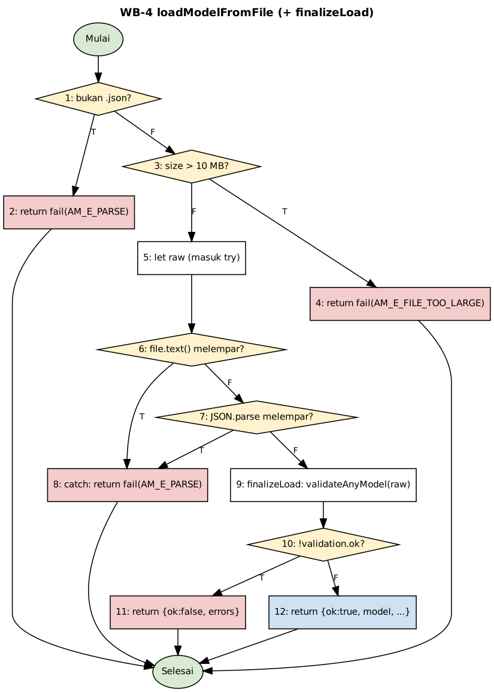

# REPORT — Evaluasi modul Text Analytics Statify (String to Word Vector, Naive Bayes, Apply Model)

Dokumen ini digenerate oleh `tools/build_report.py` dari `report/REPORT.template.md`. Tabel disalin dari dokumen track yang sudah diisi `tools/apply_results.py`; angka jumlah tes dihitung dari `logs/`. Jangan menyunting `REPORT.md` langsung: ubah templat atau dokumen sumber, lalu jalankan ulang perintah di Bagian 1. Angka memakai koma desimal; angka di dalam log mentah tetap titik desimal.

## Ringkasan eksekutif

Paket evaluasi menambahkan tes unit (Track A), white-box basis path (B), black-box BB-01..BB-36 (C), perbandingan numerik dengan scikit-learn dan WEKA (D), pengukuran waktu (E), dan tes integrasi IT-01..IT-05 (F) tanpa mengubah satu baris pun kode produksi. Seluruh pengerjaan dilakukan di lingkungan tanpa akses jaringan (tidak ada crates.io, npm, PyPI), sehingga pembagian hasil sebagai berikut harus dibaca apa adanya.

Saat REPORT.md ini dibangun, log eksekusi Windows tersedia untuk 9 dari 9 target Rust thesis dan 7 dari 7 berkas hasil Jest Windows (`jest_<track>_win.json`). Status yang tidak berasal dari log Windows diberi label [VM] (VM Linux) atau BELUM DIJALANKAN.

- **Yang sudah dijalankan dan lulus di perangkat skripsi (Windows 11).** Seluruh 453 tes Jest baru lulus dengan konfigurasi Jest produksi, dan seluruh 136 fungsi tes Rust baru (`thesis_*.rs`) dikompilasi pada percobaan pertama dan lulus (rustc 1.93.0). Lima skrip integrasi Node IT-01..IT-05 dan alur perbandingan numerik Track D (scikit-learn 1.9.1 dan WEKA 3.9.6) dijalankan ulang di Windows dengan hasil yang sama dengan VM. Pengukuran waktu Track E dijalankan di perangkat skripsi. Eksekusi penuh ulang di VM (tes lama dan baru) tidak menunjukkan regresi (tabel "Eksekusi penuh Jest").
- **Yang belum dijalankan.** Daftar periksa manual (M-01..M-36 dan MF-01..MF-05) dan butir lain pada Bagian 11, terutama dataset >= 20.000 dokumen untuk Track E.
- **Baseline Windows (tes yang sudah ada sebelum paket ini).** Rust 450 tes lulus (inti 91, Naive Bayes 203, Apply Model 156; STWV tidak punya tes) dan Jest 830 tes lulus (STWV 111, Naive Bayes 253, Apply Model 466), tanpa kegagalan (Bagian 3); eksekusi ulang di Windows pada 8 Oktober 2026 memberi angka yang sama.
- **Temuan.** 25 butir di `BUGS.md` (Bagian 10): satu berkategori tinggi (E-01, panic wasm pada stemming Sastrawi dengan token berkarakter kedua multibita), lima berkategori sedang (A-1 `KFolds = 1`; C2-01..C2-03 pada antarmuka Naive Bayes; D-01 beda versi `sastrawi-rs` antar-crate), sisanya rendah atau informasi.
- **Kesetaraan numerik.** Pada 24 konfigurasi dan tiga dataset, kelas prediksi Statify sama dengan scikit-learn pada 17.221 dari 17.221 prediksi; selisih probabilitas keluaran Apply Model sepenuhnya akibat pembulatan 4 desimal (Track D, Bagian 7).

### Jumlah tes per track

| Track | Tes Jest | Lulus | Gagal | Sumber Jest | Fungsi tes Rust ditulis | Hasil Rust |
|---|---|---|---|---|---|---|
| Unit (A) | 105 | 105 | 0 | Windows | 66 | thesis_formulas: 15 lulus, 0 gagal [Win]; thesis_vocab_limit: 13 lulus, 0 gagal [Win]; thesis_text_pipeline: 20 lulus, 0 gagal [Win]; thesis_partition: 18 lulus, 0 gagal [Win] |
| White-box (B) | 54 | 54 | 0 | Windows | - | - |
| Black-box STWV (C1) | 35 | 35 | 0 | Windows | 31 | thesis_blackbox_stwv: 31 lulus, 0 gagal [Win] |
| Black-box Naive Bayes (C2) | 63 | 63 | 0 | Windows | 24 | thesis_blackbox_nb: 24 lulus, 0 gagal [Win] |
| Black-box Apply Model (C3) | 95 | 95 | 0 | Windows | 12 | thesis_blackbox_am: 12 lulus, 0 gagal [Win] |
| Akurasi (D) | 3 | 3 | 0 | Windows | 1 | thesis_compare: 1 lulus, 0 gagal [Win] |
| Integrasi (F) | 98 | 98 | 0 | Windows | 2 | thesis_integration: 2 lulus, 0 gagal [Win] |
| **Jumlah** | **453** | **453** | **0** | | **136** | |

Kolom "Sumber Jest" menunjukkan asal angka: Windows bila `jest_<track>_win.json` ada, jika tidak VM Linux. Tes Rust: kolom "Fungsi tes Rust ditulis" menghitung `#[test]` pada berkas `thesis_*.rs`; hasilnya hanya tercatat bila ada `logs/rust_<target>.txt` dari Windows.

### Eksekusi penuh Jest (regresi)

| Platform | Jumlah potongan eksekusi | Suite | Tes | Lulus | Gagal |
|---|---|---|---|---|---|
| Windows | 0 | NOT RUN | NOT RUN | NOT RUN | NOT RUN |
| VM Linux | 13 | 77 | 1.322 | 1.322 | 0 |

Eksekusi penuh = semua berkas tes di tiga menu (tes lama dan tes baru) dalam potongan `tools/vm_chunk.sh`. Konfigurasi VM: ts-jest dan penyesuaian resolver (lihat `ENV.md`); bukan konfigurasi produksi. Di Windows tes lama (baseline: 830 lulus) dan tes baru (453 lulus) dijalankan terpisah dengan konfigurasi produksi oleh `run_all.ps1`, sehingga baris Windows di atas kosong tanpa berarti belum dijalankan.

## 1. Cara menjalankan ulang (satu perintah)

Di Windows, dari akar repo `statify64`:

```
powershell -ExecutionPolicy Bypass -File testing\thesis-eval\run_all.ps1
```

Skrip mencatat lingkungan, menjalankan baseline (Rust, Jest, cakupan), Track A, B, C1, C2, C3, D, F, lalu E (terakhir; jangan memakai komputer selama pengukuran), dan mengisi status dengan `python testing\thesis-eval\tools\apply_results.py`. Opsi: `-SkipE`, `-SkipRust`, `-SkipBaseline`, `-SkipTracks`, `-Only A,B,C1,C2,C3,D,E,F`. Setelah selesai, bangun ulang dokumen akhir:

```
python testing\thesis-eval\tools\apply_results.py
python testing\thesis-eval\tools\merge_docs.py
python testing\thesis-eval\tools\build_report.py
```

Skrip tidak menghapus berkas, tidak mengubah kode produksi, dan tidak melakukan commit atau push. Seed acak 42 dan toleransi numerik 1e-6 kecuali ditentukan lain. Perintah per track ada di `run_A.ps1` .. `run_F.ps1`.

## 2. Lingkungan

Perangkat uji skripsi: Lenovo IdeaPad Gaming 3, Ryzen 5 4600H, RAM 16 GB, Windows 11, rustc 1.93.0, WEKA 3.9.6. Pengerjaan, scikit-learn, dan graphviz dijalankan di sandbox cloud; Jest dan skrip headless di VM Linux (Ryzen 5 4600H terlihat dari VM, 2 vCPU, 3,9 GB). Hanya perangkat Windows yang boleh dipakai untuk angka waktu di buku. Daftar versi lengkap, termasuk penyimpangan dari prompt (tanpa jaringan; ts-jest menggantikan SWC pada VM; biner wasm yang sudah dibangun dipakai apa adanya), ada di `ENV.md`.

## 3. Baseline (tes yang sudah ada)

### 01 — Baseline pengujian yang sudah ada

**Tanggal eksekusi:** 7 Oktober 2026, sekitar pukul 12:43–12:46 UTC (19:43–19:46 WIB), pada komputer Windows pengguna, dengan HEAD repo `f82ddf0c85aaf69d5618baaee274b01b3ab8e4a9` (branch `dija-v2`; HEAD itu tidak berubah sejak log direkam sampai sesi ini; branch kerja evaluasi `thesis-eval` dibuat dari commit yang sama).

**Asal log.** Log baseline di bawah berasal dari eksekusi nyata `cargo test` dan `npx jest` di Windows yang sudah ada di `logs/` ketika sesi evaluasi ini dimulai (`unit_*.txt`, `jest_stwv|nb|am.txt`; waktu berkas tercatat pada tabel sumber). Log itu berkode UTF-16 dan memuat noise PowerShell (CLIXML), sehingga angka diekstrak dengan `tools/build_baseline.py` (regex pada keluaran `cargo test`/Jest), bukan diketik tangan. Sesi ini tidak dapat menjalankan `cargo` (tidak ada akses jaringan ke crates.io), jadi baseline Rust tidak dapat diulang di sandbox. `run_all.ps1` menjalankan ulang baseline dengan keluaran UTF-8 bersih (`logs/baseline_*.txt`); `build_baseline.py` akan otomatis memakai log baru itu bila ada.

**Definisi baseline.** Hanya tes yang sudah ada sebelum paket evaluasi: target `thesis_*` dan folder `__tests__/thesis/` tidak dihitung. Cakupan Jest diukur terbatas pada folder tiga menu (`--collectCoverageFrom`), kolom `% Lines` pada baris `All files`. Cakupan Rust: NOT RUN karena `cargo-llvm-cov` tidak terpasang/tidak dapat dijalankan di sesi ini; `run_all.ps1` mengukurnya bila alat itu ada di Windows.

Tabel dibangun oleh `tools/build_baseline.py` langsung dari log eksekusi (tidak ada angka diketik tangan). Baris Rust diisi dari keluaran `cargo test`; baris Jest dari ringkasan Jest (`Tests:` dan kolom `% Lines` pada baris `All files`).

| Lapisan | Lokasi pengujian | Jumlah kasus | Lulus | Gagal | Cakupan baris |
|---|---|---|---|---|---|
| Rust pustaka inti | `public/workers/TextAnalytics/statify-text-core/tests/` (5 berkas integrasi) + `src/` | 91 | 91 | 0 | NOT RUN (cargo-llvm-cov belum dijalankan) |
| Rust Naive Bayes | `naive-bayes/rust/src/` (tes unit dalam lib) | 203 | 203 | 0 | NOT RUN (cargo-llvm-cov belum dijalankan) |
| Rust Apply Model | `apply-model/rust/src/` + `rust/tests/text_scoring.rs` | 156 | 156 | 0 | NOT RUN (cargo-llvm-cov belum dijalankan) |
| Rust STWV | `StringToWordVector/rust/` (tidak ada tes) | 0 | 0 | 0 | NOT RUN (cargo-llvm-cov belum dijalankan) |
| Jest STWV | `Transform/StringToWordVector/__tests__/` (9 suite) | 111 | 111 | 0 | 52,24% |
| Jest Naive Bayes | `Classify/naive-bayes/**/__tests__/` (13 suite) | 253 | 253 | 0 | 86,64% |
| Jest Apply Model | `Classify/apply-model/**/__tests__/` (26 suite) | 466 | 466 | 0 | 97,21% |

#### Sumber dan tanggal eksekusi

| Lapisan | Berkas log | Waktu berkas log (UTC) | Rincian |
|---|---|---|---|
| Rust pustaka inti | `logs/unit_core.txt` | 2026-10-07 12:43 UTC | lib: 0 lulus; characterization: 15 lulus; nb_text: 13 lulus; s2_pipeline: 16 lulus; s3_formulas: 25 lulus; s4_fit_transform: 22 lulus; doc-tests: 0 lulus |
| Rust Naive Bayes | `logs/unit_nb.txt` | 2026-10-07 12:43 UTC | lib: 203 lulus; doc-tests: 0 lulus |
| Rust Apply Model | `logs/unit_am.txt` | 2026-10-07 12:43 UTC | lib: 117 lulus; text_scoring: 39 lulus; doc-tests: 0 lulus |
| Rust STWV | `logs/unit_stwv.txt` | 2026-10-07 12:44 UTC | lib: 0 lulus; doc-tests: 0 lulus |
| Jest STWV | `logs/jest_stwv.txt` | 2026-10-07 12:44 UTC | 9 suite |
| Jest Naive Bayes | `logs/jest_nb.txt` | 2026-10-07 12:45 UTC | 13 suite |
| Jest Apply Model | `logs/jest_am.txt` | 2026-10-07 12:45 UTC | 26 suite |

#### Pembanding silang di VM Linux (bukan perangkat skripsi)

Jest dijalankan ulang di VM lokal (Linux, Node 22.23.2) dengan `ts-jest` sebagai pengganti transformer SWC bawaan `next/jest` (biner SWC yang terpasang hanya versi Windows). Hasilnya konsisten dengan log Windows pada jumlah kasus: STWV 111 tes (9 suite, identik), Apply Model 466 tes (identik). Naive Bayes: 292 tes di VM karena menyertakan 39 tes white-box lama milik pengguna (`hooks/__tests__/whitebox.*.test.ts`, belum dilacak git) yang belum ada saat log Windows direkam (253 + 39 = 292). Cakupan baris di VM berbeda tipis karena instrumentasi berbeda: STWV 51,37% (Windows 52,24%), Naive Bayes 87,01% (86,64%), Apply Model 97,50% (97,21%). Sumber: `logs/coverage_jest_summary_vm.txt`. Angka resmi untuk buku tetap angka Windows di tabel atas.

#### Berkas dengan cakupan di bawah 70% (terukur, Jest)

Dari pengukuran VM: STWV — `OptionsTab.tsx`, `StringToWordVectorModal.tsx`, `VariablesTab.tsx`, `stringToWord.processor.ts`, `hooks/useStringToWordVector.ts` (semuanya 0% baris, komponen UI dan hook yang memuat Worker); Naive Bayes — `components/export-model-output.tsx` (0%), `dialogs/validation.tsx` (17,94%); Apply Model — tidak ada. Pembahasan celah dan tes tambahan ada di `A_unit.md`.

**Pembaruan 8 Oktober 2026.** Eksekusi ulang di Windows oleh `run_all.ps1` (log `baseline_rust_*.txt`, `baseline_jest_*.txt`, `baseline_jest_*_win.json`, `baseline_coverage_*_win.json`) memberi jumlah tes yang sama (Rust 91/203/156/0; Jest 111/253/466) dan cakupan baris Jest STWV 52,24%, Naive Bayes 86,64%, Apply Model 97,21% (dua angka terakhir berbeda tipis dari eksekusi 7 Oktober karena himpunan berkas cakupan ditentukan oleh `--collectCoverageFrom`; angka di tabel di atas sudah memakai nilai eksekusi 8 Oktober).

Interpretasi. Seluruh tes lama lulus pada eksekusi Windows (Rust 450, Jest 830, tidak ada kegagalan), sehingga paket evaluasi dimulai dari baseline hijau. Pustaka STWV Rust tidak punya satu pun tes, dan cakupan Rust tidak terukur karena `cargo-llvm-cov` belum terpasang. Cakupan baris Jest paling rendah ada pada menu STWV (52,24%) karena komponen UI (`OptionsTab.tsx`, `VariablesTab.tsx`, `StringToWordVectorModal.tsx`, `useStringToWordVector.ts`) tidak punya tes; Naive Bayes 86,64% dan Apply Model 97,21%. Pengukuran VM (cakupan 51,37 / 87,01 / 97,50%) berbeda tipis karena instrumen dan himpunan berkas berbeda, dan hanya dipakai sebagai pembanding.

## 4. Track A — Pengujian unit tambahan

Kolom tabel: `| Berkas | Nama tes | Perilaku yang diuji | Status |`. Status [Win] adalah hasil eksekusi di Windows (perangkat skripsi); [VM] hasil di VM Linux; BELUM DIJALANKAN berarti belum ada log eksekusi.

### Track A — Jest (105 kasus; DIJALANKAN di VM)

| Berkas | Nama tes | Perilaku yang diuji | Status |
|---|---|---|---|
| `model-loader.thesis.test.ts` | konstanta batas = 10 x 1024 x 1024 byte dan pesan pengguna menyebut 10 MB | thesis A(f): batas ukuran berkas 10 MB | Lulus [Win] |
| `model-loader.thesis.test.ts` | 10 MB + 1 byte ditolak AM_E_FILE_TOO_LARGE (detail = nama berkas) dan isi TIDAK dibaca | thesis A(f): batas ukuran berkas 10 MB | Lulus [Win] |
| `model-loader.thesis.test.ts` | 10 MB - 1 byte dan tepat 10 MB diterima untuk model valid (isi dibaca) | thesis A(f): batas ukuran berkas 10 MB | Lulus [Win] |
| `model-loader.thesis.test.ts` | urutan pemeriksaan: ekstensi lebih dulu (.txt besar -> AM_E_PARSE), lalu ukuran, baru isi (besar + rusak -> TOO_LARGE) | thesis A(f): batas ukuran berkas 10 MB | Lulus [Win] |
| `model-loader.thesis.test.ts` | ekstensi: .JSON diterima; tanpa ekstensi atau .json.txt ditolak AM_E_PARSE | thesis A(f): batas ukuran berkas 10 MB | Lulus [Win] |
| `model-loader.thesis.test.ts` | berkas kosong -> AM_E_PARSE dengan detail nama berkas | thesis A(f): JSON rusak | Lulus [Win] |
| `model-loader.thesis.test.ts` | hanya spasi -> AM_E_PARSE dengan detail nama berkas | thesis A(f): JSON rusak | Lulus [Win] |
| `model-loader.thesis.test.ts` | kurung buka saja -> AM_E_PARSE dengan detail nama berkas | thesis A(f): JSON rusak | Lulus [Win] |
| `model-loader.thesis.test.ts` | objek terpotong setelah koma -> AM_E_PARSE dengan detail nama berkas | thesis A(f): JSON rusak | Lulus [Win] |
| `model-loader.thesis.test.ts` | array terpotong -> AM_E_PARSE dengan detail nama berkas | thesis A(f): JSON rusak | Lulus [Win] |
| `model-loader.thesis.test.ts` | tanda kutip tunggal -> AM_E_PARSE dengan detail nama berkas | thesis A(f): JSON rusak | Lulus [Win] |
| `model-loader.thesis.test.ts` | literal undefined -> AM_E_PARSE dengan detail nama berkas | thesis A(f): JSON rusak | Lulus [Win] |
| `model-loader.thesis.test.ts` | literal NaN -> AM_E_PARSE dengan detail nama berkas | thesis A(f): JSON rusak | Lulus [Win] |
| `model-loader.thesis.test.ts` | koma di akhir objek -> AM_E_PARSE dengan detail nama berkas | thesis A(f): JSON rusak | Lulus [Win] |
| `model-loader.thesis.test.ts` | teks acak -> AM_E_PARSE dengan detail nama berkas | thesis A(f): JSON rusak | Lulus [Win] |
| `model-loader.thesis.test.ts` | model valid yang dipotong separuh -> AM_E_PARSE | thesis A(f): JSON rusak | Lulus [Win] |
| `model-loader.thesis.test.ts` | model valid dengan sampah di akhir -> AM_E_PARSE | thesis A(f): JSON rusak | Lulus [Win] |
| `model-loader.thesis.test.ts` | pesan pengguna AM_E_PARSE menyebut JSON dan berakhiran kode | thesis A(f): JSON rusak | Lulus [Win] |
| `model-loader.thesis.test.ts` | null -> AM_E_NOT_OBJECT | thesis A(f): JSON valid tetapi bukan model | Lulus [Win] |
| `model-loader.thesis.test.ts` | [] -> AM_E_NOT_OBJECT | thesis A(f): JSON valid tetapi bukan model | Lulus [Win] |
| `model-loader.thesis.test.ts` | [1,2,3] -> AM_E_NOT_OBJECT | thesis A(f): JSON valid tetapi bukan model | Lulus [Win] |
| `model-loader.thesis.test.ts` | 42 -> AM_E_NOT_OBJECT | thesis A(f): JSON valid tetapi bukan model | Lulus [Win] |
| `model-loader.thesis.test.ts` | "teks" -> AM_E_NOT_OBJECT | thesis A(f): JSON valid tetapi bukan model | Lulus [Win] |
| `model-loader.thesis.test.ts` | true -> AM_E_NOT_OBJECT | thesis A(f): JSON valid tetapi bukan model | Lulus [Win] |
| `model-loader.thesis.test.ts` | objek kosong -> AM_E_MODEL_TYPE_MISSING | thesis A(f): JSON valid tetapi bukan model | Lulus [Win] |
| `model-loader.thesis.test.ts` | model_type angka -> AM_E_MODEL_TYPE_MISSING | thesis A(f): JSON valid tetapi bukan model | Lulus [Win] |
| `model-loader.thesis.test.ts` | model_type null -> AM_E_MODEL_TYPE_MISSING | thesis A(f): JSON valid tetapi bukan model | Lulus [Win] |
| `model-loader.thesis.test.ts` | model_type "decision_tree" -> AM_E_MODEL_TYPE_UNSUPPORTED (detail = tipe) | thesis A(f): JSON valid tetapi bukan model | Lulus [Win] |
| `model-loader.thesis.test.ts` | model_type "Naive_Bayes" -> AM_E_MODEL_TYPE_UNSUPPORTED (detail = tipe) | thesis A(f): JSON valid tetapi bukan model | Lulus [Win] |
| `model-loader.thesis.test.ts` | model_type "constructor" -> AM_E_MODEL_TYPE_UNSUPPORTED (detail = tipe) | thesis A(f): JSON valid tetapi bukan model | Lulus [Win] |
| `model-loader.thesis.test.ts` | model_type "__proto__" -> AM_E_MODEL_TYPE_UNSUPPORTED (detail = tipe) | thesis A(f): JSON valid tetapi bukan model | Lulus [Win] |
| `model-loader.thesis.test.ts` | model_type "toString" -> AM_E_MODEL_TYPE_UNSUPPORTED (detail = tipe) | thesis A(f): JSON valid tetapi bukan model | Lulus [Win] |
| `model-loader.thesis.test.ts` | schema_version "9.9" -> satu galat AM_E_SCHEMA_VERSION_UNSUPPORTED (validasi berhenti, detail = versi) | thesis A(f): schema_version tidak dikenal (lewat loader) | Lulus [Win] |
| `model-loader.thesis.test.ts` | schema_version "1.2" -> satu galat AM_E_SCHEMA_VERSION_UNSUPPORTED (validasi berhenti, detail = versi) | thesis A(f): schema_version tidak dikenal (lewat loader) | Lulus [Win] |
| `model-loader.thesis.test.ts` | schema_version "3.0" -> satu galat AM_E_SCHEMA_VERSION_UNSUPPORTED (validasi berhenti, detail = versi) | thesis A(f): schema_version tidak dikenal (lewat loader) | Lulus [Win] |
| `model-loader.thesis.test.ts` | schema_version "0.9" -> satu galat AM_E_SCHEMA_VERSION_UNSUPPORTED (validasi berhenti, detail = versi) | thesis A(f): schema_version tidak dikenal (lewat loader) | Lulus [Win] |
| `model-loader.thesis.test.ts` | schema_version "" -> satu galat AM_E_SCHEMA_VERSION_UNSUPPORTED (validasi berhenti, detail = versi) | thesis A(f): schema_version tidak dikenal (lewat loader) | Lulus [Win] |
| `model-loader.thesis.test.ts` | schema_version "v1.1" -> satu galat AM_E_SCHEMA_VERSION_UNSUPPORTED (validasi berhenti, detail = versi) | thesis A(f): schema_version tidak dikenal (lewat loader) | Lulus [Win] |
| `model-loader.thesis.test.ts` | schema_version hilang atau bukan string -> galat yang sama (detail kosong atau nilai teks) | thesis A(f): schema_version tidak dikenal (lewat loader) | Lulus [Win] |
| `model-loader.thesis.test.ts` | versi yang didukung (1.0, 1.1, 2.0) berhasil; pesan pengguna menyebut ketiganya | thesis A(f): schema_version tidak dikenal (lewat loader) | Lulus [Win] |
| `model-loader.thesis.test.ts` | target.classes = [] -> gagal dengan AM_E_CLASSES_EMPTY | thesis A(f): kelas kosong dan kosakata kosong (lewat loader) | Lulus [Win] |
| `model-loader.thesis.test.ts` | kelas kosong dengan prior dan jumlah kasus juga kosong -> tetap gagal (bukan lolos tanpa kelas) | thesis A(f): kelas kosong dan kosakata kosong (lewat loader) | Lulus [Win] |
| `model-loader.thesis.test.ts` | classes bukan array -> AM_E_FIELD_TYPE (bukan AM_E_CLASSES_EMPTY) | thesis A(f): kelas kosong dan kosakata kosong (lewat loader) | Lulus [Win] |
| `model-loader.thesis.test.ts` | nb-model-v2_0-vector.json dengan text.terms = [] -> AM_E_NB2_TEXT_SHAPE (detail 'text.terms: empty') | thesis A(f): kelas kosong dan kosakata kosong (lewat loader) | Lulus [Win] |
| `model-loader.thesis.test.ts` | nb-model-v2_0-raw.json dengan text.terms = [] -> AM_E_NB2_TEXT_SHAPE (detail 'text.terms: empty') | thesis A(f): kelas kosong dan kosakata kosong (lewat loader) | Lulus [Win] |
| `model-loader.thesis.test.ts` | text.terms bukan array -> AM_E_FIELD_TYPE (detail text.terms) | thesis A(f): kelas kosong dan kosakata kosong (lewat loader) | Lulus [Win] |
| `model-loader.thesis.test.ts` | model raw dengan recipe.vocabulary kosong -> gagal (kosakata resep tidak sama dengan terms) | thesis A(f): kelas kosong dan kosakata kosong (lewat loader) | Lulus [Win] |
| `model-loader.thesis.test.ts` | ada fixture ekspor nyata untuk diuji | thesis A(f): fixture ekspor model nyata dan konsistensi kode galat | Lulus [Win] |
| `model-loader.thesis.test.ts` | fixture Naive_Bayes_Model_Export (4).json berhasil dimuat lewat loader (ukuran di bawah 10 MB) | thesis A(f): fixture ekspor model nyata dan konsistensi kode galat | Lulus [Win] |
| `model-loader.thesis.test.ts` | fixture Naive_Bayes_Model_Export (5) minstd.json berhasil dimuat lewat loader (ukuran di bawah 10 MB) | thesis A(f): fixture ekspor model nyata dan konsistensi kode galat | Lulus [Win] |
| `model-loader.thesis.test.ts` | fixture Naive_Bayes_Model_Export (5).json berhasil dimuat lewat loader (ukuran di bawah 10 MB) | thesis A(f): fixture ekspor model nyata dan konsistensi kode galat | Lulus [Win] |
| `model-loader.thesis.test.ts` | fixture Naive_Bayes_Model_Export (5)17rbVEC.json berhasil dimuat lewat loader (ukuran di bawah 10 MB) | thesis A(f): fixture ekspor model nyata dan konsistensi kode galat | Lulus [Win] |
| `model-loader.thesis.test.ts` | fixture Naive_Bayes_Model_Export (6)complement.json berhasil dimuat lewat loader (ukuran di bawah 10 MB) | thesis A(f): fixture ekspor model nyata dan konsistensi kode galat | Lulus [Win] |
| `model-loader.thesis.test.ts` | setiap kode galat yang dihasilkan jalur file terdaftar di ALL_APPLY_MODEL_CODES dan punya pesan berakhiran kode | thesis A(f): fixture ekspor model nyata dan konsistensi kode galat | Lulus [Win] |
| `kfold.thesis.test.ts` | nilai bawaan formulir: 10 fold, tanpa galat | thesis A(e): batas jumlah fold pada getNumericInputError | Lulus [Win] |
| `kfold.thesis.test.ts` | KFolds = -5 ditolak dengan pesan batas minimum | thesis A(e): batas jumlah fold pada getNumericInputError | Lulus [Win] |
| `kfold.thesis.test.ts` | KFolds = -1 ditolak dengan pesan batas minimum | thesis A(e): batas jumlah fold pada getNumericInputError | Lulus [Win] |
| `kfold.thesis.test.ts` | KFolds = 0 ditolak dengan pesan batas minimum | thesis A(e): batas jumlah fold pada getNumericInputError | Lulus [Win] |
| `kfold.thesis.test.ts` | KARAKTERISASI TEMUAN: KFolds = 1 DITERIMA (hanya nilai < 1 yang ditolak) | thesis A(e): batas jumlah fold pada getNumericInputError | Lulus [Win] |
| `kfold.thesis.test.ts` | KFolds = 2 diterima (tidak ada batas atas di sisi TypeScript; batas atas ditegakkan Rust) | thesis A(e): batas jumlah fold pada getNumericInputError | Lulus [Win] |
| `kfold.thesis.test.ts` | KFolds = 3 diterima (tidak ada batas atas di sisi TypeScript; batas atas ditegakkan Rust) | thesis A(e): batas jumlah fold pada getNumericInputError | Lulus [Win] |
| `kfold.thesis.test.ts` | KFolds = 10 diterima (tidak ada batas atas di sisi TypeScript; batas atas ditegakkan Rust) | thesis A(e): batas jumlah fold pada getNumericInputError | Lulus [Win] |
| `kfold.thesis.test.ts` | KFolds = 100 diterima (tidak ada batas atas di sisi TypeScript; batas atas ditegakkan Rust) | thesis A(e): batas jumlah fold pada getNumericInputError | Lulus [Win] |
| `kfold.thesis.test.ts` | KFolds = 1000 diterima (tidak ada batas atas di sisi TypeScript; batas atas ditegakkan Rust) | thesis A(e): batas jumlah fold pada getNumericInputError | Lulus [Win] |
| `kfold.thesis.test.ts` | KFolds = 1000000000 diterima (tidak ada batas atas di sisi TypeScript; batas atas ditegakkan Rust) | thesis A(e): batas jumlah fold pada getNumericInputError | Lulus [Win] |
| `kfold.thesis.test.ts` | KFolds = 1.5 (bukan bilangan bulat berhingga) ditolak | thesis A(e): batas jumlah fold pada getNumericInputError | Lulus [Win] |
| `kfold.thesis.test.ts` | KFolds = 2.5 (bukan bilangan bulat berhingga) ditolak | thesis A(e): batas jumlah fold pada getNumericInputError | Lulus [Win] |
| `kfold.thesis.test.ts` | KFolds = 0.5 (bukan bilangan bulat berhingga) ditolak | thesis A(e): batas jumlah fold pada getNumericInputError | Lulus [Win] |
| `kfold.thesis.test.ts` | KFolds = NaN (bukan bilangan bulat berhingga) ditolak | thesis A(e): batas jumlah fold pada getNumericInputError | Lulus [Win] |
| `kfold.thesis.test.ts` | KFolds = Infinity (bukan bilangan bulat berhingga) ditolak | thesis A(e): batas jumlah fold pada getNumericInputError | Lulus [Win] |
| `kfold.thesis.test.ts` | KFolds = -Infinity (bukan bilangan bulat berhingga) ditolak | thesis A(e): batas jumlah fold pada getNumericInputError | Lulus [Win] |
| `kfold.thesis.test.ts` | KFolds bukan number ("5") ditolak | thesis A(e): batas jumlah fold pada getNumericInputError | Lulus [Win] |
| `kfold.thesis.test.ts` | KFolds bukan number ("") ditolak | thesis A(e): batas jumlah fold pada getNumericInputError | Lulus [Win] |
| `kfold.thesis.test.ts` | KFolds bukan number (null) ditolak | thesis A(e): batas jumlah fold pada getNumericInputError | Lulus [Win] |
| `kfold.thesis.test.ts` | KFolds bukan number (undefined) ditolak | thesis A(e): batas jumlah fold pada getNumericInputError | Lulus [Win] |
| `kfold.thesis.test.ts` | KFolds bukan number (true) ditolak | thesis A(e): batas jumlah fold pada getNumericInputError | Lulus [Win] |
| `kfold.thesis.test.ts` | pada mode holdout nilai KFolds yang tidak sah diabaikan; sebaliknya TrainingPercentage tidak diperiksa pada kfold | thesis A(e): batas jumlah fold pada getNumericInputError | Lulus [Win] |
| `kfold.thesis.test.ts` | buildNaiveBayesWorkerConfig tidak menambah penjaga: ValidationMethod kfold dan KFolds 1 sampai ke Rust | thesis A(e): KFolds = 1 diteruskan apa adanya ke worker | Lulus [Win] |
| `kfold.thesis.test.ts` | nilai KFolds lain juga tidak diubah (2, 10) | thesis A(e): KFolds = 1 diteruskan apa adanya ke worker | Lulus [Win] |
| `kfold.thesis.test.ts` | galat Rust "Number of folds must be at least 1 (got 0)." dipetakan ke saran pengaturan cross-validation | thesis A(e): pemetaan pesan galat Rust terkait jumlah fold | Lulus [Win] |
| `kfold.thesis.test.ts` | galat Rust "Number of folds (15) cannot be greater than the number of valid instances (10). Choose a smaller number of folds." dipetakan ke saran pengaturan cross-validation | thesis A(e): pemetaan pesan galat Rust terkait jumlah fold | Lulus [Win] |
| `kfold.thesis.test.ts` | galat Rust "Cannot create cross-validation folds: there are no valid instances after missing-value handling." dipetakan ke saran pengaturan cross-validation | thesis A(e): pemetaan pesan galat Rust terkait jumlah fold | Lulus [Win] |
| `kfold.thesis.test.ts` | teks peringatan Rust yang memuat kata fold juga dipetakan ke saran yang sama (pemeta berbasis pencocokan kata) | thesis A(e): pemetaan pesan galat Rust terkait jumlah fold | Lulus [Win] |
| `formula-output.thesis.test.ts` | Weka: 3 TF x 2 IDF x 2 normalisasi; sklearn: 3 x 3 x 3; custom: semua 5 x 4 x 4 | thesis A: opsi rumus UI sama dengan tabel kombinasi sah validator Rust | Lulus [Win] |
| `formula-output.thesis.test.ts` | untuk ke-80 kombinasi pada grid acuan: sah-Weka/sah-sklearn menurut UI = menurut validator Rust (weka_ok/sklearn_ok) | thesis A: opsi rumus UI sama dengan tabel kombinasi sah validator Rust | Lulus [Win] |
| `formula-output.thesis.test.ts` | rumus yang ditampilkan di tooltip sesuai definisi yang diimplementasikan Rust | thesis A: opsi rumus UI sama dengan tabel kombinasi sah validator Rust | Lulus [Win] |
| `formula-output.thesis.test.ts` | kolom 'Documents (Non-zero)' = document frequency acuan [2, 2, 2, 2, 1] dan tidak ada vektor nol | thesis A: buildStwvOutput pada korpus D (acuan df dari reference_values.py) | Lulus [Win] |
| `formula-output.thesis.test.ts` | label pengaturan: tiga standar rumus dan opsinya | thesis A: buildStwvOutput pada korpus D (acuan df dari reference_values.py) | Lulus [Win] |
| `formula-output.thesis.test.ts` | label stopword, stemming, tokenizer, huruf kecil, dan min term frequency | thesis A: buildStwvOutput pada korpus D (acuan df dari reference_values.py) | Lulus [Win] |
| `formula-output.thesis.test.ts` | kosakata kosong: tabel kosakata tidak dibuat dan kolom pertama-terakhir '-' | thesis A: buildStwvOutput pada korpus D (acuan df dari reference_values.py) | Lulus [Win] |
| `formula-output.thesis.test.ts` | satu kolom: kalimat tunggal; tepat MAX_VOCABULARY_ROWS istilah tidak memunculkan catatan pemotongan | thesis A: buildStwvOutput pada korpus D (acuan df dari reference_values.py) | Lulus [Win] |
| `formula-output.thesis.test.ts` | dokumen kosong dihitung sebagai vektor nol dan durasi dibulatkan | thesis A: buildStwvOutput pada korpus D (acuan df dari reference_values.py) | Lulus [Win] |
| `stopwords.thesis.test.ts` | Indonesia: 758 entri, string tak kosong, tanpa spasi tepi, huruf kecil, tanpa duplikat | thesis A(c): daftar stopword bawaan | Lulus [Win] |
| `stopwords.thesis.test.ts` | Inggris: 1298 entri, string tak kosong, tanpa spasi tepi, huruf kecil, tanpa duplikat | thesis A(c): daftar stopword bawaan | Lulus [Win] |
| `stopwords.thesis.test.ts` | memuat kata fungsi umum dan (sesuai keputusan pemilik) kata negasi Indonesia | thesis A(c): daftar stopword bawaan | Lulus [Win] |
| `stopwords.thesis.test.ts` | salinan data tes Rust identik dengan konstanta TypeScript (penjaga sinkronisasi) | thesis A(c): daftar stopword bawaan | Lulus [Win] |
| `stopwords.thesis.test.ts` | indonesian -> custom_stopwords = JSON array daftar bawaan Indonesia | thesis A(c): payload stopword ke Rust (toRustConfig) | Lulus [Win] |
| `stopwords.thesis.test.ts` | english -> custom_stopwords = JSON array daftar bawaan Inggris | thesis A(c): payload stopword ke Rust (toRustConfig) | Lulus [Win] |
| `stopwords.thesis.test.ts` | none -> custom_stopwords null walau customList terisi | thesis A(c): payload stopword ke Rust (toRustConfig) | Lulus [Win] |
| `stopwords.thesis.test.ts` | custom -> satu kata per baris, di-trim, baris kosong/spasi dibuang, huruf asli dipertahankan | thesis A(c): payload stopword ke Rust (toRustConfig) | Lulus [Win] |
| `stopwords.thesis.test.ts` | custom dengan daftar kosong -> array kosong '[]' (bukan null) | thesis A(c): payload stopword ke Rust (toRustConfig) | Lulus [Win] |
| `stopwords.thesis.test.ts` | keluaran custom_stopwords selalu JSON valid berupa array string (kontrak yang diparse Rust) | thesis A(c): payload stopword ke Rust (toRustConfig) | Lulus [Win] |
| `stopwords.thesis.test.ts` | 15 pasangan (min <= max) sah dan diteruskan ke payload sebagai ngram_min/ngram_max | thesis A(c): rentang n-gram 1-5 pada konfigurasi | Lulus [Win] |
| `stopwords.thesis.test.ts` | pasangan min > max, nol, enam, dan non-bulat ditolak dengan pesan n-gram | thesis A(c): rentang n-gram 1-5 pada konfigurasi | Lulus [Win] |
| `stopwords.thesis.test.ts` | mode word selalu mengirim 1..1 walau minSize/maxSize bernilai lain | thesis A(c): rentang n-gram 1-5 pada konfigurasi | Lulus [Win] |

### Track A — Rust (66 fungsi tes; DIJALANKAN di Windows)

Seluruh tes Rust di bawah ditulis tanpa dapat dikompilasi; kompilasi pertamanya terjadi di Windows (`run_A.ps1`, rustc 1.93.0) dan seluruhnya lulus tanpa perubahan berkas. Sebelum itu hanya dilakukan: `rustfmt --check` (hanya parse sintaks, tanpa galat pada semua berkas `thesis_*.rs`; `logs/audit_rustfmt_syntax_cloud.txt`; ini BUKAN kompilasi), pembacaan ulang setiap berkas baris demi baris terhadap signature sumber (nama impor, tipe argumen, nama field `VectorizerOutput`, `TextVectorizerModel`, `HoldoutSplit`, `StratifiedKFold`, `PredictionScores`, `EvaluationMetrics`), dan penyalinan pola `cfg`/`run` dari `s3_formulas.rs` yang sudah terbukti kompil. Kekhawatiran kesalahan kompilasi tidak terbukti pada kompilasi Windows.

| Berkas | Nama tes | Perilaku yang diuji | Status |
|---|---|---|---|
| `thesis_formulas.rs` (statify-text-core) | `tf_binary_pada_korpus_d` | tf binary pada korpus d | Lulus [Win] |
| `thesis_formulas.rs` (statify-text-core) | `tf_raw_pada_korpus_d` | tf raw pada korpus d | Lulus [Win] |
| `thesis_formulas.rs` (statify-text-core) | `tf_log1p_pada_korpus_d` | tf log1p pada korpus d | Lulus [Win] |
| `thesis_formulas.rs` (statify-text-core) | `tf_sublinear_pada_korpus_d` | tf sublinear pada korpus d | Lulus [Win] |
| `thesis_formulas.rs` (statify-text-core) | `tf_normalized_pada_korpus_d` | tf normalized pada korpus d | Lulus [Win] |
| `thesis_formulas.rs` (statify-text-core) | `idf_standard_pada_korpus_d` | idf standard pada korpus d | Lulus [Win] |
| `thesis_formulas.rs` (statify-text-core) | `idf_smooth_pada_korpus_d` | idf smooth pada korpus d | Lulus [Win] |
| `thesis_formulas.rs` (statify-text-core) | `idf_plus1_pada_korpus_d` | idf plus1 pada korpus d | Lulus [Win] |
| `thesis_formulas.rs` (statify-text-core) | `normalisasi_l1_nilai_acuan_dan_jumlah_satu` | normalisasi l1 nilai acuan dan jumlah satu | Lulus [Win] |
| `thesis_formulas.rs` (statify-text-core) | `normalisasi_l2_nilai_acuan_dan_norma_satu` | normalisasi l2 nilai acuan dan norma satu | Lulus [Win] |
| `thesis_formulas.rs` (statify-text-core) | `normalisasi_doc_length_semua_baris_bernorma_rata_rata` | normalisasi doc length semua baris bernorma rata rata | Lulus [Win] |
| `thesis_formulas.rs` (statify-text-core) | `grid_80_kombinasi_pada_standar_custom` | grid 80 kombinasi pada standar custom | Lulus [Win] |
| `thesis_formulas.rs` (statify-text-core) | `grid_preset_weka_hanya_kombinasi_sah_dan_hasil_sama` | grid preset weka hanya kombinasi sah dan hasil sama | Lulus [Win] |
| `thesis_formulas.rs` (statify-text-core) | `grid_preset_sklearn_hanya_kombinasi_sah_dan_hasil_sama` | grid preset sklearn hanya kombinasi sah dan hasil sama | Lulus [Win] |
| `thesis_formulas.rs` (statify-text-core) | `tf_normalized_memakai_total_token_termasuk_ngram_sebelum_pemangkasan` | tf normalized memakai total token termasuk ngram sebelum pemangkasan | Lulus [Win] |
| `thesis_vocab_limit.rs` (statify-text-core) | `skenario_acuan_words_to_keep_dan_min_term_freq` | skenario acuan words to keep dan min term freq | Lulus [Win] |
| `thesis_vocab_limit.rs` (statify-text-core) | `words_to_keep_seri_tiga_arah_di_batas_dipilih_alfabetis_bukan_urutan_kemunculan` | words to keep seri tiga arah di batas dipilih alfabetis bukan urutan kemunculan | Lulus [Win] |
| `thesis_vocab_limit.rs` (statify-text-core) | `words_to_keep_memotong_ketat_walau_banyak_term_seri` | words to keep memotong ketat walau banyak term seri | Lulus [Win] |
| `thesis_vocab_limit.rs` (statify-text-core) | `words_to_keep_seri_diurutkan_bytewise_huruf_besar_sebelum_huruf_kecil` | words to keep seri diurutkan bytewise huruf besar sebelum huruf kecil | Lulus [Win] |
| `thesis_vocab_limit.rs` (statify-text-core) | `words_to_keep_hasil_stabil_pada_pengulangan_walau_urutan_hashmap_acak` | words to keep hasil stabil pada pengulangan walau urutan hashmap acak | Lulus [Win] |
| `thesis_vocab_limit.rs` (statify-text-core) | `words_to_keep_sama_dengan_atau_melebihi_jumlah_kandidat_tidak_memotong` | words to keep sama dengan atau melebihi jumlah kandidat tidak memotong | Lulus [Win] |
| `thesis_vocab_limit.rs` (statify-text-core) | `words_to_keep_3_pada_korpus_d_memilih_makan_nasi_saya` | words to keep 3 pada korpus d memilih makan nasi saya | Lulus [Win] |
| `thesis_vocab_limit.rs` (statify-text-core) | `custom_ranking_memakai_skor_bukan_total_count_dan_seri_alfabetis` | custom ranking memakai skor bukan total count dan seri alfabetis | Lulus [Win] |
| `thesis_vocab_limit.rs` (statify-text-core) | `min_term_freq_batas_inklusif_count_sama_dipertahankan` | min term freq batas inklusif count sama dipertahankan | Lulus [Win] |
| `thesis_vocab_limit.rs` (statify-text-core) | `min_term_freq_menghitung_total_kemunculan_bukan_jumlah_dokumen` | min term freq menghitung total kemunculan bukan jumlah dokumen | Lulus [Win] |
| `thesis_vocab_limit.rs` (statify-text-core) | `min_term_freq_lalu_words_to_keep_dengan_seri` | min term freq lalu words to keep dengan seri | Lulus [Win] |
| `thesis_vocab_limit.rs` (statify-text-core) | `min_term_freq_dihitung_pada_token_ngram_juga` | min term freq dihitung pada token ngram juga | Lulus [Win] |
| `thesis_vocab_limit.rs` (statify-text-core) | `pemangkasan_kosakata_tidak_mengubah_n_dokumen_dan_df_term_yang_tersisa` | pemangkasan kosakata tidak mengubah n dokumen dan df term yang tersisa | Lulus [Win] |
| `thesis_text_pipeline.rs` (statify-text-core) | `daftar_stopword_bawaan_dimuat_utuh_oleh_build_set` | daftar stopword bawaan dimuat utuh oleh build set | Lulus [Win] |
| `thesis_text_pipeline.rs` (statify-text-core) | `stopword_bawaan_indonesia_dan_inggris_sesuai_acuan_python` | stopword bawaan indonesia dan inggris sesuai acuan python | Lulus [Win] |
| `thesis_text_pipeline.rs` (statify-text-core) | `stopword_indonesia_membuang_kata_negasi_tidak` | stopword indonesia membuang kata negasi tidak | Lulus [Win] |
| `thesis_text_pipeline.rs` (statify-text-core) | `stopword_inggris_tidak_peka_huruf_besar_kecil_walau_lowercase_mati` | stopword inggris tidak peka huruf besar kecil walau lowercase mati | Lulus [Win] |
| `thesis_text_pipeline.rs` (statify-text-core) | `stopword_kustom_dinormalkan_lowercase_unik_dan_terurut_pada_resep` | stopword kustom dinormalkan lowercase unik dan terurut pada resep | Lulus [Win] |
| `thesis_text_pipeline.rs` (statify-text-core) | `stopword_metode_none_mengabaikan_daftar_yang_dikirim` | stopword metode none mengabaikan daftar yang dikirim | Lulus [Win] |
| `thesis_text_pipeline.rs` (statify-text-core) | `stopword_tanpa_daftar_atau_daftar_kosong_tidak_menyaring_apa_pun` | stopword tanpa daftar atau daftar kosong tidak menyaring apa pun | Lulus [Win] |
| `thesis_text_pipeline.rs` (statify-text-core) | `stopword_json_bukan_array_string_ditolak_invalid_stopwords` | stopword json bukan array string ditolak invalid stopwords | Lulus [Win] |
| `thesis_text_pipeline.rs` (statify-text-core) | `stopword_disaring_sebelum_stemming` | stopword disaring sebelum stemming | Lulus [Win] |
| `thesis_text_pipeline.rs` (statify-text-core) | `ngram_generate_semua_rentang_1_sampai_5_sesuai_acuan_python` | ngram generate semua rentang 1 sampai 5 sesuai acuan python | Lulus [Win] |
| `thesis_text_pipeline.rs` (statify-text-core) | `ngram_melalui_pipeline_penuh_semua_rentang_sah` | ngram melalui pipeline penuh semua rentang sah | Lulus [Win] |
| `thesis_text_pipeline.rs` (statify-text-core) | `ngram_jumlah_term_sama_dengan_rumus_untuk_tujuh_kata_berbeda` | ngram jumlah term sama dengan rumus untuk tujuh kata berbeda | Lulus [Win] |
| `thesis_text_pipeline.rs` (statify-text-core) | `ngram_hanya_bigram_tanpa_unigram_dan_token_kurang_dari_minimum_menghasilkan_kosong` | ngram hanya bigram tanpa unigram dan token kurang dari minimum menghasilkan kosong | Lulus [Win] |
| `thesis_text_pipeline.rs` (statify-text-core) | `ngram_dibentuk_setelah_stopword_dan_stemming_dan_tidak_melintasi_kata_terbuang` | ngram dibentuk setelah stopword dan stemming dan tidak melintasi kata terbuang | Lulus [Win] |
| `thesis_text_pipeline.rs` (statify-text-core) | `ngram_di_luar_rentang_1_sampai_5_ditolak_invalid_config` | ngram di luar rentang 1 sampai 5 ditolak invalid config | Lulus [Win] |
| `thesis_text_pipeline.rs` (statify-text-core) | `stemmer_indonesia_pasangan_yang_terbukti_di_tes_lama` | stemmer indonesia pasangan yang terbukti di tes lama | Lulus [Win] |
| `thesis_text_pipeline.rs` (statify-text-core) | `stemmer_indonesia_sifat_umum_pada_kata_berimbuhan` | stemmer indonesia sifat umum pada kata berimbuhan | Lulus [Win] |
| `thesis_text_pipeline.rs` (statify-text-core) | `stemmer_inggris_contoh_porter2_klasik` | stemmer inggris contoh porter2 klasik | Lulus [Win] |
| `thesis_text_pipeline.rs` (statify-text-core) | `stemmer_memaksa_lowercase_dan_metode_lain_mengembalikan_token_apa_adanya` | stemmer memaksa lowercase dan metode lain mengembalikan token apa adanya | Lulus [Win] |
| `thesis_text_pipeline.rs` (statify-text-core) | `stemmer_inggris_melalui_pipeline_dan_batch_sejajar` | stemmer inggris melalui pipeline dan batch sejajar | Lulus [Win] |
| `thesis_partition.rs` (naive-bayes (crate wasm)) | `holdout_70_30_jumlah_training_tiap_kelas_sama_dengan_pembulatan_70_persen` | holdout 70 30 jumlah training tiap kelas sama dengan pembulatan 70 persen | Lulus [Win] |
| `thesis_partition.rs` (naive-bayes (crate wasm)) | `holdout_70_30_proporsi_tiap_kelas_menyimpang_paling_banyak_setengah_data_dari_70_persen` | holdout 70 30 proporsi tiap kelas menyimpang paling banyak setengah data dari 70 persen | Lulus [Win] |
| `thesis_partition.rs` (naive-bayes (crate wasm)) | `holdout_indeks_training_dan_holdout_saling_lepas_dan_lengkap` | holdout indeks training dan holdout saling lepas dan lengkap | Lulus [Win] |
| `thesis_partition.rs` (naive-bayes (crate wasm)) | `holdout_persentase_lain_80_20_dan_60_40` | holdout persentase lain 80 20 dan 60 40 | Lulus [Win] |
| `thesis_partition.rs` (naive-bayes (crate wasm)) | `holdout_kelas_beranggota_satu_masuk_training_dan_holdout_tidak_memuatnya` | holdout kelas beranggota satu masuk training dan holdout tidak memuatnya | Lulus [Win] |
| `thesis_partition.rs` (naive-bayes (crate wasm)) | `mt19937_seed_42_dua_keluaran_awal_sama_dengan_numpy` | mt19937 seed 42 dua keluaran awal sama dengan numpy | Lulus [Win] |
| `thesis_partition.rs` (naive-bayes (crate wasm)) | `holdout_70_seed_42_indeks_eksak_sama_dengan_replika_python` | holdout 70 seed 42 indeks eksak sama dengan replika python | Lulus [Win] |
| `thesis_partition.rs` (naive-bayes (crate wasm)) | `kfold_seed_42_indeks_eksak_sama_dengan_replika_python` | kfold seed 42 indeks eksak sama dengan replika python | Lulus [Win] |
| `thesis_partition.rs` (naive-bayes (crate wasm)) | `kfold_selisih_jumlah_per_kelas_antar_fold_paling_banyak_satu` | kfold selisih jumlah per kelas antar fold paling banyak satu | Lulus [Win] |
| `thesis_partition.rs` (naive-bayes (crate wasm)) | `kfold_setiap_indeks_tepat_satu_fold` | kfold setiap indeks tepat satu fold | Lulus [Win] |
| `thesis_partition.rs` (naive-bayes (crate wasm)) | `kfold_ukuran_total_fold_berselisih_paling_banyak_jumlah_kelas` | kfold ukuran total fold berselisih paling banyak jumlah kelas | Lulus [Win] |
| `thesis_partition.rs` (naive-bayes (crate wasm)) | `kfold_karakterisasi_ukuran_fold_tidak_seimbang_pada_tiga_kelas_sama_besar` | kfold karakterisasi ukuran fold tidak seimbang pada tiga kelas sama besar | Lulus [Win] |
| `thesis_partition.rs` (naive-bayes (crate wasm)) | `kfold_k_sama_dengan_jumlah_instance_menghasilkan_fold_kosong_dan_peringatan` | kfold k sama dengan jumlah instance menghasilkan fold kosong dan peringatan | Lulus [Win] |
| `thesis_partition.rs` (naive-bayes (crate wasm)) | `k1_lolos_validate_fold_count_tanpa_peringatan` | k1 lolos validate fold count tanpa peringatan | Lulus [Win] |
| `thesis_partition.rs` (naive-bayes (crate wasm)) | `k1_menghasilkan_satu_fold_berisi_semua_indeks` | k1 menghasilkan satu fold berisi semua indeks | Lulus [Win] |
| `thesis_partition.rs` (naive-bayes (crate wasm)) | `k1_fold_latih_kosong_dan_fold_uji_adalah_seluruh_data` | k1 fold latih kosong dan fold uji adalah seluruh data | Lulus [Win] |
| `thesis_partition.rs` (naive-bayes (crate wasm)) | `k2_sebagai_pembanding_fold_latih_tidak_kosong` | k2 sebagai pembanding fold latih tidak kosong | Lulus [Win] |
| `thesis_partition.rs` (naive-bayes (crate wasm)) | `k1_evaluasi_end_to_end_tanpa_panic_tanpa_nan_tetapi_semua_prediksi_kelas_alfabetis_pertama` | k1 evaluasi end to end tanpa panic tanpa nan tetapi semua prediksi kelas alfabetis pertama | Lulus [Win] |

Pernyataan harapan yang tidak berasal dari nilai acuan Python independen (jujur dicatat):
- Stemmer Indonesia (Sastrawi): hanya `memakan` menjadi `makan` dan `makan` menjadi `makan` yang diperiksa persis (pasangan pertama sudah terbukti oleh tes lama `characterization.rs`). Untuk kata lain hanya properti (tidak kosong, tidak lebih panjang, huruf kecil, deterministik) dan bahwa `dimakan`, `berlari`, `membanggakan` berubah.
- Stemmer Inggris (Porter2/Snowball): sembilan pasangan klasik (`running`, `cats`, `dogs`, `jumped`, `caresses`, `ponies`, `ties`, `cries`, `caress`) berasal dari dokumentasi algoritma Snowball English langkah 1a/1b, bukan dari eksekusi di sesi ini. Bila `cargo test` menunjukkan keluaran lain, periksa dulu versi crate `rust-stemmers` sebelum menyimpulkan ada bug.
- Tes `k1_*` pada `thesis_partition.rs` menegaskan PERILAKU SAAT INI kode sumber (bukan perilaku yang seharusnya; lihat `BUGS_A.md` A-1): data latih kosong, semua prediksi jatuh ke kelas alfabetis pertama, akurasi 3/9, kappa 0. Klaim itu HIPOTESIS dari pembacaan kode: percobaan `rustc` di sandbox yang pernah dicatat penulis tidak punya skrip/log yang tersimpan di `logs/`, sehingga tidak dihitung; status resmi menunggu `cargo test` di Windows.
- Ukuran fold [9, 6, 6, 6, 6] dan [2, 2, 2, 0, 0, 0] pada `thesis_partition.rs` diturunkan dari algoritma round-robin di kode dan belum dieksekusi pada jalur yang terdokumentasi (menunggu `cargo test` di Windows). Tiga tes tambahan mengunci keluaran awal MT19937 seed 42 (sama dengan `numpy.random.RandomState(42)`) dan indeks eksak partisi holdout/k-fold seed 42 terhadap replika Python independen.

### Track A — Jest (TERUKUR di VM, cakupan baris istanbul/babel; `logs/coverage_jest_summary_vm.txt`, `logs/coverage_jest_<menu>_vm.json`, `logs/coverage_jest_<menu>_A_vm.json`)

Pengukuran memakai tes lama masing-masing menu (baseline) dan tes lama ditambah berkas `*.thesis.test` milik Track A (sesudah). Tes thesis milik track lain sengaja dikecualikan dari kedua pengukuran agar angka Track A tidak tercampur.

| Menu | Kasus (baseline -> sesudah) | Baris baseline | Baris sesudah | Fungsi | Cabang |
|---|---|---|---|---|---|
| Text Analytics: String to Word Vector | 111 -> 133 | 280/545 = 51,37% | 291/545 = 53,39% | 48,00% -> 48,66% | 56,70% -> 63,40% |
| Naive Bayes | 292 -> 321 | 1146/1317 = 87,01% | 1146/1317 = 87,01% | 82,11% (tetap) | 79,16% (tetap) |
| Apply Model | 466 -> 520 | 1444/1481 = 97,50% | 1448/1481 = 97,77% | 97,04% (tetap) | 88,80% -> 88,95% |

Berkas dengan cakupan baris < 70% (hanya dari data terukur; tidak berubah oleh Track A karena Track A menguji fungsi murni, bukan komponen React):

| Menu | Berkas | Baris | Catatan |
|---|---|---|---|
| STWV | `StringToWordVector/OptionsTab.tsx` | 0/58 = 0% | komponen UI; tidak ada tes render |
| STWV | `StringToWordVector/StringToWordVectorModal.tsx` | 0/37 = 0% | komponen UI |
| STWV | `StringToWordVector/VariablesTab.tsx` | 0/15 = 0% | komponen UI |
| STWV | `StringToWordVector/stringToWord.processor.ts` | 0/14 = 0% | pembungkus pemanggilan worker |
| STWV | `StringToWordVector/hooks/useStringToWordVector.ts` | 0/128 = 0% | hook orkestrasi (banyak efek samping) |
| Naive Bayes | `naive-bayes/components/export-model-output.tsx` | 0/22 = 0% | komponen UI |
| Naive Bayes | `naive-bayes/dialogs/validation.tsx` | 7/39 = 17,94% | dialog validasi |
| Apply Model | (tidak ada) | | semua berkas >= 70%; terendah `model-tab.tsx` 87,32% dan `apply-model-output.ts` 85,36% |

Berkas Naive Bayes yang di atas 70% tetapi relatif lemah: `naive-bayes-main.tsx` 76,16%, `naive-bayes-analysis.ts` 70,00%, `dataset-variable-list.tsx` 82,69%. Catatan: cakupan dihitung atas berkas sumber yang tercantum pada `coverage_jest_<menu>_vm.json` (berkas yang tidak pernah dimuat tes pun tercantum dengan 0%); angka ini per menu, bukan seluruh aplikasi.

Interpretasi. Tes Jest baru Track A seluruhnya lulus pada VM dan menutup celah yang terukur: cakupan baris STWV naik dari 51,37% ke 53,39%, Apply Model dari 97,50% ke 97,77%, Naive Bayes tidak berubah (87,01%) karena tes baru menyasar fungsi murni, bukan komponen React. Nilai harapan numerik dihitung independen dengan Python (80 kombinasi TF × IDF × normalisasi, 16 skenario batas kosakata, 5 skenario stopword, 18 skenario n-gram); 27 kombinasi yang sah menurut scikit-learn dibandingkan langsung dengan `TfidfVectorizer` tanpa selisih. Tes Rust Track A (66 fungsi) lulus di Windows. Temuan utama: `KFolds = 1` diterima oleh antarmuka dan validator Rust (BUGS.md A-1); kedua sisi terbukti oleh tes yang dijalankan (tes karakterisasi `k1_*` lulus, artinya perilaku itu benar-benar terjadi).

## 5. Track B — White-box basis path

Kolom tabel rekap: `| Fungsi | Menu | V(G) | Jalur independen | Kasus lulus |`. Tabel simpul, daftar sisi, dan basis set jalur per fungsi diambil dari `B_whitebox.md`; graf alir (DOT dan PNG) ada di `whitebox/`.

### Track B — Rekap

| Fungsi | Menu | V(G) | Jalur independen | Kasus lulus |
|---|---|---|---|---|
| WB-1 `validateColumnPrefix` | String to Word Vector | 7 | 7 (rank 7) | 7 dari 7 [VM] |
| WB-2 `getNumericInputError` | Naive Bayes | 29 | 29 (rank 29) | 29 dari 29 [VM] |
| WB-3 `useNaiveBayesValidation` | Naive Bayes | 13 | 12 (rank 12) | 12 dari 12 [VM] |
| WB-4 `loadModelFromFile` | Apply Model | 6 | 6 (rank 6) | 6 dari 6 [VM] |
| Total | | 55 | 54 | 54 dari 54 [VM] |

Catatan rekap: "Jalur independen" adalah jumlah jalur layak yang dites (sama dengan rank). Pada WB-3 jumlah ini 12 < V(G) = 13 karena satu jalur basis infeasible. Angka "Kasus lulus" dibaca dari `logs/jest_B_vm.json` (eksekusi di VM Linux dengan ts-jest, 54 tes); angka dari perangkat Windows (config produksi) menunggu `run_B.ps1` dan akan ditulis ke `logs/jest_B_win.json`.

### Track B — WB-1 — `validateColumnPrefix` (String to Word Vector)

Sumber: `frontend/components/Modals/Transform/StringToWordVector/utils/columnPrefix.ts`. Berkas tes: `frontend/components/Modals/Transform/StringToWordVector/__tests__/thesis/whitebox.validateColumnPrefix.test.ts`.

Fungsi memeriksa awalan nama kolom vektor dengan lima pemeriksaan berurutan (kosong, spasi, panjang, awal, karakter).

#### Tabel simpul

Keputusan pemecahan: kondisi `prefix !== prefix.trim() || /\s/.test(prefix)` pada baris 16 dipecah menjadi dua simpul predikat (3 dan 4) karena `||` hubung-singkat; keempat pemeriksaan lain masing-masing satu predikat (regex dihitung satu predikat).

| Simpul | Pernyataan |
|---|---|
| S | Simpul awal (entry, sintetis): Mulai |
| 1 | `prefix.trim().length === 0` (predikat, baris 13) |
| 2 | `return "Vector column name cannot be empty."` (return, baris 14) |
| 3 | `prefix !== prefix.trim()  (operan kiri \|\|)` (predikat, baris 16) |
| 4 | `/\s/.test(prefix)  (operan kanan \|\|)` (predikat, baris 16) |
| 5 | `return "Vector column name cannot contain spaces."` (return, baris 17) |
| 6 | `prefix.length > MAX_COLUMN_PREFIX_LENGTH` (predikat, baris 19) |
| 7 | `return `Vector column name must be at most ${MAX_COLUMN_PREFIX_LENGTH} characters long.`` (return, baris 20) |
| 8 | `!/^[A-Za-z@#$]/.test(prefix)` (predikat, baris 22) |
| 9 | `return "Vector column name must start with a letter, @, # or $."` (return, baris 23) |
| 10 | `!/^[A-Za-z0-9._@#$]+$/.test(prefix)` (predikat, baris 25) |
| 11 | `return "Vector column name can only contain letters, digits, periods, underscores, @, # and $."` (return, baris 26) |
| 12 | `return null` (return, baris 28) |
| X | Simpul akhir (exit, sintetis): semua `return` bermuara ke sini |

#### Daftar sisi (edge list)

S→1; 1→2 (T); 1→3 (F); 3→5 (T); 3→4 (F); 4→5 (T); 4→6 (F); 6→7 (T); 6→8 (F); 8→9 (T); 8→10 (F); 10→11 (T); 10→12 (F); 2→X; 5→X; 7→X; 9→X; 11→X; 12→X

Berkas CSV: [edges_WB-1_validateColumnPrefix.csv](whitebox/edges_WB-1_validateColumnPrefix.csv).

#### Flow graph

DOT: [WB-1_validateColumnPrefix.dot](whitebox/WB-1_validateColumnPrefix.dot); PNG: [WB-1_validateColumnPrefix.png](whitebox/WB-1_validateColumnPrefix.png).


#### Kompleksitas siklomatik

| N | E | P | V(G) = E − N + 2 | P + 1 | Verifikasi |
|---|---|---|---|---|---|
| 14 | 19 | 6 | 7 | 7 | sama |

V(G) = 7 sesuai klaim awal. Alasannya: ada 6 simpul predikat (1, 3, 4, 6, 8, 10) setelah `||` pada baris 16 dipecah menjadi dua; bila kondisi majemuk itu dihitung sebagai satu predikat, hasilnya 5 predikat dan V(G) = 6, jadi angka 7 bergantung pada keputusan pemecahan tersebut. Dengan pemecahan, E − N + 2 = P + 1 = 7.

#### Basis set jalur independen

Semua 7 jalur layak. Jalur 3 dan 4 sama-sama berakhir di simpul 5 tetapi berbeda sisi (3→5 vs 4→5): jalur 3 diwakili awalan dengan spasi di tepi (`prefix !== prefix.trim()` benar), jalur 4 spasi di tengah saja (`/\s/` benar). Jalur 2 memakai string kosong; string hanya-spasi juga melewati jalur yang sama.

| Jalur | Simpul | Masukan | Keluaran yang diharapkan | Hasil |
|---|---|---|---|---|
| 1 | S-1-3-4-6-8-10-12-X | prefix = "VEC_" (awalan bawaan yang sah) | null | Lulus [Win] |
| 2 | S-1-2-X | prefix = "" (prefix kosong) | "Vector column name cannot be empty." | Lulus [Win] |
| 3 | S-1-3-5-X | prefix = " VEC_" (spasi di awal (prefix != trim)) | "Vector column name cannot contain spaces." | Lulus [Win] |
| 4 | S-1-3-4-5-X | prefix = "a b" (spasi di tengah (tanpa spasi di tepi)) | "Vector column name cannot contain spaces." | Lulus [Win] |
| 5 | S-1-3-4-6-7-X | prefix = "A" x 33 (33 karakter (> 32)) | "Vector column name must be at most 32 characters long." | Lulus [Win] |
| 6 | S-1-3-4-6-8-9-X | prefix = "1VEC_" (diawali angka) | "Vector column name must start with a letter, @, # or $." | Lulus [Win] |
| 7 | S-1-3-4-6-8-10-11-X | prefix = "VEC-" (memuat tanda hubung) | "Vector column name can only contain letters, digits, periods, underscores, @, # and $." | Lulus [Win] |

Hubungan dengan tes lama: `StringToWordVector/__tests__/columnPrefix.test.ts` menguji perilaku (nilai sah, tidak sah, batas 32) memakai `it.each`, tanpa pemetaan ke jalur; tes thesis ini mandiri dan memetakan satu tes ke satu jalur.

Hasil eksekusi di VM (`logs/jest_B_vm.json`, ts-jest, bukan perangkat uji skripsi): 7 dari 7 tes jalur lulus.

### Track B — WB-2 — `getNumericInputError` (Naive Bayes)

Sumber: `frontend/components/Modals/Analyze/Classify/naive-bayes/hooks/useNaiveBayesValidation.ts`. Berkas tes: `frontend/components/Modals/Analyze/Classify/naive-bayes/hooks/__tests__/thesis/whitebox.getNumericInputError.test.ts`.

Fungsi memvalidasi angka lintas tab Options dan Validation dan mengembalikan pesan galat pertama atau `null`. Percabangan berurutan: Smoothing Alpha, Text Features (Text Alpha, Top-k), Training Percentage (holdout), jumlah fold (kfold), seed.

#### Tabel simpul

Keputusan pemecahan: setiap `||` pada guard `typeof ... || !Number.isFinite(...)` / `typeof ... || !Number.isInteger(...) || x < a || x > b` dipecah per operan (2 predikat untuk Smoothing Alpha dan Text Alpha, 4 untuk Top-k, Training Percentage, dan seed, 3 untuk fold), sehingga setiap operan punya sisi sendiri. Pemanggilan `getEffectiveTextSource` pada baris 188 tidak diperluas.

| Simpul | Pernyataan |
|---|---|
| S | Simpul awal (entry, sintetis): Mulai |
| 1 | `const { options, validation } = formData; const hasTextFeatures = getEffectiveTextSource(formData.main) !== "none"  (pemanggilan fungsi tidak diperluas)` (pernyataan, baris 187-188) |
| 2 | `typeof options.SmoothingAlpha !== "number"  (operan kiri \|\|)` (predikat, baris 193) |
| 3 | `!Number.isFinite(options.SmoothingAlpha)  (operan kanan \|\|)` (predikat, baris 194) |
| 4 | `return "Enter a valid number for Smoothing Alpha."` (return, baris 196) |
| 5 | `options.SmoothingAlpha <= 0` (predikat, baris 198) |
| 6 | `return "Smoothing Alpha must be greater than 0."` (return, baris 199) |
| 7 | `options.SmoothingAlpha > 999` (predikat, baris 201) |
| 8 | `return "Smoothing Alpha must not exceed 999."` (return, baris 202) |
| 9 | `hasTextFeatures` (predikat, baris 208) |
| 10 | `typeof options.TextAlpha !== "number"  (operan kiri \|\|)` (predikat, baris 210) |
| 11 | `!Number.isFinite(options.TextAlpha)  (operan kanan \|\|)` (predikat, baris 211) |
| 12 | `return "Enter a valid number for Text smoothing alpha."` (return, baris 213) |
| 13 | `options.TextAlpha <= 0` (predikat, baris 215) |
| 14 | `return "Text smoothing alpha must be greater than 0."` (return, baris 216) |
| 15 | `options.TextAlpha > MAX_TEXT_ALPHA` (predikat, baris 218) |
| 16 | `return `Text smoothing alpha must not exceed ${MAX_TEXT_ALPHA}.`` (return, baris 219) |
| 17 | `formData.output.TextFeatureTable` (predikat, baris 221) |
| 18 | `const k = formData.output.TextTopK` (pernyataan, baris 222) |
| 19 | `typeof k !== "number"  (operan 1 \|\|)` (predikat, baris 224) |
| 20 | `!Number.isInteger(k)  (operan 2 \|\|)` (predikat, baris 225) |
| 21 | `k < MIN_TEXT_TOP_K  (operan 3 \|\|)` (predikat, baris 226) |
| 22 | `k > MAX_TEXT_TOP_K  (operan 4 \|\|)` (predikat, baris 227) |
| 23 | `return `Top-k terms per class must be a whole number between ${MIN_TEXT_TOP_K} and ${MAX_TEXT_TOP_K}.`` (return, baris 229) |
| 24 | `validation.ValidationMethod === "holdout"` (predikat, baris 240) |
| 25 | `const pct = validation.TrainingPercentage` (pernyataan, baris 241) |
| 26 | `typeof pct !== "number"  (operan 1 \|\|)` (predikat, baris 243) |
| 27 | `!Number.isInteger(pct)  (operan 2 \|\|)` (predikat, baris 244) |
| 28 | `pct < 1  (operan 3 \|\|)` (predikat, baris 245) |
| 29 | `pct > 99  (operan 4 \|\|)` (predikat, baris 246) |
| 30 | `return "Training percentage must be a whole number between 1 and 99."` (return, baris 248) |
| 31 | `validation.ValidationMethod === "kfold"` (predikat, baris 253) |
| 32 | `const folds = validation.KFolds` (pernyataan, baris 254) |
| 33 | `typeof folds !== "number"  (operan 1 \|\|)` (predikat, baris 255) |
| 34 | `!Number.isInteger(folds)  (operan 2 \|\|)` (predikat, baris 255) |
| 35 | `folds < 1  (operan 3 \|\|)` (predikat, baris 255) |
| 36 | `return "The number of folds must be at least 1."` (return, baris 256) |
| 37 | `validation.RandomSeed !== null` (predikat, baris 263) |
| 38 | `typeof validation.RandomSeed !== "number"  (operan 1 \|\|)` (predikat, baris 265) |
| 39 | `!Number.isInteger(validation.RandomSeed)  (operan 2 \|\|)` (predikat, baris 266) |
| 40 | `validation.RandomSeed < 0  (operan 3 \|\|)` (predikat, baris 267) |
| 41 | `validation.RandomSeed > MAX_SEED  (operan 4 \|\|)` (predikat, baris 268) |
| 42 | `return `The seed must be a whole number between 0 and ${MAX_SEED}.`` (return, baris 270) |
| 43 | `return null` (return, baris 274) |
| X | Simpul akhir (exit, sintetis): semua `return` bermuara ke sini |

#### Daftar sisi (edge list)

S→1; 1→2; 2→4 (T); 2→3 (F); 3→4 (T); 3→5 (F); 5→6 (T); 5→7 (F); 7→8 (T); 7→9 (F); 9→10 (T); 9→24 (F); 10→12 (T); 10→11 (F); 11→12 (T); 11→13 (F); 13→14 (T); 13→15 (F); 15→16 (T); 15→17 (F); 17→18 (T); 17→24 (F); 18→19; 19→23 (T); 19→20 (F); 20→23 (T); 20→21 (F); 21→23 (T); 21→22 (F); 22→23 (T); 22→24 (F); 24→25 (T); 24→31 (F); 25→26; 26→30 (T); 26→27 (F); 27→30 (T); 27→28 (F); 28→30 (T); 28→29 (F); 29→30 (T); 29→31 (F); 31→32 (T); 31→37 (F); 32→33; 33→36 (T); 33→34 (F); 34→36 (T); 34→35 (F); 35→36 (T); 35→37 (F); 37→38 (T); 37→43 (F); 38→42 (T); 38→39 (F); 39→42 (T); 39→40 (F); 40→42 (T); 40→41 (F); 41→42 (T); 41→43 (F); 4→X; 6→X; 8→X; 12→X; 14→X; 16→X; 23→X; 30→X; 36→X; 42→X; 43→X

Berkas CSV: [edges_WB-2_getNumericInputError.csv](whitebox/edges_WB-2_getNumericInputError.csv).

#### Flow graph

DOT: [WB-2_getNumericInputError.dot](whitebox/WB-2_getNumericInputError.dot); PNG: [WB-2_getNumericInputError.png](whitebox/WB-2_getNumericInputError.png).


#### Kompleksitas siklomatik

| N | E | P | V(G) = E − N + 2 | P + 1 | Verifikasi |
|---|---|---|---|---|---|
| 45 | 72 | 28 | 29 | 29 | sama |

V(G) = 29 = P + 1 dengan P = 28 predikat. Dari 114 jalur struktural (enumerasi graf), 27 tidak layak karena menuntut `ValidationMethod` sekaligus `"holdout"` dan `"kfold"` (simpul 25 dan 32 pada satu jalur); sisanya 87 layak dan membentang rank 29.

#### Basis set jalur independen

Jalur dasar (1) adalah nilai bawaan formulir. Jalur 2–29 dibangun dengan membalik predikat. Membalik simpul 31 (`method = kfold`) dari jalur dasar **infeasible** (menuntut holdout dan kfold bersamaan); sisi `kfold` dicapai lewat jalur 20–22 dan 28 (kfold sah/tidak sah), dan sisi "bukan holdout dan bukan kfold" lewat jalur 27 (lihat catatan). Jalur 27 adalah satu-satunya jalur yang hanya layak lewat pelanggaran tipe: `ValidationMethod` di luar union `"holdout" | "kfold"` (diberi `"none"` lewat type assertion) sehingga kedua cabang `if` dilewati dan fungsi mengembalikan `null`. Tanpa jalur 27 rank hanya 28 (tes lama memuat 28 jalur bernomor dan tidak punya jalur seperti ini).

| Jalur | Simpul | Masukan | Keluaran yang diharapkan | Hasil |
|---|---|---|---|---|
| 1 | S-1-2-3-5-7-9-24-25-26-27-28-29-31-37-43-X | nilai bawaan formulir (tanpa fitur teks, holdout 70%, seed tidak diatur) | null | Lulus [Win] |
| 2 | S-1-2-4-X | SmoothingAlpha = "1" (string) | "Enter a valid number for Smoothing Alpha." | Lulus [Win] |
| 3 | S-1-2-3-4-X | SmoothingAlpha = NaN | "Enter a valid number for Smoothing Alpha." | Lulus [Win] |
| 4 | S-1-2-3-5-6-X | SmoothingAlpha = 0 | "Smoothing Alpha must be greater than 0." | Lulus [Win] |
| 5 | S-1-2-3-5-7-8-X | SmoothingAlpha = 1000 | "Smoothing Alpha must not exceed 999." | Lulus [Win] |
| 6 | S-1-2-3-5-7-9-10-12-X | RawTextVar = "Text Tweet" (fitur teks aktif); TextAlpha = "1" (string) | "Enter a valid number for Text smoothing alpha." | Lulus [Win] |
| 7 | S-1-2-3-5-7-9-10-11-12-X | RawTextVar = "Text Tweet" (fitur teks aktif); TextAlpha = Infinity | "Enter a valid number for Text smoothing alpha." | Lulus [Win] |
| 8 | S-1-2-3-5-7-9-10-11-13-14-X | RawTextVar = "Text Tweet" (fitur teks aktif); TextAlpha = 0 | "Text smoothing alpha must be greater than 0." | Lulus [Win] |
| 9 | S-1-2-3-5-7-9-10-11-13-15-16-X | RawTextVar = "Text Tweet" (fitur teks aktif); TextAlpha = 1000 | "Text smoothing alpha must not exceed 999." | Lulus [Win] |
| 10 | S-1-2-3-5-7-9-10-11-13-15-17-18-19-23-X | RawTextVar = "Text Tweet" (fitur teks aktif); TextTopK = "100" (string) | "Top-k terms per class must be a whole number between 1 and 1000." | Lulus [Win] |
| 11 | S-1-2-3-5-7-9-10-11-13-15-17-18-19-20-23-X | RawTextVar = "Text Tweet" (fitur teks aktif); TextTopK = 10.5 | "Top-k terms per class must be a whole number between 1 and 1000." | Lulus [Win] |
| 12 | S-1-2-3-5-7-9-10-11-13-15-17-18-19-20-21-23-X | RawTextVar = "Text Tweet" (fitur teks aktif); TextTopK = 0 | "Top-k terms per class must be a whole number between 1 and 1000." | Lulus [Win] |
| 13 | S-1-2-3-5-7-9-10-11-13-15-17-18-19-20-21-22-23-X | RawTextVar = "Text Tweet" (fitur teks aktif); TextTopK = 1001 | "Top-k terms per class must be a whole number between 1 and 1000." | Lulus [Win] |
| 14 | S-1-2-3-5-7-9-24-25-26-30-X | TrainingPercentage = "70" (string) | "Training percentage must be a whole number between 1 and 99." | Lulus [Win] |
| 15 | S-1-2-3-5-7-9-24-25-26-27-30-X | TrainingPercentage = 70.5 | "Training percentage must be a whole number between 1 and 99." | Lulus [Win] |
| 16 | S-1-2-3-5-7-9-24-25-26-27-28-30-X | TrainingPercentage = 0 | "Training percentage must be a whole number between 1 and 99." | Lulus [Win] |
| 17 | S-1-2-3-5-7-9-24-25-26-27-28-29-30-X | TrainingPercentage = 100 | "Training percentage must be a whole number between 1 and 99." | Lulus [Win] |
| 18 | S-1-2-3-5-7-9-10-11-13-15-17-24-25-26-30-X | RawTextVar = "Text Tweet" (fitur teks aktif); TextFeatureTable = false; TrainingPercentage = "70" (string) | "Training percentage must be a whole number between 1 and 99." | Lulus [Win] |
| 19 | S-1-2-3-5-7-9-10-11-13-15-17-18-19-20-21-22-24-25-26-30-X | RawTextVar = "Text Tweet" (fitur teks aktif); TrainingPercentage = "70" (string) | "Training percentage must be a whole number between 1 and 99." | Lulus [Win] |
| 20 | S-1-2-3-5-7-9-24-31-32-33-36-X | ValidationMethod = "kfold"; KFolds = "10" (string) | "The number of folds must be at least 1." | Lulus [Win] |
| 21 | S-1-2-3-5-7-9-24-31-32-33-34-36-X | ValidationMethod = "kfold"; KFolds = 2.5 | "The number of folds must be at least 1." | Lulus [Win] |
| 22 | S-1-2-3-5-7-9-24-31-32-33-34-35-36-X | ValidationMethod = "kfold"; KFolds = 0 | "The number of folds must be at least 1." | Lulus [Win] |
| 23 | S-1-2-3-5-7-9-24-25-26-27-28-29-31-37-38-42-X | RandomSeed = "42" (string) | "The seed must be a whole number between 0 and 4294967295." | Lulus [Win] |
| 24 | S-1-2-3-5-7-9-24-25-26-27-28-29-31-37-38-39-42-X | RandomSeed = 4.2 | "The seed must be a whole number between 0 and 4294967295." | Lulus [Win] |
| 25 | S-1-2-3-5-7-9-24-25-26-27-28-29-31-37-38-39-40-42-X | RandomSeed = -1 | "The seed must be a whole number between 0 and 4294967295." | Lulus [Win] |
| 26 | S-1-2-3-5-7-9-24-25-26-27-28-29-31-37-38-39-40-41-42-X | RandomSeed = 4294967296 | "The seed must be a whole number between 0 and 4294967295." | Lulus [Win] |
| 27 | S-1-2-3-5-7-9-24-31-37-43-X | ValidationMethod = "none" (di luar union tipe; hanya lewat type assertion) | null | Lulus [Win] |
| 28 | S-1-2-3-5-7-9-24-31-32-33-34-35-37-43-X | ValidationMethod = "kfold" | null | Lulus [Win] |
| 29 | S-1-2-3-5-7-9-24-25-26-27-28-29-31-37-38-39-40-41-43-X | RandomSeed = 42 | null | Lulus [Win] |

Hubungan dengan tes lama: `naive-bayes/hooks/__tests__/whitebox.getNumericInputError.test.ts` (28 jalur bernomor + 1 catatan temuan `KFolds = 1`) memuat masukan serupa untuk jalur galat; perbedaan yang dapat diverifikasi dari berkasnya: tidak ada jalur dengan `ValidationMethod` di luar union (jalur 27 di sini), dan jalur galat Training Percentage setelah blok Text Features dilewati dengan dua cara berbeda (jalur 18 dan 19 di sini) tidak ada di tes lama.

Hasil eksekusi di VM (`logs/jest_B_vm.json`, ts-jest, bukan perangkat uji skripsi): 29 dari 29 tes jalur lulus.

### Track B — WB-3 — `useNaiveBayesValidation` (Naive Bayes)

Sumber: `frontend/components/Modals/Analyze/Classify/naive-bayes/hooks/useNaiveBayesValidation.ts`. Berkas tes: `frontend/components/Modals/Analyze/Classify/naive-bayes/hooks/__tests__/thesis/whitebox.useNaiveBayesValidation.test.ts`.

Blok `useMemo` pada `useNaiveBayesValidation` (baris 120–170) membangun daftar `errors` untuk tombol OK: target kosong, predictor kosong (dengan aturan N5-8), Complement bercampur predictor, dan konfigurasi Text Preprocessing.

#### Tabel simpul

Keputusan pemecahan: (a) `!TargetVar && (SpecificationMode ?? "exclude") === "exclude"` (baris 139–140) dipecah menjadi simpul 5 (`!TargetVar`), simpul 6 (cabang `??`, dengan dua pernyataan penetapan 7 dan 8), simpul 9 (`=== "exclude"`), dan penetapan `predictorBelumBermakna` (10 dan 11); (b) `(len === 0 || belumBermakna) && !hasText` (baris 142–143) menjadi simpul 12, 13, 14; (c) `hasText && complement && len > 0` (baris 152–156) menjadi simpul 16, 17, 18; (d) `for...of` atas hasil `validateStwvConfig` menjadi simpul predikat loop 21 (jalur dibatasi paling banyak satu iterasi). Pemanggilan `getEffectivePredictors`, `getEffectiveTextSource`, dan `validateStwvConfig` tidak diperluas. `errors.length === 0` pada `return` hanya ekspresi nilai, bukan percabangan.

| Simpul | Pernyataan |
|---|---|
| S | Simpul awal (entry, sintetis): Mulai (callback useMemo) |
| 1 | `const errors: string[] = []` (pernyataan, baris 121) |
| 2 | `!formData.main.TargetVar` (predikat, baris 123) |
| 3 | `errors.push("Select a target variable.")` (pernyataan, baris 124) |
| 4 | `effectivePredictors = getEffectivePredictors(...); textSource = getEffectiveTextSource(...); hasText = textSource !== "none"  (pemanggilan fungsi tidak diperluas)` (pernyataan, baris 127-132) |
| 5 | `!formData.main.TargetVar  (operan kiri && pada predictorBelumBermakna)` (predikat, baris 139) |
| 6 | `formData.main.SpecificationMode ?? "exclude"  (cabang ??: operan kiri nullish?)` (predikat, baris 140) |
| 7 | `mode <- "exclude"  (cabang kanan ??)` (pernyataan, baris 140) |
| 8 | `mode <- formData.main.SpecificationMode  (cabang kiri ??)` (pernyataan, baris 140) |
| 9 | `(...) === "exclude"  (operan kanan &&)` (predikat, baris 140) |
| 10 | `predictorBelumBermakna <- true` (pernyataan, baris 138) |
| 11 | `predictorBelumBermakna <- false` (pernyataan, baris 138) |
| 12 | `effectivePredictors.length === 0  (operan 1 \|\|)` (predikat, baris 142) |
| 13 | `predictorBelumBermakna  (operan 2 \|\|)` (predikat, baris 142) |
| 14 | `!hasText  (operan && luar)` (predikat, baris 143) |
| 15 | `errors.push("Select at least one predictor variable ... or add Text Features.")` (pernyataan, baris 145) |
| 16 | `hasText  (operan 1 &&)` (predikat, baris 153) |
| 17 | `formData.options.TextLikelihood === "complement"  (operan 2 &&)` (predikat, baris 154) |
| 18 | `effectivePredictors.length > 0  (operan 3 &&)` (predikat, baris 155) |
| 19 | `errors.push("Complement Naive Bayes can only be used when ...")` (pernyataan, baris 157) |
| 20 | `textSource === "raw"` (predikat, baris 163) |
| 21 | `for (const message of validateStwvConfig(formData.text))  (kondisi iterasi)` (predikat, baris 164) |
| 22 | `errors.push(`Text Preprocessing: ${message}`)` (pernyataan, baris 165) |
| 23 | `return { isValid: errors.length === 0, errors }` (return, baris 169) |
| X | Simpul akhir (exit, sintetis): semua `return` bermuara ke sini |

#### Daftar sisi (edge list)

S→1; 1→2; 2→3 (T); 2→4 (F); 3→4; 4→5; 5→6 (T); 5→11 (F); 6→7 (T); 6→8 (F); 7→9; 8→9; 9→10 (T); 9→11 (F); 10→12; 11→12; 12→14 (T); 12→13 (F); 13→14 (T); 13→16 (F); 14→15 (T); 14→16 (F); 15→16; 16→17 (T); 16→20 (F); 17→18 (T); 17→20 (F); 18→19 (T); 18→20 (F); 19→20; 20→21 (T); 20→23 (F); 21→22 (T); 21→23 (F); 22→21; 23→X

Berkas CSV: [edges_WB-3_useNaiveBayesValidation.csv](whitebox/edges_WB-3_useNaiveBayesValidation.csv).

#### Flow graph

DOT: [WB-3_useNaiveBayesValidation.dot](whitebox/WB-3_useNaiveBayesValidation.dot); PNG: [WB-3_useNaiveBayesValidation.png](whitebox/WB-3_useNaiveBayesValidation.png).


#### Kompleksitas siklomatik

| N | E | P | V(G) = E − N + 2 | P + 1 | Verifikasi |
|---|---|---|---|---|---|
| 25 | 36 | 12 | 13 | 13 | sama |

V(G) = 13 = P + 1 dengan P = 12. Dari 600 jalur struktural (loop ≤ 1 iterasi) hanya 56 yang layak (simulasi 2·2·2·2·3·2·2 = 192 keadaan abstrak masukan), dan rank vektor-sisi himpunan jalur layak itu adalah **12**, bukan 13. Penyebabnya: simpul 2 dan simpul 5 membaca nilai yang sama (`formData.main.TargetVar`) sehingga selalu bernilai sama. Uji tandingan dengan skrip: bila simpul 5 dianggap independen dari simpul 2, rank himpunan jalur layak menjadi 13; jadi korelasi inilah yang menghilangkan satu derajat kebebasan.

#### Basis set jalur independen

Jalur dasar (1): target terisi, ada predictor, tanpa fitur teks. Jalur 2–12 dipilih secara greedy dari himpunan jalur layak (urut dari masukan paling sederhana) dan diperiksa rank-nya (12 jalur layak independen). **Jalur 13 infeasible**: jalur independen ke-13 secara struktural adalah membalik simpul 5 saja dari jalur dasar, yaitu `S-1-2-4-5-6-7-9-10-12-13-16-20-23-X` (simpul 2 salah, simpul 5 benar). Ini mustahil karena `TargetVar` tidak berubah di antara baris 123 dan 139: `!TargetVar` tidak mungkin salah di simpul 2 lalu benar di simpul 5. Dari jalur dasar ada 3 pembalikan tunggal yang infeasible (simpul 5, 13, 20: masing-masing memaksa nilai bertentangan dengan keadaan sebelumnya, mis. `belumBermakna` benar padahal target terisi, atau `textSource = raw` padahal `hasText` salah). Selama pembangkitan basis tercatat 33 pembalikan predikat infeasible dari seluruh jalur yang ditelusuri; semuanya berasal dari ketergantungan antarpredikat (target kosong pada simpul 2/5/9, `belumBermakna` pada simpul 13, `hasText` pada simpul 14/16/20, jumlah predictor pada simpul 12/18) dan hanya ketergantungan simpul 2 dan 5 yang menurunkan rank.

| Jalur | Simpul | Masukan | Keluaran yang diharapkan | Hasil |
|---|---|---|---|---|
| 1 | S-1-2-4-5-11-12-13-16-20-23-X | TargetVar = Sentiment, SpecificationMode = exclude (bawaan), ada prediktor efektif (Pasangan Calon), tanpa fitur teks | isValid = true; errors = [] | Lulus [Win] |
| 2 | S-1-2-4-5-11-12-13-16-17-20-23-X | TargetVar = Sentiment, SpecificationMode = exclude (bawaan), ada prediktor efektif (Pasangan Calon), Word-Vector = VEC_baik, VEC_buruk | isValid = true; errors = [] | Lulus [Win] |
| 3 | S-1-2-4-5-11-12-14-15-16-20-23-X | TargetVar = Sentiment, SpecificationMode = exclude (bawaan), tanpa prediktor efektif, tanpa fitur teks | isValid = false; errors = ["Select at least one predictor variable (using Variables to Exclude or Candidate Factors / Covariates) or add Text Features."] | Lulus [Win] |
| 4 | S-1-2-4-5-11-12-14-16-17-20-23-X | TargetVar = Sentiment, SpecificationMode = exclude (bawaan), tanpa prediktor efektif, Word-Vector = VEC_baik, VEC_buruk | isValid = true; errors = [] | Lulus [Win] |
| 5 | S-1-2-4-5-11-12-13-16-17-20-21-23-X | TargetVar = Sentiment, SpecificationMode = exclude (bawaan), ada prediktor efektif (Pasangan Calon), Raw Text = Text Tweet | isValid = true; errors = [] | Lulus [Win] |
| 6 | S-1-2-4-5-11-12-14-16-17-18-20-23-X | TargetVar = Sentiment, SpecificationMode = exclude (bawaan), tanpa prediktor efektif, Word-Vector = VEC_baik, VEC_buruk, TextLikelihood = complement | isValid = true; errors = [] | Lulus [Win] |
| 7 | S-1-2-4-5-11-12-13-16-17-18-19-20-23-X | TargetVar = Sentiment, SpecificationMode = exclude (bawaan), ada prediktor efektif (Pasangan Calon), Word-Vector = VEC_baik, VEC_buruk, TextLikelihood = complement | isValid = false; errors = ["Complement Naive Bayes can only be used when the model contains Text Features only. Choose Multinomial or Bernoulli, or remove the numeric/categorical predictors."] | Lulus [Win] |
| 8 | S-1-2-3-4-5-6-8-9-11-12-13-16-20-23-X | TargetVar kosong (null), SpecificationMode = candidates, ada prediktor efektif (Pasangan Calon), tanpa fitur teks | isValid = false; errors = ["Select a target variable."] | Lulus [Win] |
| 9 | S-1-2-4-5-11-12-13-16-17-20-21-22-21-23-X | TargetVar = Sentiment, SpecificationMode = exclude (bawaan), ada prediktor efektif (Pasangan Calon), Raw Text = Text Tweet, wordsToKeep = -1 | isValid = false; errors = ["Text Preprocessing: Words to Keep must be a whole number of 0 or more (0 keeps all words)."] | Lulus [Win] |
| 10 | S-1-2-3-4-5-6-8-9-10-12-14-15-16-20-23-X | TargetVar kosong (null), SpecificationMode = exclude (bawaan), tanpa prediktor efektif, tanpa fitur teks | isValid = false; errors = ["Select a target variable."; "Select at least one predictor variable (using Variables to Exclude or Candidate Factors / Covariates) or add Text Features."] | Lulus [Win] |
| 11 | S-1-2-3-4-5-6-7-9-10-12-13-14-15-16-20-23-X | TargetVar kosong (null), SpecificationMode tidak ada (undefined), ada prediktor efektif (Pasangan Calon), tanpa fitur teks | isValid = false; errors = ["Select a target variable."; "Select at least one predictor variable (using Variables to Exclude or Candidate Factors / Covariates) or add Text Features."] | Lulus [Win] |
| 12 | S-1-2-3-4-5-6-8-9-10-12-13-14-15-16-20-23-X | TargetVar kosong (null), SpecificationMode = exclude (bawaan), ada prediktor efektif (Pasangan Calon), tanpa fitur teks | isValid = false; errors = ["Select a target variable."; "Select at least one predictor variable (using Variables to Exclude or Candidate Factors / Covariates) or add Text Features."] | Lulus [Win] |

Hubungan dengan tes lama: `naive-bayes/hooks/__tests__/whitebox.useNaiveBayesValidation.test.ts` memuat 10 jalur (WB-3 lama) tanpa pemecahan `??` dan `&&` per operan; tes thesis ini memakai pemecahan yang lebih halus (V(G) = 13) dan membuktikan bahwa 12 jalur layak.

Hasil eksekusi di VM (`logs/jest_B_vm.json`, ts-jest, bukan perangkat uji skripsi): 12 dari 12 tes jalur lulus.

### Track B — WB-4 — `loadModelFromFile` (Apply Model)

Sumber: `frontend/components/Modals/Analyze/Classify/apply-model/services/model-loader.ts`. Berkas tes: `frontend/components/Modals/Analyze/Classify/apply-model/services/__tests__/thesis/whitebox.loadModelFromFile.test.ts`.

`loadModelFromFile` memvalidasi ekstensi dan ukuran file, membaca dan mem-parse JSON, lalu memanggil `finalizeLoad` (validasi umum `validateAnyModel` dan penyusunan hasil).

#### Tabel simpul

Keputusan pemecahan: blok `try/catch` dimodelkan dengan dua predikat eksepsi implisit (simpul 6: `file.text()` menolak; simpul 7: `JSON.parse` melempar) karena keduanya adalah sumber percabangan ke `catch` dengan sebab berbeda. `finalizeLoad` diperluas (inline) sehingga predikat `!validation.ok` menjadi simpul 10. `validateAnyModel` dan adapter tidak diperluas.

| Simpul | Pernyataan |
|---|---|
| S | Simpul awal (entry, sintetis): Mulai |
| 1 | `!file.name.toLowerCase().endsWith(".json")` (predikat, baris 166) |
| 2 | `return fail("AM_E_PARSE", file.name)` (return, baris 167) |
| 3 | `file.size > MAX_MODEL_FILE_BYTES` (predikat, baris 169) |
| 4 | `return fail("AM_E_FILE_TOO_LARGE", file.name)` (return, baris 170) |
| 5 | `let raw: unknown;  try {` (pernyataan, baris 173-174) |
| 6 | `const text = await file.text()  (cabang eksepsi implisit ke catch)` (predikat, baris 175) |
| 7 | `raw = JSON.parse(text)  (cabang eksepsi implisit ke catch)` (predikat, baris 176) |
| 8 | `} catch { return fail("AM_E_PARSE", file.name) }` (return, baris 178) |
| 9 | `return finalizeLoad(raw, file.name, `File: ${file.name}`) -> const validation = validateAnyModel(raw)  (pemanggilan fungsi tidak diperluas)` (pernyataan, baris 181 / 68) |
| 10 | `!validation.ok  (di finalizeLoad)` (predikat, baris 69) |
| 11 | `return { ok: false, errors: validation.errors }` (return, baris 70) |
| 12 | `return { ok: true, model, descriptor, sourceRef, sourceLabel }` (return, baris 72-77) |
| X | Simpul akhir (exit, sintetis): semua `return` bermuara ke sini |

#### Daftar sisi (edge list)

S→1; 1→2 (T); 1→3 (F); 3→4 (T); 3→5 (F); 5→6; 6→8 (T); 6→7 (F); 7→8 (T); 7→9 (F); 9→10; 10→11 (T); 10→12 (F); 2→X; 4→X; 8→X; 11→X; 12→X

Berkas CSV: [edges_WB-4_loadModelFromFile.csv](whitebox/edges_WB-4_loadModelFromFile.csv).

#### Flow graph

DOT: [WB-4_loadModelFromFile.dot](whitebox/WB-4_loadModelFromFile.dot); PNG: [WB-4_loadModelFromFile.png](whitebox/WB-4_loadModelFromFile.png).



#### Kompleksitas siklomatik

| N | E | P | V(G) = E − N + 2 | P + 1 | Verifikasi |
|---|---|---|---|---|---|
| 14 | 18 | 5 | 6 | 6 | sama |

V(G) = 6 = P + 1 dengan P = 5. Untuk perbandingan: `loadModelFromFile` saja (tanpa memperluas `finalizeLoad`) V(G) = 5 dan `finalizeLoad` sendiri V(G) = 2; hasil gabungan 5 + 2 − 1 = 6.

#### Basis set jalur independen

Semua 6 jalur layak. Jalur 5 memakai `"[]"` (JSON sah tetapi bukan objek): `validateAnyModel` mengembalikan `AM_E_NOT_OBJECT` (tanpa `detail`). Jalur 6 memakai fixture NB asli `nb-model-v1_1.json`; `validateAnyModel` dan adapter dipakai asli (tidak dimock).

| Jalur | Simpul | Masukan | Keluaran yang diharapkan | Hasil |
|---|---|---|---|---|
| 1 | S-1-3-5-6-7-9-10-12-X | file "model.json" berisi fixture model NB sah (nb-model-v1_1.json), ukuran wajar | ok = true; sourceRef = "model.json"; sourceLabel = "File: model.json"; descriptor.modelType = "naive_bayes" | Lulus [Win] |
| 2 | S-1-2-X | file.name = "model.txt" (bukan .json) | ok = false; errors = [{code: "AM_E_PARSE", severity: "error", detail: "model.txt"}] | Lulus [Win] |
| 3 | S-1-3-4-X | file.name = "big.json", file.size = MAX_MODEL_FILE_BYTES + 1 | ok = false; errors = [{code: "AM_E_FILE_TOO_LARGE", severity: "error", detail: "big.json"}] | Lulus [Win] |
| 4 | S-1-3-5-6-8-X | file.text() ditolak (reject) pada "unreadable.json" | ok = false; errors = [{code: "AM_E_PARSE", severity: "error", detail: "unreadable.json"}] | Lulus [Win] |
| 5 | S-1-3-5-6-7-8-X | isi file "{bad" (JSON.parse melempar SyntaxError) | ok = false; errors = [{code: "AM_E_PARSE", severity: "error", detail: "bad.json"}] | Lulus [Win] |
| 6 | S-1-3-5-6-7-9-10-11-X | isi file "[]" (JSON sah, bukan objek; validateAnyModel gagal) | ok = false; errors = [{code: "AM_E_NOT_OBJECT", severity: "error"}] (tanpa detail) | Lulus [Win] |

Hubungan dengan tes lama: `apply-model/services/__tests__/model-loader.test.ts` memuat kasus fungsional (D1/D2, ekstensi, ukuran, parse, tipe model, dsb.) dan memberi pola mock `File`; tes thesis ini mengulang pola itu tetapi per jalur basis set.

Hasil eksekusi di VM (`logs/jest_B_vm.json`, ts-jest, bukan perangkat uji skripsi): 6 dari 6 tes jalur lulus.

Interpretasi. Empat fungsi dianalisis: `validateColumnPrefix` (V(G) = 7), `getNumericInputError` (29), `useNaiveBayesValidation` (13), dan `loadModelFromFile` (6), dengan V(G) diverifikasi lewat jumlah sisi, simpul, dan rank matriks jalur. Dari 55 jalur basis, 54 layak dan seluruhnya lulus sebagai tes Jest [VM]; satu jalur pada WB-3 tidak layak (infeasible) dan ditandai eksplisit. Setiap kondisi majemuk dipecah per operan agar jalur mencerminkan pencabangan nyata. Tidak ada kegagalan tes; dua pengamatan berprioritas rendah dicatat pada BUGS.md B-1 dan B-2.

## 6. Track C — Pengujian black-box (BB-01 sampai BB-36)

Kolom tabel: `| ID | Fitur | Skenario | Hasil yang diharapkan | Hasil aktual | Status | Cara uji (otomatis/manual) | Bukti |`. Kolom "Hasil yang diharapkan" adalah versi yang sudah dicocokkan dengan kode sumber (kode galat dan pesan dibaca dari kode, bukan dari tabel prompt); selisihnya dijelaskan pada "Catatan penyesuaian" di `C_blackbox.md`. Skenario yang butuh antarmuka nyata berstatus MANUAL dan ada di `C_manual_checklist.md`.

### 6.1 String to Word Vector (BB-01..BB-13)

#### Tabel hasil

| ID | Fitur | Skenario | Hasil yang diharapkan | Hasil aktual | Status | Cara uji (otomatis/manual) | Bukti |
|---|---|---|---|---|---|---|---|
| BB-01 | F14 | Membuka Transform → String to Word Vector | Panel String to Word Vector tampil (sidebar, atau dialog bila dibuka dalam mode dialog) dengan dua tab, Variables dan Options, serta tombol OK, Reset, dan Cancel. Daftar variabel hanya memuat variabel bertipe STRING atau berskala pengukuran Nominal (`v.type === "STRING" \|\| v.measure === "nominal"`): numerik skala dan numerik ordinal tidak tampil, STRING ber-measure ordinal tetap tampil. OK nonaktif sampai satu variabel dipilih. | Jest (VM): kedua tab dan tiga tombol tampil, tab Variables aktif awalnya. Dari lima variabel uji hanya `teks` (STRING, label "Teks Ulasan"), `kelas` (numerik nominal), dan `catatan` (STRING ordinal) yang tampil; `umur` (skala) dan `tingkat` (ordinal) tidak tampil. OK nonaktif sebelum variabel dipilih dan aktif sesudahnya; variabel terpilih pindah ke Target Variable. Reset mengembalikan tab Variables, mengosongkan pilihan variabel, dan mengembalikan awalan ke VEC_; Cancel memanggil penutupan panel. Tab Options memuat enam judul bagian (Vector Column Name, Text Preprocessing, Stopwords Removal, Stemming, Tokenizer, Vectorization Method) beserta Words to Keep dan Min term frequency. Navigasi menu Transform → String to Word Vector pada aplikasi sungguhan: MANUAL — belum dijalankan (M-01). | Antarmuka: Lulus (5/5) [Win]<br>Menu: MANUAL — belum dijalankan (M-01) | Otomatis (Jest/RTL) untuk isi panel; manual untuk navigasi menu | `frontend/components/Modals/Transform/StringToWordVector/__tests__/thesis/blackbox.stwv.modal.test.tsx` › "BB-01 membuka panel String to Word Vector panel menampilkan tab Variables dan Options"<br>`frontend/components/Modals/Transform/StringToWordVector/__tests__/thesis/blackbox.stwv.modal.test.tsx` › "BB-01 membuka panel String to Word Vector daftar variabel hanya memuat variabel STRING atau bersifat nominal"<br>`frontend/components/Modals/Transform/StringToWordVector/__tests__/thesis/blackbox.stwv.modal.test.tsx` › "BB-01 membuka panel String to Word Vector tab Options memuat bagian Vector Column Name, Stopwords, Stemming, Tokenizer, dan Vectorization Method"<br>`frontend/components/Modals/Transform/StringToWordVector/__tests__/thesis/blackbox.stwv.modal.test.tsx` › "BB-01 membuka panel String to Word Vector tanpa variabel terpilih tombol OK nonaktif; setelah memilih variabel OK aktif"<br>`frontend/components/Modals/Transform/StringToWordVector/__tests__/thesis/blackbox.stwv.modal.test.tsx` › "Reset dan Cancel pada panel Cancel memanggil onClose dan Reset mengembalikan pilihan variabel serta awalan kolom"<br>log: `logs/jest_C1_vm.json` (Jest, VM) |
| BB-02 | F15, F18 | Default Weka pada korpus acuan (D1 "Saya suka makan nasi", D2 "Saya tidak suka nasi!", D3 "Makan, makan, makan") | Dengan opsi bawaan (lowercase aktif; delimiter `[\s.,;:'"()?!]+`; TF = Word count; IDF = None; Normalization = None; Words to Keep = 1000; Min term frequency = 1) terbentuk tepat lima kolom, berurutan alfabetis (bukan urutan kemunculan): VEC_makan, VEC_nasi, VEC_saya, VEC_suka, VEC_tidak. Nilai per baris D1..D3: [1,1,1,1,0], [0,1,1,1,1], [3,0,0,0,0]. Kolom bertipe Numeric/Scale dengan 0 desimal. | Acuan independen (Python murni, diverifikasi silang dengan scikit-learn CountVectorizer; `logs/reference_bb02.txt`): lima term `makan, nasi, saya, suka, tidak` dan matriks di atas. Jest (VM): tombol OK mengirim payload bawaan ke worker (`ngram 1..1, formula_standard weka, raw, none, none, words_to_keep 1000, min_term_freq 1`), menambahkan lima kolom `VEC_makan … VEC_tidak` dengan nilai per kolom [1,0,3], [1,1,0], [1,1,0], [1,1,0], [0,1,0], metadata `decimals 0`, label `Vector of "makan"`, lalu menutup panel; payload bawaan identik dengan berkas JSON yang dibaca tes Rust. Worker pada tes Jest adalah tiruan, jadi angka komputasi sungguhan hanya dibuktikan oleh tes Rust: BELUM DIJALANKAN. Uji ujung-ke-ujung dengan WASM: MANUAL — belum dijalankan (M-02). | Antarmuka: Lulus (2/2) [Win]<br>Inti Rust: Lulus (2/2) [Win]<br>E2E: MANUAL — belum dijalankan (M-02) | Otomatis (Rust untuk komputasi, Jest untuk antarmuka) + manual (WASM, Data Editor) | `frontend/components/Modals/Transform/StringToWordVector/__tests__/thesis/blackbox.stwv.modal.test.tsx` › "BB-02 dan BB-13 alur OK pada korpus acuan (antarmuka dan Output Viewer) OK mengirim default Weka ke worker, menambahkan lima kolom VEC_ ke dataset, lalu menutup panel"<br>`frontend/components/Modals/Transform/StringToWordVector/__tests__/thesis/blackbox.stwv.options.test.tsx` › "Kontrak payload default (dipakai juga oleh tes Rust BB-02) toRustConfig(default) identik dengan berkas c1_payload_default.json yang dibaca tes Rust"<br>`frontend/public/workers/TextAnalytics/statify-text-core/tests/thesis_blackbox_stwv.rs` › `bb02_default_weka_korpus_acuan_menghasilkan_lima_kolom_vec`<br>`frontend/public/workers/TextAnalytics/statify-text-core/tests/thesis_blackbox_stwv.rs` › `bb02_payload_default_dari_aplikasi_diterima_inti_sebagai_weka_raw`<br>log: `logs/jest_C1_vm.json` (Jest, VM)<br>log: `logs/rust_thesis_blackbox_stwv.txt` (belum ada; dihasilkan `run_C1.ps1`) |
| BB-03 | F17 | Vector Column Name diawali angka / lebih dari 32 karakter | Awalan diawali angka: pesan "Vector column name must start with a letter, @, # or $." (merah di bawah kolom isian), `aria-invalid` aktif, tombol OK nonaktif. Awalan lebih dari 32 karakter: kolom isian memakai `maxLength=32` sehingga lebih dari 32 karakter tidak dapat diketik/ditempel (teks terpotong, tanpa pesan); bila batas itu terlewati (nilai diubah terprogram) pesan "Vector column name must be at most 32 characters long." tampil dan OK nonaktif. Aturan lain: tidak boleh kosong, tanpa spasi, hanya huruf/angka/titik/garis bawah/@/#/$. | Jest (VM): "1VEC_" menampilkan pesan awalan harus huruf/@/#/$, `aria-invalid="true"`, OK nonaktif. 33 karakter "A" lewat perubahan terprogram menampilkan pesan maksimum 32 dan OK nonaktif. Mengetik 40 karakter "B" lewat keyboard hanya menyimpan 32 karakter, tanpa galat, OK tetap aktif. "VEC kata" dan "VEC-" ditolak dengan pesan masing-masing; "TKS_" sah dan OK aktif kembali. Temuan C1-02 (BUGS_C1.md): bila hanya awalan yang salah, kotak merah di bawah panel menampilkan judul "Some options are invalid:" tanpa rincian, pesan hanya terlihat di tab Options. Uji tampilan nyata: MANUAL — belum dijalankan (M-03). | Antarmuka: Lulus (5/5) [Win]<br>Tampilan: MANUAL — belum dijalankan (M-03) | Otomatis (Jest/RTL) + manual (tampilan) | `frontend/components/Modals/Transform/StringToWordVector/__tests__/thesis/blackbox.stwv.modal.test.tsx` › "BB-03 Vector Column Name tidak sah (awalan kolom) awalan dimulai angka menampilkan pesan dan menonaktifkan OK"<br>`frontend/components/Modals/Transform/StringToWordVector/__tests__/thesis/blackbox.stwv.modal.test.tsx` › "BB-03 Vector Column Name tidak sah (awalan kolom) awalan 33 karakter (melewati batas isian) menampilkan pesan panjang maksimum 32 dan OK nonaktif"<br>`frontend/components/Modals/Transform/StringToWordVector/__tests__/thesis/blackbox.stwv.modal.test.tsx` › "BB-03 Vector Column Name tidak sah (awalan kolom) kolom isian dibatasi maxLength 32 sehingga mengetik 40 karakter hanya menyimpan 32 dan tidak ada galat"<br>`frontend/components/Modals/Transform/StringToWordVector/__tests__/thesis/blackbox.stwv.modal.test.tsx` › "BB-03 Vector Column Name tidak sah (awalan kolom) awalan mengandung spasi atau simbol terlarang ditolak, awalan sah mengaktifkan kembali OK"<br>`frontend/components/Modals/Transform/StringToWordVector/__tests__/thesis/blackbox.stwv.modal.test.tsx` › "BB-03 Vector Column Name tidak sah (awalan kolom) temuan C1-02: bila hanya awalan yang tidak sah, kotak galat di bawah memuat judul tanpa rincian (pesan hanya ada di tab Options)"<br>log: `logs/jest_C1_vm.json` (Jest, VM) |
| BB-04 | F07 | n-gram min=1 max=2 (korpus acuan D) | Kosakata memuat unigram dan bigram, urut alfabetis byte-wise: 12 term = 5 unigram (makan, nasi, saya, suka, tidak) + 7 bigram (makan makan, makan nasi, saya suka, saya tidak, suka makan, suka nasi, tidak suka). Bigram dibentuk per dokumen, tidak melintasi dokumen. Nilai D1..D3: [1,0,1,1,1,1,0,1,1,0,0,0], [0,0,0,1,1,0,1,1,0,1,1,1], [3,2,0,0,0,0,0,0,0,0,0,0]. Nama kolom dataset mengganti spasi dengan garis bawah (mis. `VEC_makan_makan`). | Acuan independen Python (`logs/reference_bb_c1_extra.txt`, BB-04): 12 term dan matriks di atas. Jest (VM): memilih N-gram, max size 2, min size 1 menghasilkan payload `ngram_min 1, ngram_max 2` tanpa pesan galat dan OK aktif (mode Word memaksa 1..1). Komputasi inti Rust: BELUM DIJALANKAN. Nama kolom dengan garis bawah dan tampilan nyata: MANUAL — belum dijalankan (M-04). | Antarmuka: Lulus [Win]<br>Inti Rust: Lulus (2/2) [Win]<br>E2E: MANUAL — belum dijalankan (M-04) | Otomatis (Rust + Jest) + manual | `frontend/components/Modals/Transform/StringToWordVector/__tests__/thesis/blackbox.stwv.options.test.tsx` › "BB-04 n-gram min=1 max=2 (antarmuka ke payload) memilih N-gram lalu max=2 dan min=1 menghasilkan ngram_min=1, ngram_max=2 tanpa galat"<br>`frontend/public/workers/TextAnalytics/statify-text-core/tests/thesis_blackbox_stwv.rs` › `bb04_ngram_1_2_kosakata_memuat_unigram_dan_bigram`<br>`frontend/public/workers/TextAnalytics/statify-text-core/tests/thesis_blackbox_stwv.rs` › `bb04_ngram_2_2_hanya_bigram_tanpa_unigram`<br>log: `logs/jest_C1_vm.json` (Jest, VM)<br>log: `logs/rust_thesis_blackbox_stwv.txt` (belum ada; dihasilkan `run_C1.ps1`) |
| BB-05 | F07 | n-gram min > max atau max > 5 | min > max: pesan "N-gram min size cannot be greater than max size." dan OK nonaktif. max > 5: kolom isian memotong (clamp) nilai ke 5 sehingga tidak ada pesan dan OK tetap aktif; bila nilai 6 lolos ke validasi, `validateStwvConfig` menolak dengan "N-gram min and max sizes must be whole numbers between 1 and 5." dan inti Rust menolak dengan galat `INVALID_CONFIG` ("The maximum n-gram size (6) exceeds the limit of 5."). Inti juga menolak min > max ("Invalid n-gram range: the minimum size (3) is greater than the maximum size (2).") dan min = 0. | Jest (VM): min 3 dan max 2 menampilkan pesan min lebih besar dari max dan OK nonaktif. Mengisi max 6 mengubah kolom menjadi 5 (clamp), tanpa pesan, OK aktif. `validateStwvConfig` pada konfigurasi maxSize 6 mengembalikan tepat satu pesan batas 1..5. Penyimpangan dari tabel prompt: max > 5 tidak menghasilkan pesan di antarmuka, melainkan dipotong ke 5. Inti Rust (INVALID_CONFIG, pesan persis): BELUM DIJALANKAN. Manual: M-05. | Antarmuka: Lulus (3/3) [Win]<br>Inti Rust: Lulus (3/3) [Win]<br>Tampilan: MANUAL — belum dijalankan (M-05) | Otomatis (Jest/RTL + Rust) + manual | `frontend/components/Modals/Transform/StringToWordVector/__tests__/thesis/blackbox.stwv.options.test.tsx` › "BB-05 n-gram tidak sah (antarmuka) min lebih besar dari max menampilkan pesan dan menonaktifkan OK"<br>`frontend/components/Modals/Transform/StringToWordVector/__tests__/thesis/blackbox.stwv.options.test.tsx` › "BB-05 n-gram tidak sah (antarmuka) max di atas 5 dipotong (clamp) menjadi 5 oleh kolom isian sehingga tidak ada pesan"<br>`frontend/components/Modals/Transform/StringToWordVector/__tests__/thesis/blackbox.stwv.options.test.tsx` › "BB-05 n-gram tidak sah (antarmuka) validateStwvConfig menolak ukuran n-gram 6 (jaring pengaman bila clamp terlewati)"<br>`frontend/public/workers/TextAnalytics/statify-text-core/tests/thesis_blackbox_stwv.rs` › `bb05_inti_menolak_ngram_min_lebih_besar_dari_max`<br>`frontend/public/workers/TextAnalytics/statify-text-core/tests/thesis_blackbox_stwv.rs` › `bb05_inti_menolak_ngram_max_di_atas_5_dan_menerima_5`<br>`frontend/public/workers/TextAnalytics/statify-text-core/tests/thesis_blackbox_stwv.rs` › `bb05_inti_menolak_ngram_min_nol`<br>log: `logs/jest_C1_vm.json` (Jest, VM)<br>log: `logs/rust_thesis_blackbox_stwv.txt` (belum ada; dihasilkan `run_C1.ps1`) |
| BB-06 | F02 | Delimiters regex tidak valid (mis. `[(`) | Antarmuka tidak memvalidasi isi regex sebelum OK (hanya menolak delimiter kosong: "Delimiters cannot be empty."). Setelah OK, inti menolak dengan kode `INVALID_REGEX` dan pesan "The delimiter regex pattern is invalid: <detail crate regex>"; antarmuka menampilkan satu kalimat berakhiran kode: "… (INVALID_REGEX)". Tidak ada kolom yang ditambahkan dan panel tetap terbuka. Kode `INVALID_REGEX` pada tabel prompt benar. | Jest (VM, worker tiruan membalas galat dengan teks yang disalin dari `tokenizer.rs`): delimiter `[(` tidak memunculkan pesan sebelum OK, OK aktif; setelah OK teks "The delimiter regex pattern is invalid: …" tampil berakhiran "(INVALID_REGEX)", worker menerima `delimiters = "[("`, tidak ada kolom ditambahkan, panel tidak ditutup. Delimiter kosong menampilkan "Delimiters cannot be empty." dan OK nonaktif. Inti Rust (pola `[(`, `(`, `*` menghasilkan INVALID_REGEX; temuan C1-01: delimiter hanya spasi jatuh ke pola bawaan): BELUM DIJALANKAN. Manual: M-06. | Antarmuka: Lulus (2/2) [Win]<br>Inti Rust: Lulus (3/3) [Win]<br>E2E: MANUAL — belum dijalankan (M-06) | Otomatis (Jest/RTL + Rust) + manual | `frontend/components/Modals/Transform/StringToWordVector/__tests__/thesis/blackbox.stwv.modal.test.tsx` › "BB-06 Delimiters regex tidak valid (galat INVALID_REGEX dari inti) antarmuka tidak memvalidasi regex di muka; setelah OK galat INVALID_REGEX tampil lengkap dengan kodenya dan modal tetap terbuka"<br>`frontend/components/Modals/Transform/StringToWordVector/__tests__/thesis/blackbox.stwv.modal.test.tsx` › "BB-06 Delimiters regex tidak valid (galat INVALID_REGEX dari inti) delimiter dikosongkan ditolak di sisi klien dengan pesan dan OK nonaktif"<br>`frontend/public/workers/TextAnalytics/statify-text-core/tests/thesis_blackbox_stwv.rs` › `bb06_regex_tidak_valid_menghasilkan_invalid_regex`<br>`frontend/public/workers/TextAnalytics/statify-text-core/tests/thesis_blackbox_stwv.rs` › `bb06_regex_sah_dengan_delimiter_kustom_tetap_berjalan`<br>`frontend/public/workers/TextAnalytics/statify-text-core/tests/thesis_blackbox_stwv.rs` › `bb06_temuan_c1_01_delimiter_hanya_spasi_jatuh_ke_pola_bawaan_inti`<br>log: `logs/jest_C1_vm.json` (Jest, VM)<br>log: `logs/rust_thesis_blackbox_stwv.txt` (belum ada; dihasilkan `run_C1.ps1`) |
| BB-07 | F03, F04 | Stopword Indonesian, lalu Custom (korpus acuan D) | Indonesian: antarmuka mengirim `stopwords_method = indonesian` dan seluruh daftar bawaan (758 kata) sebagai JSON; kata pada daftar (dicocokkan tanpa membedakan huruf besar/kecil setelah tokenisasi) tidak ada di kosakata. Pada korpus D, `saya` dan `tidak` berada di daftar sehingga kosakata = makan, nasi, suka; nilai [1,1,1], [0,1,1], [3,0,0]. Custom: hanya kata pada kotak teks (satu per baris, dipangkas, baris kosong dibuang) yang dibuang; dengan Custom = `suka` kosakata = makan, nasi, saya, tidak; nilai [1,1,1,0], [0,1,1,1], [3,0,0,0]. Mengetik di kotak teks saat Indonesian terpilih otomatis berpindah ke Custom. | Acuan independen Python (`logs/reference_bb_c1_extra.txt`, BB-07) memberi kosakata dan matriks di atas. Jest (VM): Indonesian menghasilkan payload dengan JSON daftar bawaan (memuat saya dan tidak, tanpa suka) dan daftar di kotak teks sama; berkas acuan Rust identik dengan daftar aplikasi; Custom "suka / nasi" menghasilkan `["suka","nasi"]`; mengetik saat Indonesian memindahkan pilihan ke Custom. Penghapusan kata pada kosakata (komputasi inti): BELUM DIJALANKAN. Manual: M-07. | Antarmuka: Lulus (4/4) [Win]<br>Inti Rust: Lulus (2/2) [Win]<br>E2E: MANUAL — belum dijalankan (M-07) | Otomatis (Jest/RTL + Rust) + manual | `frontend/components/Modals/Transform/StringToWordVector/__tests__/thesis/blackbox.stwv.options.test.tsx` › "BB-07 stopwords Indonesian lalu Custom (antarmuka ke payload) Indonesian mengirim stopwords_method=indonesian dan seluruh daftar bawaan sebagai JSON"<br>`frontend/components/Modals/Transform/StringToWordVector/__tests__/thesis/blackbox.stwv.options.test.tsx` › "BB-07 stopwords Indonesian lalu Custom (antarmuka ke payload) berkas acuan Rust c1_stopwords_indonesian.json identik dengan daftar bawaan aplikasi"<br>`frontend/components/Modals/Transform/StringToWordVector/__tests__/thesis/blackbox.stwv.options.test.tsx` › "BB-07 stopwords Indonesian lalu Custom (antarmuka ke payload) Custom dengan daftar yang diketik mengirim array JSON (dipangkas, tanpa baris kosong)"<br>`frontend/components/Modals/Transform/StringToWordVector/__tests__/thesis/blackbox.stwv.options.test.tsx` › "BB-07 stopwords Indonesian lalu Custom (antarmuka ke payload) mengetik di kotak teks saat Indonesian terpilih otomatis berpindah ke Custom"<br>`frontend/public/workers/TextAnalytics/statify-text-core/tests/thesis_blackbox_stwv.rs` › `bb07_stopword_indonesian_membuang_kata_pada_daftar_dari_kosakata`<br>`frontend/public/workers/TextAnalytics/statify-text-core/tests/thesis_blackbox_stwv.rs` › `bb07_stopword_custom_menggantikan_daftar_dan_kata_lain_kembali_muncul`<br>log: `logs/jest_C1_vm.json` (Jest, VM)<br>log: `logs/rust_thesis_blackbox_stwv.txt` (belum ada; dihasilkan `run_C1.ps1`) |
| BB-08 | F05, F06 | Stemming Sastrawi (Indonesia) dan Porter (Inggris) | Sastrawi: kata berimbuhan menjadi kata dasar, mis. "memakan" dan "dimakan" menjadi "makan" (kosakata tidak lagi memuat bentuk berimbuhan). Porter: "running" menjadi "run", "parks" menjadi "park", "played" menjadi "play"; "ran" tidak berubah. Stemmer selalu memaksa huruf kecil sehingga opsi Lowercase tidak berpengaruh saat stemming aktif (antarmuka menampilkan catatannya). N-gram dibentuk setelah stemming. | Jest (VM): memilih "Indonesian (Sastrawi)" menghasilkan `stemming_method = indonesian`; "English (Porter)" menghasilkan `stemming_method = english` dan catatan lowercase tampil. Perubahan kata dasar sesungguhnya (komputasi inti; nilai acuan memakai aturan Snowball/Sastrawi yang juga sudah dikunci tes `characterization.rs` untuk memakan dan running): BELUM DIJALANKAN. Manual dengan dataset_indonesia_testing.csv dan dataset_inggris_testing.csv: M-08. | Antarmuka: Lulus (2/2) [Win]<br>Inti Rust: Lulus (4/4) [Win]<br>E2E: MANUAL — belum dijalankan (M-08) | Otomatis (Jest/RTL + Rust) + manual | `frontend/components/Modals/Transform/StringToWordVector/__tests__/thesis/blackbox.stwv.options.test.tsx` › "BB-08 stemming Sastrawi dan Porter (antarmuka ke payload) Indonesian (Sastrawi) mengirim stemming_method=indonesian"<br>`frontend/components/Modals/Transform/StringToWordVector/__tests__/thesis/blackbox.stwv.options.test.tsx` › "BB-08 stemming Sastrawi dan Porter (antarmuka ke payload) English (Porter) mengirim stemming_method=english dan catatan lowercase tampil"<br>`frontend/public/workers/TextAnalytics/statify-text-core/tests/thesis_blackbox_stwv.rs` › `bb08_stemming_sastrawi_memakan_menjadi_makan`<br>`frontend/public/workers/TextAnalytics/statify-text-core/tests/thesis_blackbox_stwv.rs` › `bb08_stemming_sastrawi_dimakan_menjadi_makan`<br>`frontend/public/workers/TextAnalytics/statify-text-core/tests/thesis_blackbox_stwv.rs` › `bb08_stemming_porter_running_menjadi_run_dan_parks_menjadi_park`<br>`frontend/public/workers/TextAnalytics/statify-text-core/tests/thesis_blackbox_stwv.rs` › `bb08_stemming_porter_played_menjadi_play`<br>log: `logs/jest_C1_vm.json` (Jest, VM)<br>log: `logs/rust_thesis_blackbox_stwv.txt` (belum ada; dihasilkan `run_C1.ps1`) |
| BB-09 | F11, F08–F10 | Formula standard scikit-learn (korpus acuan D) | Memilih radio "scikit-learn" mengubah otomatis TF menjadi Count (`raw`), IDF menjadi Smooth (`ln((1+N)/(1+df))+1`), Normalization menjadi L2; opsi yang ditawarkan mengikuti standar (tanpa log(1+f), dengan Sublinear dan L1/L2). Hasil sama dengan scikit-learn `TfidfVectorizer(smooth_idf=True, norm="l2")`: idf = [1.2876820724517808 ×4, 1.6931471805599454]; D1 = [0.5, 0.5, 0.5, 0.5, 0]; D2 = [0, 0.45985352875883484 ×3, 0.604652128305311]; D3 = [1, 0, 0, 0, 0] (norma tiap baris = 1). Kolom bertipe Numeric dengan 4 desimal. | Acuan independen: scikit-learn 1.9.1 dan rumus manual Python, selisih maksimum 1.1e-16 (`logs/reference_bb_c1_extra.txt`, BB-09). Jest (VM): bawaan Weka (Word count, None, None); setelah memilih scikit-learn tiga radio (`tf-raw`, `idf-smooth`, `norm-l2`) terpilih, payload `formula_standard sklearn, raw, smooth, l2`, tanpa galat; opsi log(1+f) hilang dan Sublinear/L2 muncul. Perhitungan angka oleh inti: BELUM DIJALANKAN. Manual: M-09. | Antarmuka: Lulus (3/3) [Win]<br>Inti Rust: Lulus (3/3) [Win]<br>E2E: MANUAL — belum dijalankan (M-09) | Otomatis (Jest/RTL + Rust) + manual | `frontend/components/Modals/Transform/StringToWordVector/__tests__/thesis/blackbox.stwv.options.test.tsx` › "BB-09 standar rumus scikit-learn (antarmuka ke payload) default adalah Weka: Word count, IDF None, Normalization None"<br>`frontend/components/Modals/Transform/StringToWordVector/__tests__/thesis/blackbox.stwv.options.test.tsx` › "BB-09 standar rumus scikit-learn (antarmuka ke payload) memilih scikit-learn otomatis menjadi hitungan (raw), smooth, dan L2"<br>`frontend/components/Modals/Transform/StringToWordVector/__tests__/thesis/blackbox.stwv.options.test.tsx` › "BB-09 standar rumus scikit-learn (antarmuka ke payload) opsi yang tampil mengikuti standar: sklearn tidak menawarkan log(1+f), Weka tidak menawarkan L2"<br>`frontend/public/workers/TextAnalytics/statify-text-core/tests/thesis_blackbox_stwv.rs` › `bb09_sklearn_standard_cocok_dengan_tfidfvectorizer_pada_korpus_acuan`<br>`frontend/public/workers/TextAnalytics/statify-text-core/tests/thesis_blackbox_stwv.rs` › `bb09_sklearn_standard_idf_smooth_dan_df_sesuai_rumus`<br>`frontend/public/workers/TextAnalytics/statify-text-core/tests/thesis_blackbox_stwv.rs` › `bb09_sklearn_kombinasi_di_luar_standar_ditolak_inti`<br>log: `logs/jest_C1_vm.json` (Jest, VM)<br>log: `logs/rust_thesis_blackbox_stwv.txt` (belum ada; dihasilkan `run_C1.ps1`) |
| BB-10 | F12 | Words to Keep = 10, Min term frequency = 2 (dataset_inggris_testing.csv, 10 baris) | Maksimum 10 term; setiap term yang dipertahankan memiliki frekuensi total (jumlah kemunculan di seluruh dokumen, bukan jumlah dokumen) ≥ 2. Urutan: buang term bertotal < 2 (16 kandidat), lalu bila kandidat > Words to Keep, peringkat menurut total hitungan menurun dengan seri secara alfabetis (standar Weka/scikit-learn), potong ke 10, lalu kolom diurut alfabetis. Kosakata = a, are, be, beautiful, chess, games, is, running, the, to. | Acuan independen Python (`logs/reference_bb_c1_extra.txt`, BB-10): 41 term unik, 16 kandidat, 10 terpilih seperti di kolom harapan, total frekuensi tiap term [2,2,2,5,2,3,3,3,4,3]. Jest (VM): mengisi Words to Keep 10 dan Min term frequency 2 menghasilkan `words_to_keep 10, min_term_freq 2` dengan OK aktif; Min term frequency 0 menampilkan "Min term frequency must be a whole number of 1 or more." dan OK nonaktif. Komputasi inti (juga kasus batas 10 kandidat tepat pada dataset_indonesia_testing.csv dan Words to Keep 0 = semua 34 term): BELUM DIJALANKAN. Manual: M-10. | Antarmuka: Lulus (2/2) [Win]<br>Inti Rust: Lulus (4/4) [Win]<br>E2E: MANUAL — belum dijalankan (M-10) | Otomatis (Jest/RTL + Rust) + manual | `frontend/components/Modals/Transform/StringToWordVector/__tests__/thesis/blackbox.stwv.options.test.tsx` › "BB-10 Words to Keep dan Min term frequency (antarmuka ke payload) Words to Keep=10 dan Min term frequency=2 dikirim sebagai words_to_keep=10, min_term_freq=2"<br>`frontend/components/Modals/Transform/StringToWordVector/__tests__/thesis/blackbox.stwv.options.test.tsx` › "BB-10 Words to Keep dan Min term frequency (antarmuka ke payload) Min term frequency 0 menampilkan pesan dan menonaktifkan OK"<br>`frontend/public/workers/TextAnalytics/statify-text-core/tests/thesis_blackbox_stwv.rs` › `bb10_words_to_keep_10_min_freq_2_dataset_inggris`<br>`frontend/public/workers/TextAnalytics/statify-text-core/tests/thesis_blackbox_stwv.rs` › `bb10_min_freq_2_tanpa_batas_words_to_keep_menyisakan_16_term`<br>`frontend/public/workers/TextAnalytics/statify-text-core/tests/thesis_blackbox_stwv.rs` › `bb10_batas_tepat_sepuluh_kandidat_dataset_indonesia`<br>`frontend/public/workers/TextAnalytics/statify-text-core/tests/thesis_blackbox_stwv.rs` › `bb10_words_to_keep_nol_menyimpan_semua_term`<br>log: `logs/jest_C1_vm.json` (Jest, VM)<br>log: `logs/rust_thesis_blackbox_stwv.txt` (belum ada; dihasilkan `run_C1.ps1`) |
| BB-11 | F12 | Stopword + min freq membuang semua kata | Galat berkode `EMPTY_VOCABULARY` (kode pada tabel prompt benar), dengan dua kalimat berbeda: bila semua token terbuang pada tahap preprocessing (stopword/stemming): "The vocabulary is empty after text preprocessing. Try using fewer stopwords or changing the stemming setting."; bila semua term bertotal di bawah Min term frequency: "The vocabulary is empty after applying the minimum term frequency. Try lowering the minimum term frequency." Antarmuka menampilkan satu kalimat berakhiran " (EMPTY_VOCABULARY)"; tidak ada kolom ditambahkan, panel tetap terbuka. | Jest (VM, worker tiruan membalas dengan teks yang disalin dari `vectorizer.rs`): memilih stopword Indonesian dan Min term frequency 5, lalu OK, menampilkan "The vocabulary is empty after text preprocessing. Try using fewer stopwords or changing the stemming setting. (EMPTY_VOCABULARY)"; worker menerima `stopwords_method indonesian` dan `min_term_freq 5`; tidak ada kolom/statistic ditulis, panel tidak ditutup. Kalimat varian Min term frequency juga tampil benar. Pembangkitan galat oleh inti (semua kata stopword, hanya stopword Indonesian, stopword + min freq 3, min freq 5, serta batas min freq 4 yang masih lolos): BELUM DIJALANKAN. Manual: M-11. | Antarmuka: Lulus (2/2) [Win]<br>Inti Rust: Lulus (4/4) [Win]<br>E2E: MANUAL — belum dijalankan (M-11) | Otomatis (Jest/RTL + Rust) + manual | `frontend/components/Modals/Transform/StringToWordVector/__tests__/thesis/blackbox.stwv.modal.test.tsx` › "BB-11 kosakata kosong (galat EMPTY_VOCABULARY dari inti) galat EMPTY_VOCABULARY tampil dengan kalimat utama dan kode; tidak ada kolom ditambahkan"<br>`frontend/components/Modals/Transform/StringToWordVector/__tests__/thesis/blackbox.stwv.modal.test.tsx` › "BB-11 kosakata kosong (galat EMPTY_VOCABULARY dari inti) galat EMPTY_VOCABULARY akibat Min term frequency memakai kalimat utama yang berbeda"<br>`frontend/public/workers/TextAnalytics/statify-text-core/tests/thesis_blackbox_stwv.rs` › `bb11_semua_kata_stopword_menghasilkan_empty_vocabulary`<br>`frontend/public/workers/TextAnalytics/statify-text-core/tests/thesis_blackbox_stwv.rs` › `bb11_dokumen_hanya_berisi_stopword_indonesian_menghasilkan_empty_vocabulary`<br>`frontend/public/workers/TextAnalytics/statify-text-core/tests/thesis_blackbox_stwv.rs` › `bb11_stopword_dan_min_freq_bersama_membuang_semua_kata`<br>`frontend/public/workers/TextAnalytics/statify-text-core/tests/thesis_blackbox_stwv.rs` › `bb11_min_freq_lebih_besar_dari_semua_total_menghasilkan_empty_vocabulary_dan_batasnya_4_masih_lolos`<br>log: `logs/jest_C1_vm.json` (Jest, VM)<br>log: `logs/rust_thesis_blackbox_stwv.txt` (belum ada; dihasilkan `run_C1.ps1`) |
| BB-12 | F18 | Sel kosong pada kolom teks | Setiap sel kosong (null/""/hanya spasi) menjadi vektor nol dan jumlah baris tetap sama dengan jumlah baris dataset (baris sejajar). Pada korpus D yang disisipi sel "" (baris 2) dan "   " (baris 4) matriks 5 baris: [1,1,1,1,0], [0,0,0,0,0], [0,1,1,1,1], [0,0,0,0,0], [3,0,0,0,0]; `empty_documents` = 2. Nilai tetap hingga (tanpa NaN) pada normalisasi L2. Bila seluruh sel kosong, antarmuka menolak lebih dahulu: "The selected variable has no text data. Select a variable that contains text and try again. (EMPTY_DATA)" tanpa memanggil worker; inti sendiri menolak dengan `EMPTY_INPUT`. | Acuan independen Python (`logs/reference_bb_c1_extra.txt`, BB-12) memberi matriks di atas. Jest (VM): sel null dikirim sebagai "" pada indeks yang sama (sel hanya spasi dikirim apa adanya), lima kolom masing-masing berisi 5 nilai dengan nilai 0 pada baris 2 dan 4, ringkasan menunjukkan Documents (Rows) 5 dan Documents with Zero Vector 2; kolom seluruhnya kosong menampilkan galat EMPTY_DATA dan worker tidak dipanggil. Perilaku inti (vektor nol, baris tetap, L2 tanpa NaN, EMPTY_INPUT): BELUM DIJALANKAN. Manual: M-12. | Antarmuka: Lulus (2/2) [Win]<br>Inti Rust: Lulus (4/4) [Win]<br>E2E: MANUAL — belum dijalankan (M-12) | Otomatis (Jest/RTL + Rust) + manual | `frontend/components/Modals/Transform/StringToWordVector/__tests__/thesis/blackbox.stwv.modal.test.tsx` › "BB-12 sel kosong menjadi vektor nol dan jumlah baris tetap sel kosong (null) dikirim sebagai string kosong pada indeks yang sama dan semua kolom tetap berisi 5 baris"<br>`frontend/components/Modals/Transform/StringToWordVector/__tests__/thesis/blackbox.stwv.modal.test.tsx` › "BB-12 sel kosong menjadi vektor nol dan jumlah baris tetap bila seluruh sel kosong, worker tidak dipanggil dan galat EMPTY_DATA tampil"<br>`frontend/public/workers/TextAnalytics/statify-text-core/tests/thesis_blackbox_stwv.rs` › `bb12_sel_kosong_menjadi_vektor_nol_dan_jumlah_baris_tetap`<br>`frontend/public/workers/TextAnalytics/statify-text-core/tests/thesis_blackbox_stwv.rs` › `bb12_sel_kosong_di_awal_dan_akhir_tetap_sejajar`<br>`frontend/public/workers/TextAnalytics/statify-text-core/tests/thesis_blackbox_stwv.rs` › `bb12_baris_nol_tetap_nol_dan_terbatas_pada_normalisasi_l2_sklearn`<br>`frontend/public/workers/TextAnalytics/statify-text-core/tests/thesis_blackbox_stwv.rs` › `bb12_seluruh_sel_kosong_ditolak_inti_dengan_empty_input`<br>log: `logs/jest_C1_vm.json` (Jest, VM)<br>log: `logs/rust_thesis_blackbox_stwv.txt` (belum ada; dihasilkan `run_C1.ps1`) |
| BB-13 | F19 | Output Viewer setelah transformasi (korpus acuan D, opsi bawaan) | Satu log "STRING TO WORD VECTOR teks /PREFIX=VEC_", satu analytic "String to Word Vector", ringkasan teks (komponen Executed: "5 vector columns were created from variable `teks` and added as the last variables in the dataset (3 documents, 0 with a zero vector)."), dan tiga tabel: Processing Summary (Source Variable, Documents (Rows) 3, Documents with Zero Vector 0, Vocabulary Size 5, Columns Added to Dataset 5, Column Name Prefix, First – Last Column "VEC_makan – VEC_tidak", Processing Time (ms)), Settings (Formula Standard Weka, TF Word count, IDF None, Normalization None, Convert to Lowercase Yes, dst.), dan Vocabulary (No, Term, Dataset Column, Documents (Non-zero)): makan 2, nasi 2, saya 2, suka 2, tidak 1; ditampilkan paling banyak 200 baris. Tiap item disertai interpretasi otomatis berawalan "What this shows." | Jest (VM): setelah OK, `addLog`, `addAnalytic`, dan empat `addStatistic` dipanggil dengan judul String to Word Vector, Processing Summary, Settings, Vocabulary; isi ketiga tabel sesuai kolom harapan (termasuk nama kolom dan jumlah dokumen non-nol per term) ringkasan Executed berbunyi "5 vector columns were created from variable `teks` and added as the last variables in the dataset (3 documents, 0 with a zero vector)." dan setiap deskripsi berawalan "What this shows."; awalan kustom TKS_ tercermin pada nama kolom dan baris Column Name Prefix. Yang diuji hanya data yang ditulis ke penyimpanan hasil; penampilan visual item di Output Viewer: MANUAL — belum dijalankan (M-13). | Antarmuka: Lulus (2/2) [Win]<br>Tampilan: MANUAL — belum dijalankan (M-13) | Otomatis (Jest/RTL, isi yang ditulis) + manual (tampilan Output Viewer) | `frontend/components/Modals/Transform/StringToWordVector/__tests__/thesis/blackbox.stwv.modal.test.tsx` › "BB-02 dan BB-13 alur OK pada korpus acuan (antarmuka dan Output Viewer) BB-13 Output Viewer menerima Processing Summary, Settings, dan Vocabulary dengan isi yang benar"<br>`frontend/components/Modals/Transform/StringToWordVector/__tests__/thesis/blackbox.stwv.modal.test.tsx` › "BB-02 dan BB-13 alur OK pada korpus acuan (antarmuka dan Output Viewer) awalan kolom kustom TKS_ dipakai pada nama kolom dan ringkasan"<br>log: `logs/jest_C1_vm.json` (Jest, VM) |

### 6.2 Naive Bayes (BB-14..BB-28)

#### Tabel hasil

| ID | Fitur | Skenario | Hasil yang diharapkan | Hasil aktual | Status | Cara uji (otomatis/manual) | Bukti |
|---|---|---|---|---|---|---|---|
| BB-14 | F20 | Naive Bayes dibuka tanpa Target Variable | OK nonaktif, pesan validasi | Tombol OK nonaktif selama Target kosong dan aktif setelah Target dan prediktor terisi; klik pada OK yang nonaktif tidak memanggil analisis. Hook validasi menghasilkan pesan `Select a target variable.`, tetapi teks itu tidak dirender di layar (hanya OK yang nonaktif). Selisih dengan harapan "pesan validasi"; lihat C2-02. | UI: Lulus (3/3) [Win]; Hook: Lulus (2/2) [Win]. Manual: MANUAL — belum dijalankan | Otomatis (RTL dan hook, Jest) + manual (checklist BB-14) | `logs/jest_C2_vm.json`; `__tests__/thesis/blackbox.nb.container.test.tsx`, `blackbox.nb.validation.test.ts`; `hooks/useNaiveBayesValidation.ts:124`; `dialogs/naive-bayes-main.tsx:521`; `BUGS_C2.md` C2-02 |
| BB-15 | F21 | Mengisi Candidate Factors / Candidate Covariates setelah sebelumnya mengisi Variables to Exclude | Exclude dikosongkan, hanya kandidat yang menjadi prediktor | Variabel di Variables to Exclude dikembalikan ke daftar tersedia begitu Candidate diisi; prediktor efektif (`getEffectivePredictors`) hanya isi Candidate Factors dan Candidate Covariates. Variabel scale ke Candidate Factors dan nominal ke Candidate Covariates ditolak senyap (drop dibatalkan tanpa peringatan, sesuai revisi AGENTS.md §3.3). | UI: Lulus (2/2) [Win]. Manual: MANUAL — belum dijalankan | Otomatis (RTL, Jest) + manual | `logs/jest_C2_vm.json`; `blackbox.nb.container.test.tsx`; `components/variables-tab.tsx`; `hooks/useNaiveBayesValidation.ts` (`getEffectivePredictors`) |
| BB-16 | F22, F23 | Raw Text Variable diisi | Tab Text Preprocessing aktif | Tab Text Preprocessing nonaktif selama Raw Text Variable kosong (tooltip: `Available when a Raw Text Variable is set on the Variables tab.`), aktif dan dapat dibuka setelah diisi; bila dikosongkan lagi, tab nonaktif dan tampilan kembali ke Variables. | UI: Lulus (2/2) [Win]. Manual: MANUAL — belum dijalankan | Otomatis (RTL, Jest) + manual | `logs/jest_C2_vm.json`; `blackbox.nb.container.test.tsx`; `dialogs/naive-bayes-main.tsx:489-496` |
| BB-17 | F24 | Likelihood Complement dengan prediktor numerik/kategorik | Pesan NB_E_COMPLEMENT_MIXED | Dua lapis. (a) Antarmuka: opsi Complement dinonaktifkan (tooltip `Complement is only available when the model contains Text Features only (no numeric or categorical variables).`) bila ada prediktor lain; bila prediktor ditambahkan setelah Complement dipilih, OK nonaktif dan tab Options menampilkan peringatan tanpa kode: `Complement is selected, but the model also contains numeric or categorical variables. Choose Multinomial or Bernoulli.` (kalimat hook validasi `Complement Naive Bayes can only be used when the model contains Text Features only. …` tidak pernah terlihat karena OK nonaktif). Memilih Multinomial menyelesaikan konflik dan mengaktifkan OK. (b) Rust (bila antarmuka dilewati): galat `NB_E_COMPLEMENT_MIXED: … this model also has 2 numeric/categorical predictor(s).`; pesan ramah TS menambahkan kode di akhir `(NB_E_COMPLEMENT_MIXED)`. Selisih dengan prompt: pada alur antarmuka pesan tidak memuat kode. | UI: Lulus [Win]; Hook: Lulus (2/2) [Win]; Pesan ramah: Lulus [Win]. Rust: Lulus (2/2) [Win]. Manual: MANUAL — belum dijalankan | Otomatis (RTL, hook, Rust) + manual | `logs/jest_C2_vm.json`; `logs/rust_thesis_blackbox_nb.txt` (setelah dijalankan di Windows); `rust/src/stats/text_features.rs:165-168`; `hooks/useNaiveBayesValidation.ts:157-159`; `dialogs/options.tsx:174,350`; `services/naive-bayes-error-messages.ts` |
| BB-18 | F24 | Text alpha 0 atau di atas maksimum (999) | Pesan validasi angka | Tab Options menampilkan galat inline `Text Alpha must be greater than 0` (0) dan `Text Alpha must not exceed 999` (1000); alpha kategorik: `Smoothing Alpha must be greater than 0` / `Smoothing Alpha must not exceed 999`. Nilai tidak sah tidak diteruskan ke form (kembali ke nilai sah terakhir setelah pindah tab) sehingga OK tetap aktif; lihat C2-03. `getNumericInputError` memberi `Text smoothing alpha must be greater than 0.` / `… must not exceed 999.` / `Enter a valid number for Text smoothing alpha.`. Rust menolak 0, negatif, dan 1000: `Text smoothing alpha must be greater than 0 and at most 999 (received: …).`; 999 diterima. | UI: Lulus (2/2) [Win]; Hook: Lulus (4/4) [Win]. Rust: Lulus (2/2) [Win]. Manual: MANUAL — belum dijalankan | Otomatis (RTL, hook, Rust) + manual | `logs/jest_C2_vm.json`; `logs/rust_thesis_blackbox_nb.txt`; `dialogs/options.tsx:99-125`; `hooks/useNaiveBayesValidation.ts:196-219`; `rust/src/stats/text_features.rs:150`; `BUGS_C2.md` C2-03 |
| BB-19 | F22 | Kolom Word-Vector bernilai negatif | Pesan NB_E_TEXT_NEGATIVE menyebut kolom | Antarmuka tidak memblokir sebelum analisis (hook tetap valid); galat muncul dari Rust saat analisis: `NB_E_TEXT_NEGATIVE: Text vector column 'VEC_b' contains negative values (1 column(s) affected). …`. Pesan ramah: `Text vector column 'VEC_b' contains negative values. Text likelihoods require values >= 0; remove it from Word-Vector Variables. (NB_E_TEXT_NEGATIVE)`; bila beberapa kolom, ditambah `and N more column(s)`. Rust menyebut kolom negatif pertama dan jumlah kolom bermasalah. | Pesan ramah: Lulus (3/3) [Win]. Rust: Lulus (3/3) [Win]. Manual: MANUAL — belum dijalankan | Otomatis (hook, Rust) + manual | `logs/jest_C2_vm.json`; `logs/rust_thesis_blackbox_nb.txt`; `rust/src/models/data.rs:197-201,299`; `services/naive-bayes-error-messages.ts` |
| BB-20 | F25 | Likelihood Numeric = Gaussian (Weka min. std) | Analisis berjalan, Attribute Distribution tampil | Antarmuka: radio `Gaussian (Weka min. std)` dipilih lalu OK mengirim `NumericLikelihood=gaussian_minstd`. Tabel Attribute Distribution menambah keterangan dari `likelihood_note`; Gaussian biasa tidak berubah. Rust (data satu kovariat, kelas A konstan 5, kelas B 10–13): std kelas A naik dari hampir 0 menjadi 1/3 (`min_variance` = 1/9), std kelas B tetap √1,25, atribut ditandai `gaussian_minstd`, ekspor menjadi schema 2.0 dengan `min_variance`. | UI: Lulus [Win]; TS: Lulus (2/2) [Win]. Rust: Lulus (2/2) [Win]. Manual: MANUAL — belum dijalankan | Otomatis (RTL, Rust) + manual | `logs/jest_C2_vm.json`; `logs/rust_thesis_blackbox_nb.txt`; `rust/src/stats/numerical_distribution.rs:149-193`; `rust/src/stats/attribute_distribution.rs:266` |
| BB-21 | F26 | Training Percentage 0 atau 100 | Pesan validasi | Nilai 0 dan 100 ditolak dengan `Training percentage must be a whole number between 1 and 99.` Pesan tampil sebagai toast, bukan teks inline: saat meninggalkan tab Validation (tab tidak berpindah) dan saat OK diklik (analisis tidak berjalan). Tombol OK sendiri tetap aktif; lihat C2-03. 1 dan 99 diterima; −5, 70,5, dan 150 juga ditolak; pada metode k-fold persentase tidak diperiksa. | UI: Lulus (4/4) [Win]; Hook: Lulus (9/9) [Win]. Manual: MANUAL — belum dijalankan | Otomatis (RTL, hook) + manual | `logs/jest_C2_vm.json`; `hooks/useNaiveBayesValidation.ts:238-250`; `dialogs/naive-bayes-main.tsx:107-130,348-351,407-415`; `BUGS_C2.md` C2-03 |
| BB-22 | F26, F27 | Holdout 70% dengan seed 42, dijalankan dua kali | Keluaran identik | Antarmuka: dua kali OK mengirim konfigurasi identik (`holdout`, 70, seed 42); seed 42 dan `null` sah, seed di luar 0..4294967295 atau pecahan ditolak. Rust: partisi stratified seed 42 identik antar-panggilan dan setiap indeks tepat sekali di salah satu partisi; `run_analysis` dua kali menghasilkan `confusion_matrix`, `case_processing_summary`, dan seluruh JSON (kecuali `trained_at`) identik dalam toleransi 1e-12 (≤ 1e-6); jumlah baris uji sama dengan ukuran holdout. Varian dataset pilkada (630 baris) memerlukan `pilkada_train.csv`. | UI: Lulus [Win]; Seed: Lulus (2/2) [Win]. Rust: Lulus (3/3) [Win]. Manual: MANUAL — belum dijalankan | Otomatis (RTL, hook, Rust) + manual | `logs/jest_C2_vm.json`; `logs/rust_thesis_blackbox_nb.txt`; `rust/src/stats/partition.rs:106-150` |
| BB-23 | F26, F27 | Validasi 10-fold cross-validation | Metrik dari gabungan prediksi semua fold | Antarmuka: memilih Cross-Validation Folds dengan 10 fold mengirim `ValidationMethod=kfold` dan `KFolds=10`. Rust (30 baris, 15 per kelas): 10 fold saling lepas menutup seluruh 30 indeks (ukuran fold 2 dan 4, round-robin per kelas), tanpa peringatan; `confusion_matrix.grand_total` = 30 (bukan ukuran satu fold), `row_totals` = [15, 15], overall accuracy = trace/30, skenario `kfold`, 10 fold, seed 42. Varian pilkada: grand total = 630. | UI: Lulus [Win]. Rust: Lulus (3/3) [Win]. Manual: MANUAL — belum dijalankan | Otomatis (RTL, Rust) + manual | `logs/jest_C2_vm.json`; `logs/rust_thesis_blackbox_nb.txt`; `rust/src/wasm/function.rs:533-571` |
| BB-24 | F26 | Jumlah fold lebih besar dari anggota kelas terkecil | Pesan kesalahan berkode | **Tidak ada kode `NB_E_*` untuk galat fold** (selisih dengan prompt). Dua kasus. (a) Fold > anggota kelas terkecil (mis. 5 fold, kelas terkecil 3): bukan galat, hanya peringatan `Number of folds (5) exceeds the smallest class size (3). … The analysis will still run.` pada `ErrorCollector` konteks `validation.kfold`; analisis tetap berjalan dan peringatan tidak ditampilkan di antarmuka (service membuang `errors` dari worker). (b) Fold > jumlah instance valid (mis. 40 dari 30): galat keras tanpa kode `Number of folds (40) cannot be greater than the number of valid instances (30). Choose a smaller number of folds.`; pada run tanpa fitur Text pesan ini tidak sampai ke pengguna (yang tampil: `The Naive Bayes analysis could not be completed. Check the selected variables and settings, then try again.`), pada run ber-Text sampai lewat ringkasan konstruktor lalu dipetakan menjadi `Check the cross-validation settings. …`. Sisi TS hanya memeriksa fold bilangan bulat ≥ 1. Lihat C2-01. | TS: Lulus (3/3) [Win]. Rust: Lulus (3/3) [Win]. Manual: MANUAL — belum dijalankan | Otomatis (hook, Rust) + manual | `logs/jest_C2_vm.json`; `logs/rust_thesis_blackbox_nb.txt`; `rust/src/stats/partition.rs:174-217`; `rust/src/wasm/function.rs:535-575,762`; `rust/src/wasm/constructor.rs:211-218`; `public/workers/Classify/NaiveBayes/naive-bayes.worker.js:40-47`; `services/naive-bayes-analysis.ts:271-277`; `BUGS_C2.md` C2-01 |
| BB-25 | F28 | Output setelah pelatihan | CPS, metrik, confusion matrix tampil | Output Viewer memasang berurutan: Case Processing Summary, Attribute Distribution, Model Evaluation Metrics, Cohen's Kappa (satu angka), Confusion Matrix, Export Model. CPS memuat total/valid/dibuang, target, atribut, dan skenario validasi; metrik memuat per kelas, macro/weighted/micro, overall accuracy; Confusion Matrix baris = actual, kolom = predicted, dengan Total dan persentase. Tabel yang tidak dicentang tidak dipasang; Export Model selalu dipasang. Rust: nilai acuan buatan tangan (10 baris, matriks [[3,1],[1,5]]) cocok dengan scikit-learn 1.9.1 pada toleransi 1e-6 (macro 0,7916667; weighted 0,8; micro 0,8; kappa 0,5833333); `run_analysis` konsisten (total, persentase = 100, recall/precision dari matriks). | TS: Lulus (6/6) [Win]. Rust: Lulus (2/2) [Win]. Manual: MANUAL — belum dijalankan | Otomatis (RTL, Rust) + manual | `logs/jest_C2_vm.json`; `logs/rust_thesis_blackbox_nb.txt`; `blackbox.nb.output.test.tsx`; `rust/src/stats/classification_table.rs:366` |
| BB-26 | F29 | Download CSV dan Copy Text Feature Table | CSV terunduh, tabel tersalin | Download CSV menghasilkan `Naive_Bayes_Text_Features.csv` (UTF-8 dengan BOM, pemisah baris CRLF, enam kolom terkunci). Copy (TSV) menulis tabel lengkap berpemisah tab ke clipboard dan menampilkan toast sukses; bila gagal, toast `The table could not be copied. Use Download CSV instead.` Tabel di layar tampil per kelas (peringkat, term, score). Rust: `text_feature_table.full` memuat kelas × term entri dengan kunci `term`, `class`, `count`, `log_weight`, `probability`, `score`. Unduhan dan clipboard nyata di peramban hanya dapat dipastikan manual. | UI: Lulus (4/4) [Win]. Rust: Lulus [Win]. Manual: MANUAL — belum dijalankan | Otomatis (RTL, Rust) + manual | `logs/jest_C2_vm.json`; `logs/rust_thesis_blackbox_nb.txt`; `components/text-feature-table-output.tsx:35,197-210` |
| BB-27 | F30 | Jalur Word-Vector | Peringatan kebocoran tampil | Pada tab Variables, peringatan non-blokir `The vocabulary and IDF of these vector columns were computed outside Naive Bayes on all rows, so evaluation results may be slightly optimistic.` tampil saat Word-Vector Variables terisi dan hilang saat dikosongkan; tidak tampil pada jalur Raw Text. Case Processing Summary jalur vector menambah baris `Note` yang sama. Rust: `leakage_note` sama persis dengan `TEXT_LEAKAGE_NOTE` pada jalur vector dan `null` pada jalur raw. | UI: Lulus (3/3) [Win]; TS: Lulus [Win]. Rust: Lulus [Win]. Manual: MANUAL — belum dijalankan | Otomatis (RTL, Rust) + manual | `logs/jest_C2_vm.json`; `logs/rust_thesis_blackbox_nb.txt`; `hooks/useNaiveBayesTextRules.ts:36,157-159`; `rust/src/stats/case_summary.rs:141`; `components/variables-tab.tsx:575-581` |
| BB-28 | F31 | Export Model | JSON schema 2.0 berisi resep | Tombol Export Model mengunduh `Naive_Bayes_Model_Export.json` (nama dapat diubah, `.json` ditambahkan bila belum ada). Jalur Raw Text: `schema_version` = `2.0` dan `text.recipe` ada (`recipe_version` 1.0, `vocabulary` sama dengan `terms`, `idf` dan `doc_freq` sepanjang kosakata, `n_docs` = 20); hasil serialisasi dapat dibaca ulang tanpa selisih. **Selisih dengan prompt**: jalur Word-Vector juga schema 2.0 tetapi tanpa resep (hanya `columns`); model numerik/kategorik biasa tetap schema 1.1 tanpa blok `text`. Model rusak atau kosong: tombol nonaktif, data bukan JSON memberi pesan galat. | TS: Lulus (4/4) [Win]. Rust: Lulus (2/2) [Win]. Manual: MANUAL — belum dijalankan | Otomatis (RTL, Rust) + manual | `logs/jest_C2_vm.json`; `logs/rust_thesis_blackbox_nb.txt`; `rust/src/stats/save.rs:516-605,671`; `components/export-model-action.tsx:12` |

### 6.3 Apply Model dan persistensi Naive Bayes (BB-29..BB-36)

#### Tabel hasil

| ID | Fitur | Skenario | Hasil yang diharapkan | Hasil aktual | Status | Cara uji (otomatis/manual) | Bukti |
|---|---|---|---|---|---|---|---|
| BB-29 | F32, F34 | Apply Model: berkas yang dimuat bukan model atau lebih dari 10 MB | Berkas ditolak dengan pesan berkode dan model tidak dipakai (kartu Model Summary tidak tampil; tab Variables, Save, Output tetap nonaktif; OK nonaktif; model sah yang sudah dimuat tidak tergantikan). Pesan tampil dalam bahasa Inggris dengan kode di akhir kalimat: ekstensi bukan .json atau isi bukan JSON, "The model content could not be read as valid JSON. (AM_E_PARSE)"; JSON bukan objek, "The model content must be a JSON object, not an array or a single value. (AM_E_NOT_OBJECT)"; objek tanpa `model_type` (atau bukan teks), "The field "model_type" is missing from the model or is not text. (AM_E_MODEL_TYPE_MISSING)"; `model_type` asing, `The model type "<nama>" is not supported by Apply Model. (AM_E_MODEL_TYPE_UNSUPPORTED)`; `naive_bayes` dengan `schema_version` tak dikenal, `AM_E_SCHEMA_VERSION_UNSUPPORTED`; field wajib hilang, `AM_E_FIELD_MISSING`. Berkas lebih dari 10 MiB (10 × 1024 × 1024 byte; tepat sebesar batas masih diterima), "The model file is larger than the 10 MB limit. (AM_E_FILE_TOO_LARGE)". Ekstensi diperiksa lebih dulu daripada ukuran. Kontrol berkas hanya menawarkan `.json`. | Jest (VM): 19 tes lulus. Loader: `foo.txt` ditolak `AM_E_PARSE` sebelum isi dibaca; `.JSON` huruf besar diterima; isi bukan JSON memberi `AM_E_PARSE`; `[..]` memberi `AM_E_NOT_OBJECT`; objek tanpa `model_type` memberi `AM_E_MODEL_TYPE_MISSING`; `model_type` asing memberi `AM_E_MODEL_TYPE_UNSUPPORTED` dengan nama jenis; schema tak dikenal dan field wajib hilang ditolak; konstanta batas 10 × 1024 × 1024, ukuran = batas diterima, batas + 1 byte memberi `AM_E_FILE_TOO_LARGE` tanpa membaca isi; berkas non-.json yang besar tetap `AM_E_PARSE`. Dialog (ModelTab dan kontainer): pesan tampil persis seperti konstanta, tidak ada kartu Model Summary, berkas ditolak tidak menggantikan model sah, dan tab Variables/Save/Output serta OK tetap nonaktif. Uji pemilih berkas dan unduhan nyata: MANUAL — belum dijalankan (M-29). | Jest (blackbox.am.model-tab.test.tsx): Lulus (6/6) [Win]<br>Jest (blackbox.am.loader.test.ts): Lulus (13/13) [Win]<br>E2E peramban: MANUAL — belum dijalankan (M-29) | Otomatis (Jest) + manual | `frontend/components/Modals/Analyze/Classify/apply-model/dialogs/__tests__/thesis/blackbox.am.model-tab.test.tsx` (6 tes)<br>`frontend/components/Modals/Analyze/Classify/apply-model/services/__tests__/thesis/blackbox.am.loader.test.ts` (13 tes)<br>log: `logs/jest_C3_vm.json`, `logs/jest_C3_vm.txt` (Jest, VM)<br>manual: `C_manual_checklist_C3.md` (M-29) |
| BB-30 | F33 | Apply Model: memuat model dari Output Viewer, lalu Model Summary tampil | Sumber "From Output Viewer": bila belum ada hasil Naive Bayes yang diekspor, tampil peringatan "No Naive Bayes models are saved in the Output Viewer yet." (`AM_W_NO_RESULT_STORE_MODELS`, peringatan tanpa akhiran kode) dan tidak ada daftar pilihan. Bila ada, daftar hanya memuat statistic "Export Model", terbaru dulu (id terbesar), berlabel "log › analytic — waktu latih". Memilih satu butir memuat model (objek JSON maupun string JSON bersarang) dan menampilkan kartu Model Summary (algoritma, skema, target, kelas, fitur, sumber), mengaktifkan tab Variables/Save/Output, memetakan variabel otomatis, dan mengaktifkan OK bila pemetaan lengkap. Id tidak ada atau statistic bukan model memberi `AM_E_NO_MODEL`; payload rusak memberi `AM_E_PARSE`; model yang melanggar skema ditolak validasi umum. | Jest (VM): 9 tes lulus. Tanpa model: pesan peringatan tampil tanpa Select. Daftar hanya memuat statistic "Export Model", terurut terbaru dulu, store kosong memanggil `loadResults` tepat sekali. Memilih model menampilkan kartu Model Summary lengkap; model objek-JSON dan string JSON bersarang (model teks Raw) menghasilkan deskriptor (target, kelas, fitur, teks) sesuai model asal; id tak ada, statistic bukan model, dan payload rusak ditolak dengan kode di atas; model yang melanggar skema tidak dipakai. Pada kontainer, model dari Output Viewer mengaktifkan tab lain, memetakan variabel otomatis, dan OK aktif. Alur ekspor dari Naive Bayes ke Apply Model dengan Output Viewer sungguhan: MANUAL — belum dijalankan (M-30). | Jest (blackbox.am.model-tab.test.tsx): Lulus (3/3) [Win]<br>Jest (blackbox.am.loader.test.ts): Lulus (6/6) [Win]<br>E2E peramban: MANUAL — belum dijalankan (M-30) | Otomatis (Jest) + manual | `frontend/components/Modals/Analyze/Classify/apply-model/dialogs/__tests__/thesis/blackbox.am.model-tab.test.tsx` (3 tes)<br>`frontend/components/Modals/Analyze/Classify/apply-model/services/__tests__/thesis/blackbox.am.loader.test.ts` (6 tes)<br>log: `logs/jest_C3_vm.json`, `logs/jest_C3_vm.txt` (Jest, VM)<br>manual: `C_manual_checklist_C3.md` (M-30) |
| BB-31 | F35 | Apply Model: Auto-map by name | Fitur model dipetakan ke variabel dataset menurut nama: kecocokan persis diutamakan; bila tidak ada, kecocokan tanpa membedakan huruf besar/kecil diterima hanya bila tepat satu kandidat (ambigu = tidak dipetakan, "Not mapped"); satu variabel tidak dipakai dua fitur; fitur tanpa pasangan bernilai null. Auto-map tidak memeriksa measure (ketidakcocokan baru muncul saat validasi sebagai `AM_E_MAP_ROLE_MISMATCH`). Actual target terisi otomatis bila variabel bernama sama dengan target model ada, tidak bermeasure scale, dan belum dipakai sebagai prediktor. Model Word-Vector: kolom `VEC_` yang ditemukan dipetakan, sisanya dianggap 0 dengan ringkasan "m of V vector columns found; V-m treated as 0." Pemetaan juga berjalan otomatis saat model dimuat; tombol "Auto-map by name" menimpa pilihan manual. | Jest (VM): 16 tes lulus (fungsi `autoMapFeatures` dan dialog). Nama persis terpetakan dan target aktual terisi; huruf berbeda tetapi unik terpetakan ke nama variabel dataset; kecocokan persis menang atas varian huruf; varian ambigu menjadi null; satu variabel tidak dipakai dua fitur; target aktual tidak terisi bila measure-nya scale atau sudah dipakai sebagai prediktor. Model Raw Text nyata (Pilkada) memetakan `Text Tweet` dan `Sentiment`; model Word-Vector 17.454 kolom terpetakan dengan tepat; ringkasan "3 of 5 vector columns found; 2 treated as 0." tampil. Pada dialog: tombol Auto-map menimpa pilihan manual yang salah (Outlook → Play kembali ke Outlook), nama dataset `outlook`/`TEMP` tetap terpetakan, fitur numerik dengan measure nominal ditandai `AM_E_MAP_ROLE_MISMATCH`, dan memuat model langsung mengisi pemetaan tanpa klik tombol. Uji di peramban: MANUAL — belum dijalankan (M-31). | Jest (blackbox.am.mapping.test.ts): Lulus (10/10) [Win]<br>Jest (blackbox.am.variables.test.tsx): Lulus (6/6) [Win]<br>E2E peramban: MANUAL — belum dijalankan (M-31) | Otomatis (Jest) + manual | `frontend/components/Modals/Analyze/Classify/apply-model/hooks/__tests__/thesis/blackbox.am.mapping.test.ts` (10 tes)<br>`frontend/components/Modals/Analyze/Classify/apply-model/dialogs/__tests__/thesis/blackbox.am.variables.test.tsx` (6 tes)<br>log: `logs/jest_C3_vm.json`, `logs/jest_C3_vm.txt` (Jest, VM)<br>manual: `C_manual_checklist_C3.md` (M-31) |
| BB-32 | F35 | Apply Model: variabel teks (atau fitur) milik model tidak ada di dataset | Validasi gagal, `isValid = false`, dan tombol OK nonaktif. Model Raw Text tanpa variabel teks di dataset: `The raw text variable "<nama>" is not mapped to a dataset variable. (AM_E_MAP_RAW_TEXT_UNMAPPED)`; variabel teks dipetakan ke variabel bukan STRING: `The raw text variable "<nama>" must be mapped to a string variable. (AM_E_MAP_RAW_TEXT_TYPE)`; model fitur biasa tanpa variabel fitur: `Feature "<nama>" is not mapped to a dataset variable. (AM_E_MAP_UNMAPPED)`; variabel hasil pemetaan sudah tidak ada di dataset: `AM_E_MAP_VAR_NOT_FOUND`; tanpa model: "No model is loaded yet; load a model first. (AM_E_NO_MODEL)". Memilih variabel teks yang ada membuat form valid kembali. Penyimpangan dari tabel prompt: model Word-Vector yang kolom `VEC_` tidak ditemukan TIDAK memblokir OK; hanya muncul peringatan `AM_W_TEXT_ALL_ZERO_FILLED` dan info `AM_I_TEXT_ZERO_FILLED`. | Jest (VM): 11 tes lulus. Model Raw Text pada dataset tanpa `Teks`: `AM_E_MAP_RAW_TEXT_UNMAPPED`, `isValid = false`, pesan berkode; memilih variabel teks yang ada membuat form valid; variabel teks dipetakan ke variabel numerik memberi `AM_E_MAP_RAW_TEXT_TYPE`; model D1 pada dataset tanpa `Temp` memberi `AM_E_MAP_UNMAPPED` dengan detail nama fitur; variabel tersimpan yang sudah hilang memberi `AM_E_MAP_VAR_NOT_FOUND`; tanpa model `AM_E_NO_MODEL`. Pada kontainer, OK nonaktif sampai pemetaan lengkap, lalu aktif. Model Word-Vector yang semua kolomnya tidak ditemukan tetap valid (`AM_W_TEXT_ALL_ZERO_FILLED` dan `AM_I_TEXT_ZERO_FILLED`). Uji di peramban: MANUAL — belum dijalankan (M-32). | Jest (blackbox.am.mapping.test.ts): Lulus (7/7) [Win]<br>Jest (blackbox.am.variables.test.tsx): Lulus (4/4) [Win]<br>E2E peramban: MANUAL — belum dijalankan (M-32) | Otomatis (Jest) + manual | `frontend/components/Modals/Analyze/Classify/apply-model/hooks/__tests__/thesis/blackbox.am.mapping.test.ts` (7 tes)<br>`frontend/components/Modals/Analyze/Classify/apply-model/dialogs/__tests__/thesis/blackbox.am.variables.test.tsx` (4 tes)<br>log: `logs/jest_C3_vm.json`, `logs/jest_C3_vm.txt` (Jest, VM)<br>manual: `C_manual_checklist_C3.md` (M-32) |
| BB-33 | F36, F38 | Apply Model dengan Actual target: kolom prediksi tertulis ke dataset dan metrik evaluasi | Kolom hasil ditambahkan di akhir dataset sebelum tabel hasil dibuat: `NB_PredictedValue` (String, Nominal), `NB_PredictedProbability` (Numeric, Scale, 4 desimal), dan bila dicentang `NB_Probability_<kelas>` untuk tiap kelas. Model D1 (Outlook kategorikal, Temp numerik) pada dataset D3 dengan Actual `Play` = No, Yes, Yes, No, Yes, Maybe, nilai acuan dari oracle independen: prediksi No, Yes, Yes, Yes, (tidak diskor), No; max probability 1, 0,9967, 0,9921, 0,6, kosong, 1; P(No) 1, 0,0033, 0,0079, 0,4, kosong, 1. Evaluasi atas 4 baris (baris tidak diskor dan baris Actual "Maybe" dikecualikan): matriks konfusi [[1,1],[0,2]], akurasi 0,75; No: presisi 1, recall 0,5, F1 0,667; Yes: presisi 0,667, recall 1, F1 0,8; makro presisi 0,833, recall 0,75, F1 0,733; mikro 0,75; Cohen's Kappa 0,5. Peringatan berurutan `AM_W_ROWS_NOT_SCORED` (1), `AM_W_UNSEEN_CATEGORY` (2), `AM_W_ACTUAL_UNKNOWN_CLASS` (1). Model teks Raw pada 4 dokumen dengan Actual pos, pos, pos, neg: prediksi pos, neg, (tidak diskor), pos; matriks [[0,1],[1,1]]; makro presisi/recall/F1 0,25; akurasi 0,333; Kappa −0,5. Tanpa Actual target: kolom prediksi tetap ada, payload `actual` kosong, tabel metrik, Kappa, dan Confusion Matrix tidak dibuat. Tolok ukur toleransi: 1e-6 (skor log), probabilitas dibandingkan pada nilai bulat 4 desimal. | Jest (VM, komputasi sungguhan): 7 tes lulus. Tes memuat biner WASM Apply Model yang sudah dibangun (`public/workers/Classify/ApplyModel/pkg/wasm_bg.wasm`, SHA-256 `036c9fd9dbd9f14baf84dcb031c1fe5e452f3b990511a39cfb5c66ab6592e3fc`, tercatat di `logs/jest_C3_vm.txt`) lewat pengganti Worker, sehingga angka berasal dari kode Rust yang telah dikompilasi, bukan tiruan. Payload ke worker memuat slice Actual `Play` beserta definisinya; kolom tertulis dengan nama, urutan, tipe, dan nilai persis seperti kolom harapan (`columnIndex` 3 sampai 6); metrik evaluasi, Kappa, dan Confusion Matrix sama dengan oracle (dibulatkan 3 desimal oleh formatter); model teks Raw + Actual sama dengan oracle; tanpa Actual dan dengan Evaluation metrics/Confusion matrix dimatikan, tabel terkait tidak dibuat. Inti Rust (`thesis_blackbox_am.rs`, termasuk penghitungan ulang skor log dengan rumus independen): BELUM DIJALANKAN. Tampilan Data Editor dan Output Viewer: MANUAL — belum dijalankan (M-33). Catatan: biner `pkg` dilacak git dan bisa lebih tua daripada sumber Rust; kecocokan dengan sumber dibuktikan oleh `cargo test` (run_C3.ps1). | Jest (blackbox.am.pipeline.test.ts): Lulus (7/7) [Win]<br>Inti Rust: Lulus (7/7) [Win]<br>E2E peramban: MANUAL — belum dijalankan (M-33) | Otomatis (Jest dengan WASM sungguhan + Rust) + manual | `frontend/components/Modals/Analyze/Classify/apply-model/services/__tests__/thesis/blackbox.am.pipeline.test.ts` (7 tes)<br>`frontend/components/Modals/Analyze/Classify/apply-model/rust/tests/thesis_blackbox_am.rs` (7 fungsi tes)<br>log: `logs/jest_C3_vm.json`, `logs/jest_C3_vm.txt` (Jest, VM)<br>log: `logs/rust_thesis_blackbox_am.txt` (belum ada; dihasilkan `run_C3.ps1`)<br>manual: `C_manual_checklist_C3.md` (M-33)<br>acuan independen: `tools/c3_am_oracle.py` |
| BB-34 | F37 | Apply Model: nama kolom hasil bentrok dengan variabel yang sudah ada | Bentrok dengan variabel dataset BUKAN galat: kolom baru diberi akhiran `_1` (lalu `_2`, dan seterusnya; pemeriksaan tidak membedakan huruf besar/kecil dan memakai `processVariableName` produksi), ikon peringatan muncul di baris yang disesuaikan, banner "Some column names were adjusted automatically because they conflict with existing names or are invalid." (`AM_W_NAME_ADJUSTED`) tampil, tombol OK tetap aktif, nama akhir dilaporkan di toast, tabel Saved Variables, dan definisi kolom. Contoh: dataset sudah berisi `NB_PredictedValue` menghasilkan `NB_PredictedValue_1`; `nb_probability_yes` menghasilkan `NB_Probability_Yes_1`. Variabel lama tidak diubah (tidak ada pembaruan sel pada kolom lama). Mengganti Name prefix menghilangkan bentrok. Nama kustom yang sama dengan variabel yang ada juga diberi akhiran; dua nama kustom yang kembar antar kolom hasil adalah galat: `The column name "<nama>" is used more than once among the result columns. (AM_E_NAME_DUPLICATE)` dan OK nonaktif. Aturan nama kustom lain: kosong (`AM_E_NAME_EMPTY`), tidak valid, lebih dari 64 karakter, kata cadangan. | Jest (VM): 19 tes lulus. Fungsi penamaan: tanpa bentrok nama tidak berubah; bentrok memberi `_1`; `_1` sudah ada memberi `_2`; pemeriksaan tak peka huruf; menjalankan Apply Model dua kali memberi semua kolom bersufiks `_1`; prefix khusus mengubah semua nama; nama kelas dengan spasi dirapikan dan dicatat sebagai disesuaikan; bentrok bukan galat validasi (OK aktif); `AM_E_NAME_DUPLICATE` untuk nama kustom kembar; nama kustom yang sama dengan variabel dataset di-sufiks; aturan nama kosong/tidak valid/>64/cadangan lulus. Dialog SaveTab: ikon dan banner muncul hanya saat ada penyesuaian, prefix `HASIL` menghilangkannya, galat kembar tampil. Jalur penuh dengan WASM sungguhan: nama akhir `NB_PredictedValue_1`, `NB_PredictedProbability`, `NB_Probability_No`, `NB_Probability_Yes_1` dilaporkan di hasil, tabel Saved Variables, dan definisi kolom (`columnIndex` 5 sampai 8), serta tidak ada pembaruan sel pada kolom lama. Tampilan Data Editor: MANUAL — belum dijalankan (M-34). | Jest (blackbox.am.pipeline.test.ts): Lulus (2/2) [Win]<br>Jest (blackbox.am.mapping.test.ts): Lulus (11/11) [Win]<br>Jest (blackbox.am.save.test.tsx): Lulus (6/6) [Win]<br>E2E peramban: MANUAL — belum dijalankan (M-34) | Otomatis (Jest) + manual | `frontend/components/Modals/Analyze/Classify/apply-model/services/__tests__/thesis/blackbox.am.pipeline.test.ts` (2 tes)<br>`frontend/components/Modals/Analyze/Classify/apply-model/hooks/__tests__/thesis/blackbox.am.mapping.test.ts` (11 tes)<br>`frontend/components/Modals/Analyze/Classify/apply-model/dialogs/__tests__/thesis/blackbox.am.save.test.tsx` (6 tes)<br>log: `logs/jest_C3_vm.json`, `logs/jest_C3_vm.txt` (Jest, VM)<br>manual: `C_manual_checklist_C3.md` (M-34) |
| BB-35 | F39 | Output Viewer setelah prediksi: Model Summary, Case Processing Summary, Prediction Distribution | Log "Apply Model", analytic "Apply Model Result", lalu tabel berurutan: Model Summary, Case Processing Summary, Prediction Distribution, Saved Variables (selalu ada), dan bila Actual target dipetakan dan kotaknya dicentang, Evaluation Metrics, Cohen's Kappa, Confusion Matrix. Komponen memakai kunci unik berawalan "Apply Model" (tidak memakai ulang "Case Processing Summary" atau "Export Model"); tiap statistic memuat interpretasi otomatis. Model Summary (D1): Source "File: nb-model-v1_1.json", Algorithm Naive Bayes, Schema Version 1.1, Trained At 2026-10-01T00:00:00.000Z, Target Play, Classes "No, Yes", Feature "Outlook → Outlook (categorical)" dan "Temp → Temp (numerical)", Smoothing alpha 1, Variance floor 0.000000001, Validation (training) "Holdout 70% / 30%, seed 42". Case Processing Summary (D3): Total Rows 6, Scored 5, Not Scored 1, Scored with ≥1 Missing Predictor 2, Scored with ≥1 Unseen Category 2, Evaluated 4, Excluded (Actual Missing) 0, Excluded (Actual Class Not in Model) 1. Prediction Distribution: No 2 (40), Yes 3 (60), Not scored 1, Total 6. Model teks Raw: baris Text Variable "Teks → Teks (raw text)", Text source raw, Text likelihood multinomial, Rows with empty text 1; Total Rows 4, Scored 3, Not Scored 1; neg 1 (33,333), pos 2 (66,667). Kotak centang tab Output mengatur tabel yang dipasang. | Jest (VM, WASM sungguhan): 6 tes lulus; Rust: lihat bawah. Urutan dan kunci komponen statistic sesuai harapan, log dan analytic tercatat, deskripsi tidak kosong; isi Model Summary, Case Processing Summary, dan Prediction Distribution sama dengan nilai harapan (hasil hitung biner WASM, bukan tiruan); model teks Raw menampilkan baris variabel teks, sumber/likelihood, dan dokumen kosong sesuai oracle; mematikan seluruh kotak centang menyisakan hanya Saved Variables, dan kombinasi sebagian menghasilkan daftar tabel yang sesuai. Struktur hasil Rust (`bb35_*`: ringkasan model, CPS, distribusi prediksi, ringkasan teks Raw, kunci hasil serial): BELUM DIJALANKAN. Tampilan Output Viewer: MANUAL — belum dijalankan (M-35). | Jest (blackbox.am.pipeline.test.ts): Lulus (6/6) [Win]<br>Inti Rust: Lulus (5/5) [Win]<br>E2E peramban: MANUAL — belum dijalankan (M-35) | Otomatis (Jest dengan WASM sungguhan + Rust) + manual | `frontend/components/Modals/Analyze/Classify/apply-model/services/__tests__/thesis/blackbox.am.pipeline.test.ts` (6 tes)<br>`frontend/components/Modals/Analyze/Classify/apply-model/rust/tests/thesis_blackbox_am.rs` (5 fungsi tes)<br>log: `logs/jest_C3_vm.json`, `logs/jest_C3_vm.txt` (Jest, VM)<br>log: `logs/rust_thesis_blackbox_am.txt` (belum ada; dihasilkan `run_C3.ps1`)<br>manual: `C_manual_checklist_C3.md` (M-35)<br>acuan independen: `tools/c3_am_oracle.py` |
| BB-36 | F41 | Menutup dan membuka kembali menu Naive Bayes: pengaturan terakhir pulih | Pengaturan disimpan ke IndexedDB (key "NaiveBayes") hanya saat OK ditekan dan validasi lolos, berikut fingerprint daftar variabel (`name\|type\|measure`). Saat panel dibuka kembali dengan daftar variabel yang sama, target, opsi, metode validasi (mis. Cross-Validation, 5 lipatan, seed 42), dan pilihan output (mis. Confusion Matrix mati) pulih di semua tab. Cancel atau penutupan tanpa OK tidak menyimpan apa pun. Bila fingerprint berbeda (dataset lain), seluruh form direset ke default dan penyimpanan dihapus. Reset menghapus penyimpanan. Data tersimpan versi lama (tanpa field v2) digabung dengan default tanpa galat. OK ditolak (mis. target kosong) tidak menyimpan. Penyimpangan dari dokumentasi: DOKUMENTASI.md menyebut "Pengaturan terakhir disimpan otomatis", padahal penyimpanan hanya terjadi saat OK (BUGS_C3.md, C3-01). | Jest (VM): 8 tes lulus, memakai IndexedDB sungguhan (fake-indexeddb) dan dialog `NaiveBayesContainer` asli. Pembukaan pertama menampilkan default. Setelah OK, IndexedDB berisi target `Play`, validasi kfold 5 lipatan seed 42, Smoothing Alpha 0,5, Confusion Matrix mati, dan fingerprint dataset; tutup (unmount) lalu buka lagi memulihkan semuanya di tab Variables, Options, Validation, Output. Cancel tanpa OK tidak menyimpan dan pembukaan berikutnya default. Dataset berbeda mereset form dan menghapus penyimpanan. Reset menghapus penyimpanan dan menampilkan toast "The Naive Bayes settings have been reset.". Data versi lama dimuat dan digabung default. OK ditolak tidak menyimpan dan tidak memanggil analisis. Muat ulang halaman sungguhan dan tampilan: MANUAL — belum dijalankan (M-36). | Jest (blackbox.nb.persistence.test.tsx): Lulus (8/8) [Win]<br>E2E peramban: MANUAL — belum dijalankan (M-36) | Otomatis (Jest) + manual | `frontend/components/Modals/Analyze/Classify/naive-bayes/dialogs/__tests__/thesis/blackbox.nb.persistence.test.tsx` (8 tes)<br>log: `logs/jest_C3_vm.json`, `logs/jest_C3_vm.txt` (Jest, VM)<br>manual: `C_manual_checklist_C3.md` (M-36) |

Interpretasi. Skenario diuji pada tiga lapis: komponen React asli dirender di jsdom, fungsi inti dipanggil lewat Jest atau Rust native, dan langkah manual di aplikasi. Seluruh tes Jest Track C lulus di Windows (35 untuk C1, 63 untuk C2, 95 untuk C3) dan tes Rust C1/C2/C3 lulus (31, 24, 12); semua langkah manual belum dijalankan. Kode galat yang diperiksa terhadap sumber (mis. `INVALID_REGEX`, `EMPTY_VOCABULARY`) sesuai tabel prompt; selisih lain dicatat pada bagian "Catatan penyesuaian" di `C_blackbox.md`. Temuan antarmuka yang terkonfirmasi lewat tes Jest: pesan validasi Naive Bayes tidak pernah dirender (C2-02), validasi numerik tidak menonaktifkan tombol OK (C2-03), dan galat fold tidak berkode (C2-01).

## 7. Track D — Akurasi numerik terhadap scikit-learn dan WEKA

Kolom tabel metrik: `| Konfigurasi | Perangkat | Akurasi | Kappa | Macro F1 |`. Statify dijalankan lewat biner wasm yang sama dengan aplikasi (pustaka headless `headless/statify_wasm.mjs`), tanpa menulis ulang rumus. scikit-learn 1.9.1 dijalankan di sandbox cloud; WEKA 3.9.6 pada OpenJDK 11 di VM.

### Track D — K1 sampai K6 (Words to Keep = 1.000)

Tabel 1. Metrik per konfigurasi dan perangkat.

| Konfigurasi | Perangkat | Akurasi | Kappa | Macro F1 |
|---|---|---|---|---|
| K1 | Statify | 0,762963 | 0,525926 | 0,762963 |
| K1 | scikit-learn | 0,762963 | 0,525926 | 0,762963 |
| K1 | WEKA | 0,762963 | 0,525926 | 0,762846 |
| K2 | Statify | 0,729630 | 0,459259 | 0,729537 |
| K2 | scikit-learn | 0,729630 | 0,459259 | 0,729537 |
| K2 | WEKA | 0,740741 | 0,481481 | 0,740513 |
| K3 | Statify | 0,762963 | 0,525926 | 0,762963 |
| K3 | scikit-learn | 0,762963 | 0,525926 | 0,762963 |
| K3 | WEKA | 0,762963 | 0,525926 | 0,762846 |
| K4 | Statify | 0,766667 | 0,533333 | 0,766510 |
| K4 | scikit-learn | 0,766667 | 0,533333 | 0,766510 |
| K5 | Statify | 0,755556 | 0,511111 | 0,755556 |
| K5 | scikit-learn | 0,755556 | 0,511111 | 0,755556 |
| K5 | WEKA | 0,748148 | 0,496296 | 0,748148 |
| K6 | Statify | 0,722222 | 0,444444 | 0,721577 |

Tabel 2. Kesamaan Statify terhadap pembanding.

| Konfigurasi | Pembanding | Kelas prediksi sama (x/270) | Galat absolut maksimum probabilitas | LRE minimum |
|---|---|---|---|---|
| K1 | scikit-learn | 270/270 | 4,996e-05 | ≥ 15 (identik)† |
| K1 | WEKA | 264/270 | tidak dapat dibandingkan (kosakata berbeda: Statify memotong tepat W=1000, WEKA menyimpan semua kata seri di batas (>1000 kata); lihat varian w) | tidak dapat dibandingkan |
| K2 | scikit-learn | 270/270 | 4,979e-05 | ≥ 15 (identik)† |
| K2 | WEKA | 267/270 | tidak dapat dibandingkan (kosakata berbeda: Statify memotong tepat W=1000, WEKA menyimpan semua kata seri di batas (>1000 kata); lihat varian w) | tidak dapat dibandingkan |
| K3 | scikit-learn | 270/270 | 4,996e-05 | ≥ 15 (identik)† |
| K3 | WEKA | 264/270 | tidak dapat dibandingkan (ComplementNaiveBayes WEKA mengeluarkan distribusi 0/1 (bukan softmax skor), tidak setara dengan posterior Statify) | tidak dapat dibandingkan |
| K4 | scikit-learn | 270/270 | 4,940e-05 | ≥ 15 (identik)† |
| K5 | scikit-learn | 270/270 | 4,960e-05 | ≥ 15 (identik)† |
| K5 | WEKA | 264/270 | tidak dapat dibandingkan (kosakata berbeda: Statify memotong tepat W=1000, WEKA menyimpan semua kata seri di batas (>1000 kata); lihat varian w) | tidak dapat dibandingkan |

† Probabilitas Statify dari Apply Model dibulatkan 4 desimal oleh wasm (round4), sehingga LRE dihitung terhadap round4(c); galat absolut dihitung terhadap c yang tidak dibulatkan (batas teoretis 5,0e-5). Untuk WEKA elemen dengan |c| < 1e-10 tidak diikutkan dalam LRE (WEKA mencetak 16 desimal).

K6 tidak memiliki pembanding scikit-learn maupun WEKA. Statify K6 menghasilkan akurasi 0,722222 (195/270), lebih rendah daripada K1 (0,762963) pada data ini.

### Track D — SMS Spam (3.901 latih, 1.673 uji; ham 1.449, spam 224 pada data uji)

Konfigurasi K1 sampai K4 (K5 dan K6 tidak dijalankan pada dataset ini sesuai rancangan) ditambah varian `w`. WEKA hanya tersedia untuk K1, K2, K3 dan varian `w`-nya.

Tabel 8. Metrik.

| Konfigurasi | Perangkat | Akurasi | Kappa | Macro F1 |
|---|---|---|---|---|
| K1 | Statify | 0,982666 | 0,925682 | 0,962841 |
| K1 | scikit-learn | 0,982666 | 0,925682 | 0,962841 |
| K1 | WEKA | 0,983264 | 0,928379 | 0,964189 |
| K2 | Statify | 0,987448 | 0,944085 | 0,972036 |
| K2 | scikit-learn | 0,987448 | 0,944085 | 0,972036 |
| K2 | WEKA | 0,988643 | 0,949410 | 0,974699 |
| K3 | Statify | 0,967723 | 0,869222 | 0,934556 |
| K3 | scikit-learn | 0,967723 | 0,869222 | 0,934556 |
| K3 | WEKA | 0,967723 | 0,869222 | 0,934556 |
| K4 | Statify | 0,973102 | 0,874300 | 0,937062 |
| K4 | scikit-learn | 0,973102 | 0,874300 | 0,937062 |
| K1w | Statify | 0,984459 | 0,930906 | 0,965446 |
| K1w | scikit-learn | 0,984459 | 0,930906 | 0,965446 |
| K1w | WEKA | 0,984459 | 0,930906 | 0,965446 |
| K3w | Statify | 0,980873 | 0,917529 | 0,958765 |
| K3w | scikit-learn | 0,980873 | 0,917529 | 0,958765 |
| K3w | WEKA | 0,980873 | 0,917529 | 0,958765 |
| K4w | Statify | 0,958757 | 0,795552 | 0,897343 |
| K4w | scikit-learn | 0,958757 | 0,795552 | 0,897343 |

Tabel 9. Kesamaan.

| Konfigurasi | Pembanding | Kelas prediksi sama (x/1673) | Galat absolut maksimum probabilitas | LRE minimum |
|---|---|---|---|---|
| K1 | scikit-learn | 1673/1673 | 5,000e-05 | ≥ 15 (identik)† |
| K1 | WEKA | 1672/1673 | tidak dapat dibandingkan (kosakata berbeda: Statify memotong tepat W=1000, WEKA menyimpan semua kata seri di batas (>1000 kata); lihat varian w) | tidak dapat dibandingkan |
| K2 | scikit-learn | 1673/1673 | 4,987e-05 | ≥ 15 (identik)† |
| K2 | WEKA | 1671/1673 | tidak dapat dibandingkan (kosakata berbeda: Statify memotong tepat W=1000, WEKA menyimpan semua kata seri di batas (>1000 kata); lihat varian w) | tidak dapat dibandingkan |
| K3 | scikit-learn | 1673/1673 | 4,999e-05 | ≥ 15 (identik)† |
| K3 | WEKA | 1669/1673 | tidak dapat dibandingkan (ComplementNaiveBayes WEKA mengeluarkan distribusi 0/1 (bukan softmax skor), tidak setara dengan posterior Statify) | tidak dapat dibandingkan |
| K4 | scikit-learn | 1673/1673 | 4,988e-05 | ≥ 15 (identik)† |
| K1w | scikit-learn | 1673/1673 | 4,956e-05 | ≥ 15 (identik)† |
| K1w | WEKA | 1673/1673 | tidak dapat dibandingkan (prior kelas Statify = count/N (tanpa Laplace) vs WEKA (n_c+1)/(N+K); hanya setara pada kelas seimbang) | tidak dapat dibandingkan |
| K3w | scikit-learn | 1673/1673 | 4,987e-05 | ≥ 15 (identik)† |
| K3w | WEKA | 1673/1673 | tidak dapat dibandingkan (ComplementNaiveBayes WEKA mengeluarkan distribusi 0/1 (bukan softmax skor), tidak setara dengan posterior Statify) | tidak dapat dibandingkan |
| K4w | scikit-learn | 1673/1673 | 4,999e-05 | ≥ 15 (identik)† |

Matriks konfusi (urutan kelas: ham, spam).

| Konfigurasi | Perangkat | Matriks |
|---|---|---|
| K1 | Statify | [1433, 16] ; [13, 211] |
| K1 | scikit-learn | [1433, 16] ; [13, 211] |
| K1 | WEKA | [1433, 16] ; [12, 212] |
| K2 | Statify | [1447, 2] ; [19, 205] |
| K2 | scikit-learn | [1447, 2] ; [19, 205] |
| K2 | WEKA | [1448, 1] ; [18, 206] |
| K3 | Statify | [1405, 44] ; [10, 214] |
| K3 | scikit-learn | [1405, 44] ; [10, 214] |
| K3 | WEKA | [1405, 44] ; [10, 214] |
| K4 | Statify | [1447, 2] ; [43, 181] |
| K4 | scikit-learn | [1447, 2] ; [43, 181] |
| K1w | Statify | [1444, 5] ; [21, 203] |
| K1w | scikit-learn | [1444, 5] ; [21, 203] |
| K1w | WEKA | [1444, 5] ; [21, 203] |
| K3w | Statify | [1433, 16] ; [16, 208] |
| K3w | scikit-learn | [1433, 16] ; [16, 208] |
| K3w | WEKA | [1433, 16] ; [16, 208] |
| K4w | Statify | [1449, 0] ; [69, 155] |
| K4w | scikit-learn | [1449, 0] ; [69, 155] |

### Track D — SmSA (11.000 latih, 500 uji; tiga kelas)

Konfigurasi K1 dan K4 ditambah varian `w`. WEKA tersedia untuk K1 dan K1w.

Tabel 10. Metrik.

| Konfigurasi | Perangkat | Akurasi | Kappa | Macro F1 |
|---|---|---|---|---|
| K1 | Statify | 0,598000 | 0,350288 | 0,531114 |
| K1 | scikit-learn | 0,598000 | 0,350288 | 0,531114 |
| K1 | WEKA | 0,600000 | 0,353504 | 0,533227 |
| K4 | Statify | 0,624000 | 0,377714 | 0,546609 |
| K4 | scikit-learn | 0,624000 | 0,377714 | 0,546609 |
| K1w | Statify | 0,646000 | 0,414140 | 0,565987 |
| K1w | scikit-learn | 0,646000 | 0,414140 | 0,565987 |
| K1w | WEKA | 0,646000 | 0,414140 | 0,565987 |
| K4w | Statify | 0,650000 | 0,405199 | 0,488640 |
| K4w | scikit-learn | 0,650000 | 0,405199 | 0,488640 |

Tabel 11. Kesamaan.

| Konfigurasi | Pembanding | Kelas prediksi sama (x/500) | Galat absolut maksimum probabilitas | LRE minimum |
|---|---|---|---|---|
| K1 | scikit-learn | 500/500 | 4,999e-05 | ≥ 15 (identik)† |
| K1 | WEKA | 499/500 | tidak dapat dibandingkan (kosakata berbeda: Statify memotong tepat W=1000, WEKA menyimpan semua kata seri di batas (>1000 kata); lihat varian w) | tidak dapat dibandingkan |
| K4 | scikit-learn | 500/500 | 5,000e-05 | ≥ 15 (identik)† |
| K1w | scikit-learn | 500/500 | 4,993e-05 | ≥ 15 (identik)† |
| K1w | WEKA | 500/500 | tidak dapat dibandingkan (prior kelas Statify = count/N (tanpa Laplace) vs WEKA (n_c+1)/(N+K); hanya setara pada kelas seimbang) | tidak dapat dibandingkan |
| K4w | scikit-learn | 500/500 | 4,998e-05 | ≥ 15 (identik)† |

Matriks konfusi (urutan kelas: negative, neutral, positive).

| Konfigurasi | Perangkat | Matriks |
|---|---|---|
| K1 | Statify | [198, 3, 3] ; [34, 30, 24] ; [109, 28, 71] |
| K1 | scikit-learn | [198, 3, 3] ; [34, 30, 24] ; [109, 28, 71] |
| K1 | WEKA | [198, 3, 3] ; [34, 30, 24] ; [108, 28, 72] |
| K4 | Statify | [183, 1, 20] ; [33, 20, 35] ; [88, 11, 109] |
| K4 | scikit-learn | [183, 1, 20] ; [33, 20, 35] ; [88, 11, 109] |
| K1w | Statify | [197, 1, 6] ; [44, 21, 23] ; [94, 9, 105] |
| K1w | scikit-learn | [197, 1, 6] ; [44, 21, 23] ; [94, 9, 105] |
| K1w | WEKA | [197, 1, 6] ; [44, 21, 23] ; [94, 9, 105] |
| K4w | Statify | [152, 0, 52] ; [28, 2, 58] ; [37, 0, 171] |
| K4w | scikit-learn | [152, 0, 52] ; [28, 2, 58] ; [37, 0, 171] |

Interpretasi. Pada seluruh 24 konfigurasi dan tiga dataset, kelas yang diprediksi Statify sama dengan scikit-learn (17.221 dari 17.221 prediksi); akurasi, Kappa, dan Macro F1 identik sampai 6 desimal, dan parameter model cocok sampai galat absolut maksimum 1,776e-15 pada VM dan 2,665e-15 pada Windows (selisih urutan operasi floating-point di numpy). Eksekusi ulang di Windows memberi kelas prediksi dan metrik yang identik. Probabilitas keluaran Apply Model dibulatkan 4 desimal oleh wasm (`round4`), sehingga selisih probabilitas terhadap scikit-learn paling besar 5,0e-5 dan sepenuhnya dijelaskan oleh pembulatan. Terhadap WEKA 3.9.6 pada Words to Keep bawaan (1.000), kelas prediksi sama pada 264 sampai 267 dari 270 dokumen pilkada karena WEKA mempertahankan semua kata yang seri pada batas (1.042 kata) sedangkan Statify memotong tepat 1.000; bila kosakata disamakan, 270 dari 270 sama. Data uji 270 dokumen terlalu kecil untuk memeringkat konfigurasi (galat baku akurasi sekitar 2,6 poin persentase).

## 8. Track E — Waktu eksekusi

Kolom tabel: `| Menu dan konfigurasi | Dataset | Jumlah term | Rata-rata (ms) | Simpangan baku (ms) |`. Protokol: 1 pemanasan dan 5 pengukuran. Hanya tabel perangkat skripsi (Windows 11, Ryzen 5 4600H) yang masuk buku; tabel uji asap di bawahnya berasal dari VM Linux dan tidak mewakili perangkat skripsi.

### Track E — Tabel perangkat skripsi (hasil yang masuk buku)

Label perangkat: PERANGKAT-SKRIPSI (Lenovo IdeaPad Gaming 3 15ARH05, Ryzen 5 4600H, 16 GB, Windows 11)

Lingkungan tercatat: AMD Ryzen 5 4600H with Radeon Graphics x12; RAM 15.4 GiB; Windows_NT 10.0.26300; Node v24.13.1

Peramban: chrome 154.0.8037.98 headless

**Jalur (a): di peramban (Worker asli aplikasi + harness statis)**

| Menu dan konfigurasi | Dataset | Jumlah term | Rata-rata (ms) | Simpangan baku (ms) |
|---|---|---|---|---|
| String to Word Vector, default Weka (W=1000, TF hitungan, tanpa IDF/normalisasi) | Pilkada (900) | 1.000 | 68,2 | 7,6 |
| String to Word Vector, default Weka (W=1000, TF hitungan, tanpa IDF/normalisasi) | SMS Spam (5.574) | 1.000 | 425,4 | 14,6 |
| String to Word Vector, default Weka (W=1000, TF hitungan, tanpa IDF/normalisasi) | SmSA (11.000) | 1.000 | 983,0 | 25,9 |
| String to Word Vector, default Weka (W=1000, TF hitungan, tanpa IDF/normalisasi) | Dataset ≥ 20.000 dokumen | NOT RUN | NOT RUN (dataset tidak tersedia) | - |
| String to Word Vector, stopword Indonesia + stemming Sastrawi | Pilkada (900) | 1.000 | 74,5 | 8,1 |
| String to Word Vector, stopword Indonesia + stemming Sastrawi | SMS Spam (5.574) | - | GALAT: {"code":"WORKER_ERROR","message":"unreachable"} | - |
| String to Word Vector, stopword Indonesia + stemming Sastrawi | SmSA (11.000) | 1.000 | 822,2 | 22,7 |
| String to Word Vector, stopword Indonesia + stemming Sastrawi | Dataset ≥ 20.000 dokumen | NOT RUN | NOT RUN (dataset tidak tersedia) | - |
| Naive Bayes, Raw Text, holdout 70% (seed 42) | Pilkada (900) | 1.000 | 118,0 | 11,4 |
| Naive Bayes, Raw Text, holdout 70% (seed 42) | SMS Spam (5.574) | 1.000 | 277,8 | 38,9 |
| Naive Bayes, Raw Text, holdout 70% (seed 42) | SmSA (11.000) | 1.000 | 486,3 | 12,6 |
| Naive Bayes, Raw Text, holdout 70% (seed 42) | Dataset ≥ 20.000 dokumen | NOT RUN | NOT RUN (dataset tidak tersedia) | - |
| Naive Bayes, Raw Text, 10-fold CV (seed 42) | Pilkada (900) | 1.000 | 193,7 | 17,7 |
| Naive Bayes, Raw Text, 10-fold CV (seed 42) | SMS Spam (5.574) | 1.000 | 813,0 | 108,3 |
| Naive Bayes, Raw Text, 10-fold CV (seed 42) | SmSA (11.000) | 1.000 | 1.619,7 | 56,4 |
| Naive Bayes, Raw Text, 10-fold CV (seed 42) | Dataset ≥ 20.000 dokumen | NOT RUN | NOT RUN (dataset tidak tersedia) | - |
| Apply Model, Raw Text (model NB Multinomial, data yang sama) | Pilkada (900) | 1.000 | 91,5 | 10,0 |
| Apply Model, Raw Text (model NB Multinomial, data yang sama) | SMS Spam (5.574) | 1.000 | 190,1 | 25,8 |
| Apply Model, Raw Text (model NB Multinomial, data yang sama) | SmSA (11.000) | 1.000 | 332,9 | 12,3 |
| Apply Model, Raw Text (model NB Multinomial, data yang sama) | Dataset ≥ 20.000 dokumen | NOT RUN | NOT RUN (dataset tidak tersedia) | - |

Baris tambahan (bukan baris utama buku):

| Menu dan konfigurasi | Dataset | Jumlah term | Rata-rata (ms) | Simpangan baku (ms) |
|---|---|---|---|---|
| String to Word Vector, default Weka (W=1000, TF hitungan, tanpa IDF/normalisasi) | Gabungan Pilkada+SMS+SmSA (17.974) | 1.000 | 1.168,4 | 10,6 |
| String to Word Vector, stopword Indonesia + stemming Sastrawi | Gabungan Pilkada+SMS+SmSA (17.974) | - | GALAT: {"code":"WORKER_ERROR","message":"unreachable"} | - |
| String to Word Vector, stopword Indonesia + stemming Sastrawi | SMS Spam, varian ASCII (5.574) | 1.000 | 392,0 | 6,7 |
| String to Word Vector, stopword Indonesia + stemming Sastrawi | Gabungan, varian ASCII (17.974) | 1.000 | 1.293,0 | 18,7 |
| String to Word Vector, stopword Indonesia + stemming Sastrawi | ≥ 20.000 dokumen, varian ASCII | NOT RUN | NOT RUN (dataset tidak tersedia) | - |
| Naive Bayes, Raw Text, holdout 70% (seed 42) | Gabungan Pilkada+SMS+SmSA (17.974) | 1.000 | 663,8 | 19,7 |
| Naive Bayes, Raw Text, 10-fold CV (seed 42) | Gabungan Pilkada+SMS+SmSA (17.974) | 1.000 | 2.212,0 | 56,6 |
| Apply Model, Raw Text (model NB Multinomial, data yang sama) | Gabungan Pilkada+SMS+SmSA (17.974) | 1.000 | 474,1 | 10,2 |

**Jalur (b): headless (Node + wasm yang sama, tanpa Worker)**

| Menu dan konfigurasi | Dataset | Jumlah term | Rata-rata (ms) | Simpangan baku (ms) |
|---|---|---|---|---|
| String to Word Vector, default Weka (W=1000, TF hitungan, tanpa IDF/normalisasi) | Pilkada (900) | 1.000 | 47,2 | 4,3 |
| String to Word Vector, default Weka (W=1000, TF hitungan, tanpa IDF/normalisasi) | SMS Spam (5.574) | 1.000 | 266,2 | 6,1 |
| String to Word Vector, default Weka (W=1000, TF hitungan, tanpa IDF/normalisasi) | SmSA (11.000) | 1.000 | 688,6 | 65,4 |
| String to Word Vector, default Weka (W=1000, TF hitungan, tanpa IDF/normalisasi) | Dataset ≥ 20.000 dokumen | NOT RUN | NOT RUN (dataset tidak tersedia) | - |
| String to Word Vector, stopword Indonesia + stemming Sastrawi | Pilkada (900) | 1.000 | 61,7 | 8,9 |
| String to Word Vector, stopword Indonesia + stemming Sastrawi | SMS Spam (5.574) | - | GALAT: unreachable | - |
| String to Word Vector, stopword Indonesia + stemming Sastrawi | SmSA (11.000) | 1.000 | 813,8 | 53,7 |
| String to Word Vector, stopword Indonesia + stemming Sastrawi | Dataset ≥ 20.000 dokumen | NOT RUN | NOT RUN (dataset tidak tersedia) | - |
| Naive Bayes, Raw Text, holdout 70% (seed 42) | Pilkada (900) | 1.000 | 27,5 | 2,7 |
| Naive Bayes, Raw Text, holdout 70% (seed 42) | SMS Spam (5.574) | 1.000 | 124,8 | 5,8 |
| Naive Bayes, Raw Text, holdout 70% (seed 42) | SmSA (11.000) | 1.000 | 370,5 | 35,2 |
| Naive Bayes, Raw Text, holdout 70% (seed 42) | Dataset ≥ 20.000 dokumen | NOT RUN | NOT RUN (dataset tidak tersedia) | - |
| Naive Bayes, Raw Text, 10-fold CV (seed 42) | Pilkada (900) | 1.000 | 87,5 | 5,4 |
| Naive Bayes, Raw Text, 10-fold CV (seed 42) | SMS Spam (5.574) | 1.000 | 489,1 | 37,1 |
| Naive Bayes, Raw Text, 10-fold CV (seed 42) | SmSA (11.000) | 1.000 | 1.829,0 | 138,8 |
| Naive Bayes, Raw Text, 10-fold CV (seed 42) | Dataset ≥ 20.000 dokumen | NOT RUN | NOT RUN (dataset tidak tersedia) | - |
| Apply Model, Raw Text (model NB Multinomial, data yang sama) | Pilkada (900) | 1.000 | 22,7 | 2,0 |
| Apply Model, Raw Text (model NB Multinomial, data yang sama) | SMS Spam (5.574) | 1.000 | 109,1 | 22,3 |
| Apply Model, Raw Text (model NB Multinomial, data yang sama) | SmSA (11.000) | 1.000 | 225,8 | 6,7 |
| Apply Model, Raw Text (model NB Multinomial, data yang sama) | Dataset ≥ 20.000 dokumen | NOT RUN | NOT RUN (dataset tidak tersedia) | - |

Baris tambahan (bukan baris utama buku):

| Menu dan konfigurasi | Dataset | Jumlah term | Rata-rata (ms) | Simpangan baku (ms) |
|---|---|---|---|---|
| String to Word Vector, default Weka (W=1000, TF hitungan, tanpa IDF/normalisasi) | Gabungan Pilkada+SMS+SmSA (17.974) | 1.000 | 1.146,2 | 21,4 |
| String to Word Vector, stopword Indonesia + stemming Sastrawi | Gabungan Pilkada+SMS+SmSA (17.974) | - | GALAT: unreachable | - |
| String to Word Vector, stopword Indonesia + stemming Sastrawi | SMS Spam, varian ASCII (5.574) | 1.000 | 307,7 | 5,0 |
| String to Word Vector, stopword Indonesia + stemming Sastrawi | Gabungan, varian ASCII (17.974) | 1.000 | 1.239,4 | 11,8 |
| String to Word Vector, stopword Indonesia + stemming Sastrawi | ≥ 20.000 dokumen, varian ASCII | NOT RUN | NOT RUN (dataset tidak tersedia) | - |
| Naive Bayes, Raw Text, holdout 70% (seed 42) | Gabungan Pilkada+SMS+SmSA (17.974) | 1.000 | 500,5 | 24,8 |
| Naive Bayes, Raw Text, 10-fold CV (seed 42) | Gabungan Pilkada+SMS+SmSA (17.974) | 1.000 | 2.358,0 | 106,8 |
| Apply Model, Raw Text (model NB Multinomial, data yang sama) | Gabungan Pilkada+SMS+SmSA (17.974) | 1.000 | 322,8 | 4,8 |

**Responsivitas UI (jalur peramban)**

| Menu dan konfigurasi | Dataset | Long task (rata-rata jumlah per proses) | Long task terpanjang (ms) | Jeda frame p95 (ms) | Jeda frame terpanjang (ms) | Jeda frame p95 saat diam (ms) | UI responsif (long task < 200 ms)? |
|---|---|---|---|---|---|---|---|
| String to Word Vector, default Weka (W=1000, TF hitungan, tanpa IDF/normalisasi) | Pilkada (900) | 0,0 | 0 | 10,2 | 10 | 10,3 | Ya |
| String to Word Vector, default Weka (W=1000, TF hitungan, tanpa IDF/normalisasi) | SMS Spam (5.574) | 0,8 | 77 | 10,2 | 70 | 10,1 | Ya |
| String to Word Vector, default Weka (W=1000, TF hitungan, tanpa IDF/normalisasi) | SmSA (11.000) | 1,0 | 133 | 10,2 | 120 | 10,1 | Ya |
| String to Word Vector, default Weka (W=1000, TF hitungan, tanpa IDF/normalisasi) | Gabungan Pilkada+SMS+SmSA (17.974) | 1,0 | 180 | 10,2 | 180 | 10,2 | Ya |
| String to Word Vector, stopword Indonesia + stemming Sastrawi | Pilkada (900) | 0,0 | 0 | 10,1 | 10 | 10,2 | Ya |
| String to Word Vector, stopword Indonesia + stemming Sastrawi | SmSA (11.000) | 1,0 | 101 | 10,1 | 90 | 10,1 | Ya |
| String to Word Vector, stopword Indonesia + stemming Sastrawi | SMS Spam, varian ASCII (5.574) | 0,2 | 52 | 10,2 | 40 | 10,2 | Ya |
| String to Word Vector, stopword Indonesia + stemming Sastrawi | Gabungan, varian ASCII (17.974) | 1,0 | 174 | 10,2 | 180 | 10,2 | Ya |
| Naive Bayes, Raw Text, holdout 70% (seed 42) | Pilkada (900) | 0,0 | 0 | 10,1 | 10 | 10,2 | Ya |
| Naive Bayes, Raw Text, holdout 70% (seed 42) | SMS Spam (5.574) | 0,0 | 0 | 10,1 | 10 | 10,2 | Ya |
| Naive Bayes, Raw Text, holdout 70% (seed 42) | SmSA (11.000) | 0,0 | 0 | 10,1 | 10 | 10,1 | Ya |
| Naive Bayes, Raw Text, holdout 70% (seed 42) | Gabungan Pilkada+SMS+SmSA (17.974) | 0,0 | 0 | 10,1 | 10 | 10,2 | Ya |
| Naive Bayes, Raw Text, 10-fold CV (seed 42) | Pilkada (900) | 0,0 | 0 | 10,2 | 10 | 10,2 | Ya |
| Naive Bayes, Raw Text, 10-fold CV (seed 42) | SMS Spam (5.574) | 0,0 | 0 | 10,1 | 10 | 10,1 | Ya |
| Naive Bayes, Raw Text, 10-fold CV (seed 42) | SmSA (11.000) | 0,0 | 0 | 10,2 | 10 | 10,1 | Ya |
| Naive Bayes, Raw Text, 10-fold CV (seed 42) | Gabungan Pilkada+SMS+SmSA (17.974) | 0,0 | 0 | 10,1 | 10 | 10,2 | Ya |
| Apply Model, Raw Text (model NB Multinomial, data yang sama) | Pilkada (900) | 0,0 | 0 | 10,1 | 10 | 10,2 | Ya |
| Apply Model, Raw Text (model NB Multinomial, data yang sama) | SMS Spam (5.574) | 0,0 | 0 | 10,2 | 10 | 10,2 | Ya |
| Apply Model, Raw Text (model NB Multinomial, data yang sama) | SmSA (11.000) | 0,0 | 0 | 10,1 | 10 | 10,1 | Ya |
| Apply Model, Raw Text (model NB Multinomial, data yang sama) | Gabungan Pilkada+SMS+SmSA (17.974) | 0,0 | 0 | 10,1 | 10 | 10,2 | Ya |

**Overhead tetap Worker (jalur peramban, 40 dokumen)**

| Menu dan konfigurasi | Dokumen | Jumlah term | Rata-rata (ms) | Simpangan baku (ms) |
|---|---|---|---|---|
| String to Word Vector, default Weka (W=1000, TF hitungan, tanpa IDF/normalisasi) | 40 (subsampel merata pilkada_900) | 393 | 2,5 | 0,5 |
| String to Word Vector, stopword Indonesia + stemming Sastrawi | 40 (subsampel merata pilkada_900) | 287 | 3,3 | 0,6 |
| Naive Bayes, Raw Text, holdout 70% (seed 42) | 40 (subsampel merata pilkada_900) | 393 | 57,1 | 0,9 |
| Naive Bayes, Raw Text, 10-fold CV (seed 42) | 40 (subsampel merata pilkada_900) | 393 | 73,0 | 3,4 |
| Apply Model, Raw Text (model NB Multinomial, data yang sama) | 40 (subsampel merata pilkada_900) | 1.000 | 52,9 | 1,1 |

**Run pemanasan (run 0) dibanding rata-rata run 1–5** (pemanasan bukan bagian tabel buku; pada headless run 0 = panggilan pertama pada proses baru)

| Menu dan konfigurasi | Dataset | Headless: pemanasan (ms) | Headless: rata-rata (ms) | Peramban: pemanasan (ms) | Peramban: rata-rata (ms) |
|---|---|---|---|---|---|
| String to Word Vector, default Weka (W=1000, TF hitungan, tanpa IDF/normalisasi) | Pilkada (900) | 110,8 | 47,2 | 130,1 | 68,2 |
| String to Word Vector, default Weka (W=1000, TF hitungan, tanpa IDF/normalisasi) | SMS Spam (5.574) | 436,0 | 266,2 | 544,0 | 425,4 |
| String to Word Vector, default Weka (W=1000, TF hitungan, tanpa IDF/normalisasi) | SmSA (11.000) | 1.644,8 | 688,6 | 2.046,2 | 983,0 |
| String to Word Vector, default Weka (W=1000, TF hitungan, tanpa IDF/normalisasi) | Gabungan Pilkada+SMS+SmSA (17.974) | 4.141,5 | 1.146,2 | 3.017,9 | 1.168,4 |
| String to Word Vector, stopword Indonesia + stemming Sastrawi | Pilkada (900) | 134,6 | 61,7 | 138,1 | 74,5 |
| String to Word Vector, stopword Indonesia + stemming Sastrawi | SmSA (11.000) | 1.707,9 | 813,8 | 1.561,2 | 822,2 |
| Naive Bayes, Raw Text, holdout 70% (seed 42) | Pilkada (900) | 109,4 | 27,5 | 123,6 | 118,0 |
| Naive Bayes, Raw Text, holdout 70% (seed 42) | SMS Spam (5.574) | 245,6 | 124,8 | 259,3 | 277,8 |
| Naive Bayes, Raw Text, holdout 70% (seed 42) | SmSA (11.000) | 643,3 | 370,5 | 503,3 | 486,3 |
| Naive Bayes, Raw Text, holdout 70% (seed 42) | Gabungan Pilkada+SMS+SmSA (17.974) | 703,5 | 500,5 | 697,3 | 663,8 |
| Naive Bayes, Raw Text, 10-fold CV (seed 42) | Pilkada (900) | 177,3 | 87,5 | 200,4 | 193,7 |
| Naive Bayes, Raw Text, 10-fold CV (seed 42) | SMS Spam (5.574) | 595,5 | 489,1 | 1.191,0 | 813,0 |
| Naive Bayes, Raw Text, 10-fold CV (seed 42) | SmSA (11.000) | 2.654,6 | 1.829,0 | 1.675,4 | 1.619,7 |
| Naive Bayes, Raw Text, 10-fold CV (seed 42) | Gabungan Pilkada+SMS+SmSA (17.974) | 2.239,3 | 2.358,0 | 2.214,6 | 2.212,0 |
| Apply Model, Raw Text (model NB Multinomial, data yang sama) | Pilkada (900) | 74,3 | 22,7 | 85,9 | 91,5 |
| Apply Model, Raw Text (model NB Multinomial, data yang sama) | SMS Spam (5.574) | 225,1 | 109,1 | 173,0 | 190,1 |
| Apply Model, Raw Text (model NB Multinomial, data yang sama) | SmSA (11.000) | 393,5 | 225,8 | 331,4 | 332,9 |
| Apply Model, Raw Text (model NB Multinomial, data yang sama) | Gabungan Pilkada+SMS+SmSA (17.974) | 548,7 | 322,8 | 508,2 | 474,1 |

### Track E — UJI ASAP — BUKAN HASIL PERANGKAT SKRIPSI: VM-LOKAL (UJI ASAP, BUKAN PERANGKAT SKRIPSI)

Lingkungan tercatat: AMD Ryzen 5 4600H with Radeon Graphics x2; RAM 3.8 GiB; Linux 6.8.0-138-generic; Node v22.23.2

**Jalur (b): headless (Node + wasm yang sama, tanpa Worker)**

| Menu dan konfigurasi | Dataset | Jumlah term | Rata-rata (ms) | Simpangan baku (ms) |
|---|---|---|---|---|
| String to Word Vector, default Weka (W=1000, TF hitungan, tanpa IDF/normalisasi) | Pilkada (900) | 1.000 | 83,6 | 17,3 |
| String to Word Vector, default Weka (W=1000, TF hitungan, tanpa IDF/normalisasi) | SMS Spam (5.574) | 1.000 | 425,2 | 15,4 |
| String to Word Vector, default Weka (W=1000, TF hitungan, tanpa IDF/normalisasi) | SmSA (11.000) | 1.000 | 908,4 | 11,7 |
| String to Word Vector, default Weka (W=1000, TF hitungan, tanpa IDF/normalisasi) | Dataset ≥ 20.000 dokumen | NOT RUN | NOT RUN (dataset tidak tersedia) | - |
| String to Word Vector, stopword Indonesia + stemming Sastrawi | Pilkada (900) | 1.000 | 84,9 | 11,3 |
| String to Word Vector, stopword Indonesia + stemming Sastrawi | SMS Spam (5.574) | - | GALAT: unreachable | - |
| String to Word Vector, stopword Indonesia + stemming Sastrawi | SmSA (11.000) | 1.000 | 969,8 | 31,2 |
| String to Word Vector, stopword Indonesia + stemming Sastrawi | Dataset ≥ 20.000 dokumen | NOT RUN | NOT RUN (dataset tidak tersedia) | - |
| Naive Bayes, Raw Text, holdout 70% (seed 42) | Pilkada (900) | 1.000 | 43,8 | 15,0 |
| Naive Bayes, Raw Text, holdout 70% (seed 42) | SMS Spam (5.574) | 1.000 | 137,0 | 16,4 |
| Naive Bayes, Raw Text, holdout 70% (seed 42) | SmSA (11.000) | 1.000 | 360,1 | 23,5 |
| Naive Bayes, Raw Text, holdout 70% (seed 42) | Dataset ≥ 20.000 dokumen | NOT RUN | NOT RUN (dataset tidak tersedia) | - |
| Naive Bayes, Raw Text, 10-fold CV (seed 42) | Pilkada (900) | 1.000 | 109,2 | 34,8 |
| Naive Bayes, Raw Text, 10-fold CV (seed 42) | SMS Spam (5.574) | 1.000 | 462,3 | 6,2 |
| Naive Bayes, Raw Text, 10-fold CV (seed 42) | SmSA (11.000) | 1.000 | 1.499,3 | 16,0 |
| Naive Bayes, Raw Text, 10-fold CV (seed 42) | Dataset ≥ 20.000 dokumen | NOT RUN | NOT RUN (dataset tidak tersedia) | - |
| Apply Model, Raw Text (model NB Multinomial, data yang sama) | Pilkada (900) | 1.000 | 42,9 | 16,5 |
| Apply Model, Raw Text (model NB Multinomial, data yang sama) | SMS Spam (5.574) | 1.000 | 117,9 | 43,8 |
| Apply Model, Raw Text (model NB Multinomial, data yang sama) | SmSA (11.000) | 1.000 | 242,0 | 32,0 |
| Apply Model, Raw Text (model NB Multinomial, data yang sama) | Dataset ≥ 20.000 dokumen | NOT RUN | NOT RUN (dataset tidak tersedia) | - |

Baris tambahan (bukan baris utama buku):

| Menu dan konfigurasi | Dataset | Jumlah term | Rata-rata (ms) | Simpangan baku (ms) |
|---|---|---|---|---|
| String to Word Vector, default Weka (W=1000, TF hitungan, tanpa IDF/normalisasi) | Gabungan Pilkada+SMS+SmSA (17.974) | 1.000 | 1.476,9 | 32,4 |
| String to Word Vector, stopword Indonesia + stemming Sastrawi | Gabungan Pilkada+SMS+SmSA (17.974) | - | GALAT: unreachable | - |
| String to Word Vector, stopword Indonesia + stemming Sastrawi | SMS Spam, varian ASCII (5.574) | 1.000 | 461,6 | 6,3 |
| String to Word Vector, stopword Indonesia + stemming Sastrawi | Gabungan, varian ASCII (17.974) | 1.000 | 1.541,0 | 56,9 |
| Naive Bayes, Raw Text, holdout 70% (seed 42) | Gabungan Pilkada+SMS+SmSA (17.974) | 1.000 | 543,0 | 27,1 |
| Naive Bayes, Raw Text, 10-fold CV (seed 42) | Gabungan Pilkada+SMS+SmSA (17.974) | 1.000 | 2.290,1 | 110,3 |
| Apply Model, Raw Text (model NB Multinomial, data yang sama) | Gabungan Pilkada+SMS+SmSA (17.974) | 1.000 | 344,0 | 17,6 |

**Run pemanasan (run 0) dibanding rata-rata run 1–5** (pemanasan bukan bagian tabel buku; pada headless run 0 = panggilan pertama pada proses baru)

| Menu dan konfigurasi | Dataset | Headless: pemanasan (ms) | Headless: rata-rata (ms) | Peramban: pemanasan (ms) | Peramban: rata-rata (ms) |
|---|---|---|---|---|---|
| String to Word Vector, default Weka (W=1000, TF hitungan, tanpa IDF/normalisasi) | Pilkada (900) | 231,2 | 83,6 | - | - |
| String to Word Vector, default Weka (W=1000, TF hitungan, tanpa IDF/normalisasi) | SMS Spam (5.574) | 721,2 | 425,2 | - | - |
| String to Word Vector, default Weka (W=1000, TF hitungan, tanpa IDF/normalisasi) | SmSA (11.000) | 1.379,1 | 908,4 | - | - |
| String to Word Vector, default Weka (W=1000, TF hitungan, tanpa IDF/normalisasi) | Gabungan Pilkada+SMS+SmSA (17.974) | 2.185,5 | 1.476,9 | - | - |
| String to Word Vector, stopword Indonesia + stemming Sastrawi | Pilkada (900) | 227,8 | 84,9 | - | - |
| String to Word Vector, stopword Indonesia + stemming Sastrawi | SmSA (11.000) | 1.347,1 | 969,8 | - | - |
| Naive Bayes, Raw Text, holdout 70% (seed 42) | Pilkada (900) | 154,0 | 43,8 | - | - |
| Naive Bayes, Raw Text, holdout 70% (seed 42) | SMS Spam (5.574) | 352,9 | 137,0 | - | - |
| Naive Bayes, Raw Text, holdout 70% (seed 42) | SmSA (11.000) | 601,7 | 360,1 | - | - |
| Naive Bayes, Raw Text, holdout 70% (seed 42) | Gabungan Pilkada+SMS+SmSA (17.974) | 815,8 | 543,0 | - | - |
| Naive Bayes, Raw Text, 10-fold CV (seed 42) | Pilkada (900) | 304,3 | 109,2 | - | - |
| Naive Bayes, Raw Text, 10-fold CV (seed 42) | SMS Spam (5.574) | 764,7 | 462,3 | - | - |
| Naive Bayes, Raw Text, 10-fold CV (seed 42) | SmSA (11.000) | 1.785,2 | 1.499,3 | - | - |
| Naive Bayes, Raw Text, 10-fold CV (seed 42) | Gabungan Pilkada+SMS+SmSA (17.974) | 2.779,5 | 2.290,1 | - | - |
| Apply Model, Raw Text (model NB Multinomial, data yang sama) | Pilkada (900) | 129,0 | 42,9 | - | - |
| Apply Model, Raw Text (model NB Multinomial, data yang sama) | SMS Spam (5.574) | 240,1 | 117,9 | - | - |
| Apply Model, Raw Text (model NB Multinomial, data yang sama) | SmSA (11.000) | 476,5 | 242,0 | - | - |
| Apply Model, Raw Text (model NB Multinomial, data yang sama) | Gabungan Pilkada+SMS+SmSA (17.974) | 749,5 | 344,0 | - | - |

<!-- END:perf_tables -->

Interpretasi. Pada pengukuran di perangkat skripsi (Chrome headless dan Node, 5 pengukuran per sel), waktu STWV default tumbuh kira-kira linear terhadap jumlah dokumen, dan Naive Bayes 10-fold memerlukan beberapa kali waktu holdout pada dataset yang sama. Selisih jalur peramban terhadap headless terbesar pada dataset kecil karena Worker baru dibuat pada setiap analisis (BUGS.md E-03). Pada seluruh sel yang berhasil, Long Task terpanjang di main thread berada di bawah ambang 200 ms (kolom "UI responsif" pada tabel responsivitas), dan hanya STWV yang menghasilkan Long Task karena hasilnya matriks padat (BUGS.md E-02). STWV dengan stemming Sastrawi gagal (panic wasm) pada SMS Spam dan dataset gabungan sehingga sel itu berisi GALAT, bukan waktu (BUGS.md E-01). Baris dataset >= 20.000 dokumen belum terisi (Bagian 11).

## 9. Track F — Integrasi antarmenu

Kolom tabel: `| ID | Skenario | Hasil yang diharapkan | Hasil aktual | Status | Bukti |`. Tes memanggil kode asli aplikasi (penamaan kolom STWV, `analyzeNaiveBayes`, `loadModelFromFile`, `applyModel`) dengan wasm sungguhan; hanya store dan kelas `Worker` yang diganti.

### Track F — Hasil per skenario

Angka berasal dari log yang disebut di kolom Bukti. Status "Lulus (VM Linux)" berarti lulus pada eksekusi nyata di VM; penanda ⟦…⟧ memungkinkan status diisi ulang dari `logs/jest_F_win.json` setelah Anda menjalankan `run_F.ps1`.

Cara pengujian: tes memanggil KODE ASLI aplikasi (`buildColumnData` dan `processVariableName` untuk penamaan kolom STWV, `analyzeNaiveBayes`, `loadModelFromFile`/`loadModelFromResultStore` dengan adapter `validateAnyModel`, `applyModel`) dengan wasm sungguhan. Yang diganti hanya (a) store hasil dan variabel, (b) kelas `Worker`, diganti kelas yang memanggil wasm langsung (pola yang sama dengan Track C3).

| ID | Skenario | Hasil yang diharapkan | Hasil aktual | Status | Bukti |
|---|---|---|---|---|---|
| IT-01a | String to Word Vector (W=1000) lalu kolom VEC_ dijadikan Word-Vector Variables pada Naive Bayes (pilkada_train, 630 baris, Multinomial, alpha 1, seed 42) | Jumlah term model = jumlah kolom VEC_ yang dipakai sebagai Word-Vector Variables; peringatan kebocoran (W-LEAK) tampil. | STWV (Words to Keep 1000) menghasilkan 1000 kolom; payload NB: `text.source`="vector", 1000 kolom teks x 630 baris, tanpa prediktor non-teks. Model: `text.terms`=1000, `text.columns`=1000 (nama dan urutan sama dengan kolom VEC_), `log_weights` per kelas berukuran 1000, ringkasan Rust `n_terms`=1000 ("Word vectors: 1000 columns"); tanpa `recipe`. Peringatan: `leakage_note` terisi dan tampil sebagai baris "Note" pada Case Processing Summary: "The vocabulary and IDF of these vector columns were computed outside Naive Bayes on all rows, so evaluation results may be slightly optimistic." Model Word-Vector sama dengan model Raw Text pada kosakata yang sama (kosakata, prior, `log_weights`: selisih maksimum 0). 999 dari 1000 kolom terjaring filter "VEC_" (F-01). | Lulus (VM Linux, tingkat service dan wasm) | Jest: Lulus (7/7) [Win]; Node: `logs/integration_it01_vm.txt` (24/24 pemeriksaan, baris W=1000); `BUGS_F.md` F-01 |
| IT-01b | String to Word Vector (W=200) lalu kolom VEC_ dijadikan Word-Vector Variables pada Naive Bayes (pilkada_train, 630 baris, Multinomial, alpha 1, seed 42) | Jumlah term model = jumlah kolom VEC_ yang dipakai sebagai Word-Vector Variables; peringatan kebocoran (W-LEAK) tampil. | STWV (Words to Keep 200) menghasilkan 200 kolom; payload NB: `text.source`="vector", 200 kolom teks x 630 baris, tanpa prediktor non-teks. Model: `text.terms`=200, `text.columns`=200 (nama dan urutan sama dengan kolom VEC_), `log_weights` per kelas berukuran 200, ringkasan Rust `n_terms`=200 ("Word vectors: 200 columns"); tanpa `recipe`. Peringatan: `leakage_note` terisi dan tampil sebagai baris "Note" pada Case Processing Summary: "The vocabulary and IDF of these vector columns were computed outside Naive Bayes on all rows, so evaluation results may be slightly optimistic." Model Word-Vector sama dengan model Raw Text pada kosakata yang sama (kosakata, prior, `log_weights`: selisih maksimum 0). 199 dari 200 kolom terjaring filter "VEC_" (F-01). | Lulus (VM Linux, tingkat service dan wasm) | Jest: Lulus (6/6) [Win]; Node: `logs/integration_it01_vm.txt` (24/24 pemeriksaan, baris W=200); `BUGS_F.md` F-01 |
| IT-01c | Antarmuka tab Variables Naive Bayes: filter "VEC_", Select All (filtered), panah ke Word-Vector Variables (kolom hasil STWV sungguhan, 1000 kolom) | Jumlah term model = jumlah kolom VEC_ yang dipakai sebagai Word-Vector Variables; peringatan kebocoran (W-LEAK) tampil. | Dari 1000 kolom STWV, 999 mengandung "VEC_" dan semuanya terpindah: zona Word-Vector Variables berisi 999 butir, `TextSource`="vector", `TextVectorVars` = 999 nama. Peringatan W-LEAK tampil di panel `nb-text-warnings` dengan teks yang sama dengan `WARNING_LEAKAGE`; sebelum pemindahan tidak tampil. Satu kolom bernama `VEC` (dari token "&") tidak terjaring filter dan tertinggal di Available (F-01). | Lulus dengan catatan (VM Linux, jsdom): kriteria terpenuhi untuk kolom yang dipindahkan; catatan F-01 | Lulus (2/2) [Win] ; `BUGS_F.md` F-01 |
| IT-02 K1 | Naive Bayes Raw Text K1 (Weka bawaan, Multinomial) pada pilkada_train, Export Model, muat di Apply Model | Model hasil ekspor Naive Bayes yang dimuat di Apply Model: Model Summary sama dengan model asal (target, kelas, resep). | Berkas Export Model (`JSON.stringify(trained_model, null, 2)`) dimuat lewat `loadModelFromFile`: 6017 angka model sama bit demi bit, 0 selisih. Model Summary: model_type naive_bayes, skema 2.0, target "Sentiment", kelas [negative, positive], fitur non-teks 0, sumber teks raw, variabel teks "Text Tweet", likelihood sesuai K1, alpha 1. Resep: `recipe.config` 12 opsi sama dengan yang dikirim NB; kosakata 1000 = `text.terms` 1000 = panjang `idf` dan `doc_freq`; `n_docs` 630; `recipe_version` 1.0. Sumber Output Viewer (`loadModelFromResultStore`) menghasilkan descriptor dan model yang sama. Apply Model tanpa galat dan peringatan. | Lulus (VM Linux, tingkat service dan wasm) | Jest: Lulus (5/5) [Win]; Node: `logs/integration_it02_vm.txt` (36/36; K1, K2, K5) |
| IT-02 K2 | Naive Bayes Raw Text K2 (Bernoulli) pada pilkada_train, Export Model, muat di Apply Model | Model hasil ekspor Naive Bayes yang dimuat di Apply Model: Model Summary sama dengan model asal (target, kelas, resep). | Berkas Export Model (`JSON.stringify(trained_model, null, 2)`) dimuat lewat `loadModelFromFile`: 8017 angka model sama bit demi bit, 0 selisih. Model Summary: model_type naive_bayes, skema 2.0, target "Sentiment", kelas [negative, positive], fitur non-teks 0, sumber teks raw, variabel teks "Text Tweet", likelihood sesuai K2, alpha 1. Resep: `recipe.config` 12 opsi sama dengan yang dikirim NB; kosakata 1000 = `text.terms` 1000 = panjang `idf` dan `doc_freq`; `n_docs` 630; `recipe_version` 1.0. Sumber Output Viewer (`loadModelFromResultStore`) menghasilkan descriptor dan model yang sama. Apply Model tanpa galat dan peringatan. | Lulus (VM Linux, tingkat service dan wasm) | Jest: Lulus (5/5) [Win]; Node: `logs/integration_it02_vm.txt` (36/36; K1, K2, K5) |
| IT-02 K3 | Naive Bayes Raw Text K3 (Complement) pada pilkada_train, Export Model, muat di Apply Model | Model hasil ekspor Naive Bayes yang dimuat di Apply Model: Model Summary sama dengan model asal (target, kelas, resep). | Berkas Export Model (`JSON.stringify(trained_model, null, 2)`) dimuat lewat `loadModelFromFile`: 6017 angka model sama bit demi bit, 0 selisih. Model Summary: model_type naive_bayes, skema 2.0, target "Sentiment", kelas [negative, positive], fitur non-teks 0, sumber teks raw, variabel teks "Text Tweet", likelihood sesuai K3, alpha 1. Resep: `recipe.config` 12 opsi sama dengan yang dikirim NB; kosakata 1000 = `text.terms` 1000 = panjang `idf` dan `doc_freq`; `n_docs` 630; `recipe_version` 1.0. Sumber Output Viewer (`loadModelFromResultStore`) menghasilkan descriptor dan model yang sama. Apply Model tanpa galat dan peringatan. | Lulus (VM Linux, tingkat service dan wasm) | Jest: Lulus (5/5) [Win]; Node: tidak dijalankan untuk K3 dan K4 (hanya Jest) |
| IT-02 K4 | Naive Bayes Raw Text K4 (gaya scikit-learn: TF mentah, IDF smooth, L2) pada pilkada_train, Export Model, muat di Apply Model | Model hasil ekspor Naive Bayes yang dimuat di Apply Model: Model Summary sama dengan model asal (target, kelas, resep). | Berkas Export Model (`JSON.stringify(trained_model, null, 2)`) dimuat lewat `loadModelFromFile`: 6017 angka model sama bit demi bit, 0 selisih. Model Summary: model_type naive_bayes, skema 2.0, target "Sentiment", kelas [negative, positive], fitur non-teks 0, sumber teks raw, variabel teks "Text Tweet", likelihood sesuai K4, alpha 1. Resep: `recipe.config` 12 opsi sama dengan yang dikirim NB; kosakata 1000 = `text.terms` 1000 = panjang `idf` dan `doc_freq`; `n_docs` 630; `recipe_version` 1.0. Sumber Output Viewer (`loadModelFromResultStore`) menghasilkan descriptor dan model yang sama. Apply Model tanpa galat dan peringatan. | Lulus (VM Linux, tingkat service dan wasm) | Jest: Lulus (5/5) [Win]; Node: tidak dijalankan untuk K3 dan K4 (hanya Jest) |
| IT-02 K5 | Naive Bayes Raw Text K5 (TF log1p, IDF standar, normalisasi panjang dokumen) pada pilkada_train, Export Model, muat di Apply Model | Model hasil ekspor Naive Bayes yang dimuat di Apply Model: Model Summary sama dengan model asal (target, kelas, resep). | Berkas Export Model (`JSON.stringify(trained_model, null, 2)`) dimuat lewat `loadModelFromFile`: 6018 angka model sama bit demi bit, 0 selisih. Model Summary: model_type naive_bayes, skema 2.0, target "Sentiment", kelas [negative, positive], fitur non-teks 0, sumber teks raw, variabel teks "Text Tweet", likelihood sesuai K5, alpha 1. Resep: `recipe.config` 12 opsi sama dengan yang dikirim NB; kosakata 1000 = `text.terms` 1000 = panjang `idf` dan `doc_freq`; `n_docs` 630; `recipe_version` 1.0. Sumber Output Viewer (`loadModelFromResultStore`) menghasilkan descriptor dan model yang sama. Apply Model tanpa galat dan peringatan. | Lulus (VM Linux, tingkat service dan wasm) | Jest: Lulus (5/5) [Win]; Node: `logs/integration_it02_vm.txt` (36/36; K1, K2, K5) |
| IT-03 K1 | Model K1 dari Naive Bayes diterapkan ke pilkada_train (data latih yang sama, 630 baris) lewat Apply Model | Model diterapkan ke data latih yang sama: prediksi identik dengan model akhir (kriteria asli: selisih <= 1e-9). | Kolom NB_PredictedValue, NB_PredictedProbability, NB_Probability_negative, NB_Probability_positive terisi pada 630 baris. Kelas sama dengan skor acuan presisi penuh pada 630/630 baris; `round4(acuan)` sama persis dengan keluaran pada 1260/1260 probabilitas; \|acuan - keluaran\| maksimum 4,994e-5 (batas pembulatan 5e-5), sehingga kriteria 1e-9 TIDAK terpenuhi secara harfiah pada kolom probabilitas (round4, bukan rumus). Parameter model yang diterima Apply Model identik bit demi bit dengan model Naive Bayes (6017 angka, selisih 0 <= 1e-9). Selisih skor-log terkecil antarkelas 7,241e-3 (jauh di atas 1e-9), tidak ada seri persis. Kontrol negatif: satu log_weight digeser 1e-9 terdeteksi pembanding bit (1 selisih), keluaran Apply Model tidak berubah (0/2520 sel). Metrik resubstitusi: akurasi 0,907937. | Lulus dengan catatan (VM Linux): kriteria 1e-9 diuji pada parameter dan skor acuan, bukan pada probabilitas keluaran yang dibulatkan 4 desimal (F-02) | Jest: Lulus (5/5) [Win]; Node: `logs/integration_it03_vm.txt` (45/45); `BUGS_F.md` F-02 |
| IT-03 K2 | Model K2 dari Naive Bayes diterapkan ke pilkada_train (data latih yang sama, 630 baris) lewat Apply Model | Model diterapkan ke data latih yang sama: prediksi identik dengan model akhir (kriteria asli: selisih <= 1e-9). | Kolom NB_PredictedValue, NB_PredictedProbability, NB_Probability_negative, NB_Probability_positive terisi pada 630 baris. Kelas sama dengan skor acuan presisi penuh pada 630/630 baris; `round4(acuan)` sama persis dengan keluaran pada 1260/1260 probabilitas; \|acuan - keluaran\| maksimum 5,000e-5 (batas pembulatan 5e-5), sehingga kriteria 1e-9 TIDAK terpenuhi secara harfiah pada kolom probabilitas (round4, bukan rumus). Parameter model yang diterima Apply Model identik bit demi bit dengan model Naive Bayes (8017 angka, selisih 0 <= 1e-9). Selisih skor-log terkecil antarkelas 4,154e-2 (jauh di atas 1e-9), tidak ada seri persis. Kontrol negatif: satu log_weight digeser 1e-9 terdeteksi pembanding bit (1 selisih), keluaran Apply Model tidak berubah (0/2520 sel). Metrik resubstitusi: akurasi 0,904762. | Lulus dengan catatan (VM Linux): kriteria 1e-9 diuji pada parameter dan skor acuan, bukan pada probabilitas keluaran yang dibulatkan 4 desimal (F-02) | Jest: Lulus (5/5) [Win]; Node: `logs/integration_it03_vm.txt` (45/45); `BUGS_F.md` F-02 |
| IT-03 K3 | Model K3 dari Naive Bayes diterapkan ke pilkada_train (data latih yang sama, 630 baris) lewat Apply Model | Model diterapkan ke data latih yang sama: prediksi identik dengan model akhir (kriteria asli: selisih <= 1e-9). | Kolom NB_PredictedValue, NB_PredictedProbability, NB_Probability_negative, NB_Probability_positive terisi pada 630 baris. Kelas sama dengan skor acuan presisi penuh pada 630/630 baris; `round4(acuan)` sama persis dengan keluaran pada 1260/1260 probabilitas; \|acuan - keluaran\| maksimum 4,994e-5 (batas pembulatan 5e-5), sehingga kriteria 1e-9 TIDAK terpenuhi secara harfiah pada kolom probabilitas (round4, bukan rumus). Parameter model yang diterima Apply Model identik bit demi bit dengan model Naive Bayes (6017 angka, selisih 0 <= 1e-9). Selisih skor-log terkecil antarkelas 7,241e-3 (jauh di atas 1e-9), tidak ada seri persis. Kontrol negatif: satu log_weight digeser 1e-9 terdeteksi pembanding bit (1 selisih), keluaran Apply Model tidak berubah (0/2520 sel). Metrik resubstitusi: akurasi 0,907937. | Lulus dengan catatan (VM Linux): kriteria 1e-9 diuji pada parameter dan skor acuan, bukan pada probabilitas keluaran yang dibulatkan 4 desimal (F-02) | Jest: Lulus (5/5) [Win]; Node: `logs/integration_it03_vm.txt` (45/45); `BUGS_F.md` F-02 |
| IT-03 K4 | Model K4 dari Naive Bayes diterapkan ke pilkada_train (data latih yang sama, 630 baris) lewat Apply Model | Model diterapkan ke data latih yang sama: prediksi identik dengan model akhir (kriteria asli: selisih <= 1e-9). | Kolom NB_PredictedValue, NB_PredictedProbability, NB_Probability_negative, NB_Probability_positive terisi pada 630 baris. Kelas sama dengan skor acuan presisi penuh pada 630/630 baris; `round4(acuan)` sama persis dengan keluaran pada 1260/1260 probabilitas; \|acuan - keluaran\| maksimum 4,994e-5 (batas pembulatan 5e-5), sehingga kriteria 1e-9 TIDAK terpenuhi secara harfiah pada kolom probabilitas (round4, bukan rumus). Parameter model yang diterima Apply Model identik bit demi bit dengan model Naive Bayes (6017 angka, selisih 0 <= 1e-9). Selisih skor-log terkecil antarkelas 1,600e-4 (jauh di atas 1e-9), tidak ada seri persis. Kontrol negatif: satu log_weight digeser 1e-9 terdeteksi pembanding bit (1 selisih), keluaran Apply Model tidak berubah (0/2520 sel). Metrik resubstitusi: akurasi 0,915873. | Lulus dengan catatan (VM Linux): kriteria 1e-9 diuji pada parameter dan skor acuan, bukan pada probabilitas keluaran yang dibulatkan 4 desimal (F-02) | Jest: Lulus (5/5) [Win]; Node: `logs/integration_it03_vm.txt` (45/45); `BUGS_F.md` F-02 |
| IT-03 K5 | Model K5 dari Naive Bayes diterapkan ke pilkada_train (data latih yang sama, 630 baris) lewat Apply Model | Model diterapkan ke data latih yang sama: prediksi identik dengan model akhir (kriteria asli: selisih <= 1e-9). | Kolom NB_PredictedValue, NB_PredictedProbability, NB_Probability_negative, NB_Probability_positive terisi pada 630 baris. Kelas sama dengan skor acuan presisi penuh pada 630/630 baris; `round4(acuan)` sama persis dengan keluaran pada 1260/1260 probabilitas; \|acuan - keluaran\| maksimum 4,992e-5 (batas pembulatan 5e-5), sehingga kriteria 1e-9 TIDAK terpenuhi secara harfiah pada kolom probabilitas (round4, bukan rumus). Parameter model yang diterima Apply Model identik bit demi bit dengan model Naive Bayes (6018 angka, selisih 0 <= 1e-9). Selisih skor-log terkecil antarkelas 3,988e-2 (jauh di atas 1e-9), tidak ada seri persis. Kontrol negatif: satu log_weight digeser 1e-9 terdeteksi pembanding bit (1 selisih), keluaran Apply Model tidak berubah (0/2520 sel). Metrik resubstitusi: akurasi 0,949206. | Lulus dengan catatan (VM Linux): kriteria 1e-9 diuji pada parameter dan skor acuan, bukan pada probabilitas keluaran yang dibulatkan 4 desimal (F-02) | Jest: Lulus (5/5) [Win]; Node: `logs/integration_it03_vm.txt` (45/45); `BUGS_F.md` F-02 |
| IT-04 K1 | K1 (Weka bawaan, Multinomial): latih pilkada_train, terapkan pilkada_test (270 baris) | Latih di pilkada_train, terapkan di pilkada_test: kolom NB_ terisi di 270 baris; metrik sama dengan scikit-learn (Track D). | Alur dijalankan ulang penuh (NB pada 630 baris, Export Model, muat, Apply Model pada 270 baris). Kolom NB_PredictedValue, NB_PredictedProbability, NB_Probability_negative, NB_Probability_positive terisi pada 270/270 baris, tanpa baris tak-diskor, tanpa galat. Kelas sama dengan scikit-learn pada 270/270; galat absolut maksimum probabilitas 4,996e-5 (<= 5e-5, batas round4). Akurasi 0,762963, Kappa 0,525926, Macro F1 0,762963: sama dengan scikit-learn (selisih < 1e-9) dan sama dengan tabel Output Viewer (3 desimal). Hasil ulang identik byte demi byte dengan `accuracy/out/pred_statify_K1.csv` (Track D). Akurasi holdout 30% di dalam Naive Bayes (0,6968) adalah angka lain dan bukan akurasi pilkada_test. | Lulus (VM Linux, tingkat service dan wasm) | Jest: Lulus (5/5) [Win]; Node: `logs/integration_it04_vm.txt` (41/41); keluaran `integration/out/pred_it04_K1.csv` |
| IT-04 K2 | K2 (Bernoulli): latih pilkada_train, terapkan pilkada_test (270 baris) | Latih di pilkada_train, terapkan di pilkada_test: kolom NB_ terisi di 270 baris; metrik sama dengan scikit-learn (Track D). | Alur dijalankan ulang penuh (NB pada 630 baris, Export Model, muat, Apply Model pada 270 baris). Kolom NB_PredictedValue, NB_PredictedProbability, NB_Probability_negative, NB_Probability_positive terisi pada 270/270 baris, tanpa baris tak-diskor, tanpa galat. Kelas sama dengan scikit-learn pada 270/270; galat absolut maksimum probabilitas 4,979e-5 (<= 5e-5, batas round4). Akurasi 0,729630, Kappa 0,459259, Macro F1 0,729537: sama dengan scikit-learn (selisih < 1e-9) dan sama dengan tabel Output Viewer (3 desimal). Hasil ulang identik byte demi byte dengan `accuracy/out/pred_statify_K2.csv` (Track D). Akurasi holdout 30% di dalam Naive Bayes (0,6809) adalah angka lain dan bukan akurasi pilkada_test. | Lulus (VM Linux, tingkat service dan wasm) | Jest: Lulus (5/5) [Win]; Node: `logs/integration_it04_vm.txt` (41/41); keluaran `integration/out/pred_it04_K2.csv` |
| IT-04 K3 | K3 (Complement): latih pilkada_train, terapkan pilkada_test (270 baris) | Latih di pilkada_train, terapkan di pilkada_test: kolom NB_ terisi di 270 baris; metrik sama dengan scikit-learn (Track D). | Alur dijalankan ulang penuh (NB pada 630 baris, Export Model, muat, Apply Model pada 270 baris). Kolom NB_PredictedValue, NB_PredictedProbability, NB_Probability_negative, NB_Probability_positive terisi pada 270/270 baris, tanpa baris tak-diskor, tanpa galat. Kelas sama dengan scikit-learn pada 270/270; galat absolut maksimum probabilitas 4,996e-5 (<= 5e-5, batas round4). Akurasi 0,762963, Kappa 0,525926, Macro F1 0,762963: sama dengan scikit-learn (selisih < 1e-9) dan sama dengan tabel Output Viewer (3 desimal). Hasil ulang identik byte demi byte dengan `accuracy/out/pred_statify_K3.csv` (Track D). Akurasi holdout 30% di dalam Naive Bayes (0,6968) adalah angka lain dan bukan akurasi pilkada_test. | Lulus (VM Linux, tingkat service dan wasm) | Jest: Lulus (5/5) [Win]; Node: `logs/integration_it04_vm.txt` (41/41); keluaran `integration/out/pred_it04_K3.csv` |
| IT-04 K4 | K4 (gaya scikit-learn: TF mentah, IDF smooth, L2): latih pilkada_train, terapkan pilkada_test (270 baris) | Latih di pilkada_train, terapkan di pilkada_test: kolom NB_ terisi di 270 baris; metrik sama dengan scikit-learn (Track D). | Alur dijalankan ulang penuh (NB pada 630 baris, Export Model, muat, Apply Model pada 270 baris). Kolom NB_PredictedValue, NB_PredictedProbability, NB_Probability_negative, NB_Probability_positive terisi pada 270/270 baris, tanpa baris tak-diskor, tanpa galat. Kelas sama dengan scikit-learn pada 270/270; galat absolut maksimum probabilitas 4,940e-5 (<= 5e-5, batas round4). Akurasi 0,766667, Kappa 0,533333, Macro F1 0,766510: sama dengan scikit-learn (selisih < 1e-9) dan sama dengan tabel Output Viewer (3 desimal). Hasil ulang identik byte demi byte dengan `accuracy/out/pred_statify_K4.csv` (Track D). Akurasi holdout 30% di dalam Naive Bayes (0,6968) adalah angka lain dan bukan akurasi pilkada_test. | Lulus (VM Linux, tingkat service dan wasm) | Jest: Lulus (5/5) [Win]; Node: `logs/integration_it04_vm.txt` (41/41); keluaran `integration/out/pred_it04_K4.csv` |
| IT-04 K5 | K5 (TF log1p, IDF standar, normalisasi panjang dokumen): latih pilkada_train, terapkan pilkada_test (270 baris) | Latih di pilkada_train, terapkan di pilkada_test: kolom NB_ terisi di 270 baris; metrik sama dengan scikit-learn (Track D). | Alur dijalankan ulang penuh (NB pada 630 baris, Export Model, muat, Apply Model pada 270 baris). Kolom NB_PredictedValue, NB_PredictedProbability, NB_Probability_negative, NB_Probability_positive terisi pada 270/270 baris, tanpa baris tak-diskor, tanpa galat. Kelas sama dengan scikit-learn pada 270/270; galat absolut maksimum probabilitas 4,960e-5 (<= 5e-5, batas round4). Akurasi 0,755556, Kappa 0,511111, Macro F1 0,755556: sama dengan scikit-learn (selisih < 1e-9) dan sama dengan tabel Output Viewer (3 desimal). Hasil ulang identik byte demi byte dengan `accuracy/out/pred_statify_K5.csv` (Track D). Akurasi holdout 30% di dalam Naive Bayes (0,7234) adalah angka lain dan bukan akurasi pilkada_test. | Lulus (VM Linux, tingkat service dan wasm) | Jest: Lulus (5/5) [Win]; Node: `logs/integration_it04_vm.txt` (41/41); keluaran `integration/out/pred_it04_K5.csv` |
| IT-05 K1 | Model K1 disimpan ke berkas JSON, aplikasi/proses baru memuatnya, diterapkan pada pilkada_test | Simpan model ke berkas, muat ulang di sesi baru: prediksi identik. | DUA proses Node terpisah (proses 1 latih + ekspor berkas 137.288 B, proses 2 baru tanpa pelatihan: muat berkas + terapkan pada pilkada_test). Pid berbeda, sha256 ketiga wasm sama. Berkas prediksi kedua proses identik byte demi byte (sha256 d395f45db2f2…), 270 baris; jejak bit 6017 angka model langsung dari wasm NB sama dengan setelah tulis dan baca berkas: 0 selisih. Pada Jest, "sesi baru" (instance wasm baru, store kosong, model dibaca dari disk) menghasilkan kelas dan keempat kolom NB_ sama (Object.is) pada 270 baris dan 6017 angka model sama bit demi bit. | Lulus (VM Linux) | Jest: Lulus (3/3) [Win]; Node: `logs/integration_it05_vm.txt` (18/18, bagian K1) |
| IT-05 K5 | Model K5 disimpan ke berkas JSON, aplikasi/proses baru memuatnya, diterapkan pada pilkada_test | Simpan model ke berkas, muat ulang di sesi baru: prediksi identik. | DUA proses Node terpisah (proses 1 latih + ekspor berkas 179.238 B, proses 2 baru tanpa pelatihan: muat berkas + terapkan pada pilkada_test). Pid berbeda, sha256 ketiga wasm sama. Berkas prediksi kedua proses identik byte demi byte (sha256 91b90045c282…), 270 baris; jejak bit 6018 angka model langsung dari wasm NB sama dengan setelah tulis dan baca berkas: 0 selisih. Pada Jest, "sesi baru" (instance wasm baru, store kosong, model dibaca dari disk) menghasilkan kelas dan keempat kolom NB_ sama (Object.is) pada 270 baris dan 6018 angka model sama bit demi bit. | Lulus (VM Linux) | Jest: Lulus (3/3) [Win]; Node: `logs/integration_it05_vm.txt` (18/18, bagian K5) |
| IT-05 JSON | Peran float_roundtrip: round-trip JSON untuk double | Teks JSON model kembali ke double yang sama (tanpa pergeseran 1 ulp). | Di sisi JavaScript (jalur browser): `JSON.parse(JSON.stringify(x)) === x` untuk 1.999.029 double acak dan tepi pada skrip Node dan 299.884 pada Jest, 0 selisih; dua nilai berselisih 1 ulp (contoh S4) tetap dibedakan. `statify-text-core/Cargo.toml` mengaktifkan serde_json `float_roundtrip` (diperiksa oleh tes). Sisi Rust: lihat baris berikutnya. | Lulus (VM Linux, sisi JavaScript) | Jest: Lulus (2/2) [Win]; Node: `logs/integration_it05_vm.txt` |
| IT-05 Rust | Sisi Rust float_roundtrip: f64 acak (seed 42) dan model vectorizer K1, K4, K5 lewat `to_string_pretty` lalu `from_str` | Bit identik; `transform` model hasil muat sama dengan model asal. | Tes sudah ditulis (`statify-text-core/tests/thesis_integration.rs`) tetapi tidak dapat dikompilasi di sandbox (tidak ada cargo/crates). | BELUM DIJALANKAN: cargo tidak tersedia di sandbox cloud maupun VM; jalankan `run_F.ps1` di Windows | Lulus (2/2) [Win] |
| IT-01..05 peramban | Pemeriksaan pada peramban nyata (dialog, kartu Model Summary, Output Viewer, unduhan, muat ulang halaman) | Sama dengan baris otomatis di atas. | Belum dilakukan. | BELUM DIJALANKAN: manual | `F_manual_checklist.md` (MF-01..MF-05) |

### Track F — IT-03: kriteria 1e-9 dan pembulatan `round4`

Kriteria asli: prediksi pada data latih yang sama identik dengan model akhir (selisih <= 1e-9). Wasm Apply Model membulatkan probabilitas keluaran ke 4 desimal (`round4`, `apply-model/rust/src/stats/posterior.rs` baris 65–67; sesuai spesifikasi, lihat D-02), sehingga kolom `NB_PredictedProbability` dan `NB_Probability_<kelas>` tidak mungkin mencapai selisih 1e-9 terhadap nilai presisi penuh. Kriteria tidak dilonggarkan diam-diam; dipakai empat tingkat bukti:

1. **Kelas**: kelas prediksi sama dengan skor acuan presisi penuh pada 630/630 baris untuk K1 sampai K5.
2. **Probabilitas**: `round4(acuan)` sama persis dengan keluaran pada 1.260/1.260 probabilitas per konfigurasi, dan \|acuan - keluaran\| <= 5e-5 (terukur 4,992e-5 sampai 5,000e-5). Skor acuan dihitung mandiri: matriks STWV dari wasm, lalu `ln(prior)` ditambah jumlah `x * log_weights` (Bernoulli: bobot absen ditambahkan), softmax, dan seri diputus menurut urutan abjad kelas.
3. **Parameter**: objek model yang sampai ke wasm Apply Model identik bit demi bit dengan `trained_model` Naive Bayes (6.017 sampai 8.017 angka, selisih 0, jadi <= 1e-9 secara literal pada parameter).
4. **Kekokohan keputusan**: selisih skor-log terkecil antarkelas pada 630 baris adalah 1,600e-4 (K4) sampai 4,154e-2 (K2), jauh di atas 1e-9, dan tidak ada seri persis; galat 1e-9 pada parameter tidak dapat membalik keputusan kelas.

Kontrol negatif: menggeser satu `log_weight` sebesar 1e-9 membuat pembanding bit melaporkan tepat 1 selisih, tetapi keluaran Apply Model tidak berubah pada 2.520 dari 2.520 sel. Ini membuktikan bahwa pada keluaran, kriteria 1e-9 tidak dapat dibedakan dari 5e-5, sehingga pengujian harus dilakukan pada parameter dan skor acuan.

Putusan: **Lulus dengan catatan**. Yang tidak terpenuhi secara harfiah: selisih probabilitas keluaran <= 1e-9. Alasan: pembulatan 4 desimal pada desain, bukan kesalahan rumus.

Interpretasi. IT-01, IT-02, IT-04, dan IT-05 memenuhi kriteria (VM dan Windows): jumlah term sama dengan jumlah kolom `VEC_`, Model Summary sama dengan model asal (6.017 angka model sama bit demi bit), kelas prediksi sama dengan scikit-learn pada 270/270 dokumen, dan prediksi identik byte demi byte setelah tulis-baca berkas. IT-03 berstatus Lulus dengan catatan: kelas prediksi sama pada 630/630 baris, tetapi probabilitas keluaran dibulatkan 4 desimal sehingga kriteria 1e-9 tidak terpenuhi secara harfiah pada kolom probabilitas (selisih 4,992e-5 sampai 5,000e-5); parameter model identik bit demi bit. Satu kolom STWV bernama `VEC` lolos dari filter `VEC_` di antarmuka (F-01). Tes Rust `thesis_integration.rs` lulus di Windows; pemeriksaan di peramban nyata (`F_manual_checklist.md`) belum dijalankan.

## 10. Temuan (BUGS.md)

| ID | Tingkat | Judul | Berkas sumber |
|---|---|---|---|
| A-1 | sedang | `KFolds = 1` lolos validasi dan menghasilkan evaluasi tanpa data latih | `BUGS_A.md` |
| A-2 | informasi | ukuran fold total tidak seimbang pada k-fold bertingkat | `BUGS_A.md` |
| A-3 | informasi | peringatan fold kosong tidak terpicu untuk k > ukuran kelas terbesar | `BUGS_A.md` |
| A-4 | informasi, tes lama | asersi tautologi pada `s3_formulas.rs` | `BUGS_A.md` |
| B-1 | rendah | `ValidationMethod` di luar union lolos validasi tanpa pemeriksaan | `BUGS_B.md` |
| B-2 | informasi | `KFolds = 1` diterima | `BUGS_B.md` |
| C1-01 | rendah | Delimiter yang hanya berisi spasi diam-diam diganti pola bawaan inti | `BUGS_C1.md` |
| C1-02 | rendah | Galat awalan kolom tidak tercantum di kotak galat bawah panel | `BUGS_C1.md` |
| C2-01 | sedang | Galat fold tidak berkode dan tidak sampai ke pengguna (BB-24) | `BUGS_C2.md` |
| C2-02 | sedang | Pesan validasi tidak pernah ditampilkan (BB-14) | `BUGS_C2.md` |
| C2-03 | sedang | Validasi numerik tidak menonaktifkan OK; Alpha tidak sah dibuang diam-diam (BB-18, BB-21) | `BUGS_C2.md` |
| C2-04 | rendah | Tiga kalimat berbeda untuk konflik Complement (BB-17) | `BUGS_C2.md` |
| C2-05 | rendah (saran) | Nilai negatif Word-Vector baru terdeteksi setelah analisis (BB-19) | `BUGS_C2.md` |
| C3-01 | rendah | dokumentasi menyebut penyimpanan "otomatis", kode menyimpan hanya saat OK | `BUGS_C3.md` |
| C3-02 | rendah | berkas non-.json dilaporkan sebagai "isi bukan JSON yang sah" | `BUGS_C3.md` |
| C3-03 | informasi | batas ukuran 10 MiB, pesan dan spesifikasi menyebut 10 MB | `BUGS_C3.md` |
| D-01 | sedang | kosakata STWV mandiri berbeda dari resep Naive Bayes/Apply Model bila stemming Indonesia aktif | `BUGS_D.md` |
| D-02 | informasi | probabilitas Apply Model dibulatkan 4 desimal | `BUGS_D.md` |
| D-03 | informasi | K1 dan K3 identik pada dua kelas seimbang; Complement tanpa prior | `BUGS_D.md` |
| D-04 | informasi | perbedaan definisi dengan WEKA yang menimbulkan selisih prediksi, bukan galat | `BUGS_D.md` |
| E-01 | tinggi | STWV dengan stemming Sastrawi membatalkan seluruh proses (wasm panic "unreachable") bila ada token yang karakter keduanya multibita | `BUGS_E.md` |
| E-02 | informasi | hasil STWV berupa matriks padat dikirim lewat `postMessage`, sehingga main thread terblokir seiring jumlah dokumen | `BUGS_E.md` |
| E-03 | informasi | Worker Naive Bayes dan Apply Model dibuat baru pada setiap analisis sehingga tiap analisis menanggung overhead tetap ±75–100 ms | `BUGS_E.md` |
| F-01 | rendah | kolom STWV untuk kata tanpa karakter sah bernama `VEC`, sehingga lolos dari filter `VEC_` pada tab Variables Naive Bayes | `BUGS_F.md` |
| F-02 | informasi | probabilitas Apply Model dibulatkan 4 desimal, sehingga kriteria 1e-9 pada IT-03 tidak dapat diukur langsung | `BUGS_F.md` |

Detail (lokasi file:baris, langkah reproduksi, dampak, usulan perbaikan) ada di `BUGS.md`. Usulan perbaikan tidak diterapkan karena aturan paket ini melarang perubahan kode produksi.

## 11. Daftar NOT RUN

Daftar dibangkitkan dari keberadaan log saat REPORT.md dibangun.

| Butir | Status | Alasan |
|---|---|---|
| Dataset >= 20.000 dokumen (Track E) | NOT RUN | Sumber nyata yang tersedia hanya 17.974 dokumen; 20 Newsgroups belum terunduh (butuh Python dengan scikit-learn dan jaringan; lihat `logs/perf_prepare_datasets.txt`). Tidak ada penggandaan data untuk mencapai 20.000. |
| Pengujian manual M-01..M-36 (`C_manual_checklist.md`) dan MF-01..MF-05 (`F_manual_checklist.md`) | MANUAL, belum dijalankan | Memerlukan aplikasi nyata (WASM, Data Editor, Output Viewer) dan tangkapan layar oleh Yedija. |
| Playwright end-to-end aplikasi penuh (`perf/e2e_full_app.spec.ts`) | NOT RUN | Ditulis tetapi tidak divalidasi: server Next.js tidak dijalankan di sandbox. |
| Cakupan Rust (`cargo llvm-cov`) | NOT RUN | `cargo-llvm-cov` belum terpasang di Windows; hanya estimasi statis celah (A_unit.md 4.2), bukan cakupan terukur. |
| SMS Spam dan SmSA pada WEKA di Windows (Track D) | NOT RUN | Hanya dijalankan pada OpenJDK 11 di VM Linux; pengulangan di Windows hanya untuk pilkada (catatan agen WEKA, log tidak ada di salinan ini). |
| STWV + Sastrawi pada SMS Spam dan gabungan (Track E) | GAGAL (bukan NOT RUN) | Wasm panic `unreachable` pada sastrawi-rs 0.5.1, lihat BUGS.md E-01. |

## 12. Keterbatasan

1. Tes Rust baru ditulis tanpa kompiler dan baru dikompilasi di Windows; semuanya lulus pada percobaan pertama. Sebagian nilai harapan bersifat karakterisasi perilaku kode saat ini (mis. `k1_*` untuk BUGS.md A-1), sehingga lulusnya tes membuktikan perilaku itu terjadi, bukan bahwa perilaku itu benar.
2. Hasil Jest berlabel [VM] memakai ts-jest dan resolver pengganti, bukan konfigurasi produksi (next/jest dengan SWC); hasil Windows (konfigurasi produksi) yang berlaku untuk buku.
3. Hanya waktu eksekusi dari perangkat skripsi (Windows) yang berlaku untuk buku; uji asap sandbox/VM bukan. Pengukuran Windows memakai Chrome headless dan 5 pengulangan per sel, sehingga simpangan baku sel kecil besar relatif terhadap rata-rata dan selisih beberapa ms tidak bermakna.
4. Akurasi pada data uji 270 dokumen (pilkada) tidak cukup untuk menyimpulkan konfigurasi terbaik; satu pembagian data, tanpa uji signifikansi.
5. Perbandingan dengan WEKA terbatas oleh perbedaan definisi (aturan seri Words to Keep, prior ber-Laplace, keluaran Complement), versi Java (OpenJDK 11, bukan Zulu 17 bawaan WEKA), dan presisi cetak WEKA (16 desimal; ARFF K5 menulis 6 desimal). Stemming Sastrawi (K6) tidak punya pembanding eksternal.
6. Dataset SMS Spam dan SmSA berasal dari salinan di `weka/data`; asal dan lisensi korpus belum diverifikasi. Dataset 20 Newsgroups dan dataset >= 20.000 dokumen tidak tersedia.
7. Biner wasm yang diuji adalah yang sudah ada di repo; kesesuaiannya dengan sumber Rust saat ini diperiksa oleh tes `thesis_compare.rs`, yang lulus di Windows. Versi `sastrawi-rs` berbeda antar-crate (0.5.1 pada STWV, 0.5.3 pada Naive Bayes, Apply Model, dan inti; BUGS.md D-01).
8. Probabilitas Apply Model hanya tersedia pada 4 desimal, sehingga kriteria 1e-9 pada probabilitas keluaran tidak dapat diukur langsung (parameter dan vektor diperiksa pada presisi penuh).
9. Pengujian antarmuka memakai jsdom dengan batas luar ditiru (store, modal, Worker); perilaku peramban nyata (WASM, Data Editor, Output Viewer) hanya tercakup oleh daftar periksa manual yang belum dijalankan.

## 13. Berkas

`ENV.md`, `01_baseline.md`, `A_unit.md`, `B_whitebox.md`, `C_blackbox.md`, `C_manual_checklist.md`, `D_accuracy.md`, `E_performance.md`, `F_integration.md`, `F_manual_checklist.md`, `BUGS.md`, `AUDIT_DOCS.md`; log mentah di `logs/`; skrip di `run_*.ps1` dan `tools/`; tes di `__tests__/thesis/` (Jest) dan `tests/thesis_*.rs` (Rust) pada masing-masing menu.
