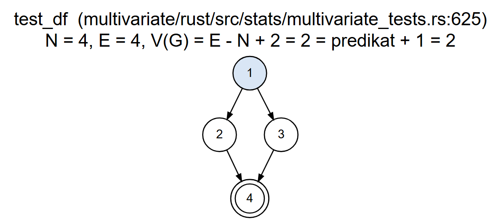
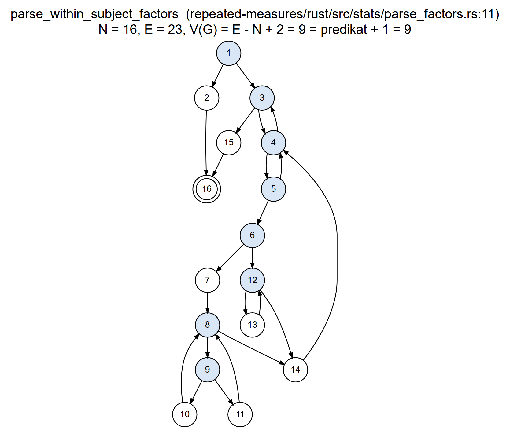
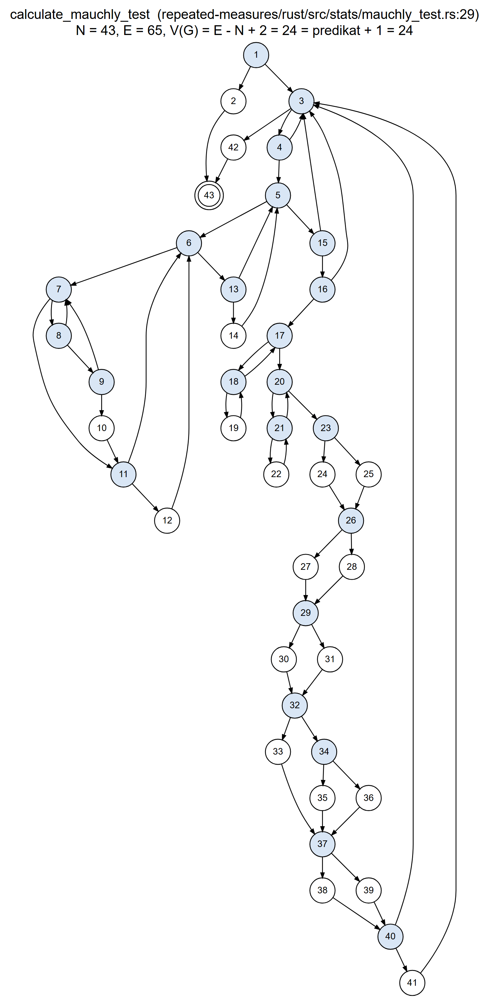
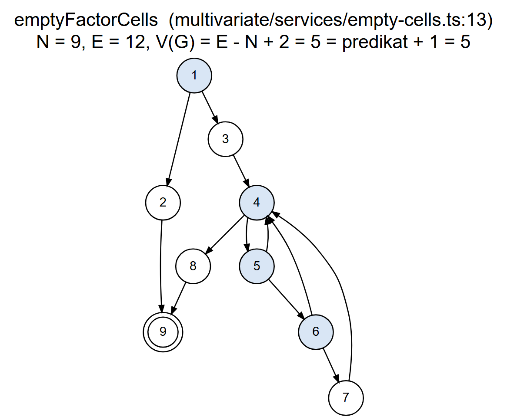
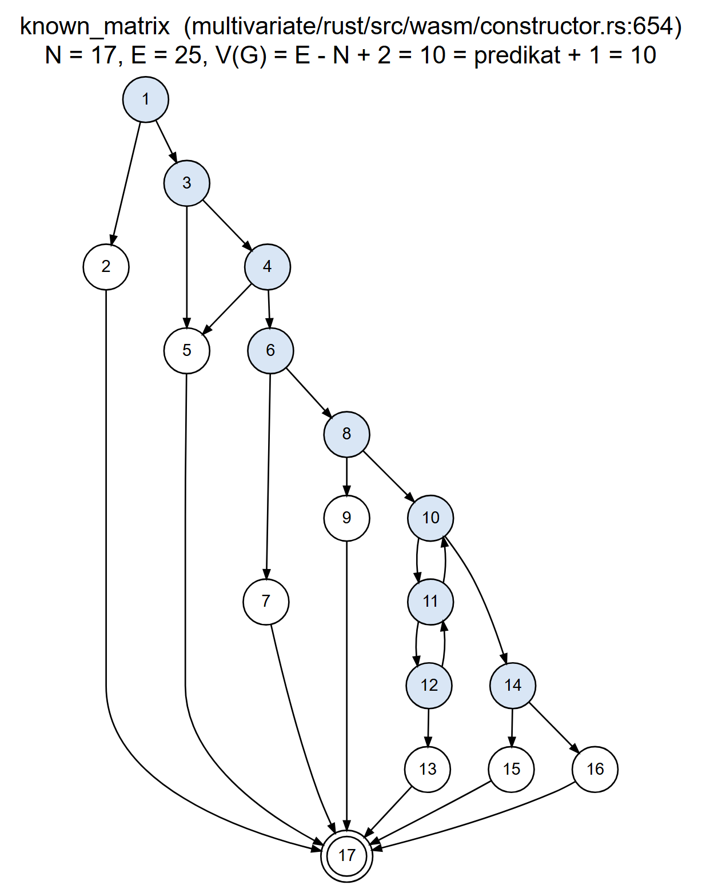

# Ringkasan white-box testing GLM Multivariate dan Repeated Measures

- **Tanggal:** 30 September 2026
- **Branch:** `whitebox-testing`, dibuat dari tag `skripsi-final-v5` (commit `8940ec0f`). Branch ini tidak di-merge ke `main`.
- **Cakupan:** modul GLM Multivariate (MV) dan Repeated Measures (RM), meliputi inti statistik Rust (WASM) dan services TypeScript.
- **Prinsip:**
  - Kode produksi tidak diubah perilakunya.
  - Nilai harapan (oracle) hanya berasal dari keluaran SPSS 27 yang tersimpan, atau dari R 4.3.2 yang prosedurnya lebih dulu dicocokkan dengan SPSS. Nilai harapan tidak pernah diambil dari keluaran Statify.
  - Tidak ada test yang dilewati (tanpa `#[ignore]` dan tanpa `.skip`).

## 1. Alat dan versi

| Alat | Versi | Dipakai untuk |
|---|---|---|
| rustc / cargo | 1.95.0 (59807616e 2026-04-14) / 1.95.0, host `x86_64-pc-windows-gnu` | `cargo test` native (Windows) |
| wasm-pack | 0.14.0 (target `wasm32-unknown-unknown`, `--target web`) | Build ulang WASM untuk verifikasi hash |
| Docker | 29.2.1 (Docker Desktop, engine Linux) | Coverage Rust |
| Image coverage | `statify-whitebox-cov:1.95.0` (`FROM rust:1.95.0-bookworm`, lihat `docker/Dockerfile`) | `cargo llvm-cov` |
| cargo-llvm-cov | 0.9.1 (dengan `llvm-tools-preview` rustc 1.95.0) | Line, region, fungsi coverage (stable) |
| rustc nightly | 1.101.0-nightly (5c543b0b8 2026-09-29) | Branch coverage (`cargo +nightly llvm-cov --branch`) |
| Node.js | v20.19.0 | Jest |
| Jest | 30.0.4 (ts-jest, jsdom) | Test TypeScript dan coverage services |
| R | 4.3.2 (car 3.1.3, jsonlite 2.0.0) | Oracle (`oracle/*.R`) |
| Python | 3.11.0 | Spesifikasi dan verifikasi basis path (`basis-path/basis_paths.py`) |
| Playwright + Viz.js | 1.57.0 + Viz.js 1.8.2 (Graphviz dari paket R DiagrammeR 1.0.11) | Render flow graph ke SVG/PNG (`basis-path/render.cjs`) |

Toolchain Windows (`stable-x86_64-pc-windows-gnu`) tidak menyertakan `profiler_builtins`. Percobaan `rustc -C instrument-coverage` gagal dengan E0463, sehingga coverage Rust diukur di container Linux.

## 2. Bukti kode produksi tidak berubah

Perubahan pada berkas produksi hanya berupa lima baris di **akhir** dua berkas. Isinya deklarasi modul `#[cfg(test)]` yang menunjuk berkas test terpisah, sehingga modul itu tidak ikut dikompilasi ke WASM:

- `multivariate/rust/src/stats/multivariate_tests.rs` → `src/test/wb_multivariate_tests_internal.rs` (untuk fungsi privat `test_df`);
- `multivariate/rust/src/wasm/constructor.rs` → `src/test/wb_constructor_internal.rs` (untuk fungsi privat `known_matrix` dan `calculate_known_covariance_test`).

Berkas lain yang ditambahkan atau diubah semuanya berkas test: `src/test/*.rs`, `test/mod.rs`, `*.test.ts`.

Kedua crate lalu di-build ulang dengan `wasm-pack build --target web` (log di `log/wasm-hash.txt` dan `log/wasm-build-sesudah-*.log`):

| Crate | `wasm_bg.wasm` ter-commit (v5) | Build ulang sumber v5 | Build ulang sesudah test ditambahkan | Hasil |
|---|---|---|---|---|
| MV | md5 `43a77657…c200` | md5 `43a77657…c200` | md5 `43a77657…c200` | **Identik byte per byte** (sha256 `2b789774…e0d1`) |
| RM | md5 `f4c34490…e4f8` | md5 `f4c34490…e4f8` | md5 `f4c34490…e4f8` | **Identik byte per byte** (sha256 `d2d6438b…18a9`) |

`wasm.js` dan `wasm.d.ts` identik setelah akhir baris dinormalisasi. Perbedaannya hanya CRLF (checkout Windows) vs LF (keluaran wasm-pack). Karena biner WASM identik, regresi SPSS (MV 3.425 nilai, RM 1.318 nilai) tidak perlu diulang: yang diuji regresi itu adalah biner yang sama persis.

## 3. Ringkasan hasil test

| Suite | Berkas | Test | Lulus | Gagal |
|---|---|---|---|---|
| Rust MV (`cargo test --lib`) | `test/multivariate_validation.rs` (sudah ada) | 10 | 10 | 0 |
| | `test/wb_multivariate_spss.rs` | 8 | 8 | 0 |
| | `stats/multivariate_tests.rs` → `wb_multivariate_tests_internal.rs` | 2 | 2 | 0 |
| | `wasm/constructor.rs` → `wb_constructor_internal.rs` | 15 | 15 | 0 |
| | **Total crate MV** | **35** | **35** | **0** |
| Rust RM (`cargo test --lib`, sebelumnya 0 test) | `test/wb_rm_spss.rs` | 9 | 8 | 1 |
| | `test/wb_basis_path.rs` | 22 | 15 | 7 |
| | **Total crate RM** | **31** | **23** | **8** |
| Jest MV/RM (13 suite) | `multivariate/__test__/multivariate.test.ts` | 3 | 3 | 0 |
| | `multivariate/test/multivariate.test.ts` | 3 | 3 | 0 |
| | `multivariate/test/empty-cells.basis-path.test.ts` (baru) | 5 | 5 | 0 |
| | `multivariate/__test__/multivariate-reference.test.ts` | 2.339 (+12 todo lama) | 2.339 | 0 |
| | `repeated-measures/__test__/repeated-measures-reference.test.ts` | 1.681 | 1.681 | 0 |
| | 8 berkas lain (performance, contrast, paired, known-sigma, empty-cells, repeated-measures) | 45 | 45 | 0 |
| | **Total Jest MV/RM** | **4.076 (+12 todo)** | **4.076** | **0** |

Catatan:

- Log lengkap ada di `log/cargo-test-mv-windows.log`, `log/cargo-test-rm-windows.log`, `log/jest-mv-rm-coverage.log`, dan log coverage `log/cargo-llvm-cov-*.log`.
- Kedelapan test RM yang gagal **sengaja dibiarkan gagal**. Masing-masing mengungkap defect, yang dijelaskan di §8.
- Ke-12 `todo` pada `multivariate-reference.test.ts` sudah ada sejak sebelum pekerjaan ini. Isinya nilai SPSS tanpa padanan di Statify, bukan test yang dilewati.

## 4. Perbaikan test Jest yang gagal (langkah 1)

Baseline di v5 (`log/jest-baseline-v5-sebelum-perbaikan.log`) menunjukkan 7 test gagal:

- **6 di MV:** tiga test yang sama di dua berkas identik, `multivariate/test/multivariate.test.ts` dan `multivariate/__test__/multivariate.test.ts`.
- **1 di Univariate:** `univariate/__test__/univariate.test.ts`, T01, dengan `RuntimeError: unreachable`, yaitu panic di WASM Univariate. Modul ini di luar cakupan MV/RM, sehingga **tidak diperbaiki** dan tetap gagal.

Nilai harapan lama di tiga test MV berasal dari commit awal `5773f1df` dan tidak punya sumber. Dataset A, B, dan C adalah data sintetis tanpa keluaran SPSS (`fixtures/spss/dataset-*/README.md`: *"waiting for official SPSS export"*). Karena itu nilai baru dihitung dengan R (`oracle/oracle-jest-mv.R`). Prosedur R itu lebih dulu dicocokkan dengan **240 nilai SPSS 27** (mv2, mv4, mv5, mv6: Multivariate Tests, Box's M, dan Tests of Between-Subjects Effects). Hasilnya 240 lulus dengan selisih maksimum 4,4·10⁻⁴ (`oracle/oracle-jest-mv.txt`).

| Test | Asersi | Nilai lama | Nilai baru | Sumber dan alasan |
|---|---|---|---|---|
| Dataset A | Pillai's Trace efek Group | 0 | 0,999902085763296 (F 13,497356574438, df 4 dan 54) | R `stats:::Pillai` pada H dan E Type III dari `car::Anova`. Nilai lama 0 mustahil untuk tiga grup yang terpisah jelas. |
| Dataset B | Pillai F efek Group | 0 | Diganti dengan uji univariat Y3 × Group Type III: SS 92,0562576578351, F 68107,6119473594 (toleransi relatif 10⁻⁶) | SSCP galat E dataset B **singular** (rank 2 dari 3), karena Y1 − 2·Y3 = −1,0·g + 3,9·t − 1,1·Cov1 persis. Uji multivariat tidak terdefinisi dan `car::Anova` menolaknya, sehingga tidak ada oracle untuk Pillai F. Lihat temuan T6. |
| Dataset C | Box's M F | 1,5497442954550478 | 1,54849939811271 | R, rumus aproksimasi F Box (lihat catatan di bawah tabel). Box's M lama 10,393282721313454 terkonfirmasi (R 10,3932827213135). |
| Dataset C | Box's M Sig. | 0,1975627435596765 | 0,158014391042943 | R, df 6 dan 8.348,706651. |

Catatan rumus Box's M:

- Cabang kedua rumus Box versi buku teks (c₂ < c₁²) memberi F = 0,46753 pada mv4, sedangkan SPSS 0,46554.
- Keluaran SPSS cocok dengan satu rumus untuk kedua kasus: F = M(1 − c₁ − df₁/df₂)/df₁ dengan df₂ = (df₁ + 2)/|c₂ − c₁²|. Rumus inilah yang dipakai di R.
- Dataset C berada di cabang c₂ > c₁², tempat kedua rumus identik.

Sesudah perbaikan, keenam test MV lulus di kedua berkas.

## 5. Basis path testing (langkah 2)

Spesifikasi flow graph ada di `basis-path/basis_paths.py`. Skrip itu memeriksa secara otomatis bahwa:

1. V(G) = E − N + 2 sama dengan jumlah predikat + 1;
2. setiap jalur adalah walk sah dari node masuk ke node keluar;
3. vektor sisi seluruh jalur bebas linear (rank = V(G)), sehingga himpunan jalurnya benar-benar basis;
4. setiap sisi dilalui minimal satu jalur.

Konvensi predikat: `if`, `if let`, `match` dua lengan, operator `?`, setiap operand `||`, dan header `for`. Pemanggilan pustaka (`min`, `max`, `unwrap_or_else`, `any` di dalam iterator) tidak dihitung. Jalur ber-loop ditulis dengan iterasi minimal; data uji boleh mengulang badan loop lebih banyak. Jalur **tak layak** (infeasible) tetap anggota basis, dan alasannya dicatat.

Fungsi kelima, "validasi matriks kovarians diketahui", adalah `known_matrix` (Rust), fungsi yang benar-benar memeriksa ukuran, nilai berhingga, diagonal > 0, simetri, dan definit positif (Cholesky). Padanannya di dialog, `parseKnownSigma` (TS), tidak memeriksa simetri karena matriks dibuat simetris dari segitiga atas.

Gambar flow graph tersedia dalam format PNG, SVG, dan Mermaid di `basis-path/`. Pada gambar, node predikat diarsir dan node keluar berlingkaran ganda.

<!-- BASIS-PATH:mulai -->
| Fungsi | Bahasa | N | E | V(G) = E − N + 2 | Predikat + 1 | Rank jalur | Jalur layak | Tak layak | Uji lulus | Uji gagal |
|---|---|---|---|---|---|---|---|---|---|---|
| `test_df` | Rust | 4 | 4 | 2 | 1 + 1 = 2 | 2 | 2 | 0 | 2 | 0 |
| `parse_within_subject_factors` | Rust | 16 | 23 | 9 | 8 + 1 = 9 | 9 | 6 | 3 | 6 | 0 |
| `calculate_mauchly_test` | Rust | 43 | 65 | 24 | 23 + 1 = 24 | 24 | 13 | 11 | 9 | 5 |
| `emptyFactorCells` | TypeScript | 9 | 12 | 5 | 4 + 1 = 5 | 5 | 5 | 0 | 5 | 0 |
| `known_matrix` | Rust | 17 | 25 | 10 | 9 + 1 = 10 | 10 | 10 | 0 | 10 | 0 |

### `test_df` (multivariate/rust/src/stats/multivariate_tests.rs:625)



- V(G) = E − N + 2 = 4 − 4 + 2 = **2**; V(G) = jumlah predikat + 1 = 1 + 1 = **2** (node predikat: 1).
- Rank vektor sisi 2 jalur = 2 (bebas linear); semua 4 sisi tercakup.

<details><summary>Keterangan node</summary>

| Node | Kode |
|---|---|
| 1 | `r = df.round(); if \|df - r\| < 1e-9 (P1)` |
| 2 | `r.max(1.0)` |
| 3 | `df` |
| 4 | `keluar` |

</details>

| Jalur | Urutan node | Skenario (input) | Output harapan | Oracle | Test | Status |
|---|---|---|---|---|---|---|
| TDF-J1 | 1-2-4 | df = 4.0 (bulat); juga batas df = 0 -> 1 | 4.0; 1.0 | SPSS mv4 treatment Pillai Hypothesis df = 4; spesifikasi (komentar v5: minimal 1) | `tdf_j1_df_bulat` | **LULUS** |
| TDF-J2 | 1-3-4 | df = 48.82535052622494 (pecahan) | 48.82535052622494 (tidak dibulatkan) | SPSS mv9 kelompok Wilks' Lambda Error df = 48.82535052622494 | `tdf_j2_df_pecahan` | **LULUS** |

### `parse_within_subject_factors` (repeated-measures/rust/src/stats/parse_factors.rs:11)



- V(G) = E − N + 2 = 23 − 16 + 2 = **9**; V(G) = jumlah predikat + 1 = 8 + 1 = **9** (node predikat: 1, 3, 4, 5, 6, 8, 9, 12).
- Rank vektor sisi 9 jalur = 9 (bebas linear); semua 23 sisi tercakup.

<details><summary>Keterangan node</summary>

| Node | Kode |
|---|---|
| 1 | `measures = {}; Regex::new(..)? (P1)` |
| 2 | `return Err(regex)` |
| 3 | `for var_defs in subject_data_defs (P2)` |
| 4 | `for var_def in var_defs (P3)` |
| 5 | `if let Some(captures) (P4)` |
| 6 | `ambil faktor, level, measure; if let Some(def_factors) (P5)` |
| 7 | `factor_names = split(';')` |
| 8 | `for (i, level) in levels (P6)` |
| 9 | `if i < factor_names.len() (P7)` |
| 10 | `insert(factor_names[i])` |
| 11 | `insert(Factor{i+1})` |
| 12 | `for (i, level) in levels (P8)` |
| 13 | `insert(Level{i+1})` |
| 14 | `measures[measure].push(factor)` |
| 15 | `return Ok(measures)` |
| 16 | `keluar` |

</details>

| Jalur | Urutan node | Skenario (input) | Output harapan | Oracle | Test | Status |
|---|---|---|---|---|---|---|
| PWF-J1 | 1-2-16 | Regex::new gagal | – | – | – | TAK LAYAK: Pola regex adalah literal konstan yang valid; Regex::new tidak pernah gagal. |
| PWF-J2 | 1-3-15-16 | subject_data_defs = [] | Ok, measures kosong | spesifikasi | `pwf_j2_tanpa_definisi` | **LULUS** |
| PWF-J3 | 1-3-4-3-15-16 | subject_data_defs = [[]] | Ok, measures kosong | spesifikasi | `pwf_j3_grup_kosong` | **LULUS** |
| PWF-J4 | 1-3-4-5-4-3-15-16 | nama 'skor' (tidak berformat var_(level,measure)) | Ok, measures kosong | spesifikasi (format nama) | `pwf_j4_nama_tidak_cocok` | **LULUS** |
| PWF-J5 | 1-3-4-5-6-7-8-14-4-3-15-16 | nama cocok dengan nol level | – | – | – | TAK LAYAK: Regex mensyaratkan minimal satu level (\d+), sehingga loop level selalu berjalan >= 1 kali. |
| PWF-J6 | 1-3-4-5-6-7-8-9-10-8-14-4-3-15-16 | 'w1_(1,skor)', DefFactors 'waktu' | skor: [{waktu: 1}] | spesifikasi (DefFactors menamai level) | `pwf_j6_satu_level_bernama` | **LULUS** |
| PWF-J7 | 1-3-4-5-6-7-8-9-10-8-9-11-8-14-4-3-15-16 | 'w1_(1,2,skor)', DefFactors 'waktu' | skor: [{waktu: 1, Factor2: 2}] | spesifikasi (nama cadangan FactorN) | `pwf_j7_level_tanpa_nama` | **LULUS** |
| PWF-J8 | 1-3-4-5-6-12-14-4-3-15-16 | DefFactors kosong dan nol level | – | – | – | TAK LAYAK: Sama dengan PWF-J5: minimal satu level. |
| PWF-J9 | 1-3-4-5-6-12-13-12-14-4-3-15-16 | 'w1_(1,skor)', DefFactors = null | skor: [{Level1: 1}] | spesifikasi (nama bawaan LevelN) | `pwf_j9_tanpa_def_factors` | **LULUS** |

### `calculate_mauchly_test` (repeated-measures/rust/src/stats/mauchly_test.rs:29)



- V(G) = E − N + 2 = 65 − 43 + 2 = **24**; V(G) = jumlah predikat + 1 = 23 + 1 = **24** (node predikat: 1, 3, 4, 5, 6, 7, 8, 9, 11, 13, 15, 16, 17, 18, 20, 21, 23, 26, 29, 32, 34, 37, 40).
- Rank vektor sisi 24 jalur = 24 (bebas linear); semua 65 sisi tercakup.

<details><summary>Keterangan node</summary>

| Node | Kode |
|---|---|
| 1 | `parse_within_subject_factors(..)? (P1)` |
| 2 | `return Err` |
| 3 | `for (measure, factors) (P2)` |
| 4 | `if factors.len() < 2 (P3)` |
| 5 | `for record_group in subject_data (P4)` |
| 6 | `for var_name in var_names (P5)` |
| 7 | `for record in record_group (P6)` |
| 8 | `if let Some(v) = record.get(var) (P7)` |
| 9 | `match v: Number (P8)` |
| 10 | `push(v); found = true; break` |
| 11 | `if !found (P9)` |
| 12 | `push(0.0)` |
| 13 | `if len == n_vars (P10)` |
| 14 | `data_matrix.push(row)` |
| 15 | `if n_subjects < 2 (P11)` |
| 16 | `\|\| n_vars < 2 (P12)` |
| 17 | `for (i, row) (P13)` |
| 18 | `for (j, val) in row (P14)` |
| 19 | `matrix[i,j] = val` |
| 20 | `for i in 0..n (P15)` |
| 21 | `for j in 0..k (P16)` |
| 22 | `centered[i,j] -= mean[j]` |
| 23 | `cov, S_t, det, trace; if mean_eig < 1e-12 (P17)` |
| 24 | `W = 0` |
| 25 | `W = det / mean_eig^p` |
| 26 | `if W > 0 (P18)` |
| 27 | `chi = -(n-1-c) ln W` |
| 28 | `chi = INF` |
| 29 | `df, Sig.; if sum_sq_eig < 1e-12 (P19)` |
| 30 | `GG = 1` |
| 31 | `GG = (sum l)^2/(p sum l^2)` |
| 32 | `if n <= k (P20)` |
| 33 | `HF = min(GG, 1)` |
| 34 | `num, den; if \|den\| < 1e-12 (P21)` |
| 35 | `HF = min(GG, 1)` |
| 36 | `HF = rumus, [GG, 1]` |
| 37 | `LB; if chi finite (P22)` |
| 38 | `chi_square = chi` |
| 39 | `chi_square = 0` |
| 40 | `tests.insert; if design.is_none() (P23)` |
| 41 | `design = Some(..)` |
| 42 | `return Ok(MauchlyTest)` |
| 43 | `keluar` |

</details>

| Jalur | Urutan node | Skenario (input) | Output harapan | Oracle | Test | Status |
|---|---|---|---|---|---|---|
| MAU-J01 | 1-3-4-5-6-7-8-9-10-11-6-7-8-9-10-11-6-13-14-5-6-7-8-9-10-11-6-7-8-9-10-11-6-13-14-5-15-16-17-18-19-18-17-20-21-22-21-20-23-25-26-27-29-31-32-34-36-37-38-40-41-3-42-43 | gambar51 (15 subjek, 4 level, 1 measure) | W .6189, chi 6.1035, df 5, Sig .2975, GG .7467, HF .8957, LB .3333 | SPSS 27 (rm_gambar51.xlsx) | `mau_j01_dasar_gambar51` | **LULUS** |
| MAU-J02 | 1-2-43 | parse_within_subject_factors gagal | – | – | – | TAK LAYAK: parse_within_subject_factors hanya gagal bila Regex::new gagal (PWF-J1, tak layak). |
| MAU-J03 | 1-3-42-43 | nama variabel tanpa format measure | Ok, tests kosong | spesifikasi | `mau_j03_tanpa_measure` | **LULUS** |
| MAU-J04 | 1-3-4-3-42-43 | measure dengan 1 level | Ok, tests kosong (butuh >= 2 level) | spesifikasi (komentar: need at least 2 levels) | `mau_j04_satu_level` | **LULUS** |
| MAU-J05 | 1-3-4-5-15-3-42-43 | tanpa subjek (subject_data = []) | Ok, tests kosong | spesifikasi (Not enough data) | `mau_j05_tanpa_subjek` | **LULUS** |
| MAU-J06 | 1-3-4-5-6-13-14-5-15-3-42-43 | measure tanpa variabel | – | – | – | TAK LAYAK: factors.len() >= 2 sudah dijamin P3, sehingga loop var_names tidak pernah kosong. |
| MAU-J07 | 1-3-4-5-6-7-8-9-10-11-6-7-8-9-10-11-6-13-14-5-6-7-11-12-6-7-11-12-6-13-14-5-15-16-17-18-19-18-17-20-21-22-21-20-23-25-26-27-29-31-32-34-36-37-38-40-41-3-42-43 | gambar51, record subjek 15 kosong | W .6102, GG .7430, HF .9039 (subjek 15 dikeluarkan, listwise) | R listwise_tanpa_subjek15 (testing/whitebox/oracle/oracle-rm-mauchly.json) | `mau_j07_record_kosong` | **GAGAL** |
| MAU-J08 | 1-3-4-5-6-7-8-7-8-9-10-11-6-7-8-7-8-9-10-11-6-13-14-5-6-7-8-9-10-11-6-7-8-9-10-11-6-13-14-5-15-16-17-18-19-18-17-20-21-22-21-20-23-25-26-27-29-31-32-34-36-37-38-40-41-3-42-43 | gambar51, tiap subjek dipecah ke dua record | sama dengan J01 | SPSS 27 (rm_gambar51.xlsx) | `mau_j08_record_terpecah` | **LULUS** |
| MAU-J09 | 1-3-4-5-6-7-8-9-10-11-6-7-8-9-7-11-12-6-13-14-5-6-7-8-9-10-11-6-7-8-9-10-11-6-13-14-5-15-16-17-18-19-18-17-20-21-22-21-20-23-25-26-27-29-31-32-34-36-37-38-40-41-3-42-43 | gambar51, perlakuan2 subjek 1 = null | W .5056, GG .6866, HF .8176 (subjek 1 dikeluarkan, listwise) | R listwise_tanpa_subjek1 (testing/whitebox/oracle/oracle-rm-mauchly.json) | `mau_j09_nilai_null` | **GAGAL** |
| MAU-J10 | 1-3-4-5-6-7-8-9-10-11-6-7-8-9-10-11-6-13-14-5-6-7-8-9-10-11-6-7-11-6-13-14-5-15-16-17-18-19-18-17-20-21-22-21-20-23-25-26-27-29-31-32-34-36-37-38-40-41-3-42-43 | loop record habis tanpa break, found = true | – | – | – | TAK LAYAK: found hanya bernilai true lewat break (node 10); bila loop record habis (7 -> 11), found selalu false, sehingga 7 -> 11 selalu diikuti 11 -> 12. |
| MAU-J11 | 1-3-4-5-6-7-8-9-10-11-6-7-8-9-10-11-6-13-5-15-3-42-43 | panjang baris != n_vars | – | – | – | TAK LAYAK: Setiap variabel menambah tepat satu nilai (angka atau 0.0), sehingga panjang baris selalu n_vars. |
| MAU-J12 | 1-3-4-5-6-7-8-9-10-11-6-7-8-9-10-11-6-13-14-5-15-3-42-43 | satu subjek | Ok, tests kosong | spesifikasi (Not enough data) | `mau_j12_satu_subjek` | **LULUS** |
| MAU-J13 | 1-3-4-5-6-7-8-9-10-11-6-7-8-9-10-11-6-13-14-5-6-7-8-9-10-11-6-7-8-9-10-11-6-13-14-5-15-16-3-42-43 | n_vars < 2 | – | – | – | TAK LAYAK: n_vars = factors.len() >= 2 (P3). |
| MAU-J14 | 1-3-4-5-6-7-8-9-10-11-6-7-8-9-10-11-6-13-14-5-6-7-8-9-10-11-6-7-8-9-10-11-6-13-14-5-15-16-17-20-21-22-21-20-23-25-26-27-29-31-32-34-36-37-38-40-41-3-42-43 | loop baris matriks nol kali | – | – | – | TAK LAYAK: n_subjects >= 2 (P11). |
| MAU-J15 | 1-3-4-5-6-7-8-9-10-11-6-7-8-9-10-11-6-13-14-5-6-7-8-9-10-11-6-7-8-9-10-11-6-13-14-5-15-16-17-18-17-20-21-22-21-20-23-25-26-27-29-31-32-34-36-37-38-40-41-3-42-43 | baris data kosong | – | – | – | TAK LAYAK: Setiap baris berisi n_vars >= 2 nilai. |
| MAU-J16 | 1-3-4-5-6-7-8-9-10-11-6-7-8-9-10-11-6-13-14-5-6-7-8-9-10-11-6-7-8-9-10-11-6-13-14-5-15-16-17-18-19-18-17-20-23-25-26-27-29-31-32-34-36-37-38-40-41-3-42-43 | loop centering nol kali | – | – | – | TAK LAYAK: n_subjects >= 2 (P11). |
| MAU-J17 | 1-3-4-5-6-7-8-9-10-11-6-7-8-9-10-11-6-13-14-5-6-7-8-9-10-11-6-7-8-9-10-11-6-13-14-5-15-16-17-18-19-18-17-20-21-20-23-25-26-27-29-31-32-34-36-37-38-40-41-3-42-43 | loop kolom centering nol kali | – | – | – | TAK LAYAK: n_vars >= 2 (P12). |
| MAU-J18 | 1-3-4-5-6-7-8-9-10-11-6-7-8-9-10-11-6-13-14-5-6-7-8-9-10-11-6-7-8-9-10-11-6-13-14-5-15-16-17-18-19-18-17-20-21-22-21-20-23-24-26-28-29-30-32-34-36-37-39-40-41-3-42-43 | y_ij = a_i + b_j (S_t = 0), n = 5, k = 4 | W = 0; LB = 1/3 | spesifikasi (konvensi W = 0 untuk matriks singular, rm_model.rs) | `mau_j18_st_nol` | **LULUS** |
| MAU-J19 | 1-3-4-5-6-7-8-9-10-11-6-7-8-9-10-11-6-13-14-5-6-7-8-9-10-11-6-7-8-9-10-11-6-13-14-5-15-16-17-18-19-18-17-20-21-22-21-20-23-25-26-28-29-31-32-34-36-37-39-40-41-3-42-43 | y2 = y1 + 5 (kontras singular), n = 4, k = 3 | W = 0; GG .5; HF .5; LB .5 | R kontras_singular (testing/whitebox/oracle/oracle-rm-mauchly.json) | `mau_j19_kontras_singular` | **LULUS** |
| MAU-J20 | 1-3-4-5-6-7-8-9-10-11-6-7-8-9-10-11-6-13-14-5-6-7-8-9-10-11-6-7-8-9-10-11-6-13-14-5-15-16-17-18-19-18-17-20-21-22-21-20-23-25-26-27-29-30-32-34-36-37-38-40-41-3-42-43 | gambar51 x 1e-5 | W .6189, GG .7467, HF .8957 (invarian skala) | SPSS 27 gambar51 + R skala_1e_5 (testing/whitebox/oracle/oracle-rm-mauchly.json) | `mau_j20_skala_kecil` | **GAGAL** |
| MAU-J21 | 1-3-4-5-6-7-8-9-10-11-6-7-8-9-10-11-6-13-14-5-6-7-8-9-10-11-6-7-8-9-10-11-6-13-14-5-15-16-17-18-19-18-17-20-21-22-21-20-23-25-26-27-29-31-32-33-37-38-40-41-3-42-43 | n = k = 4 | GG .6520, HF 1 (rumus HF, dibatasi 1) | R n_sama_k (testing/whitebox/oracle/oracle-rm-mauchly.json) | `mau_j21_n_sama_k` | **GAGAL** |
| MAU-J22 | 1-3-4-5-6-7-8-9-10-11-6-7-8-9-10-11-6-13-14-5-6-7-8-9-10-11-6-7-8-9-10-11-6-13-14-5-15-16-17-18-19-18-17-20-21-22-21-20-23-25-26-27-29-31-32-34-35-37-38-40-41-3-42-43 | \|den\| < 1e-12 dengan n > k | – | – | – | TAK LAYAK: Untuk n > k dan GG <= 1: den = p(n - 1 - p GG) >= p(n - k) > 0. |
| MAU-J23 | 1-3-4-5-6-7-8-9-10-11-6-7-8-9-10-11-6-13-14-5-6-7-8-9-10-11-6-7-8-9-10-11-6-13-14-5-15-16-17-18-19-18-17-20-21-22-21-20-23-25-26-27-29-31-32-34-36-37-39-40-41-3-42-43 | chi tak hingga dengan W > 0 | – | – | – | TAK LAYAK: W > 0 berhingga memberi -(n-1-c) ln W berhingga; chi tak hingga hanya lewat W <= 0 (J18, J19). |
| MAU-J24 | 1-3-4-5-6-7-8-9-10-11-6-7-8-9-10-11-6-13-14-5-6-7-8-9-10-11-6-7-8-9-10-11-6-13-14-5-15-16-17-18-19-18-17-20-21-22-21-20-23-25-26-27-29-31-32-34-36-37-38-40-41-3-4-5-6-7-8-9-10-11-6-7-8-9-10-11-6-13-14-5-6-7-8-9-10-11-6-7-8-9-10-11-6-13-14-5-15-16-17-18-19-18-17-20-21-22-21-20-23-25-26-27-29-31-32-34-36-37-38-40-3-42-43 | dataset a (2 measure, waktu 3 level) | cemas W .8590 ... stres W .9975 (14 nilai) | SPSS 27 (rm_a.xlsx) | `mau_j24_dua_measure` | **LULUS** |
| MAU-T1 (tambahan) | J01 dengan segmen variabel 7-8-7-11-12 (kombinasi linear J07 dan J08) | gambar51, kunci perlakuan4 subjek 15 tidak ada di record | W .6102, GG .7430, HF .9039 (subjek 15 dikeluarkan, listwise) | R listwise_tanpa_subjek15 (testing/whitebox/oracle/oracle-rm-mauchly.json) | `mau_t1_kunci_tidak_ada` | **GAGAL** |

### `emptyFactorCells` (multivariate/services/empty-cells.ts:13)



- V(G) = E − N + 2 = 12 − 9 + 2 = **5**; V(G) = jumlah predikat + 1 = 4 + 1 = **5** (node predikat: 1, 4, 5, 6).
- Rank vektor sisi 5 jalur = 5 (bebas linear); semua 12 sisi tercakup.

<details><summary>Keterangan node</summary>

| Node | Kode |
|---|---|
| 1 | `if factors.length < 2 (P1)` |
| 2 | `return null` |
| 3 | `n, cells, levels` |
| 4 | `for i < n (P2)` |
| 5 | `values; if values.some(missing) (P3)` |
| 6 | `if otherSlices.some(missing) (P4)` |
| 7 | `levels.add, cells.add` |
| 8 | `total; return {empty, total}` |
| 9 | `keluar` |

</details>

| Jalur | Urutan node | Skenario (input) | Output harapan | Oracle | Test | Status |
|---|---|---|---|---|---|---|
| EFC-J1 | 1-2-9 | 1 faktor | null | spesifikasi (JSDoc: < 2 faktor -> null) | `EFC-J1` | **LULUS** |
| EFC-J2 | 1-3-4-8-9 | 2 faktor, 0 baris | {empty: 0, total: 0} | spesifikasi (hitung tangan) | `EFC-J2` | **LULUS** |
| EFC-J3 | 1-3-4-5-4-8-9 | 2 faktor, faktor hilang | {empty: 0, total: 0} | spesifikasi (listwise) | `EFC-J3` | **LULUS** |
| EFC-J4 | 1-3-4-5-6-4-8-9 | 2 faktor, DV hilang | {empty: 0, total: 0} | spesifikasi (listwise) | `EFC-J4` | **LULUS** |
| EFC-J5 | 1-3-4-5-6-7-4-8-9 | 2x2, 3 sel terisi | {empty: 1, total: 4} | spesifikasi (hitung tangan) | `EFC-J5` | **LULUS** |

### `known_matrix` (multivariate/rust/src/wasm/constructor.rs:654)



- V(G) = E − N + 2 = 25 − 17 + 2 = **10**; V(G) = jumlah predikat + 1 = 9 + 1 = **10** (node predikat: 1, 3, 4, 6, 8, 10, 11, 12, 14).
- Rank vektor sisi 10 jalur = 10 (bebas linear); semua 25 sisi tercakup.

<details><summary>Keterangan node</summary>

| Node | Kode |
|---|---|
| 1 | `rows.ok_or_else(..)? (P1)` |
| 2 | `return Err(missing)` |
| 3 | `if rows.len() != p (P2)` |
| 4 | `\|\| any row.len() != p (P3)` |
| 5 | `return Err(ukuran)` |
| 6 | `m; if any !finite (P4)` |
| 7 | `return Err(angka)` |
| 8 | `if any m_ii <= 0 (P5)` |
| 9 | `return Err(diagonal)` |
| 10 | `scale; for i in 0..p (P6)` |
| 11 | `for j in i+1..p (P7)` |
| 12 | `if \|m_ij - m_ji\| > 1e-12 scale (P8)` |
| 13 | `return Err(simetris)` |
| 14 | `if cholesky().is_none() (P9)` |
| 15 | `return Err(definit positif)` |
| 16 | `return Ok(m)` |
| 17 | `keluar` |

</details>

| Jalur | Urutan node | Skenario (input) | Output harapan | Oracle | Test | Status |
|---|---|---|---|---|---|---|
| KM-J01 | 1-2-17 | rows = None | Err 'is missing' | spesifikasi (pesan galat) | `km_j01_tidak_ada` | **LULUS** |
| KM-J02 | 1-3-5-17 | p = 2, 3 baris | Err 'must be 2 x 2' | spesifikasi | `km_j02_jumlah_baris` | **LULUS** |
| KM-J03 | 1-3-4-5-17 | p = 2, baris kedua 1 kolom | Err 'must be 2 x 2' | spesifikasi | `km_j03_panjang_baris` | **LULUS** |
| KM-J04 | 1-3-4-6-7-17 | berisi NaN | Err 'every entry must be a number' | spesifikasi | `km_j04_nan` | **LULUS** |
| KM-J05 | 1-3-4-6-8-9-17 | diagonal 0 | Err 'diagonal entries ... greater than 0' | spesifikasi | `km_j05_diagonal` | **LULUS** |
| KM-J06 | 1-3-4-6-8-10-14-16-17 | p = 0 (matriks 0 x 0) | Ok (0 x 0) | spesifikasi (tak ada syarat dilanggar) | `km_j06_p_nol` | **LULUS** |
| KM-J07 | 1-3-4-6-8-10-11-10-14-16-17 | [[4]] | Ok([[4]]) | matematis (4 > 0) | `km_j07_p_satu` | **LULUS** |
| KM-J08 | 1-3-4-6-8-10-11-12-13-17 | [[2, 1], [0.5, 2]] | Err 'must be symmetric' | matematis (m12 != m21) | `km_j08_tidak_simetris` | **LULUS** |
| KM-J09 | 1-3-4-6-8-10-11-12-11-10-11-10-14-15-17 | [[1, 2], [2, 1]] | Err 'not positive definite' | R: eigen = 3, -1 | `km_j09_tidak_definit_positif` | **LULUS** |
| KM-J10 | 1-3-4-6-8-10-11-12-11-10-11-10-14-16-17 | Sigma_A (K1, 4 x 4) | Ok(Sigma_A) | R: eigen Sigma_A > 0 (known-sigma.R, K1) | `km_j10_sigma_a` | **LULUS** |
<!-- BASIS-PATH:selesai -->

## 6. Unit test fungsi inti (langkah 3)

Semua perbandingan dengan SPSS memakai kriteria validasi skripsi, |Statify − SPSS| ≤ 0,001. Perbandingan dengan R memakai kriteria proyek, selisih mutlak < 10⁻⁸, kecuali bila disebutkan lain.

### MV: `calculate_multivariate_tests` (`test/wb_multivariate_spss.rs`)

| Test | Data | Yang diuji | Nilai acuan | Lulus |
|---|---|---|---|---|
| `mv1_satu_populasi_test_values_sesuai_spss` | mtcars, μ₀ = (20, 200, 150, 3) | Pillai, Wilks, Hotelling, Roy, Intercept dengan Test Values | 32 SPSS | 32 |
| `mv2_dua_populasi_sesuai_spss` | dua populasi (n = 64) | 4 statistik × 2 efek | 64 SPSS | 64 |
| `mv4_one_way_empat_statistik_sesuai_spss` | One-Way MANOVA (n = 8) | 4 statistik, F tepat dan aproksimasi | 64 SPSS | 64 |
| `mv5_two_way_faktorial_penuh_sesuai_spss` | Two-Way 2 × 4 | termasuk interaksi | 128 SPSS | 128 |
| `mv6_two_way_tak_seimbang_sesuai_spss` | Two-Way tak seimbang (n = 26) | Type III tak seimbang | 128 SPSS | 128 |
| `mv9_tiga_dv_empat_level_sesuai_spss` | 3 DV, 4 level | Wilks Rao F dengan df pecahan | 64 SPSS | 64 |
| `mv9_wilks_df_pecahan_sesuai_r` | idem | **df₂ pecahan 48,825…**; Sig. dengan df pecahan (relatif < 10⁻⁴; Sig. dengan df dibulatkan berbeda 1,8%) | 6 R (`fitur-v5/results/b1-mv9-vs-r.txt`) | 6 |
| `welch_t2_dua_populasi_sesuai_r` | dua populasi, Welch | **Welch T²** Krishnamoorthy–Yu: T², F, df₁, df₂ = ν − p + 1, Sig.; mode Welch hanya menghasilkan Hotelling | 6 R (`fitur-v4/r/welch_sig_r.csv`) | 6 |

### MV: uji khi-kuadrat Σ diketahui (`calculate_known_covariance_test`, `wb_constructor_internal.rs`)

| Kasus | Desain | Nilai R (χ², Sig., √χ²(p; α), z(α/2p), estimasi, SE, batas χ² dan Bonferroni) | Lulus |
|---|---|---|---|
| K1 | satu populasi, Σ_A, α = 0,05 | 28 | 28 |
| K1-a10 | satu populasi, α = 0,10 | 28 | 28 |
| K2 | dua populasi, Σ₁ = Σ₂ = Σ_B | 28 | 28 |
| K3 | dua populasi, Σ₁ dan Σ₂ | 28 | 28 |
| K4-0 | berpasangan (d = v₁ − v₂), Σd | 16 | 16 |

Oracle: `testing/final/bagian1/known-sigma-r.csv` (kolom `r`). Masukan kasus (Σ, μ₀, α) diambil dari `known-sigma-statify.json`; keluaran Statify di berkas itu tidak dipakai.

### RM: `RmModel` (jalur produksi), `mauchly_test.rs`, `within_subjects_effects.rs` (`test/wb_rm_spss.rs`)

| Test | Data | Tabel | Nilai SPSS | Lulus |
|---|---|---|---|---|
| `rm_model_gambar51_sesuai_spss` | Gambar 51 (within-only, 4 level) | Mauchly, within-effects (SA/GG/HF/LB, semua kolom), multivariat, between | 67 | 67 |
| `rm_model_dataset_a_dua_measure_sesuai_spss` | (a) 2 measure × 3 level | idem, multivariat ganda | 188 | 188 |
| `rm_model_dataset_b_campuran_sesuai_spss` | (b) waktu 4 × kelompok 3 | idem, termasuk interaksi | 166 | 166 |
| `rm_model_epsilon_gg_hf_lb_dataset_b` | (b) | **ε GG .8947, HF dibatasi 1, LB 1/3**, df dan MS terkoreksi, Sig. | 35 | 35 |
| `legacy_mauchly_gambar51_sesuai_spss` | Gambar 51 | `calculate_mauchly_test`: W, χ², df, Sig., GG, HF, LB | 7 | 7 |
| `legacy_mauchly_dataset_a_sesuai_spss` | (a) | idem, dua measure | 14 | 14 |
| `legacy_within_effects_gambar51_koreksi_epsilon_sesuai_spss` | Gambar 51 | `calculate_tests_within_subjects_effects`: SS, df, MS, F, Sig., η² (SA/GG/HF/LB + Error) | 32 | 32 |
| `legacy_within_effects_dataset_a_koreksi_epsilon_sesuai_spss` | (a) | idem | 72 | 72 |
| `legacy_within_effects_observed_power_sesuai_spss` | (a) | Noncent. Parameter dan Observed Power | 16 | **3 (13 gagal, temuan T4)** |

`calculate_mauchly_test` dan `calculate_tests_within_subjects_effects` adalah modul lama. Produksi tidak pernah memanggilnya (temuan T5). Keduanya diuji langsung pada desain within-only, yaitu desain yang ditanganinya (df galat n − 1).

## 7. Coverage (langkah 4)

### Rust (`cargo llvm-cov`, Docker Linux)

<!-- COVERAGE-RUST:mulai -->

#### Crate multivariate (`multivariate/rust/src`)

| Berkas | Line | Region | Fungsi | Branch (nightly) |
|---|---|---|---|---|
| `stats/bartlett_test.rs` | 0.00% (0/150) | 0.00% (0/235) | 0.00% (0/4) | – |
| `stats/between_subjects_effects.rs` | 77.96% (389/499) | 76.81% (626/815) | 65.62% (21/32) | 51.28% (40/78) |
| `stats/between_subjects_sscp.rs` | 0.00% (0/326) | 0.00% (0/674) | 0.00% (0/4) | – |
| `stats/bootstrap.rs` | 0.00% (0/243) | 0.00% (0/446) | 0.00% (0/31) | – |
| `stats/box_m_test.rs` | 89.90% (89/99) | 92.95% (145/156) | 100.00% (4/4) | 50.00% (10/20) |
| `stats/common.rs` | 55.06% (457/830) | 60.98% (858/1407) | 60.00% (39/65) | 58.89% (106/180) |
| `stats/contrast_coefficients.rs` | 0.00% (0/109) | 0.00% (0/159) | 0.00% (0/3) | – |
| `stats/descriptive_statistics.rs` | 0.00% (0/107) | 0.00% (0/167) | 0.00% (0/14) | – |
| `stats/emmeans.rs` | 0.00% (0/121) | 0.00% (0/212) | 0.00% (0/5) | – |
| `stats/estimable_function.rs` | 0.00% (0/25) | 0.00% (0/71) | 0.00% (0/2) | – |
| `stats/generate_plots.rs` | 0.00% (0/282) | 0.00% (0/382) | 0.00% (0/7) | – |
| `stats/homogeneous_subsets.rs` | 0.00% (0/760) | 0.00% (0/1168) | 0.00% (0/26) | – |
| `stats/levene_test.rs` | 0.00% (0/286) | 0.00% (0/539) | 0.00% (0/19) | – |
| `stats/multivariate_tests.rs` | 82.03% (680/829) | 83.19% (1341/1612) | 63.83% (30/47) | 58.33% (98/168) |
| `stats/parameter_estimates.rs` | 92.17% (106/115) | 93.24% (193/207) | 83.33% (5/6) | 63.64% (14/22) |
| `stats/posthoc.rs` | 0.00% (0/147) | 0.00% (0/286) | 0.00% (0/6) | – |
| `stats/residual_plots.rs` | 0.00% (0/99) | 0.00% (0/173) | 0.00% (0/5) | – |
| `stats/residual_sscp_matrix.rs` | 0.00% (0/171) | 0.00% (0/361) | 0.00% (0/5) | – |
| `stats/save.rs` | 0.00% (0/111) | 0.00% (0/187) | 0.00% (0/9) | – |
| `stats/spread_vs_level.rs` | 0.00% (0/57) | 0.00% (0/99) | 0.00% (0/5) | – |
| `stats/sscp_matrix.rs` | 0.00% (0/463) | 0.00% (0/968) | 0.00% (0/12) | – |
| `stats/summary_processing.rs` | 0.00% (0/44) | 0.00% (0/66) | 0.00% (0/4) | – |
| `stats/univariate_tests.rs` | 0.00% (0/442) | 0.00% (0/629) | 0.00% (0/10) | – |
| `utils/converter.rs` | 0.00% (0/18) | 0.00% (0/18) | 0.00% (0/2) | – |
| `utils/error.rs` | 0.00% (0/22) | 0.00% (0/41) | 0.00% (0/4) | – |
| `utils/log.rs` | 0.00% (0/19) | 0.00% (0/29) | 0.00% (0/4) | – |
| `wasm/constructor.rs` | 25.37% (171/674) | 29.51% (368/1247) | 18.92% (14/74) | 69.64% (39/56) |
| `wasm/function.rs` | 0.00% (0/391) | 0.00% (0/520) | 0.00% (0/17) | – |
| **Total berkas produksi** | **25.43% (1892/7439)** | **27.43% (3531/12874)** | **26.53% (113/426)** | **58.59% (307/524)** |

#### Crate repeated-measures (`repeated-measures/rust/src`)

| Berkas | Line | Region | Fungsi | Branch (nightly) |
|---|---|---|---|---|
| `stats/bartlett_test.rs` | 0.00% (0/147) | 0.00% (0/230) | 0.00% (0/4) | – |
| `stats/between_subjects_effects.rs` | 0.00% (0/212) | 0.00% (0/378) | 0.00% (0/9) | – |
| `stats/between_subjects_sscp.rs` | 0.00% (0/323) | 0.00% (0/666) | 0.00% (0/4) | – |
| `stats/common.rs` | 0.00% (0/632) | 0.00% (0/1022) | 0.00% (0/75) | – |
| `stats/descriptive_statistics.rs` | 0.00% (0/119) | 0.00% (0/207) | 0.00% (0/5) | – |
| `stats/emmeans.rs` | 0.00% (0/118) | 0.00% (0/205) | 0.00% (0/5) | – |
| `stats/estimable_function.rs` | 0.00% (0/30) | 0.00% (0/78) | 0.00% (0/2) | – |
| `stats/glm_tests.rs` | 92.59% (150/162) | 94.64% (353/373) | 86.67% (13/15) | 61.36% (27/44) |
| `stats/mauchly_test.rs` | 97.95% (143/146) | 96.93% (253/261) | 75.00% (6/8) | 88.46% (23/26) |
| `stats/multivariate_tests.rs` | 0.00% (0/792) | 0.00% (0/1350) | 0.00% (0/26) | – |
| `stats/parameter_estimates.rs` | 0.00% (0/215) | 0.00% (0/401) | 0.00% (0/15) | – |
| `stats/parse_factors.rs` | 97.67% (42/43) | 96.59% (85/88) | 75.00% (3/4) | 100.00% (6/6) |
| `stats/posthoc.rs` | 0.00% (0/110) | 0.00% (0/175) | 0.00% (0/3) | – |
| `stats/residual_sscp_matrix.rs` | 0.00% (0/174) | 0.00% (0/359) | 0.00% (0/5) | – |
| `stats/rm_model.rs` | 42.03% (496/1180) | 40.08% (1041/2597) | 38.17% (71/186) | 58.93% (33/56) |
| `stats/sscp_matrix.rs` | 0.00% (0/460) | 0.00% (0/961) | 0.00% (0/12) | – |
| `stats/univariate_tests.rs` | 0.00% (0/383) | 0.00% (0/532) | 0.00% (0/10) | – |
| `stats/within_subjects_effects.rs` | 71.88% (248/345) | 69.01% (412/597) | 58.33% (14/24) | 54.17% (13/24) |
| `utils/converter.rs` | 0.00% (0/18) | 0.00% (0/18) | 0.00% (0/2) | – |
| `utils/error.rs` | 0.00% (0/22) | 0.00% (0/41) | 0.00% (0/4) | – |
| `utils/log.rs` | 0.00% (0/19) | 0.00% (0/29) | 0.00% (0/4) | – |
| `wasm/constructor.rs` | 0.00% (0/97) | 0.00% (0/148) | 0.00% (0/6) | – |
| `wasm/function.rs` | 0.00% (0/358) | 0.00% (0/521) | 0.00% (0/9) | – |
| **Total berkas produksi** | **17.67% (1079/6105)** | **19.08% (2144/11237)** | **24.49% (107/437)** | **65.38% (102/156)** |
<!-- COVERAGE-RUST:selesai -->

Catatan membaca angka coverage Rust:

- Coverage diukur dari **seluruh** `cargo test --lib`, termasuk test yang gagal (`--ignore-run-fail`), dan dilaporkan per berkas sumber produksi. Laporan HTML ada di `coverage/rust-*/html/index.html`. Path halamannya dipendekkan oleh `docker/shorten_html.py` (dari `coverage/repo/frontend/…/rust/src/` menjadi `src/`) agar muat di batas path Windows; isinya tidak berubah.
- **Filter berkas.** Filter bawaan cargo-llvm-cov membuang berkas bernama `*_tests.rs`. Tanpa penanganan, `stats/multivariate_tests.rs`, `stats/univariate_tests.rs`, dan `stats/glm_tests.rs` hilang dari laporan, padahal ketiganya kode produksi. Karena itu dipakai `--disable-default-ignore-filename-regex --ignore-filename-regex '/src/test/|/../test/'`: hanya berkas test yang dikecualikan (`src/test/`, termasuk yang disertakan lewat `#[path]` dan tercatat sebagai `src/stats/../test/`).
- **Branch coverage (nightly)** berasal dari instrumentasi `-Z coverage-options=branch` yang masih eksperimental. Branch hanya dilaporkan untuk fungsi yang tereksekusi (berkas yang tidak pernah dijalankan tertulis "–"), sehingga persentase branch tidak bisa dibandingkan langsung dengan line/region. Jumlah line/region versi nightly juga sedikit berbeda dari stable karena versi kompilernya berbeda.
- `wasm/*.rs` (konstruktor dan `run_analysis` yang mengembalikan `JsValue`) rendah secara native, karena fungsi `#[wasm_bindgen]` tidak bisa dijalankan di luar WASM (lihat §8, keterbatasan K1). Fungsi-fungsi itu dijalankan oleh test Jest lewat biner WASM, tetapi coverage WASM tidak terukur oleh llvm-cov.
- Banyak modul berkode lama (mis. `homogeneous_subsets.rs`, `bootstrap.rs`, `posthoc.rs`, `emmeans.rs` MV; `sscp_matrix.rs`, `between_subjects_sscp.rs` RM) tidak disentuh test white-box ini. Cakupan langkah 3 adalah uji multivariat, Σ diketahui, Mauchly, dan within-effects.

### TypeScript (`jest --coverage`, berkas `services` MV/RM)

<!-- COVERAGE-TS:mulai -->
| Berkas | Statement | Branch | Fungsi | Line |
|---|---|---|---|---|
| `multivariate/services/empty-cells.ts` | 100.00% (28/28) | 100.00% (11/11) | 100.00% (10/10) | 100.00% (16/16) |
| `multivariate/services/known-sigma.ts` | 89.42% (93/104) | 84.93% (62/73) | 89.28% (25/28) | 94.52% (69/73) |
| `multivariate/services/multivariate-analysis-formatter.ts` | 57.92% (552/953) | 45.57% (355/779) | 63.29% (119/188) | 59.16% (481/813) |
| `multivariate/services/multivariate-analysis-output.ts` | 0.00% (0/127) | 0.00% (0/141) | 0.00% (0/13) | 0.00% (0/125) |
| `multivariate/services/multivariate-analysis-worker.ts` | 0.00% (0/25) | 0.00% (0/10) | 0.00% (0/1) | 0.00% (0/22) |
| `multivariate/services/multivariate-analysis.ts` | 0.00% (0/128) | 0.00% (0/187) | 0.00% (0/14) | 0.00% (0/123) |
| `multivariate/services/paired-difference.ts` | 96.03% (97/101) | 81.96% (50/61) | 100.00% (22/22) | 98.70% (76/77) |
| `multivariate/services/two-sample-delta.ts` | 0.00% (0/72) | 0.00% (0/65) | 0.00% (0/18) | 0.00% (0/57) |
| `repeated-measures/services/repeated-measures-analysis-formatter.ts` | 0.00% (0/287) | 0.00% (0/271) | 0.00% (0/73) | 0.00% (0/246) |
| `repeated-measures/services/repeated-measures-analysis-output.ts` | 0.00% (0/93) | 0.00% (0/90) | 0.00% (0/13) | 0.00% (0/92) |
| `repeated-measures/services/repeated-measures-analysis-worker.ts` | 0.00% (0/17) | 0.00% (0/2) | 0.00% (0/1) | 0.00% (0/16) |
| `repeated-measures/services/repeated-measures-analysis.ts` | 0.00% (0/79) | 0.00% (0/34) | 0.00% (0/13) | 0.00% (0/73) |
| **Total** | **38.23% (770/2014)** | **27.72% (478/1724)** | **44.67% (176/394)** | **37.04% (642/1733)** |
<!-- COVERAGE-TS:selesai -->

Laporan HTML ada di `coverage/jest/index.html`. Ada tiga hal yang perlu dicatat:

- **Services RM 0%.** Test RM yang ada (`repeated-measures-reference.test.ts`, 1.681 test) memanggil WASM langsung lewat harness, tanpa melewati `services/*.ts`.
- **`multivariate-analysis.ts`, `-output.ts`, dan `-worker.ts` 0%.** Ketiganya bergantung pada store Zustand, `getSlicedData`, dan Web Worker, sehingga tidak dijalankan test unit yang ada. Jalur ini sudah diuji black-box lewat UI (regresi 3.425 nilai).
- **`two-sample-delta.ts` 0%.** Belum punya test unit.

## 8. Temuan dan keterbatasan

### Temuan (defect atau perilaku yang menyimpang dari oracle)

| ID | Lokasi | Temuan | Bukti (test gagal) | Dampak ke produksi |
|---|---|---|---|---|
| **T1** | `rm_model.rs` (`RmModel::mauchly`: `let gg = if sum_sq < 1e-12 { 1.0 }`) dan `mauchly_test.rs` | Ambang **absolut** pada Σλ². Untuk data berskala kecil, GG = HF = 1, padahal epsilon invarian skala. Contoh: data Gambar 51 × 10⁻⁵ menghasilkan GG 1 dan HF 1, seharusnya GG .7467 dan HF .8957 (sama dengan SPSS Gambar 51). | `rm_model_epsilon_invarian_skala_1e_5`, `mau_j20_skala_kecil` | **Ya**, bila varians kontras di bawah kira-kira 10⁻⁶ (nilai data sekitar 10⁻³ ke bawah). Konfirmasi SPSS: `spss-tertunda/wb_rm_konfirmasi.sps`. |
| **T2** | `rm_model.rs` dan `mauchly_test.rs` (`if n <= k { hf = gg.min(1.0) }`) | Untuk n = k, HF disamakan dengan GG (.6520). Rumus HF yang tervalidasi SPSS memberi 1. | `rm_model_hf_n_sama_k`, `mau_j21_n_sama_k` | **Ya**, pada desain dengan jumlah subjek ≤ jumlah level (jarang). Konfirmasi SPSS: `spss-tertunda/wb_rm_konfirmasi.sps`. |
| T3 | `mauchly_test.rs:79` (dan pola yang sama di `within_subjects_effects.rs`) | Nilai hilang (record kosong, null, kunci tidak ada) diganti **0.0**, bukan dikeluarkan listwise. Contoh: W .1132 vs .5056. | `mau_j07_record_kosong`, `mau_j09_nilai_null`, `mau_t1_kunci_tidak_ada` | Tidak ada (kode lama, T5). `RmModel` sudah listwise. |
| T4 | `within_subjects_effects.rs` | Noncent. Parameter baris GG/HF/LB tidak dikalikan ε, dan Observed Power memakai aproksimasi yang jauh dari SPSS (mis. .138 vs .999). | `legacy_within_effects_observed_power_sesuai_spss` | Tidak ada (kode lama, T5). |
| T5 | `repeated-measures/rust/src/wasm/function.rs:91, 147, 170, 188, 221, 238, 300, 345` | Delapan cabang fallback `None => core::calculate_…(..)` **tidak dapat dicapai**: bila `RmModel::build` gagal, `run_analysis` sudah `return` lebih dulu, sehingga `rm_model` selalu `Some`. Fungsi yang hanya dipanggil dari cabang itu praktis kode mati, antara lain `calculate_mauchly_test`, `calculate_tests_within_subjects_effects`, `calculate_multivariate_tests` (RM), `calculate_univariate_tests` (RM), dan `calculate_descriptive_statistics` (RM). Itu sebabnya coverage-nya 0% atau hanya datang dari test white-box. | Analisis kode dan coverage | Tidak ada. Kandidat penghapusan. |
| T6 | `multivariate_tests.rs` (MV) | Pada dataset B (Jest), E singular (rank 2 dari 3), tetapi Statify tetap mengeluarkan Pillai F = 17,66 tanpa peringatan, padahal uji multivariat tidak terdefinisi (`car::Anova` menolak). | Tidak ada test gagal: asersi dataset B diganti dengan uji univariat (§4). | Mungkin ada pada data dengan DV yang kolinear sempurna. Perilaku SPSS pada kasus ini belum diverifikasi. |

T1 dan T2 memakai oracle R yang divalidasi SPSS: rumus W, χ², GG, dan HF lulus 18/18 nilai SPSS dengan selisih maksimum 5,7·10⁻¹³ (`oracle/oracle-rm-mauchly.txt`). T1 juga didukung sifat invarian skala. Keduanya belum dikonfirmasi langsung dengan SPSS; sintaks dan data sudah disiapkan di `spss-tertunda/`.

### Kasus uji yang oracle-nya dikoreksi setelah test pertama dijalankan

Dua kegagalan pertama di MV ternyata berasal dari **pilihan oracle dan kriteria saya**, bukan dari Statify. Keduanya dikoreksi dan dicatat di sini:

1. **Wilks Observed Power mv9 dibandingkan dengan R** (`b1-mv9-vs-r.txt`: 0,99997). Nilai R itu dibuat sebelum commit `81921e12`, yang menyesuaikan noncentrality Wilks dengan SPSS. Nilai SPSS 27 sendiri adalah 0,9989196737766, cocok dengan Statify, dan diuji di `mv9_tiga_dv_empat_level_sesuai_spss`. Karena SPSS didahulukan, power dikeluarkan dari pembandingan dengan R.
2. **Welch Sig.** mula-mula diuji dengan toleransi relatif 10⁻⁸, yang tidak berdasar kriteria apa pun. Selisihnya relatif 1,8·10⁻⁶, atau mutlak 4,7·10⁻¹⁷, pada p ≈ 2,5·10⁻¹¹, dan berasal dari algoritme beta tak lengkap (`statrs` vs R). Kriteria diganti ke kriteria R proyek (mutlak < 10⁻⁸), ditambah toleransi relatif 10⁻⁴ agar df pecahan tetap dibedakan dari df dibulatkan (selisih 4,7%).

### Keterbatasan: yang tidak bisa dites native

| ID | Bagian | Penyebab |
|---|---|---|
| K1 | Konstruktor `#[wasm_bindgen]` (`MultivariateAnalysis::new`, `RepeatedMeasureAnalysis::new`), `run_analysis` (MV, RM), dan `get_*` di `wasm/constructor.rs` | Semuanya menerima atau mengembalikan `JsValue`. Di target non-wasm, fungsi impor wasm-bindgen panic (*"cannot call wasm-bindgen imported functions on non-wasm targets"*). Bagian ini diuji lewat Jest (biner WASM), tetapi tidak masuk coverage llvm-cov. |
| K2 | Jalur tak layak basis path (14 jalur) | Tidak dapat dieksekusi oleh input apa pun. Alasan per jalur ada di §5. |
| K3 | `univariate.test.ts` T01 | Di luar cakupan MV/RM dan tetap gagal (`RuntimeError: unreachable`). |

## 9. Isi folder dan cara menjalankan ulang

```
testing/whitebox/
  ringkasan-white-box.md        dokumen ini
  make_tables.py                menyisipkan tabel basis path dan coverage dari log/JSON
  basis-path/                   basis_paths.py (spesifikasi dan verifikasi), *.png/*.svg/*.mmd/*.dot, render.cjs
  oracle/                       oracle-jest-mv.R/.txt/.json, oracle-rm-mauchly.R/.txt/.json
  coverage/                     rust-mv-stable/, rust-rm-stable/, rust-*-nightly-branch/, jest/ (HTML)
  log/                          log cargo test, Jest, cargo llvm-cov, build WASM, hash WASM
  docker/                       Dockerfile, run-coverage.sh, shorten_html.py, build.log
  spss-tertunda/                sintaks dan data konfirmasi SPSS untuk T1 dan T2
```

Perintah (dari akar repositori):

```bash
# Test Rust native
(cd frontend/components/Modals/Analyze/general-linear-model/multivariate/rust && cargo test --lib)
(cd frontend/components/Modals/Analyze/general-linear-model/repeated-measures/rust && cargo test --lib)
# Jest MV/RM + coverage services
(cd frontend && npx jest components/Modals/Analyze/general-linear-model/multivariate components/Modals/Analyze/general-linear-model/repeated-measures --coverage)
# Coverage Rust (Docker)
docker build -t statify-whitebox-cov:1.95.0 testing/whitebox/docker
docker run --rm -v "$PWD:/repo" -v "$HOME/.cargo/registry:/usr/local/cargo/registry" statify-whitebox-cov:1.95.0 bash /repo/testing/whitebox/docker/run-coverage.sh
python testing/whitebox/docker/shorten_html.py   # memendekkan path HTML llvm-cov (batas path Windows)
# Oracle, basis path, tabel
Rscript testing/whitebox/oracle/oracle-jest-mv.R
Rscript testing/whitebox/oracle/oracle-rm-mauchly.R
python testing/whitebox/basis-path/basis_paths.py
node testing/whitebox/basis-path/render.cjs <path viz.js>
python testing/whitebox/make_tables.py
```
